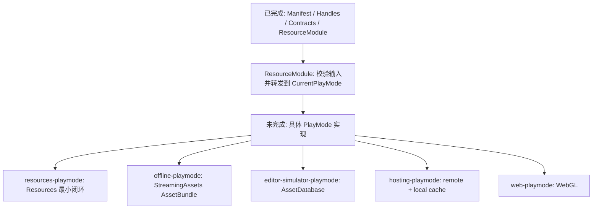

## 问题与范围

**[已过期]** 资源模块剩余 PlayMode feature 已在 `2026-05-22-resource-playmodes` 中实现；本文只保留为实现前状态的证据。

问题：当前资源模块还有哪些 feature 没有实现？

范围：只看资源模块 roadmap、已落地的 `Runtime/Resource` 代码、资源相关 feature 验收记录和架构记录；不评估 `DownloadModule`、`FileSystem` 等外部模块本身是否完整。

## 速答

当前资源模块已完成的是基础骨架：清单模型、Handle 核心、PlayMode / Provider 契约、`ResourceModule` 门面。还没有实现的是所有具体运行模式和真实加载链路：

- `resources-playmode`：Unity `Resources` 最小加载闭环，仍是 `planned`，也是 roadmap 标记的 `minimal_loop`。
- `offline-playmode`：从 `StreamingAssets` 加载 AssetBundle，仍是 `planned`。
- `editor-simulator-playmode`：Editor 下通过 `AssetDatabase` 按清单加载，仍是 `planned`。
- `hosting-playmode`：面向 hotfix 的远端资源 + 本地缓存加载，仍是 `planned`。
- `web-playmode`：WebGL 平台可用的加载模式，仍是 `planned`。

这些未实现项意味着目前 `Super.Resource.LoadAssetAsync(...)` 只有门面和接口转发能力；除非外部手动提供一个自定义 `IResourcePlayMode` 实现，否则资源模块本身还不能端到端加载真实资源。

## 关键证据

- `.codestable/roadmap/resource-management/resource-management-items.yaml:37`：`resources-playmode` 状态为 `planned`，`minimal_loop: true`，说明最小可运行闭环尚未启动。
- `.codestable/roadmap/resource-management/resource-management-items.yaml:45`：`offline-playmode` 状态为 `planned`，`feature: null`。
- `.codestable/roadmap/resource-management/resource-management-items.yaml:53`：`editor-simulator-playmode` 状态为 `planned`，`feature: null`。
- `.codestable/roadmap/resource-management/resource-management-items.yaml:61`：`hosting-playmode` 状态为 `planned`，`feature: null`。
- `.codestable/roadmap/resource-management/resource-management-items.yaml:69`：`web-playmode` 状态为 `planned`，`feature: null`。
- `Assets/GameDeveloperKit/Runtime/Resource/ResourceModule.cs:27`：`ResourceModule` 只通过 `SetPlayMode(IResourcePlayMode)` 挂载运行模式。
- `Assets/GameDeveloperKit/Runtime/Resource/ResourceModule.cs:38`：加载 API 校验后直接转发到 `GetPlayMode().LoadAssetAsync(location)`，模块自身不做真实加载。
- `Assets/GameDeveloperKit/Runtime/Resource/IResourceProvider.cs:5`：当前只存在 Provider 接口契约，没有发现具体 Provider / PlayMode 实现类。

## 细节展开

roadmap 第 5 节把资源系统拆为 9 个子 feature。前 4 个已经完成：`resource-manifest-model`、`resource-handle-core`、`resource-playmode-provider-contract`、`resource-module-api`。后 5 个全部是具体 PlayMode 实现，当前都仍是 `planned`。

代码侧与 roadmap 一致：`Runtime/Resource` 下只有模型、Handle、接口和 `ResourceModule`。反向搜索没有发现 `ResourcesPlayMode`、`OfflinePlayMode`、`EditorSimulatorPlayMode`、`HostingPlayMode`、`WebPlayMode` 这些类；也没有在资源模块内发现 `Resources.Load`、`AssetBundle`、`AssetDatabase`、`StreamingAssets`、`UnityWebRequest` 等真实加载 API 使用。

已完成 feature 的验收记录也把这些能力明确排除在当次范围外：`resource-module-api` 只做门面，不实现具体 PlayMode 或 Provider；`resource-playmode-provider-contract` 只定义接口，不实现真实资源加载、缓存、引用计数或 provider 注册表；`resource-handle-core` 只定义句柄，不负责真实卸载或 raw 转换策略。

## 未决问题

- `resources-playmode` 设计时需要确认是否按 location 直接映射 `Resources.LoadAsync` 路径，还是必须依赖 `ResourceManifest` 的 `AssetPath`。
- raw asset 的 byte[] / string 转换策略仍未设计；当前 `RawAssetHandle` 只是继承 `AssetHandle`。
- scene 加载 / 激活 / 卸载策略仍未设计；当前 `SceneAssetHandle` 只保存 scene 句柄信息。
- provider 注册表、缓存、引用计数、package manifest 读取和 bundle 依赖加载顺序仍未落地。

## 后续建议

下一步优先做 `resources-playmode`，因为它是 roadmap 标记的最小闭环，完成后 `Super.Resource.LoadAssetAsync(location)` 才能通过内置实现跑通真实资源加载。

## 相关文档

- `.codestable/roadmap/resource-management/resource-management-roadmap.md`
- `.codestable/roadmap/resource-management/resource-management-items.yaml`
- `.codestable/features/2026-05-21-resource-module-api/resource-module-api-acceptance.md`
- `.codestable/features/2026-05-21-resource-playmode-provider-contract/resource-playmode-provider-contract-acceptance.md`
- `.codestable/architecture/ARCHITECTURE.md`
