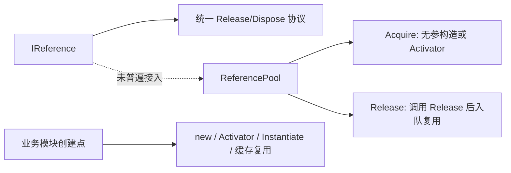

## 问题与范围

问题：项目已经实现了 `ReferencePool`，但业务代码中是否还有很多地方没有使用它？

范围：只检查 `Assets/GameDeveloperKit/Runtime` 和相关 CodeStable 记录；不评估 UnityGameFramework 包里的另一套 ReferencePool。

## 速答

是的。当前 `GameDeveloperKit` 自己的业务模块基本没有接入 `ReferencePool`：源码中除 `ReferencePool.cs` 自身外，没有业务侧 `ReferencePool.` 调用。当前更准确的状态是：`IReference` 已作为统一释放协议广泛存在，但 `ReferencePool` 尚未成为统一创建 / 回收通道。

这不代表所有 `IReference` 都应该立刻改成池化。当前很多实现者依赖构造参数、Unity `Instantiate`、模块级缓存或异步状态源，和 `ReferencePool` 当前的“无参构造 + Release 后入队”模型不完全匹配。强行替换有较高语义风险。

## 关键证据

- `Assets/GameDeveloperKit/Runtime/Core/ReferencePool.cs:64` 到 `Assets/GameDeveloperKit/Runtime/Core/ReferencePool.cs:91`：`ReferencePool` 已提供 `Acquire<T>()`、`Acquire(Type)` 和 `Release(IReference)`，但精确 grep `ReferencePool.` 在业务源码中无命中。
- `Assets/GameDeveloperKit/Runtime/Core/ReferencePool.cs:249` 到 `Assets/GameDeveloperKit/Runtime/Core/ReferencePool.cs:286`：池创建对象依赖 `new T()` 或 `Activator.CreateInstance(m_ReferenceType)`，天然偏向无参构造类型。
- `Assets/GameDeveloperKit/Runtime/Core/IReference.cs:8` 到 `Assets/GameDeveloperKit/Runtime/Core/IReference.cs:15`：`IReference` 本身只约定 `Release()` / `Dispose()`，没有要求对象必须从池中获取或归还。
- `Assets/GameDeveloperKit/Runtime/Event/EventModule.cs:63` 到 `Assets/GameDeveloperKit/Runtime/Event/EventModule.cs:103`：事件订阅句柄直接 `new Subscription(...)`，而 `Subscription` 构造函数需要 `EventModule` 和 `Listener`。
- `Assets/GameDeveloperKit/Runtime/Timer/TimerModule.cs:175` 到 `Assets/GameDeveloperKit/Runtime/Timer/TimerModule.cs:196`：Timer 句柄通过带参数构造创建，`TimerDelayHandle` 等类型还持有 readonly 回调字段，不适合直接按无参池化替换。
- `Assets/GameDeveloperKit/Runtime/UI/UIModule.cs:286` 到 `Assets/GameDeveloperKit/Runtime/UI/UIModule.cs:294`：UI 窗口生命周期同时包含 prefab `Instantiate` 和 `Activator.CreateInstance<T>()` 创建窗口对象，池化窗口对象不能绕过 Unity GameObject / UIDocument 生命周期。
- `.codestable/features/2026-05-26-operationmodule-completion/operationmodule-completion-design.md:222` 与 `.codestable/features/2026-05-26-operationmodule-completion/operationmodule-completion-acceptance.md:137`：历史 feature 已明确把 OperationHandle 池化列为“后续性能评估”，未纳入当时实现。
- `.codestable/audits/2026-06-09-runtime-flow-modules/finding-03.md:16` 到 `.codestable/audits/2026-06-09-runtime-flow-modules/finding-03.md:32`：历史审计已指出 `ArgsBase` 直接池化会保留 consumed 状态，说明现有释放语义还不完全满足安全复用。

## 细节展开

当前项目里有两层概念容易混在一起：

1. `IReference` 是生命周期协议：对象可以被 `Release()`，并且 `Dispose()` 默认转发到 `Release()`。
2. `ReferencePool` 是复用容器：负责创建、缓存、重复取用实现了 `IReference` 的对象。

现在大多数模块只用了第 1 层。例如 Event、Timer、UI、Operation、Resource、Network、Sound 等都有 `IReference` 实现者，但创建方式仍是各模块自己控制：`new`、`Activator.CreateInstance`、Unity `Object.Instantiate`，或 provider 内部缓存。

比较适合后续优先评估池化的方向：

- OperationHandle：创建频繁、类对象、已有 `Release()` reset 语义雏形，但历史记录要求另起性能评估。
- 事件参数 ArgsBase：理论上适合短生命周期池化，但必须先修 reset 语义，否则会复用已 consumed 的实例。
- 简单订阅句柄 Subscription / MessageSubscription：对象小、生命周期明确，但当前构造函数带参数，需要先设计 `Initialize(...)` / `Reset()` 模式。

不建议直接改的方向：

- UI 窗口：窗口对象绑定 Unity prefab、GameObject、UIDocument，池化要和 Unity 对象复用策略一起设计。
- ResourceHandle：provider 已有 handle 缓存和待卸载列表，池化失败 handle / 成功 handle 可能和资源缓存语义冲突。
- TimerHandle：当前句柄大量字段在构造期固定，部分回调字段是 readonly，直接池化需要重塑类型初始化方式。
- SoundHandle：内部有完成源和模块回调，释放会触发 Stop，复用前需要明确完成源是否每轮重建。

## 未决问题

- `ReferencePool.Release()` 当前在生产构建下的重复释放策略已被审计记录为高风险；在扩大使用前应先修这个安全问题。
- 是否要让 `IReference` 增加更明确的复用生命周期，例如 `OnAcquire` / `OnRelease` 或 `Reset`，还没有项目级决策。
- 是否允许带参数初始化对象进入池，需要新的接口或工厂约定；当前 `ReferencePool` API 不支持。

## 后续建议

先不要大面积替换。更稳的路径是先修 `ReferencePool` 自身安全性，再选一个小而高频的对象族做试点，例如 OperationHandle 或事件参数。

## 相关文档

- `.codestable/audits/2026-06-25-framework-full/finding-11.md`
- `.codestable/audits/2026-06-09-runtime-flow-modules/finding-03.md`
- `.codestable/features/2026-05-26-operationmodule-completion/operationmodule-completion-design.md`
- `.codestable/features/2026-05-26-operationmodule-completion/operationmodule-completion-acceptance.md`
