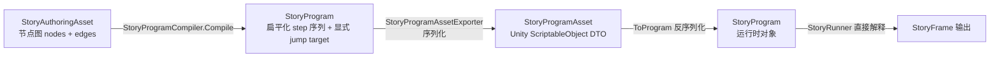

# 速答

**编译只发生一次（Editor 端），运行时不做还原。** 整个链路是单向的：



- **编译（Editor）**：`StoryProgramCompiler` 把节点图的拓扑（edges connecting nodes）解析为每个 step 的显式 `StoryTarget` 跳转引用。Parallel/Merge/Choice 等结构化控制流也在此时扁平化。
- **导出**：编译结果通过 DTO 映射写入 `StoryProgramAsset`（Unity ScriptableObject），全部是值类型的序列化数据。
- **运行时加载**：`StoryProgramAsset.ToProgram()` 只是 DTO → 运行时类型的**反序列化**，不做图重建、不做重新编译。
- **运行时执行**：`StoryRunner` 是一个简单的**顺序解释器**——读 step、按 kind 分发、有 target 就 `JumpTo`、没 target 就 `AdvanceSequential`。全量逻辑在 `ResolveFrameUntilStop()` 的 while 循环里完成。

结论：不存在"运行时再还原一次"的流程。`ToProgram()` 是纯数据的反序列化，不是图还原。

---

# 关键证据

## 1. 编译入口：图 → 扁平 program

**文件**: `Assets/GameDeveloperKit/Editor/StoryEditor/Compiler/StoryProgramCompiler.cs:15-40`

```csharp
public static StoryProgram Compile(StoryAuthoringAsset asset, out StoryValidationReport report)
{
    // ... 校验 ...
    var chapters = new List<StoryChapter>();
    for (var i = 0; i < asset.Chapters.Count; i++)
    {
        var compiled = CompileChapter(asset.StoryId, chapter, ...);
        chapters.Add(compiled);
    }
    return new StoryProgram(storyId, version, entryChapterId, chapters, ...);
}
```

每个 chapter 的 nodes + edges 被 `CompileChapter` 处理，最终产出 `StoryProgram`（`StoryChapter` 包含有序 `StoryStep` 列表）。**图结构在此消解。**

## 2. 图拓扑消解：edge → StoryTarget

**文件**: `Assets/GameDeveloperKit/Editor/StoryEditor/Compiler/StoryProgramCompiler.cs:114-145` (BuildLineStep)

```csharp
// Line 节点的 completed 端口 → 直接编译成 step.Data.Target
target = FirstDirectTarget(node, outgoingEdges, chapterLookup, nodeLookup, report);
return new StoryStep(nodeId, StoryStepKind.Line,
    new StoryStepData(textKey: textKey, speaker: speaker, target: target, tags: tags));
```

每个 step 携带编译时生成的 `StoryTarget`（`StoryTarget.Step(chapterId, stepId)` / `StoryTarget.Chapter(chapterId)` / `StoryTarget.StoryEnd()`）。运行时不再需要遍历 edges。

## 3. 导出：编译结果写入 ScriptableObject DTO

**文件**: `Assets/GameDeveloperKit/Editor/StoryEditor/StoryProgramAssetExporter.cs:49-58`

```csharp
private static void Export(StoryProgram program, string outputPath)
{
    var asset = ...;
    asset.SetProgram(program);  // StoryProgram → DTO 序列化
    EditorUtility.SetDirty(asset);
    AssetDatabase.SaveAssets();
}
```

**文件**: `Assets/GameDeveloperKit/Runtime/Story/Program/StoryProgramAsset.cs:49-57`

```csharp
public void SetProgram(StoryProgram program)
{
    m_StoryId = program.StoryId;
    m_Chapters = ChapterData.FromList(program.Chapters);  // 运行时类型 → [SerializeField] DTO
    // ...
}
```

## 4. 运行时反序列化：DTO → 运行时类型（不是图还原）

**文件**: `Assets/GameDeveloperKit/Runtime/Story/Program/StoryProgramAsset.cs:62-70`

```csharp
public StoryProgram ToProgram()
{
    return new StoryProgram(
        m_StoryId, m_Version, m_EntryChapterId,
        ChapterData.ToList(m_Chapters),   // DTO → StoryChapter[]
        m_VariableSchema?.ToSchema(),
        m_CommandSchema?.ToSchema());
}
```

`ToProgram()` 是纯 DTO 映射——把 `[SerializeField]` 字段组装回 `StoryProgram` 对象。**没有任何图拓扑重建逻辑。**

## 5. 运行时解释：直接执行 step 序列

**文件**: `Assets/GameDeveloperKit/Runtime/Story/Runtime/StoryRunner.cs:155-195` (ResolveFrameUntilStop)

```csharp
private StoryFrame ResolveFrameUntilStop()
{
    while (!Completed)
    {
        var step = CurrentStep;
        switch (step.Kind)
        {
            case StoryStepKind.Start:  AdvanceSequential(); continue;
            case StoryStepKind.Branch: EvaluateCondition → JumpTo or AdvanceSequential; continue;
            case StoryStepKind.Jump:   JumpTo(step.Data.Target); continue;
            case StoryStepKind.Line:
            case StoryStepKind.Choice:
            case StoryStepKind.Command:
            case StoryStepKind.Wait:   return BuildFrame();  // 停住，等外部驱动
            case StoryStepKind.Parallel: return BuildParallelFrame(step);
            case StoryStepKind.Merge:  AdvanceFromCurrentStep(); continue;
            case StoryStepKind.End:    CompleteStory(); return;
        }
    }
}
```

`StoryRunner` 只是一个顺序状态机：按 step index 遍历，遇到交互步骤（Line/Choice/Command/Wait）就停住返回 `StoryFrame`，等外部调用 `Continue()`/`Select()`/`CompleteCommand()`/`Evaluate()` 后继续推进。

## 6. 加载入口：Register → Start

**文件**: `Assets/GameDeveloperKit/Runtime/Story/StoryModule.Program.cs:90-97`

```csharp
public StoryRunner Start(StoryProgram program, string chapterId = null)
{
    if (!m_Programs.ContainsKey(program.StoryId))
        Register(program);          // 存入字典
    return StartProgram(program.StoryId, chapterId);  // new StoryRunner(program) → runner.Start()
}
```

`StoryModule.Start()` 接收已反序列化的 `StoryProgram`，直接创建 `StoryRunner` 并启动。**流程中没有任何编译或还原步骤。**

---

# 后续建议

你的问题已经解答：运行时不需要还原节点图。如果你是想问"运行时是否能从 program 反推出原始图结构"——答案是不能，也不需要。`StoryProgram` 是执行格式，不是编辑格式。

需要基于这个结论做其他事吗（比如设计方案、修 bug）？
