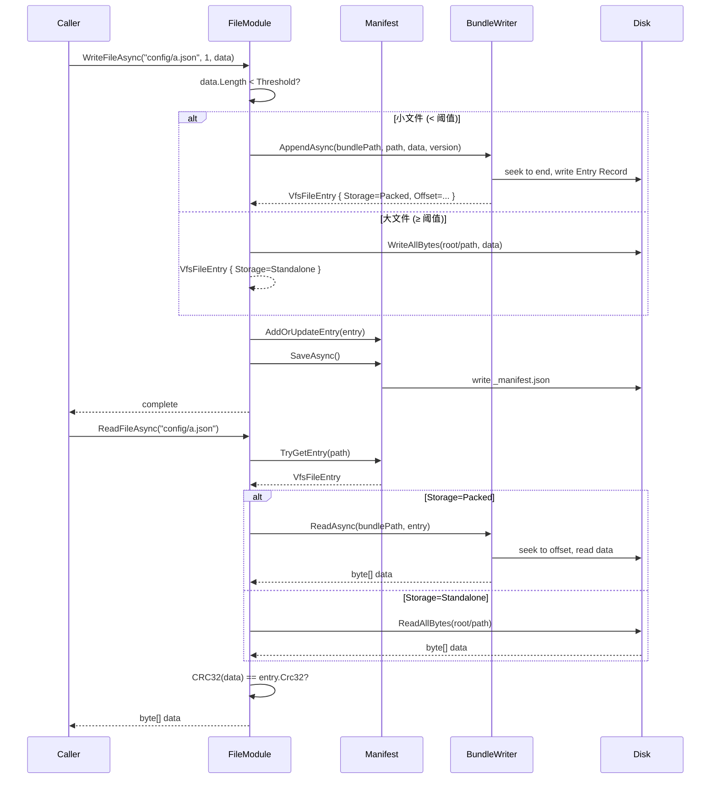

# virtual-file-system design

## 0. 术语约定

| 术语 | 定义 | 防冲突结论 |
|---|---|---|
| **VFS** | Virtual File System，本模块提供的虚拟文件抽象层 | Grep 无冲突，代码库中未出现过 |
| **包文件 (Bundle)** | 将多个低于阈值的小文件的二进制数据合并存储的单一物理文件（`.vfsb`） | — |
| **独立文件 (Standalone)** | 大小超过阈值、直接以原始文件形式写入磁盘的文件 | — |
| **清单 (Manifest)** | 记录所有文件元数据的 JSON 索引文件（`_manifest.json`） | — |
| **VfsFileEntry** | 单个文件在清单中的一条元数据记录：路径、CRC32、版本号、时间戳、存储位置等 | — |
| **阈值 (Threshold)** | 决定文件走打包还是独立存储的大小分界线，可配置，默认 4096 字节 | — |
| **FileModule** | 实现 `IGameModule` 的 VFS 模块入口，注册到 `Super.FileSystem` | 已存在于 `Super.cs` 前向引用，本次实现 |

## 1. 决策与约束

### 需求摘要

- **做什么**：实现 `FileModule`，提供虚拟文件系统读写能力。写入时，小于阈值的文件内容合并到一个 Bundle 文件中；大于等于阈值的文件以独立文件写入。每个文件记录 CRC32、单调递增版本号、Unix 时间戳，为后续版本控制提供可追溯的元数据。
- **为谁**：GameDeveloperKit 框架使用者，通过 `Super.FileSystem` 访问。
- **成功标准**：
  - 写入文件后能从 VFS 正确读回原始数据（CRC32 校验一致）
  - 小文件合并写入同一个 Bundle，大文件独立存储
  - 清单持久化，模块重启后元数据不丢失
- **明确不做什么**：
  - 不做增量更新 / diff / 补丁算法（留待后续版本控制 feature）
  - 不做多 Bundle 自动分片（首版单 Bundle）
  - 不做加密 / 压缩
  - 不做目录层级操作（mkdir / rmdir / 递归遍历），首版只支持扁平文件路径
  - 不做文件监控 / Watch / 热重载

### 复杂度档位

走"项目内部工具"默认组合（L2 + functions + reasonable + team + active + logged + testable），以下两项偏离：

- **健壮性 = L3**（偏离默认 L2，原因：文件系统数据损坏代价高，所有外部输入需校验，写操作需保证原子性）
- **结构 = modules**（偏离默认 functions，原因：模块涉及清单管理、Bundle 读写、主模块编排三类独立职责，拆文件更清晰）

其余维度走默认。

### 关键决策

1. **清单格式选 JSON**
   - 备选：自定义二进制格式。拒绝理由：首版优先可调试性，Newtonsoft.Json 已是项目依赖，文件数量不极端时 JSON 开销可接受。二进制格式留待后续 feature 优化。
   
2. **Bundle 内部格式用自定义二进制**
   - 备选：ZIP / Tar。拒绝理由：引入外部格式增加依赖和复杂度；自定义二进制零依赖、零开销、对打包/解包路径完全可控。

3. **阈值判定以文件写入时的数据长度为准，不区分文件类型**
   - 备选：按扩展名分类。拒绝理由：首版保持简单，阈值是纯尺寸策略，类型级策略可后续加配置。

4. **版本号由调用方显式传入，模块原样记录**
   - `WriteFileAsync(path, version, data)` 中 version 为字符串类型（支持 `"1"` / `"1.0.1"` 等），由调用方指定，模块不自动递增。`Exists(path, version)` 中 version 为空字符串时匹配任意版本，非空时精确字符串匹配当前条目 Version。

5. **模块根目录固定为 `Application.persistentDataPath + "/vfs"`**
   - 不可配置，内部确定。Bundle 文件和清单存储在根目录下；独立文件以相对路径存储在根目录内。

### 前置依赖

无。目标目录 `Assets/GameDeveloperKit/Runtime/FileSystem/` 为空，`FileModule` 类型未定义，无阻塞性前置工作。

## 2. 名词与编排

### 2.1 名词层

**现状**：无。`FileModule` 在 `Super.cs:47` 有前向引用但类型未定义。`IGameModule`（`Core/IGameModule.cs`）和 `IReference`（`Core/IReference.cs`）定义了模块生命周期契约。

**变化**：新增 6 个类型，全部落在 `Assets/GameDeveloperKit/Runtime/FileSystem/`。

#### VfsFileEntry — 文件元数据

```csharp
// 来源：新文件 FileSystem/VfsFileEntry.cs
public class VfsFileEntry : IReference
{
    public string VirtualPath;       // VFS 内路径，如 "config/settings.json"
    public StorageType Storage;      // Packed | Standalone
    public string BundleName;        // 所在 Bundle 文件名（仅 Packed），如 "bundle_0.vfsb"
    public long Offset;              // 在 Bundle 中的字节偏移（仅 Packed）
    public long Size;                // 文件数据字节数
    public uint Crc32;               // CRC32 校验值
    public string Version;            // 版本号（字符串，如 "1" / "1.0.1"）
    public long Timestamp;           // Unix 时间戳（秒）
    public FileFlags Flags;          // 位标记（预留：Deleted=1, 后续可扩展）
}
```

- `StorageType` 枚举：`Packed`（存入 Bundle）、`Standalone`（独立文件）
- `FileFlags` 枚举：`None = 0`，`Deleted = 1 << 0`（软删除标记）
- 实现 `IReference` 以复用 `ReferencePool`

#### VfsManifest — 清单管理

```csharp
// 来源：新文件 FileSystem/VfsManifest.cs
public class VfsManifest
{
    // 加载：从 {root}/_manifest.json 反序列化
    public static UniTask<VfsManifest> LoadAsync(string rootPath);
    // 保存：序列化到 {root}/_manifest.json
    public UniTask SaveAsync();

    public bool TryGetEntry(string virtualPath, out VfsFileEntry entry);
    public void AddOrUpdateEntry(VfsFileEntry entry);
    public bool RemoveEntry(string virtualPath);
    public IEnumerable<VfsFileEntry> GetAllEntries();
    public int FileCount { get; }
}
```

清单 JSON 结构示例：

```json
{
  "files": {
    "config/settings.json": {
      "storage": "Packed",
      "bundleName": "bundle_0.vfsb",
      "offset": 0,
      "size": 256,
      "crc32": 3984776732,
      "version": 3,
      "timestamp": 1715961600,
      "flags": 0
    },
    "textures/large_atlas.png": {
      "storage": "Standalone",
      "size": 2097152,
      "crc32": 2187892134,
      "version": 1,
      "timestamp": 1715961600,
      "flags": 0
    }
  }
}
```

#### VfsBundleWriter / VfsBundleReader — Bundle 读写

```csharp
// 来源：新文件 FileSystem/VfsBundleWriter.cs
public static class VfsBundleWriter
{
    // 追加数据到 Bundle 末尾，返回写入后的 FileEntry
    public static UniTask<VfsFileEntry> AppendAsync(
        string bundlePath, string virtualPath, byte[] data, int version);
}

// 来源：新文件 FileSystem/VfsBundleReader.cs
public static class VfsBundleReader
{
    // 从 Bundle 中读取指定偏移和大小的数据
    public static UniTask<byte[]> ReadAsync(string bundlePath, VfsFileEntry entry);
}
```

Bundle 二进制格式（`.vfsb`）：

```
[Header 32 bytes]
  Magic:   4 bytes  "VFSB"
  Version: 4 bytes  (bundle format version = 1)
  Flags:   4 bytes  (reserved)
  Reserved: 20 bytes

[Entry Record] (每条固定头 + 可变 Path + 可变 Version)
  DataSize:      8 bytes  (数据字节数)
  Crc32:         4 bytes  (数据 CRC32)
  VersionLength: 2 bytes  (版本号 UTF8 字节数)
  Version:       N bytes  (UTF8 版本号)
  Timestamp:     8 bytes  (Unix 时间戳)
  PathLength:    2 bytes  (路径 UTF8 字节数)
  Path:          N bytes  (UTF8 虚拟路径)
  Data:          M bytes  (原始文件数据)

条目之间紧密排列，无填充。
```

- 写入 = 在文件末尾追加一条 Entry Record
- 读取 = 根据 VfsFileEntry.Offset seek 到 Entry Record 起始位置，解析头后读取 Data
- 删除 = 不在 Bundle 层面处理，由 Manifest 中 VfsFileEntry.Flags 的 Deleted 位标记

#### VfsConstants

```csharp
// 来源：新文件 FileSystem/VfsConstants.cs
public static class VfsConstants
{
    public const int DefaultThreshold = 4096;          // 4KB
    public const string ManifestFileName = "_manifest.json";
    public const string BundleExtension = ".vfsb";
    public const uint BundleMagic = 0x42534656;        // "VFSB" little-endian
    public const int BundleFormatVersion = 1;
}
```

#### FileModule — 模块入口

```csharp
// 来源：新文件 FileSystem/FileModule.cs
public class FileModule : IGameModule
{
    // -- 核心 API --
    // 写入文件（自动判定打包/独立，version 字符串由调用方指定）
    public UniTask WriteFileAsync(string path, string version, byte[] data);
    // 读取文件
    public UniTask<byte[]> ReadFileAsync(string path);
    // 检查文件是否存在（非软删除状态。version 为空字符串时匹配任意版本，非空时匹配指定版本）
    public bool Exists(string path, string version = "");
    // 删除文件（软删除，标记 Deleted 位）
    public UniTask DeleteFileAsync(string path);
    // 查询文件元数据
    public VfsFileEntry GetFileInfo(string path);
    // 列举所有非删除文件
    public IEnumerable<VfsFileEntry> ListFiles();

    // IGameModule
    public UniTask Startup();   // 加载清单、确保根目录和 Bundle 存在
    public UniTask Shutdown();  // 保存清单
    public void Release();      // IReference
}
```

### 2.2 编排层

#### 主流程图



#### 现状

无。`FileModule` 类型未定义，`FileSystem/` 目录为空。

#### 变化

**WriteFileAsync 流程**：

1. 校验 `path` 非空且格式合法（不为空、不以 `/` 开头、不含 `..`）
2. 计算 `CRC32(data)`
3. 判定 `data.Length < Threshold`：
   - **小文件**：调用 `VfsBundleWriter.AppendAsync()`，在 Bundle 末尾追加 Entry Record，返回包含 offset 的 `VfsFileEntry`
   - **大文件**：`File.WriteAllBytesAsync(rootPath + "/" + path, data)`，构造 `Storage=Standalone` 的 `VfsFileEntry`
4. 将调用方传入的 `version` 写入 `VfsFileEntry`
5. 更新 Manifest 并 `SaveAsync()` 持久化（同名已存在则覆盖，旧数据在 Bundle 中保留不回收）

**ReadFileAsync 流程**：

1. `Manifest.TryGetEntry(virtualPath)` 获取元数据
2. 根据 `Storage` 类型读取数据：
   - Packed → `VfsBundleReader.ReadAsync()`
   - Standalone → `File.ReadAllBytesAsync()`
3. 计算读回数据的 CRC32，与 `entry.Crc32` 比对，不匹配则抛 `GameException`
4. 返回数据

**DeleteFileAsync 流程**：

1. Manifest 中标记 `Flags |= Deleted`
2. 不删除 Bundle 中的实际数据（延迟到后续 Compact 操作回收）
3. 独立文件：删除物理文件
4. `SaveAsync()` 持久化清单

#### 流程级约束

| 约束 | 说明 |
|---|---|
| **错误语义** | 路径不存在 → 返回 null（Read）/ 不抛异常；数据校验失败 → 抛 `GameException`；参数非法 → 抛 `ArgumentNullException` / `ArgumentException` |
| **幂等性** | `WriteFileAsync` 同一路径多次写入 = 覆盖更新（Manifest 中替换为新条目），版本由调用方指定；`DeleteFileAsync` 重复删除 = 无操作 |
| **并发** | 首版不做并发控制。所有公开 API 假定在主线程调用，或由调用方自行同步。内部不引入锁。（备注：后续若需多线程安全，可在 `FileModule` 层加 `SemaphoreSlim`，不影响名词层） |
| **原子性** | WriteFileAsync 尽力保证：先写数据（Bundle 或独立文件）→ 再更新清单。如果数据写入成功但清单保存失败，下次 Startup 时清单与实际数据不一致。首版不做 WAL / 两阶段提交。 |
| **扩展点** | Threshold 可配置；Bundle 格式版本号预留升级路径；VfsFileEntry.Flags 位标记预留扩展 |

### 2.3 挂载点清单

| # | 挂载位置 | 动作 |
|---|---|---|
| 1 | `Super.FileSystem`（`Super.cs:47`） | `FileModule` 实现 `IGameModule` 后，`Super.Get<FileModule>()` 自动返回实例 |
| 2 | 模块注册：`Super.s_Modules` | `FileModule` 构造时调用 `Super.Register(this)` |
| 3 | 清单文件：`{root}/_manifest.json` | VFS 根目录下的持久化索引，`FileModule.Startup()` 时加载 |

共 3 条。纯内部能力增强，不引入外部系统挂入点。

### 2.4 推进策略

1. **名词层落盘** — 定义所有类型、接口签名、枚举，编译通过
   - 退出信号：`VfsFileEntry`、`VfsManifest`、`VfsBundleWriter`、`VfsBundleReader`、`VfsConstants`、`FileModule` 六个文件存在且编译零错误

2. **Bundle 读写（计算节点）** — 实现 `VfsBundleWriter.AppendAsync` 和 `VfsBundleReader.ReadAsync` 的二进制读写逻辑
   - 退出信号：单元测试覆盖"写入→读回→CRC32 一致"、"空数据写入"、"跨条目边界读取"三条路径

3. **FileModule 编排骨架** — 实现 `WriteFileAsync` / `ReadFileAsync` / `DeleteFileAsync`，接通 Manifest 和 Bundle 读写
   - 退出信号：端到端测试覆盖"写入小文件→读回"、"写入大文件→读回"、"修改已有文件版本递增"、"删除后读取返回 null"

4. **清单持久化与模块生命周期** — 实现 `Startup`（加载清单）和 `Shutdown`（保存清单），模块重启后数据不丢
   - 退出信号：写入若干文件 → Shutdown → 新实例 Startup → 读回数据一致

5. **测试覆盖** — 补齐关键场景清单（见第 3 节）的所有剩余条目
   - 退出信号：所有验收场景有可观察证据（单元测试或手动验证记录）

### 2.5 结构健康度与微重构

##### 评估

- **文件级** — 本次不修改现有文件。`Super.cs` 已有 `FileModule` 前向引用，无需改动。
- **目录级** — `Assets/GameDeveloperKit/Runtime/FileSystem/` 当前仅有 `.meta` 文件（0 个 `.cs` 文件）。本次新增约 6 个文件，远未达到摊平阈值（≥8），且文件职责分组清晰（Entry / Manifest / Bundle / Module / Constants），无明显可分组前缀。

##### 结论：不做

原因：目标目录为空，无现有文件需要拆解；新增文件数量可控，无迫近的摊平风险。

## 3. 验收契约

### 关键场景清单

| # | 场景 | 输入 / 触发 | 期望可观察结果 |
|---|---|---|---|
| N1 | 小文件写入与读回 | `WriteFileAsync("a.txt", "1", new byte[100])` → `ReadFileAsync("a.txt")` | 读回 100 字节，CRC32 一致，Manifest 中 `Storage=Packed`, `Version="1"` |
| N2 | 大文件独立存储 | `WriteFileAsync("b.bin", "1", new byte[5000])`（阈值 4096） | 根目录下存在 `b.bin` 独立文件，Manifest 中 `Storage=Standalone`，不在 Bundle 中 |
| N3 | 覆盖写入 | 写入 `("a.txt", "1", data1)` → 再写入 `("a.txt", "2", data2)` | 第二次写入后 `Version="2"`，CRC32 更新为 data2 的校验值，Manifest 中只保留最新条目 |
| N4 | 读取不存在文件 | `ReadFileAsync("no_such.txt")` | 返回 null，不抛异常 |
| N5 | 删除后读取/Exists | `DeleteFileAsync("a.txt")` → `ReadFileAsync("a.txt")` + `Exists("a.txt")` | Read 返回 null，Exists 返回 false，Manifest 中 `Flags` 含 `Deleted` |
| N6 | Exists 任意版本 | 写入后 `Exists("a.txt")`；未写入 `Exists("x.txt")` | 前者 true，后者 false |
| N7 | Exists 指定版本 | 写入 `("a.txt", "1.0.1", data1)` → `Exists("a.txt", "1.0.1")` | 返回 true |
| N8 | Exists 指定版本不匹配 | 写入 `("a.txt", "1", data1)` → 覆盖写入 `("a.txt", "2", data2)` → `Exists("a.txt", "1")` | 返回 false（Manifest 仅保留最新版本 "2"） |
| B1 | 阈值边界值 | `WriteFileAsync("edge.bin", "1", new byte[4096])`（阈值=4096） | 4096 ≥ 阈值 → `Storage=Standalone`；4095 → `Storage=Packed` |
| B2 | 空文件写入 | `WriteFileAsync("empty.dat", "1", new byte[0])` | 正常写入，CRC32=0，读回空数组 |
| B3 | 非法路径 | `WriteFileAsync("../escape.txt", "1", data)` | 抛 `ArgumentException` |
| E1 | 数据完整性校验失败 | 手动修改 Bundle 文件中某条数据 → `ReadFileAsync` | 抛 `GameException`（CRC32 不匹配） |
| E2 | 清单持久化 | 写入文件 → Shutdown → 新 FileModule → Startup → 读取 | 读回数据一致，版本号和 CRC32 不变 |

### 明确不做的反向核对项

- 代码中不应出现加密 / 压缩相关调用（`System.Security.Cryptography`、`System.IO.Compression`）
- 代码中不应出现目录递归遍历、`mkdir` / `rmdir` 逻辑
- 清单文件仅一份 `_manifest.json`，不应出现多 Bundle 分片逻辑
- 不应出现 diff / patch / 增量更新算法

## 4. 与项目级架构文档的关系

本 feature 是 FileSystem 子系统的首次实现。当前 `architecture/ARCHITECTURE.md` 为骨架占位，acceptance 阶段应回写：

- **名词**：`FileModule`、`VfsFileEntry`、`VfsManifest` 作为 FileSystem 子系统的核心类型，写入 ARCHITECTURE.md 的"子系统 / 模块索引"节
- **流程级约束**：错误语义（CRC32 校验）、幂等性写入规则 可提炼为 FileSystem 子系统的约束
- 关联文档：`architecture/file-vfs.md`（acceptance 后可新建，描述 FileSystem 子系统架构）

纯模块内部不可见的类型（`VfsBundleWriter`、`VfsBundleReader`、`VfsConstants`）不提炼到架构层。
