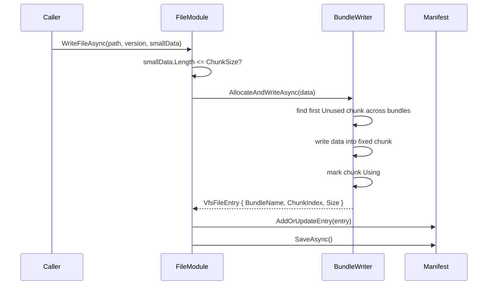

# bounded-vfs-bundles design

## 0. 术语约定

| 术语 | 定义 | 防冲突结论 |
|---|---|---|
| **Chunk** | Bundle 内固定大小的数据槽位，一个小文件占用一个 chunk | 新概念，替代现有 append-only record |
| **Chunk 状态** | chunk 的占用状态：`Unused` / `Using` | 用户原始描述为 `unuse/useing`，代码命名采用 C# 枚举风格 |
| **Chunk 大小** | 单个 chunk 可容纳的最大小文件字节数，默认沿用小文件阈值 4096 字节 | 大于 chunk 大小的文件走 Standalone |
| **Chunk Bundle** | 一个 `.vfsb` 文件，包含固定 header + 10 个固定大小 chunk | 替代"单 bundle 无限追加"策略 |

## 1. 决策与约束

### 需求摘要

- **做什么**：把当前"小文件追加写入 bundle 尾部"改为"Bundle 内预置 10 个固定大小 chunk，写入时寻找 `Unused` chunk 覆盖写入并标记为 `Using`"。
- **为谁**：GameDeveloperKit 的 VFS 使用者，主要解决长期运行时 append-only 导致 bundle 无限膨胀的问题。
- **成功标准**：
  - 每个 Bundle 物理容量固定：10 个 chunk，每个 chunk 固定大小。
  - 小于等于 chunk 大小的文件写入某个 `Unused` chunk，并在 manifest 中记录 `BundleName`、`ChunkIndex`、真实 `Size`。
  - 大于 chunk 大小的文件按 Standalone 独立文件处理。
  - 删除 packed 文件后，原 chunk 状态恢复为 `Unused`，后续小文件可以复用该 chunk。
- **明确不做什么**：
  - 不做变长 record 追加写入。
  - 不做 compact（固定 chunk 已避免同一 bundle 内无限追加）。
  - 不做 Bundle 重平衡、迁移、合并。
  - 不做加密、压缩或 Bundle 格式升级。
  - 不改变大文件 Standalone 存储策略。

### 复杂度档位

走项目内部工具默认档位；偏离项：

- **健壮性 = L3**：chunk 状态与 manifest 必须保持一致，写入/删除失败时不能让 chunk 永久错误占用。
- **结构 = modules**：仍限制在 FileSystem 模块内部，不引入跨模块依赖。

### 关键决策

1. **Bundle 使用固定 chunk 布局，每个 Bundle 10 个 chunk**
   - 每个 chunk 固定大小，默认等于 `DefaultThreshold`（4096 字节）。
   - 单个文件真实大小记录在 manifest 的 `Size` 中，读取时只读真实长度。

2. **大于 chunk 的文件走 Standalone**
   - 判定从原来的 `data.Length < Threshold` 收敛为 `data.Length <= ChunkSize` 才可 packed。
   - 这避免一个文件跨多个 chunk，保持读写模型简单。

3. **Bundle 命名继续使用 `bundle_{index}.vfsb`**
   - 保持 `DefaultBundleName = "bundle_0"` 的兼容语义。
   - 所有现有 bundle 满了才创建下一个 bundle。

4. **Chunk 状态写在 Bundle header 区域，manifest 记录定位**
   - Bundle 内部需要持久保存每个 chunk 的 `Unused/Using` 状态。
   - `VfsFileEntry` 新增 `ChunkIndex`，读取时由 `BundleName + ChunkIndex + Size` 定位。

5. **覆盖/删除释放旧 chunk**
   - 同路径覆盖写入时，先为新数据分配 chunk 并写成功，再释放旧 packed entry 的 chunk，最后更新 manifest。
   - 删除 packed 文件时释放对应 chunk 并更新 manifest deleted 状态。

## 2. 名词与编排

### 2.1 名词层

**现状**：

- `VfsConstants` 定义 `DefaultThreshold = 4096` 与 `DefaultBundleName = "bundle_0"`，没有 chunk 概念。
- `VfsBundleWriter.AppendAsync` 采用 append-only record 格式。
- `VfsBundleReader.ReadAsync` 依赖 entry 的 `Offset` 跳到变长 record 位置读取。
- `VfsFileEntry.BundleName` 已存在，`Offset` 表示 record 起始偏移，但没有 `ChunkIndex`。
- `VfsManifest.GetAllEntries()` 可枚举 manifest 中所有 entry。

**变化**：

新增固定 chunk 名词，不改变对外 `FileModule` 读写 API：

```csharp
// VfsConstants
public const int DefaultChunkSize = 4096;
public const int DefaultBundleChunkCount = 10;
public const string BundleNamePrefix = "bundle_";
```

```csharp
public enum VfsChunkState
{
    Unused = 0,
    Using = 1
}
```

`VfsFileEntry` 增加 chunk 定位字段：

```csharp
public int ChunkIndex;
```

`FileModule` 内部新增可配置 chunk 大小与数量：

```csharp
public int ChunkSize { get; set; } // 默认 4096
public int BundleChunkCount { get; set; } // 默认 10
```

Bundle 二进制布局从 append-only record 调整为固定槽位：

```text
[Header]
  Magic / FormatVersion / ChunkSize / ChunkCount
  ChunkState[10]

[Chunk Data Area]
  chunk_0: 4096 bytes
  chunk_1: 4096 bytes
  ...
  chunk_9: 4096 bytes
```

### 2.2 编排层

#### 主流程图



#### 现状

小文件写入路径是线性的：`data.Length < m_Threshold` 后固定调用 `VfsBundleWriter.AppendAsync()`，向 bundle 尾部追加变长 record。删除和覆盖只改 manifest，旧 record 物理空间无法复用。

#### 变化

**WriteFileAsync packed 流程**：

1. 判定 `data.Length <= ChunkSize`，满足则走 packed，否则走 Standalone。
2. 若同路径已有 packed entry，暂存旧 entry，不能先释放。
3. 调用 Bundle Writer 在现有 bundle 中寻找第一个 `Unused` chunk；如果没有则创建下一个 bundle 并初始化 10 个 `Unused` chunk。
4. 将数据写入固定 chunk 起始位置，长度不足 chunk 的尾部可以保留旧字节或清零；读取只按 entry.Size 返回真实数据。
5. chunk 写成功后把状态更新为 `Using`。
6. 返回 `VfsFileEntry { Storage=Packed, BundleName, ChunkIndex, Size, Crc32, Version, Timestamp }`。
7. 如果存在旧 packed entry，释放旧 entry 对应 chunk 为 `Unused`。
8. 更新 manifest 并保存。

**ReadFileAsync 流程**：

- Packed entry 读取时根据 `BundleName + ChunkIndex` 计算 chunk 数据区偏移，读取 `entry.Size` 字节后做 CRC32 校验。

**DeleteFileAsync 流程**：

- Packed entry 删除时将对应 chunk 状态更新为 `Unused`，然后在 manifest 中标记 Deleted 并保存。

#### 流程级约束

| 约束 | 说明 |
|---|---|
| **兼容性** | 新 chunk 格式与旧 append-only bundle 格式不兼容；实现前需要决定是否迁移旧数据或仅支持新格式。当前方案默认后续实现会识别格式版本，不默读旧格式为新格式 |
| **幂等性** | 同路径覆盖写入成功后释放旧 chunk；新写入失败时旧 entry 和旧 chunk 保持可读 |
| **并发** | 继续沿用"首版不做并发控制"，不新增锁 |
| **错误语义** | `ChunkSize <= 0` 或 `BundleChunkCount <= 0` 应拒绝；`ChunkIndex` 越界应抛明确异常 |

### 2.3 挂载点清单

| # | 挂载位置 | 动作 |
|---|---|---|
| 1 | `FileModule.WriteFileAsync` 小文件分支 | 从 append-only 写入改为 chunk 分配写入 |
| 2 | `FileModule.DeleteFileAsync` packed 分支 | 删除时释放 chunk |
| 3 | `VfsBundleWriter` / `VfsBundleReader` | 从变长 record 读写改为固定 chunk 读写 |
| 4 | Manifest 中 `VfsFileEntry.BundleName + ChunkIndex + Size` | 作为 packed 数据定位信息 |

共 4 条。删除本 feature 时，需要恢复 append-only record 格式；由于 bundle 物理格式变更，不建议无迁移直接回滚已写入的数据文件。

### 2.4 推进策略

1. **名词层落盘** — 增加 `VfsChunkState`、`VfsFileEntry.ChunkIndex`、chunk 大小/数量常量
   - 退出信号：默认 chunk size=4096、chunk count=10；非法配置会被拒绝。

2. **Chunk Bundle 读写格式** — 改造 writer/reader，支持初始化 bundle、查找 `Unused` chunk、写入固定 chunk、按 chunk index 读取
   - 退出信号：写入一个小文件后 entry 记录 `ChunkIndex`，读取按 `ChunkIndex + Size` 返回原始数据。

3. **FileModule 编排接入** — 写入时按 `ChunkSize` 判定 packed/standalone；覆盖和删除时释放旧 chunk
   - 退出信号：删除 packed 文件后新写入小文件能复用已释放 chunk。

4. **验证与文档回写** — 验证 chunk 状态、边界、跨 bundle，并更新架构中 FileSystem 存储策略描述
   - 退出信号：验收契约全部通过，`ARCHITECTURE.md` 不再描述为 append-only 单 Bundle。

### 2.5 结构健康度与微重构

##### 评估

- **文件级**：`VfsBundleWriter.cs` / `VfsBundleReader.cs` 会从 append-only record 变为 chunk bundle 格式，职责仍是 bundle 物理读写；`FileModule.cs` 只保留编排，不承载 chunk header 细节。
- **目录级**：`Assets/GameDeveloperKit/Runtime/FileSystem/` 约 7 个 `.cs` 文件。新增 `VfsChunkState` 可放入 `VfsFileEntry.cs`，不需要新目录。

##### 结论：不做微重构

原因：chunk 读写是现有 BundleReader/Writer 的同职责替换，不需要先做只搬不改行为的结构调整。

##### 超出范围的观察

旧 append-only bundle 的迁移策略超出本设计当前范围。如果项目已有线上数据，需要在实现前补一条迁移/兼容方案；如果尚无真实数据，可以直接切换格式版本。

## 3. 验收契约

| # | 场景 | 输入 / 触发 | 期望可观察结果 |
|---|---|---|---|
| N1 | 小文件写入 chunk | 写入 `data.Length <= ChunkSize` 的文件 | entry 为 `Storage=Packed`，记录 `BundleName`、`ChunkIndex`、真实 `Size`，对应 chunk 状态为 `Using` |
| N2 | 10 个 chunk 填满首个 Bundle | 连续写入 10 个小文件 | 10 个 entry 的 `BundleName` 均为 `bundle_0.vfsb`，`ChunkIndex` 为 0-9 |
| N3 | 第 11 个小文件进入新 Bundle | 在 N2 后继续写入第 11 个小文件 | 第 11 个 entry 的 `BundleName` 为 `bundle_1.vfsb`，`ChunkIndex=0` |
| N4 | 删除释放 chunk | 删除 `bundle_0.vfsb` 中某个 packed 文件后再写入新小文件 | 新文件复用被释放的 `ChunkIndex`，chunk 状态重新为 `Using` |
| N5 | 覆盖释放旧 chunk | 覆盖写入同一路径小文件 | 新数据写入成功后旧 chunk 状态为 `Unused`，manifest 只指向新 chunk |
| N6 | 跨 Bundle 读取 | 分别读取 `bundle_0` 和 `bundle_1` 中的文件 | 都能读回原始数据，CRC32 校验通过 |
| B1 | chunk 大小边界 | 写入 `data.Length == ChunkSize` | 走 Packed；写入 `data.Length > ChunkSize` 走 Standalone |
| B2 | Standalone 不占 chunk | 写入多个大文件后再写小文件 | 大文件不改变任何 chunk 状态，小文件仍从可用 chunk 写入 |
| E1 | 非法配置 | 尝试设置 `ChunkSize <= 0` 或 `BundleChunkCount <= 0` | 抛 `ArgumentOutOfRangeException` 或拒绝该值 |
| E2 | ChunkIndex 越界 | manifest 中 packed entry 的 `ChunkIndex` 不在 `[0, BundleChunkCount)` | 读取抛明确异常，不读错数据 |

### 明确不做的反向核对项

- 不应出现 append-only record 写入。
- 不应出现单文件跨多个 chunk。
- 不应改变 Standalone 文件存储路径。
- 不应改变 public 读写 API 签名。

## 4. 与项目级架构文档的关系

实现验收后需要更新 `.codestable/architecture/ARCHITECTURE.md`：

- 存储策略从"小文件合并写入单一 append-only Bundle 文件"改为"小文件写入固定大小 chunk，每个 Bundle 10 个 chunk，删除/覆盖可复用 chunk"。
- 约束中补充"大于单 chunk 的文件走 Standalone；单文件不跨 chunk"。
