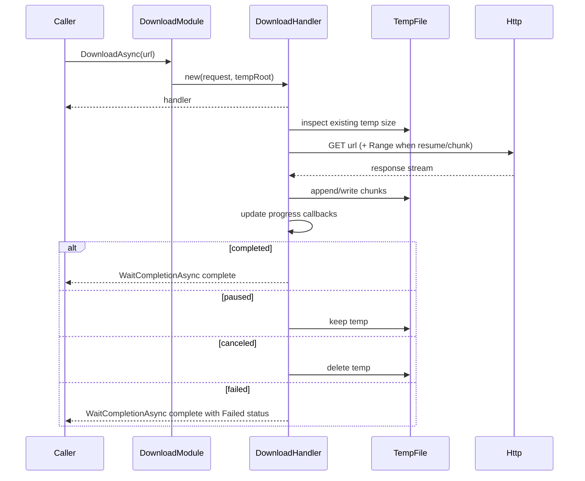

# download-module design

## 0. 术语约定

| 术语 | 定义 | 防冲突结论 |
|---|---|---|
| **DownloadModule** | GameDeveloperKit 下载模块入口，实现 `IGameModule`，通过 `Super.Download` 访问 | 当前 `Super.cs` 只有注释掉的 `DownloadManager` 前向引用；本 feature 统一改为 `DownloadModule` |
| **DownloadHandler** | 单文件下载控制柄，调用方通过它查询状态/进度、临时路径、暂停、恢复、取消、等待完成 | 与 `UnityEngine.Networking.DownloadHandler` 同名；实现内使用完整命名或别名，公共契约保留用户指定名称 |
| **DownloadListHandler** | 批量下载控制柄，聚合多个 `DownloadHandler`，提供整体状态、进度、回调和等待完成能力 | 代码库无现有冲突 |
| **临时文件** | 下载期间写入的 temp 文件，支持暂停后继续追加 | 用户要求下载期间落盘到 temp，不直接落盘 `FileModule` |
| **断点续传** | 基于已下载 temp 文件大小发起 HTTP Range 请求继续下载 | 仅在服务端支持 Range/206 时保证；不支持时按策略重新下载 |
| **分片下载** | 文件大于模块定义阈值时，按固定 chunk size 拆成多个 HTTP Range 请求下载，再合并为同一个 temp 文件 | 新增能力，仅用于单个大文件内部加速/稳定下载 |
| **失败恢复** | 下载因网络/IO 等可恢复错误进入 `Failed` 后，再次调用 `Resume()` 复用已有 temp 或 `.part` 文件继续下载 | 补齐失败文件恢复能力 |

## 1. 决策与约束

### 需求摘要

- **做什么**：新增下载模块，支持单文件下载、批量下载、断点续传、暂停、恢复、取消。单文件接口返回 `DownloadHandler`，批量接口返回 `DownloadListHandler`，模块级按 URL 查询和控制任务。
- **为谁**：GameDeveloperKit 框架使用者，通过 `Super.Download` 发起下载任务，并由业务层决定完成后是否写入 `FileModule`。
- **成功标准**：
  - 单文件下载可观察状态、进度、错误、temp 路径，可暂停/恢复/取消，可通过回调或 `UniTask` 等待完成。
  - 批量下载可聚合多个单文件任务，某个文件失败时继续下载其他文件，并能汇总成功/失败/取消结果。
  - 下载期间只写 temp；模块不主动写入 `FileModule`。
- **明确不做什么**：
  - 不做资源版本比对、清单解析、差分补丁、解压、校验业务 hash。
  - 不做自动落盘到 `FileModule`；完成后的 temp/final 文件如何导入 VFS 由调用方决定。
  - 不做动态分片大小调优、分片重试退避策略配置、跨进程分片任务恢复。
  - 不做下载队列优先级、限速、全局并发数配置；批量首版按列表顺序逐个执行。
  - 不做认证、Cookie 管理、自定义证书策略。

### 复杂度档位

走"项目内部工具"默认组合，以下维度偏离：

- **健壮性 = L3**：下载面对网络中断、文件 IO、取消/恢复等外部不稳定因素，失败路径必须有明确状态和可观察错误。
- **结构 = modules**：下载入口、单任务 handler、批量 handler、请求参数、结果/状态类型、temp 续传元数据需要分文件。
- **并发 = single-threaded orchestration**：首版假定公开 API 在 Unity 主线程调用；下载内部异步运行，不承诺线程安全。
- **兼容性 = current-only**：新增模块，无历史 API 兼容负担。

### 关键决策

1. **下载期间写入 temp，完成后从 handler 暴露本地文件路径**
   - temp 根目录默认 `Application.temporaryCachePath + "/downloads"`。
   - 单文件完成后通过 `DownloadHandler.TempPath` 读取；业务层可复制、移动、读取 byte[]，或自行写入 `FileModule`。

2. **断点续传基于 HTTP Range + temp 文件长度**
   - `DownloadHandler.Resume()` 根据 temp 文件已存在长度设置 `Range: bytes={length}-`。
   - 服务端返回 `206 Partial Content` 时追加写入；返回 `200 OK` 时清空 temp 重新下载。
   - 服务端不支持 Range 时，暂停后恢复会重新下载，不伪装成续传成功。
   - `Failed` 状态下的 `Resume()` 与 `Paused` 使用同一套断点逻辑：普通下载按 temp 文件长度续传，分片下载按已完成 `.part` 文件续传。

3. **大文件自动走分片下载**
   - 模块定义 `LargeFileThreshold` 和 `ChunkSize`，当响应 `Content-Length >= LargeFileThreshold` 且服务端支持 Range 时，切换到分片下载。
   - 分片下载以 `chunk index -> .part` 临时文件记录每片数据，全部完成后按 index 顺序合并为 `DownloadHandler.TempPath`。
   - 首版允许并发下载多个分片，但并发数为模块内部常量，不暴露配置 API。
   - 服务端不支持 Range 或无法获知总大小时，回退为单流下载。

4. **暂停与取消语义分离**
   - 暂停：中断当前网络请求，保留 temp 文件和元数据，状态为 `Paused`，允许 `Resume()`。
   - 失败：保留已写入 temp / `.part` 文件和错误信息，状态为 `Failed`，允许 `Resume()` 继续。
   - 取消：中断当前网络请求，删除 temp 文件和元数据，状态为 `Canceled`，不允许 `Resume()`。

5. **批量失败策略首版固定为继续其他任务**
   - 任一文件失败只更新对应 `DownloadHandler` 状态和错误，不阻断后续任务。
   - `DownloadListHandler` 只有在全部子任务进入终态后完成。

6. **模块级 URL 注册表是全局控制面**
   - `DownloadModule` 维护 `url -> DownloadHandler` 注册表，支持 `HasDownload` / `GetDownload` / `Pause` / `Resume` / `Cancel` / `CancelAll`。
   - 同一个 URL 重复调用 `DownloadAsync(url)` 时返回已有 handler，不创建并发重复下载。
   - 终态 handler 默认保留在注册表中，便于业务查询结果；取消会从注册表移除。

7. **handler 不直接暴露底层 Task**
   - 外部通过 `WaitCompletionAsync()` 等待完成，避免调用方拿到底层 task 后绕过 handler 生命周期。

## 2. 名词与编排

### 2.1 名词层

**现状**：

- `Assets/GameDeveloperKit/Runtime/Download/` 只有 `.meta` 文件，未实现下载模块。
- `Super.cs` 中有注释 `// public static DownloadManager Download => Get<DownloadManager>();`，未提供实际入口。
- 项目使用 `UniTask` 作为异步契约，模块生命周期由 `IGameModule.Startup/Shutdown/Release` 定义。

**变化**：新增下载子系统类型，落在 `Assets/GameDeveloperKit/Runtime/Download/`。

```csharp
public class DownloadModule : IGameModule
{
    public UniTask Startup();
    public UniTask Shutdown();
    public void Release();

    public DownloadHandler DownloadAsync(string url);
    public DownloadListHandler DownloadListAsync(params string[] urls);

    public UniTask Pause(string url);
    public UniTask Resume(string url);
    public UniTask Cancel(string url);
    public UniTask CancelAll();
    public bool HasDownload(string url);
    public DownloadHandler GetDownload(string url);
}
```

```csharp
public enum DownloadStatus
{
    None,
    Waiting,
    Downloading,
    Paused,
    Completed,
    Failed,
    Canceled
}
```

```csharp
public enum DownloadFailureKind
{
    None,
    Network,
    Timeout,
    HttpStatus,
    FileIO,
    InvalidResponse,
    Canceled
}
```

```csharp
public class DownloadHandler
{
    public string Url { get; }
    public string TempPath { get; }
    public bool IsChunked { get; }
    public int CompletedChunkCount { get; }
    public int TotalChunkCount { get; }
    public DownloadStatus Status { get; }
    public float Progress { get; }
    public long DownloadedBytes { get; }
    public long TotalBytes { get; }
    public string Error { get; }
    public DownloadFailureKind FailureKind { get; }

    public event Action<DownloadHandler> ProgressChanged;
    public event Action<DownloadHandler> Completed;
    public event Action<DownloadHandler> Failed;
    public event Action<DownloadHandler> Canceled;

    public UniTask WaitCompletionAsync();
    public UniTask Pause();
    public UniTask Resume();
    public UniTask Cancel();
}
```

内部新增分片元数据类型，不作为业务入口：

```csharp
internal sealed class DownloadChunk
{
    public int Index;
    public long Start;
    public long End;
    public string PartPath;
    public DownloadStatus Status;
}
```

```csharp
public class DownloadListHandler
{
    public IReadOnlyList<DownloadHandler> Items { get; }
    public DownloadStatus Status { get; }
    public float Progress { get; }

    public event Action<DownloadListHandler> ProgressChanged;
    public event Action<DownloadListHandler> Completed;

    public UniTask WaitCompletionAsync();
    public UniTask Pause();
    public UniTask Resume();
    public UniTask Cancel();
}
```

示例：

```csharp
var handler = Super.Download.DownloadAsync("https://example.com/a.bin");
handler.ProgressChanged += h => Debug.Log(h.Progress);
await handler.WaitCompletionAsync();
// handler.TempPath 由业务自行决定是否写入 FileModule
```

### 2.2 编排层

**现状**：无下载流程；`FileModule` 已提供 VFS，但本 feature 不与其直接耦合。

**变化**：下载任务由 handler 自驱动，模块创建后立即启动异步流程。



大文件分片下载流程：

1. `DownloadHandler` 先探测响应头，确认总大小和 Range 支持。
2. 总大小达到 `LargeFileThreshold` 且支持 Range 时，按 `ChunkSize` 生成 `DownloadChunk` 列表。
3. 每个分片用 `Range: bytes={start}-{end}` 下载到独立 `.part` 文件。
4. 全部分片完成后按 index 合并为 `TempPath`，再删除 `.part` 文件。
5. 暂停保留已完成 `.part` 文件；恢复时跳过已完成分片，只下载缺失分片。

失败恢复流程：

1. 普通下载失败时保留当前 temp 文件；`Resume()` 根据 temp 文件长度继续或重下。
2. 分片下载失败时保留已完成 `.part` 文件；`Resume()` 只调度缺失或长度不匹配的分片。
3. `Failed` → `Resume()` 会清空 `Error`，状态重新进入 `Waiting/Downloading`。
4. HTTP 4xx、URL 非法、分片长度不匹配等不可直接恢复错误仍进入 `Failed`；允许再次 `Resume()`，但如果外部条件未变化会再次失败。

批量下载流程：

1. `DownloadModule.DownloadListAsync(params string[] urls)` 为每个 URL 创建或复用 `DownloadHandler`。
2. `DownloadListHandler` 按顺序启动/等待每个子 handler。
3. 子 handler 成功、失败、取消都会保留自身状态、错误、temp 路径和字节数。
4. 单个失败不阻断列表；全部子任务终态后 `DownloadListHandler.WaitCompletionAsync()` 完成。

流程级约束：

- **错误语义**：参数非法抛 `ArgumentException` / `ArgumentNullException`；网络/IO 失败进入 `Failed` 并写入 `Error`，不让批量任务因单项异常提前中断。
- **幂等性**：`Pause()` 在非 `Downloading` 状态调用无副作用；`Cancel()` 多次调用最终仍为 `Canceled`；`Resume()` 只允许从 `Paused` / `Failed` 重新启动；模块级 URL 控制接口找不到任务时无副作用。
- **失败恢复语义**：`Failed` 不清理 temp / `.part` 文件；只有 `Cancel()` / `CancelAll()` 清理。业务可通过 `FailureKind` 决定是否提示用户重试。
- **进度语义**：`TotalBytes` 能从响应头获得时使用真实值；未知总大小时 `TotalBytes = -1`，`Progress` 可保持 0 或按已下载字节仅做事件通知。
- **temp 命名**：默认从 URL 最后一段推导文件名；无法推导时使用 URL hash，再附加 `.download` 作为下载中后缀，避免业务误读半成品。
- **URL 规范化**：`DownloadModule` 对 URL 做非空校验和 `Uri` 格式校验，注册表 key 使用原始 URL 字符串；首版不做大小写、query 参数或重定向后的 URL 归一化。
- **分片完整性**：分片完成条件以实际写入字节数等于 `End - Start + 1` 为准；合并前任一分片缺失或长度不匹配则进入 `Failed`。

### 2.3 挂载点

| # | 挂载点 | 说明 |
|---|---|---|
| 1 | `Super.Download` | 将下载模块注册为 GameDeveloperKit 的公开模块入口；删除后功能不可访问 |
| 2 | `Assets/GameDeveloperKit/Runtime/Download/` | 下载模块类型集中落点；删除该目录即拔除实现主体 |
| 3 | temp 下载目录 | `Application.temporaryCachePath/downloads` 保存断点续传临时数据；删除后续传能力消失 |

### 2.4 推进策略

1. **名词层落盘** — 定义 `DownloadStatus`、`DownloadHandler`、`DownloadListHandler`、`DownloadModule` 的公开契约。
   - 退出信号：类型和公开成员存在，项目可编译。
2. **单文件编排骨架** — `DownloadModule.DownloadAsync(string url)` 创建或复用 `DownloadHandler`，handler 能进入 Waiting/Downloading/Completed/Failed/Canceled 状态。
   - 退出信号：单文件 happy path 可下载到 temp 并通过 `WaitCompletionAsync()` 等待完成。
3. **暂停/失败恢复/取消计算节点** — 接入请求取消、temp 保留/删除、Range 恢复、Failed 状态重试。
   - 退出信号：暂停和失败保留 temp，恢复继续或重下，取消删除 temp。
4. **大文件分片编排** — 接入 `LargeFileThreshold`、`ChunkSize`、Range 分片下载、part 文件合并和缺片恢复。
   - 退出信号：大文件在 Range 支持时走分片路径，暂停后恢复只补缺失分片，完成后合并为单个 temp 文件。
5. **批量编排** — `DownloadListHandler` 顺序驱动多个子 handler，失败继续后续任务。
   - 退出信号：批量结果包含每个子任务终态，单项失败不阻断。
6. **回调与进度收口** — 补齐单文件/批量 ProgressChanged、Completed、Failed、Canceled 触发规则。
   - 退出信号：状态变化与 `WaitCompletionAsync()` 完成顺序稳定，重复调用不重复触发终态事件。
7. **验证覆盖** — 覆盖正常、暂停恢复、取消、失败继续、参数错误、Range 不支持、大文件分片等场景。
   - 退出信号：关键验收场景通过可运行验证。

### 2.5 结构健康度与微重构

- **compound convention 检查**：未命中关于目录组织、文件归属、命名约定的已有沉淀。
- **文件级**：`Super.cs` 只需从注释入口调整为 `DownloadModule` 入口，改动很小；`FileModule.cs` 不参与本 feature，不做微重构。
- **目录级**：`Assets/GameDeveloperKit/Runtime/Download/` 当前无 `.cs` 文件。本 feature 新增约 6 个类型文件，职责边界清晰，不需要再分子目录。
- **结论**：本次不做微重构，原因是目标目录为空、改动自然形成独立模块，`Super.cs` 挂载改动很小。

## 3. 验收契约

| ID | 场景 | 输入 / 触发 | 期望可观察结果 |
|---|---|---|---|
| N1 | 单文件下载成功 | `DownloadAsync(validUrl)` 并等待 `handler.WaitCompletionAsync()` | `Status=Completed`，`TempPath` 存在，`DownloadedBytes > 0` |
| N2 | 完成回调 | 注册 `Completed` 后下载成功 | 回调触发一次，且触发时 `Status=Completed` |
| N3 | UniTask 等待 | `await handler.WaitCompletionAsync()` | 等待完成后可直接从 handler 读取状态、错误和 temp 路径 |
| N4 | 进度观察 | 下载过程中注册 `ProgressChanged` | 至少可观察到 `DownloadedBytes` 增长；已知总大小时 `Progress` 最终为 1 |
| N5 | 暂停 | 下载中调用 `Pause()` 或 `DownloadModule.Pause(url)` | 请求中断，`Status=Paused`，temp 文件保留 |
| N6 | 恢复 | 对 Paused handler 调用 `Resume()` 或 `DownloadModule.Resume(url)` | 任务重新进入 `Downloading`，最终可完成 |
| N7 | 取消 | 下载中调用 `Cancel()` 或 `DownloadModule.Cancel(url)` | `Status=Canceled`，temp 文件删除，`WaitCompletionAsync()` 完成 |
| N8 | 批量成功 | 两个有效 URL | `DownloadListHandler.Status=Completed`，`Items.Count=2`，两项 handler 均 Completed |
| N9 | 批量失败继续 | 第一个 URL 失败，第二个 URL 有效 | 第一项 Failed，第二项 Completed，列表最终 Completed |
| N10 | URL 查询 | 下载中调用 `HasDownload(url)` / `GetDownload(url)` | 返回 true / 同一个 `DownloadHandler` 实例 |
| N11 | 重复下载同 URL | 连续两次 `DownloadAsync(url)` | 返回同一个 handler，不创建重复网络请求 |
| N12 | 全部取消 | 多个下载中调用 `CancelAll()` | 所有活动 handler 进入 `Canceled`，temp 文件删除 |
| N13 | 大文件分片下载 | 文件大小 `>= LargeFileThreshold` 且服务端支持 Range | `IsChunked=true`，生成多个分片请求，最终合并为一个 `TempPath` |
| N14 | 分片暂停恢复 | 分片下载中暂停后恢复 | 已完成 `.part` 不重下，只下载缺失分片，最终完成 |
| N15 | 分片取消 | 分片下载中调用 `Cancel()` | 所有 `.part` 和最终 temp 文件删除，状态 Canceled |
| N16 | 普通失败恢复 | 单流下载中断进入 Failed 后调用 `Resume()` | 保留已有 temp，按已下载长度继续或重下，最终可完成 |
| N17 | 分片失败恢复 | 分片下载部分 `.part` 完成后网络失败，再调用 `Resume()` | 已完成 `.part` 不重下，缺失分片补齐后合并完成 |
| B1 | Range 不支持 | 暂停后恢复但服务端返回 200 | temp 清空并重新下载，最终不产生重复拼接数据 |
| B2 | 未知总大小 | 响应无 Content-Length | `TotalBytes=-1`，下载仍可完成 |
| B3 | 非法 URL | `DownloadAsync(null)` 或空字符串 | 抛 `ArgumentNullException` 或 `ArgumentException` |
| B4 | 大文件但不支持 Range | 文件大小超过阈值但服务端不支持 Range | 回退单流下载，`IsChunked=false` |
| E3 | 分片长度不匹配 | 某个 `.part` 字节数不等于期望范围长度 | 任务进入 Failed，`Error` 非空，不合并错误文件 |
| E1 | 网络错误 | URL 无法连接 / 404 | 单文件进入 Failed，`Error` 非空，`FailureKind` 可区分网络/HTTP 状态类错误 |
| E2 | 明确不做反向核对 | 搜索下载模块实现 | 无 `FileModule.WriteAsync` 调用，无 diff/patch/解压/认证逻辑 |

## 4. 后续回写

acceptance 阶段应回写架构：

- `ARCHITECTURE.md` 的子系统 / 模块索引新增 Download 子系统。
- 记录关键约束：下载期间只写 temp；暂停和失败保留 temp；取消删除 temp；批量失败继续。

本 feature 不新增 requirement 文档；如后续下载能力发展为资源热更新系统，应另起 `cs-roadmap` 拆分下载清单、版本比对、校验、导入 VFS 等子 feature。
