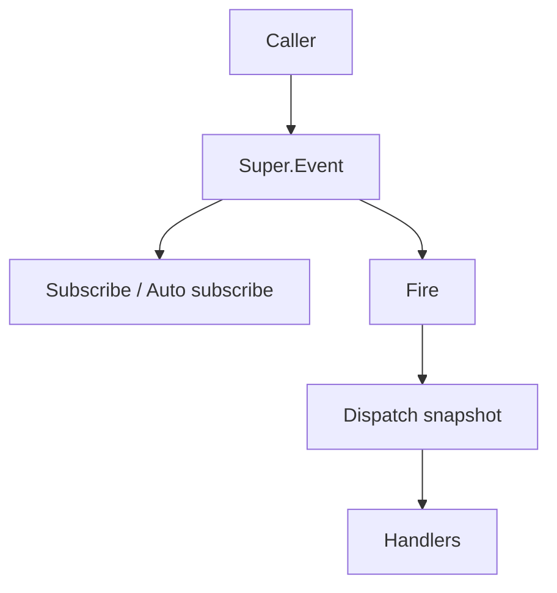

# event-module design

## 0. 术语约定

| 术语 | 定义 | 防冲突结论 |
|---|---|---|
| **EventModule** | GameDeveloperKit 框架级事件模块入口，实现 `IGameModule`，通过 `Super.Event` 访问 | 当前代码只有 `Super.cs` 中注释掉的 `EventManager`；本 feature 统一改为 `EventModule` |
| **BindingAttribute** | 标记事件声明类型或事件处理器类型与事件 key 的绑定关系 | Source generator 当前查找 `GameDeveloperKit.EventBindingAttribute`，本 feature 同步改为 `GameDeveloperKit.BindingAttribute` |
| **IEventArgs** | 事件数据公共契约，支持被 handle 消费 | 所有强类型事件数据都实现它；触发来源由 handle 方法的 `sender` 参数传递；`Use()` 后后续 handle 可停止流转 |
| **IEventHandle** | 事件处理器公共标记接口 | 作为 `Subscribe<THandle>(THandle handle)` 的泛型约束 |
| **IEventHandle<TEvent>** | 强类型事件处理器，处理指定事件数据类型 | `IEventHandle<TEvent> : IEventHandle`，且 `TEvent : IEventArgs` |
| **Subscription** | 一次订阅返回的取消句柄 | 用于避免调用方只靠 handle / delegate 手动反注册导致泄漏 |

## 1. 决策与约束

### 需求摘要

- **做什么**：新增框架级事件总线，支持 `Super.Event` 注册、取消和发布事件，提供泛型强类型事件，以及与现有 source generator 生成代码对齐的自动注册入口。
- **为谁**：GameDeveloperKit 框架使用者、业务模块、UI/玩法层，用于模块间解耦通信和游戏内事件广播。
- **成功标准**：
  - 可通过 `Super.Event` 订阅、取消和立即发布事件。
  - 支持 `BindingAttribute` + source generator 生成的 handle 自动注册和事件扩展方法。
  - 重复订阅可被去重或返回同一语义的可取消句柄，取消后不再收到事件。
- **明确不做什么**：
  - 不做异步事件、异步 handle、等待事件完成的 `UniTask` API。
  - 不做跨进程 / 网络事件。
  - 不做事件持久化、回放、编辑器可视化面板。
  - 不做事件队列、优先级、复杂调度、限流、跨线程并发安全承诺。

### 复杂度档位

走"项目内部工具"默认组合，以下维度偏离：

- **健壮性 = L2**：事件系统属于基础设施，需要处理参数错误、重复订阅、订阅中取消、派发中修改订阅列表等常见边界。
- **结构 = modules**：事件入口、订阅项、绑定 attribute、handle 契约、取消句柄分文件。
- **并发 = single-threaded orchestration**：公开 API 假定 Unity 主线程调用，不承诺多线程安全。
- **兼容性 = generator-aligned**：必须兼容当前 source generator 已生成的 `EventManager` 调用形状，或同步把 generator 输出迁移到 `EventModule`。

### 关键决策

1. **模块命名采用 `EventModule`，同时更新 source generator 输出**
   - Runtime 公开入口为 `Super.Event => Get<EventModule>()`。
   - 当前 generator 生成 `EventManager` 参数和扩展方法，本 feature 需要将 generator 目标同步改为 `EventModule`，避免保留已废弃命名。

2. **强类型 API 是主路径，字符串 key API 是 generator 与动态场景的底层通道**
   - 业务可 `Subscribe<THandle>(THandle handle)`、`Subscribe<TEvent>(Action<TEvent> handle)`、`Fire<TEvent>(TEvent eventData, object sender = null)`。
   - 标记了 `[Binding("key")]` 的事件声明类型由 generator 生成 `FireXxx(this EventModule module, ...)` 扩展方法。
   - 字符串 key 只作为 `BindingAttribute` 与 source generator 绑定信息，不作为运行时发布入口。

3. **订阅返回 `Subscription`，取消语义集中在句柄和委托反注册**
   - `Subscribe<THandle>(handle)` 返回可释放句柄，调用 `Cancel()` 或 `Dispose()` 取消订阅。
   - `Subscribe<TEvent>(Action<TEvent> handle)` 支持轻量委托订阅；模块提供对应 `Unsubscribe<TEvent>(Action<TEvent> handle)`。
   - 模块仍提供 `Unsubscribe<THandle>(handle)` 以支持不保留 `Subscription` 的调用方。
   - `THandle` 必须实现 `IEventHandle<TEvent>`，模块从接口约束中识别事件类型。
   - source generator 若需要自动绑定 handle，生成代码负责创建 handle 实例并调用 `Subscribe(handle)`。
   - 同一 handle 实例重复订阅同一事件不重复派发。

4. **Fire 后立即同步调用所有注册 handle**
   - `Fire<TEvent>(eventData, sender)` 不入队，直接按当前订阅快照同步调用所有 handle，并把 sender 作为 handle 参数传入。
   - 首版不绑定 Unity Update，不提供延迟派发。

5. **派发时使用快照保护订阅列表**
   - handle 内订阅/取消不会破坏当前派发枚举。
   - 已取消的订阅即使在快照中也会在调用前检查 active 状态。
   - 某个 handle 调用 `eventData.Use()` 后，后续 handle 检测到 `eventData.HasUse() == true`，本轮事件停止继续派发。
   - handle 抛异常时记录到 `GameException` 聚合策略或直接向外抛；首版选择直接抛，让调用方感知失败。

## 2. 名词与编排

### 2.1 名词层

**现状**：

- `Assets/GameDeveloperKit/Runtime/` 目前没有事件模块目录或 Runtime 事件契约。
- `Assets/GameDeveloperKit/Runtime/Super.cs:11` 只有注释 `// public static EventManager Event => Get<EventManager>();`。
- `GameDeveloperKit.Event.SourceGenerator/EventBindingSourceGenerator.cs` 已查找 `EventBindingAttribute`、`IEventHandler`，并生成 `EventManager.Register<T>(key)` 与 `EventManager.Raise(...)` 调用。

**变化**：新增 `Assets/GameDeveloperKit/Runtime/Event/` 子系统。

```csharp
public class EventModule : IGameModule
{
    public UniTask Startup();
    public UniTask Shutdown();
    public void Release();

    public Subscription Subscribe<THandle>(THandle handle) where THandle : IEventHandle;
    public Subscription Subscribe<TEvent>(Action<TEvent> handle) where TEvent : IEventArgs;
    public void Unsubscribe<THandle>(THandle handle) where THandle : IEventHandle;
    public void Unsubscribe<TEvent>(Action<TEvent> handle) where TEvent : IEventArgs;
    public void Fire<TEvent>(TEvent eventData, object sender = null) where TEvent : IEventArgs;
    public void Clear();
}
```

```csharp
[AttributeUsage(AttributeTargets.Class | AttributeTargets.Struct, AllowMultiple = true, Inherited = false)]
public sealed class BindingAttribute : Attribute
{
    public string Key { get; }
}
```

```csharp
public interface IEventArgs
{
    void Use();
    bool HasUse();
}

public interface IEventHandle
{
    void Handle(object sender, object args);
}

public interface IEventHandle<TEvent> : IEventHandle where TEvent : IEventArgs
{
    void Handle(object sender, TEvent eventData);
}
```

```csharp
public sealed class Subscription : IDisposable
{
    public bool IsActive { get; }
    public void Cancel();
    public void Release();
}
```

内部类型：

- `EventListener`：记录事件类型、handle 实例或委托、active 状态。

### 2.2 编排层



**现状**：

- `Super` 已有模块注册表和 `Get<T>()` 访问模式，`FileModule` / `DownloadModule` 已按 `IGameModule` 生命周期工作。
- source generator 已能扫描标记类型，但 Runtime 缺少目标类型导致生成代码无落点。

**变化**：

1. `Super.Event` 返回已注册的 `EventModule`。
2. `EventModule.Startup()` 初始化 listener 字典，并调用 `EventBindingGenerated.RegisterAllGenerated(this)` partial hook。
3. `Subscribe<THandle>(handle)` 从 `IEventHandle<TEvent>` 接口识别事件类型，写入 event type → listener 列表，返回 `Subscription`。
4. `Subscribe<TEvent>(Action<TEvent> handle)` 直接以 `TEvent` 作为事件类型写入 listener 列表，返回 `Subscription`。
5. source generator 发现的 handle 由生成代码实例化，并通过 `Subscribe(handle)` 注册到对应事件类型。
6. `Fire<TEvent>(eventData, sender)` 获取 listener 快照，并同步调用 active handle 的 `Handle(sender, eventData)` 或委托 `handle(eventData)`；每次调用前检查 `eventData.HasUse()`，为 true 时停止后续派发。
7. `Unsubscribe` / `Subscription.Cancel()` 将 listener 标记 inactive 并从列表移除；`Shutdown()` / `Release()` 清理全部 listener。

流程级约束：

- key 为 null / 空白时抛 `ArgumentNullException` 或 `ArgumentException`。
- handle 为 null 时抛 `ArgumentNullException`。
- `Fire<TEvent>` 的 eventData 为 null 时抛 `ArgumentNullException`。
- 派发无订阅事件不抛异常，视为 0 个 listener。
- 重复订阅同一事件类型 + 同一 handle 实例或同一委托时不重复加入 listener。
- handle 调用 `Use()` 后，本轮 `Fire<TEvent>` 不再继续调用后续 handle。
- handle 抛异常时停止当前派发并向外抛，不吞异常。

### 2.3 挂载点

- `Super.Event`：用户访问事件模块的唯一框架入口。
- `Assets/GameDeveloperKit/Runtime/Event/`：事件模块 Runtime 类型集合。
- `EventBindingSourceGenerator`：把生成代码目标从 `EventManager` / `EventBindingAttribute` / `Raise` / `IEventHandler` 同步到 `EventModule` / `BindingAttribute` / `Fire<TEvent>` / `IEventHandle<TEvent>`。
- `GameDeveloperKit.Runtime.csproj` / Unity 项目生成项：纳入新增 Runtime 事件文件。

拔除沙盘：删除 `Runtime/Event/`、移除 `Super.Event`、回滚 generator 的事件目标输出，即可移除该 feature；其他模块不应依赖事件模块实现细节。

### 2.4 推进策略

1. **名词层落盘**：定义 `BindingAttribute`、`IEventArgs`、`IEventHandle`、`IEventHandle<TEvent>`、`Subscription`、内部 listener。
   - 退出信号：类型和公开成员存在，项目可编译。
2. **模块入口骨架**：实现 `EventModule` 生命周期、`Super.Event` 入口和基础字典初始化清理。
   - 退出信号：可注册模块并通过 `Super.Event` 取得实例。
3. **订阅 / 取消 / 立即发布**：实现强类型 `Subscribe<THandle>` / `Unsubscribe<THandle>`、`Subscribe<TEvent>(Action<TEvent>)` / `Unsubscribe<TEvent>(Action<TEvent>)`、去重、同步派发。
   - 退出信号：订阅后发布可触发一次，取消后不再触发，重复订阅不重复触发。
4. **source generator 对齐**：将 generator 输出从 `EventManager` / `EventBindingAttribute` / `Raise` / `IEventHandler` 改为 `EventModule` / `BindingAttribute` / `Fire<TEvent>` / `IEventHandle<TEvent>`，生成基于 `Subscribe(handle)` 的自动订阅和扩展 Fire 方法。
   - 退出信号：带 `[Binding]` 的 handle 可自动订阅，事件声明类型生成扩展方法。
5. **验证覆盖**：覆盖参数错误、未知 key、重复订阅、取消、派发中取消、直接派发顺序、generator 输出对齐。
   - 退出信号：关键验收场景通过可运行验证。

### 2.5 结构健康度与微重构

**compound convention 检索**：`.codestable/compound/` 当前无沉淀文档，未发现目录组织或命名约定冲突。

**文件级评估**：

- `Super.cs` 已是模块入口聚合点，本次只取消事件入口注释并改为 `EventModule`，不需要拆分。
- `EventBindingSourceGenerator.cs` 约 280 行，职责集中在事件绑定生成；本次只做命名目标对齐，不做生成器结构性重构。

**目录级评估**：

- `Assets/GameDeveloperKit/Runtime/` 已有 `Core/`、`FileSystem/`、`Download/`、`Utility/`，新增 `Event/` 与现有模块目录一致。

**结论**：本次不做微重构，原因是改动可自然落入新 `Runtime/Event/` 目录，既有文件只承担挂载和 generator 对齐，不需要"只搬不改行为"的前置整理。

## 3. 验收契约

正常场景：

- N1：注册 `EventModule` 后访问 `Super.Event` → 返回 `EventModule` 实例。
- N2：`Subscribe(handle)` 后 `Fire(new MyEvent())` → handle 触发一次并收到事件数据。
- N2a：`Subscribe<MyEvent>(action)` 后 `Fire(new MyEvent())` → action 触发一次并收到事件数据。
- N3：订阅返回的 `Subscription.Cancel()` 后再次发布 → handle 不再触发。
- N4：同一 handle 重复订阅同一事件后发布一次 → handle 只触发一次。
- N5：标记 `[Binding("key")]` 的 handle 经 generator 自动订阅后，`Fire(new MyEvent())` 可触发 handle。
- N6：generator 自动订阅返回的内部 `Subscription` 在模块清理时取消，`Shutdown()` 后不再触发。
- N7：手写 `Unsubscribe(handle)` 或 `Unsubscribe<MyEvent>(action)` 后再次 `Fire(new MyEvent())` → 对应订阅不再触发。
- N8：某个 handle 调用 `eventData.Use()` 后，后续 handle 不再收到该事件。
- N9：标记 `[Binding("key")]` 的事件声明类型生成扩展方法后，可通过 `Super.Event.FireXxx(...)` 发布。

边界场景：

- B1：发布无订阅事件 → 不抛异常，触发数量为 0。
- B2：订阅中调用取消或新增订阅 → 当前派发不破坏枚举，后续发布体现最新订阅状态。
- B3：`Shutdown()` 后 listener 被清空。

错误场景：

- E1：`Subscribe` 传入 null handle → 抛 `ArgumentNullException`。
- E2：`Fire<TEvent>` 传入 null eventData → 抛 `ArgumentNullException`。
- E3：handle 内抛异常 → 当前发布向调用方抛出异常，不吞掉错误。

范围守护：

- R1：代码中无跨进程、网络、socket、HTTP 事件逻辑。
- R2：公开 API 无 `UniTask` 异步事件订阅/发布方法。
- R3：不新增 Editor 可视化面板或事件持久化文件。
- R4：不新增事件队列、优先级、限流、复杂调度配置。

## 4. 架构归并计划

- 在 `.codestable/architecture/ARCHITECTURE.md` 新增 Event 子系统：入口、核心类型、派发策略。
- 关键约束补充：事件模块单线程主线程假设；事件数据实现 `IEventArgs` 且可通过 `Use()` 消费；sender 通过 `Handle(object sender, ...)` 参数传递；派发使用快照；`Fire<TEvent>` 后立即同步调用注册 handle，直到事件被消费或 handler 列表结束；不做异步/网络/队列事件。
- 本 feature 非 roadmap 起头，design frontmatter 不写 `roadmap` / `roadmap_item`。
- 当前未发现已有 requirement 文档；如果用户希望把"框架级事件总线"作为长期能力愿景沉淀，后续可走 `cs-req draft`，本 design 暂不阻塞。
