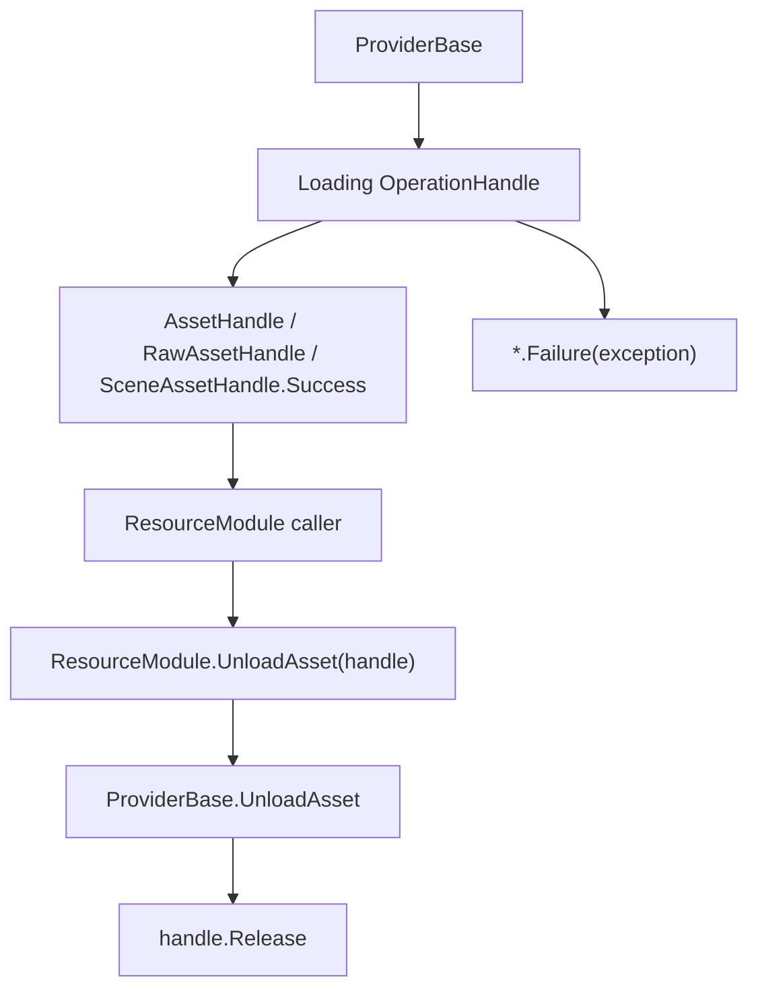

# resource-handle-core design

## 0. 术语约定

| 术语 | 当前定义 | 说明 |
|---|---|---|
| `ResourceHandle<T>` | 句柄泛型基类，保存 `Info` 与 `Error` | 实现 `IReference` |
| `ResourceHandle` | `ResourceHandle<AssetInfo>` 的非泛型资源句柄 | asset/raw/scene 句柄的当前基类 |
| `AssetHandle` | Unity `Object` 资源句柄 | 保存 `Asset`，提供 `GetAsset<T>()` |
| `RawAssetHandle` | 原始资源句柄 | 当前直接继承 `ResourceHandle`，保存 `byte[] Data` |
| `SceneAssetHandle` | 场景资源句柄 | 当前直接继承 `ResourceHandle`，保存 `Scene Asset` |
| `BundleHandle` | AssetBundle 句柄 | 继承 `ResourceHandle<BundleInfo>` |
| `ResourceStatus` | 当前存在的状态枚举 | 源码尚未接入 handle 生命周期 |

本设计已按当前源码修订。旧版文档要求 `RawAssetHandle : AssetHandle`、`SceneAssetHandle : AssetHandle`、显式 `ResourceHandleStatus` 生命周期，这些没有按原样落地。

## 1. 决策与约束

### 当前目标

资源句柄负责把加载结果、资源信息和错误对象交还给调用方。真正的缓存、引用计数、AssetBundle 卸载策略仍由 provider/mode 承担。

### 当前成功标准

- 成功句柄能保存对应 `Info` 和资源对象/数据。
- 失败句柄能保存 `Error`，调用方可通过 `IsValid` 判断失败。
- `Release()` 清空本地引用；具体资源卸载由 provider/mode 触发。
- `AssetHandle.GetAsset<T>()` 用 `as T` 安全转换 Unity 对象。

### 明确不做

- 不声明当前句柄有完整状态机；`ResourceStatus` 尚未接入。
- 不声明 `Release()` 会更新状态为 Released；当前基类只清空字段。
- 不把 raw/scene 句柄描述成 `AssetHandle` 派生类。
- 不在句柄层实现引用计数、异步进度或缓存淘汰。

## 2. 名词与编排

### 2.1 名词层

当前源码位置：`Assets/GameDeveloperKit/Runtime/Resource/Handle/`

```csharp
public class ResourceHandle<T> : IReference where T : class
{
    public T Info { get; protected set; }
    public Exception Error { get; protected set; }
    public bool IsValid => Error == null;
    public virtual void Release();
}

public class ResourceHandle : ResourceHandle<AssetInfo>
{
}
```

```csharp
public class AssetHandle : ResourceHandle
{
    public UnityEngine.Object Asset { get; protected set; }
    public T GetAsset<T>() where T : UnityEngine.Object;
    public static AssetHandle Success(AssetInfo location, UnityEngine.Object asset);
    public static AssetHandle Failure(Exception error);
}
```

```csharp
public sealed class RawAssetHandle : ResourceHandle
{
    public byte[] Data { get; private set; }
    public string GetString();
    public static RawAssetHandle Success(AssetInfo location, byte[] asset);
    public static RawAssetHandle Failure(Exception error);
}
```

```csharp
public sealed class SceneAssetHandle : ResourceHandle
{
    public Scene Asset { get; private set; }
    public string SceneName => Info.Location;
    public void Active();
    public static SceneAssetHandle Success(AssetInfo location, Scene asset);
    public static SceneAssetHandle Failure(Exception error);
}
```

```csharp
public class BundleHandle : ResourceHandle<BundleInfo>
{
    public AssetBundle Asset { get; private set; }
    public static BundleHandle Success(BundleInfo info, AssetBundle bundle);
    public static BundleHandle Failure(BundleInfo info, Exception exception);
}
```

### 2.2 编排层



当前行为：

- provider 负责决定是否复用已有 handle。
- 成功句柄保存 `Info` 与结果对象/数据。
- 失败句柄保存 `Error`，`Info` 通常为 null。
- `IsValid` 只看 `Error == null`，因此释放后的句柄不等价于失败句柄。

当前风险：

- `SceneAssetHandle.SceneName => Info.Location`，失败或释放后访问可能遇到 `Info == null`。
- `SceneAssetHandle.Active()` 目前在 `Asset.isLoaded` 为 true 时直接 return，是否符合预期需要后续实现验证。
- `BundleHandle.Release()` 调用 `Asset.Unload(true)`，但未显式把 `Asset` 置空。

## 3. 验收契约

| 编号 | 输入 / 触发 | 期望可观察结果 |
|---|---|---|
| N1 | `AssetHandle.Success(assetInfo, prefab)` | `Info` 为 assetInfo，`Asset` 为 prefab，`GetAsset<T>()` 可返回匹配类型 |
| N2 | `AssetHandle.Failure(exception)` | `Error` 为 exception，`Asset` 和 `Info` 为 null，`IsValid == false` |
| N3 | `RawAssetHandle.Success(assetInfo, bytes)` | `Data` 为 bytes，`GetString()` 按 UTF-8 解码 |
| N4 | `SceneAssetHandle.Success(assetInfo, scene)` | `Asset` 为 scene，`SceneName` 来自 `Info.Location` |
| N5 | `BundleHandle.Success(bundleInfo, bundle)` | `Info` 为 bundleInfo，`Asset` 为 AssetBundle |
| E1 | 新方案要求 `RawAssetHandle : AssetHandle` | 判定为与当前源码不一致 |
| E2 | 新方案要求 handle 状态机已落地 | 判定为与当前源码不一致，当前 `ResourceStatus` 未接入 |

## 4. 与项目级架构文档的关系

`ARCHITECTURE.md` 的 Resource 小节已同步当前句柄关系：

- `ResourceHandle : ResourceHandle<AssetInfo>`。
- `AssetHandle : ResourceHandle`。
- `RawAssetHandle : ResourceHandle`。
- `SceneAssetHandle : ResourceHandle`。
- `BundleHandle : ResourceHandle<BundleInfo>`。
