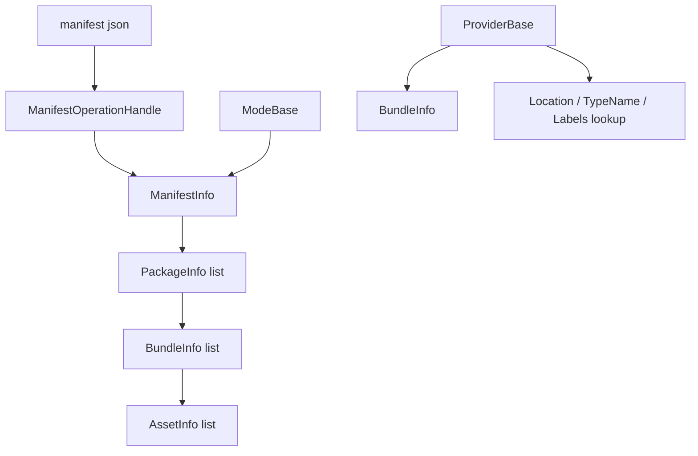

# resource-manifest-model design

## 0. 术语约定

| 术语 | 当前定义 | 说明 |
|---|---|---|
| `ManifestInfo` | 资源总清单，包含版本、构建时间和 package 列表 | 替代旧方案中的 `ResourceManifest` |
| `PackageInfo` | 一组资源 bundle 的逻辑 package | 当前源码新增了旧方案没有的 package 层 |
| `BundleInfo` | 单个 Unity AssetBundle 的元数据和 asset 列表 | 替代旧方案中的 `ResourceBundleInfo` |
| `AssetInfo` | 单个可加载资源条目 | 替代旧方案中的 `ResourceAssetInfo` |
| `Location` | 业务传入的资源加载地址，也是 provider 查询 asset 的主键 | 当前没有独立 `AssetPath` 字段 |
| `TypeName` | 资源类型名字符串 | provider 的 `HasAsset(key)` 会把它当作 type 查询入口 |
| `Labels` | 资源标签列表 | provider 的 `HasAsset(key)` 会把它当作 label 查询入口 |

本设计已按当前源码修订。旧版文档中的 `ResourceManifest` / `ResourceBundleInfo` / `ResourceAssetInfo` / scene name 索引 / 构造期不可变索引并未按原样落地，后续方案不得继续把它们当作现状。

## 1. 决策与约束

### 当前目标

资源清单只负责描述资源索引，不负责下载、磁盘加载、AssetBundle 加载或 Unity `Resources` 加载。当前实现以可反序列化字段为主，供 `ManifestOperationHandle` 从 JSON 得到 `ManifestInfo`，再供 mode/provider 查询资源。

### 当前成功标准

- 能表达 `ManifestInfo -> PackageInfo -> BundleInfo -> AssetInfo` 三层实际结构。
- `PackageInfo` 记录 package 名、版本、hash 和 bundle 列表。
- `BundleInfo` 记录 bundle 名、hash、size、crc、版本、依赖和资源列表。
- `AssetInfo` 记录 location、type name 和 labels。
- `ManifestInfo.GetBundle()` 与 `GetDependencies()` 是 mode/provider 后续初始化依赖的查询入口。

### 明确不做

- 不要求当前清单类型不可变；源码使用 public fields 和 `List<T>`。
- 不继续要求 `AssetInfo.BundleName`、`AssetPath`、`IsScene`、`SceneName` 字段。
- 不在清单模型里直接实现资源加载、下载或热更新策略。
- 不混用 FileSystem 的 `VfsManifest` / `.vfsb` 自定义文件 bundle。

## 2. 名词与编排

### 2.1 名词层

#### 现状

当前源码位置：`Assets/GameDeveloperKit/Runtime/Resource/Manifest/`

```csharp
public sealed class ManifestInfo
{
    public string Version;
    public long BuildTime;
    public List<PackageInfo> Packages = new List<PackageInfo>();

    public BundleInfo GetBundle(string bundleName);
    public IReadOnlyList<BundleInfo> GetDependencies(string bundleName);
}
```

```csharp
public sealed class PackageInfo
{
    public string Name;
    public string Version;
    public string Hash;
    public List<BundleInfo> Bundles = new List<BundleInfo>();
}
```

```csharp
public sealed class BundleInfo
{
    public string Name;
    public string Hash;
    public long Size;
    public uint Crc;
    public string Version;
    public List<AssetInfo> Assets;
    public List<string> Dependencies;
}
```

```csharp
public sealed class AssetInfo
{
    public string Location;
    public string TypeName;
    public List<string> Labels;
}
```

#### 当前未完成点

- `ManifestInfo.GetBundle(string bundleName)` 已做参数校验，但返回 `default`。
- `ManifestInfo.GetDependencies(string bundleName)` 已做参数校验，但返回 `default`。
- 当前没有全局 location/type/label 索引，provider 直接在 `BundleInfo.Assets` 中查询。
- 当前没有 `AssetInfo` 到所属 `BundleInfo` 的反向字段，资源路由依赖 provider 已经按 package 初始化并持有正确 bundle。

### 2.2 编排层



当前意图：

1. `ManifestOperationHandle` 下载并反序列化 manifest JSON 为 `ManifestInfo`。
2. `ResourceModule.Startup()` 把 `ManifestInfo` 传给各 `ModeBase`。
3. package 初始化时，mode 需要从 manifest 找 package/bundle 并创建 provider。
4. provider 持有单个 `BundleInfo`，通过 `Info.Assets` 按 `Location` / `TypeName` / `Labels` 查询 asset。

流程级约束：

- `ManifestInfo.GetBundle()` / `GetDependencies()` 的入参为 null 时抛 `ArgumentNullException`，空白时抛 `ArgumentException`。
- provider 不接收整个 `ManifestInfo`；provider 只处理构造时传入的 `BundleInfo`。
- `Location` 是单资源加载主键；type 和 label 查询当前通过同一个 `HasAsset(key)` 入口混合判断。

## 3. 验收契约

| 编号 | 输入 / 触发 | 期望可观察结果 |
|---|---|---|
| N1 | 反序列化包含 packages/bundles/assets 的 JSON | 得到 `ManifestInfo.Packages`，每个 package 含 `BundleInfo` 和 `AssetInfo` |
| N2 | `GetBundle(null)` / `GetBundle("")` | 分别抛 `ArgumentNullException` / `ArgumentException` |
| N3 | `BundleInfo.Assets` 中存在 `Location="ui/login"` | provider 可通过 `Info.Assets` 找到该 asset |
| N4 | asset 带 `TypeName` 或 `Labels` | provider 的 type/label 查询可复用同一 asset 列表 |
| E1 | 后续方案引用 `ResourceManifest` / `ResourceAssetInfo` 作为现状 | 判定为文档错误，应改为当前 `*Info` 类型 |
| E2 | 方案要求 `AssetInfo.AssetPath` / `BundleName` / `SceneName` | 判定为超出当前实现，需要另起结构变更 |

## 4. 与项目级架构文档的关系

`ARCHITECTURE.md` 的 Resource 小节已同步为当前代码口径：

- `ManifestInfo -> PackageInfo -> BundleInfo -> AssetInfo` 是当前清单结构。
- `ManifestInfo.GetBundle()` / `GetDependencies()` 是已声明但未完成的查询入口。
- provider 通过 `BundleInfo.Assets` 查询资源，不依赖旧版全局 `ResourceManifest` 索引。
