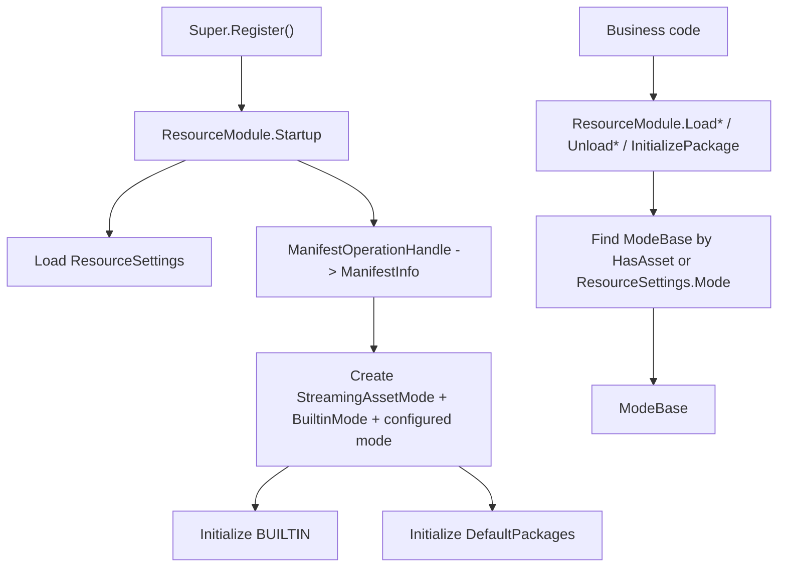

# resource-module-api design

## 0. 术语约定

| 术语 | 当前定义 | 说明 |
|---|---|---|
| `ResourceModule` | 资源模块门面，继承 `GameModuleBase` | 当前不是薄 `IResourcePlayMode` 转发器，而是持有 manifest/settings/mode 列表 |
| `Super.Resource` | `Super` 静态入口中获取已注册 `ResourceModule` 的属性 | 已落地 |
| `ResourceSettings` | ScriptableObject 配置，包含 `Mode`、`DefaultPackages`、`url` | 决定当前配置 mode 和默认 package |
| `modes` | `ResourceModule` 内部 `List<ModeBase>` | 用于按资源命中选择 mode |
| `GetModeByType` | 根据 `ResourceMode` 找 mode 的私有方法 | 当前实现实际 switch `_setting.Mode` |

本设计已按当前源码修订。旧版文档中的 `CurrentPlayMode` / `SetPlayMode(IResourcePlayMode)` 并未落地，后续方案不得把它当作现状。

## 1. 决策与约束

### 当前目标

`ResourceModule` 是业务侧访问资源系统的统一入口。它负责启动时加载 settings/manifest、创建 mode、初始化默认 package，并在运行时把资源 API 分发给能命中资源的 mode。

### 当前成功标准

- `Super.Resource` 能获取已注册的 `ResourceModule`。
- `ResourceModule` 暴露 package 初始化/反初始化、asset/raw/scene 加载和卸载 API。
- 公开字符串参数统一校验 null/空白。
- mode 未创建时资源 API 抛明确 `GameException`。
- 资源加载先找命中资源的 `ModeBase`，再委托 mode。

### 明确不做

- 不声明存在 `SetPlayMode()` 或 `CurrentPlayMode`。
- 不声明 `ResourceModule` 只依赖单个 `IResourcePlayMode`。
- 不把 `ResourceModule` 描述成不接触 manifest/settings；当前源码持有 `_manifest` 和 `_setting`。
- 不声明启动流程已可运行；当前存在启动顺序问题。

## 2. 名词与编排

### 2.1 名词层

当前源码位置：

- `Assets/GameDeveloperKit/Runtime/Resource/ResourceModule.cs`
- `Assets/GameDeveloperKit/Runtime/Resource/ResourceSettings.cs`
- `Assets/GameDeveloperKit/Runtime/Resource/ResourceMode.cs`
- `Assets/GameDeveloperKit/Runtime/Super.cs`

实际 API：

```csharp
public sealed class ResourceModule : GameModuleBase
{
    public override UniTask Startup();
    public override UniTask Shutdown();

    public UniTask<InitializePackageOperationHandle> InitializePackageAsync(string package);
    public UniTask<UninitializePackageOperationHandle> UninitializePackageAsync(string package);

    public UniTask<AssetHandle> LoadAssetAsync(string location);
    public UniTask<IReadOnlyList<AssetHandle>> LoadAssetsByLabelAsync(string label);
    public UniTask<IReadOnlyList<AssetHandle>> LoadAssetsByTypeAsync<T>() where T : UnityEngine.Object;

    public UniTask<RawAssetHandle> LoadRawAssetAsync(string location);
    public UniTask<IReadOnlyList<RawAssetHandle>> LoadRawAssetsByLabelAsync(string label);

    public UniTask<SceneAssetHandle> LoadSceneAssetAsync(string name);

    public UniTask UnloadUnusedAssetAsync();
    public UniTask UnloadAsset(AssetHandle handle);
}
```

```csharp
public sealed class ResourceSettings : ScriptableObject
{
    public ResourceMode Mode;
    public string[] DefaultPackages;
    public string url;
}

public enum ResourceMode : byte
{
    EditorSimulator,
    Offline,
    Online,
    Web,
}
```

`Super` 已有：

```csharp
public static ResourceModule Resource => Get<ResourceModule>();
```

### 2.2 编排层



当前实际行为：

- `Startup()` 先调用 `LoadAssetAsync("Resources/ResourceSettings")`。
- `Startup()` 随后执行 `Super.Operation.Execute<ManifestOperationHandle>(_setting)` 并等待。
- `_setting = handle.GetAsset<ResourceSettings>()` 在 manifest operation 之后才赋值。
- mode 列表会加入 `StreamingAssetMode`、`BuiltinMode` 和 `CreateModeByType(_setting.Mode)`。
- `BuiltinMode` 会初始化 `BUILTIN` package。
- `DefaultPackages` 逐个调用 `InitializePackageAsync(package)`。

当前未完成/风险：

- `LoadAssetAsync()` 在 `modes.Count == 0` 时抛错，因此 `Startup()` 开头加载 settings 的路径不能按当前代码跑通。
- `ManifestOperationHandle` 期望第一个参数是 URL string，但 `Startup()` 传入 `_setting`，且此时 `_setting` 尚未赋值。
- `GetModeByType(ResourceMode mode)` 当前忽略参数，switch 的是 `_setting.Mode`。
- `LoadRawAssetsByTypeAsync<T>()` 不存在于当前 `ResourceModule` API。
- `LoadAssetsByLabelAsync(label)` 对 `IEnumerable<ModeBase>` 做 null 判断无效；无命中时会返回空列表而不是抛错。

流程级约束：

- `ValidateKey()` 对 null 抛 `ArgumentNullException`，对白空字符串抛 `ArgumentException`。
- `UnloadAsset(null)` 抛 `ArgumentNullException`。
- mode 列表为空时加载/卸载 API 抛 `GameException("No resource play mode is available.")`。
- 单资源加载使用第一个 `HasAsset(location)` 命中的 mode。
- package 初始化只委托 `ResourceSettings.Mode` 对应 mode。

## 3. 验收契约

| 编号 | 输入 / 触发 | 期望可观察结果 |
|---|---|---|
| N1 | `Super.Register<ResourceModule>()` 后访问 `Super.Resource` | 返回已注册的 `ResourceModule` |
| N2 | `LoadAssetAsync(null)` / `LoadAssetAsync("")` | 分别抛 `ArgumentNullException` / `ArgumentException` |
| N3 | `modes.Count == 0` 时调用加载 API | 抛 `GameException("No resource play mode is available.")` |
| N4 | mode 命中 `HasAsset(location)` | `ResourceModule` 委托该 mode 的 `LoadAssetAsync(location)` |
| N5 | 调用 `UnloadAsset(null)` | 抛 `ArgumentNullException` |
| E1 | 新方案要求 `SetPlayMode()` / `CurrentPlayMode` | 判定为旧设计残留 |
| E2 | 声称 `Startup()` 当前已闭环 | 判定为错误；settings/manifest 加载顺序仍需修正 |
| E3 | 新方案引用 `IResourcePlayMode` | 判定为与当前源码不一致 |

## 4. 与项目级架构文档的关系

`ARCHITECTURE.md` 的 Resource 小节已同步当前模块关系：

- `ResourceModule` 持有 `_manifest`、`_setting` 和 `List<ModeBase>`。
- `ResourceSettings.Mode` 决定当前配置 mode。
- `Super.Resource` 是业务入口。
- `Startup()` 链路和 operation 闭环是当前已知风险。
