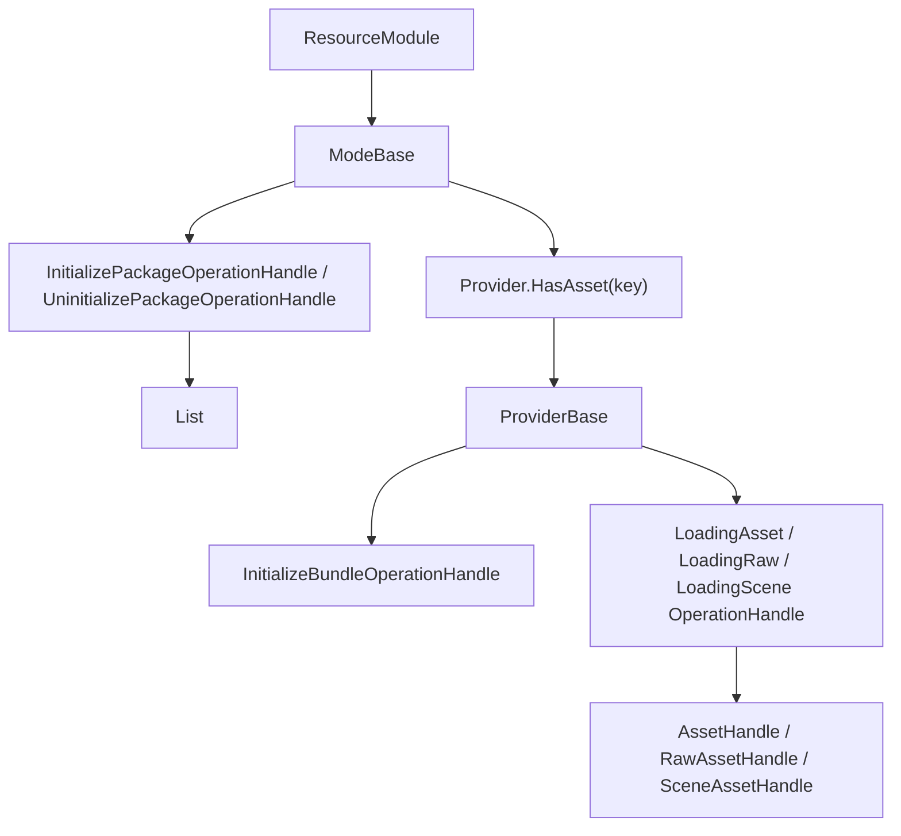

# resource-playmode-provider-contract design

## 0. 术语约定

| 术语 | 当前定义 | 说明 |
|---|---|---|
| `ModeBase` | 资源运行模式抽象基类 | 替代旧方案中的 `IResourcePlayMode` |
| `ProviderBase` | bundle 级资源操作抽象基类 | 替代旧方案中的 `IResourceProvider` |
| `InitializePackageOperationHandle` | package 初始化 operation，结果类型为 `List<ProviderBase>` | 当前 `Success()` 未设置结果值 |
| `UninitializePackageOperationHandle` | package 反初始化 operation | 成功时设置 operation 结果状态 |
| `InitializeBundleOperationHandle` | bundle 初始化 operation，结果类型为 `BundleHandle` | 当前 `Execute()` 仍未实现 |
| `UninitializeBundleOperationHandle` | bundle 反初始化 operation | 方法名当前有 `Sucecess()` 拼写 |

本设计已按当前源码修订。旧版文档中的 `IResourcePlayMode`、`IResourceProvider`、`PackageOperationHandle`、`PackageOperationStatus` 没有按原样落地。

## 1. 决策与约束

### 当前目标

`ModeBase` 负责运行模式级编排：持有 manifest、管理 package 生命周期、选择 provider、汇总加载结果。`ProviderBase` 负责单个 bundle 内的资源查询、加载、卸载与 bundle 生命周期。

### 当前成功标准

- 所有 mode 继承 `ModeBase`，统一暴露 asset/raw/scene 加载、package 初始化、卸载和释放 API。
- 所有 provider 继承 `ProviderBase`，统一持有 `BundleInfo Info`。
- Mode 不直接加载 Unity 资源；具体加载交给 provider 和 loading operation。
- Provider 不持有 `ManifestInfo`；它只操作自己的 `BundleInfo`。

### 明确不做

- 不再要求存在 `IResourcePlayMode` / `IResourceProvider` 接口。
- 不要求 provider 加载方法接收 `AssetInfo`；当前签名接收 `string location` / `label` / type generic。
- 不声明 package operation 已经完整表达状态、结果和等待语义；它依赖尚未完成的 `OperationModule`。
- 不把 `HostingPlayMode` 作为当前类型；在线模式当前是 `BundleMode`。

## 2. 名词与编排

### 2.1 名词层

当前源码位置：

- `Assets/GameDeveloperKit/Runtime/Resource/ModeBase.cs`
- `Assets/GameDeveloperKit/Runtime/Resource/ProviderBase.cs`
- `Assets/GameDeveloperKit/Runtime/Resource/PlayMode/`
- `Assets/GameDeveloperKit/Runtime/Resource/Provider/`
- `Assets/GameDeveloperKit/Runtime/Resource/Operation/`

```csharp
public abstract class ModeBase : IReference
{
    public ManifestInfo Manifest { get; }

    public abstract bool HasAsset(string location);
    public abstract bool HasPackage(string package);
    public abstract UniTask<InitializePackageOperationHandle> InitializePackageAsync(string package);
    public abstract UniTask<UninitializePackageOperationHandle> UninitializePackageAsync(string package);
    public abstract UniTask<AssetHandle> LoadAssetAsync(string location);
    public abstract UniTask<IReadOnlyList<AssetHandle>> LoadAssetsByLabelAsync(string label);
    public abstract UniTask<IReadOnlyList<AssetHandle>> LoadAssetsByTypeAsync<T>() where T : UnityEngine.Object;
    public abstract UniTask<RawAssetHandle> LoadRawAssetAsync(string location);
    public abstract UniTask<IReadOnlyList<RawAssetHandle>> LoadRawAssetsByLabelAsync(string label);
    public abstract UniTask<SceneAssetHandle> LoadSceneAssetAsync(string name);
    public abstract UniTask UnloadUnusedAssetAsync();
    public abstract UniTask UnloadAsset(AssetHandle handle);
    public abstract void Release();
}
```

```csharp
public abstract class ProviderBase
{
    public BundleInfo Info { get; }

    public abstract UniTask<InitializeBundleOperationHandle> InitializeProviderAsync();
    public abstract UniTask<UninitializeBundleOperationHandle> UninitializeProviderAsync();
    public abstract bool HasAsset(string location);
    public abstract UniTask<AssetHandle> LoadAssetAsync(string location);
    public abstract UniTask<IReadOnlyList<AssetHandle>> LoadAssetsByLabelAsync(string label);
    public abstract UniTask<IReadOnlyList<AssetHandle>> LoadAssetsByTypeAsync<T>() where T : UnityEngine.Object;
    public abstract UniTask<RawAssetHandle> LoadRawAssetAsync(string location);
    public abstract UniTask<IReadOnlyList<RawAssetHandle>> LoadRawAssetsByLabelAsync(string label);
    public abstract UniTask<SceneAssetHandle> LoadSceneAssetAsync(string name);
    public abstract UniTask UnloadUnusedAssetAsync();
    public abstract UniTask UnloadAsset(AssetHandle handle);
    public virtual void Release();
}
```

当前 mode：

- `BuiltinMode`：单 `BuiltinProvider`，固定 package 名 `BUILTIN`。
- `StreamingAssetMode`：`ResourceMode.Offline`，持有 `List<ProviderBase>`。
- `BundleMode`：`ResourceMode.Online`，持有 `List<ProviderBase>`。
- `WebGLMode`：`ResourceMode.Web`，持有 `List<ProviderBase>`。
- `EditorSimulatorMode`：`ResourceMode.EditorSimulator`，持有 `List<ProviderBase>`。

当前 provider：

- `BuiltinProvider`：不用 AssetBundle handle，委托 builtin loading operation。
- `BundleProvider`：持有 `BundleHandle _bundle`，委托 normal loading operation。
- `EditorProvider`：持有 `BundleHandle _bundle`，委托 editor loading operation，但构造函数未初始化 `_assets` / `_pendingUnloadAssets`。

### 2.2 编排层



当前流程：

1. `ResourceModule` 选择一个 `ModeBase`。
2. package 初始化由 mode 调用 `Super.Operation.WaitCompletionAsync<InitializePackageOperationHandle>(this, package, providers)`。
3. operation 预期根据 package 和 manifest 创建 provider 并填充 provider 列表。
4. 资源加载时 mode 用 provider 的 `HasAsset(key)` 找到目标 provider。
5. provider 用 `Info.Assets` 找 `AssetInfo`，再调用对应 loading operation。

当前未完成点：

- `OperationModule` 的执行/等待机制尚未实现。
- `InitializePackageOperationHandle.Execute()` 为空，没有创建 provider。
- `InitializeBundleOperationHandle.Execute()` 抛 `NotImplementedException`。
- 普通 loading operation `Execute()` 为空，editor loading operation 抛 `NotImplementedException`。
- `Mode.HasPackage(package)` 当前用 `provider.Info.Name == package` 判断，语义上可能把 package 名和 bundle 名混在一起。

## 3. 验收契约

| 编号 | 输入 / 触发 | 期望可观察结果 |
|---|---|---|
| N1 | 新增 mode | 必须继承 `ModeBase` 并实现全部资源 API |
| N2 | 新增 provider | 必须继承 `ProviderBase` 并持有 `BundleInfo Info` |
| N3 | provider 查询资源 | 通过 `Info.Assets` 的 `Location` / `TypeName` / `Labels` 判断命中 |
| N4 | package 初始化 | 通过 `InitializePackageOperationHandle` 修改 provider 列表，而不是在 `ResourceModule` 内直接 new provider |
| E1 | 新方案引用 `IResourcePlayMode` / `IResourceProvider` 作为现状 | 判定为文档错误 |
| E2 | 新方案要求 provider 方法接收 `ResourceAssetInfo` | 判定为旧设计残留，应改为当前 `string location` / `AssetInfo` 内部查询口径 |
| E3 | 声称资源加载端到端已闭环 | 判定为错误；operation 与 manifest 查询仍未完成 |

## 4. 与项目级架构文档的关系

`ARCHITECTURE.md` 的 Resource 小节已同步当前契约关系：

- `ModeBase` 是运行模式抽象。
- `ProviderBase` 是 bundle provider 抽象。
- `ProviderBase` 不持有 `ManifestInfo`。
- 资源 operation 是当前闭环的关键未完成点。
