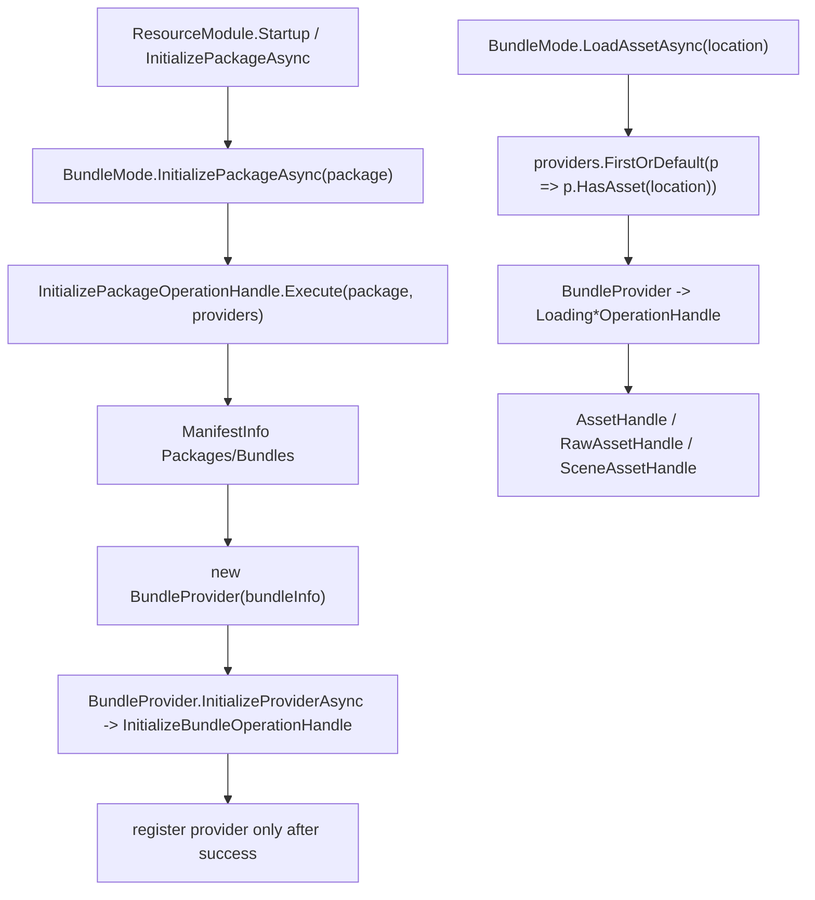

# bundlemode design

## 0. 术语约定

| 术语 | 当前定义 | 设计时结论 |
|---|---|---|
| `BundleMode` | `ResourceMode.Online` 对应的 mode，持有 `List<ProviderBase>`，负责 package 生命周期和 provider 分发 | 复用现有 `Assets/GameDeveloperKit/Runtime/Resource/PlayMode/BundleMode.cs` |
| `BundleProvider` | 实际持有 `BundleHandle` 并加载 bundle 内 asset/raw/scene 的 provider | 当前代码是 `BundleProvider`，不是旧方案里的 `BundleResourceProvider` |
| `InitializePackageOperationHandle` | package 初始化 operation，结果类型为 `List<ProviderBase>` | 当前 `Execute()` 还没有创建 provider |
| `InitializeBundleOperationHandle` | bundle 初始化 operation，结果类型为 `BundleHandle` | 当前 `Execute()` 仍抛 `NotImplementedException` |
| loading operation | `LoadingAssetOperationHandle` / `LoadingRawAssetOperationHandle` / `LoadingSceneAssetOperationHandle` | 当前 `Execute()` 为空，BundleProvider 依赖它们产出 handle |
| `OperationModule` | operation handle 的执行/等待入口 | BundleMode 需要最小 `Execute<T>()` / `WaitCompletionAsync<T>()` 语义来调起上述 operation |
| `ManifestInfo` | 当前资源总清单根类型 | 不再引用旧 `ResourceManifest` |
| `BundleInfo` | provider 的 bundle 元数据和 asset 列表 | 当前没有 `Package` / `Uri` 字段 |
| `AssetInfo.Location` | 单资源加载主键，也是 provider 在 `Info.Assets` 中查找 asset 的主要字段 | 当前没有 `BundleName` / `AssetPath` 字段 |

## 1. 决策与约束

### 需求摘要

做什么：按当前实现补齐 `BundleMode` 的在线资源包加载链路，让 `ResourceMode.Online` 能通过 package 初始化创建 `BundleProvider`，再由 provider 初始化 `BundleHandle` 并通过 loading operation 加载 asset/raw/scene。

为谁：需要通过 `ResourceSettings.Mode = ResourceMode.Online` 使用 AssetBundle 资源的 GameDeveloperKit 运行时调用方。

成功标准：

- `BundleMode.InitializePackageAsync(package)` 能通过 `InitializePackageOperationHandle` 为目标 package 创建并注册 `BundleProvider`，失败 provider 不进入 `_providers`。
- `BundleProvider.InitializeProviderAsync()` 能通过 `InitializeBundleOperationHandle` 得到有效 `BundleHandle`。
- `BundleProvider.LoadAssetAsync(location)` / raw / scene 能通过当前 `Loading*OperationHandle` 返回成功或失败 handle。
- package、bundle、asset 加载失败时错误能被 operation 或 handle 暴露，不静默返回半初始化状态。

明确不做：

- 不新增 `BundleResourceProvider`、`BundleOperationHandle`、`ResourceManifest`、`AssetInfo.BundleName`、`AssetInfo.AssetPath` 等旧方案类型/字段。
- 不实现 `StreamingAssetMode`、`WebGLMode`、`EditorSimulatorMode` 的真实加载逻辑。
- 不引入 Addressables，不改变 Unity SBP 打包流程。
- 不把 `DownloadModule` 改造成 BundleMode 的分片下载编排器。
- 不修改 FileSystem `.vfsb` 语义。

### 关键决策

1. `BundleMode` 只负责 provider 列表和请求分发。
   - AssetBundle 初始化和资源加载仍放在 `BundleProvider` + operation handle 中。

2. package 初始化由 `InitializePackageOperationHandle` 承担。
   - `BundleMode.InitializePackageAsync(package)` 当前只做参数校验和 operation 调用，operation 才是创建 provider、初始化 provider、写入 `_providers` 的位置。

3. provider 只拿 `BundleInfo`，不拿 `ManifestInfo`。
   - package 到 bundle 的解析应在 package operation 中完成。
   - provider 内部只查询 `Info.Assets`。

4. 当前 asset 路由不依赖 `BundleName`。
   - `BundleProvider.HasAsset(key)` 同时匹配 `AssetInfo.Location`、`TypeName`、`Labels`。
   - mode 通过 provider 的 `HasAsset(key)` 选择 provider，而不是按 `AssetInfo.BundleName` 路由。

5. 先补当前 operation 闭环，再考虑结构重构。
   - 如果后续要引入 `Uri`、package 归属字段或接口化 `ModeBase` / `ProviderBase`，应另起结构变更，不混入本 feature。

## 2. 名词与编排

### 2.1 名词层

#### 设计时现状

- `ResourceMode.Online` 已由 `ResourceModule.CreateModeByType(ResourceMode.Online)` 创建 `BundleMode`。
- `BundleMode` 当前持有 `_providers`，加载时通过 `provider.HasAsset(key)` 找 provider。
- `BundleProvider` 当前持有 `_bundle`、`_assets`、`_pendingUnloadAssets`，加载方法已经调用对应 loading operation。
- `InitializePackageOperationHandle.Execute()` 已有 `packageName` 和 `providers` 参数入口，但方法体为空。
- `InitializeBundleOperationHandle.Execute()` 仍抛 `NotImplementedException`。
- `LoadingAssetOperationHandle` / `LoadingRawAssetOperationHandle` / `LoadingSceneAssetOperationHandle` 的 `Execute()` 为空。
- `ManifestInfo.GetBundle()` / `GetDependencies()` 仍返回 `default`。
- `OperationModule.Execute<T>()` / `WaitCompletionAsync<T>()` 仍是 stub；operation handle 补齐后也需要最小执行/等待语义才能被 `BundleMode` 调起。

#### 变化

1. `ManifestInfo` 查询补齐：
   - `GetBundle(bundleName)` 能遍历 `Packages[*].Bundles` 返回目标 `BundleInfo`。
   - `GetDependencies(bundleName)` 能基于 `BundleInfo.Dependencies` 返回依赖 bundle 列表。

2. `InitializePackageOperationHandle` 补齐：
   - 从 `ManifestInfo` 或 mode 上下文找到目标 package 的 bundle 列表。
   - 为每个 bundle 创建 `BundleProvider`。
   - 调用 `provider.InitializeProviderAsync()`。
   - 初始化成功后加入传入的 provider 列表；失败时设置 exception，不注册失败 provider。
   - 同步补齐 `OperationModule` 的最小 `Execute<T>()` / `WaitCompletionAsync<T>()`，只负责创建 operation、调用 `Execute(args)`、等待 completion，不实现缓存、取消表或 operation registry。

3. `InitializeBundleOperationHandle` 补齐：
   - 根据 `BundleInfo` 得到 AssetBundle 可加载路径或 URI。
   - 使用 Unity AssetBundle API 加载并返回 `BundleHandle.Success(bundleInfo, bundle)`。
   - 加载失败时设置 exception 或返回失败 operation。

4. loading operation 补齐：
   - `LoadingAssetOperationHandle` 使用 `BundleHandle.Asset` 和 `AssetInfo.Location` 加载 Unity Object，返回 `AssetHandle.Success(assetInfo, obj)`。
   - `LoadingRawAssetOperationHandle` 加载 raw 数据并返回 `RawAssetHandle.Success(assetInfo, bytes)`。
   - `LoadingSceneAssetOperationHandle` 加载 scene 并返回 `SceneAssetHandle.Success(assetInfo, scene)`。

### 2.2 编排层

#### 当前流程级约束

- `BundleMode.InitializePackageAsync(package)` 对 null/空白 package 抛参数异常；`BUILTIN` package 直接返回失败 operation。
- `BundleMode.UninitializePackageAsync(package)` 对 null/空白 package 抛参数异常；未命中 package 返回失败 operation。
- `BundleProvider.InitializeProviderAsync()` 在 `Info == null` 或 bundle operation 失败时返回失败 operation。
- `BundleProvider.LoadAssetAsync(location)` 在 location 为空、`Info` 为空、asset 不存在或 loading operation 失败时返回 failed `AssetHandle`。
- `BundleProvider.UnloadAsset(handle)` 对 null handle 抛 `ArgumentNullException`，命中 `_assets` 后移入 `_pendingUnloadAssets` 并 `handle.Release()`。

#### 需要收紧的现有行为

- `BundleMode.HasPackage(package)` 当前按 `provider.Info.Name == package` 判断，需明确 `Info.Name` 是 bundle 名还是 package 名；若是 bundle 名，package 初始化 operation 需要另外维护 package/provider 归属。
- `BundleMode.LoadAssetsByLabelAsync(label)` 当前对命中的 provider 调 `provider.LoadAssetAsync(label)`，应改为 `provider.LoadAssetsByLabelAsync(label)`。
- `BundleMode.LoadRawAssetsByLabelAsync(label)` 当前对命中的 provider 调 `provider.LoadRawAssetAsync(label)`，应改为 `provider.LoadRawAssetsByLabelAsync(label)`。
- `BundleProvider` 加载成功后应确保 handle 被加入 `_assets`，避免重复加载无法复用。

## 2.3 挂载点清单

1. `ResourceMode.Online`：`ResourceModule.CreateModeByType()` / `GetModeByType()` 的 `BundleMode` 分支。
2. `BundleMode.InitializePackageAsync(package)`：Online package 生命周期入口。
3. `InitializePackageOperationHandle` / `UninitializePackageOperationHandle`：package 到 provider 列表的创建、初始化、释放和移除编排点。
4. `OperationModule` / `OperationHandle`：BundleMode operation 的最小执行、等待和错误传播入口。
5. `BundleProvider`：bundle 级 AssetBundle provider。
6. `InitializeBundleOperationHandle` / `UninitializeBundleOperationHandle` 与 `Loading*OperationHandle`：真实 bundle 和 asset 加载 / 释放节点。

## 2.4 推进策略

1. manifest 查询补齐：实现 `ManifestInfo.GetBundle()` / `GetDependencies()`。
   - 退出信号：给定包含依赖的 manifest，可按 bundle 名取到 bundle 和依赖列表。
2. package operation 补齐：实现 `InitializePackageOperationHandle` / `UninitializePackageOperationHandle` 对 provider 列表的创建、初始化、移除。
   - 退出信号：初始化失败不注册 provider，反初始化能释放并移除目标 provider。
3. bundle operation 补齐：实现 `InitializeBundleOperationHandle` 加载 AssetBundle 并生成 `BundleHandle`。
   - 退出信号：有效路径得到成功 operation，无效路径得到可观察失败。
4. loading operation 补齐：实现 asset/raw/scene 三类 loading operation。
   - 退出信号：`BundleProvider` 的三类加载方法能返回成功或失败 handle。
5. mode/provider 批量与卸载修正：修正 label/raw label 批量调用、handle 缓存和 package 归属判断。
   - 退出信号：批量加载语义正确，重复加载复用 handle，package 判断不混淆 bundle 名。
6. 验证覆盖：编译并覆盖成功、查无资源、bundle 加载失败、重复初始化、反初始化。
   - 退出信号：Runtime 编译通过，BundleMode 主链路不再依赖空 operation。

## 2.5 结构健康度与微重构

##### 评估

- 文件级：`BundleMode.cs` 当前职责是 provider 列表和请求分发，适合保留。
- 文件级：`BundleProvider.cs` 当前职责是单 bundle 资源加载，适合承载 AssetBundle 相关调用。
- 文件级：operation 文件目前过薄但职责明确，先补行为，不做合并。
- 目录级：`PlayMode/`、`Provider/`、`Operation/` 分层与当前资源目录一致，不做移动。

##### 结论：不做微重构

本次不做目录或文件重组。需要修的是当前链路中的空实现和错误批量转发，属于既有职责补齐。

##### 超出范围的观察

- `ResourceModule.Startup()` 的 settings/manifest 加载顺序会阻断资源模块启动，这可能成为 BundleMode 验证 blocker；若本 feature 要跑端到端，需要先修该启动链路或单独验证 `BundleMode`。
- 如果未来需要远端 URL、缓存路径、CRC 策略，应在 `BundleInfo` 增字段或引入解析服务，不能假装当前字段已经存在。

## 3. 验收契约

| 编号 | 输入 / 触发 | 期望可观察结果 |
|---|---|---|
| N1 | manifest 含 package、bundle、asset，调用 `BundleMode.InitializePackageAsync(package)` | provider 初始化成功后进入 `_providers` |
| N2 | provider 已初始化，调用 `LoadAssetAsync(location)` | `BundleMode` 找到命中 provider，返回有效 `AssetHandle` |
| N3 | provider 已初始化，调用 label/type 批量加载 | 调用 provider 的批量 API，返回所有命中 handle |
| N4 | 调用 `LoadRawAssetAsync(location)` | 返回 `RawAssetHandle`，失败时带可读 `Error` |
| N5 | 调用 `LoadSceneAssetAsync(name)` | 返回 `SceneAssetHandle`，失败时带可读 `Error` |
| N6 | 重复初始化同一 package | 不重复创建同一 provider，不重复加载同一 bundle |
| N7 | 反初始化已初始化 package | provider 释放 bundle 并从 `_providers` 移除 |
| B1 | 依赖 bundle 未初始化 | 初始化时先处理依赖；依赖失败时主 bundle 不注册 |
| B2 | bundle 或 asset 不存在 | 返回 failed operation/handle 或抛明确异常，不返回成功 |
| E1 | package 为 null 或空白 | 抛 `ArgumentNullException` / `ArgumentException` |
| E2 | bundle 路径无效 | `InitializeBundleOperationHandle` 失败，provider 不注册 |
| E3 | loading operation 失败 | `BundleProvider` 返回 failed handle，错误对象可读 |

### 明确不做的反向核对项

- 不新增旧方案中的 `BundleResourceProvider` / `BundleOperationHandle` / `ResourceManifest`。
- 不修改 FileSystem `.vfsb` 和 `Vfs*` 代码。
- 不引入 Addressables。
- 不实现资源调试窗口、引用计数可视化或完整缓存淘汰策略。

## 4. 与项目级架构文档的关系

`ARCHITECTURE.md` 已记录当前真实命名：`BundleMode` / `BundleProvider` / `ModeBase` / `ProviderBase` / `InitializeBundleOperationHandle`。acceptance 阶段需要把本 feature 实际补齐的 operation 链路和仍未完成的边界同步回 Resource 小节。
