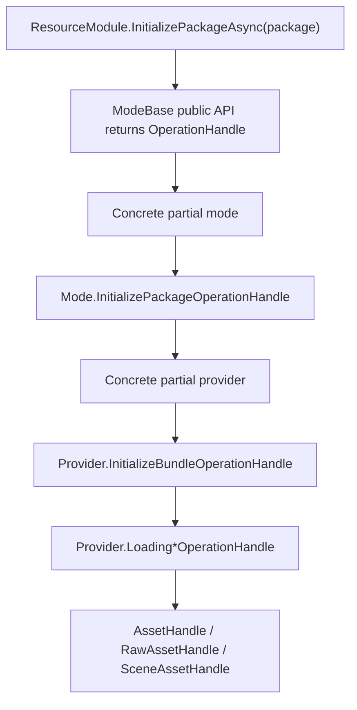

# resource-operation-ownership design

## 0. 术语约定

| 术语 | 当前定义 | 本次约定 |
|---|---|---|
| playmode package operation | 定义在具体 mode 类型内部的 package 生命周期 operation | 形如 `BundleMode.InitializePackageOperationHandle` |
| provider operation | 定义在具体 provider 类型内部的 bundle 生命周期与 loading operation | 形如 `BundleProvider.InitializeBundleOperationHandle` / `BundleProvider.LoadingAssetOperationHandle` |
| module operation | 定义在 `ResourceModule` 内部的资源模块门面级 operation | 形如 `ResourceModule.ManifestOperationHandle` |
| operation file | 存放 nested operation 的 partial owner 文件 | package operation 放 `PlayMode/ModeName.OperationName.cs`；provider operation 放 `Provider/ProviderName.OperationName.cs` |
| package lifecycle operation | 初始化 / 反初始化 package 的 operation | 归属具体 play mode，维护 mode 内部 provider 状态 |
| bundle lifecycle operation | provider 初始化 / 反初始化 bundle 的 operation | 归属具体 provider，产出或释放 `BundleHandle` |
| loading operation | asset/raw/scene loading operation | 归属具体 provider，产出 `AssetHandle` / `RawAssetHandle` / `SceneAssetHandle` |
| public lifecycle result | `ResourceModule` / `ModeBase` / `ProviderBase` 公开返回的 operation 类型 | package API 返回 `OperationHandle`；provider bundle init 仍返回 `OperationHandle<BundleHandle>` |

## 1. 决策与约束

### 需求摘要

做什么：把资源模块里 package、bundle、loading 相关 operation 从无归属顶层类和泛 mode 归属，改成“mode 负责 package，provider 负责 bundle/loading”的嵌套类；同时按归属移动文件，让目录和类型名都表达责任边界。

为谁：维护资源模块 mode/provider/operation 链路的开发者。目标是读代码时能直接从类型全名和文件路径看出 operation 属于哪个层级，避免 `InitializeBundleOperationHandle` / `LoadingAssetOperationHandle` 这类名字看不出实际由哪个 provider 使用。

成功标准：

- `ResourceModule.InitializePackageAsync()` / `ModeBase.InitializePackageAsync()` 返回 `OperationHandle`，不再返回 `OperationHandle<List<ProviderBase>>`。
- package 初始化/反初始化 operation 位于 `PlayMode/`，作为具体 mode 的 nested class。
- bundle 初始化/反初始化与 asset/raw/scene loading operation 位于 `Provider/`，作为具体 provider 的 nested class。
- `Resource/Operation/` 目录移除；manifest 编排归属 `ResourceModule.ManifestOperationHandle`。
- 原 `BundleMode` 已验收的 package -> provider -> bundle -> asset/raw/scene 行为保持不变。

明确不做：

- 不实现 `StreamingAssetMode`、`WebGLMode`、`EditorSimulatorMode` 的真实 asset/raw/scene loading 语义。
- 不把 `EditorSimulatorMode` 移到 Editor-only asmdef，不接入 `UnityEditor.AssetDatabase`。
- 不新增 manifest 字段、远端 URL、缓存路径、CRC 下载策略或 Addressables 兼容层。
- 不改变 `ResourceMode` 枚举和 `ResourceModule.CreateModeByType()` 的 mode 选择语义。
- 不重构 FileSystem、DownloadModule 或 SBP 打包流程。

### 关键决策

1. package operation 归属 play mode。
   - `BuiltinMode`、`BundleMode`、`StreamingAssetMode`、`EditorSimulatorMode`、`WebGLMode` 都拥有自己的 `InitializePackageOperationHandle` / `UninitializePackageOperationHandle`。
   - package operation 负责解析 package、创建 provider、注册或移除 mode 内部 provider 状态。

2. bundle lifecycle 与 loading operation 归属 provider。
   - `BundleProvider.InitializeBundleOperationHandle` / `UninitializeBundleOperationHandle` 承载 AssetBundle 初始化和释放。
   - `BundleProvider.LoadingAssetOperationHandle` / raw / scene 承载从 `BundleHandle.Asset` 加载资源。
   - `BuiltinProvider.*OperationHandle` 和 `EditorProvider.*OperationHandle` 承载各自 provider 当前语义。

3. 文件目录跟随 owner。
   - `PlayMode/BundleMode.InitializePackageOperationHandle.cs` 文件内是 `public sealed partial class BundleMode`。
   - `Provider/BundleProvider.LoadingAssetOperationHandle.cs` 文件内是 `public sealed partial class BundleProvider`。
   - `Operation/` 不再作为具体 operation 的集中堆放目录；门面级 manifest operation 归属 `ResourceModule`。

4. 公共 lifecycle API 不暴露 provider 列表。
   - `ResourceModule.InitializePackageAsync()` / `ModeBase.InitializePackageAsync()` 返回 `UniTask<OperationHandle>`。
   - provider 列表是 mode 的内部运行状态，不再通过 `OperationHandle<List<ProviderBase>>` 暴露。
   - `ProviderBase.InitializeProviderAsync()` 继续返回 `UniTask<OperationHandle<BundleHandle>>`，因为 bundle init 的产物是 provider 内部要持有的 `BundleHandle`。

5. 保持现有加载行为。
   - `BundleMode` package 初始化仍按 manifest 找 package、递归依赖、创建 `BundleProvider`、初始化 provider、失败回滚。
   - `BundleProvider` 已有的 handle 缓存、失败 handle、重复加载复用行为保持不变。
   - `StreamingAssetMode` / `WebGLMode` 当前仍复用 `BundleProvider`，因此没有自己的 bundle/loading operation。

## 2. 名词与编排

### 2.1 名词层

#### 设计时现状

- 旧顶层 `InitializePackageOperationHandle` 实际实现 `BundleMode` package 初始化。
- 旧顶层 `InitializeBundleOperationHandle` / `Loading*OperationHandle` 实际服务 `BundleProvider`。
- `BuiltinLoading*OperationHandle`、`EditorLoading*OperationHandle` 已有前缀但仍是顶层类。
- 早期重命名曾把所有 operation 放进 `Resource/Operation/` 并挂到 mode nested class，仍没有体现 module / mode / provider 的真实所有权。
- `ModeBase`、`ResourceModule` 的 package 初始化返回 `OperationHandle<List<ProviderBase>>`，把内部 provider 列表泄露给外部契约。

#### 变化

1. 建立 play mode package lifecycle 矩阵：

| owner | package init | package uninit |
|---|---|---|
| `BuiltinMode` | `BuiltinMode.InitializePackageOperationHandle` | `BuiltinMode.UninitializePackageOperationHandle` |
| `BundleMode` | `BundleMode.InitializePackageOperationHandle` | `BundleMode.UninitializePackageOperationHandle` |
| `StreamingAssetMode` | `StreamingAssetMode.InitializePackageOperationHandle` | `StreamingAssetMode.UninitializePackageOperationHandle` |
| `EditorSimulatorMode` | `EditorSimulatorMode.InitializePackageOperationHandle` | `EditorSimulatorMode.UninitializePackageOperationHandle` |
| `WebGLMode` | `WebGLMode.InitializePackageOperationHandle` | `WebGLMode.UninitializePackageOperationHandle` |

2. 建立 provider operation 矩阵：

| owner | bundle init | bundle uninit | loading |
|---|---|---|---|
| `BuiltinProvider` | `BuiltinProvider.InitializeBundleOperationHandle` | `BuiltinProvider.UninitializeBundleOperationHandle` | `BuiltinProvider.LoadingAssetOperationHandle` / raw / scene |
| `BundleProvider` | `BundleProvider.InitializeBundleOperationHandle` | `BundleProvider.UninitializeBundleOperationHandle` | `BundleProvider.LoadingAssetOperationHandle` / raw / scene |
| `EditorProvider` | `EditorProvider.InitializeBundleOperationHandle` | `EditorProvider.UninitializeBundleOperationHandle` | `EditorProvider.LoadingAssetOperationHandle` / raw / scene |

3. 公共契约调整：
   - `ModeBase` 和 `ResourceModule` 的 package init/uninit 均返回 `OperationHandle`。
   - 公开 API 不再暴露 `List<ProviderBase>` 作为 package 初始化结果。
   - `ProviderBase` 的 bundle lifecycle 返回 `OperationHandle<BundleHandle>` / `OperationHandle`。

4. 调用点迁移：
   - Mode 内部用自己的 package nested operation，例如 `Super.Operation.WaitCompletionAsync<InitializePackageOperationHandle>(...)`。
   - Provider 内部用自己的 bundle/loading nested operation，例如 `BundleProvider` 内调用 `WaitCompletionAsync<LoadingAssetOperationHandle>(...)`。

### 2.2 编排层

#### 当前流程级约束

- package 为 null / 空白时继续抛 `ArgumentNullException` / `ArgumentException`。
- `BUILTIN` package 仍只属于 `BuiltinMode`，其他 mode 初始化 `BUILTIN` 返回失败 operation。
- `BundleMode` 的 manifest 查询、依赖递归、provider 初始化失败回滚、反初始化释放行为保持不变。
- `BundleProvider` 的 handle 缓存、失败 handle、重复加载复用行为保持不变。

#### 需要收紧的现有行为

- Runtime 代码中不应再出现无 owner 的顶层具体 operation 类。
- 具体 operation 文件必须位于 owner 所在目录。
- 架构文档中不再把 mode 说成 bundle/loading operation 的 owner。

## 2.3 挂载点清单

1. `ModeBase` / `ResourceModule` package lifecycle API：package init 返回 `OperationHandle`。
2. `PlayMode/*Mode.cs`：具体 mode 为 `partial`，调用自己的 package lifecycle operation。
3. `Provider/*Provider.cs`：具体 provider 为 `partial`，调用自己的 bundle/loading operation。
4. `PlayMode/`：承载 `ModeName.InitializePackageOperationHandle.cs` / `ModeName.UninitializePackageOperationHandle.cs`。
5. `Provider/`：承载 `ProviderName.InitializeBundleOperationHandle.cs`、`ProviderName.UninitializeBundleOperationHandle.cs`、`ProviderName.Loading*OperationHandle.cs`。
6. `.codestable/architecture/ARCHITECTURE.md` 与 resource roadmap：同步 play mode package / provider operation 矩阵。

## 2.4 推进策略

1. 公共契约收口。
   - 退出信号：`ModeBase`、`ResourceModule` 不再出现 `OperationHandle<List<ProviderBase>>`。
2. provider owner 迁移。
   - 退出信号：`InitializeBundleOperationHandle`、`UninitializeBundleOperationHandle`、`Loading*OperationHandle` 只出现在 provider nested class 中。
3. play mode package operation 迁移。
   - 退出信号：`InitializePackageOperationHandle`、`UninitializePackageOperationHandle` 位于 `PlayMode/` 且只维护 mode package 状态。
4. 目录清理。
   - 退出信号：`Resource/Operation/` 目录不存在，`ManifestOperationHandle` 归属 `ResourceModule`。
5. 验证与文档同步。
   - 退出信号：Runtime 编译通过，架构文档和 roadmap 的 Operations 小节同步新矩阵。

## 2.5 结构健康度与微重构

##### 评估

- 文件级：manifest operation 放在 `ResourceModule`，package operation 放在 `PlayMode/`，bundle/loading operation 放在 `Provider/`，比集中放进 `Operation/` 更能表达责任边界。
- 文件级：具体 mode/provider 主文件保持当前职责，nested operation 放到独立 partial 文件，不把长 operation 实现塞回主文件。
- 文件级：`ModeBase.cs` / `ResourceModule.cs` 是公共契约，改 package init 返回值是本 feature 的核心，不属于额外重构。

##### 结论：做文件级微重构（重组目录）

本次把具体 operation 文件移动到 owner 所在目录。验证靠 Runtime 编译、grep owner 残留和 BundleMode 行为检查。

##### 建议沉淀的 convention

如果实现跑通，建议后续用 `cs-decide` 记录资源模块 operation 命名约定：package operation 归属 play mode，bundle/loading operation 归属 provider，文件位于 owner 所在目录并采用 `Owner.OperationName.cs`。

##### 超出范围的观察

- `ProviderBase` 把初始化命名为 `InitializeProviderAsync()`，返回值实际是 bundle lifecycle operation；如果后续希望 provider 和 bundle 术语完全解耦，应另起 refactor。
- `EditorProvider` 当前 Runtime 目录内仍有 editor simulator 语义，后续接入 `UnityEditor` API 前必须走 Editor-only 隔离。
- `StreamingAssetMode`、`WebGLMode` 的真实 loading 语义尚未定义，本次只避免 operation 命名继续误导。

## 3. 验收契约

| 编号 | 输入 / 触发 | 期望可观察结果 |
|---|---|---|
| N1 | grep `OperationHandle<List<ProviderBase>>` | Runtime Resource 目录无命中 |
| N2 | grep `class InitializePackageOperationHandle` | 只出现在 `PlayMode/*Mode.InitializePackageOperationHandle.cs` 的 mode nested class 中 |
| N3 | grep `class InitializeBundleOperationHandle` | 只出现在 `Provider/*Provider.InitializeBundleOperationHandle.cs` 的 provider nested class 中 |
| N4 | grep `class LoadingAssetOperationHandle` | 只出现在 `Provider/*Provider.LoadingAssetOperationHandle.cs` 的 provider nested class 中 |
| N5 | `Resource/Operation/` 目录 | 目录不存在，`ResourceModule.ManifestOperationHandle.cs` 位于 `Resource/` |
| N6 | 调用 `BundleMode.InitializePackageAsync(package)` | 返回 `OperationHandle`，实际执行 `BundleMode.InitializePackageOperationHandle`，原初始化行为保持 |
| N7 | 调用 `BundleProvider.LoadAssetAsync(location)` | 实际执行 `BundleProvider.LoadingAssetOperationHandle`，原 handle 成功/失败语义保持 |
| B1 | package 为 null / 空白 | 仍抛原有参数异常 |
| B2 | 非 Builtin mode 初始化 `BUILTIN` | 仍返回失败 operation |
| E1 | BundleMode 初始化失败 | 仍回滚本次新增 provider，不留下半初始化 provider |

### 明确不做的反向核对项

- 不新增 `StreamingAssetMode.Loading*` / `WebGLMode.Loading*` asset/raw/scene loading operation。
- 不让 `EditorSimulatorMode` 在 Runtime 中引用 `UnityEditor` API。
- 不改变 `ResourceMode.Online` 对应 `BundleMode` 的事实。
- 不新增缓存、下载、URL 或 manifest 字段。

## 4. 与项目级架构文档的关系

验收阶段需要更新 `.codestable/architecture/ARCHITECTURE.md` 的 Resource / Operations 小节：

- 删除无归属顶层 operation 名称作为当前真实类型的表述。
- 写入 module / play mode package / provider operation 命名矩阵。
- 继续保留已知限制：Builtin / StreamingAsset / WebGL / EditorSimulator 的真实 loading 链路仍未完全闭环。

如果该命名矩阵跑通后被确认是长期约束，建议后续用 `cs-decide` 记录一条资源 operation 命名决策。
