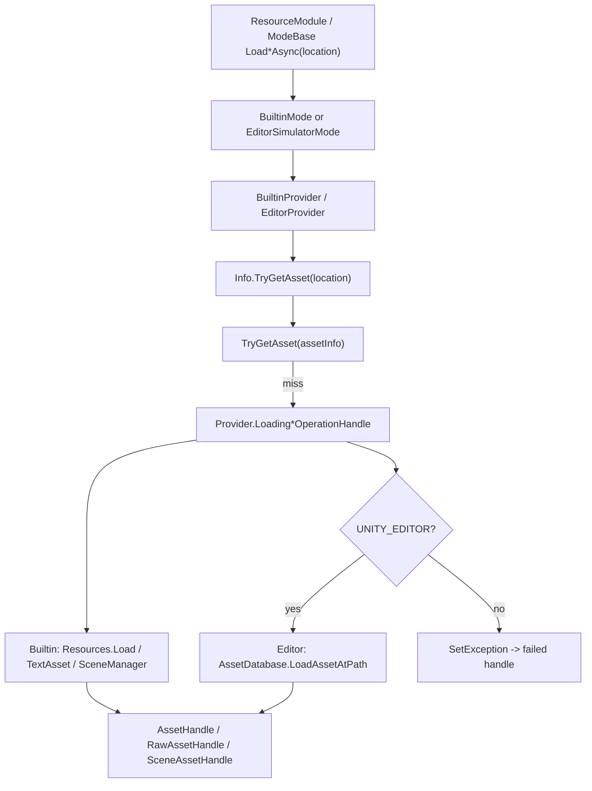

# builtin-editor-provider-loading design

## 0. 术语约定

| 术语 | 当前定义 | 本次约定 |
|---|---|---|
| `BuiltinProvider` | `BuiltinMode` 持有的单 provider，不加载 AssetBundle，当前 loading operation 为空实现 | asset/raw 使用 Unity `Resources` API 加载，bundle lifecycle 仍是无真实 AssetBundle 的成功占位 |
| `EditorProvider` | `EditorSimulatorMode` 为每个 `BundleInfo` 创建的 provider，当前 bundle/loading operation 抛 `NotImplementedException` | 在 Editor 下使用 `AssetDatabase` 加载资源；所有 `UnityEditor` 引用必须被 `UNITY_EDITOR` 编译期包裹 |
| `AssetInfo.Location` | provider 查询资源的主键，也是当前唯一可用于真实加载的定位字段 | Builtin 下以 `Resources/` 开头；Editor 下解释为 `Assets/...` 工程资源路径 |
| raw asset | `RawAssetHandle` 保存 `byte[] Data` | Builtin / Editor 都优先按 `TextAsset` 加载并取 `bytes`，不新增任意文件 IO 语义 |
| scene asset | `SceneAssetHandle` 保存 `UnityEngine.SceneManagement.Scene` | scene 加载不能由 `Resources.Load` / `AssetDatabase.LoadAssetAtPath<SceneAsset>` 直接得到运行时 `Scene`；本 feature 明确选择 additive scene load 或失败语义，需 review 确认 |

## 1. 决策与约束

### 需求摘要

做什么：补齐 `BuiltinProvider` 和 `EditorProvider` 当前未实现或空实现的 bundle lifecycle 与 asset/raw/scene loading operation，让 Builtin 资源可通过 Unity `Resources` 加载，Editor 模拟模式可在 Unity Editor 下通过 `AssetDatabase` 按清单路径加载。

为谁：维护和使用 GameDeveloperKit Resource 模块的运行时开发者，尤其是需要用 `ResourceMode.Builtin` 和 `ResourceMode.EditorSimulator` 验证资源加载链路的人。

成功标准：

- `BuiltinProvider.LoadAssetAsync(location)` / raw / label / type 通过 provider loading operation 返回成功或失败 handle，不再依赖空 `Execute()`。
- `EditorProvider.InitializeProviderAsync()` / `UninitializeProviderAsync()` 不再因 `NotImplementedException` 失败；Editor 下 asset/raw 加载通过 `AssetDatabase` 返回 handle。
- 所有 `UnityEditor` / `AssetDatabase` 类型和调用都在 `#if UNITY_EDITOR` 内，非 Editor 构建可以编译，并返回明确 failed operation/handle。
- 加载失败时错误对象可读，不静默返回成功空 handle。
- 不改变 `BundleProvider` 已验收的 AssetBundle 加载链路。

明确不做：

- 不新增 manifest 字段，例如 `AssetPath`、`ResourcesPath`、`SceneName`、`BundleName`。
- 不引入 Addressables、SBP 打包变更、Download/FileSystem 缓存策略或远端 URL 解析。
- 不把 `EditorProvider` / `EditorSimulatorMode` 移入 Editor-only asmdef；本次按用户要求用 `UNITY_EDITOR` 包裹解决编译边界。
- 不改变 `ProviderBase`、`ModeBase`、`ResourceModule` 的公开 API 形状。
- 不重构 `BundleProvider`、StreamingAsset/WebGL 模式或 ResourceModule startup 顺序。

### 复杂度档位

走对外发布库/框架默认档位，额外记录两个偏离点：

- `Compatibility = backward-compatible`：不改现有 handle、manifest、mode/provider 公共契约；只补齐既有 operation 的行为。
- `Concurrency = single-threaded`：沿用资源模块当前 Unity 主线程假设，不新增线程安全、队列或并行调度语义。

### 关键决策

1. Builtin 加载只依赖 `Resources` 和 `AssetInfo.Location`。
   - `AssetInfo.Location` 必须以 `Resources/` 开头，例如 `Resources/Configs/GameConfig`。
   - `Location` 是清单和 provider 查询用的完整 key；调用 `Resources.Load` 前必须裁掉开头的 `Resources/` 前缀，例如 `Resources/Configs/GameConfig` 规范化为 `Configs/GameConfig`。
   - `LoadingAssetOperationHandle` 使用规范化后的路径调用 `Resources.Load(normalizedLocation)`。
   - `LoadingRawAssetOperationHandle` 使用规范化后的路径调用 `Resources.Load<TextAsset>(normalizedLocation)`。

2. Editor 加载只依赖 `AssetDatabase` 和 `AssetInfo.Location`。
   - `AssetInfo.Location` 必须是 Unity 工程路径，例如 `Assets/Game/Configs/Foo.asset`。
   - `LoadingAssetOperationHandle` 使用 `AssetDatabase.LoadAssetAtPath<UnityEngine.Object>(location)`。
   - `LoadingRawAssetOperationHandle` 优先使用 `AssetDatabase.LoadAssetAtPath<TextAsset>(location)`，成功后取 `bytes`。
   - 非 Editor 编译分支不引用 `UnityEditor` 命名空间，直接设置明确异常。

3. EditorProvider 继续留在 Runtime 目录，但只做编译期隔离。
   - 当前架构文档曾记录“接入 `UnityEditor` API 前必须先隔离到 Editor-only asmdef”；本次需求明确要求 `UNITY_EDITOR` 包裹，因此本 feature 采用受限实现。
   - 后续如要彻底移到 Editor-only asmdef，应另起 refactor，不阻塞本次 loading operation 补齐。

4. bundle lifecycle 的占位语义保持轻量，并且 EditorProvider 与 BuiltinProvider 对齐。
   - Builtin 没有真实 AssetBundle，`InitializeBundleOperationHandle` 返回 `BundleHandle.Success(bundleInfo, null)`；uninitialize 只返回成功。
   - EditorProvider 也没有真实 AssetBundle，`InitializeBundleOperationHandle` / `UninitializeBundleOperationHandle` 必须和 BuiltinProvider 的对应 operation 一样：initialize 返回 `BundleHandle.Success(bundleInfo, null)`，uninitialize 直接成功，不额外要求真实 bundle 或释放占位 AssetBundle。

5. scene 加载需要显式定口径。
   - `Resources.Load` 和 `AssetDatabase.LoadAssetAtPath<SceneAsset>` 都不能直接产出运行时 `Scene`。
   - 推荐本 feature 对 Builtin / Editor 的 scene operation 使用 `SceneManager.LoadSceneAsync(assetInfo.Location, LoadSceneMode.Additive)` 并返回 `SceneAssetHandle.Success(assetInfo, scene)`；这要求 `AssetInfo.Location` 对 scene 表示 build settings 可加载的 scene 名。
   - 如果用户坚持“Builtin scene 也必须来自 Resources 路径”或“Editor scene 必须打开未加入 build settings 的 scene asset”，需要扩展 manifest 字段或引入 EditorSceneManager 语义，超出本次无 schema 变更范围。

## 2. 名词与编排

### 2.1 名词层

#### 现状

- `AssetInfo` 只有 `Location`、`TypeName`、`Labels`，没有区分 Resources 路径、AssetDatabase 路径和 scene 名的字段。
- `BundleInfo.TryGetAsset(location, out assetInfo)` 用 `Location` / `TypeName` / `Labels` 匹配资源；provider 的 `HasAsset()` 也沿用这三类匹配。
- `BuiltinProvider.InitializeBundleOperationHandle` / `UninitializeBundleOperationHandle` 已能返回无 AssetBundle 的成功结果。
- `BuiltinProvider.LoadingAssetOperationHandle` / raw / scene 的 `Execute()` 为空，导致等待 operation 无法产出 handle。
- `EditorProvider.InitializeBundleOperationHandle` / `UninitializeBundleOperationHandle` 设置 `NotImplementedException`，loading operation 直接抛 `NotImplementedException`。
- `BundleProvider` 已提供成功参照：loading operation 校验 `AssetInfo`、加载 Unity 对象或 `TextAsset`、创建 handle、失败时 `SetException()`。

#### 变化

1. Builtin loading operation 补齐：
   - `LoadingAssetOperationHandle`：输入 `AssetInfo`，校验 `Location` 以 `Resources/` 开头，裁掉前缀后调用 `Resources.Load(normalizedLocation)`，产出 `AssetHandle.Success(assetInfo, asset)`。
   - `LoadingRawAssetOperationHandle`：输入 `AssetInfo`，校验并规范化 `Location` 后调用 `Resources.Load<TextAsset>(normalizedLocation).bytes`，产出 `RawAssetHandle.Success(assetInfo, bytes)`。
   - `LoadingSceneAssetOperationHandle`：输入 `AssetInfo`，按第 1 节 scene 决策走 additive scene load，或在未确认时返回明确失败。

2. Editor bundle lifecycle operation 补齐：
   - `InitializeBundleOperationHandle`：和 BuiltinProvider 一样，输入 `BundleInfo`，返回 `BundleHandle.Success(bundleInfo, null)`，不触碰真实 AssetBundle。
   - `UninitializeBundleOperationHandle`：和 BuiltinProvider 一样直接成功，不因缺少真实 AssetBundle 或占位 handle 而失败。

3. Editor loading operation 补齐：
   - Editor 分支使用 `AssetDatabase` 加载 Unity Object / TextAsset。
   - 非 Editor 分支返回 `GameException("EditorProvider is only available in Unity Editor.")` 这类明确错误。
   - 所有成功 handle 与 BundleProvider 一样可放入 provider 的 `_assets` 缓存。

4. 路径契约写入验收：
   - Builtin 的非 scene 资源：`Location = "Resources/Configs/GameConfig"`，加载 API 使用规范化路径 `"Configs/GameConfig"`。
   - Editor 的非 scene 资源：`Location = "Assets/Game/Configs/GameConfig.asset"`。
   - scene：`Location` 是否用 scene 名，需由 review 确认。

### 2.2 编排层

#### 现状

- `BuiltinMode` 持有一个 `BuiltinProvider`，provider 的公开加载方法已经按 `Info.TryGetAsset()`、缓存、operation、失败 handle 的流程编排。
- `EditorSimulatorMode` 为 package/bundle 创建 `EditorProvider`，provider 的公开加载方法结构接近 `BundleProvider`。
- 空实现 / 未实现点集中在 provider nested operation，主流程骨架已经存在。
- `OperationModule.WaitCompletionAsync<T>()` 已能创建、执行、等待并传播 operation 状态。

#### 变化

1. 不改 mode/provider 主流程拓扑，只替换 operation 计算节点。
2. Builtin asset/raw 成功路径：
   - 查到 `AssetInfo` → 校验并规范化 `Resources/` 前缀 → 执行 loading operation → `Resources` 返回对象 → 创建 handle → provider 缓存复用。
3. Editor asset/raw 成功路径：
   - 查到 `AssetInfo` → 执行 loading operation → Editor 分支 `AssetDatabase` 返回对象 → 创建 handle → provider 缓存复用。
4. 失败路径：
   - `AssetInfo` 缺失、`Location` 为空、Builtin `Location` 不以 `Resources/` 开头、Resources/AssetDatabase 返回 null、非 Editor 环境调用 EditorProvider，均通过 operation exception 或 failed handle 暴露。
5. scene 路径：
   - 若采用推荐决策，operation 使用 `SceneManager.LoadSceneAsync(..., Additive)`，加载完成后通过 `SceneManager.GetSceneByName()` 取得运行时 Scene。
   - 若 review 不接受该决策，本 feature 的 scene operation 应返回明确失败，并把未加入 build settings 的 Editor scene 打开能力留给后续 schema / Editor-only feature。

#### 流程级约束

- 错误语义：operation 内捕获预期异常并 `SetException(exception)`；provider 外层继续返回对应 failed handle。
- 幂等性：重复加载同一 `AssetInfo` 和同一 handle 类型时复用 `_assets` / `_pendingUnloadAssets`，不重复创建 handle。
- 顺序约束：Unity 资源 API 仍假定主线程调用，不新增后台线程。
- 编译约束：运行时代码中不能出现未被 `#if UNITY_EDITOR` 包裹的 `using UnityEditor`、`UnityEditor.AssetDatabase`、`UnityEditor.SceneAsset`。
- 扩展点：本次只支持 Builtin 的 `Resources/` 前缀裁剪，不做其他路径猜测；如果后续 manifest 需要同时表达 Resources 路径和 Editor asset path，应另起 feature 扩展 `AssetInfo`。

### 2.3 挂载点清单

1. `BuiltinProvider.LoadingAssetOperationHandle` / raw / scene：Builtin 真实加载节点。
2. `EditorProvider.InitializeBundleOperationHandle` / `UninitializeBundleOperationHandle`：EditorProvider 可初始化的 lifecycle 节点。
3. `EditorProvider.LoadingAssetOperationHandle` / raw / scene：Editor 模拟模式真实加载节点。
4. `UNITY_EDITOR` 编译分支：EditorProvider 使用 `AssetDatabase` 的唯一挂入边界。
5. `.codestable/architecture/ARCHITECTURE.md`：验收后同步 Builtin / EditorProvider loading 已补齐和剩余 scene/path 约束。

### 2.4 推进策略

1. Builtin asset/raw operation：先补齐 `Resources.Load` 和 `TextAsset.bytes` 两条无 scene 争议路径。
   - 退出信号：给定以 `Resources/` 开头的 `AssetInfo.Location`，asset/raw 成功返回有效 handle；无效路径或缺少前缀返回 failed handle。
2. Editor bundle lifecycle：补齐无真实 AssetBundle 的 initialize/uninitialize 占位成功语义。
   - 退出信号：`EditorProvider.InitializeBundleOperationHandle` / `UninitializeBundleOperationHandle` 行为和 BuiltinProvider 一致，不再因 `NotImplementedException` 或缺少真实 AssetBundle 失败。
3. Editor asset/raw operation：在 `UNITY_EDITOR` 分支接入 `AssetDatabase`，非 Editor 分支返回明确失败。
   - 退出信号：Editor 编译中可加载 `Assets/...` 路径资源；runtime 非 Editor 编译无 `UnityEditor` 未隔离引用。
4. scene operation 决策落地：按 review 结果实现 additive scene load 或明确失败。
   - 退出信号：scene 行为与第 1 节决策一致，失败时错误可读。
5. 缓存与批量路径核对：确保加载成功 handle 只加入一次缓存，label/type 批量加载不漏掉成功项。
   - 退出信号：重复加载复用 handle，label/type 批量返回命中集合，不产生重复缓存。
6. 验证覆盖：编译、grep `UnityEditor` 隔离、覆盖成功/空路径/未找到/非 Editor 分支。
   - 退出信号：Runtime 编译通过，关键场景都有可观察证据。

### 2.5 结构健康度与微重构

##### 评估

- 文件级 — `BuiltinProvider.cs`：约 222 行，职责是单 provider 的查询、缓存、卸载和公开加载编排；本 feature 不需要把具体加载计算塞进主文件，继续放在现有 operation partial 文件中。
- 文件级 — `EditorProvider.cs`：约 250 行，职责和 `BundleProvider` 接近；本 feature 主要补 nested operation，主文件只需在必要时收紧错误与缓存语义。
- 文件级 — provider operation 文件：当前很薄但命名和归属符合 `resource-operation-ownership` 既有设计，不适合合并回主文件。
- 目录级 — `Assets/GameDeveloperKit/Runtime/Resource/Provider/`：当前约 36 个文件，已按 `Owner.OperationName.cs` 形成稳定命名；本次不新增 provider 类型，不需要新目录。
- compound convention 检索：未命中既有“目录组织 / 命名 / 归属”决策；按已验收 feature `resource-operation-ownership` 的 owner 文件模式执行。

##### 结论：不做微重构

本次是既有 operation 的行为补齐。拆目录或移动 Runtime/Editor 边界会改变 feature 范围，并且与用户指定的 `UNITY_EDITOR` 包裹方式相冲突；保留现有 partial operation 文件结构最稳。

##### 超出范围的观察

- `EditorProvider` 留在 Runtime 目录并用 `UNITY_EDITOR` 包裹是短期受限实现；若后续要长期维护未加入 build settings 的 scene asset 打开、AssetDatabase 搜索、编辑器专属资源检查，应另起 `cs-refactor` 或 feature 把 EditorSimulator 隔离到 Editor-only asmdef。
- `AssetInfo.Location` 同时承担业务地址、Resources 路径、Editor asset path、scene 名，语义已开始拥挤；如果后续需要跨 provider 同一清单通用，应另起 manifest schema feature。

## 3. 验收契约

| 编号 | 输入 / 触发 | 期望可观察结果 |
|---|---|---|
| N1 | Builtin `AssetInfo.Location = "Resources/Configs/GameConfig"` 且 Resources 下存在对象，调用 `LoadAssetAsync(location)` | operation 裁掉 `Resources/` 前缀后加载，返回 `AssetHandle`，`IsValid == true`，`Asset != null` |
| N2 | Builtin raw 资源为 `TextAsset`，调用 `LoadRawAssetAsync(location)` | 返回 `RawAssetHandle`，`Data.Length > 0` |
| N3 | Builtin 路径不存在 | 返回 failed handle，`Error` 描述资源加载失败 |
| N4 | Editor 下 `AssetInfo.Location = "Assets/.../Foo.asset"`，调用 `EditorProvider.LoadAssetAsync(location)` | 通过 `AssetDatabase` 返回有效 `AssetHandle` |
| N5 | Editor 下 raw `TextAsset` 路径有效 | 返回 `RawAssetHandle`，`Data` 等于 `TextAsset.bytes` |
| N6 | 非 Editor 编译分支调用 EditorProvider loading operation | 不引用 `UnityEditor`，返回明确 failed handle/operation |
| N7 | 重复加载同一 asset/raw | 第二次命中 provider 缓存，返回同一 handle 类型的已加载 handle |
| N8 | label/type 批量加载命中多个资源 | 返回所有成功加载的 handle，失败项不静默污染成功项 |
| N9 | scene operation 按 review 决策触发 | additive scene load 成功返回有效 `SceneAssetHandle`，或明确 failed handle；不得假装 `Resources.Load` / `AssetDatabase.LoadAssetAtPath` 能直接产出运行时 `Scene` |
| E1 | `AssetInfo` 为 null 或 `Location` 为空 | operation 失败并携带 `ArgumentNullException` / `ArgumentException` |
| E2 | Builtin `Location` 不以 `Resources/` 开头 | 返回 failed handle，错误描述路径契约不满足 |
| E3 | EditorProvider initialize/uninitialize | 行为和 BuiltinProvider lifecycle operation 一致，不抛 `NotImplementedException`；成功时返回 operation success |

### 明确不做的反向核对项

- 不新增 `AssetInfo.AssetPath`、`ResourcesPath`、`ScenePath`、`BundleName` 等 manifest 字段。
- 不新增 Addressables、SBP、DownloadModule、FileSystem 或远端 URL 相关调用。
- 不修改 `ProviderBase`、`ModeBase`、`ResourceModule` 公开 API。
- 不改 `BundleProvider` 已有 AssetBundle 加载 operation 的主语义。
- Runtime 非 `UNITY_EDITOR` 分支不应出现裸 `UnityEditor` / `AssetDatabase` 引用。

## 4. 与项目级架构文档的关系

验收阶段需要更新 `.codestable/architecture/ARCHITECTURE.md` 的 Resource 小节：

- 将“Builtin loading operation 仍未补齐、EditorProvider editor loading operation 未实现”改为当前真实状态。
- 记录 `BuiltinProvider` 的 `Location` 以 `Resources/` 开头，加载前裁掉该前缀后调用 Unity `Resources` API；`EditorProvider` 在 Editor 下使用 AssetDatabase 工程路径。
- 调整“EditorSimulator 当前在 Runtime 目录”硬边界：注明本 feature 采用 `UNITY_EDITOR` 编译隔离作为短期实现，彻底 Editor-only asmdef 隔离仍是后续 refactor 方向。
- 若 scene 决策采用 additive scene load，把 scene 的 build settings / scene name 约束写入已知约束；若采用明确失败，也要写入“Builtin/Editor scene loading 仍未启用”的限制。
