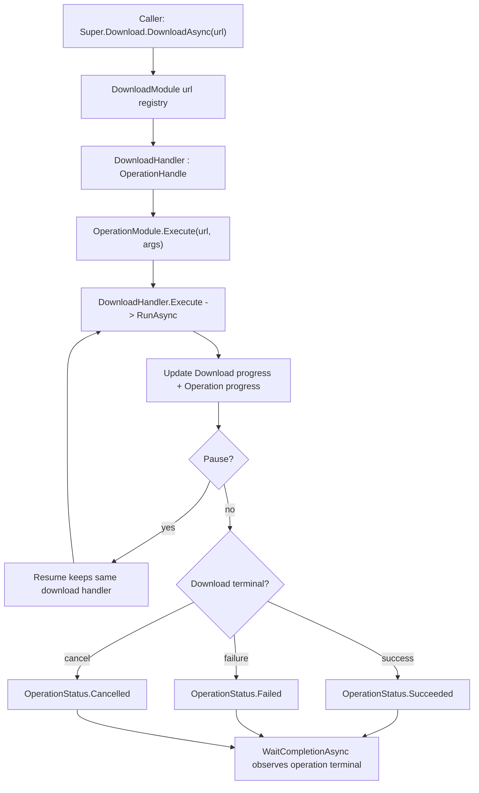

# download-operation-handle design

## 0. 术语约定

| 术语 | 当前定义 | 本次约定 |
|---|---|---|
| `DownloadHandler` | 单文件下载控制柄，位于 `Assets/GameDeveloperKit/Runtime/Download/DownloadHandler.cs`，原先自维护下载状态、进度、错误、事件和 `UniTaskCompletionSource` | 继续作为下载领域公开句柄，直接使用 `OperationHandle` 的状态、终态、等待、错误和进度语义 |
| `DownloadListHandler` | 批量下载控制柄，位于 `Assets/GameDeveloperKit/Runtime/Download/DownloadListHandler.cs`，聚合多个 `DownloadHandler` 并顺序执行 | 继续作为批量下载领域公开句柄，直接使用 `OperationHandle`，其成功表示每个子项都成功；任一子项失败则列表最终 failed |
| `OperationStatus` | operation 通用状态：`None` / `Pending` / `Running` / `Paused` / `Cancelled` / `Succeeded` / `Failed`，位于 `OperationHandle.cs` | 作为下载与其他模块统一等待、暂停和终态语义 |
| operation key | `OperationModule` 用于登记运行中 operation 的定位键 | 单文件下载倾向使用 URL；批量下载需要一个不会与单文件 URL 混淆的列表 key |
| partial failure | 批量下载中部分子项失败、取消，其余继续下载 | 列表继续处理后续项，但最终 `DownloadListHandler` 的 operation 按失败处理；失败细节从 `Items[*].Status/Error/FailureKind` 读取 |

## 1. 决策与约束

### 需求摘要

做什么：把 `DownloadHandler` 和 `DownloadListHandler` 接入现有 `OperationHandle` 体系，让下载句柄也能走统一的 operation 等待、进度、错误和终态观察方式，同时保留下载模块已有的暂停、恢复、取消、断点续传和批量失败继续语义。

为谁：维护 GameDeveloperKit 下载模块和上层资源/热更新链路的开发者。资源模块已经围绕 `OperationModule` / `OperationHandle` 建立异步编排范式，下载句柄接入后，上层可以用一致的 operation 方式观察下载生命周期。

成功标准：

- 单文件下载句柄可以作为 `OperationHandle` 被等待；暂停、完成、失败、取消时 `OperationStatus` 可观察。
- 批量下载句柄可以作为 `OperationHandle` 被等待；批量流程会继续处理后续项，但只要存在单项失败，列表 operation 最终按失败处理。
- 下载句柄不再维护独立下载状态，统一使用 `OperationStatus` 表达 `Paused`、`Failed`、`Cancelled`、`Succeeded` 等状态。
- 下载错误不再维护独立 string `Error` 字段，直接使用 `OperationHandle.Error`；调用方通过 `Error?.Message` 读取文本。
- `ProgressChanged` / `Completed` / `Failed` / `Canceled` 等既有下载事件继续可用。
- 下载模块继续复用同 URL 的单文件 handler，不因为接入 `OperationModule` 创建重复下载。

明确不做：

- 不把 `OperationModule` 改造成下载队列、限速器、重试器或调度器。
- 不移除 `DownloadFailureKind`、下载事件或 `WaitCompletionAsync()` 既有 API。
- 不改变 `DownloadModule` 的 temp 下载目录、分片阈值、Range 续传、取消清理规则。
- 不让单项失败中断后续下载；但列表最终 operation 按失败处理。
- 不接入 `FileModule`、资源清单、版本比对、hash 校验、解压或热更新导入流程。
- 不新增第三方依赖，不引入 `UnityEditor` API。

### 复杂度档位

走 Unity 运行时框架默认档位，以下维度偏离：

- 健壮性 = L3（偏离项目内部工具默认 L2）：下载面对网络、IO、取消、恢复等外部不稳定因素，接入 operation 后不能丢失既有失败状态和可恢复语义。
- 结构 = modules（偏离默认 functions）：涉及 Download 与 Operation 两个模块的公共契约，需要保持职责边界清晰。
- 可观测性 = logged 之下的 handler-level observable：不新增日志系统，但必须通过 `OperationStatus`、`Error`、`FailureKind`、进度和事件可观察。

### 关键决策

1. 删除公开 `DownloadStatus`，直接使用 `OperationStatus`。
   - `OperationStatus` 新增 `Paused` 非终态，用于表达下载暂停但等待链路不完成。
   - `Failed` 继续支持 `Resume()`，`Cancelled` 继续触发 temp / `.part` 清理。
   - 下载失败分类继续由 `DownloadFailureKind` 表达。

2. `DownloadHandler` 成为单文件下载 operation。
   - 继续由 `DownloadModule.DownloadAsync(url)` 返回 `DownloadHandler`。
   - 单文件成功时：`OperationStatus.Succeeded`。
   - 单文件失败时：`OperationStatus.Failed`，错误对象进入 operation `Error`，不再保留下载自己的 string `Error` 字段。
   - 单文件取消时：`OperationStatus.Cancelled`。
   - 暂停时：`OperationStatus.Paused`，operation 不进入终态，等待者继续等待后续恢复、失败、完成或取消。

3. `DownloadListHandler` 成为批量下载 operation。
   - 列表 operation 的成功表示“列表中每个子项都成功完成”。
   - 单项失败继续时，列表仍继续处理后续项；所有子项进入终态后，列表最终 `OperationStatus.Failed`。
   - 列表被显式取消时，列表 `OperationStatus.Cancelled`。
   - 如果列表编排自身出现非预期异常，列表 `OperationStatus.Failed`，并保留可观察错误。

4. `OperationModule` 只登记和清理下载 operation，不接管下载调度。
   - 下载真实执行仍在 `DownloadHandler.RunAsync()` 和 `DownloadListHandler.RunAsync()`。
   - `DownloadModule` 可以通过 `Super.Operation.Execute(key, handler)` 登记运行中下载；`OperationModule` 不创建下载 handler，也不决定 URL 去重策略。
   - 同 URL 去重仍由 `DownloadModule` 的 `m_Downloads` 负责。

5. 旧等待 API 保持向后兼容。
   - `DownloadHandler.WaitCompletionAsync()` 和 `DownloadListHandler.WaitCompletionAsync()` 继续存在。
   - 它们复用 operation 的完成源，但下载侧等待 API 保持“无论成功、失败、取消都会返回”的旧语义；失败/取消后的具体错误从 `OperationHandle.Error`、`OperationStatus` 和 `FailureKind` 读取。
   - 下载事件继续保留，operation 接入是新增统一观察面，不是替换下载领域事件。

6. 批量 operation key 必须避免 URL 误冲突。
   - 单文件 key 可以是原始 URL 字符串，延续下载注册表语义。
   - 批量 key 不能简单用第一个 URL；需要列表实例自身、稳定批量请求对象或内部 key 类型，避免与单文件 operation 冲突。
   - key 只服务运行中 operation 登记，不改变 `DownloadModule.GetDownload(url)` 这类 URL 查询面。

## 2. 名词与编排

### 2.1 名词层

#### 现状

- `DownloadHandler` 位于 `Assets/GameDeveloperKit/Runtime/Download/DownloadHandler.cs`，约 619 行；变更前是普通 class，不继承 `OperationHandle`。它自维护完成源、下载状态、`Error` 字符串、`FailureKind`、下载进度和下载事件。
- `DownloadListHandler` 位于 `Assets/GameDeveloperKit/Runtime/Download/DownloadListHandler.cs`，约 195 行；变更前是普通 class，聚合 `List<DownloadHandler>`，自维护完成源、下载状态和批量进度/完成事件。
- `OperationHandle` 位于 `Assets/GameDeveloperKit/Runtime/OperationModule/OperationHandle.cs`，约 200 行；提供 `OperationStatus`、`Exception Error`、`SetResult()`、`SetException()`、`SetPause()`、`SetResume()`、`SetCancel()`、兼容 `SetCanceled()`、`WaitCompletionAsync()`、`SetProgress(float)` 和抽象 `Execute(args)`。
- `OperationModule` 位于 `Assets/GameDeveloperKit/Runtime/OperationModule/OperationModule.cs`，通过 `(operation key, operation type)` 登记运行中 operation，支持 `Execute(key, operation, args)`、`WaitCompletionAsync<T>(key, args)`、`SetResult/SetException/SetCanceled` 和 `Shutdown()` 清理。
- `DownloadModule` 位于 `Assets/GameDeveloperKit/Runtime/Download/DownloadModule.cs`，约 176 行；通过 `m_Downloads` 维护 `url -> DownloadHandler`，`DownloadAsync(url)` 创建/复用并启动单文件 handler，`DownloadListAsync(urls)` 创建 `DownloadListHandler` 并启动列表。
- `ResourceModule.ManifestOperationHandle` 位于 `Assets/GameDeveloperKit/Runtime/Resource/ResourceModule.ManifestOperationHandle.cs`；当前下载 manifest 后读取 `operation.Error` 并包装成 `GameException`，这会受 `DownloadHandler.Error` 从 string 切到 Exception 的契约变化影响。

#### 变化

1. `DownloadHandler` 接入 `OperationHandle`。
   - 继承 `OperationHandle`，使下载句柄直接进入统一 operation 生命周期。
   - 补齐 `Execute(params object[] args)` 作为 operation 入口；下载参数由 `OperationModule.Execute<T>(key, args)` 传入，`DownloadModule` 不直接 `new DownloadHandler(...)`。
   - 移除或停用内部独立 `UniTaskCompletionSource`，终态信号统一走 `SetResult()` / `SetException()` / `SetCanceled()`。

2. `DownloadListHandler` 接入 `OperationHandle`。
   - 与单文件一致，补齐 operation 入口。
   - 列表内部仍订阅子项事件并按顺序启动/等待。
   - 列表完成时根据批量规则设置 operation 终态。

3. 下载错误直接使用 operation 错误字段。
   - `DownloadHandler.Error` 当前是 `string`，`OperationHandle.Error` 是 `Exception`；直接继承会出现成员命名冲突。
   - 本次删除下载侧独立 string `Error`，直接使用 `OperationHandle.Error` 作为统一错误对象。
   - 调用方需要错误文本时使用 `handler.Error?.Message`；下载失败分类继续使用 `FailureKind`。
   - 失败后 `Resume()` 需要清理 operation 错误与终态，使同一个 handler 能重新进入运行态。
   - 现有 `ResourceModule.ManifestOperationHandle` 需要从 `new GameException(operation.Error)` 调整为直接传递 `operation.Error` 或使用明确 manifest 错误文本。

4. 下载状态统一收口到 operation 状态。
   - `DownloadHandler.Status` / `DownloadListHandler.Status` 直接继承 `OperationHandle.Status`。
   - 不再用下载侧 `Status` 遮蔽 operation `Status`，避免调用方误读。
   - `OperationStatus.Paused` 是非终态；`WaitCompletionAsync()` 不会因暂停完成。
   - `SetPause()` / `SetResume()` / `SetCancel()` 作为 operation 状态入口保持 `virtual`；`DownloadHandler` 和 `DownloadListHandler` 通过 override 承载下载侧暂停、恢复、取消行为，旧 `Pause()` / `Resume()` / `Cancel()` 仅保留为兼容包装。

5. 下载进度与 operation 进度打通。
   - `DownloadHandler.Progress` 继续按 `DownloadedBytes / TotalBytes` 计算。
   - 进度变化时同步写入 operation progress，使 `SetProgressHandle` 的调用方能收到下载进度。
   - `DownloadListHandler.Progress` 继续按子项平均值计算，并同步 operation progress。

#### 接口示例

```csharp
// 来源：Assets/GameDeveloperKit/Runtime/Download/DownloadModule.cs DownloadAsync
DownloadHandler handler = Super.Download.DownloadAsync(url);
await handler.WaitCompletionAsync();

// handler.Status == OperationStatus.Succeeded / Failed / Cancelled
```

```csharp
// 来源：Assets/GameDeveloperKit/Runtime/Download/DownloadModule.cs DownloadListAsync
DownloadListHandler list = Super.Download.DownloadListAsync(urlA, urlB);
await list.WaitCompletionAsync();

// list operation 成功只代表列表编排完成
// list.Items 仍是每个 URL 的真实下载结果来源
```

### 2.2 编排层



#### 现状

- 单文件下载流程变更前由 `DownloadModule.GetOrCreateHandler(url, start)` 创建/复用 handler，并直接调用 `handler.Start()`。
- `DownloadHandler.Start()` 变更前防重复后调用 `RunAsync().Forget()`；`RunAsync()` 负责创建 temp 目录、探测 HEAD、选择单流或分片下载、更新进度、触发事件和 `SignalCompletion()`。
- 暂停变更前只设置下载侧状态并让当前请求中断；恢复会 `ResetCompletion()` 后重新 `RunAsync()`；取消会删除 temp / `.part` 并 `SignalCompletion()`。
- 批量下载变更前由 `DownloadListHandler.Start()` 顺序 `item.Start()` + `await item.WaitCompletionAsync()`；单项失败/取消只作为子项终态，列表继续下一项。
- `OperationModule` 当前没有参与 Download 模块。

#### 变化

1. 单文件启动路径接入 operation 登记。
   - `DownloadModule` 创建或复用 handler 后，通过 operation 入口启动运行中下载。
   - 对新 handler：通过 `Super.Operation.Execute<DownloadHandler>(url, args)` 创建、登记并执行。
   - 对已有 handler：如果仍在等待/下载/暂停/失败可恢复状态，复用同一实例，不创建第二个同 URL operation。

2. handler 终态由 operation 统一唤醒。
   - 下载成功路径从 `SignalCompletion()` 改为设置 operation 成功。
   - 下载失败路径改为设置 operation 失败。
   - 下载取消路径设置 operation 取消。

3. 暂停/恢复不破坏等待者。
   - 暂停仍保留 temp / `.part`，不清理 handler。
   - 暂停不设置 operation 终态；等待者继续等待后续恢复、失败、完成或取消。
   - 恢复沿用同一个 handler，重新进入 operation 运行态，不创建新的下载 handler。

4. 批量列表作为独立 operation 登记。
   - 列表 handler 使用独立 key 登记运行中 operation。
   - 列表 `Execute()` 调用现有顺序编排。
   - 子项失败继续处理后续项；全部子项进入终态后，只要存在失败项，列表设置 operation 失败。
   - 列表显式取消时设置 operation 取消；列表自身异常时设置 operation 失败。

5. 关闭清理继续从 DownloadModule 发起。
   - `DownloadModule.Shutdown()` 仍调用 `CancelAll()`，触发每个下载 handler 的取消语义和 temp 清理。
   - `OperationModule.Shutdown()` 对运行中 operation 的取消是兜底，不替代 DownloadModule 的 temp 清理。
   - 模块注册/关闭顺序如果导致 OperationModule 先 shutdown，DownloadModule 仍需能用自身取消路径清理 temp。

#### 流程级约束

- 错误语义：参数非法仍由 `DownloadModule.ValidateUrl` 抛参数异常；网络/IO/HTTP/分片错误进入 `OperationStatus.Failed` 并保存异常。
- 幂等性：同 URL 重复 `DownloadAsync(url)` 仍返回同一 `DownloadHandler`；不会因为 operation 登记重复启动第二条网络请求。
- 暂停语义：暂停保留 temp / `.part`，不清理 handler，不唤醒 `WaitCompletionAsync()`。
- 批量部分失败语义：单项失败不阻断后续下载，但全部子项处理完后列表 operation 必须失败。
- 并发约束：继续假定公开 API 在 Unity 主线程调用；不新增线程安全承诺。
- 可观测点：调用方可通过 `OperationStatus` / `FailureKind` / `OperationHandle.Error` / operation progress 观察下载结果。
- 扩展点：后续资源热更新可以等待 download operation，但下载模块本 feature 不新增资源导入、校验或安装流程。

### 2.3 挂载点清单

1. `DownloadHandler : OperationHandle`：单文件下载句柄进入统一 operation 生命周期；删除后单文件下载不再是 operation。
2. `DownloadListHandler : OperationHandle`：批量下载句柄进入统一 operation 生命周期；删除后批量下载不再是 operation。
3. `DownloadModule` 启动路径：`DownloadAsync` / `DownloadListAsync` 将 handler 交给 operation 入口执行；删除后只有类型继承但不会登记运行中 operation。

### 2.4 推进策略

1. 契约对齐：下载公开状态统一使用 `OperationStatus`，删除下载侧独立 string `Error`。
   - 退出信号：单文件和批量 handler 的公开观察面可编译，状态统一来自 `OperationHandle.Status`，错误统一来自 `OperationHandle.Error`。
2. 单文件 operation 骨架：让 `DownloadHandler` 能通过 operation 入口启动现有下载流程。
   - 退出信号：`DownloadAsync(validUrl)` 返回的 handler 由 `OperationModule.Execute<T>` 创建并启动，正常完成能唤醒等待者。
3. 单文件终态映射：接通成功、失败、取消和进度映射。
   - 退出信号：成功映射 Succeeded，失败映射 Failed 且错误可读，取消映射 Cancelled 且 temp 清理不变。
4. 暂停/恢复语义收口：暂停不完成 operation，恢复后继续同一 handler 和等待链路。
   - 退出信号：暂停不会唤醒 operation 等待者，恢复后最终完成/失败/取消会唤醒同一等待链路。
5. 批量 operation 骨架：让 `DownloadListHandler` 作为 operation 执行顺序下载。
   - 退出信号：批量等待能在列表跑完后完成，子项结果仍从 `Items` 读取。
6. 批量终态映射：接通部分失败继续但最终失败、显式取消、列表自身异常三类状态。
   - 退出信号：单项失败不阻断后续项，但列表最终 operation failed；列表取消映射 Cancelled。
7. 验证覆盖：补齐正常、边界、错误和范围守护场景。
   - 退出信号：Runtime 编译通过，关键验收场景都有代码审查或测试证据。
8. 下载错误 API 引用迁移：更新现有调用方对 `DownloadHandler.Error` 的使用。
   - 退出信号：Runtime 编译通过，现有调用方不再把 `operation.Error` 当 string 使用。

### 2.5 结构健康度与微重构

##### 评估

- compound convention 检索：`doc_type=decision` + `category=convention` + “目录组织 OR 命名 OR 归属”无命中。
- 文件级 — `Assets/GameDeveloperKit/Runtime/Download/DownloadHandler.cs`：约 619 行，已经超过 500 行；职责包含请求探测、单流下载、分片下载、进度、状态、事件、temp 清理。本 feature 会触碰状态/等待/进度/错误多处，但这些都属于同一个下载句柄生命周期职责。
- 文件级 — `Assets/GameDeveloperKit/Runtime/Download/DownloadListHandler.cs`：约 195 行，职责集中在批量编排和聚合进度；本 feature 属于现有职责延伸。
- 文件级 — `Assets/GameDeveloperKit/Runtime/Download/DownloadModule.cs`：约 176 行，职责集中在模块入口、URL 注册表和控制面；本 feature 只改变启动编排，不改变模块职责。
- 文件级 — `Assets/GameDeveloperKit/Runtime/OperationModule/OperationHandle.cs`：约 200 行，职责集中在 operation 状态与等待；本 feature 不应大改 operation 核心模型。
- 目录级 — `Assets/GameDeveloperKit/Runtime/Download/`：当前 6 个 `.cs` 文件，本次不需要新增 2 个以上同层文件，未达到目录摊平触发条件。

##### 结论：不做微重构

本次不做“只搬不改行为”的微重构。虽然 `DownloadHandler.cs` 偏胖，但接入 operation 会改变基类/等待/错误语义，已经不是可独立验证的纯搬迁；把文件拆开会和语义改动交织，风险高于收益。本 feature 先集中完成 operation 接入。

##### 超出范围的观察

- `DownloadHandler.cs` 已偏胖，后续可以走 `cs-refactor` 把探测、单流下载、分片下载、temp 清理拆成 partial 或协作类；本 feature 不把它作为前置。
- `DownloadHandler.Status` 与 `OperationHandle.Status` 曾有遮蔽风险；本次通过删除下载侧状态让 `Status` 只指向 operation 状态。
- `OperationHandle.SetProgress(float)` 当前只写 `_progress`，没有调用 `_progressHandle`；如果要让下载 operation progress 回调真正可观察，可能需要另起 issue 修 OperationHandle 进度回调缺陷，或纳入本 feature 范围由用户确认。

## 3. 验收契约

| 编号 | 输入 / 触发 | 期望可观察结果 |
|---|---|---|
| N1 | `Super.Download.DownloadAsync(validUrl)` 并等待 handler | handler 最终状态为 `OperationStatus.Succeeded`，`TempPath` 文件存在 |
| N2 | 单文件下载过程中观察进度 | `DownloadHandler.Progress` 增长，operation progress 观察面收到同一进度语义 |
| N3 | 单文件网络/HTTP/IO 失败 | handler 进入 `OperationStatus.Failed`，`FailureKind` 可读，operation `Error` 非空 |
| N4 | 单文件取消 | handler 进入 `OperationStatus.Cancelled`，temp / `.part` 清理规则不变 |
| N5 | 同 URL 连续两次 `DownloadAsync(url)` | 返回同一个 `DownloadHandler`，不创建重复 operation 或重复网络请求 |
| N6 | `DownloadListAsync(urlA, urlB)` 两项成功 | list 最终状态为 `OperationStatus.Succeeded`，两项均 Succeeded |
| N7 | 批量中第一项失败、第二项成功 | list 状态为 `OperationStatus.Failed`，第一项 Failed，第二项 Succeeded |
| N8 | 批量取消 | list 进入 `OperationStatus.Cancelled`，子项取消清理规则不变 |
| B1 | `DownloadAsync(null)` 或空 URL | 仍抛 `ArgumentNullException` / `ArgumentException`，不创建 operation |
| B2 | 暂停后恢复单文件下载 | 暂停不唤醒 operation 等待者；不创建新的 handler；恢复后最终成功/失败/取消才唤醒等待者 |
| B3 | 失败后恢复单文件下载 | 保留 temp / `.part`，恢复后可重新进入下载流程，不因旧 operation 终态阻塞 |
| E1 | 列表编排自身抛非预期异常 | list operation 进入 `Failed`，错误可读，不静默成功 |
| E2 | OperationModule 未注册或不可用时启动下载（如实现依赖 `Super.Operation`） | 有明确失败语义，不静默丢失下载任务 |
| E3 | OperationModule shutdown 取消运行中 download operation | download handler 不应留下无法等待的半终态；DownloadModule shutdown 仍负责 temp 清理 |

### 明确不做的反向核对项

- grep 不应出现下载队列优先级、限速、自动重试调度或线程调度实现。
- `DownloadFailureKind`、下载事件和 `WaitCompletionAsync()` 不应被删除。
- temp 根目录、分片阈值、Range 续传和取消删除 temp / `.part` 规则不应改变。
- 批量单项失败不应中断后续项，但最终应让 `DownloadListHandler` 整体 operation failed。
- Runtime 下载代码不应调用 `FileModule` 写入、资源清单解析、hash 校验、解压或热更新安装逻辑。
- `Packages/manifest.json` 不应新增依赖；Runtime 不应新增 `UnityEditor` 引用。

## 4. 与项目级架构文档的关系

acceptance 阶段需要更新 `.codestable/architecture/ARCHITECTURE.md` 的 Download 与 Operation 相关描述：

- Download 小节补充：`DownloadHandler` / `DownloadListHandler` 已接入 `OperationHandle`，并统一使用 `OperationStatus` 作为公开状态。
- Operation 小节补充：Download 模块是 OperationModule 的使用方之一；OperationModule 仍不提供下载队列、限速、重试或调度语义。
- 已知约束补充：批量下载会继续处理单项失败后的后续项，但只要存在失败项，列表 operation 最终失败；子项结果以 `Items` 中每个 `DownloadHandler` 为准。

本 feature 不新增 requirement 文档；如果后续目标是资源热更新下载流水线，应另起 roadmap 处理清单、校验、缓存导入和资源模块联动。
