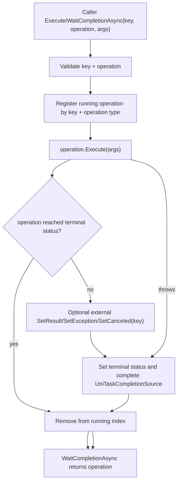

# operationmodule-completion design

## 0. 术语约定

| 术语 | 当前定义 | 本次约定 |
|---|---|---|
| operation | 继承 `OperationHandle` 的一次异步/同步编排实例 | 不等同资源 asset handle；只负责执行状态、等待和终态 |
| operation key | `OperationModule.Execute(key, ...)` / `WaitCompletionAsync(key, ...)` 的第一个参数 | 调用方提供的完成回写定位键；假设不强制全局唯一 |
| running operation | 已交给 `OperationModule` 执行但尚未进入终态的 handle | 由 `OperationModule` 内部索引，用于 `SetResult` / `SetException` / `SetCanceled` |
| terminal status | `Succeeded` / `Failed` / `Cancelled` | 进入终态后等待者应被唤醒，模块索引应移除该 operation |
| result value | `OperationHandle<T>.Value` 对应的成功产物 | 只有泛型 operation 接收外部 result value；非泛型只接收成功状态 |

## 1. 决策与约束

### 需求摘要

做什么：补齐 `OperationModule` 目前空置的 `SetResult(key, value)` / `SetException(key, ex)` / `SetCanceled(key)`，让模块能按 key 找到运行中的 operation 并写入终态；同时明确执行、等待、异常捕获和模块关闭时的清理语义。

为谁：维护资源模块 operation 链路的开发者。当前资源 module / mode / provider 已大量通过 `Super.Operation.WaitCompletionAsync<T>(key, args)` 执行 package、bundle、loading operation，但 `key` 没被使用，外部终态回写 API 也没有效果。

成功标准：

- `Execute(key, operation, args)` 对 key / operation 做明确校验，并在执行前登记运行中 operation。
- `SetResult(key, value)` 可以让对应 `OperationHandle<T>` 成功完成并写入 `Value`。
- `SetException(key, ex)` 可以让对应 operation 失败完成，等待者观察到 `OperationStatus.Failed` 和 `Error`。
- `SetCanceled(key)` 可以让对应 operation 取消完成，等待者观察到 `OperationStatus.Cancelled`。
- operation 自己在 `Execute(args)` 内调用 `SetResult()` / `SetException()` / `SetCanceled()` 后，模块内部索引不会永久残留。
- `Shutdown()` 取消并清理仍未完成的 operation。

明确不做：

- 不把 `OperationModule` 扩展成队列、调度器、优先级系统、重试系统或进度聚合器。
- 不改变资源模块 package / provider operation 的归属命名和文件布局。
- 不实现 Builtin / StreamingAssets / WebGL / EditorSimulator 的真实资源加载语义。
- 不引入线程安全承诺；公开 API 继续假定 Unity 主线程调用。
- 不接入日志、事件派发、Profiler marker 或外部可观测系统。
- 不修改 `OperationHandle` 的公开继承模型，也不新增第三方依赖。

### 复杂度档位

走项目运行时框架默认档位：L3 健壮性、modules 结构、reasonable 性能、team 可读性、active 可演进性、testable 可测试性；无偏离。并发维度明确为 single-threaded，兼容性维度为 current-only。

### 关键决策

1. `OperationModule` 只管理运行中 operation，不接管具体业务执行。
   - 具体下载、bundle、asset、scene 的计算逻辑仍在各自 `OperationHandle.Execute(args)` 中。
   - 模块负责登记、终态回写、等待和清理。

2. `operation key` 是完成回写定位键，不默认做重复请求去重。
   - 当前资源调用存在 `this` 作为 key 的 package / bundle operation，也存在 `AssetInfo` 作为 key 的 loading operation。
   - 同一个对象可能发起不同 operation 类型；如果模块按 key 复用运行中 operation，会误把 package init/uninit 或 bundle init/uninit 合并。
   - 因此 `Execute<T>(key, args)` 默认每次创建新 operation；重复 key 的策略只影响 `Set*` 定位和索引维护。

3. 内部索引用 `(key, operation type)` 管理运行中 operation。
   - 示例：`(assetInfo, LoadingAssetOperationHandle)` 和 `(assetInfo, LoadingRawAssetOperationHandle)` 可以并存。
   - 同一 `(key, type)` 同时执行第二个 operation 时，设计倾向返回明确失败，而不是静默覆盖旧 operation。
   - 只有 key、没有 operation type 的外部 `SetResult` / `SetException` / `SetCanceled` 遇到同 key 多个 running operation 时必须抛明确异常，避免随机完成某一个 operation。
   - 假设：现有资源模块已经在 provider 层做已加载 handle 复用，不需要 `OperationModule` 提供同 key 并发合并。

4. 终态回写必须从索引中移除 operation。
   - `SetResult` / `SetException` / `SetCanceled` 由模块触发时，写入终态后移除。
   - operation 自己在 `Execute(args)` 内进入终态时，`Execute` / `WaitCompletionAsync` 结束后模块也移除。
   - 这避免完成后的 operation 长期占用 key，阻塞后续同 key 同类型请求。

5. `SetResult(key, value)` 通过运行时类型匹配写入泛型 result。
   - 对 `OperationHandle<T>`，`value` 必须为 `T` 或在 `T` 可接受 null 时为 null。
   - 对非泛型 `OperationHandle`，`value` 必须为 null；否则失败提示该 operation 不接收 result value。
   - 该决策保持 `OperationHandle<T>.Value` 契约，不新增 object 型 Value。

## 2. 名词与编排

### 2.1 名词层

#### 现状

- `OperationHandle` 位于 `Assets/GameDeveloperKit/Runtime/OperationModule/OperationHandle.cs`，保存 `_progress`、`_error`、`_status` 和 `UniTaskCompletionSource`，提供 `Execute(args)`、`SetResult()`、`SetException(ex)`、`SetCanceled()`、`WaitCompletionAsync()`、`Release()`。
- `OperationHandle<T>` 在同文件内添加 `_value` 和 `SetResult(T value)`，成功时先写值再调用非泛型 `SetResult()`。
- `OperationModule` 位于 `Assets/GameDeveloperKit/Runtime/OperationModule/OperationModule.cs`，提供 `Execute<T>(key, args)`、`Execute(key, operation, args)`、`WaitCompletionAsync<T>(key, args)` 和三个空的 `Set*` 方法。
- `ResourceModule` / `ModeBase` / `ProviderBase` 调用 `Super.Operation.WaitCompletionAsync<T>(key, args)` 执行 manifest、package、bundle、loading operation；历史 `resource-operation-ownership` 已把这些 operation 的 owner 收敛到 module / play mode / provider。

#### 变化

1. `OperationModule` 增加运行中 operation 索引。
   - 键形态：`object key + Type operationType`。
   - 值形态：对应的 `OperationHandle`。
   - 索引只保存未完成 operation。

2. `OperationModule` 的公开入口契约收紧。
   - `key == null` 抛 `ArgumentNullException`。
   - `operation == null` 抛 `ArgumentNullException`。
   - 同一 `(key, operationType)` 已运行时抛 `GameException` 或返回失败 operation；实现阶段需选一种与现有调用最少冲突的方式。

3. `OperationStatus` 的状态变化变得可观察。
   - 执行登记后状态应从 `None` 进入 `Running` 或 `Pending`。
   - 正常完成、失败、取消都进入 terminal status。
   - 终态后 `WaitCompletionAsync()` 完成，`WaitCompletionAsync<T>` 返回 operation 本身。

4. `OperationModule.Set*` 成为有效 API。
   - `SetResult(key, value)` 查找对应 running operation 并写成功。
   - `SetException(key, ex)` 查找对应 running operation 并写失败。
   - `SetCanceled(key)` 查找对应 running operation 并写取消。

#### 接口示例

```csharp
// 来源：Assets/GameDeveloperKit/Runtime/OperationModule/OperationModule.cs OperationModule
var handle = Super.Operation.Execute<MyOperationHandle>(key, args);
Super.Operation.SetResult(key, result);
await handle.WaitCompletionAsync();
// handle.Status == OperationStatus.Succeeded
```

```csharp
// 来源：Assets/GameDeveloperKit/Runtime/OperationModule/OperationModule.cs OperationModule
var handle = await Super.Operation.WaitCompletionAsync<MyOperationHandle>(key, args);
// operation 自己 SetException(ex) 时，handle.Status == OperationStatus.Failed，handle.Error == ex
```

### 2.2 编排层



#### 现状

- `Execute<T>(key, args)` 创建 operation 后直接调用 `Execute(key, operation, args)`，但 `key` 未参与任何逻辑。
- `Execute(key, operation, args)` 只捕获 `operation.Execute(args)` 抛出的异常并写到 operation，没有登记、去重、终态清理或 key 回写能力。
- `WaitCompletionAsync<T>(key, args)` 执行后等待 operation 完成，吞掉等待异常并返回 operation；这使调用方通过 `Status` / `Error` 判断结果，而不是依赖异常冒泡。
- `SetResult` / `SetException` / `SetCanceled` 是空实现，外部无法通过 `OperationModule` 完成 operation。

#### 变化

1. 执行前登记。
   - 参数校验通过后，模块把 operation 加入 running index，再调用 `operation.Execute(args)`。
   - 如果 `operation.Execute(args)` 同步抛异常，模块调用 `operation.SetException(exception)` 并移除索引。

2. 执行后清理。
   - 如果 operation 在 `Execute(args)` 内同步进入 terminal status，模块立即移除索引。
   - 如果 operation 异步完成，`WaitCompletionAsync<T>` 等待结束后移除索引。
   - 如果调用方只 `Execute<T>()` 不等待，模块仍需要通过 completion continuation 或 Set* 路径移除，避免泄漏。

3. 外部终态回写。
   - `SetResult(key, value)` / `SetException(key, ex)` / `SetCanceled(key)` 查找 running operation。
   - 未找到 key 时抛 `GameException`，防止调用方误以为回写成功。
   - 终态写入后移除索引，后续同 key 同类型 operation 可以再次执行。

4. 关闭清理。
   - `Shutdown()` 遍历 running index，对未终态 operation 调用 `SetCanceled()`。
   - 清空 running index 后返回完成。

#### 流程级约束

- 错误语义：operation 内部失败继续体现在 `OperationStatus.Failed` / `Error`；`WaitCompletionAsync<T>` 保持返回 operation，不把异常直接抛给资源调用方。
- 幂等性：对已终态 operation 再次 Set* 不应改变既有结果；模块索引移除后再次按 key Set* 应失败。
- 顺序约束：同一 `(key, operationType)` 同时只能有一个 running operation。
- 并发约束：不提供线程安全承诺；默认 Unity 主线程调用。
- 扩展点：具体 operation 类型仍通过继承 `OperationHandle` 扩展，模块不感知资源业务类型。
- 可观测点：调用方通过 returned operation 的 `Status`、`Error`、`Value` 观察结果。

### 2.3 挂载点清单

1. `Super.Operation`：继续作为 `OperationModule` 的全局访问入口，不新增入口。
2. `OperationModule` public API：`Execute` / `WaitCompletionAsync` / `SetResult` / `SetException` / `SetCanceled` 成为运行中 operation 的统一生命周期入口。
3. `OperationHandle` 状态契约：`Status` / `Error` / `WaitCompletionAsync()` 是调用方观察终态的唯一公共面。

### 2.4 推进策略

1. 编排骨架：建立 running operation 索引和参数校验。
   - 退出信号：`Execute` 使用 key 登记 operation，非法 key / operation 有明确异常。
2. 状态节点：补齐 `OperationHandle` 状态进入、终态判断和等待完成后的清理。
   - 退出信号：成功 / 失败 / 取消后 operation 不再残留在索引中。
3. 外部回写：实现 `SetResult` / `SetException` / `SetCanceled`。
   - 退出信号：外部按 key 完成 operation 后，等待者能观察到对应终态。
4. 生命周期清理：实现 `Shutdown()` 取消并清空运行中 operation。
   - 退出信号：模块关闭后没有 running operation 残留，等待者观察到取消。
5. 验证覆盖：补关键正常、边界、错误场景。
   - 退出信号：Runtime 编译通过，operation module 的 key 回写、重复 key、关闭清理都有证据。

### 2.5 结构健康度与微重构

##### 评估

- 文件级 — `Assets/GameDeveloperKit/Runtime/OperationModule/OperationModule.cs`：约 111 行，职责单一但关键方法为空；本次会在同一文件补登记、回写、清理三块逻辑，属于现有职责延伸。
- 文件级 — `Assets/GameDeveloperKit/Runtime/OperationModule/OperationHandle.cs`：约 161 行，状态与等待职责集中；本次可能只补状态进入 / 终态判断这类小接口，不改变继承模型。
- 目录级 — `Assets/GameDeveloperKit/Runtime/OperationModule/`：当前只有 2 个源码文件，目录不拥挤；本次不需要新增多个同层文件。
- compound convention 检索：`doc_type=decision` + `category=convention` + “目录组织 OR 命名 OR 归属”无命中。

##### 结论：不做微重构

本次不做拆文件或目录重组，原因是 OperationModule 目录仍小，改动集中在 operation 运行态管理这一项现有职责内。若实现阶段发现 `OperationModule.cs` 因 result 类型匹配或索引 key 结构膨胀明显变胖，可以先把运行中索引键做成私有嵌套 struct，而不是新建公共类型。

##### 超出范围的观察

- `OperationHandle.SetProgress(float)` 当前只写 `_progress`，没有触发 `_progressHandle`；如果后续需要进度可观察性，应另起 feature 或 issue。
- `OperationStatus.Pending` 当前没有明确使用点；本 feature 可选择将执行前状态设为 `Running`，不强行为 `Pending` 设计队列语义。
- `ReferencePool` 尚未接入 operation 创建 / 回收；是否用池化复用 operation handle 应另起性能评估，不阻塞本 feature。

## 3. 验收契约

| 编号 | 输入 / 触发 | 期望可观察结果 |
|---|---|---|
| N1 | `Execute<MyOperation>(key, args)`，operation 同步 `SetResult(value)` | 返回 handle 状态为 `Succeeded`，泛型 `Value` 为 value |
| N2 | `WaitCompletionAsync<MyOperation>(key, args)`，operation 异步完成 | await 返回同一个 operation，状态为 `Succeeded` |
| N3 | `SetResult(key, value)` 完成运行中 `OperationHandle<T>` | 等待者完成，`Status == Succeeded`，`Value == value` |
| N4 | `SetException(key, ex)` 完成运行中 operation | 等待者完成，`Status == Failed`，`Error == ex` |
| N5 | `SetCanceled(key)` 完成运行中 operation | 等待者完成，`Status == Cancelled` |
| B1 | `Execute(null, operation, args)` | 抛 `ArgumentNullException` |
| B2 | `Execute(key, null, args)` | 抛 `ArgumentNullException` |
| B3 | 同一 `(key, operationType)` 在前一个未完成时再次执行 | 有明确失败语义，不静默覆盖旧 operation |
| B4 | 同一个 key 执行不同 operation type | 不互相覆盖；只按 key 调用外部 Set* 时抛明确歧义异常 |
| E1 | `operation.Execute(args)` 同步抛异常 | operation 进入 `Failed`，`Error` 保存原异常，索引清理 |
| E2 | `SetResult` 使用不匹配的 value 类型 | operation 不被错误标记成功，调用方得到明确异常或 failed operation |
| E3 | `SetResult` / `SetException` / `SetCanceled` 找不到 key | 抛 `GameException`，不静默吞掉 |
| E4 | `Shutdown()` 时仍有未完成 operation | 未完成 operation 进入 `Cancelled`，running index 清空 |

### 明确不做的反向核对项

- grep 不应出现 operation 队列、优先级、重试次数或调度线程相关实现。
- 资源 `PlayMode/` 与 `Provider/` 的 operation owner 文件布局不应因本 feature 改变。
- Runtime 代码不应新增 `UnityEditor` API 引用。
- `OperationModule` 不应新增日志、事件派发或 profiler 依赖。
- `Packages/manifest.json` 不应新增依赖。

## 4. 与项目级架构文档的关系

验收阶段需要更新 `.codestable/architecture/ARCHITECTURE.md` 的 Resource / Operations 描述：

- 将 `OperationModule` 从“最小执行 / 等待入口”更新为“执行、等待、按 key 终态回写和关闭清理入口”。
- 补充约束：`OperationModule` 不提供队列 / 重试 / 调度 / 线程安全；具体业务 operation 仍归属 module / play mode / provider。
- 保留既有限制：资源模块整体仍未覆盖 Builtin / StreamingAssets / WebGL / EditorSimulator 的真实加载差异。
