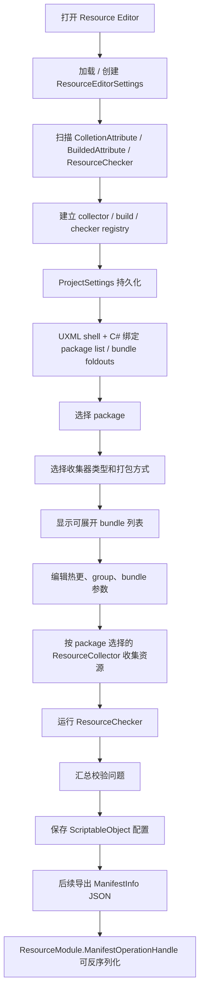

# resource-editor design

## 0. 术语约定

| 术语 | 当前定义 | 本次约定 |
|---|---|---|
| `Resource Editor` | 本次新增的 Unity Editor 工具窗口 | 只存在于 Editor asmdef，不进入 Runtime |
| `ResourceEditorSettings` | 本次新增的项目级 ScriptableObject 配置 | 保存到 `ProjectSettings/` 下，作为编辑器主数据源 |
| `ManifestInfo` | 运行时资源总清单，包含 `Version`、`BuildTime`、`Packages` | 由编辑器配置派生 / 导出，不作为首要新建对象 |
| `PackageInfo` | package 层，包含 `Name`、`Version`、`Hash`、`Bundles` | 运行时输出结构；编辑期额外有“是否热更” |
| `BundleInfo` | bundle 层，包含 `Name`、`Hash`、`Size`、`Crc`、`Version`、`Assets`、`Dependencies` | 运行时输出结构；编辑期额外有 group、收集器和打包方式 |
| `AssetInfo` | asset 层，包含 `Location`、`TypeName`、`Labels` | 由 bundle group 收集结果派生 |
| `ResourceCollector` | 本次新增资源收集器抽象 | package 选择收集器类型后，用对应收集器刷新 group 资源预览 |
| `ColletionAttribute` | 用户指定的收集器标记名 | Editor 启动时扫描，发现可选资源收集器；保留用户拼写 |
| `BuildedAttribute` | 用户指定的打包方式标记名 | Editor 启动时扫描，发现可选打包方式；保留用户拼写 |
| `ResourceChecker` | 本次新增抽象资源检查器 | 对收集结果执行多种检查，产出校验问题 |
| UI Toolkit | Unity 2022.3 可用的 UXML + USS + C# 绑定方式 | 本次不用 IMGUI / uGUI |

防冲突结论：项目当前资源模块使用 `ManifestInfo / PackageInfo / BundleInfo / AssetInfo`，不要在编辑器方案里恢复旧名 `ResourceManifest / ResourceBundleInfo / ResourceAssetInfo`。

## 1. 决策与约束

### 需求摘要

做什么：新增一个基于 UI Toolkit 的资源编辑器，让开发者先创建项目级资源配置 ScriptableObject，再按 package -> collector/build -> bundle -> group/resources/checks 维护资源收集规则；运行时 manifest 后续由这份配置派生。

为谁：维护 GameDeveloperKit Resource 模块清单、排查资源定位问题、配置 `ResourceSettings` 的 Unity 开发者。

成功标准：

- 首次打开窗口时能创建或加载 `ResourceEditorSettings`，并保存到与 `Assets/` 平级的 `ProjectSettings/` 目录下。
- Editor 启动时能扫描带 `ColletionAttribute` 的收集器类型和带 `BuildedAttribute` 的打包方式类型，并提供给 package 设置选择。
- package 选择收集器类型后，刷新资源预览时使用对应 `ResourceCollector`。
- 左侧 package 列表能展示 package 名称和“是否热更”徽章。
- 选中 package 后，右侧显示可展开 bundle 列表；每个 bundle 具备 group，用于展示该 group 下收集到的资源。
- bundle 列表顶部能展示和编辑资源收集器类型、打包方式等 package/bundle 收集参数。
- 抽象资源检查器能注册多种检查项，并对收集结果输出 warning / error。
- 配置可保存为项目级 ScriptableObject；后续导出的 manifest JSON 可被 `ResourceModule.ManifestOperationHandle` 反序列化为 `ManifestInfo`。
- 校验面板能报告空名称、重复 bundle、重复 asset location、缺失依赖、空 group、收集规则无资源等基础问题。
- UI 使用 UXML / USS 构建静态布局和现代编辑器风格，C# 只负责加载、绑定、交互和动态列表。

假设：首版以“编辑期配置维护和资源收集预览”为目标，不直接新建 manifest。若你希望首版同时执行 AssetBundle 构建或完整 manifest 导出，需要把范围扩大成资源构建 feature。

### 明确不做

- 不打包 AssetBundle，不调用 SBP 构建，不上传远端资源。
- 不把 manifest JSON 当作首要人工新建 / 编辑对象。
- 不新增或修改 `ManifestInfo` / `PackageInfo` / `BundleInfo` / `AssetInfo` 字段。
- 不改变 `ResourceModule`、`ModeBase`、`ProviderBase` 或运行时加载语义。
- 不引入 Addressables，不接 FileSystem `.vfsb`，不实现下载缓存策略。
- 不做运行时引用计数、已加载 handle、内存占用的 live debugger。
- 不在 design 阶段纠正 `ColletionAttribute` 拼写；按用户指定命名记录。如果实现阶段要改成 `CollectionAttribute`，需要你确认。

### 复杂度档位

走默认 Editor 工具档位，偏离点：

- `Compatibility = backward-compatible`：编辑期新增配置结构，但导出的运行时 manifest 仍保持现有 JSON 结构。
- `UX = production editor tool`：不是临时调试窗口，需要稳定布局、空状态、错误状态、dirty 提示和保存确认。
- `Concurrency = single-threaded`：所有编辑器交互按 Unity Editor 主线程处理，不新增后台构建队列。

### UI 方向

使用现代工作台风格：顶部工具栏、左侧 package 列表、右侧 bundle 折叠列表、资源 group 预览、底部校验面板。package 行展示热更徽章，package 设置区提供收集器类型和打包方式下拉选择，bundle 列表顶部显示当前选择与刷新/检查操作。色彩以 Unity Editor 适配的中性色为底，加入 teal 主色、amber 警告、red 错误、blue 信息色；不使用单一紫色/蓝色渐变。圆角控制在 8px 以内，按钮优先使用 Unity 内置图标 + tooltip，中文可见文案，USS class name 保持英文。

## 2. 名词与编排

### 2.1 名词层

#### 现状

运行时清单模型位于 `Assets/GameDeveloperKit/Runtime/Resource/Manifest/`：

```csharp
public sealed class ManifestInfo
{
    public string Version;
    public long BuildTime;
    public List<PackageInfo> Packages = new List<PackageInfo>();
}
```

```csharp
public sealed class PackageInfo
{
    public string Name;
    public string Version;
    public string Hash;
    public List<BundleInfo> Bundles = new List<BundleInfo>();
}
```

```csharp
public sealed class BundleInfo
{
    public string Name;
    public string Hash;
    public long Size;
    public uint Crc;
    public string Version;
    public List<AssetInfo> Assets = new List<AssetInfo>();
    public List<string> Dependencies = new List<string>();
}
```

```csharp
public sealed class AssetInfo
{
    public string Location;
    public string TypeName;
    public List<string> Labels;
}
```

`Assets/GameDeveloperKit/Editor/` 当前只有 `GameDeveloperKit.Editor.asmdef`，引用 `GameDeveloperKit.Runtime` 且只包含 Editor 平台；没有现成资源编辑器、UXML 或 USS 文件。

#### 变化

新增 Editor-only 名词，不污染 runtime：

- `ResourceEditorSettings`：项目级 ScriptableObject 配置，保存 packages、bundle 收集规则、默认输出路径和 UI 最近选择；默认持久化到 `ProjectSettings/GameDeveloperKit.ResourceEditorSettings.asset` 一类路径。
- `ResourceEditorPackage`：编辑期 package 配置，包含名称、版本、是否热更、选中的收集器 id、选中的打包方式 id 和 bundle 列表。
- `ResourceEditorBundle`：编辑期 bundle 配置，包含名称、group、依赖、标签和资源收集参数；实际收集器默认来自 package，也可在后续扩展为 bundle 覆盖。
- `ResourceCollector`：资源收集器抽象，输入 package / bundle 配置，输出收集资源预览；不同收集器实现不同收集策略。
- `ColletionAttribute`：标记 `ResourceCollector` 实现类的 Attribute，提供 id / display name / description / order 等元数据，供 package 设置下拉选择。
- `ResourceBuildStrategy`：打包方式抽象，首版只作为 package 可选策略和后续构建扩展点，不执行真实 SBP 构建。
- `BuildedAttribute`：标记打包方式实现类的 Attribute，提供 id / display name / description / order 等元数据，供 package 设置下拉选择。
- `ResourceChecker`：抽象资源检查器，输入 package / bundle / group resource 预览，输出 `ResourceValidationIssue`；可有多种实现。
- `ResourceCheckerRegistry`：Editor 启动时收集可用检查器，刷新预览或手动检查时按顺序运行。
- `ResourceGroupPreview`：bundle group 下收集到的资源预览行，包含 asset path、location、type、labels 和校验状态。
- `ResourceValidationIssue`：校验结果，包含 severity、message、node、field path；用于底部问题列表和右侧字段提示。
- `ResourceEditorSelection`：当前选中的 package / bundle / group resource，用于驱动右侧面板。
- `ResourceEditorStats`：派生统计，包含 package 数、热更包数、bundle 数、group 数、收集资源数、issue 数。

UXML / USS 作为静态 UI 资产：

- UXML 定义窗口壳、toolbar、左侧 package list、package 设置栏、右侧 bundle accordion、group/resource preview、检查器结果和问题面板。
- USS 定义 tokens、布局、热更 badge、bundle foldout、group chip、状态色、字段错误态和 hover/focus 态。
- ListView / Foldout 的 item 内容由 C# 绑定，因为 package、bundle、group 资源数量来自 `ResourceEditorSettings` 和收集预览。

### 2.2 编排层



#### 现状

- `ResourceSettings` 是 ScriptableObject，包含 `Mode`、`DefaultPackages`、`Url`、`ManifestName`、`CachePath`、`ServerUrl`、`ManifestLocation`。
- `ManifestOperationHandle` 通过 Newtonsoft.Json 反序列化 manifest 文本为 `ManifestInfo`。
- `ManifestInfo.GetBundle()` 和 `GetDependencies()` 已按 `Packages[*].Bundles` 查询，bundle dependency 用 bundle name 字符串表达。
- Provider 查询 asset 时同时匹配 `AssetInfo.Location`、`TypeName`、`Labels`。
- Unity 普通 `.asset` 资源通常放在 `Assets/` 内由 AssetDatabase 导入；`ProjectSettings/` 更适合保存项目级设置文件。实现阶段应使用 Unity Editor 支持的项目设置持久化方式，而不是依赖运行时加载 `ProjectSettings` 下的普通资源。
- 当前没有资源收集器、打包方式 registry，也没有资源检查器抽象；现有 Attribute 命名只有事件模块的 `BindingAttribute` 和 UI 模块的 `UIOption`，没有 `ColletionAttribute` / `BuildedAttribute` 冲突。

#### 变化

1. 窗口启动：
   - 通过菜单打开 Resource Editor。
   - 自动加载 `ProjectSettings` 下的 `ResourceEditorSettings`；不存在时创建默认配置。
   - 扫描当前 AppDomain 中带 `ColletionAttribute` 的收集器类型、带 `BuildedAttribute` 的打包方式类型，以及所有可实例化的 `ResourceChecker`。
   - 建立 collector / build / checker registry；扫描失败的类型进入问题面板，不阻断窗口打开。
   - 可显示当前 `ResourceSettings` 的引用信息，但主编辑对象是新的资源编辑器配置。
   - 不自动联网下载 manifest，不直接新建 manifest JSON。

2. 配置持久化：
   - 配置作为项目级 ScriptableObject/项目设置文件保存到与 `Assets/` 平级的 `ProjectSettings/` 目录。
   - 保存入口写入编辑期 package、bundle、group、收集器 id、打包方式 id 和 checker 配置。
   - 运行时不直接读取这份编辑器配置；运行时继续读取导出的 manifest。

3. 主视图绑定：
   - 左侧只显示 package 列表，每行包含名称、版本、bundle 数、收集器短名、打包方式短名和“热更/内置”徽章。
   - 选中 package 后，右侧显示可展开 bundle 列表。
   - bundle 列表顶部显示当前 package 的资源收集器类型、打包方式下拉，以及新增 bundle / 刷新收集预览 / 执行检查等操作。
   - 每个 bundle foldout 头部显示 bundle 名、group、收集器类型、打包方式、资源数量和问题徽章。
   - 展开 bundle 后显示 group 区块和该 group 收集到的资源预览。

4. 编辑和校验：
   - 字段修改进入 `ResourceEditorSettings` 工作副本并置 dirty。
   - package 可编辑是否热更；UI 立即刷新热更 badge。
   - package 可从 registry 中选择收集器类型和打包方式；未知 id 时显示 missing 状态并要求重新选择。
   - bundle 可编辑 group、依赖、标签和收集参数。
   - 收集预览根据 package 选择的 `ResourceCollector` 执行，只刷新显示资源集合，不执行打包。
   - 资源检查器在收集预览后运行，可产出多种 warning / error；校验不改变数据，只产出 `ResourceValidationIssue`。

5. 保存：
   - 保存前执行一次校验；error 级问题存在时默认阻止保存，warning 允许保存但提示。
   - 保存对象是 `ResourceEditorSettings`，不是 manifest JSON。
   - 后续导出 manifest 时，输出 JSON 字段仍与运行时 `*Info` 类型一致。
   - 保存成功后清 dirty 并刷新统计。

#### 流程级约束

- 错误语义：项目配置读取失败、保存失败、缺少权限、字段校验失败都必须在窗口内可见，不吞异常。
- 幂等性：重复打开窗口不重复创建配置；未 dirty 时重复保存不改内容。
- 顺序：保存前先校验；关闭窗口前 dirty 配置需要确认。
- 发现顺序：Editor 启动或窗口打开时先扫描 Attribute / checker，再渲染 package 下拉；registry 缺项时不删除用户配置中的旧 id。
- 扩展约束：collector / build strategy / checker 都是 Editor-only 扩展点，不进入 Runtime asmdef。
- 扩展点：构建 AssetBundle、导出 manifest、运行时 live debugger 后续可挂到同一窗口，但首版只预留 toolbar 插槽，不实现构建行为。

### 2.3 挂载点清单

1. `GameDeveloperKit/Resource Editor` 菜单项：删除后用户无法打开工具窗口。
2. Resource EditorWindow：承载窗口生命周期、UXML 加载和 UI 绑定。
3. Resource Editor UXML / USS：承载静态布局和现代风格；删除后窗口无目标 UI。
4. `ResourceEditorSettings` 项目级配置：承载 package、热更标记、bundle、group、收集器 id 和打包方式 id；删除后功能配置消失。
5. collector / build / checker registry：承载 Attribute 扫描和可选项发现；删除后 package 无法选择收集器、打包方式或运行检查器。
6. 收集预览 / 校验服务：承载 group 资源展示和配置问题定位；删除后窗口只能编辑字段，不能判断配置是否可用。

### 2.4 推进策略

1. 扩展点和项目级配置骨架：先定义 `ResourceEditorSettings`、package、bundle、collector id、build id、checker 配置，并接入 ProjectSettings 持久化。
   - 退出信号：首次打开能创建配置，关闭重开后 package/bundle 配置仍存在。
2. Attribute 扫描和 registry：扫描 `ColletionAttribute`、`BuildedAttribute` 和 `ResourceChecker`，建立可选项列表。
   - 退出信号：新增带 Attribute 的收集器 / 打包方式类型后，重开窗口可在 package 设置中选择；无可用类型时显示空状态。
3. UI Toolkit 静态骨架：落 UXML / USS，形成 toolbar + 左侧 package list + package 设置 + 右侧 bundle foldout + group preview + checker issues。
   - 退出信号：窗口打开后布局稳定，空状态、热更 badge、bundle 区域、问题面板都可见。
4. package 列表绑定：支持新增/删除/选择 package，并展示热更徽章、收集器和打包方式摘要。
   - 退出信号：切换是否热更后左侧 badge 立即更新。
5. package 选项绑定：选中 package 后可从 registry 选择收集器类型和打包方式。
   - 退出信号：选择不同收集器后刷新预览会调用不同 collector；选择不同打包方式只更新配置，不执行构建。
6. bundle 配置绑定：选中 package 后展示可展开 bundle 列表，并支持 group、依赖、标签和收集参数编辑。
   - 退出信号：bundle foldout 展开后能看到 group 和收集资源预览区域。
7. 收集预览与资源检查器：根据 package 选择的 collector 生成预览资源列表，再运行抽象资源检查器。
   - 退出信号：问题列表可点击定位 package/bundle/group/resource，error 阻止默认保存。
8. manifest 派生预留：建立从编辑器配置到 `ManifestInfo` 的转换边界，但不执行完整构建。
   - 退出信号：转换接口能说明哪些配置字段参与运行时 manifest，热更/collector/pack rule 不直接写入 runtime `*Info` 字段。
9. 验证收尾：覆盖 UI 空状态、配置保存重开、Attribute 发现、热更 badge、bundle 展开、group 预览、checker 输出、USS 加载。
   - 退出信号：Editor 编译通过，UXML/USS 能在 Unity 2022.3 中加载，无 Runtime asmdef 污染。

### 2.5 结构健康度与微重构

#### 评估

- compound convention 检索：未命中“目录组织 / 文件归属 / 命名约定 / resource editor”相关决策。
- 文件级：`Assets/GameDeveloperKit/Runtime/Resource/*` 已承担运行时资源模型和加载编排，本 feature 不应继续往 runtime 文件加入编辑器逻辑。
- 文件级：`Assets/GameDeveloperKit/Editor/` 当前只有 asmdef，没有胖文件；新增编辑器窗口、registry、collector/checker 抽象不会挤压既有职责。
- 目录级：Editor 根目录空，资源编辑器会包含窗口、项目配置、模型、registry、collector 抽象、build strategy 抽象、checker 抽象、校验、收集预览、UXML、USS，直接平铺在 Editor 根目录会很快失控。

#### 结论：做轻量目录组织，不做行为微重构

本次不移动既有 runtime 文件，也不重构资源模块。新增资源编辑器应独立落在 Editor-only 子目录中，并按 UI 资产与编辑器逻辑分组。这个组织是新增文件归属，不是对现有行为的重构。

建议落点形态：`Assets/GameDeveloperKit/Editor/ResourceEditor/` 下放窗口、项目配置类型、registry、collector/build/checker 抽象、校验逻辑、收集预览逻辑；`UI/` 子目录放 UXML / USS。项目级配置文件自身落在 `ProjectSettings/`，不放入 runtime `Resources/`。实现阶段若发现还需要更细的 `Models/Collectors/Build/Checkers/Validation/Services` 子目录，可在不改 runtime 行为的前提下细分。

建议沉淀的 convention：如果这个布局跑通，后续 GameDeveloperKit Editor 工具可统一使用 `Assets/GameDeveloperKit/Editor/{ToolName}/UI/` 管理 UI Toolkit 资产。design 阶段不归档，等 implementation 通过后再决定是否走 `cs-decide`。

#### 超出范围的观察

- 当前资源构建链路仍未稳定输出 `ManifestInfo` 当前 JSON 格式；如果资源编辑器要自动扫描并构建 bundle，应另起资源构建 feature。
- `AssetInfo.Location` 同时承载业务地址、Resources 路径、Editor asset path 和 scene 名，编辑器只能做格式提示，不能在不改 schema 的情况下彻底消除歧义。

## 3. 验收契约

| 编号 | 输入 / 触发 | 期望可观察结果 |
|---|---|---|
| N1 | 首次打开 Resource Editor，ProjectSettings 下没有配置 | 自动创建 `ResourceEditorSettings` 项目级配置，窗口显示空 package 状态 |
| N2 | 工程中存在两个带 `ColletionAttribute` 的 `ResourceCollector` 实现 | Editor 启动扫描后，package 设置中的收集器下拉出现两个可选项 |
| N3 | 工程中存在两个带 `BuildedAttribute` 的打包方式实现 | Editor 启动扫描后，package 设置中的打包方式下拉出现两个可选项 |
| N4 | 工程中存在多个 `ResourceChecker` 实现 | 刷新资源预览或手动检查时按 registry 运行多个检查器，问题列表可区分来源 |
| N5 | 新增 package 并开启“热更” | 左侧 package 行显示热更徽章；关闭重开后状态仍存在 |
| N6 | 新增非热更 package | 左侧 package 行显示内置/非热更状态，不与热更包混淆 |
| N7 | 选中 package | 右侧显示该 package 的可展开 bundle 列表，顶部显示资源收集器类型和打包方式等控制项 |
| N8 | package 选择不同收集器后刷新预览 | 使用当前 package 选择的 `ResourceCollector` 收集资源，预览结果随收集器改变 |
| N9 | 新增 bundle 并设置 group | bundle foldout 头部显示 bundle 名和 group；展开后出现该 group 的资源预览区域 |
| N10 | 修改 package 的打包方式 | 配置进入 dirty 状态，package / bundle 顶部摘要同步变化，不执行实际 SBP 构建 |
| N11 | 刷新 group 资源预览 | group 下展示收集到的资源路径、location/type/labels 预览；没有资源时显示 warning |
| N12 | 配置里存在重复 bundle name 或重复 asset location 预览 | 底部校验面板显示 error，点击 issue 定位到对应 package/bundle/group/resource |
| N13 | dependency 指向不存在 bundle | 校验显示缺失依赖 error 或 warning，消息包含 dependency 名 |
| N14 | 配置引用已不存在的 collector/build id | package 设置显示 missing 状态，要求重新选择，不自动删除旧 id |
| N15 | 从配置派生 manifest 预览 | 生成对象只使用 `ManifestInfo` / `PackageInfo` / `BundleInfo` / `AssetInfo` 现有字段，能被 Newtonsoft.Json 序列化为运行时格式 |
| N16 | UXML / USS 加载 | UI 使用 package list、热更 badge、collector/build dropdown、bundle foldout、group chip、issue badge、字段错误态；没有 IMGUI-only 主界面 |
| B1 | ProjectSettings 配置文件损坏或反序列化失败 | 显示错误和重建入口，不覆盖用户未确认的旧文件 |
| B2 | 关闭窗口时有未保存改动 | 弹出保存/放弃/取消确认 |
| E1 | 用户尝试从编辑器打包 AssetBundle | 首版没有该入口；验收时不得出现 SBP 构建调用 |
| E2 | 方案或实现新增 `AssetInfo.AssetPath` / `BundleName` 等运行时字段 | 判定为超范围，应另起 manifest schema feature |
| E3 | Runtime asmdef 引用 Editor UI 类型或 `ResourceEditorSettings` | 判定为错误；资源编辑器必须只在 Editor asmdef 内 |
| E4 | collector / build strategy / checker 类型进入 Runtime asmdef | 判定为错误；这些扩展点属于 Editor-only 资源编辑器 |

### 明确不做的反向核对项

- 不出现 Addressables、SBP build、远端上传、下载缓存、FileSystem `.vfsb` 改动。
- 不修改运行时 `ResourceModule` / `ModeBase` / `ProviderBase` API。
- 不新增 manifest 字段。
- 不直接新建 manifest 作为首要编辑对象。
- 不把 Resource Editor 做成运行时 UI 或场景内 `UIDocument`。
- 不在首版执行打包方式；`BuildedAttribute` 只提供可选配置和后续构建扩展点。

## 4. 与项目级架构文档的关系

验收通过后需要更新 `.codestable/architecture/ARCHITECTURE.md`：

- 在 Resource 小节补充 Editor-only Resource Editor 的现状。
- 记录它通过 ProjectSettings 下的编辑期配置维护 package / bundle / group / collector / build strategy / checker，并可派生 `ManifestInfo -> PackageInfo -> BundleInfo -> AssetInfo` 当前格式。
- 记录 `ColletionAttribute` / `BuildedAttribute` 由 Editor 启动扫描，作为 package 设置中的可选项来源。
- 记录 UI Toolkit 资产位于 Editor-only 目录，不进入 Runtime asmdef。
- 记录资源构建、AssetBundle 打包和远端发布仍不属于首版资源编辑器。
