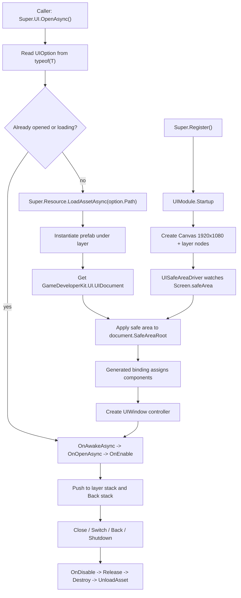

# ui-module design

## 0. 术语约定

| 术语 | 当前定义 | 本次约定 |
|---|---|---|
| `UIModule` | `Assets/GameDeveloperKit/Runtime/UI/UIModule.cs` 中的空实现模块骨架 | GameDeveloperKit 运行时 UI 入口，通过 `Super.UI` 访问 |
| `UIWindow` | 当前是实现 `IReference` 的抽象窗口类型，只持有私有 `UIDocument` 字段 | 纯 C# 窗口控制器，不继承 `MonoBehaviour`，只提供 `OnAwakeAsync` / `OnOpenAsync` / `OnEnable` / `OnDisable` / `Release` 生命周期 |
| `GameDeveloperKit.UI.UIDocument` | 当前是挂在 prefab 上的 `MonoBehaviour`，持有 `UIBindMapping[]` | uGUI prefab 的绑定文档，保存安全区根、全屏根、GameObject 绑定和组件绑定；不是 `UnityEngine.UIElements.UIDocument` |
| `UIBindMapping` | 当前包含 `group` 和 `GameObject` | 一个绑定条目，包含绑定名、目标 GameObject，以及 Inspector 中选择的组件类型 |
| 组件绑定 | 当前不存在 | 在 `UIDocument` Inspector 中选择 Image / Button / Text 等组件，生成强类型字段和绑定赋值代码 |
| 生成四件套 | 当前不存在 | 每个窗口生成 `ExampleWindow`、`ExampleController`、`ExampleModule`、`ExampleModel` 四类代码结构 |
| 绑定模型 | 当前不存在 | 每个窗口额外生成一个 `ExampleModel` 组件缓存模型，和窗口一一对应，在 `OnAwakeAsync()` 中一次性绑定 |
| 关系模型 | 当前不存在 | `ExampleController` 概念上对应 `ExampleWindow<ExampleModel>` 的伴生控制器，只读 `ExampleModel` 缓存，不反复 `GetComponent` |
| 设计分辨率 | 当前不存在 | CanvasScaler 参考分辨率固定为 1920 x 1080 |
| 安全区 | 当前不存在 | 使用 `Screen.safeArea` 计算内容区域；背景保持全屏，交互内容约束在安全区内 |
| `UILayer` | 当前是 `[Flags]` enum：Background / Main / Window / Loading / Message | 首版按单层归属使用，不允许组合 layer；层级顺序固定为 Background < Main < Window < Loading < Message |
| `Back()` | 当前骨架是 `Back<T>()` | 改为非泛型上一窗口回退：关闭当前可导航窗口，重新启用前一个窗口 |

防冲突结论：

- 本 feature 只做运行时 uGUI/GameObject 窗口管理，不做 UI Toolkit runtime，不和 Resource Editor 的 UI Toolkit 窗口混用。
- `UIDocument` 名称会和 Unity UI Toolkit 的 `UIDocument` 概念冲突；本次按用户当前命名保留，但所有文档和代码必须用 `GameDeveloperKit.UI.UIDocument` 表达。
- 本 feature 包含一个 Editor-only 的 `UIDocument` Inspector / code generator；它不是 Resource Editor，也不是通用 UI 设计器。

## 1. 决策与约束

### 需求摘要

做什么：补全运行时 UI 模块，让业务可以通过 `Super.UI.OpenAsync<T>()`、`Close<T>()`、`Switch<T>()` 和 `Back()` 管理窗口；模块负责按 1920 x 1080 设计分辨率创建 Canvas、处理安全区、加载 UI prefab、实例化到指定层级、绑定 `UIDocument`、生成组件绑定代码、维护窗口栈、处理重复打开和关闭释放。

为谁：使用 GameDeveloperKit 开发运行时界面的业务开发者，以及维护 UI prefab / 页面逻辑 / 移动端适配的框架开发者。

成功标准：

- 注册 `UIModule` 后可以通过 `Super.UI` 获取模块实例。
- Canvas 使用 1920 x 1080 作为参考分辨率，层级 root 可持续适配 `Screen.safeArea`。
- UI 背景可以铺满整个屏幕；按钮、文本等内容可挂在安全区根下，避免刘海屏、挖孔屏遮挡。
- 带 `[UIOption("path", UILayer.Window)]` 的 `UIWindow` 子类可以被打开，prefab 被资源模块加载并实例化到对应 layer。
- prefab 必须包含 `GameDeveloperKit.UI.UIDocument`；窗口创建后能通过生成代码获得绑定的 GameObject 和组件。
- `UIDocument` Inspector 能选择目标 GameObject 上要绑定的组件，例如 `Image`、`Button`、`Text` / `TMP_Text`。
- 对名为 Example 的 UI，生成代码结构包含 `ExampleWindow`、`ExampleController`、`ExampleModule` 和 `ExampleModel`。
- 同一窗口类型重复打开不会重复实例化；并发打开同一类型只产生一个窗口实例。
- `Close<T>()` 会触发窗口禁用 / 释放生命周期、销毁实例、释放资源句柄，并从窗口栈移除。
- `Switch<T>()` 能在目标 layer 上关闭当前窗口并打开目标窗口。
- `Back()` 能关闭当前可导航窗口并回到前一个窗口；不再提供 `Back<T>()`。
- `Shutdown()` 会关闭所有已打开窗口并销毁 UI root。

### 明确不做

- 不做完整 UI 设计器、不做 Resource Editor、不做运行时 UI Toolkit 窗口。
- 不新增 Addressables、UI 动画库、DOTween 或其他第三方依赖。
- 不实现复杂转场动画、遮罩队列、焦点导航、手柄导航、国际化或输入系统适配。
- 不改变 `ResourceModule`、`ModeBase`、`ProviderBase` 的资源加载语义。
- 不让业务窗口继承 `MonoBehaviour`；窗口控制器和 prefab 绑定组件保持分离。
- 不支持同一 `UIWindow` 类型多实例。
- 不手动创建 Unity `.meta` 文件，不手写生成 IDE 项目文件。

### 复杂度档位

走框架运行时模块默认档位，偏离点：

- `Compatibility = draft API change`：当前 `UIModule.cs` 是未完成骨架，可以把 `Back<T>()` 改为 `Back()`，并收敛 `UIWindow` 生命周期。
- `Robustness = L2`：UI 是基础设施，需要处理安全区变化、重复打开、加载失败、缺少属性、缺少 document、绑定重复、关闭不存在窗口、Shutdown 清理等边界。
- `Concurrency = single-threaded orchestration`：公开 API 假定 Unity 主线程调用；异步加载使用 UniTask，不承诺跨线程安全。
- `Dependency = resource-module`：打开窗口依赖资源模块已注册且目标 prefab 可加载。
- `Editor tooling = limited`：只做 `UIDocument` Inspector 和 code generator，不做独立 EditorWindow。

### 关键决策

1. Runtime UI 模块采用“窗口控制器 + prefab document + 生成绑定代码”分离。
   - `UIWindow` 是可释放的 C# 控制器，不继承 `MonoBehaviour`。
   - `UIDocument` 是 prefab 上的 `MonoBehaviour`，保存安全区根、全屏根、GameObject 绑定和组件绑定元数据。
   - 生成代码负责把 `UIDocument` 中的绑定转成强类型字段，先一次性填入 `ExampleModel`，业务逻辑只读缓存，不手写 `Find` / `GetComponent`。

2. Canvas 和安全区是模块级能力。
   - `UIModule.Startup()` 创建 `GameDeveloperKit.UIRoot` 和 Canvas。
   - CanvasScaler 使用 `ScaleWithScreenSize`，参考分辨率为 1920 x 1080。
   - 每个窗口 prefab 的背景根保持全屏锚点；内容根应用安全区锚点。
   - `UIModule` 监听屏幕尺寸 / safe area 变化，刷新已打开窗口的安全区 root。

3. `UIOption` 是窗口加载契约。
   - 示例：`[UIOption("Resources/UI/Example", UILayer.Window)] public sealed partial class ExampleWindow : UIWindow { }`
   - `uiPath` 是传给资源模块的 location。
   - `layer` 决定实例化到 UI root 下哪个层级。
   - 缺少 `UIOption`、路径为空、layer 组合值非法时，`OpenAsync<T>()` 抛出明确异常。

4. `UILayer` 不作为 flags 组合使用。
   - 每个窗口只能属于一个 layer。
   - 实现阶段应移除 `[Flags]`，或在验证中拒绝组合值。
   - 层级挂载顺序固定，避免业务手动调整 Canvas sibling order。

5. 窗口默认 singleton。
   - 同一类型正在打开时，后续 `OpenAsync<T>()` 等待同一 pending task 或返回同一实例。
   - 同一类型已打开时，`OpenAsync<T>()` 调用 `OnOpenAsync()` 并确保它回到所属 layer 栈顶，不重复实例化。
   - 多实例弹窗以后可通过 `UIOpenMode` 或显式 instance key 扩展，首版不做。

6. `Back()` 是上一窗口回退，不是跳转到指定窗口。
   - `Main` 和 `Window` layer 默认参与 Back stack；`Loading` / `Message` 不参与。
   - `Back()` 关闭当前可导航窗口，调用其 `OnDisable()` 和 `Release()`，然后对前一个窗口调用 `OnEnable()`。
   - 没有前一个窗口时 `Back()` no-op，不自动打开任何窗口。

7. 模块持有资源句柄并集中释放。
   - 每个打开的窗口记录 prefab `AssetHandle`、实例 GameObject、document、window controller 和 layer。
   - `Close<T>()` / `Back()` / `Switch<T>()` / `Shutdown()` 负责销毁实例并调用 `Super.Resource.UnloadAsset(handle)`。
   - 业务不直接销毁 UI root 下的窗口实例；如果外部销毁导致记录失效，模块下一次操作应返回明确失败或清理残留记录。

## 2. 名词与编排

### 2.1 名词层

#### 现状

- `Assets/GameDeveloperKit/Runtime/UI/UIModule.cs` 当前集中定义 `UIDocument`、`UIBindMapping`、`UILayer`、`UIOption`、`UIWindow` 和 `UIModule`，但多数类型没有完整属性和行为。
- `Super.cs` 当前没有 `Super.UI` 入口。
- Runtime asmdef 已包含 Unity UI 模块依赖，`Packages/manifest.json` 包含 `com.unity.ugui`、`com.unity.modules.ui` 和 TextMeshPro。
- `ResourceModule` 已提供 `Super.Resource.LoadAssetAsync(location)` 与 `UnloadAsset(handle)`；`AssetHandle.Asset` 可保存 Unity `Object`。
- `TimerModule` 已有运行时创建持久 GameObject 并 `DontDestroyOnLoad` 的模式。

#### 变化

公开 API 目标：

```csharp
public sealed class UIModule : GameModuleBase
{
    public override UniTask Startup();
    public override UniTask Shutdown();

    public UniTask<T> OpenAsync<T>() where T : UIWindow;
    public void Close<T>() where T : UIWindow;
    public UniTask<T> Switch<T>() where T : UIWindow;
    public UniTask Back();

    public bool IsOpen<T>() where T : UIWindow;
    public bool TryGet<T>(out T window) where T : UIWindow;
}
```

`UIWindow` 生命周期目标：

```csharp
public abstract class UIWindow : IReference
{
    public UIDocument Document { get; }
    public GameObject GameObject { get; }
    public UILayer Layer { get; }

    public virtual UniTask OnAwakeAsync();
    public virtual UniTask OnOpenAsync();
    public virtual void OnEnable();
    public virtual void OnDisable();
    public virtual void Release();
}
```

生命周期语义：

- `OnAwakeAsync()`：窗口实例、document 和组件绑定完成后首次调用一次。
- `OnOpenAsync()`：每次 `OpenAsync<T>()` 请求命中该窗口时调用，包括已打开窗口被再次打开。
- `OnEnable()`：窗口进入可见 / 可交互状态时调用。
- `OnDisable()`：窗口被关闭、切换或回退前调用。
- `Release()`：窗口最终释放时调用，清空业务引用；资源句柄和 GameObject 销毁仍由 `UIModule` 负责。

`UIDocument` 目标：

```csharp
public sealed class UIDocument : MonoBehaviour
{
    [SerializeField] private RectTransform fullScreenRoot;
    [SerializeField] private RectTransform safeAreaRoot;
    [SerializeField] private UIBindMapping[] mappings;

    public RectTransform FullScreenRoot { get; }
    public RectTransform SafeAreaRoot { get; }
    public IReadOnlyList<UIBindMapping> Mappings { get; }

    public GameObject GetGameObject(string key);
    public bool TryGetGameObject(string key, out GameObject gameObject);
    public T GetComponent<T>(string key) where T : Component;
}
```

绑定数据目标：

```csharp
[Serializable]
public sealed class UIBindMapping
{
    public string Name;
    public GameObject Target;
    public UIComponentBindMapping[] Components;
}

[Serializable]
public sealed class UIComponentBindMapping
{
    public string Name;
    public string TypeName;
}
```

生成代码结构示例：

```csharp
public sealed partial class ExampleWindow : UIWindow
{
    public ExampleModel Model { get; private set; }
}

public sealed class ExampleModel
{
    public Image Icon;
    public Button CloseButton;
}

public sealed partial class ExampleController
{
    public UniTask OnAwakeAsync(ExampleWindow window, ExampleModel model);
    public UniTask OnOpenAsync(ExampleWindow window);
    public void OnEnable(ExampleWindow window);
    public void OnDisable(ExampleWindow window);
    public void Release(ExampleWindow window);
}

public static partial class ExampleModule
{
    public static UniTask<ExampleWindow> OpenAsync();
    public static void Close();
}
```

约定：

- `ExampleWindow` 由生成代码维护绑定字段、`UIOption`、绑定赋值和生命周期转发。
- `ExampleController` 是业务逻辑入口；生成器可首次创建骨架，但不覆盖用户已编辑文件。
- `ExampleModule` 是该窗口的业务侧便捷入口，内部委托 `Super.UI.OpenAsync<ExampleWindow>()` / `Close<ExampleWindow>()`。

内部模型：

- `UIRoot`：模块启动时创建的持久根对象，包含 Canvas、CanvasScaler、GraphicRaycaster、每个 `UILayer` 的 child transform。
- `UISafeAreaDriver`：监测 `Screen.safeArea`、屏幕尺寸和方向变化，并刷新已打开 document 的 safe area root。
- `UIWindowRecord`：记录窗口类型、option、window、document、instance、asset handle、layer 和状态。
- `UIWindowStack`：每个 layer 一条栈，另有全局 Back stack 记录可导航窗口。
- `UIWindowStatus`：内部状态，至少区分 Loading / Opened / Closing，防止重复并发操作。
- `UIDocumentGenerator`：Editor-only 生成器，读取 `UIDocument` 序列化绑定并输出三件套代码。

### 2.2 编排层



#### 现状

- UI 模块没有 root、layer 容器、窗口注册表、安全区驱动或栈。
- `OpenAsync<T>()`、`Close<T>()`、`Back<T>()`、`Switch<T>()` 都是空方法。
- 当前 `UIOption` 构造函数不保存 `uiPath` / `layer`，无法驱动加载。
- 当前 `UIDocument` 只能记录 GameObject，不能选择组件，也没有生成代码入口。
- 当前 `UIWindow` 没有公开 document、生命周期、实例对象或 layer 信息。

#### 变化

1. Startup：
   - 创建 `GameDeveloperKit.UIRoot` GameObject。
   - 挂载 `Canvas`、`CanvasScaler`、`GraphicRaycaster`，并 `DontDestroyOnLoad`。
   - CanvasScaler 使用 1920 x 1080 参考分辨率。
   - 按固定顺序创建 layer child：Background / Main / Window / Loading / Message。
   - 初始化 registry、pending open 表、layer stacks、Back stack 和 safe area driver。

2. 安全区：
   - `UIDocument.FullScreenRoot` 默认铺满父级，用于背景、蒙层、全屏动效。
   - `UIDocument.SafeAreaRoot` 用 `Screen.safeArea` 转换出的 normalized anchors 约束，用于按钮、文本、列表等关键内容。
   - 没有配置 safe area root 的 prefab 可继续全屏显示，但验收时要能识别“该窗口没有安全区内容根”。
   - 当屏幕尺寸、方向或 `Screen.safeArea` 变化时，刷新所有打开窗口的 safe area root。

3. UIDocument Inspector 与组件绑定：
   - Inspector 显示绑定列表，每条绑定选择一个 GameObject。
   - 对每个 GameObject，Inspector 列出该对象上的可绑定组件，用户勾选 Image / Button / Text / TMP_Text 等。
   - 绑定名必须唯一；组件绑定名必须能生成合法 C# 成员名。
   - 生成器读取绑定数据，写入 `ExampleModel` 的强类型字段和一次性赋值代码。

4. 代码生成：
   - 对 Example UI 生成 `ExampleWindow`、`ExampleController`、`ExampleModule`、`ExampleModel` 四类。
   - `ExampleWindow` 生成 `ExampleModel`、`UIOption`、一次性绑定赋值、生命周期转发；可用 partial 让用户扩展。
   - `ExampleController` 首次生成业务逻辑骨架，已存在时不覆盖。
   - `ExampleController` 只读取 `ExampleWindow.Model` 或 `OnAwakeAsync()` 传入的 `ExampleModel`，不再重复查找组件。
   - `ExampleModule` 生成业务侧打开 / 关闭便捷入口，委托 `Super.UI`。

5. OpenAsync<T>()：
   - 校验 `T` 不是抽象类，且带有效 `UIOption`。
   - 如果 T 已打开：将记录移动到 layer 栈顶，调用 `OnOpenAsync()` 和 `OnEnable()` 后返回同一实例。
   - 如果 T 正在加载：等待同一个 pending open。
   - 否则通过 `Super.Resource.LoadAssetAsync(option.Path)` 加载 prefab。
   - 加载结果必须是 `GameObject` prefab，否则失败并释放 handle。
   - 实例化到 option layer 对应 transform 下。
   - 实例上必须能取得 `GameDeveloperKit.UI.UIDocument`。
   - 先应用安全区，再执行一次性生成绑定赋值，把组件灌进 `ExampleModel`，再调用 `OnAwakeAsync()`、`OnOpenAsync()`、`OnEnable()`，最后登记 record。

6. Close<T>()：
   - 如果 T 没打开且没 pending，首版 no-op。
   - 如果 T 正在 pending open，不能静默销毁半成品；关闭请求应在 open 完成后立即 close，或返回明确失败。实现阶段需要选一个一致策略。
   - 已打开时从 layer stack、Back stack 和 registry 移除，调用 `OnDisable()`、`Release()`，销毁 GameObject，卸载资源 handle。

7. Switch<T>()：
   - 读取 T 的目标 layer。
   - 关闭目标 layer 当前栈顶窗口。
   - 打开 T，并将 T 作为目标 layer 栈顶。
   - 不影响其他 layer 的窗口，例如 Loading / Message 层。

8. Back()：
   - 从全局 Back stack 找当前可导航窗口。
   - 如果存在前一个窗口：关闭当前窗口，重新启用前一个窗口。
   - 如果没有前一个窗口：no-op，不自动打开任何窗口。
   - Loading / Message 默认不进入 Back stack；它们应由 `Close<T>()` 显式关闭。

9. Shutdown：
   - 按 Message -> Loading -> Window -> Main -> Background 的反向顺序关闭所有窗口。
   - 清理 pending open。
   - 销毁 UIRoot。
   - 清空 registry、layer stacks、Back stack 和 safe area driver。

#### 流程级约束

- 错误语义：缺少 `UIOption`、路径为空、layer 组合值非法、资源模块未注册、资源加载失败、资源不是 prefab、实例缺少 `UIDocument`、重复绑定名、绑定组件缺失，都必须抛 `ArgumentException` 或 `GameException`，不能返回半初始化窗口。
- 幂等性：重复打开同一类型不重复实例化；重复关闭未打开窗口 no-op；Shutdown 多次调用最终无残留。
- 顺序：安全区应用和组件绑定早于 `OnAwakeAsync()`；关闭时先 `OnDisable()` 再 `Release()` 再销毁。
- 资源：模块只卸载自己打开窗口时获得的 prefab handle；不接管窗口内部通过其他方式加载的资源。
- 主线程：所有 Unity Object 创建、销毁、组件访问和 code generation 触发都假定在 Unity 主线程 / Editor 主线程执行。
- 扩展点：动画、遮罩、多实例、打开参数、自动热更新绑定代码可以后续接入，不进入首版主流程。

### 2.3 挂载点清单

1. `Super.UI`：运行时访问 UI 模块的唯一框架入口。
2. `Assets/GameDeveloperKit/Runtime/UI/`：UI 模块公开契约、窗口控制器、document 绑定、安全区和内部栈管理的集中落点。
3. `UIOption` attribute：窗口类型到 prefab 路径和 layer 的挂载契约。
4. `GameDeveloperKit.UI.UIDocument`：UI prefab 到窗口控制器、组件绑定和安全区的绑定边界。
5. `UIModule` 创建的 `GameDeveloperKit.UIRoot`：运行时窗口实例、设计分辨率和层级的场景挂载点。
6. `UISafeAreaDriver`：`Screen.safeArea` 到内容根 anchors 的唯一适配点。
7. `UIDocument` Inspector / generator：组件绑定选择和 `Window/Controller/Module` 代码生成入口。
8. `Super.Resource.LoadAssetAsync` / `UnloadAsset` 调用：UI prefab 资源生命周期接入点。
9. `.codestable/architecture/ARCHITECTURE.md`：验收后记录 UI 模块现状、层级、安全区、生命周期和资源依赖。

拔除沙盘：删除 `Runtime/UI/`、移除 `Super.UI`、删除 UIDocument Inspector / generator、删除生成的窗口三件套、删除 UI feature spec / 架构记录后，运行时 UI 管理能力应消失；业务页面若继承了 `UIWindow`，需要随 feature 一并迁移或删除。

### 2.4 推进策略

1. 结构拆分微重构：把当前 `UIModule.cs` 中的公开类型拆到各自文件，不改变行为。
   - 退出信号：拆分后编译仍只暴露同名类型，未新增功能行为。
2. 模块入口和 Canvas root：实现 `Super.UI`、`UIModule.Startup()`、1920 x 1080 Canvas、UIRoot 与 layer 容器。
   - 退出信号：注册模块后可获取 `Super.UI`，场景中存在稳定 layer 节点和 CanvasScaler 配置。
3. 安全区骨架：实现 document full-screen root / safe-area root 语义与 safe area driver。
   - 退出信号：模拟非全屏 safe area 时，背景保持全屏，内容 root anchors 落在安全区内。
4. 名词契约补齐：补全 `UIOption` 属性、`UIDocument` GameObject/组件绑定、`UIWindow` 生命周期和内部 record/stack。
   - 退出信号：窗口类型能被校验，document 能按 key 查询 GameObject 和组件。
5. UIDocument Inspector 与代码生成：支持在 Inspector 勾选组件，并生成 `ExampleWindow` / `ExampleController` / `ExampleModule`。
   - 退出信号：生成代码包含强类型组件字段和 `ExampleModel` 缓存，且已存在的 Controller 用户文件不被覆盖。
6. OpenAsync 主流程：接入资源加载、prefab 实例化、安全区应用、生成绑定赋值、窗口创建和重复打开 single-flight。
   - 退出信号：有效窗口可打开；重复或并发打开不产生重复实例。
7. Close / Switch / Back 编排：实现关闭释放、layer 栈切换和非泛型上一窗口回退。
   - 退出信号：关闭释放资源；Switch 只影响目标 layer；Back() 回到前一个可导航窗口。
8. Shutdown 清理和错误路径：覆盖模块退出、加载失败、缺少 option/document、非法 layer、资源不是 prefab、绑定缺失。
   - 退出信号：失败不留下 GameObject、asset handle 或 registry 残留。
9. 验证覆盖：用 Unity Test Framework 或可编译验证覆盖正常、边界和错误场景。
   - 退出信号：Runtime 编译通过，关键验收契约有可观察证据。

### 2.5 结构健康度与微重构

#### 评估

- compound convention 检索：未命中 “UI 模块 / UIDocument / UIWindow / 目录组织 / 文件归属 / 命名约定” 相关决策。
- 文件级：`Assets/GameDeveloperKit/Runtime/UI/UIModule.cs` 当前约 75 行，但已经混放 6 个公开类型；继续补完整行为会快速变成“所有 UI 概念都塞进一个文件”。
- 文件级：`Super.cs` 是模块入口聚合点，本次只新增 `Super.UI`，不需要拆分。
- 目录级：`Assets/GameDeveloperKit/Runtime/UI/` 当前只有一个 `.cs` 文件；加入安全区、绑定、窗口栈后预计超过 10 个文件，仍可先按 Runtime/UI 平铺核心公开类型，内部类放 `Runtime/UI/Internal/`。
- Editor 目录级：组件绑定 Inspector 和 code generator 属于 Editor-only 工具，不能放进 Runtime asmdef。

#### 结论：做微重构（拆文件 + 新增 Editor 子目录）

实现阶段第一步先做只搬不改行为的文件拆分：

- `UIDocument` -> `UIDocument.cs`
- `UIBindMapping` -> `UIBindMapping.cs`
- `UILayer` -> `UILayer.cs`
- `UIOption` -> `UIOption.cs`
- `UIWindow` -> `UIWindow.cs`
- `UIModule` -> `UIModule.cs`

随后新增文件按职责落点：

- Runtime 核心：`Runtime/UI/` 下放公开类型。
- Runtime 内部：`Runtime/UI/Internal/` 下放 `UIWindowRecord`、`UIWindowStack`、`UISafeAreaDriver` 等内部编排类型。
- Editor 工具：`Editor/UI/` 下放 `UIDocumentInspector`、`UIDocumentGenerator` 和模板。

验证方式：拆分后运行 Runtime 快速编译验证；Editor 工具加入后再做 Editor 编译验证。第一步不改变 API 语义，只让后续实现不会继续堆进一个胖文件。

#### 超出范围的观察

- `UIDocument` 名称长期可能和 Unity UI Toolkit 冲突；如果团队要同时大量使用 UI Toolkit runtime，建议后续走重命名 refactor。
- `ExampleController` 文件的覆盖策略需要实现阶段格外小心：用户代码文件只能首次生成，后续只更新 `.g.cs` 或生成文件。

## 3. 验收契约

| 编号 | 输入 / 触发 | 期望可观察结果 |
|---|---|---|
| N1 | `Super.Register<UIModule>()` 后访问 `Super.UI` | 返回已注册 `UIModule` 实例 |
| N2 | Startup 完成 | 场景中存在 `GameDeveloperKit.UIRoot`，CanvasScaler 参考分辨率为 1920 x 1080，包含 Background / Main / Window / Loading / Message layer 节点 |
| N3 | 在刘海屏 / 挖孔屏 safe area 下打开窗口 | 背景 root 铺满屏幕，safe area root 的 anchors 落在 `Screen.safeArea` 对应范围内 |
| N4 | 屏幕方向或 safe area 改变 | 已打开窗口的 safe area root 被刷新，背景仍保持全屏 |
| N5 | 带有效 `[UIOption(path, UILayer.Window)]` 的窗口调用 `OpenAsync<T>()` | prefab 通过资源模块加载并实例化到 Window layer，返回 `T` 实例 |
| N6 | `UIDocument` Inspector 中为 `Icon` 勾选 `Image` 组件 | 生成的 `ExampleModel` 包含 `Image Icon` 缓存字段，并在 `OnAwakeAsync()` 前完成一次性赋值 |
| N7 | `UIDocument` Inspector 中为 `CloseButton` 勾选 `Button` 组件 | 生成的 `ExampleModel` 包含 `Button CloseButton` 缓存字段 |
| N8 | 对 Example UI 触发生成 | 生成 `ExampleWindow`、`ExampleController`、`ExampleModule`、`ExampleModel` 四类；已存在的 Controller 用户文件不被覆盖 |
| N9 | 首次打开有效窗口 | 生命周期顺序为安全区应用和一次性绑定赋值 -> `OnAwakeAsync()` -> `OnOpenAsync()` -> `OnEnable()` |
| N10 | 已打开窗口再次 `OpenAsync<T>()` | 返回同一窗口实例，不新增第二个 prefab 实例，并调用 `OnOpenAsync()`，不重复绑定组件 |
| N11 | 同一窗口并发两次 `OpenAsync<T>()` | 只发起一次资源加载和一次实例化，两个调用观察到同一结果，不重复执行绑定 |
| N12 | 已打开 T 后调用 `Close<T>()` | 调用 `OnDisable()` 和 `Release()`，实例被销毁，资源句柄被卸载，`IsOpen<T>() == false` |
| N13 | Main layer 已打开 A，调用 `Switch<B>()` 且 B 属于 Main layer | A 被关闭，B 成为 Main layer 栈顶，其他 layer 不受影响 |
| N14 | 可导航栈为 A -> B -> C，调用 `Back()` | C 被关闭，B 重新启用；不需要指定泛型类型 |
| N15 | 打开 Message layer 窗口时 Main layer 已有窗口 | Main layer 窗口保持存在，Message layer 窗口挂到更高层级，且 Message 不进入 Back stack |
| N16 | `Shutdown()` 时存在多个 layer 的窗口 | 按高到低层级关闭全部窗口，销毁 UIRoot，无残留 registry |
| B1 | `Close<T>()` 时 T 未打开 | no-op，不抛异常 |
| B2 | `Back()` 时没有前一个可导航窗口 | no-op，不自动打开任何窗口 |
| B3 | 窗口类型缺少 `UIOption` | `OpenAsync<T>()` 失败并说明缺少 UIOption |
| B4 | `UIOption.Path` 为空 | `OpenAsync<T>()` 抛 `ArgumentException` |
| B5 | `UILayer` 使用组合值 | `OpenAsync<T>()` 拒绝并说明每个窗口只能属于一个 layer |
| E1 | 资源模块未注册或资源加载失败 | `OpenAsync<T>()` 抛 `GameException`，不留下半实例 |
| E2 | 加载到的资源不是 GameObject prefab | `OpenAsync<T>()` 失败并释放 asset handle |
| E3 | prefab 缺少 `GameDeveloperKit.UI.UIDocument` | `OpenAsync<T>()` 失败，销毁已实例化对象并释放 asset handle |
| E4 | `UIDocument` 中存在重复 binding name | Inspector 或生成阶段返回明确错误，不生成随机覆盖的绑定代码 |
| E5 | 绑定声明了 Image 但目标对象没有 Image 组件 | Inspector / 生成 / 打开阶段给出明确错误，不把字段赋为 null 后继续运行 |

### 明确不做的反向核对项

- 不新增 Addressables、DOTween、动画状态机、完整 UI 设计器、Resource Editor 或 UI Toolkit 运行时窗口。
- 不修改 `ResourceModule` / `ModeBase` / `ProviderBase` API。
- 不支持同类型 UI 多实例。
- 不让业务窗口继承 `MonoBehaviour`。
- 不保留 `Back<T>()` 公开 API。
- 不让 Loading / Message 默认进入 Back stack。

## 4. 与项目级架构文档的关系

验收通过后需要更新 `.codestable/architecture/ARCHITECTURE.md`：

- 新增 UI 子系统：入口 `UIModule`、访问方式 `Super.UI`、核心类型 `UIWindow` / `UIDocument` / `UIOption` / `UILayer`。
- 记录 UI 模块依赖资源模块加载 prefab，并由 UIModule 集中释放 prefab asset handle。
- 记录 Canvas 参考分辨率 1920 x 1080，以及背景全屏、内容安全区的约束。
- 记录 `UIWindow` 生命周期仅包含 `OnAwakeAsync` / `OnOpenAsync` / `OnEnable` / `OnDisable` / `Release`。
- 记录 `Back()` 是非泛型上一窗口回退，首版没有 `Back<T>()`。
- 记录 UIDocument Inspector / generator 生成 `ExampleWindow`、`ExampleController`、`ExampleModule`、`ExampleModel`，并在 `OnAwakeAsync()` 中一次性完成组件绑定。
- 记录首版不做 UI Toolkit runtime、完整 UI 设计器、多实例窗口和动画转场。
