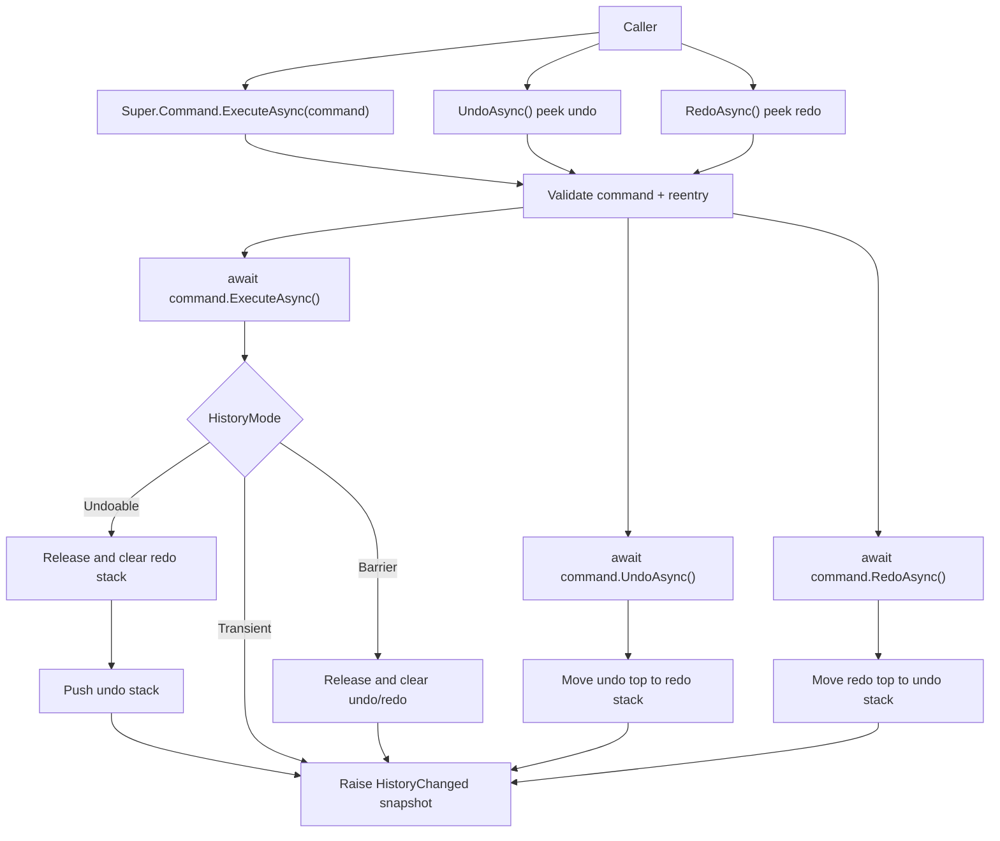

# command-module design

## 0. 术语约定

| 术语 | 当前定义 | 本次约定 |
|---|---|---|
| `CommandModule` | `Assets/GameDeveloperKit/Runtime/Command/CommandModule.cs` 中的空实现模块骨架 | GameDeveloperKit 运行时命令历史入口，通过 `Super.Command` 访问 |
| command | 当前仓库没有运行时命令契约；插件 XML 中的 COSXML `CommandTask` 与本项目运行时无关 | 一次可执行、可撤销、可重做的业务操作对象，不是 Editor 菜单命令、控制台命令或网络指令 |
| undo stack | 当前不存在 | 已成功执行且可撤销的命令历史；`UndoAsync()` 从栈顶开始撤销 |
| redo stack | 当前不存在 | 已撤销、可重新应用的命令历史；新命令成功执行后清空 |
| history mode | 当前不存在 | 命令对历史栈的影响：可撤销记录、临时执行不入栈、不可逆 barrier 清空历史 |
| command group | 当前不存在 | 多个命令组成的一个历史条目，用于把一次用户动作拆成多步执行但只撤销一次 |

防冲突结论：

- 本 feature 使用 `GameDeveloperKit.Command` 命名空间下的运行时命令概念，不复用 Operation 模块的 `OperationHandle` 名词。
- `CommandModule` 只管执行历史和撤销 / 重做顺序，不承担 OperationModule 的异步任务登记、key 回写、下载或资源加载职责。
- 假设：用户提到的 undo / redo 指运行时业务命令历史，不是 Unity Editor 的 Undo 系统。

## 1. 决策与约束

### 需求摘要

做什么：补全 `CommandModule`，让业务可以通过 `Super.Command.ExecuteAsync(command)` 执行命令，通过 `UndoAsync()` / `RedoAsync()` 回退或重做，并能查询 `CanUndo` / `CanRedo`、清理历史、限制历史容量、订阅历史变化。

为谁：运行时编辑、建造、调试工具、UI 工具面板和其他需要可撤销操作的业务模块。

成功标准：

- 注册 `CommandModule` 后可以通过 `Super.Command` 获取模块实例。
- 执行一个可撤销命令成功后，命令进入 undo stack，redo stack 被清空。
- `UndoAsync()` 调用最近命令的撤销逻辑，成功后命令从 undo stack 移入 redo stack。
- `RedoAsync()` 调用最近撤销命令的重做逻辑，成功后命令从 redo stack 移回 undo stack。
- 命令执行 / 撤销 / 重做失败时，模块不静默吞异常，历史栈不做成功态迁移。
- `Clear()` / `Shutdown()` 清空历史并释放仍由模块持有的命令。
- 历史容量超限时丢弃最旧 undo 记录，并释放被丢弃命令。
- 业务侧可以观察历史状态变化，用于启用 / 禁用撤销和重做按钮。

明确不做：

- 不接入 Unity Editor `Undo` API，不做 Editor 菜单或 Inspector 工具。
- 不做控制台命令、脚本解释器、输入作弊码、网络指令或 RPC 分发。
- 不把 `CommandModule` 扩展成任务调度器、队列、优先级系统、重试系统或资源加载入口。
- 不持久化命令历史，不做存档恢复、热重载恢复或跨进程历史同步。
- 不做分支历史浏览；新命令成功执行后 redo stack 直接清空。
- 不提供跨线程并发安全承诺；公开 API 假定 Unity 主线程调用。
- 不自动保证业务状态原子性；命令实现者需要保证失败时不留下不可恢复的半成品副作用。

### 复杂度档位

走框架运行时模块默认档位，偏离点：

- `Robustness = L3`：撤销 / 重做属于基础状态能力，需要对 null 命令、重入调用、失败迁移、容量淘汰和清理释放给出明确语义。
- `Structure = modules`：命令契约、历史模式、命令组、历史快照和模块入口分文件，避免继续把所有公开类型塞进 `CommandModule.cs`。
- `Concurrency = single-threaded orchestration`：模块串行执行当前命令；执行中再次 Execute / Undo / Redo 抛明确异常，不提供跨线程安全。
- `Determinism = deterministic`：同一条线性历史下，Undo / Redo 总是按栈顺序操作，不保留分支。

### 关键决策

1. Command 是业务操作契约，不继承 `OperationHandle`。
   - `OperationModule` 处理运行中 operation 的登记、等待和终态回写。
   - `CommandModule` 处理已执行命令的历史栈迁移。
   - 两者可以协作，但命令本身不应该被强制包装成 operation handle。

2. 公开 API 采用 `UniTask`，但不提供调度语义。
   - 命令方法使用 `ExecuteAsync()` / `UndoAsync()` / `RedoAsync()`，同步命令返回 `UniTask.CompletedTask`。
   - 长耗时下载、资源加载仍应由业务命令内部调用已有模块，CommandModule 只等待命令结束并迁移历史。

3. Redo 是独立方法，不默认等同于 Execute。
   - 有些命令的重做可以复用执行逻辑，有些命令需要复用第一次执行时生成的对象 ID、随机结果或旧值。
   - 提供 `CommandBase` 让简单命令的 `RedoAsync()` 默认调用 `ExecuteAsync()`；复杂命令可覆盖。

4. 历史模式显式化。
   - `Undoable`：执行成功后进入 undo stack，清空 redo stack。
   - `Transient`：执行成功后不进入历史，也不清理已有历史，用于预览或只读命令。
   - `Barrier`：执行成功后清空 undo / redo stack，用于不可逆状态变化，避免旧历史误导后续撤销。

5. 失败不迁移历史栈。
   - Execute 失败：命令不入 undo stack，redo stack 不因失败被清空。
   - Undo 失败：命令仍留在 undo stack。
   - Redo 失败：命令仍留在 redo stack。
   - 约束：命令实现者要保证失败时没有不可恢复的部分副作用；模块不尝试自动补偿业务状态。

6. 首版禁止重入。
   - `ExecuteAsync` / `UndoAsync` / `RedoAsync` 正在运行时，再次调用三者之一抛 `GameException`。
   - 这避免命令执行中递归改写同一组历史栈。

7. 历史变化通知是模块本地事件，不依赖 EventModule。
   - `CommandModule` 暴露 `event Action<CommandHistorySnapshot> HistoryChanged` 或等价事件。
   - 这样 UI 按钮可以直接刷新 `CanUndo` / `CanRedo`，同时不强制注册 EventModule。

## 2. 名词与编排

### 2.1 名词层

#### 现状

- `Assets/GameDeveloperKit/Runtime/Command/CommandModule.cs` 当前只有 `CommandModule : GameModuleBase`，`Startup()` / `Shutdown()` 均抛 `NotImplementedException`。
- `Assets/GameDeveloperKit/Runtime/Super.cs` 当前公开 `Super.Event`、`Super.Resource`、`Super.File`、`Super.Download`、`Super.Operation`，没有 `Super.Command`。
- `Assets/GameDeveloperKit/Runtime/Operation/OperationModule.cs` 已承担 operation 执行、等待、key 终态回写和关闭清理；它不是命令历史栈。
- `Assets/GameDeveloperKit/Runtime/Event/EventModule.cs` 使用本地订阅表和 `Subscription`，但命令历史状态变化不需要强依赖事件模块。

#### 变化

新增运行时命令契约：

```csharp
public interface ICommand : IReference
{
    string Name { get; }
    CommandHistoryMode HistoryMode { get; }

    UniTask ExecuteAsync();
    UniTask UndoAsync();
    UniTask RedoAsync();
}
```

新增基础类，降低简单命令实现成本：

```csharp
public abstract class CommandBase : ICommand
{
    public virtual string Name => GetType().Name;
    public virtual CommandHistoryMode HistoryMode => CommandHistoryMode.Undoable;

    public abstract UniTask ExecuteAsync();
    public abstract UniTask UndoAsync();
    public virtual UniTask RedoAsync();
    public virtual void Release();
}
```

新增历史模式：

```csharp
public enum CommandHistoryMode : byte
{
    Undoable = 0,
    Transient = 1,
    Barrier = 2,
}
```

新增命令组：

```csharp
public sealed class CommandGroup : CommandBase
{
    public CommandGroup(string name, params ICommand[] commands);
}
```

命令组语义：

- Execute 按添加顺序执行子命令。
- Undo 按反向顺序撤销已执行子命令。
- Redo 按添加顺序重做子命令。
- 子命令失败时，命令组失败并按已完成部分尝试回滚；回滚失败则向外抛原始失败并附带回滚失败信息。实现阶段可用聚合异常或 `GameException` 明确表达。

新增历史快照：

```csharp
public readonly struct CommandHistorySnapshot
{
    public bool CanUndo { get; }
    public bool CanRedo { get; }
    public int UndoCount { get; }
    public int RedoCount { get; }
    public string UndoName { get; }
    public string RedoName { get; }
}
```

`CommandModule` 公开 API 目标：

```csharp
public sealed class CommandModule : GameModuleBase
{
    public event Action<CommandHistorySnapshot> HistoryChanged;

    public int HistoryCapacity { get; set; }
    public bool IsExecuting { get; }
    public bool CanUndo { get; }
    public bool CanRedo { get; }
    public int UndoCount { get; }
    public int RedoCount { get; }

    public override UniTask Startup();
    public override UniTask Shutdown();

    public UniTask ExecuteAsync(ICommand command);
    public UniTask UndoAsync();
    public UniTask RedoAsync();
    public void Clear();
    public CommandHistorySnapshot GetSnapshot();
}
```

接口示例：

```csharp
// 来源：Assets/GameDeveloperKit/Runtime/Command/CommandModule.cs CommandModule
await Super.Command.ExecuteAsync(new MoveUnitCommand(unit, from, to));
// 成功后：Super.Command.CanUndo == true，Super.Command.CanRedo == false

await Super.Command.UndoAsync();
// 成功后：unit 回到 from，Super.Command.CanRedo == true

await Super.Command.RedoAsync();
// 成功后：unit 回到 to，Super.Command.CanUndo == true
```

```csharp
// 来源：Assets/GameDeveloperKit/Runtime/Command/CommandModule.cs CommandModule
Super.Command.HistoryChanged += snapshot =>
{
    undoButton.interactable = snapshot.CanUndo;
    redoButton.interactable = snapshot.CanRedo;
};
```

### 2.2 编排层



#### 现状

- `CommandModule.Startup()` / `Shutdown()` 没有可运行流程。
- 仓库没有统一命令执行入口、undo stack、redo stack、history snapshot 或历史变化通知。
- 业务若需要撤销 / 重做，只能各自保存旧值和回退逻辑。

#### 变化

1. Startup：
   - 初始化 undo stack、redo stack、执行状态和默认容量。
   - 默认历史容量假设为 128；`HistoryCapacity <= 0` 表示不限制容量。

2. ExecuteAsync：
   - 校验 command 不为 null。
   - 如果模块正在执行 / 撤销 / 重做，抛 `GameException`。
   - 设置 `IsExecuting = true`，等待 `command.ExecuteAsync()`。
   - 执行成功后按 `HistoryMode` 迁移历史：
     - `Undoable`：清空 redo stack，压入 undo stack，按容量淘汰最旧 undo 记录。
     - `Transient`：不入栈，不清理 undo / redo。
     - `Barrier`：清空 undo / redo，当前命令执行完释放或交还调用方；它不进入历史。
   - 执行失败时不迁移历史，异常向调用方抛出。
   - 结束时恢复执行状态，并在历史有变化时触发 `HistoryChanged`。

3. UndoAsync：
   - 如果 undo stack 为空，返回已完成任务，不抛异常。
   - peek 栈顶命令，等待 `command.UndoAsync()`。
   - 成功后从 undo stack pop，并 push 到 redo stack。
   - 失败时命令仍留在 undo stack，异常向调用方抛出。

4. RedoAsync：
   - 如果 redo stack 为空，返回已完成任务，不抛异常。
   - peek 栈顶命令，等待 `command.RedoAsync()`。
   - 成功后从 redo stack pop，并 push 到 undo stack。
   - 失败时命令仍留在 redo stack，异常向调用方抛出。

5. Clear / Shutdown：
   - `Clear()` 释放并清空 undo / redo stack，触发历史变化通知。
   - `Shutdown()` 调用 `Clear()`，清空 `HistoryChanged` 订阅，返回完成任务。

6. CommandGroup：
   - 对外看作一个 `ICommand`。
   - Execute 成功后整个 group 作为一个历史条目入栈。
   - Undo / Redo 对子命令使用相反或相同顺序，保证一次用户动作只产生一次撤销记录。

#### 流程级约束

- 错误语义：参数错误抛 `ArgumentNullException` / `ArgumentException`；重入、无效 history mode、命令组回滚失败等框架语义错误抛 `GameException`。
- 幂等性：空 undo / redo 是 no-op；`Clear()` 可重复调用；`Shutdown()` 后历史为空。
- 顺序约束：撤销严格 LIFO，重做严格 LIFO；新 `Undoable` 命令成功执行后 redo stack 清空。
- 并发约束：单线程串行，不支持并发 Execute / Undo / Redo，不支持命令内部递归调用 `Super.Command` 修改同一历史。
- 失败约束：模块只在命令方法成功返回后迁移栈；命令实现者负责业务状态原子性。
- 资源约束：被历史栈持有的命令由模块在淘汰、清理或关闭时调用 `Release()`；调用方不应在命令入栈后提前释放。
- 可观测点：调用方通过 `CanUndo` / `CanRedo` / `UndoCount` / `RedoCount` / `GetSnapshot()` / `HistoryChanged` 观察历史状态。

### 2.3 挂载点清单

1. `Super.Command`：新增运行时命令模块的全局访问入口。
2. `ICommand` / `CommandBase` / `CommandHistoryMode`：业务命令接入命令历史的公开契约。
3. `CommandModule.HistoryChanged`：历史状态变化通知入口，供 UI 或工具面板启用 / 禁用 undo / redo。

拔除沙盘：删除 `Runtime/Command/`、移除 `Super.Command`、移除依赖 `HistoryChanged` / `ICommand` 的业务接线，并回滚架构记录后，运行时命令历史能力应消失。

### 2.4 推进策略

1. 模块入口和名词骨架：建立 `Super.Command`、`ICommand`、`CommandBase`、`CommandHistoryMode`、`CommandHistorySnapshot` 和空栈状态。
   - 退出信号：注册模块后可获取 `Super.Command`，公开属性返回空历史状态。
2. Execute 主流程：实现命令执行、history mode 分支、redo 清理、容量淘汰和历史变化通知。
   - 退出信号：可撤销命令成功执行后进入 undo stack，新命令清空 redo stack。
3. Undo / Redo 编排：实现 peek 后执行、成功迁移、失败不迁移、空栈 no-op。
   - 退出信号：连续执行、撤销、重做的栈计数和命令副作用符合预期。
4. CommandGroup：实现组合命令的顺序执行、反向撤销、重做和失败回滚语义。
   - 退出信号：一组子命令只产生一个 undo 记录，撤销顺序正确。
5. 生命周期清理：实现 `Clear()`、`Shutdown()`、淘汰释放和事件订阅清理。
   - 退出信号：清理后 undo / redo 为空，被释放命令收到 `Release()`。
6. 验证覆盖：覆盖正常、边界、错误和范围守护场景。
   - 退出信号：Runtime 快速编译通过，关键验收契约有可观察证据。

### 2.5 结构健康度与微重构

##### 评估

- compound convention 检索：未命中 “目录组织 / 命名 / 归属 / Command / Undo / Redo” 相关 convention。
- 文件级 — `Assets/GameDeveloperKit/Runtime/Command/CommandModule.cs`：当前约 15 行，只是空模块骨架；本次属于补全现有职责，不存在需要先搬走的旧行为。
- 文件级 — `Assets/GameDeveloperKit/Runtime/Super.cs`：当前约 96 行，是模块入口聚合点；本次只新增 `using GameDeveloperKit.Command` 和 `Super.Command` 入口，不需要拆分。
- 目录级 — `Assets/GameDeveloperKit/Runtime/Command/`：当前只有 `CommandModule.cs`；本次预计新增 5 个左右源码文件，目录不拥挤。

##### 结论：不做微重构

本次不做“只搬不改行为”的前置微重构。原因是 Command 目录几乎为空，`Super.cs` 只承担模块入口聚合职责；直接把新增公开类型按文件拆入 `Runtime/Command/` 比先做搬迁更清晰。

##### 超出范围的观察

- 如果后续出现大量业务命令实现，不应把它们全部放进框架 `Runtime/Command/`；业务命令应归属各自玩法 / 工具模块，框架目录只保留通用契约和编排类型。
- 如果未来要让命令历史跨存档恢复，需要另起 feature 设计可序列化命令、版本兼容和安全边界，本 feature 不预留持久化格式。

## 3. 验收契约

| 编号 | 输入 / 触发 | 期望可观察结果 |
|---|---|---|
| N1 | `Super.Register<CommandModule>()` 后访问 `Super.Command` | 返回已注册 `CommandModule` 实例 |
| N2 | 模块 Startup 完成 | `CanUndo == false`，`CanRedo == false`，`UndoCount == 0`，`RedoCount == 0` |
| N3 | `ExecuteAsync(undoableCommand)` 成功 | 命令执行一次，进入 undo stack，`CanUndo == true`，redo stack 被清空 |
| N4 | 已有 redo stack 时执行新的 undoable command | redo stack 中命令被释放并清空 |
| N5 | `UndoAsync()` 且 undo stack 非空 | 栈顶命令 `UndoAsync()` 被调用，成功后移入 redo stack |
| N6 | `RedoAsync()` 且 redo stack 非空 | 栈顶命令 `RedoAsync()` 被调用，成功后移回 undo stack |
| N7 | 连续执行 A、B、C 后连续 Undo | 撤销顺序为 C、B、A |
| N8 | 执行 A、B 后连续 Undo 两次，再连续 Redo 两次 | 撤销顺序为 B、A；重做顺序为 A、B，即最近撤销的命令先重做 |
| N9 | 执行 `Transient` 命令成功 | 命令执行，但 undo / redo stack 计数不变 |
| N10 | 执行 `Barrier` 命令成功 | 命令执行，undo / redo stack 都被清空 |
| N11 | 历史容量为 2 时成功执行 A、B、C | undo stack 只保留 B、C，A 被释放 |
| N12 | 订阅 `HistoryChanged` 后执行 / 撤销 / 重做 / 清理 | 每次历史状态变化都收到包含 CanUndo / CanRedo / count 的快照 |
| N13 | `CommandGroup(A, B, C)` 执行成功 | A、B、C 按顺序执行，group 作为一个 undo 记录入栈 |
| N14 | 撤销已执行的 `CommandGroup(A, B, C)` | C、B、A 按反向顺序撤销，group 移入 redo stack |
| B1 | `ExecuteAsync(null)` | 抛 `ArgumentNullException` |
| B2 | undo stack 为空时调用 `UndoAsync()` | no-op，不抛异常，历史状态不变 |
| B3 | redo stack 为空时调用 `RedoAsync()` | no-op，不抛异常，历史状态不变 |
| B4 | 重复调用 `Clear()` | 不抛异常，undo / redo 保持为空 |
| B5 | `HistoryCapacity <= 0` 后执行多条命令 | 不因容量淘汰命令 |
| E1 | command.ExecuteAsync 抛异常 | 命令不入 undo stack，redo stack 不被清空，异常向调用方抛出 |
| E2 | command.UndoAsync 抛异常 | 命令仍留在 undo stack，不进入 redo stack，异常向调用方抛出 |
| E3 | command.RedoAsync 抛异常 | 命令仍留在 redo stack，不进入 undo stack，异常向调用方抛出 |
| E4 | Execute / Undo / Redo 正在运行时再次调用任一入口 | 抛 `GameException`，历史栈不被重入修改 |
| E5 | `Shutdown()` 时历史中仍有命令 | 所有历史命令被释放，undo / redo 清空，事件订阅清空 |

### 明确不做的反向核对项

- Runtime Command 代码不应引用 `UnityEditor.Undo` 或任何 `UnityEditor` API。
- 不新增控制台 parser、脚本解释器、网络 RPC、socket、HTTP 或输入作弊码相关实现。
- `CommandModule` 不应新增 operation 队列、优先级、重试次数或调度线程。
- 不新增命令历史持久化文件、存档字段或热重载恢复格式。
- 不实现分支历史数据结构；新命令成功执行后 redo stack 直接清空。
- 不新增跨线程 lock / concurrent collection 作为线程安全承诺。

## 4. 与项目级架构文档的关系

验收通过后需要更新 `.codestable/architecture/ARCHITECTURE.md`：

- 新增 Command 子系统：入口 `CommandModule`、访问方式 `Super.Command`、核心类型 `ICommand` / `CommandBase` / `CommandGroup` / `CommandHistoryMode` / `CommandHistorySnapshot`。
- 记录历史栈语义：Undoable 命令进入 undo stack；Undo 成功移入 redo stack；Redo 成功移回 undo stack；新 Undoable 命令清空 redo stack； Barrier 命令清空全部历史。
- 记录流程级约束：公开 API 假定 Unity 主线程调用；执行中禁止重入；失败不迁移栈；命令实现者负责业务状态原子性。
- 记录边界：CommandModule 不替代 OperationModule，不做 Editor Undo、命令解释器、网络指令、持久化历史或分支历史。
- 本 feature 非 roadmap 起头，design frontmatter 不写 `roadmap` / `roadmap_item`。
