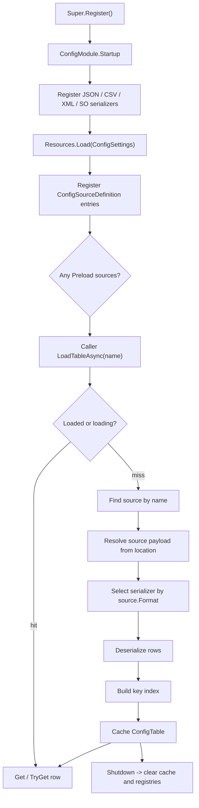

# config-module design

## 0. 术语约定

| 术语 | 当前定义 | 本次约定 |
|---|---|---|
| `ConfigModule` | `Assets/GameDeveloperKit/Runtime/Config/ConfigModule.cs` 中的未实现模块骨架 | GameDeveloperKit 运行时配置表入口，通过 `Super.Config` 访问 |
| 配置表 | 当前没有统一模型 | 一组静态 row 数据，可按名称加载，可按主键查询，也可作为列表读取 |
| row | 当前没有统一模型 | 配置表中的一行强类型数据，例如 `ItemConfig` / `LevelConfig` |
| key / 主键 | 当前没有统一模型 | row 内用于唯一索引的字段或属性，来自 `ConfigSourceDefinition.KeyField` 或 `[ConfigKey]` |
| `ConfigSourceDefinition` | 当前不存在 | 一张配置表的注册条目，记录表名、格式、位置、row 类型、主键字段和是否预加载 |
| `IConfigSerializer` | 当前不存在 | 格式适配器，把 XML / CSV / JSON 文本或 ScriptableObject asset 转成统一 row 列表 |
| JSON serializer | 当前只有 VFS 和 Resource manifest 使用 Newtonsoft.Json | 配置表 JSON 反序列化器，继续使用项目已有 Newtonsoft.Json |
| XML serializer | 当前没有 | 配置表 XML 反序列化器，面向 `<rows><row>...</row></rows>` 这类表结构 |
| CSV serializer | 当前没有 | 配置表 CSV 反序列化器，首行表头映射 row 字段 / 属性 |
| SO serializer | 当前没有 | ScriptableObject 配置资产反序列化器；这里的 SO 指 Unity `ScriptableObject`，不是 native shared object |

防冲突结论：

- `ConfigModule` 已有 namespace `GameDeveloperKit.Config`，本 feature 延续，不把配置表能力塞进 Resource / FileSystem。
- XML / CSV / JSON / SO 是配置数据格式或资产形态，不是 Resource 模块的 play mode；资源定位和反序列化职责分开。
- JSON 依赖使用 `Newtonsoft.Json.dll`，不新增 `System.Text.Json` 或第三方 CSV/XML 库。
- SO 配置只指 Unity `ScriptableObject` 资产；不设计跨平台动态库加载。

## 1. 决策与约束

### 需求摘要

做什么：补全运行时 `ConfigModule`，让业务通过统一 API 加载和查询配置表；配置表来源支持 XML、CSV、JSON 和 ScriptableObject，并为四种来源分别提供 serializer。模块负责读取配置设置、选择 serializer、反序列化 row、建立主键索引、缓存表、处理重复加载和 Shutdown 清理。

为谁：使用 GameDeveloperKit 编写玩法、数值、关卡、UI 文案等静态配置读取逻辑的业务开发者，以及维护多格式配置导入链路的框架开发者。

成功标准：

- 注册 `ConfigModule` 后可以通过 `Super.Config` 获取模块实例。
- `ConfigSettings` 能声明多张配置表，每张表包含 name、format、location、row type、key field 和 preload。
- XML / CSV / JSON / SO 四种 serializer 都接入同一 `IConfigSerializer` 契约。
- 业务可按表名加载 `ConfigTable<TRow>`，并通过 key 查询单行或读取所有 rows；业务 API 不暴露 key 泛型参数。
- 重复加载同一表不会重复解析；并发加载同一表只执行一次解析。
- 缺配置源、未知格式、缺 serializer、解析失败、row 类型不匹配、缺主键字段、重复 key 都给出明确异常。
- `Shutdown()` 清空缓存和 serializer/source 注册，不留下运行时表对象。

假设：首版目标是运行时只读静态配置。配置编辑、Excel 导入、热更新版本管理和远端下载另起 feature。

### 明确不做

- 不做配置编辑器、不做 Excel / Google Sheet / 二进制配置导入。
- 不做远端下载、热更新版本比较、差量合并或配置补丁。
- 不新增第三方 CSV / XML / JSON 库。
- 不改变 `ResourceModule`、`FileModule`、`DownloadModule` 的现有 API。
- 不把配置表自动注入业务对象，不做依赖注入容器。
- 不支持运行时写回配置表；serializer 首版以反序列化为主。
- 不承诺跨线程安全；公开 API 假定 Unity 主线程编排。

### 复杂度档位

走框架运行时模块默认档位，偏离点：

- `Robustness = L3`：配置是外部输入，必须对缺文件、空内容、格式错误、类型不匹配、重复 key、缺 key 做明确校验。
- `Compatibility = active`：当前只有空骨架，API 可以按首版配置表模型设计；后续要通过新增 serializer / source 扩展，而不是改已有调用方。
- `Concurrency = single-threaded orchestration`：公开 API 假定 Unity 主线程；异步读取可用 UniTask，但不承诺多线程安全。
- `Dependency = optional-resource-module`：默认支持 Unity `Resources` 加载；如果 Resource 模块已注册，可作为配置文件 / asset 的来源之一，但 serializer 不依赖 Resource 模块。

### 关键决策

1. 配置加载拆成“来源解析”和“格式反序列化”两层。
   - 来源解析负责根据 `location` 拿到 UTF-8 文本、bytes 或 Unity asset。
   - serializer 只负责把 payload 转成 `IReadOnlyList<TRow>`。
   - 这样 XML / CSV / JSON / SO 可以共用缓存、主键索引和错误语义。

2. 所有格式最终落到同一个 `ConfigTable<TRow>`。
   - row 类型由业务定义。
   - 表对象持有原始 rows 和 key -> row 索引；key 的实际类型来自配置行主键字段 / 属性。
   - key 来自 `ConfigSourceDefinition.KeyField` 或 row 上的 `[ConfigKey]`。

3. 内置 serializer 固定四个。
   - `JsonConfigSerializer`：解析 JSON array 或 `{ "rows": [...] }`。
   - `CsvConfigSerializer`：解析首行为 header 的 CSV，header 映射到 row 字段 / 属性。
   - `XmlConfigSerializer`：解析统一 row 节点结构。
   - `ScriptableObjectConfigSerializer`：从实现配置资产契约的 `ScriptableObject` 中提取 rows。

4. `ConfigSettings` 是启动配置入口。
   - 默认通过 `Resources.Load<ConfigSettings>("ConfigSettings")` 读取，匹配现有 Timer / Resource settings 习惯。
   - settings 缺失时模块仍可启动，只是不自动预加载；业务可运行时注册 source。
   - preload 项在 `Startup()` 中加载；lazy 项在首次 `LoadTableAsync` 时加载。

5. API 以表名 + 泛型 row 为边界。
   - 表名解决“同一 row 类型可能有多张表”的场景。
   - `TRow` 让业务查询结果强类型，不返回 `object` 给业务层处理。
   - key 参数不作为泛型暴露；传入 key 的运行时类型必须能匹配 row 主键字段类型，否则抛明确异常。

## 2. 名词与编排

### 2.1 名词层

#### 现状

- `Assets/GameDeveloperKit/Runtime/Config/ConfigModule.cs` 当前只有 `Startup()` / `Shutdown()` 空骨架，且方法内抛 `NotImplementedException`。
- `Assets/GameDeveloperKit/Runtime/Super.cs` 当前暴露 `Event`、`Resource`、`File`、`Download`、`Operation`，没有 `Super.Config`。
- `Assets/GameDeveloperKit/Runtime/GameDeveloperKit.Runtime.asmdef` 已引用 `Newtonsoft.Json.dll`，可以复用 JSON 能力。
- `ResourceModule.ManifestOperationHandle` 已有“读取文本 -> Newtonsoft.Json 反序列化”的模式，但只服务资源 manifest。
- `TimerModule` / `ResourceModule` 都使用 `Resources.Load<TSettings>()` 读取模块设置。

#### 变化

公开入口目标：

```csharp
public sealed class ConfigModule : GameModuleBase
{
    public override UniTask Startup();
    public override UniTask Shutdown();

    public void RegisterSource(ConfigSourceDefinition source);
    public void RegisterSerializer(IConfigSerializer serializer);

    public UniTask<ConfigTable<TRow>> LoadTableAsync<TRow>(string name);
    public ConfigTable<TRow> GetTable<TRow>(string name);
    public bool TryGetTable<TRow>(string name, out ConfigTable<TRow> table);
    public bool TryGetRow<TRow>(string name, object key, out TRow row);
    public void Unload(string name);
}
```

`ConfigSettings` 目标：

```csharp
[CreateAssetMenu(fileName = "ConfigSettings", menuName = "GameDeveloperKit/ConfigSettings")]
public sealed class ConfigSettings : ScriptableObject
{
    [SerializeField] private ConfigSourceDefinition[] sources;
}
```

`ConfigSourceDefinition` 目标：

```csharp
[Serializable]
public sealed class ConfigSourceDefinition
{
    public string Name;
    public ConfigFormat Format;
    public string Location;
    public string RowTypeName;
    public string KeyField;
    public bool Preload;
}
```

格式枚举：

```csharp
public enum ConfigFormat : byte
{
    Json,
    Csv,
    Xml,
    ScriptableObject,
}
```

统一表对象：

```csharp
public sealed class ConfigTable<TRow>
{
    public string Name { get; }
    public Type KeyType { get; }
    public IReadOnlyList<TRow> Rows { get; }
    public bool TryGet(object key, out TRow row);
    public TRow Get(object key);
}
```

serializer 契约：

```csharp
public interface IConfigSerializer
{
    ConfigFormat Format { get; }
    UniTask<IReadOnlyList<TRow>> DeserializeAsync<TRow>(ConfigSerializerContext context);
}
```

SO 配置资产契约：

```csharp
public interface IConfigAsset
{
    Type RowType { get; }
    IReadOnlyList GetRows();
}
```

接口示例：

```csharp
await Super.Register<ConfigModule>();

var table = await Super.Config.LoadTableAsync<ItemConfig>("items");
var sword = table.Get(1001);

if (Super.Config.TryGetRow<ItemConfig>("items", 1002, out var shield))
{
    // 使用 shield
}
```

四种 serializer 的输入示例：

JSON：

```json
[
  { "Id": 1001, "Name": "Sword", "Price": 120 },
  { "Id": 1002, "Name": "Shield", "Price": 90 }
]
```

CSV：

```csv
Id,Name,Price
1001,Sword,120
1002,Shield,90
```

XML：

```xml
<rows>
  <row>
    <Id>1001</Id>
    <Name>Sword</Name>
    <Price>120</Price>
  </row>
</rows>
```

SO：

```csharp
public sealed class ItemConfigAsset : ScriptableObject, IConfigAsset
{
    [SerializeField] private ItemConfig[] rows;
    public Type RowType => typeof(ItemConfig);
    public IReadOnlyList GetRows() => rows;
}
```

### 2.2 编排层



#### 现状

- Config 模块没有启动配置、source registry、serializer registry、缓存或查询 API。
- `Super` 没有 Config 模块访问入口。
- 项目里已有的 JSON 解析都各自写在对应模块内，没有通用配置 serializer。
- XML / CSV / ScriptableObject 配置表没有统一约定。

#### 变化

1. Startup：
   - 注册四个内置 serializer：JSON、CSV、XML、SO。
   - 尝试读取 `ConfigSettings`。
   - 将 settings 中的 source 加入 registry，校验 name / format / location / row type / key field。
   - 对 `Preload == true` 的 source 执行加载；失败时 Startup 失败，避免业务运行到一半才发现基础配置不可用。

2. LoadTableAsync：
   - 校验 name 非空。
   - 如果表已加载，校验 row 类型匹配后返回缓存表。
   - 如果同名表正在加载，等待同一个 pending load。
   - 查找 source；找不到时抛 `GameException`。
   - 根据 source 解析 payload：文本格式读取 UTF-8 文本，SO 格式读取 `ScriptableObject` asset。
   - 按 `ConfigFormat` 找 serializer；找不到时抛 `GameException`。
   - serializer 返回 rows；null rows 视为解析失败，空 rows 允许但仍建立空表。
   - 根据 key field 或 `[ConfigKey]` 建立索引并记录 `KeyType`；重复 key 抛 `GameException`。
   - 缓存 `ConfigTable<TRow>`。

3. JSON serializer：
   - 输入 UTF-8 JSON 文本。
   - 支持 root array：`[{...}]`。
   - 支持 wrapper：`{ "rows": [{...}] }`，便于后续加 metadata。
   - 使用 Newtonsoft.Json 映射字段 / 属性。

4. CSV serializer：
   - 输入 UTF-8 CSV 文本。
   - 首行必须是 header。
   - header 名称映射 row 字段 / 属性；缺少必需字段或类型转换失败抛明确异常。
   - 支持基础转义规则：逗号、引号、换行字段按标准 CSV 引号处理。

5. XML serializer：
   - 输入 UTF-8 XML 文本。
   - 默认读取 `<rows><row>...</row></rows>`。
   - row 子节点名映射字段 / 属性。
   - 根节点或 row 节点缺失时抛明确异常。

6. SO serializer：
   - 输入 Unity `ScriptableObject` asset。
   - asset 必须实现 `IConfigAsset`。
   - `IConfigAsset.RowType` 必须与 `TRow` 一致或可赋值。
   - `GetRows()` 返回的数据逐行校验类型后进入统一索引流程。

7. Shutdown：
   - 清空已加载表和 pending load。
   - 清空运行时注册的 sources。
   - 内置 serializer 可在下次 Startup 重新注册。

#### 流程级约束

- 错误语义：公开输入 null 抛 `ArgumentNullException`，空白字符串抛 `ArgumentException`；运行期找不到配置、serializer、asset 或解析失败抛 `GameException`。
- 幂等性：重复 `LoadTableAsync` 同一 name 不重复解析；重复 `Unload(name)` 对未加载表 no-op；`Shutdown()` 多次调用最终无缓存残留。
- 顺序：serializer 注册早于 settings preload；反序列化早于主键索引；索引成功后才进入缓存。
- 缓存：缓存 key 至少包含 table name；读取缓存时必须校验 `TRow`，查询时必须校验传入 key 是否匹配表的 `KeyType`，避免同名表被不同类型误用。
- 扩展点：新格式通过 `RegisterSerializer` 加入，不改 `ConfigModule` 主流程；新存储来源通过 source resolver 扩展，不改 serializer。
- 可观测点：加载失败信息必须包含 config name、format、location 和 row type，方便定位配置问题。

### 2.3 挂载点清单

1. `Super.Config`：运行时访问配置模块的框架入口，删除后业务无法通过统一入口读取配置表。
2. `ConfigSettings`：`Resources/ConfigSettings` 中声明配置表 name / format / location / row type / key field / preload。
3. `ConfigSourceDefinition` registry：配置表名称到来源和格式的注册边界，删除后模块不知道有哪些表。
4. `IConfigSerializer` registry：XML / CSV / JSON / SO serializer 的注册入口，删除后多格式来源能力消失。
5. `IConfigAsset`：ScriptableObject 配置资产接入契约，删除后 SO 来源无法进入统一表模型。

拔除沙盘：移除 `Super.Config`、`ConfigSettings`、source registry、serializer registry 和 SO asset 契约后，运行时配置表能力应完整消失；业务若直接依赖 `ConfigTable` / row 类型，需要同步迁移到自己的读取逻辑。

### 2.4 推进策略

1. 模块入口和配置设置骨架：实现 `Super.Config`、`ConfigModule.Startup/Shutdown`、`ConfigSettings` 和 source registry。
   - 退出信号：注册模块后可获取 `Super.Config`；没有 settings 时模块能启动且缓存为空。
2. 统一名词契约：实现 `ConfigFormat`、`ConfigSourceDefinition`、`ConfigTable`、`ConfigKeyAttribute`、`IConfigSerializer` 和 `IConfigAsset`。
   - 退出信号：表名、row 类型、key field 和 serializer 契约能表达四种来源。
3. 加载编排骨架：实现 `LoadTableAsync` 的校验、pending single-flight、cache hit/miss 和 unload 流程，serializer 暂用 stub。
   - 退出信号：同名并发加载只走一次流程，缓存命中能返回同一表对象。
4. 文本来源 serializer：实现 JSON、CSV、XML 三个 serializer，并接入统一 row 列表输出。
   - 退出信号：三种文本样例都能解析为相同 row 模型。
5. ScriptableObject serializer：实现 SO asset 契约读取和 row 类型校验。
   - 退出信号：实现 `IConfigAsset` 的 asset 能被加载为 `ConfigTable`。
6. 主键索引和错误路径：补齐 key field / `[ConfigKey]` 解析、重复 key、缺字段、类型转换失败、缺 source / serializer / asset 的错误语义。
   - 退出信号：关键错误都包含 config name / format / location / row type。
7. 预加载和 Shutdown 清理：接通 `ConfigSettings.Preload`，补齐清理、重复 shutdown 和 unload 语义。
   - 退出信号：preload 表启动后可直接查询；Shutdown 后缓存清空。
8. 验证覆盖：用 Unity Test Framework 或 Runtime 编译验证覆盖四种 serializer、缓存、并发加载和错误路径。
   - 退出信号：Runtime 编译通过，验收契约有可观察证据。

### 2.5 结构健康度与微重构

#### 评估

- compound convention 检索：未命中“目录组织 / 文件归属 / 命名约定 / Config / Serializer”相关决策。
- 文件级：`Assets/GameDeveloperKit/Runtime/Config/ConfigModule.cs` 当前约 17 行，只是空模块骨架；本次会替换骨架实现，但不需要先做“只搬不改行为”的拆分。
- 文件级：`Assets/GameDeveloperKit/Runtime/Super.cs` 是模块入口聚合点，本次只新增 `Super.Config`，不需要拆分。
- 目录级：`Assets/GameDeveloperKit/Runtime/Config/` 当前只有 `ConfigModule.cs`；本 feature 会新增 settings、source definition、table、serializer、SO contract、内部缓存 / resolver 等多个类型，直接全平铺会很快拥挤。

#### 结论：不做行为微重构，新增文件按职责分组

本次没有需要先搬迁的既有代码。实现阶段应避免把所有类型继续塞进 `ConfigModule.cs`，新增文件按职责落位：

- `Runtime/Config/`：公开入口和公开契约，例如 `ConfigModule`、`ConfigSettings`、`ConfigTable`、`ConfigSourceDefinition`、`ConfigFormat`、`IConfigSerializer`、`IConfigAsset`。
- `Runtime/Config/Serializers/`：`JsonConfigSerializer`、`CsvConfigSerializer`、`XmlConfigSerializer`、`ScriptableObjectConfigSerializer`。
- `Runtime/Config/Internal/`：source resolver、pending load、key index builder、反射字段访问等内部实现。

这属于新增文件归属，不是对现有行为的微重构；checklist 不需要把“微重构”作为第 1 步。

#### 建议沉淀的 convention

如果该布局实现后跑通，后续 Runtime 模块可以统一采用 `{Module}/Serializers/` 放格式适配器、`{Module}/Internal/` 放内部编排辅助类型。design 阶段不归档，等实现和验收通过后再决定是否走 `cs-decide`。

## 3. 验收契约

| 编号 | 输入 / 触发 | 期望可观察结果 |
|---|---|---|
| N1 | `Super.Register<ConfigModule>()` 后访问 `Super.Config` | 返回已注册的 `ConfigModule` 实例 |
| N2 | 工程没有 `Resources/ConfigSettings` | `Startup()` 成功，source registry 为空，不抛 `NotImplementedException` |
| N3 | `ConfigSettings` 中有 JSON preload 表 | Startup 后可直接 `GetTable<TRow>(name)` |
| N4 | 加载 JSON root array | `JsonConfigSerializer` 返回对应 rows，并能按 key 查询 |
| N5 | 加载 `{ "rows": [...] }` JSON wrapper | `JsonConfigSerializer` 返回 wrapper 内 rows |
| N6 | 加载首行 header 的 CSV | `CsvConfigSerializer` 按 header 映射字段 / 属性，并能按 key 查询 |
| N7 | 加载 `<rows><row>...</row></rows>` XML | `XmlConfigSerializer` 按 row 子节点映射字段 / 属性，并能按 key 查询 |
| N8 | 加载实现 `IConfigAsset` 的 ScriptableObject | `ScriptableObjectConfigSerializer` 提取 rows，并能按 key 查询 |
| N9 | 同一 name 连续两次 `LoadTableAsync<TRow>` | 第二次命中缓存，不重复读取和解析 |
| N10 | 同一 name 并发两次 `LoadTableAsync<TRow>` | 只执行一次 source 读取和 serializer 解析，两个调用获得同一结果 |
| N11 | `TryGetRow` 查询存在 key | 返回 true，并输出对应 row |
| N12 | `TryGetRow` 查询不存在 key | 返回 false，不抛异常 |
| N13 | `Unload(name)` 后再次加载 | 重新读取并解析该表 |
| N14 | `Shutdown()` 后 | 缓存、pending load、运行时注册 source 被清空 |
| B1 | `LoadTableAsync<TRow>(null)` / 空白 name | 分别抛 `ArgumentNullException` / `ArgumentException` |
| B2 | source name 不存在 | 抛 `GameException`，消息包含请求 name |
| B3 | source format 没有 serializer | 抛 `GameException`，消息包含 name 和 format |
| B4 | key field 缺失且 row 没有 `[ConfigKey]` | 加载失败，消息包含 name、row type 和 key field |
| B5 | 两行配置 key 重复 | 加载失败，消息包含重复 key 和 config name |
| B6 | 表的 `KeyType` 是 `int`，调用 `table.Get("1001")` 或 `TryGetRow("items", "1001", out row)` | 查询失败并说明 key 类型不匹配，不做隐式字符串转换 |
| E1 | JSON / CSV / XML 内容格式错误 | 加载失败，不缓存半成品表 |
| E2 | SO asset 未实现 `IConfigAsset` | 加载失败，消息说明 SO 配置资产契约不匹配 |
| E3 | SO asset `RowType` 与 `TRow` 不匹配 | 加载失败，消息包含 asset type、RowType 和 requested row type |

### 明确不做的反向核对项

- 不新增 Addressables、第三方 CSV/XML/JSON 库、Excel 读取库或二进制配置格式。
- 不修改 `ResourceModule` / `FileModule` / `DownloadModule` 公开 API。
- 不出现配置编辑器、Excel 导入、远端热更新、版本比较、差量补丁或运行时写回配置。
- 不把所有新增类型堆进 `ConfigModule.cs`。
- 不把 SO 解释为 native shared object 加载。

## 4. 与项目级架构文档的关系

验收通过后需要更新 `.codestable/architecture/ARCHITECTURE.md`：

- 新增 Config 子系统：入口 `ConfigModule`、访问方式 `Super.Config`、核心类型 `ConfigSettings` / `ConfigSourceDefinition` / `ConfigTable` / `IConfigSerializer` / `IConfigAsset`。
- 记录 Config 模块负责运行时只读配置表加载、反序列化、缓存和 key 查询。
- 记录内置 serializer：JSON、CSV、XML、ScriptableObject。
- 记录 serializer 和 source resolver 的职责分离：来源读取不等于格式解析。
- 记录首版不做配置编辑、Excel、热更新下载、版本比较、运行时写回或跨线程安全。
