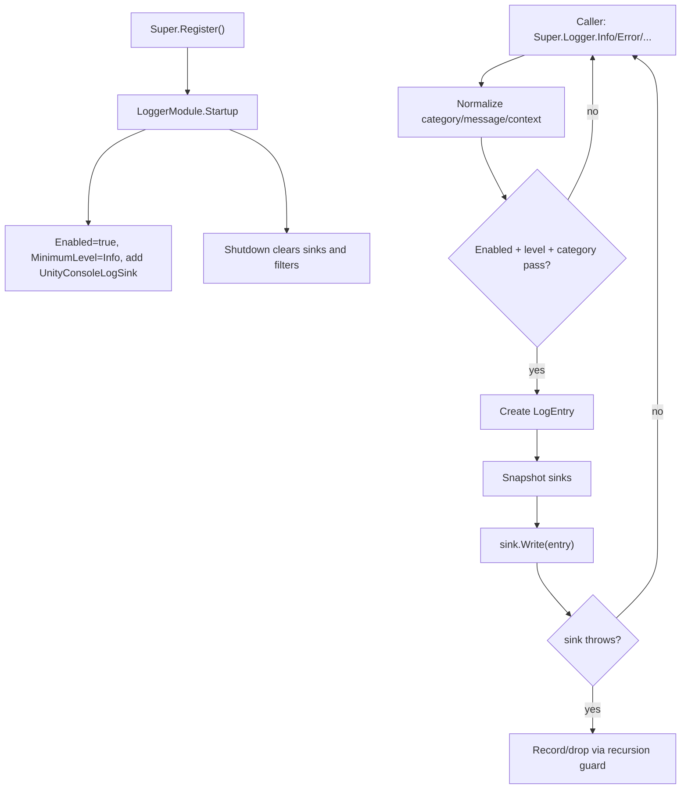

# logger-module design

## 0. 术语约定

| 术语 | 当前定义 | 本次约定 |
|---|---|---|
| `LoggerModule` | `Assets/GameDeveloperKit/Runtime/Logger/LoggerModule.cs` 中的空实现模块骨架 | GameDeveloperKit 运行时日志入口，通过 `Super.Logger` 访问 |
| Logger | 当前只有目录和空模块，没有公开 API | 框架统一日志能力，不和第三方 `ILogger` / Unity `Debug.unityLogger` 混用命名 |
| Log Level | 当前不存在 | `Trace / Debug / Info / Warning / Error / Fatal` 六档等级，用于过滤和输出映射 |
| Category | 当前不存在 | 日志分类字符串，例如 `Resource`、`Download`、`UI`，用于筛选和定位 |
| Log Entry | 当前不存在 | 一条日志的结构化载体，包含时间、等级、分类、消息、异常和上下文 |
| Sink | 当前不存在 | 日志输出目标，例如 Unity Console、自定义内存采集、后续文件/远端扩展 |

防冲突结论：

- 项目当前没有 Logger 相关历史 design，也没有 `Debug.Log` 的运行时调用；本 feature 是补齐已存在 Logger 空模块，不另起平行诊断系统。
- `LogLevel` 可能与第三方库同名；运行时类型放在 `GameDeveloperKit.Logger` 命名空间中，文档引用时写完整上下文。
- 假设：首版默认输出到 Unity Console，并预留 sink 扩展；是否内置文件落盘、是否远端上报、是否接入 `Application.logMessageReceived` 暂不拍死，放在明确不做/后续扩展里让你 review。

## 1. 决策与约束

### 需求摘要

做什么：补全运行时 Logger 模块，让框架和业务可以通过 `Super.Logger` 记录带等级、分类、消息、异常和上下文的日志；模块按当前配置过滤日志，并把通过过滤的日志同步分发给已注册 sink。默认 sink 写入 Unity Console，调用方可以增加或移除自定义 sink。

为谁：GameDeveloperKit 框架模块开发者、业务开发者，以及需要定位运行时问题的人。

成功标准：

- 注册 `LoggerModule` 后可以通过 `Super.Logger` 获取模块实例。
- 调用 `Trace / Debug / Info / Warning / Error / Fatal` API 能产生结构化 `LogEntry`。
- 低于当前最小等级的日志不会进入 sink。
- 分类禁用后，该分类日志不会进入 sink；重新启用后恢复。
- 默认 Unity Console sink 能把不同等级映射到 `UnityEngine.Debug.Log / LogWarning / LogError`。
- 自定义 sink 可注册、取消注册；重复注册同一 sink 不重复输出。
- 记录异常时能保留异常对象和异常文本，不要求调用方自己拼 stack trace。
- `Shutdown()` 会清空 sink、过滤配置和 pending 状态，之后不再向旧 sink 输出。

### 明确不做

- 不默认写文件、不默认上传远端、不默认接入崩溃平台。
- 不接管 Unity 自身或第三方 SDK 直接写入的 `Debug.Log`。
- 不实现异步日志队列、后台线程、批量刷新或跨线程安全承诺。
- 不做 Editor 日志窗口、搜索 UI、Profiler 面板或可视化控制台。
- 不把日志作为事件模块的一部分；EventModule 不参与日志主流程。
- 不要求现有 Resource / Download / UI 等模块在首版全部改成 Logger 调用。
- 不新增第三方日志库依赖。

### 复杂度档位

走框架运行时模块默认档位，偏离点：

- `Robustness = L2`：日志是基础设施，必须处理空消息、空分类、sink 抛异常、重复 sink、Shutdown 后清理等边界。
- `Compatibility = additive`：当前 `LoggerModule` 是空骨架，新增公开 API；不强制迁移所有既有模块调用。
- `Concurrency = single-threaded orchestration`：公开 API 假定 Unity 主线程调用，不承诺多线程安全。
- `Extensibility = sink-based`：输出目标使用小接口扩展，避免把文件/远端/编辑器 UI 全塞进首版模块。

### 关键决策

1. Logger 是独立运行时模块。
   - `LoggerModule` 位于 `Assets/GameDeveloperKit/Runtime/Logger/`。
   - 通过 `Super.Logger` 访问，和 `Super.Event`、`Super.Resource`、`Super.Operation` 保持同一模块入口风格。
   - 其他模块只依赖公开日志 API，不依赖具体 sink。

2. 日志 API 走“等级 + 分类 + 消息 + 可选异常/上下文”。
   - 分类默认允许为空或 `"Default"`，但最终 `LogEntry.Category` 必须有稳定值。
   - 消息为 null 时按空字符串处理，避免日志调用本身抛错遮蔽原始问题。
   - 异常可选；有异常时 `LogEntry.Exception` 保存原始对象。

3. 过滤先于输出。
   - 先判断全局 enabled，再判断最小等级，再判断分类开关。
   - 未通过过滤的日志不创建重型字符串、不进入 sink。
   - 过滤配置是模块状态，`Shutdown()` 清空并恢复默认。

4. Sink 同步接收 `LogEntry`。
   - `ILogSink.Write(LogEntry entry)` 是首版最小扩展点。
   - Unity Console sink 是默认 sink，可在 Startup 注册。
   - sink 抛异常不能让日志调用链无限递归；模块应捕获 sink 异常，并用内部保护策略避免再次进入同一 sink。

5. 不默认做文件日志。
   - 文件日志会牵涉路径、滚动、大小限制、Flush、隐私和平台差异。
   - 首版只把 sink 扩展口留出来；如果你希望 Logger 首版就把日志落盘，应在 review 时把范围扩大。

## 2. 名词与编排

### 2.1 名词层

#### 现状

- `Assets/GameDeveloperKit/Runtime/Logger/LoggerModule.cs` 只有空 `Startup()` / `Shutdown()`，并抛 `NotImplementedException`。
- `Super.cs` 当前没有 `Super.Logger` 入口。
- Runtime 已有模块目录形态：`EventModule`、`DownloadModule`、`OperationModule`、`ResourceModule` 都继承 `GameModuleBase` 并通过 `Super` 暴露。
- 代码搜索没有发现运行时 `Debug.Log` 调用；历史 feature 里只在示例文案出现过 `Debug.Log`。

#### 变化

公开 API 目标：

```csharp
public sealed class LoggerModule : GameModuleBase
{
    public override UniTask Startup();
    public override UniTask Shutdown();

    public bool Enabled { get; set; }
    public LogLevel MinimumLevel { get; set; }

    public void Trace(string message, string category = null, object context = null);
    public void Debug(string message, string category = null, object context = null);
    public void Info(string message, string category = null, object context = null);
    public void Warning(string message, string category = null, object context = null);
    public void Error(string message, string category = null, object context = null);
    public void Error(Exception exception, string message = null, string category = null, object context = null);
    public void Fatal(string message, string category = null, object context = null);
    public void Fatal(Exception exception, string message = null, string category = null, object context = null);

    public void Log(LogLevel level, string message, string category = null, object context = null);
    public void Log(LogLevel level, Exception exception, string message = null, string category = null, object context = null);

    public void AddSink(ILogSink sink);
    public void RemoveSink(ILogSink sink);
    public void ClearSinks();

    public void SetCategoryEnabled(string category, bool enabled);
    public bool IsCategoryEnabled(string category);
}
```

日志等级：

```csharp
public enum LogLevel
{
    Trace,
    Debug,
    Info,
    Warning,
    Error,
    Fatal,
    Off
}
```

日志条目：

```csharp
public readonly struct LogEntry
{
    public DateTimeOffset Timestamp { get; }
    public LogLevel Level { get; }
    public string Category { get; }
    public string Message { get; }
    public Exception Exception { get; }
    public object Context { get; }
}
```

输出目标：

```csharp
public interface ILogSink
{
    void Write(LogEntry entry);
}
```

内置 sink：

- `UnityConsoleLogSink`：把 `Trace / Debug / Info` 映射到 `Debug.Log`，`Warning` 映射到 `Debug.LogWarning`，`Error / Fatal` 映射到 `Debug.LogError`。
- `MemoryLogSink`：可选的测试/调试 sink，用固定容量保存最近日志，方便验证和临时诊断；如果实现阶段认为会扩大 Runtime surface，可放弃内置，仅在测试里做。

### 2.2 编排层



#### 现状

- Logger 没有 startup 默认值、没有等级、没有 sink、没有分类过滤。
- 框架模块如果想输出诊断信息，只能直接依赖 Unity `Debug` 或暂时不输出。
- `Super.TryGetValue<T>()` 当前会创建但不注册模块；Logger 设计不依赖它，主路径仍是显式 `Super.Register<LoggerModule>()`。

#### 变化

1. Startup：
   - 设置 `Enabled = true`。
   - 设置 `MinimumLevel = LogLevel.Info`。
   - 注册默认 `UnityConsoleLogSink`。
   - 初始化分类开关表和 sink 列表。

2. 调用入口：
   - 便捷方法 `Info(...)` 等只委托到 `Log(...)`。
   - `Log(...)` 校验 `level`，拒绝非法 enum 值。
   - `category` 为空时归一为 `"Default"`。
   - `message` 为空时归一为空字符串；有 exception 且 message 为空时，sink 仍能看到 exception。

3. 过滤：
   - `Enabled == false` 直接丢弃。
   - `MinimumLevel == Off` 直接丢弃。
   - `level < MinimumLevel` 直接丢弃。
   - `SetCategoryEnabled(category, false)` 后，该分类直接丢弃。
   - 未显式设置的分类默认启用。

4. 输出：
   - 通过过滤后创建 `LogEntry`。
   - 对 sink 列表做快照，避免 sink 写入期间注册/移除破坏枚举。
   - 同一 sink 实例重复 `AddSink` 不重复登记。
   - `RemoveSink(null)` / `ClearSinks()` 不影响模块其余状态。

5. sink 异常保护：
   - 单个 sink 抛异常时，模块不再把同一异常递归写回所有 sink。
   - 首版倾向：捕获并丢弃该 sink 异常，保留内部计数或最后异常用于调试；不向业务调用方抛出。
   - 这是一个需要 review 的假设：如果你希望日志 sink 失败向调用方抛出，错误语义要调整。

6. Shutdown：
   - 清空 sink 列表。
   - 清空分类开关表。
   - 恢复 `Enabled`、`MinimumLevel` 到默认值。
   - 不 flush 文件或网络队列，因为首版没有异步 sink / 文件 sink。

#### 流程级约束

- 错误语义：非法 `LogLevel` 抛 `ArgumentException`；`AddSink(null)` 抛 `ArgumentNullException`；空消息不抛；空分类归一。
- 幂等性：重复添加同一 sink 只输出一次；重复移除不存在 sink no-op；重复 `Shutdown()` 最终无旧 sink。
- 顺序：过滤早于 `LogEntry` 构造和 sink 输出；sink 输出按注册顺序同步调用。
- 主线程：公开 API 假定 Unity 主线程调用，不做 lock 或后台队列承诺。
- 扩展点：文件日志、远端日志、Unity log capture、Editor 可视化、崩溃上报都通过 sink 或后续 feature 接入。

### 2.3 挂载点清单

1. `Super.Logger`：运行时访问 Logger 模块的唯一框架入口。
2. `Assets/GameDeveloperKit/Runtime/Logger/`：日志等级、日志条目、sink 契约、默认 Unity Console sink 和模块实现的集中落点。
3. `LoggerModule.Startup()` 默认 sink：删除后首版日志不会自动进入 Unity Console。
4. `ILogSink`：输出扩展点；删除后文件/远端/测试采集等后续能力无法无侵入接入。
5. 分类过滤表：删除后用户只能按等级过滤，不能关闭某一类噪声。
6. `.codestable/architecture/ARCHITECTURE.md`：验收后记录 Logger 模块现状、入口、等级、sink 和首版不做项。

拔除沙盘：删除 `Runtime/Logger/`、移除 `Super.Logger`、删除 Logger requirement/design/architecture 记录后，统一日志能力应消失；其他模块不应依赖 Logger 内部 sink 类型。

### 2.4 推进策略

1. 模块入口骨架：补 `Super.Logger`，让已注册 `LoggerModule` 能被访问，Startup/Shutdown 不再抛未实现。
   - 退出信号：注册模块后访问 `Super.Logger` 返回同一模块实例。
2. 名词契约：定义 `LogLevel`、`LogEntry`、`ILogSink`、默认分类和过滤配置。
   - 退出信号：日志条目可以表达等级、分类、消息、异常和上下文。
3. sink 管理：实现添加、移除、去重、清空和 Unity Console 默认 sink。
   - 退出信号：自定义 sink 能接收日志，重复注册不重复接收。
4. 日志主流程：实现便捷等级 API、过滤、条目创建和 sink 快照输出。
   - 退出信号：低于最小等级或禁用分类的日志不进入 sink，通过过滤的日志按顺序输出。
5. 异常和 sink 失败路径：实现异常日志记录、非法等级校验、空值归一和 sink 抛异常保护。
   - 退出信号：记录异常不丢异常对象；sink 抛异常不会导致日志递归或模块崩溃。
6. 验证覆盖：用 Runtime 编译和聚焦测试覆盖入口、等级过滤、分类过滤、sink 去重、异常日志、Shutdown 清理。
   - 退出信号：Runtime 快速编译通过，关键验收契约有可观察证据。

### 2.5 结构健康度与微重构

#### 评估

- compound convention 检索：未命中 “logger / log / 日志 / 目录组织 / 文件归属 / 命名约定” 相关决策。
- 文件级：`LoggerModule.cs` 当前极小但未实现；本次不应把 enum、entry、sink、Unity sink 全塞进一个文件，否则后续文件/远端 sink 会继续膨胀。
- 文件级：`Super.cs` 是模块入口聚合点，本次只新增 `Super.Logger` 和 using，不需要拆分。
- 目录级：`Assets/GameDeveloperKit/Runtime/Logger/` 当前只有一个 `.cs` 文件；新增 5-6 个公开/内部类型后仍可平铺，暂不需要子目录。

#### 结论：不做行为微重构，新增类型按文件拆分

本次不搬动既有文件，也不做“只搬不改行为”的前置微重构。实现阶段应把新增名词各自落文件，避免 `LoggerModule.cs` 变成混合文件：

- `LogLevel.cs`
- `LogEntry.cs`
- `ILogSink.cs`
- `UnityConsoleLogSink.cs`
- `LoggerModule.cs`

如果实现阶段加入内存 sink 或文件 sink，再按是否公开 API 决定放在 `Runtime/Logger/` 或测试目录；首版不建 `Internal/` 子目录，避免过早分层。

#### 超出范围的观察

- 如果希望所有框架模块都统一改用 `Super.Logger`，应另起“模块日志接入”feature，逐模块迁移并验收日志噪声。
- 如果希望日志持久化到磁盘，应另起“file log sink”feature，先明确路径、滚动、大小上限、Flush 和平台隐私策略。

## 3. 验收契约

| 编号 | 输入 / 触发 | 期望可观察结果 |
|---|---|---|
| N1 | `Super.Register<LoggerModule>()` 后访问 `Super.Logger` | 返回已注册 `LoggerModule` 实例 |
| N2 | Startup 完成后调用 `Super.Logger.Info("ready", "Core")` | 默认 Unity Console sink 收到一条 Info 日志 |
| N3 | `MinimumLevel = LogLevel.Warning` 后写 `Info` | sink 不收到该日志 |
| N4 | `MinimumLevel = LogLevel.Warning` 后写 `Warning` | sink 收到该日志 |
| N5 | `SetCategoryEnabled("Resource", false)` 后写 Resource 分类日志 | sink 不收到该分类日志 |
| N6 | 重新启用 `Resource` 分类后写日志 | sink 恢复收到该分类日志 |
| N7 | 注册自定义 sink 后写 `Error` | 自定义 sink 收到 `LogEntry.Level == Error` 的条目 |
| N8 | 同一 sink 重复注册两次后写日志 | sink 只收到一次 |
| N9 | 移除 sink 后写日志 | 被移除 sink 不再收到日志 |
| N10 | `Error(exception, "load failed", "Resource")` | `LogEntry.Exception` 保留原异常，消息和分类可读 |
| N11 | 写 `Warning / Error / Fatal` 到默认 sink | Unity Console 分别使用 warning/error 级别输出 |
| N12 | `Shutdown()` 后再触发旧 sink 可观察路径 | 旧 sink 不再收到日志，分类过滤表被清空 |
| B1 | `Info(null, null)` | 不抛异常，分类归一为 `Default`，消息为空字符串 |
| B2 | `RemoveSink` 传入未注册 sink | no-op，不影响其他 sink |
| B3 | `MinimumLevel = LogLevel.Off` 后写 Fatal | sink 不收到日志 |
| E1 | `AddSink(null)` | 抛 `ArgumentNullException` |
| E2 | 传入非法 `LogLevel` 值 | 抛 `ArgumentException` |
| E3 | 某个 sink.Write 抛异常 | 不发生递归日志；其他 sink 的处理策略与设计一致并可观察 |

### 明确不做的反向核对项

- 不出现文件路径、日志滚动、远端上传、HTTP、崩溃平台 SDK。
- 不新增 Editor 日志窗口、Profiler 面板或 UI 控制台。
- 不使用事件模块派发日志，不让 Logger 依赖 EventModule。
- 不批量修改 Resource / Download / UI 等模块的日志调用。
- 不新增第三方日志库依赖。

## 4. 与项目级架构文档的关系

验收通过后需要更新 `.codestable/architecture/ARCHITECTURE.md`：

- 新增 Logger 子系统：入口 `LoggerModule`，访问方式 `Super.Logger`。
- 记录核心类型：`LogLevel`、`LogEntry`、`ILogSink`、`UnityConsoleLogSink`。
- 记录过滤语义：全局 enabled、最小等级、分类开关。
- 记录输出语义：sink 同步按注册顺序接收 `LogEntry`，默认输出到 Unity Console。
- 记录首版不做：文件日志、远端日志、Unity log capture、Editor 日志窗口、异步队列和跨线程安全。
