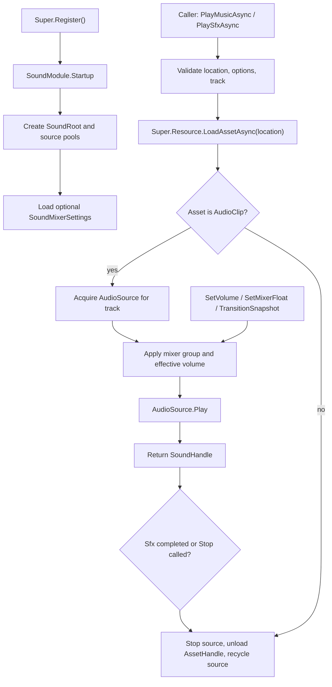

# sound-module design

## 0. 术语约定

| 术语 | 当前定义 | 本次约定 |
|---|---|---|
| `SoundModule` | `Assets/GameDeveloperKit/Runtime/Sound/SoundModule.cs` 中只有 `Startup()` / `Shutdown()` 的空骨架 | GameDeveloperKit 运行时声音入口，通过 `Super.Sound` 访问 |
| `Sound` | 代码中已存在 `GameDeveloperKit.Sound` 命名空间；项目内未发现同名业务类型 | 本 feature 继续使用 `SoundModule`，不另起 `AudioModule`，避免平行概念 |
| `SoundTrack` | 当前无定义 | 音轨分类，首版包含 Master / Music / Sfx / Ambience / Voice，用于音量和输出路由 |
| 背景音 / `Music` | 示例资源中有 `bgm.mp3`，但没有播放模块 | 长生命周期、通常同一时间一个主实例、支持循环和切换的背景音乐 |
| 音效 / `Sfx` | 示例资源中有 `opendoor.mp3`，但没有播放模块 | 短生命周期、允许并发、播放结束后自动回收的声音实例 |
| `SoundHandle` | 当前无定义 | 一次播放请求返回的控制柄，可停止、暂停、恢复、查询状态和释放资源 |
| `AudioMixer` | Unity 内置音频混合器资产；当前项目未发现 mixer 配置 | 音量、混响、低通等效果的首选承载点，通过暴露参数和 snapshot 驱动 |
| 混响等效果 | 用户口述需求 | 首版指 `AudioMixer` 暴露参数、`AudioMixerSnapshot` 切换和 `AudioSource.outputAudioMixerGroup` 路由，不做自研 DSP |

防冲突结论：

- 本次保留项目已有 `SoundModule` 命名，不改成 `AudioModule`。
- `SoundTrack` 表达框架级音轨分类；Unity API 里的 `AudioMixerGroup` 表达具体 mixer 输出通道，两者不是同一个概念。
- “混响等”不内置为固定枚举特效；首版用 mixer 参数名和 snapshot 名作为扩展点，避免把 Unity 音频效果类型硬编码进框架。

## 1. 决策与约束

### 需求摘要

做什么：补全运行时声音模块，让业务可以播放 / 切换背景音乐、播放一次性音效、按音轨调整音量，并通过 `AudioMixer` 参数或 snapshot 控制混响、低通、暂停 ducking 等效果。

为谁：需要在玩法、UI、场景流程中播放声音的业务开发者，以及需要统一调校音量和音效状态的框架开发者。

成功标准：

- 注册 `SoundModule` 后可以通过 `Super.Sound` 获取模块实例。
- `PlayMusicAsync(location, options)` 能加载 `AudioClip`、在 Music 音轨循环播放，并在切换背景音乐时释放上一首。
- `PlaySfxAsync(location, options)` 能加载并播放短音效，允许多个音效并发，播放结束后自动停止和释放。
- `SetVolume(track, volume)` 能单独控制 Master / Music / Sfx / Ambience / Voice 音轨音量，且范围明确。
- 声音播放可以路由到指定 `AudioMixerGroup`；未配置 mixer 时仍可使用 AudioSource volume 兜底播放。
- `SetMixerFloat(parameter, value)` / `TransitionSnapshot(name, duration)` 能驱动混响、低通、静音 ducking 等 mixer 效果。
- `Stop(handle)`、`StopTrack(track)`、`PauseTrack(track)`、`ResumeTrack(track)` 能按实例或音轨控制播放。
- `Shutdown()` 会停止全部声音、销毁运行时 AudioSource、释放由模块加载的资源句柄。

假设：

- 首版音频素材默认走 `Super.Resource.LoadAssetAsync(location)` 加载 `AudioClip`，不直接依赖 `Resources.Load`。
- 首版不做音量持久化；如果设置界面需要保存音量，由 Config / PlayerPrefs 等外部能力保存后调用 `SetVolume()` 恢复。
- 首版音乐同一时间每个 Music 音轨只保留一个主实例；音效允许并发，但需要可配置并发上限。
- 首版 3D 空间音效只提供 `PlaySfxAtAsync(location, position, options)` 这一层能力，不设计随 Transform 跟随和 occlusion。
- 首版不要求项目必须有 `AudioMixer`；有 mixer 时使用 mixer group 和 exposed parameter，没有 mixer 时用 AudioSource 自身音量。

### 明确不做

- 不新增 FMOD、Wwise、Master Audio 等第三方音频中间件。
- 不做音乐节拍同步、分轨音乐、程序化混音、动态谱面或音频可视化。
- 不做麦克风录制、语音聊天、TTS、字幕或对白系统。
- 不做音频资源导入设置、压缩策略、资源构建规则或 Sound Editor。
- 不把音量设置写入本地存档；持久化由外部配置模块或业务负责。
- 不改 `ResourceModule` 的资源加载 / 卸载语义。
- 不在运行时创建或修改 AudioMixer asset；只引用已有 mixer / group / snapshot / exposed parameter。

### 复杂度档位

走框架运行时模块默认档位，偏离点：

- `Robustness = L3`：声音模块会被 UI、玩法和场景反复调用，需要对无效 location、资源类型错误、音量越界、未注册资源模块、mixer 参数缺失、并发上限等失败路径给出明确语义。
- `Structure = modules`：当前 `SoundModule.cs` 是空骨架，但首版会引入音轨、句柄、选项、播放器池和 mixer 配置，必须拆成多个文件维护。
- `Performance = reasonable`：避免每个音效都创建新 GameObject；使用每音轨或池化 AudioSource，控制并发音效数量。
- `Readability = team`：公共 API 命名要稳定清楚，但不要求外部 SDK 级文档。
- `Concurrency = single-threaded orchestration`：公开 API 假定 Unity 主线程调用；异步加载使用 UniTask，不承诺跨线程安全。
- `Compatibility = backward-compatible draft`：已有 `SoundModule` 只有未实现生命周期，可补全公开 API，但不需要兼容已发布行为。

### 关键决策

1. SoundModule 是独立运行时模块，不挂在 UI 或 Resource 内部。
   - UI 可以调用 `Super.Sound.PlaySfxAsync()` 播放按钮音，但声音生命周期不依附 UI 模块。
   - Resource 只负责加载 `AudioClip`，SoundModule 负责播放、音轨、音量、效果和释放。

2. 音轨采用固定 enum + 可选 mixer group 映射。
   - `SoundTrack` 首版固定为 Master / Music / Sfx / Ambience / Voice。
   - `SoundMixerSettings` 保存每个 track 对应的 `AudioMixerGroup`、默认音量、音效并发上限和 mixer 参数名。
   - 没有 mixer group 时，模块仍能用 AudioSource 自身 volume 播放。

3. 背景音和音效走不同编排。
   - 背景音是长生命周期 singleton：同一 track 默认切歌时停止并释放上一首。
   - 音效是短生命周期实例：每次播放返回 `SoundHandle`，完成后自动释放和回收到池。
   - 这个分离能避免把音乐切换、音效并发和自动回收塞进同一个状态机。

4. 音量语义使用 0..1 线性输入，mixer 输出用 dB 映射。
   - 对外 API 接受 `float volume`，范围 `[0, 1]`。
   - 使用 mixer 时，模块把线性音量映射到 dB 参数；`0` 映射为静音下限，`1` 映射为 0dB。
   - 未使用 mixer 时，模块设置每个 AudioSource 的 effective volume。

5. 混响等效果通过 mixer parameter / snapshot 暴露。
   - API 不内置 `ReverbRoom`、`LowPass` 等 Unity 组件枚举。
   - 业务或音频配置声明参数名，例如 `MusicReverbLevel`、`SfxLowpassCutoff`。
   - 切换室内 / 战斗 / 暂停状态优先使用 snapshot，精调某个值使用 `SetMixerFloat()`。

6. SoundHandle 承载实例控制和资源生命周期引用。
   - 每次 `PlayMusicAsync` / `PlaySfxAsync` 返回 handle。
   - handle 可以 `Stop()`、`Pause()`、`Resume()`、查询 `Status` / `Track` / `Location`。
   - 模块保存 `AssetHandle` 并在停止或播放完成时调用 `Super.Resource.UnloadAsset(handle)`；业务不直接卸载由声音模块加载的 clip。

## 2. 名词与编排

### 2.1 名词层

#### 现状

- `Assets/GameDeveloperKit/Runtime/Sound/SoundModule.cs` 当前只有 `Startup()` / `Shutdown()`，并且直接抛 `NotImplementedException`。
- `Assets/GameDeveloperKit/Runtime/Super.cs` 当前没有 `Super.Sound` 入口。
- `Assets/StreamingAssets/manifest.json` 和 `Assets/StreamingAssets/sounds/1.0.4/manifest.json` 里已有 `bgm.mp3`、`opendoor.mp3` 这类声音资源条目。
- `ResourceModule.LoadAssetAsync(location)` 返回 `AssetHandle`，可通过 `GetAsset<AudioClip>()` 取得 Unity 资源；`UnloadAsset(handle)` 负责释放资源句柄。
- 项目当前没有 `AudioMixer` 配置文档或运行时声音架构记录。

#### 变化

公开契约目标：

```csharp
public sealed class SoundModule : GameModuleBase
{
    public override UniTask Startup();
    public override UniTask Shutdown();

    public UniTask<SoundHandle> PlayMusicAsync(string location, SoundPlayOptions options = null);
    public UniTask<SoundHandle> PlaySfxAsync(string location, SoundPlayOptions options = null);
    public UniTask<SoundHandle> PlaySfxAtAsync(string location, Vector3 position, SoundPlayOptions options = null);

    public void Stop(SoundHandle handle);
    public void StopTrack(SoundTrack track);
    public void PauseTrack(SoundTrack track);
    public void ResumeTrack(SoundTrack track);

    public void SetVolume(SoundTrack track, float volume);
    public float GetVolume(SoundTrack track);
    public bool SetMixerFloat(string parameter, float value);
    public bool TransitionSnapshot(string snapshotName, float duration);
}
```

音轨和播放选项：

```csharp
public enum SoundTrack
{
    Master,
    Music,
    Sfx,
    Ambience,
    Voice,
}

public sealed class SoundPlayOptions
{
    public SoundTrack Track { get; set; }
    public bool Loop { get; set; }
    public float Volume { get; set; }
    public float FadeIn { get; set; }
    public float FadeOut { get; set; }
    public int Priority { get; set; }
}
```

句柄和状态：

```csharp
public enum SoundStatus
{
    None,
    Loading,
    Playing,
    Paused,
    Stopped,
    Completed,
    Failed,
    Released,
}

public sealed class SoundHandle : IReference
{
    public string Location { get; }
    public SoundTrack Track { get; }
    public SoundStatus Status { get; }
    public float Progress { get; }

    public void Stop();
    public void Pause();
    public void Resume();
    public UniTask WaitForCompleteAsync();
    public void Release();
}
```

配置模型：

- `SoundMixerSettings`：ScriptableObject，首版通过 `Resources.Load<SoundMixerSettings>("SoundMixerSettings")` 可选加载。
- `SoundTrackMixerBinding`：track、AudioMixerGroup、volume parameter、默认音量、最大并发数。
- `SoundSnapshotBinding`：snapshot 名称和 `AudioMixerSnapshot` 引用。
- `SoundRuntimeSource`：内部模型，持有 `AudioSource`、`SoundHandle`、`AssetHandle`、`AudioClip`、track、是否 pooled。

接口示例：

```csharp
// 来源：Assets/GameDeveloperKit/Runtime/Sound/SoundModule.cs SoundModule
await Super.Sound.PlayMusicAsync("Assets/Simples/Sounds/bgm.mp3",
    new SoundPlayOptions { Track = SoundTrack.Music, Loop = true, Volume = 0.8f });

await Super.Sound.PlaySfxAsync("Assets/Simples/Sounds/opendoor.mp3",
    new SoundPlayOptions { Track = SoundTrack.Sfx, Volume = 1f });

Super.Sound.SetVolume(SoundTrack.Music, 0.4f);
Super.Sound.SetMixerFloat("SfxReverbLevel", -1200f);
Super.Sound.TransitionSnapshot("Cave", 0.25f);
```

### 2.2 编排层



#### 现状

- `SoundModule.Startup()` / `Shutdown()` 当前抛 `NotImplementedException`，注册模块会失败。
- 没有 `SoundRoot`、AudioSource 池、音轨状态、播放句柄、mixer 设置或自动回收流程。
- `Super` 只暴露 Event / Resource / File / Download / Operation 等模块入口，没有声音模块入口。
- 示例音频资源存在，但没有统一播放 API 使用它们。

#### 变化

1. Startup：
   - 可选加载 `SoundMixerSettings`；找不到配置时采用默认内存配置。
   - 创建持久 `GameDeveloperKit.SoundRoot` GameObject，并 `DontDestroyOnLoad`。
   - 为 Music / Ambience / Voice 创建常驻 AudioSource，为 Sfx 创建可增长但受上限控制的 AudioSource 池。
   - 初始化 track volume、active handle registry、source pool 和 snapshot lookup。

2. PlayMusicAsync：
   - 校验 location 非空、track 有效；默认 track 为 Music，默认 loop 为 true。
   - 如果同一 Music track 已有音乐，先按 fadeOut / 立即停止策略关闭旧 handle 并释放资源。
   - 通过 ResourceModule 加载 AudioClip；加载失败或类型不匹配时返回失败语义并释放 handle。
   - 绑定 mixer group、clip、loop、effective volume，播放后返回 handle。
   - 如果请求同一 location 且当前已在播放，首版返回当前 handle 或重启播放需二选一；默认设计倾向返回当前 handle，避免重复切歌。

3. PlaySfxAsync / PlaySfxAtAsync：
   - 校验 location 非空、track 默认 Sfx、音量范围有效。
   - 音效并发超过 track 上限时，按 priority 淘汰低优先级或拒绝新播放；首版默认淘汰最早的低优先级音效。
   - 加载 AudioClip，取得 pooled AudioSource，设置 spatialBlend / position 后播放。
   - 注册播放完成监控；自然播完后把 handle 标记为 Completed，卸载资源并回收 AudioSource。

4. Stop / StopTrack / PauseTrack / ResumeTrack：
   - `Stop(handle)` 只影响该实例；重复 Stop 幂等。
   - `StopTrack(track)` 停止该 track 下所有 active handles，Music / Ambience / Voice 也清空当前主实例。
   - Pause / Resume 只改变已播放实例的暂停状态，不影响后续新播放。

5. SetVolume / GetVolume：
   - 校验 volume 在 `[0, 1]`。
   - 更新 track volume，并立即刷新该 track 所有 AudioSource 的 effective volume。
   - 如果 track 绑定 mixer exposed parameter，则同步写入 mixer dB；没有参数时只调 AudioSource。
   - Master 音量影响所有 track 的最终有效音量。

6. SetMixerFloat / TransitionSnapshot：
   - `SetMixerFloat(parameter, value)` 直接尝试写 mixer exposed parameter，返回是否成功。
   - `TransitionSnapshot(snapshotName, duration)` 从配置查找 snapshot 并调用 Unity snapshot transition；找不到 snapshot 返回 false，不抛异常。
   - 这条路径用于混响、低通、暂停 ducking、场景氛围切换等效果。

7. Shutdown：
   - 停止全部 active handles。
   - 卸载所有由模块加载并仍持有的 `AssetHandle`。
   - 清空 source pool、registry、track state。
   - 销毁 SoundRoot。

#### 流程级约束

- 错误语义：location 为 null 抛 `ArgumentNullException`；空白 location 抛 `ArgumentException`；资源模块未注册、加载失败、加载结果不是 `AudioClip` 抛或记录 `GameException`，不能留下半播放实例。
- 幂等性：重复 Stop / Release 不重复卸载资源；Shutdown 多次调用最终无残留；StopTrack 对没有播放实例的 track 是 no-op。
- 顺序：AudioClip 加载成功后才占用可播放 AudioSource；播放失败必须释放已加载资源；音效自然完成后先标记 Completed 再释放资源和回收 source。
- 并发：公开 API 假定主线程调用；同一 location 的多次 Sfx 播放允许并发，Music 同 track 不允许并发主实例。
- 资源：SoundModule 只卸载自己通过 `LoadAssetAsync` 获得的 handle，不接管外部直接塞进 AudioSource 的 clip。
- 扩展点：后续可在 `SoundPlayOptions` 增加 pitch、stereo pan、spatial blend、follow transform、fade curve、bus ducking；首版不把这些都做完。
- 可观测点：handle status、track active count、当前音量、mixer 设置成功 / 失败返回值，是首版可诊断入口。

### 2.3 挂载点清单

1. `Super.Sound`：运行时访问声音模块的唯一框架入口。
2. `Assets/GameDeveloperKit/Runtime/Sound/`：声音模块公开契约、句柄、音轨、设置和内部播放编排的集中落点。
3. `SoundMixerSettings` ScriptableObject：可选配置入口，用于声明 mixer、track 到 mixer group 的映射、音量参数、snapshot 和并发上限。
4. `GameDeveloperKit.SoundRoot`：运行时 AudioSource 和播放池的场景挂载点。
5. `Super.Resource.LoadAssetAsync` / `UnloadAsset` 调用：AudioClip 资源生命周期接入点。

拔除沙盘：删除 `Runtime/Sound/`、移除 `Super.Sound`、删除声音 feature spec / 架构记录后，运行时统一声音播放能力应消失；示例音频资源仍只是普通资源，不再被框架统一播放。

### 2.4 推进策略

1. 生命周期骨架：让 SoundModule 可注册、可关闭，创建 / 销毁 SoundRoot。
   - 退出信号：`Super.Register<SoundModule>()` 不再抛 `NotImplementedException`，Shutdown 后无 SoundRoot 残留。
2. 名词契约：补齐 `SoundTrack`、`SoundStatus`、`SoundPlayOptions`、`SoundHandle` 和可选 mixer settings。
   - 退出信号：公开 API 能表达背景音、音效、音轨音量和 mixer 效果入口。
3. 播放源编排：建立 track state、Music 常驻源、Sfx source pool 和资源句柄记录。
   - 退出信号：模块能取得 AudioSource、绑定 track、记录 active handles。
4. AudioClip 加载与背景音播放：接入 ResourceModule 加载 AudioClip，实现 PlayMusicAsync 和切歌释放。
   - 退出信号：有效 AudioClip location 可以循环播放；切换音乐会停止并释放旧音乐。
5. 音效播放与自动回收：实现 PlaySfxAsync / PlaySfxAtAsync、并发上限、完成监控和 source 回收。
   - 退出信号：短音效可并发播放并在结束后释放资源，不留下 active handle。
6. 音量与 mixer 效果：实现 SetVolume / GetVolume / SetMixerFloat / TransitionSnapshot。
   - 退出信号：单独调整 Music / Sfx 音量可立即影响播放中实例；mixer 参数和 snapshot 路径有明确返回结果。
7. 停止、暂停和 Shutdown 清理：覆盖 Stop、StopTrack、PauseTrack、ResumeTrack 和模块退出。
   - 退出信号：按实例 / 音轨控制播放可靠，Shutdown 后资源句柄和 AudioSource 清空。
8. 验证覆盖：覆盖正常播放、边界输入、资源错误、mixer 缺失和并发上限。
   - 退出信号：Runtime 编译通过，关键验收契约有可观察证据。

### 2.5 结构健康度与微重构

#### 评估

- compound convention 检索：未命中 “Sound / Audio / 目录组织 / 命名 / 文件归属” 相关 convention。
- 文件级：`Assets/GameDeveloperKit/Runtime/Sound/SoundModule.cs` 当前约 15 行，只有未实现骨架，不存在胖文件问题；但继续把音轨、句柄、settings、source pool 都写进去会形成职责混杂。
- 文件级：`Assets/GameDeveloperKit/Runtime/Super.cs` 是模块入口聚合点，本次只新增 `Super.Sound`，不需要拆分。
- 目录级：`Assets/GameDeveloperKit/Runtime/Sound/` 当前只有 `SoundModule.cs`，不拥挤；本次新增预计 6-9 个文件，先平铺即可。

#### 结论：不做微重构

本次不做单独的只搬不改行为微重构，原因：当前 Sound 目录没有可搬的既有行为，新增名词应直接以新文件落入 `Runtime/Sound/`；`SoundModule.cs` 保持编排入口，句柄、选项、settings、内部 source record 不塞回同一文件。

#### 不做目录重组

Sound 目录当前不挤，首版平铺比提前分 `Internal/`、`Settings/`、`Handles/` 更轻。若实现后文件继续增长，再按稳定命名模式另走 refactor 或 convention。

#### 超出范围的观察

- `Super.TryGetValue<T>()` 当前在未注册时创建新模块但不写回 `_modules`，且始终返回 true；这和本 feature 无直接关系，建议后续单独走 issue / refactor。
- `AssetUtility.ReferenceHandle.OnDestroy()` 调用异步 `Super.Resource.UnloadAsset(handle)` 但未 await；声音模块不要复用这条生命周期释放方式，需由 SoundModule 自己集中释放。

## 3. 验收契约

| 编号 | 输入 / 触发 | 期望可观察结果 |
|---|---|---|
| N1 | `Super.Register<SoundModule>()` 后访问 `Super.Sound` | 返回已注册 `SoundModule` 实例 |
| N2 | Startup 完成 | 场景中存在 `GameDeveloperKit.SoundRoot`，并持有可用于播放的 AudioSource 结构 |
| N3 | 调用 `PlayMusicAsync("Assets/Simples/Sounds/bgm.mp3")` | 通过资源模块加载 AudioClip，Music track 开始循环播放，返回 Playing 状态 handle |
| N4 | Music 正在播放 A，再调用 `PlayMusicAsync(B)` | A 被停止并释放，B 成为 Music 当前播放实例 |
| N5 | 调用 `PlaySfxAsync("Assets/Simples/Sounds/opendoor.mp3")` | Sfx track 播放一次音效，播放结束后 handle 变为 Completed 且资源释放 |
| N6 | 连续多次播放同一 Sfx | 允许多个音效实例并发，未超过配置上限时不会互相打断 |
| N7 | Sfx 并发数超过上限 | 按 priority / 最早低优先级策略淘汰旧实例，或返回明确失败；不能无限创建 AudioSource |
| N8 | 调用 `SetVolume(SoundTrack.Music, 0.25f)` | Music track 播放中实例音量立即变小，Sfx track 不受直接影响 |
| N9 | 调用 `SetVolume(SoundTrack.Master, 0f)` | 所有 track 最终输出静音，但 active handles 状态仍保持可恢复 |
| N10 | 配置了 mixer exposed parameter 后调用 `SetVolume(SoundTrack.Sfx, 0.5f)` | 对应 mixer 参数被写入 dB 值，Sfx 输出变化 |
| N11 | 调用 `SetMixerFloat("SfxReverbLevel", value)` | 参数存在时返回 true 并写入；参数不存在时返回 false，不破坏播放 |
| N12 | 调用 `TransitionSnapshot("Cave", 0.25f)` | 已配置 snapshot 时触发过渡；未配置时返回 false |
| N13 | 调用 `Stop(handle)` | 该实例停止播放，资源句柄释放，重复 Stop 不抛异常 |
| N14 | 调用 `StopTrack(SoundTrack.Sfx)` | 所有 Sfx 实例停止并释放，Music 不受影响 |
| N15 | 调用 `PauseTrack(SoundTrack.Music)` 后再 `ResumeTrack(SoundTrack.Music)` | Music 暂停后恢复到继续播放状态 |
| N16 | 调用 `Shutdown()` 时存在多个播放实例 | 全部实例停止，所有由模块持有的 AssetHandle 被卸载，SoundRoot 被销毁 |
| B1 | location 为 null | 播放 API 抛 `ArgumentNullException` |
| B2 | location 为空白字符串 | 播放 API 抛 `ArgumentException` |
| B3 | `SetVolume(track, -0.1f)` 或 `SetVolume(track, 1.1f)` | 抛 `ArgumentOutOfRangeException` 或明确拒绝，不修改当前音量 |
| B4 | 未配置 `SoundMixerSettings` | 背景音和音效仍可通过 AudioSource volume 播放 |
| E1 | 资源模块未注册或资源加载失败 | 播放 API 失败并说明资源不可用，不创建残留 AudioSource 播放实例 |
| E2 | location 加载到的资源不是 AudioClip | 播放 API 失败，已获得的 AssetHandle 被释放 |
| E3 | AudioSource.Play 过程中发生异常 | handle 进入 Failed 或向上抛 `GameException`，资源不泄漏 |

### 明确不做的反向核对项

- 不新增 FMOD、Wwise、Master Audio 或其他第三方音频包。
- 不出现麦克风、语音聊天、TTS、字幕、音频可视化相关公开 API。
- 不修改 `ResourceModule` / `ModeBase` / `ProviderBase` 的资源加载和卸载 API。
- 不在 SoundModule 内写入 PlayerPrefs、Config 文件或任何音量持久化逻辑。
- 不运行时创建或修改 AudioMixer asset，只引用已有 mixer / group / snapshot / exposed parameter。
- 不实现 Sound Editor、资源构建规则或 AudioImporter 设置修改。

## 4. 与项目级架构文档的关系

验收通过后需要更新 `.codestable/architecture/ARCHITECTURE.md`：

- 新增 Sound 子系统：入口 `SoundModule`、访问方式 `Super.Sound`、核心类型 `SoundTrack` / `SoundHandle` / `SoundPlayOptions` / `SoundMixerSettings`。
- 记录 SoundModule 依赖 ResourceModule 加载 AudioClip，并由 SoundModule 集中释放 `AssetHandle`。
- 记录音轨模型：Master / Music / Sfx / Ambience / Voice，Music 默认单实例，Sfx 默认池化并发。
- 记录 mixer 扩展方式：通过 AudioMixerGroup 路由、exposed parameter 和 snapshot 控制混响等效果。
- 记录首版不做音量持久化、音频中间件、麦克风 / 语音聊天、复杂音乐同步和 Sound Editor。
