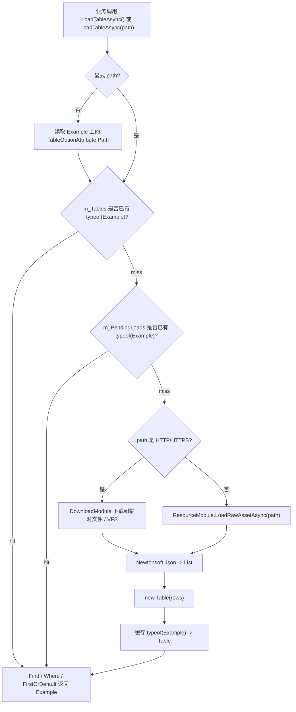

# config-table-row-model design

## 0. 术语约定

| 术语 | 定义 | 防冲突结论 |
|---|---|---|
| 配置行类型 / row type | 一张配置表的一行数据类型，例如 `Example` | 当前代码已有 `IConfig`，本设计让 `Example : IConfig` 成为唯一业务数据类型 |
| `Table<Example>` | 包含多行 `Example` 的只读表容器 | 不再生成 `Example : Table<Example.Data>` 这种表子类 |
| `IConfig` | 配置行类型必须实现的契约，当前暴露 `Key key { get; }` | 运行时主键查询只依赖该契约，不再通过反射扫描 `[ConfigKey]` |
| `TableOptionAttribute` | 标在配置行类型上的默认路径声明 | 保留为默认 path 来源；`LoadTableAsync<Example>(path)` 可覆盖 |
| path | 配置 JSON 的定位字符串 | 可是 ResourceModule raw asset 寻址地址，也可是 HTTP/HTTPS URL |

防冲突结论：

- 旧设计 `.codestable/features/2026-05-28-config-module/config-module-design.md` 中的 `ConfigSourceDefinition`、多 serializer、`ConfigTable<TRow>` 已不再符合当前方向；本设计作为后续实现输入覆盖它的配置表模型部分。
- 当前代码目录已经收敛到 `ConfigModule.cs`、`Table.cs`、`IConfig.cs`、`ConfigKeyAttribute.cs`，不再保留 `Internal/` 和 `Serializers/` 实现目录。
- `Table<Example>` 中的泛型参数表示行类型，不表示表子类；后续文档和 API 命名都按这个语义理解。

## 1. 决策与约束

### 需求摘要

做什么：把 Config 模块从“生成表类继承 `Table<Data>`”收敛为“生成配置行类 `Example : IConfig`，运行时返回 `Table<Example>`”。配置表路径通过 `[TableOption(path)]` 声明，也允许调用 `LoadTableAsync<Example>(path)` 临时覆盖。加载完成后，业务可通过 `Super.Config.Find<Example>()`、`Where<Example>()`、`FirstOrDefault<Example>()` 或 `Table<Example>` 实例查询并直接得到 `Example`。

为谁：生成配置代码的工具链、玩法开发者，以及维护 Config 模块运行时 API 的框架开发者。

成功标准：

- 配置行类型 `Example : IConfig` 可以作为唯一生成类型，不需要再生成 `Example : Table<Example.Data>`。
- `await Super.Config.LoadTableAsync<Example>()` 使用 `Example` 上的 `[TableOption]` 路径加载 JSON。
- `await Super.Config.LoadTableAsync<Example>(path)` 使用显式 path 加载 JSON，并仍缓存为 `Table<Example>`。
- `Super.Config.Find<Example>(x => x.xx == xx)` 返回 `Example`；`Where<Example>()` 返回 `IEnumerable<Example>`；`FirstOrDefault<Example>()` 返回 `Example`。
- Resource path 走 `ResourceModule.LoadRawAssetAsync(path)`；HTTP/HTTPS path 走 `DownloadModule` 下载后读取。
- 不再有 `Config/Internal`、`Config/Serializers` 运行时代码，也不再有 `ConfigSourceDefinition` / `ConfigSettings` / `IConfigSerializer`。

### 明确不做

- 不恢复 XML / CSV / ScriptableObject serializer。
- 不恢复 `ConfigSourceDefinition`、`ConfigSettings`、source registry 或 serializer registry。
- 不生成或要求 `Example.Data` 嵌套类型。
- 不生成或要求 `Example : Table<Example.Data>` 表子类。
- 不提供运行时配置编辑、写回、热更版本比对或差量补丁。
- 不在 Config 模块内自建资源寻址系统；非 URL path 仍交给 ResourceModule。
- 不要求 `Find<Example>` 在表未加载时自动加载；查询只面向已加载表。

### 复杂度档位

- `Robustness = L3`：JSON 和网络/资源路径都是外部输入，必须明确处理空 path、缺 TableOption、资源缺失、下载失败、JSON 解析失败和重复 key。
- `Compatibility = breaking-internal-api`：当前 config API 仍在设计收敛期，允许移除旧 source/serializer 模型；对外统一成 `Table<Example>` 后再稳定。
- `Concurrency = single-flight`：同一 `Example` 类型并发加载只触发一次加载，后续 await 同一 pending task。
- `Dependency = resource-download`：非 URL path 依赖 ResourceModule；HTTP/HTTPS URL 依赖 DownloadModule；本地文件 fallback 只作为测试/开发兜底，不作为核心设计入口。

### 关键决策

1. 泛型参数统一表示配置行类型。
   - 采用：`LoadTableAsync<Example>() -> Table<Example>`。
   - 拒绝：`LoadTableAsync<ExampleTable>() -> ExampleTable : Table<ExampleTable.Data>`。
   - 原因：生成器只需生成一个业务可直接使用的数据类型，查询返回值就是 `Example`，不再多一层 `Data` 命名。

2. 主键契约由 `IConfig.key` 提供。
   - Runtime 不再反射扫描 `[ConfigKey]` 来建立索引。
   - 生成器或手写类型负责实现 `IConfig.key`，例如 `new Key(nameof(Id), Id)`。
   - `[ConfigKey]` 如果继续存在，只作为生成器输入或兼容标记，不进入 ConfigModule 的运行时编排。

3. `TableOptionAttribute` 标在行类型上。
   - `LoadTableAsync<Example>()` 读取 `typeof(Example).GetCustomAttribute<TableOptionAttribute>()`。
   - `LoadTableAsync<Example>(path)` 显式 path 优先，不要求行类型有 attribute。

4. 查询 API 以行类型为泛型。
   - 模块级：`Find<Example>` / `Where<Example>` / `FirstOrDefault<Example>`。
   - 表实例级：`Table<Example>.Find` / `Where` / `FirstOrDefault`。
   - 缓存 key 使用 `typeof(Example)`，保证同一行类型只有一张已加载表；需要多张同结构表时后续另起 feature 设计命名表。

## 2. 名词与编排

### 2.1 名词层

#### 现状

- `Assets/GameDeveloperKit/Runtime/Config/IConfig.cs`：当前定义 `IConfig` 和 `Key`，`IConfig.key` 是配置行主键入口。
- `Assets/GameDeveloperKit/Runtime/Config/Table.cs`：当前 `Table<TRow> where TRow : IConfig` 保存 `IReadOnlyList<TRow>`，提供 `GetRowByKey`、`Find`、`Where`、`FirstOrDefault`。
- `Assets/GameDeveloperKit/Runtime/Config/ConfigModule.cs`：当前缓存按 `Type` 存储，`LoadTableAsync<TRow>() where TRow : IConfig` 读取 `TableOptionAttribute` 或显式 path，反序列化 JSON 为 `List<TRow>` 后包装成 `Table<TRow>`。
- `Assets/GameDeveloperKit/Runtime/Config/ConfigKeyAttribute.cs`：当前同时包含 `[ConfigKey]` 和 `[TableOption]`；ConfigModule 当前不依赖 `[ConfigKey]`。

#### 变化

- `Example`：明确作为配置行类型，而不是表类型。
  ```csharp
  [TableOption("Configs/example.json")]
  public sealed class Example : IConfig
  {
      public int Id;
      public string Name;

      public Key key => new Key(nameof(Id), Id);
  }
  ```

- `Table<Example>`：作为运行时容器返回。
  ```csharp
  Table<Example> table = await Super.Config.LoadTableAsync<Example>();
  Example row = table.Find(x => x.Id == 1001);
  ```

- `ConfigModule` 公开 API 目标：
  ```csharp
  public UniTask<Table<TRow>> LoadTableAsync<TRow>() where TRow : IConfig;
  public UniTask<Table<TRow>> LoadTableAsync<TRow>(string path) where TRow : IConfig;

  public Table<TRow> GetTable<TRow>() where TRow : IConfig;
  public bool TryGetTable<TRow>(out Table<TRow> table) where TRow : IConfig;
  public void Unload<TRow>() where TRow : IConfig;

  public TRow Find<TRow>(Func<TRow, bool> predicate) where TRow : IConfig;
  public IEnumerable<TRow> Where<TRow>(Func<TRow, bool> predicate) where TRow : IConfig;
  public TRow FirstOrDefault<TRow>() where TRow : IConfig;
  public TRow FirstOrDefault<TRow>(Func<TRow, bool> predicate) where TRow : IConfig;
  ```

- `ConfigKeyAttribute`：运行时不再需要它来查询；设计目标是删除，或仅在生成器还未迁移时保留但标为生成期输入。实现阶段需要按当前生成链路确认是否已有依赖。

### 2.2 编排层



#### 现状

- 当前 ConfigModule 已按 `typeof(TRow)` 做缓存和 single-flight，但实现里还存在路径判断粗糙、HTTP 下载后文件落点和 Resource fallback 语义需要收紧的问题。
- 当前 Table 查询是线性遍历，`GetRowByKey` 依赖 `row.key.Match(key)`；没有额外 key index。
- 当前 `GetTable<TRow>()` / `TryGetTable<TRow>()` 应返回 `Table<TRow>`，不应把缓存对象强转成 `TRow`。

#### 变化

1. 加载入口：
   - `LoadTableAsync<Example>()`：从 `[TableOption]` 取 path；缺失 attribute 抛 `GameException`。
   - `LoadTableAsync<Example>(path)`：校验 path 非空，直接使用显式 path。

2. 来源分支：
   - HTTP/HTTPS path：调用 DownloadModule；下载成功后读取下载文件内容。若需要持久化到 VFS，应作为下载模块 / 文件模块的明确协作，不在 ConfigModule 里用 URL 当 VFS path 读写。
   - 非 URL path：调用 ResourceModule 的 raw asset 加载；资源缺失或加载失败抛 `GameException`。
   - 测试兜底：实现阶段可保留本地文件读取用于 Runtime tests，但设计语义仍以 ResourceModule / DownloadModule 为主。

3. 反序列化：
   - 只支持 JSON array 或 `{ "rows": [...] }` wrapper。
   - 反序列化目标固定为 `List<Example>`。
   - 空 JSON、格式错误、反序列化返回 null 都不能缓存半成品表。

4. 查询：
   - 模块级查询要求表已加载；`Find/Where/FirstOrDefault` 未加载时抛 `GameException`，避免配置缺加载被静默吞掉。
   - 表实例查询返回 `Example`，不返回 `Example.Data`。

#### 流程级约束

- 错误语义：null path 抛 `ArgumentNullException`，空白 path 抛 `ArgumentException`；缺 attribute、资源缺失、下载失败、JSON 解析失败抛 `GameException`。
- 幂等性：同一 `Example` 类型重复加载命中缓存；`Unload<Example>()` 后再次加载重新读取。
- 并发：同一 `Example` 类型并发加载共享 pending；失败时清掉 pending 且不写入缓存。
- 缓存边界：缓存 key 是 `typeof(Example)`；显式 path 不改变缓存 key，已加载后再次传不同 path 仍返回缓存，除非先 `Unload<Example>()`。
- 可观测点：加载失败信息包含 row type 和 path；查询未加载时包含 row type。

### 2.3 挂载点清单

1. `TableOptionAttribute`：`Assets/GameDeveloperKit/Runtime/Config/ConfigKeyAttribute.cs` — 默认配置路径挂载点；删除后 `LoadTableAsync<Example>()` 不可用。
2. `IConfig`：`Assets/GameDeveloperKit/Runtime/Config/IConfig.cs` — 配置行类型运行时契约；删除后 `Table<Example>` 无法统一 key 查询。
3. `ConfigModule`：通过 `Super.Config` 暴露 — 加载、缓存、模块级查询入口；删除后业务只能自行加载 JSON。
4. `Table<TRow>`：`Assets/GameDeveloperKit/Runtime/Config/Table.cs` — 行集合查询容器；删除后加载结果没有统一查询表面。

拔除沙盘：移除这四个挂载点后，运行时配置表能力在系统视角应消失；业务仍可直接使用 Newtonsoft.Json 手写读取，但不再通过 GameDeveloperKit Config 模块。

### 2.4 推进策略

1. 名词契约收敛：确认 `IConfig`、`Key`、`TableOptionAttribute`、`Table<TRow>` 的职责，删除或降级 `ConfigKeyAttribute`。
   - 退出信号：代码中没有 `Example : Table<Example.Data>` 示例或测试。
2. 加载 API 收敛：`ConfigModule` 只保留 `LoadTableAsync<TRow>()` / `LoadTableAsync<TRow>(path)` 这两类入口。
   - 退出信号：所有测试和调用点都以配置行类型作为泛型参数。
3. 来源编排收紧：HTTP/HTTPS 走 DownloadModule，非 URL path 走 ResourceModule；本地文件读取只作为测试兜底。
   - 退出信号：错误消息能区分下载失败、资源缺失和 JSON 解析失败。
4. 查询语义收敛：模块级和表实例级查询都返回 `TRow`。
   - 退出信号：`Super.Config.Find<Example>(...)`、`Where<Example>(...)`、`FirstOrDefault<Example>(...)` 编译并返回 `Example`。
5. 缓存和并发校验：按 `typeof(TRow)` 处理 cache / pending / unload。
   - 退出信号：同类型并发加载只读一次；`Unload<Example>()` 后可重新加载新内容。
6. 验证覆盖：更新 ConfigModule tests 到 `Table<Example>` 模型。
   - 退出信号：Runtime 编译通过，关键验收场景均有测试或可观察证据。

### 2.5 结构健康度与微重构

##### 评估

- compound convention 检索：未命中 Config 目录组织或命名约定类 decision。
- 文件级 — `Assets/GameDeveloperKit/Runtime/Config/ConfigModule.cs`：当前承担 path 解析、资源/下载编排、JSON 解析、cache / pending、查询转发；职责偏多但文件仍是单模块编排入口。本 feature 的目标就是收敛 API 语义，暂不拆文件。
- 文件级 — `Assets/GameDeveloperKit/Runtime/Config/Table.cs`：只承载 rows 和查询，职责集中。
- 文件级 — `Assets/GameDeveloperKit/Runtime/Config/IConfig.cs`：包含 `Key` 和 `IConfig`，体量小，职责相关。
- 目录级 — `Assets/GameDeveloperKit/Runtime/Config/`：当前只有 4 个源码文件，不拥挤；本 feature 不新增目录。

##### 结论：不做微重构

本次不做拆文件或目录重组。原因：用户目标是设计语义收敛，不是结构搬迁；当前 Config 目录已经删除 `Internal/` / `Serializers/`，继续拆会把设计焦点从 `Table<Example>` 模型转移到组织细节。

##### 超出范围的观察

- `ConfigModule.cs` 未来如果继续加入资源 fallback、网络缓存、版本控制或多表同结构能力，会重新变胖；这些应另走 `cs-refactor` 或独立 feature，不阻塞本次 API 模型收敛。

## 3. 验收契约

| 编号 | 输入 / 触发 | 期望可观察结果 |
|---|---|---|
| N1 | 定义 `Example : IConfig` 且标 `[TableOption("Configs/example.json")]`，调用 `LoadTableAsync<Example>()` | 返回 `Table<Example>`，rows 类型为 `Example` |
| N2 | 调用 `LoadTableAsync<Example>(path)` | 使用显式 path 加载，不要求 `Example` 有 TableOption |
| N3 | JSON root 是 array | 反序列化为 `List<Example>` 并缓存为 `Table<Example>` |
| N4 | JSON root 是 `{ "rows": [...] }` | 反序列化 wrapper 内 rows |
| N5 | 表已加载后调用 `Super.Config.Find<Example>(x => x.Id == 1)` | 返回匹配的 `Example` |
| N6 | 表已加载后调用 `Super.Config.Where<Example>(predicate)` | 返回 `IEnumerable<Example>`，只包含匹配行 |
| N7 | 表已加载后调用 `Super.Config.FirstOrDefault<Example>()` | 返回第一行或 default |
| N8 | 同一 `Example` 连续加载两次 | 第二次返回缓存表，不重复读取 JSON |
| N9 | 同一 `Example` 并发加载两次 | 两次 await 共享同一个 pending load |
| N10 | `Unload<Example>()` 后再次加载 | 重新读取 JSON，并得到新的 `Table<Example>` |
| B1 | `LoadTableAsync<Example>()` 但 `Example` 无 `[TableOption]` | 抛 `GameException`，消息包含 `Example` |
| B2 | `LoadTableAsync<Example>(null)` / 空白 path | 分别抛 `ArgumentNullException` / `ArgumentException` |
| B3 | Resource path 不存在 | 抛 `GameException`，消息包含 path 和 `Example` |
| B4 | HTTP/HTTPS 下载失败 | 抛 `GameException`，消息包含 URL 和下载错误 |
| B5 | JSON 格式错误 | 抛 `GameException`，不缓存半成品表 |
| B6 | 查询未加载的 `Example` | 抛 `GameException`，消息包含 `Example` |

### 明确不做的反向核对项

- 代码和测试中不应出现新的 `Example : Table<Example.Data>`。
- 不应新增 `ConfigSourceDefinition`、`ConfigSettings`、`IConfigSerializer`、`ConfigFormat` 或 serializer registry。
- 不应新增 XML / CSV / ScriptableObject 解析路径。
- 不应把 `Find<Example>` 设计成返回 `Example.Data`。
- 不应要求业务传表名 string 来区分同一行类型的表。

## 4. 与项目级架构文档的关系

验收通过后需要更新 `.codestable/architecture/ARCHITECTURE.md`：

- 新增或修正 Config 模块现状：`ConfigModule` 通过 `Super.Config` 提供 JSON 配置表加载和查询。
- 记录核心模型：`Example : IConfig` 是配置行类型，`Table<Example>` 是运行时表容器。
- 记录加载来源：ResourceModule raw asset path 或 DownloadModule HTTP/HTTPS URL。
- 记录约束：只支持 JSON；不支持 XML/CSV/SO serializer；不使用 `ConfigSourceDefinition` / settings registry；缓存按 row type。
