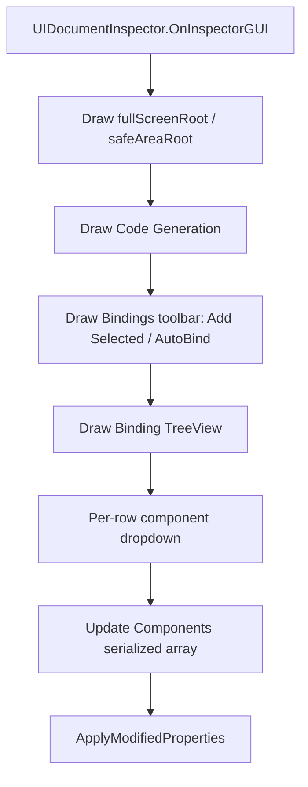

# uidocument-inspector-bindings design

## 0. 术语约定

| 术语 | 当前定义 | 本次约定 |
|---|---|---|
| `GameDeveloperKit.UI.UIDocument` | `Assets/GameDeveloperKit/Runtime/UI/UIDocument.cs` 中的 uGUI prefab 绑定文档 | 本次继续指 GameDeveloperKit 运行时 UI 绑定文档，不指 `UnityEngine.UIElements.UIDocument` |
| Binding / 绑定条目 | `UIBindMapping`，包含 `Name`、`Target`、`Components` | 一个可生成代码的目标 GameObject 绑定；`Name` 是运行时查询 key，也是组件字段名的后缀来源 |
| Component Binding / 组件绑定 | 当前是 `UIComponentBindMapping`，包含 `Name`、`TypeName` | 本次改为直接保存 `Component[]`；组件不再单独命名，生成字段名由组件类型前缀 + binding 名称后缀自动得到 |
| AutoBind | 当前不存在 | Inspector 操作：扫描当前 document 的所有子节点，把名称以 `b_` 开头的 GameObject 追加到绑定列表 |
| 组件多选下拉 | 当前用每个组件一行 `ToggleLeft` | 一个下拉菜单中用勾选项选择多个组件类型，更新 `Components` 数组 |
| TreeView 绑定列表 | 当前 `DrawMappings()` 平铺循环绘制所有 binding | 使用 Unity Editor `TreeView` 只呈现绑定列表中的目标；每行右侧直接显示组件绑定下拉 |

防冲突结论：

- 代码里没有现成的 `AutoBind`、绑定分组或 UIDocument 绑定 TreeView 实现。
- `UIDocument` 命名已在既有 UI module design 中记录和 UI Toolkit 概念冲突，本 feature 不做重命名。
- `TreeView` 指 Editor Inspector 内的 Unity Editor 树列表能力，不是运行时 UI Toolkit `TreeView`。

## 1. 决策与约束

### 需求摘要

做什么：改进 `UIDocumentInspector`，让 UI 维护者可以从 prefab 子节点自动生成绑定候选，用多选下拉选择组件，由生成器按 `btn_example` / `text_example` 这类规则生成组件字段名，在绑定较多时仍能先看到代码生成入口，并用 TreeView 结构替代平铺绑定列表。

为谁：维护 uGUI prefab、绑定 Button / Image / Text 等组件并生成窗口代码的 UI 开发者和框架维护者。

成功标准：

- Inspector 顶部显示 `Code Generation` 区域，绑定条目很多时不用先滚过绑定列表才能生成代码。
- 点击 `AutoBind` 后，当前 `UIDocument` 所在 GameObject 的所有子孙节点中，名称以 `b_` 开头的 GameObject 会进入绑定列表。
- AutoBind 新增条目的 `Name` 初始化为目标 GameObject 名称，例如 `b_CloseButton`。
- 手动添加绑定后，选择目标 GameObject 时如果绑定 `Name` 为空，也自动初始化为目标 GameObject 名称，用户后续仍可编辑。
- 组件选择从多行 Toggle 改为一个可多选下拉，选中项同步到 `Components`，组件自身不再提供字段名输入。
- 对名为 `b_example` 的绑定目标，选择 `Button` 生成字段 `btn_example`，选择 `Text` / TMP 文本组件生成字段 `text_example`。
- 绑定列表用 TreeView 呈现为类似 Unity Hierarchy 的层级树，但只显示已经在绑定列表中的目标；每个绑定行右侧直接显示组件绑定摘要和下拉入口，不再需要下方详情区。
- 生成器继续读取 `UIDocument.Mappings` 并生成强类型 model 字段；旧 prefab 的外层绑定条目保留，组件选择需要按新 `Component[]` 结构重新保存或后续迁移。

### 明确不做

- 不保留 `UIComponentBindMapping`；本次允许把 `UIBindMapping.Components` 从 `UIComponentBindMapping[]` 简化为 `Component[]`。
- 不在本次实现持久化“绑定组”数据；TreeView 的分组能力先作为 Editor 展示结构预留。
- 不自动选择组件类型；AutoBind 只创建绑定条目，组件仍由用户通过多选下拉选择。
- 不改变 `UIDocumentGenerator` 的四件套生成结构、`UIOption` 语义或运行时窗口生命周期。
- 不支持同一 binding 下多个组件生成同一个字段名；例如同一目标上两个文本组件如果都会生成 `text_example`，生成阶段应明确失败。
- 不改成完整 UI 设计器，不做 runtime UI Toolkit 或 Resource Editor 集成。

### 复杂度档位

走项目内部 Editor 工具默认档位，偏离点：

- `Compatibility = controlled serialized schema change`：`mappings` 外层仍保留，但 `Components` 内层从 `UIComponentBindMapping[]` 改为 `Component[]`；已有旧 prefab 需要重新选择组件或后续单独做迁移。
- `Structure = functions/modules`：TreeView 和组件多选下拉会让 Inspector 逻辑明显增多，允许新增 Editor-only 辅助类型承载视图状态，但不引入新依赖。
- `Robustness = L2`：处理目标为空、重复 AutoBind、缺失组件、重复字段名提示等预期错误；非预期 Unity 序列化异常继续向上暴露或由 Unity Inspector 显示。

### 关键决策

1. 简化组件绑定 schema。
   - `UIDocument.Mappings` 仍是生成器和运行时查询的唯一数据源。
   - `UIBindMapping.Components` 改为直接保存 `Component[]`，不再通过 `TypeName` 字符串描述组件类型。
   - 删除 `UIComponentBindMapping` 后，组件没有独立命名；字段名由生成器统一推导。
   - TreeView 只是 Editor projection，每一行映射回 `mappings` 的数组下标。

2. AutoBind 是幂等追加，不是 destructive sync。
   - 扫描范围：当前 `UIDocument` GameObject 的子孙 `Transform`，包含 inactive 子节点，排除 document 自身。
   - 匹配规则：`gameObject.name.StartsWith("b_", StringComparison.Ordinal)`，大小写按 Unity 对象名精确匹配。
   - 已存在同一 `Target` 的绑定时不重复添加；如果已有绑定 `Name` 为空，可补成目标名称。
   - 不删除已经不再匹配 `b_` 的手工绑定，避免误删用户配置。

3. 绑定名自动初始化只在“用户还没填名”时发生。
   - AutoBind 新条目直接写 `Name = target.name`。
   - 手动 Add 后如果用户选择 Target，且 `Name` 为空，写入 `target.name`。
   - 如果用户已经手动改过 `Name`，后续切换 Target 不覆盖用户输入。

4. 组件选择用 Editor 下拉承载多选。
   - 下拉按钮文本显示未选择 / 组件名 / N 个组件，避免列表占用大量垂直空间。
   - 下拉项来自 `Target.GetComponents<Component>()` 的非空组件实例。
   - 点击菜单项切换该组件引用在 `Components` 中的存在。
   - 已选组件只显示类型和对象，不再出现组件字段名输入。

5. 组件字段名由生成器统一推导。
   - 字段名格式：`{component_prefix}_{binding_suffix}`。
   - `binding_suffix` 默认来自 `UIBindMapping.Name`；若以 `b_` 开头，生成字段名时去掉 `b_`。
   - 后缀规范化为 C# 可用的小写下划线风格，例如 `b_CloseButton` -> `close_button`。
   - 常用前缀：`Button -> btn`，`Text` / `TMP_Text` / `TextMeshProUGUI -> text`，`Image` / `RawImage -> img`，`Toggle -> toggle`，`Slider -> slider`，`InputField` / `TMP_InputField -> input`，其他类型默认使用类型名规范化后的前缀。

6. TreeView 先解决绑定列表承载和行内编辑，不提前设计持久组模型。
   - 首版树结构只由 `UIDocument.mappings[*].Target` 构建，未绑定节点不显示。
   - 如果两个绑定目标本身存在父子关系，TreeView 保留这段绑定内层级；如果中间父节点未绑定，则子绑定作为顶级绑定行显示。
   - 每一行右侧绘制组件绑定下拉，摘要显示 `Nothing`、`Everything` 或已选组件名。
   - 删除、AutoBind、新增绑定后重载 TreeView 并尽量保留当前选择。

## 2. 名词与编排

### 2.1 名词层

#### 现状

- `Assets/GameDeveloperKit/Runtime/UI/UIDocument.cs` 的 `UIDocument` 暴露 `Mappings`、`GetGameObject()`、`GetComponent<T>()`，运行时按 `UIBindMapping.Name` 建 lookup。
- `Assets/GameDeveloperKit/Runtime/UI/UIBindMapping.cs` 的 `UIBindMapping` 保存 `Name`、`Target` 和 `UIComponentBindMapping[] Components`；`UIComponentBindMapping` 保存 `Name` 和 `TypeName`，导致组件还需要额外命名或依赖类型字符串。
- `Assets/GameDeveloperKit/Editor/UI/UIDocumentInspector.cs` 的 `OnInspectorGUI()` 当前顺序是根节点字段 -> `DrawMappings()` -> `DrawGenerator()`。
- `UIDocumentInspector.DrawMappings()` 当前平铺循环 `m_Mappings`，`Add Binding` 新增条目时 `Name` 为空、`Target` 为空、`Components` 清空。
- `UIDocumentInspector.DrawComponentSelection()` 当前对目标对象组件逐个绘制 `ToggleLeft`，选中时 `AddComponentBinding()` 写入空 `Name` 和组件 `TypeName`。
- `Assets/GameDeveloperKit/Editor/UI/UIDocumentGenerator.cs` 的 `CollectBindings()` 要求 `mapping.Name` 非空；组件字段名使用 `component.Name`，为空时回退到 `mapping.Name`，并校验字段名唯一和类型存在。

#### 变化

绑定编辑器新增/调整的 Editor-only 名词：

```csharp
// 来源：Assets/GameDeveloperKit/Editor/UI/UIDocumentInspector.cs
// Editor-only projection，不进入 runtime 序列化数据。
internal sealed class BindingTreeItem
{
    public int MappingIndex;
    public string DisplayName;
    public GameObject Target;
}
```

```csharp
// 来源：Assets/GameDeveloperKit/Editor/UI/UIDocumentInspector.cs
// 伪接口：实际实现可用 GenericMenu 或 PopupWindowContent。
private void ShowComponentDropdown(Rect anchor, GameObject target, SerializedProperty components);
```

```csharp
// 来源：Assets/GameDeveloperKit/Editor/UI/UIDocumentInspector.cs
private void AutoBind();
```

runtime 名词变化：

- `UIBindMapping.Name` 继续是运行时查找 key，同时作为生成字段名后缀来源。
- `UIBindMapping.Target` 继续指向 GameObject。
- `UIBindMapping.Components` 从 `UIComponentBindMapping[]` 改为 `Component[]`。
- `UIComponentBindMapping` 删除；组件本身不再有 `Name` / `TypeName`。

目标结构：

```csharp
// 来源：Assets/GameDeveloperKit/Runtime/UI/UIBindMapping.cs
[Serializable]
public sealed class UIBindMapping
{
    public string Name;
    public GameObject Target;
    public Component[] Components;
}
```

接口示例：

```text
输入：UIDocument 子节点包含 b_CloseButton、b_Title、NormalNode，当前 mappings 为空
触发：点击 AutoBind
输出：新增两个 UIBindMapping
  - Name = "b_CloseButton", Target = b_CloseButton, Components = []
  - Name = "b_Title", Target = b_Title, Components = []
```

```text
输入：某 binding 的 Name 是 b_example，Target 上有 RectTransform、Button、Text，当前 Components 为空
触发：组件下拉中勾选 Button 和 Text
输出：Components 保存 Button / Text 组件引用；生成器输出 btn_example 和 text_example 字段
```

### 2.2 编排层



#### 现状

- Inspector 每次绘制直接遍历 `m_Mappings`，没有列表选择态，也没有树节点/分组概念。
- Code Generation 在绑定列表之后，绑定数量变多时会被挤到 Inspector 底部。
- Add Binding 只能新增空条目，用户需要手动填 `Name` 和 `Target`。
- 组件选择区域按组件数量纵向膨胀；目标对象组件越多，单个 binding 占用越高。
- AutoBind 不存在，用户需要逐个拖子节点进绑定列表。

#### 变化

1. Inspector 绘制顺序调整：
   - 先绘制 `fullScreenRoot` / `safeAreaRoot`。
   - 再绘制 `Code Generation`。
   - 最后绘制 `Bindings` 工具栏和绑定目标 TreeView。

2. Bindings 工具栏：
   - `Add Selected`：如果当前 Unity Selection 是 document 子节点 GameObject，则直接填 `Target` 和 `Name`。
   - `AutoBind`：扫描 `b_` 子节点并幂等追加。
   - 可选 `Remove`：删除当前 TreeView 选中的 binding。

3. TreeView：
   - 根据当前 `mappings` 里的 target 重建树项，行 ID 使用 GameObject instance id，保持展开状态稳定。
   - 未在绑定列表中的 GameObject 不显示。
   - 每个绑定目标行左侧显示层级节点，右侧显示组件摘要按钮。
   - 组件摘要为 `Nothing` / `Everything` / `Button, Image` / `N Components`。
   - 点击右侧摘要直接打开该行 GameObject 的组件多选菜单；选择组件时自动创建或更新对应 mapping。

4. 生成器交互：
   - `Generate Code` 调用仍走 `UIDocumentGenerator.Generate()`。
   - 本 feature 不改变生成器的输出结构；Inspector 只让数据更容易正确填写。
   - 如果多个组件最终形成重复字段名，生成器校验失败；Inspector 不生成随机后缀。

#### 流程级约束

- 错误语义：AutoBind 没找到 `b_` 子节点时不报错，只保持列表不变；生成代码阶段仍对空名、重复字段、缺失组件抛现有异常。
- 幂等性：重复点击 AutoBind 不创建重复 `Target` 绑定。
- 顺序：所有 SerializedProperty 改动在 `serializedObject.Update()` 和 `ApplyModifiedProperties()` 范围内完成。
- 兼容性：旧 prefab 的外层 `mappings` 数组不迁移；旧 `UIComponentBindMapping[]` 内层组件数据不自动转换为 `Component[]`。
- Editor-only：所有 TreeView / GenericMenu / Popup 代码只放 Editor asmdef，不进入 Runtime。

### 2.3 挂载点清单

1. `Assets/GameDeveloperKit/Editor/UI/UIDocumentInspector.cs`：`GameDeveloperKit.UI.UIDocument` 的 CustomEditor 入口，新增 AutoBind、TreeView、组件多选下拉和顶部 code generation 编排。
2. `Assets/GameDeveloperKit/Editor/UI/`：允许新增 Editor-only 辅助类型来承载 TreeView / component dropdown 状态；删除这些辅助类型后增强编辑体验消失。
3. `UIDocument` prefab serialized `mappings` 字段：继续作为 Inspector 和 generator 之间的唯一数据挂载点；外层 schema 不变，`Components` 内层改为直接引用组件。

拔除沙盘：删除本 feature 的 Inspector 改动和可能新增的 Editor-only 辅助类型后，运行时 UI 模块仍可工作，已有 `mappings` 数据仍存在，但 AutoBind、TreeView、组件多选下拉和默认命名体验消失。

### 2.4 推进策略

1. 绑定 schema 简化：把 `UIBindMapping.Components` 改为 `Component[]`，删除 `UIComponentBindMapping`，生成器改读组件引用。
   - 退出信号：Runtime / Editor 编译能识别新的 `Component[]` 结构，`UIComponentBindMapping`、`TypeName` 和组件级 `Name` 不再存在。
2. Inspector 布局骨架：把 Code Generation 移到 Bindings 之前，新增 Bindings 工具栏和层级树入口。
   - 退出信号：不改变绑定数据时，Inspector 顶部能看到生成区，绑定区仍能显示现有数据。
3. 绑定名初始化：实现手动 Add / AutoBind 新增时的 `Name = Target.name` 规则。
   - 退出信号：新建或选择目标后，空 binding name 自动变成目标对象名，已有自定义 name 不被覆盖。
4. AutoBind 编排：扫描 document 子孙 `b_` GameObject，幂等写入 `mappings`。
   - 退出信号：重复点击 AutoBind 只新增缺失项，不重复、不删除手工项。
5. 组件多选下拉：用下拉菜单替换组件 Toggle 列表，并同步 `Components` array。
   - 退出信号：同一 target 上可一次选择多个组件引用，Tree 行内摘要刷新后选择仍保留。
6. 生成字段命名：实现组件类型前缀 + binding 后缀的统一字段名生成。
   - 退出信号：`b_example` 上选择 Button / Text 时生成 `btn_example` / `text_example`，组件不需要单独命名。
7. TreeView 承载：用 Unity Editor TreeView 呈现绑定列表中的目标，并在每行右侧绘制组件绑定下拉。
   - 退出信号：绑定数量较多时列表不再平铺展开；未绑定节点不显示，每个绑定目标右侧能直接看到 `Nothing` / `Everything` / 已选组件摘要。
8. 验证收尾：覆盖空 target、inactive 子节点、重复 AutoBind、组件引用缺失和生成器校验路径。
   - 退出信号：Editor 编译通过，关键验收场景有手工或测试证据。

### 2.5 结构健康度与微重构

#### 评估

- compound convention 检索：未命中“目录组织 / 命名 / 归属 / UI Inspector / UIDocument”相关 convention decision。
- 文件级 — `Assets/GameDeveloperKit/Runtime/UI/UIBindMapping.cs`：当前只定义绑定数据结构；本次是明确的 feature schema 简化，不需要先做行为不变微重构。
- 文件级 — `Assets/GameDeveloperKit/Editor/UI/UIDocumentInspector.cs`：当前约 187 行，职责是单一 CustomEditor；本次会新增 AutoBind、TreeView、组件下拉三块交互，若全部塞进一个类会让文件明显变胖，但还不到需要先做“只搬不改行为”微重构的程度。
- 文件级 — `Assets/GameDeveloperKit/Editor/UI/UIDocumentGenerator.cs`：本次不改生成器输出语义；最多依赖其既有校验结果，不需要拆分。
- 目录级 — `Assets/GameDeveloperKit/Editor/UI/`：当前只有 `UIDocumentInspector.cs` 和 `UIDocumentGenerator.cs` 两个源码文件，目录不摊平；新增 1-2 个 Editor-only helper 不会形成目录压力。

#### 结论：不做微重构

本次不安排独立的“只搬不改行为”微重构，原因：

- 现有 Inspector 文件尚未胖到需要先拆再改。
- 新增 TreeView / dropdown helper 如果实现阶段变复杂，可以直接作为新 Editor-only 类型落在 `Editor/UI/`，这是 feature 实现的一部分，不需要先搬旧行为。
- Runtime 绑定 schema 的变化属于本 feature 的名词契约调整，不作为“行为不变微重构”处理。

#### 超出范围的观察

- 如果后续真的要持久化绑定组，需要重新设计 `UIBindMapping` 或新增 Editor-only group metadata；这会触及 serialized schema，建议单独走 feature design。
- 如果未来需要为同一 binding 下的多个同前缀组件生成多个字段，需要重新引入组件级别别名或编号策略；本 feature 先保持“组件不命名”的约束。

## 3. 验收契约

| 编号 | 输入 / 触发 | 期望可观察结果 |
|---|---|---|
| N1 | 打开带 `UIDocument` 的 prefab Inspector | `Code Generation` 出现在 Bindings 区域上方 |
| N2 | document 子节点包含 active 的 `b_CloseButton` 和 `b_Title`，点击 AutoBind | `mappings` 新增两条绑定，`Name` 分别为对象名，`Target` 分别指向对应 GameObject |
| N3 | document 子节点包含 inactive 的 `b_DisabledPanel`，点击 AutoBind | inactive 子节点同样被加入绑定列表 |
| N4 | AutoBind 后再次点击 AutoBind | 不新增重复 `Target` 绑定 |
| N5 | 已有一条绑定 Target 指向 `b_Icon` 但 Name 为空，点击 AutoBind | 不新增重复绑定，并把该条 Name 补为 `b_Icon` |
| N6 | 手动 Add Binding 后把 Target 设为 `b_PlayButton` | 如果 Name 为空，自动填为 `b_PlayButton` |
| N7 | 手动把 Name 改为 `PlayButton` 后切换 Target | Inspector 不覆盖用户自定义 Name |
| N8 | 名为 `b_example` 的目标 GameObject 上有 Button、Text、RectTransform，打开组件下拉并勾选 Button / Text | `Components` 中保存 Button / Text 组件引用，生成器输出 `btn_example` / `text_example` 字段 |
| N9 | 在组件下拉中取消 Text | `Components` 移除 Text 组件引用，Button 保留 |
| N10 | 打开 Bindings TreeView | TreeView 只显示 `mappings` 中已有目标；未绑定节点不显示，每行右侧显示组件绑定摘要 |
| N11 | 点击某个节点右侧组件摘要 | 下拉菜单显示 Nothing、Everything 和该 GameObject 上的组件项 |
| B1 | document 没有任何 `b_` 子节点，点击 AutoBind | `mappings` 不变，Inspector 不抛异常 |
| B2 | 选中未绑定的子节点后点击 Add Selected | 该子节点进入绑定列表，并出现在 TreeView 中 |
| B3 | 已有旧 prefab 包含外层 mappings 数据，打开 Inspector | TreeView 仍显示绑定目标；旧 `UIComponentBindMapping[]` 不承诺自动迁移为组件引用 |
| E1 | 某组件绑定最终生成重复字段名 | Generate Code 失败并显示重复字段错误，不生成随机覆盖代码 |
| E2 | 某绑定中保存的组件引用为空或不属于绑定目标 | Generate Code 失败并显示组件无效错误 |

### 明确不做的反向核对项

- `UIBindMapping.cs` 不应继续保留 `UIComponentBindMapping`、`TypeName` 或组件级 `Name`。
- `UIDocumentGenerator` 不应改变 `Window` / `Controller` / `Module` / `Model` 四件套结构。
- AutoBind 不应删除用户已有 binding。
- 本次不应新增 Addressables、UI Toolkit runtime、Resource Editor 或第三方依赖。
- 本次不应支持同一 GameObject 上同类型多个组件的实例级选择。

## 4. 与项目级架构文档的关系

验收通过后建议更新 `.codestable/architecture/ARCHITECTURE.md` 的 UI 模块现状：

- 记录 `UIDocument` Inspector 支持 `b_` 子节点 AutoBind，且不会自动删除手工绑定。
- 记录绑定编辑器使用 TreeView 呈现绑定列表中的目标，每行右侧直接承载组件绑定下拉；runtime `UIBindMapping[]` schema 仍保持平铺。
- 记录组件绑定选择是 Editor-only 多选下拉，生成器读取 `Component[]` 并按组件类型前缀 + binding 后缀输出强类型 model 字段。

本 feature 的系统级变化集中在 UIDocument 绑定编辑与生成链路；运行时 UI 模块的打开、关闭、生命周期、资源加载和安全区编排不变。
