# data-module design

## 0. 术语约定

| 术语 | 当前定义 | 本次约定 |
|---|---|---|
| `DataModule` | 当前不存在 | GameDeveloperKit 运行时数据中心入口，通过 `Super.Data` 访问 |
| runtime data / 运行时数据 | 当前没有统一模型 | 游戏运行中会变化、需要被业务读取或保存的强类型对象，例如玩家进度、设置、引导状态 |
| data slot | 当前不存在 | 一份数据的唯一身份，由数据类型标识和 key 组成；无 key 的调用使用默认 key |
| type key | 当前不存在 | 数据类型的稳定保存标识，优先来自 `[DataKey]`，否则来自 `typeof(T).FullName` |
| data key | 当前没有统一口径 | 同一类型下区分多份实例的字符串，例如 `"slot-1"`、`"profile-a"`；默认 key 为 `"default"` |
| data version | 当前不存在 | 同一 data slot 下的一次持久化快照版本，用于读取历史版本或把当前版本回滚到历史快照 |
| version index | 当前不存在 | 记录某个 data slot 的当前版本和历史版本列表的索引文档 |
| serializer | 当前 VFS 和 Resource manifest 直接使用 Newtonsoft.Json | 把强类型数据对象和持久化 bytes 互相转换的适配器；首版内置 JSON serializer |

防冲突结论：

- `DataModule` 不复用 `ConfigModule`。Config 是运行时只读静态配置表，Data 是运行中可变状态。
- `DataModule` 不替代 `FileModule`。FileModule 管 bytes 和 VFS 清单，DataModule 管类型化对象、key、缓存、版本和序列化。
- `Super.Data` 按用户期望作为公开入口；代码中已有 `RawAssetHandle.Data` 等普通属性，但没有同名运行时模块。
- 首版不封装 Unity `PlayerPrefs`，而是提供 PlayerPrefs-like 的 type/key 访问体验。

## 1. 决策与约束

### 需求摘要

做什么：新增运行时 `DataModule`，让业务可以通过 `Super.Data.GetData<Example>()` 和 `Super.Data.GetData<Example>(key)` 获取同一份强类型运行时数据对象；模块负责按类型和 key 缓存数据、显式设置、保存、加载、列出版本、回滚版本和删除，并在可序列化时使用 JSON 持久化。

为谁：玩法、UI 设置、引导、存档和框架模块中需要保存运行时状态的开发者。

成功标准：

- 注册 `DataModule` 后可以通过 `Super.Data` 获取模块实例。
- `GetData<T>()` 返回类型默认数据槽；`GetData<T>(key)` 返回同类型下指定 key 的数据槽。
- 同一 type/key 连续获取返回同一份缓存对象，不同 key 互不污染。
- 可通过 `SetData` 替换数据对象；也可对 `GetData` 返回对象原地修改后显式 `SaveDataAsync`。
- 每次 `SaveDataAsync` 都写入一个 data version，并更新该 data slot 的当前版本。
- 可通过 `LoadDataAsync` / `LoadVersionAsync` / `SaveDataAsync` / `SaveAllAsync` 把可序列化数据恢复或写入本地。
- 可通过 `RollbackDataAsync` 把当前版本切回指定历史版本，回滚后缓存对象与当前版本一致。
- 首版内置 JSON serializer，复用项目已有 Newtonsoft.Json，不新增第三方依赖。
- 文件不存在时加载返回新建默认数据；文件损坏、类型不匹配、无法序列化时抛明确 `GameException`。
- 删除数据时同时移除内存缓存和持久化文件。

假设：首版数据持久化依赖已经注册的 `FileModule`；未注册 FileModule 时，DataModule 仍可作为内存数据中心使用，但加载、保存、删除持久化文件会抛 `GameException`。

### 明确不做

- 不做静态配置表加载、表格查询或标签目录读取。
- 不接入服务器同步、云存档、多端冲突合并、多人权威状态或账号系统。
- 不做加密、压缩、签名、防作弊、自动备份或 schema 自动迁移。
- 不保存大型二进制资源、AssetBundle、纹理、音频或场景资源。
- 不承诺序列化 `UnityEngine.Object` 引用、场景对象、委托、循环引用或任意多态对象图。
- 不封装 Unity `PlayerPrefs.GetInt/GetString` 这类 primitive API；首版面向强类型数据对象。
- 不自动侦测对象字段级变更；直接修改 `GetData` 返回对象后，调用方需要显式保存。
- 不做自动版本清理、版本压缩、版本合并或保留策略；首版版本快照会保留到调用方删除数据。
- 不提供跨线程安全承诺；公开 API 假定 Unity 主线程调用。

### 复杂度档位

走框架运行时模块默认档位，偏离点：

- `Robustness = L3`：运行时数据可能承载玩家进度和设置，必须对 key、类型、反序列化失败、文件缺失和 FileModule 未注册给出明确语义。
- `Structure = modules`：模块入口、数据槽、serializer、持久化文档和内部缓存分文件，避免把所有逻辑塞进 `DataModule.cs`。
- `Concurrency = single-threaded orchestration`：公开 API 假定 Unity 主线程；不使用 lock 或 concurrent collection 伪装线程安全。
- `Compatibility = active`：首版 API 仍可调整，但持久化文档需要 format version、type key 和 data version，给后续迁移和回滚留入口。

### 关键决策

1. DataModule 是类型化数据中心，不是泛用文件系统。
   - 业务面对 `T` 和 key，不面对路径、bytes、CRC 或 VFS manifest。
   - 底层持久化首版通过 `FileModule` 写 bytes，避免再造一套本地文件根目录。

2. 数据身份使用 `(type key, data key)`。
   - `GetData<PlayerProfile>()` 等价于 `GetData<PlayerProfile>("default")`。
   - `GetData<PlayerProfile>("slot-1")` 与 `"slot-2"` 是两份独立对象。
   - `[DataKey("player-profile")]` 用于给持久化身份提供比 `FullName` 更稳定的名字。

3. `GetData` 是同步内存访问，不隐式读文件。
   - 如果槽已缓存，直接返回缓存对象。
   - 如果槽不存在，创建默认对象并缓存。
   - 需要恢复本地数据时调用 `LoadDataAsync<T>()` 或 `LoadDataAsync<T>(key)`，成功后再用 `GetData` 读到已加载对象。

4. 保存是显式动作，不引入 Dirty。
   - `SetData` 只替换内存对象，不代表已经持久化。
   - 直接修改 `GetData` 返回对象后，调用 `SaveDataAsync` 会保存当前对象。
   - DataModule 不能可靠侦测普通 POCO 的字段变化；Dirty / MarkDirty 会制造“系统知道对象是否变更”的错觉，首版不引入。
   - `SaveAllAsync` 保存所有已缓存槽；如果业务只想保存少数槽，直接调用对应 `SaveDataAsync`。

5. 每次保存生成一个可回滚版本。
   - `SaveDataAsync<T>(key)` 自动生成 data version；`SaveDataAsync<T>(key, version)` 允许调用方指定非空版本。
   - 自动版本需要在同一 data slot 内唯一；调用方指定已存在版本时抛 `GameException`，避免覆盖可回滚快照。
   - `RollbackDataAsync<T>(key, version)` 验证版本存在后，把 version index 的 current version 切到该版本，并用该版本 payload 替换内存缓存。
   - 回滚不删除后续版本，也不自动创建新版本；如果业务希望把回滚结果作为新快照，需要随后调用 `SaveDataAsync`。

6. 序列化首版用单一活动 serializer。
   - 默认 serializer 是 `JsonDataSerializer`，内部使用 Newtonsoft.Json。
   - `SetSerializer(IDataSerializer serializer)` 允许后续替换为自定义 serializer。
   - 持久化文档记录 serializer format；读取时 format 不匹配抛 `GameException`，避免用错误 serializer 误读。

7. 缺失文件不是错误，损坏文件是错误。
   - `LoadDataAsync<T>(key)` 发现文件不存在时创建默认对象、缓存并返回。
   - 文件存在但 JSON 无法解析、payload 类型不匹配或 serializer 失败时抛 `GameException`，并且不覆盖当前缓存。

## 2. 名词与编排

### 2.1 名词层

#### 现状

- `Assets/GameDeveloperKit/Runtime/Super.cs` 已有模块注册表和 `Super.Config` / `Super.File` / `Super.Command` 等入口，没有 `Super.Data`。
- `Assets/GameDeveloperKit/Runtime/Config/ConfigModule.cs` 当前管理只读配置表缓存和 JSON 解析，不处理运行中可变数据或写回。
- `Assets/GameDeveloperKit/Runtime/FileSystem/FileModule.cs` 提供 `WriteAsync(path, version, bytes)`、`ReadAsync(path)`、`DeleteAsync(path)` 和 `Exists(path)`，可以作为 DataModule 的 bytes 持久化后端。
- `Assets/GameDeveloperKit/Runtime/GameDeveloperKit.Runtime.asmdef` 已引用 `Newtonsoft.Json.dll`，可复用 JSON 序列化能力。
- `Assets/GameDeveloperKit/Runtime/Data/` 目录当前不存在。

#### 变化

新增模块入口：

```csharp
public sealed class DataModule : GameModuleBase
{
    public override UniTask Startup();
    public override UniTask Shutdown();

    public T GetData<T>();
    public T GetData<T>(string key);
    public bool TryGetData<T>(out T data);
    public bool TryGetData<T>(string key, out T data);

    public void SetData<T>(T data);
    public void SetData<T>(string key, T data);

    public UniTask<T> LoadDataAsync<T>();
    public UniTask<T> LoadDataAsync<T>(string key);
    public UniTask<T> LoadVersionAsync<T>(string version);
    public UniTask<T> LoadVersionAsync<T>(string key, string version);
    public UniTask<DataVersionInfo> SaveDataAsync<T>();
    public UniTask<DataVersionInfo> SaveDataAsync<T>(string key);
    public UniTask<DataVersionInfo> SaveDataAsync<T>(string key, string version);
    public UniTask SaveAllAsync();
    public UniTask<T> RollbackDataAsync<T>(string version);
    public UniTask<T> RollbackDataAsync<T>(string key, string version);
    public UniTask<IReadOnlyList<DataVersionInfo>> GetVersionsAsync<T>();
    public UniTask<IReadOnlyList<DataVersionInfo>> GetVersionsAsync<T>(string key);
    public UniTask DeleteDataAsync<T>();
    public UniTask DeleteDataAsync<T>(string key);

    public void SetSerializer(IDataSerializer serializer);
}
```

新增版本信息：

```csharp
public readonly struct DataVersionInfo
{
    public string Version { get; }
    public DateTimeOffset SavedAtUtc { get; }
    public bool IsCurrent { get; }
}
```

新增稳定类型标识：

```csharp
[AttributeUsage(AttributeTargets.Class | AttributeTargets.Struct)]
public sealed class DataKeyAttribute : Attribute
{
    public DataKeyAttribute(string key);
    public string Key { get; }
}
```

新增 serializer 契约：

```csharp
public interface IDataSerializer
{
    string Format { get; }
    byte[] Serialize<T>(T data);
    T Deserialize<T>(byte[] bytes);
}
```

持久化文档目标：

```json
{
  "formatVersion": 1,
  "serializer": "json",
  "typeKey": "player-profile",
  "key": "slot-1",
  "dataVersion": "2026-06-01T14-00-00.000Z",
  "typeName": "Game.PlayerProfile, Game",
  "savedAtUtc": "2026-06-01T14:00:00Z",
  "payload": {
    "Level": 8,
    "Gold": 1200
  }
}
```

版本索引目标：

```json
{
  "formatVersion": 1,
  "typeKey": "player-profile",
  "key": "slot-1",
  "currentVersion": "2026-06-01T14-00-00.000Z",
  "versions": [
    { "version": "2026-06-01T14-00-00.000Z", "savedAtUtc": "2026-06-01T14:00:00Z" }
  ]
}
```

接口示例：

```csharp
[DataKey("player-profile")]
public sealed class PlayerProfile
{
    public int Level;
    public int Gold;
}

await Super.Register<FileModule>();
await Super.Register<DataModule>();

var profile = await Super.Data.LoadDataAsync<PlayerProfile>("slot-1");
profile.Gold += 100;
var saved = await Super.Data.SaveDataAsync<PlayerProfile>("slot-1");

var sameProfile = Super.Data.GetData<PlayerProfile>("slot-1");
await Super.Data.RollbackDataAsync<PlayerProfile>("slot-1", saved.Version);
```

用户提到的最短路径：

```csharp
var global = Super.Data.GetData<Example>();
var named = Super.Data.GetData<Example>("key");
```

### 2.2 编排层

```mermaid
flowchart TD
    Register["Super.Register<DataModule>()"]
    Startup["DataModule.Startup"]
    Serializer["Set default JsonDataSerializer"]
    CallerLoad["Caller LoadDataAsync<T>(key)"]
    Slot["Build data slot: type key + key"]
    IndexRead["Read version index"]
    HasCurrent{"currentVersion exists?"}
    CurrentRead["Read current version document"]
    Deserialize["Deserialize DataDocument payload"]
    Create["Create default T"]
    Store["Cache DataEntry"]
    CallerGet["Caller GetData<T>(key)"]
    Mutate["Caller mutates object"]
    Save["SaveDataAsync"]
    Version["Generate or validate data version"]
    Serialize["Serialize DataDocument"]
    WriteVersion["Write version document"]
    WriteIndex["Update version index currentVersion"]
    Rollback["RollbackDataAsync<T>(key, version)"]
    LoadVersion["Read requested version document"]
    Delete["DeleteDataAsync -> remove cache + delete index and versions"]

    Register --> Startup --> Serializer
    CallerLoad --> Slot --> IndexRead --> HasCurrent
    HasCurrent -->|no| Create --> Store
    HasCurrent -->|yes| CurrentRead --> Deserialize --> Store
    CallerGet --> Slot --> Store
    Store --> Mutate --> Save --> Version --> Serialize --> WriteVersion --> WriteIndex
    Store --> Rollback --> LoadVersion --> Deserialize --> WriteIndex --> Store
    Store --> Delete
```



#### 现状

- 没有 DataModule startup、缓存表、type/key 数据槽、serializer 或持久化文档。
- 业务如果要保存运行时状态，只能使用自己的静态字段、字典、PlayerPrefs 或直接调用 FileModule。
- ConfigModule 的缓存只面向 `IConfig` 表，不适合保存玩家运行时状态。

#### 变化

1. Startup：
   - 清空运行时缓存。
   - 设置默认 `JsonDataSerializer`。
   - 不自动读取文件，避免模块启动时必须知道所有业务数据类型。

2. GetData：
   - 计算 `DataSlot`：`type key` + `data key`。
   - key 为 null 时抛 `ArgumentNullException`，空白时抛 `ArgumentException`；无参数重载使用 `"default"`。
   - 如果缓存命中，返回缓存值并校验类型。
   - 如果缓存未命中，创建默认值并缓存；无法默认创建的类型抛 `GameException`，提示调用方使用 `SetData` 或先 `LoadDataAsync`。

3. SetData：
   - `SetData` 校验 data 不为 null，并替换对应槽的内存对象。
   - `SetData` 不写盘、不创建版本；是否保存由调用方显式调用 `SaveDataAsync`。
   - 对 `GetData` 返回对象原地修改时也不需要额外标记，后续 `SaveDataAsync` 直接序列化当前缓存对象。

4. LoadDataAsync：
   - 计算持久化路径前缀，例如 `data/{typeKey}/{key}/`，路径中的 key 需要规范化或哈希，避免把用户 key 当真实路径片段信任。
   - 检查 FileModule 是否已注册；未注册时抛 `GameException`。
   - 读取 version index：`data/{typeKey}/{key}/index.json`。
   - index 不存在或 `currentVersion` 为空时，创建默认值、缓存并返回，不立刻写盘。
   - index 存在时读取 current version document：`data/{typeKey}/{key}/versions/{version}.json`。
   - 交给 serializer 还原 `DataDocument` 和 payload。
   - 反序列化成功后替换缓存槽，并记录缓存条目的当前版本。
   - 反序列化失败时抛 `GameException`，不覆盖已有缓存。

5. SaveDataAsync / SaveAllAsync：
   - 检查 FileModule 是否已注册；未注册时抛 `GameException`。
   - `SaveDataAsync` 要求槽已缓存；不存在时抛 `GameException`。
   - 未指定 version 时生成一个唯一 data version；指定 version 时校验非空且同槽下不存在。
   - 使用当前 serializer 写 `DataDocument`，包含 format version、serializer format、type key、data key、data version、type name、保存时间和 payload。
   - 写入 version document，再更新 version index 的版本列表和 current version。
   - 保存成功后返回 `DataVersionInfo`，缓存条目的当前版本更新为新版本。

6. LoadVersionAsync / RollbackDataAsync：
   - `LoadVersionAsync<T>(key, version)` 读取指定 version document 并返回数据对象；成功后可更新缓存为该版本对象，但不改 index 的 current version。
   - `RollbackDataAsync<T>(key, version)` 读取指定 version document，校验 type/key 匹配后把 version index 的 current version 改为该版本，并替换内存缓存。
   - 版本不存在时抛 `GameException`，消息包含 type key、data key 和 version。
   - 回滚不删除任何历史版本，也不生成新版本。

7. DeleteDataAsync：
   - 删除内存缓存。
   - 如果 FileModule 已注册，读取 version index 并删除 index 与其中列出的 version documents。
   - 对不存在的槽重复删除为 no-op。

#### 流程级约束

- 错误语义：公开 key/version 为 null 抛 `ArgumentNullException`，空白 key/version 抛 `ArgumentException`；data 为 null 抛 `ArgumentNullException`；FileModule 缺失、类型无法创建、serializer 失败、文档 type/key/version 不匹配抛 `GameException`。
- 幂等性：同一 type/key 的 `GetData` 重复调用返回同一对象；重复 `DeleteDataAsync` no-op；`SaveAllAsync` 可重复调用但每次都会为已缓存槽创建新版本；`RollbackDataAsync` 重复回滚到同一版本结果一致。
- 顺序：Load 成功后进入缓存；Save 先写 version document、再更新 index；Rollback 先读目标 version document、再更新 index currentVersion 和缓存；Delete 先移除缓存再删除持久化文件，避免删除后仍被 Get 命中旧对象。
- 缓存：缓存 key 必须包含 type key 和 data key，避免不同类型同 key 串数据。
- 版本：同一 data slot 下 version 必须唯一；版本字符串只作为标识，不参与语义排序，显示顺序使用 `SavedAtUtc`。
- 可观测点：异常消息必须包含 type key、data key、version 和持久化路径，方便定位数据槽问题。
- 兼容性：持久化文档和 version index 都带 `formatVersion`；首版只读取 version 1，后续迁移另起 feature。

### 2.3 挂载点清单

1. `Super.Data`：运行时访问 DataModule 的框架入口，删除后业务无法通过统一入口读取运行时数据。
2. `Assets/GameDeveloperKit/Runtime/Data/`：DataModule、serializer、DataKey 和内部数据槽的集中落点。
3. `DataSlot` 规则：`type key + data key` 的唯一身份规则，删除后无法稳定区分默认数据和多 key 数据。
4. version index：记录当前版本和历史版本列表，删除后回滚和当前版本定位能力消失。
5. `IDataSerializer` / `JsonDataSerializer`：持久化扩展点和默认 JSON 能力，删除后 DataModule 只能内存缓存，不能统一保存。
6. FileModule 后端路径 `data/{typeKey}/{key}/index.json` 与 `data/{typeKey}/{key}/versions/{version}.json`：本地保存位置，删除后跨启动恢复和版本回滚能力消失。

拔除沙盘：移除 `Super.Data`、删除 `Runtime/Data/`、清理业务侧对 `DataKey` / `IDataSerializer` / `GetData` 的引用，并删除本 feature 的架构记录后，运行时数据中心能力应完整消失；FileModule 和 ConfigModule 不应受影响。

### 2.4 推进策略

1. 模块入口和数据槽骨架：新增 `Super.Data`、`DataModule`、`DataKeyAttribute`、默认 key 常量和 type/key slot 规则。
   - 退出信号：注册 DataModule 后可访问 `Super.Data`，`GetData<T>()` 和 `GetData<T>(key)` 能返回区分开的缓存对象。
2. 内存缓存与显式保存语义：实现 `TryGetData`、`SetData` 和 `SaveAllAsync` 的缓存遍历骨架。
   - 退出信号：同一槽复用同一对象，不同 key 隔离；SetData 只替换内存对象，不创建版本。
3. serializer 契约和 JSON 实现：实现 `IDataSerializer`、`JsonDataSerializer` 和 `DataDocument` envelope。
   - 退出信号：简单 POCO 可以序列化为带 metadata 的 JSON bytes，并从 bytes 还原。
4. 版本索引与保存接线：实现 `DataVersionInfo`、version index、自动/指定 version、SaveDataAsync 和 SaveAllAsync。
   - 退出信号：每次保存生成一个新版本，index currentVersion 指向最新版本。
5. Load / Rollback / Delete 持久化编排：实现 current version 加载、指定版本加载、回滚和按 index 删除版本文件。
   - 退出信号：保存两个版本后可回滚到旧版本，Delete 后缓存与持久化索引都消失。
6. 错误与边界路径：补齐缺 FileModule、坏 JSON、type/key/version 不匹配、重复 version、不可创建类型、不可序列化对象的错误语义。
   - 退出信号：关键失败都抛明确 `GameException`，消息包含 type key、data key、version 和路径。
7. 生命周期清理：实现 Shutdown 清理缓存和 serializer 状态；不自动保存未显式保存的数据。
   - 退出信号：Shutdown 后缓存为空，不再持有旧数据对象。
8. 验证覆盖：用 Runtime 编译和聚焦测试覆盖 type/key 缓存、JSON 保存恢复、版本回滚、删除、错误路径和范围守护。
   - 退出信号：`dotnet build GameDeveloperKit.Runtime.csproj --no-restore` 通过，关键验收契约有可观察证据。

### 2.5 结构健康度与微重构

#### 评估

- compound convention 检索：未命中 “data module / runtime storage / serialization / directory organization / naming convention” 相关 decision。
- 文件级：`Assets/GameDeveloperKit/Runtime/Super.cs` 是模块入口聚合点，本次只新增 `using GameDeveloperKit.Data` 和 `Super.Data`，不需要拆分。
- 文件级：`ConfigModule.cs` 和 `FileModule.cs` 都已有独立职责；本 feature 只依赖公开 API，不改它们的公开表面，不做前置重构。
- 目录级：`Assets/GameDeveloperKit/Runtime/Data/` 当前不存在；本次会新增模块入口、属性、serializer、document、slot 和内部缓存类型。如果全部平铺，后续 serializer 或迁移能力会继续拥挤。

#### 结论：不做行为微重构，新增文件按职责分组

本次没有需要先搬迁的既有代码。实现阶段新增文件建议按职责落位：

- `Runtime/Data/`：公开入口和公开契约，例如 `DataModule`、`DataKeyAttribute`、`IDataSerializer`、`DataConstants`。
- `Runtime/Data/Serializers/`：`JsonDataSerializer`。
- `Runtime/Data/Internal/`：`DataSlot`、`DataEntry`、`DataDocument`、`DataVersionIndex`、路径规范化和默认值创建辅助类型。

这属于新增文件组织，不是“只搬不改行为”的微重构；checklist 不需要把微重构作为第 1 步。

#### 建议沉淀的 convention

如果 DataModule 和已有 Config serializer 方向都跑通，后续 Runtime 模块可以统一采用 `{Module}/Serializers/` 放格式适配器、`{Module}/Internal/` 放内部编排辅助类型。design 阶段不归档，等实现和验收通过后再决定是否走 `cs-decide`。

## 3. 验收契约

| 编号 | 输入 / 触发 | 期望可观察结果 |
|---|---|---|
| N1 | `Super.Register<DataModule>()` 后访问 `Super.Data` | 返回已注册的 `DataModule` 实例 |
| N2 | 连续两次 `GetData<Example>()` | 返回同一对象引用，使用默认 key |
| N3 | `GetData<Example>("a")` 和 `GetData<Example>("b")` | 返回两份互相独立的数据对象 |
| N4 | `SetData<Example>("a", value)` 后 `TryGetData<Example>("a", out data)` | 返回 true，data 是刚设置的对象 |
| N5 | 对 `GetData<Example>("a")` 返回对象原地修改后调用 `SaveDataAsync<Example>("a")` | 保存的是修改后的当前对象 |
| N6 | 第一次 `SaveDataAsync<Example>("a")` | 返回 `DataVersionInfo`，version index 的 currentVersion 指向该版本 |
| N7 | 对同一槽连续保存两次 | 产生两个不同版本，`GetVersionsAsync<Example>("a")` 返回两个版本且第二个为 current |
| N8 | 保存 `Example("a")` 后清缓存并 `LoadDataAsync<Example>("a")` | 恢复 currentVersion 对应的字段值 |
| N9 | `LoadVersionAsync<Example>("a", oldVersion)` | 返回 oldVersion 对应数据；不改变 version index 的 currentVersion |
| N10 | 保存 old/new 两个版本后调用 `RollbackDataAsync<Example>("a", oldVersion)` | currentVersion 切到 oldVersion，`GetData<Example>("a")` 返回旧版本字段值 |
| N11 | 回滚到旧版本后再次 `SaveDataAsync<Example>("a")` | 创建一个新版本；旧版本和回滚前的新版本仍在版本列表中 |
| N12 | `LoadDataAsync<Example>("missing")` 且 index 不存在 | 返回新建默认对象并缓存，不立刻写盘 |
| N13 | `DeleteDataAsync<Example>("a")` 后再 `TryGetData<Example>("a")` | 返回 false，version index 和版本文件都被删除 |
| N14 | 使用 `[DataKey("example")]` 的类型保存 | 持久化路径和文档 typeKey 使用 `"example"`，不是完整类型名 |
| N15 | 调用 `SetSerializer(customSerializer)` 后保存和加载 | 使用自定义 serializer 的 format，读写往返成功 |
| B1 | `GetData<Example>(null)` / `GetData<Example>("")` | 分别抛 `ArgumentNullException` / `ArgumentException` |
| B2 | `SetData<Example>("a", null)` | 抛 `ArgumentNullException` |
| B3 | `SaveDataAsync<Example>("a")` 且该槽未缓存 | 抛 `GameException`，消息包含 type key 和 data key |
| B4 | `SaveDataAsync<Example>("a", existingVersion)` | 抛 `GameException`，不覆盖已有 version document |
| B5 | `RollbackDataAsync<Example>("a", "missing-version")` | 抛 `GameException`，currentVersion 不变 |
| B6 | 未注册 FileModule 时调用 `GetData<Example>()` | 内存缓存正常可用 |
| E1 | 未注册 FileModule 时调用 `SaveDataAsync` 或 `LoadDataAsync` | 抛 `GameException`，说明持久化需要 FileModule |
| E2 | 持久化 JSON 被破坏后 `LoadDataAsync` | 抛 `GameException`，不覆盖当前缓存 |
| E3 | 文件文档的 typeKey/key/version 与请求槽不匹配 | 抛 `GameException`，不把错误文件读进缓存 |
| E4 | serializer 无法序列化当前对象 | `SaveDataAsync` 抛 `GameException`，不创建 version index 条目 |
| E5 | 类型没有默认构造路径且缓存缺失时 `GetData<T>()` | 抛 `GameException`，提示使用 `SetData` 或可创建的数据类型 |

### 明确不做的反向核对项

- 不修改 `ConfigModule` / `FileModule` / `ResourceModule` 公开 API。
- 不出现 Unity `PlayerPrefs.GetInt/GetString/SetInt/SetString` 封装代码。
- 不新增服务器、HTTP、云存档、账号、冲突合并、加密、压缩或签名逻辑。
- 不出现 Dirty / MarkDirty / SaveDirty API。
- 不新增自动版本清理、版本压缩、版本合并或保留策略。
- 不引用 `UnityEditor` API，不新增编辑器查看器。
- 不新增 `UnityEngine.Object` 引用序列化承诺或场景对象保存逻辑。
- 不用后台线程、lock 或 concurrent collection 宣称跨线程安全。

## 4. 与项目级架构文档的关系

验收通过后需要更新 `.codestable/architecture/ARCHITECTURE.md`：

- 新增 Data 子系统：入口 `DataModule`，访问方式 `Super.Data`。
- 记录核心类型：`DataKeyAttribute`、`DataVersionInfo`、`IDataSerializer`、`JsonDataSerializer`、`DataSlot`、`DataDocument` 和 `DataVersionIndex`。
- 记录数据身份：`type key + data key`，无 key 时使用 `"default"`。
- 记录持久化语义：Get 是内存访问，Load / Save / Rollback / Delete 才触发 FileModule；缺 index 创建默认对象，坏文件抛 `GameException`；每次保存创建版本，Rollback 只切 currentVersion 不删除历史。
- 记录边界：DataModule 不替代 Config、File、Resource，不做 PlayerPrefs primitive wrapper、Dirty 跟踪、云同步、加密压缩、自动迁移、自动版本清理、Unity 对象图序列化或跨线程安全。
