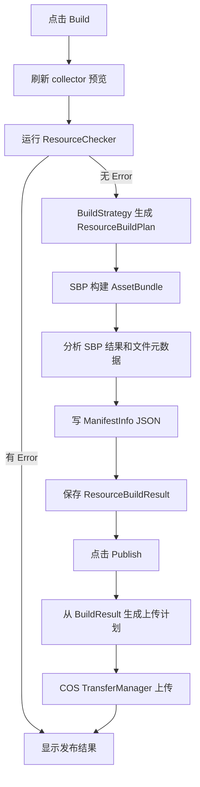

# resource-build-publish design

> 2026-06-02 修订：本设计的“发布 / COS 上传 / 版本回滚 / 存储桶管理”部分已被 `2026-06-02-resource-publisher` 取代。后续实现以新设计为准：Resource Editor 只负责资源包编辑、检查、SBP 构建、manifest 和 build result 输出；Resource Publisher 独立负责对象存储平台、渠道、存储桶、上传、版本更新和回滚。

## 0. 术语约定

| 术语 | 当前定义 | 本次约定 |
|---|---|---|
| `Resource Editor` | 已有 UI Toolkit 编辑器，维护 package / bundle / collector / checker 配置 | 继续作为入口，新增构建/发布面板和操作按钮 |
| `ResourceBuildStrategy` | 当前只是 `BuildedAttribute` 扫描出的空策略对象 | 升级为可执行策略，把收集预览转换为 SBP 构建计划 |
| `SBP` | `com.unity.scriptablebuildpipeline@1.21.25` 已在 `Packages/manifest.json` | 使用 Unity Scriptable Build Pipeline 构建 AssetBundle，不引入 Addressables |
| `Build Artifact` | 当前没有构建产物模型 | 本次构建生成的 bundle、manifest、hash、size、crc、依赖等文件记录 |
| `ManifestInfo` | 运行时当前清单根类型 | 构建后写出真实 hash/size/crc/dependencies，不新增字段 |
| `COS` | 腾讯云对象存储 SDK DLL 已放在 `Assets/GameDeveloperKit/Plugins/net45/COSXML.dll` | 首版只做构建产物上传，凭证不写入项目配置 |

## 1. 决策与约束

### 需求摘要

做什么：在资源编辑器里新增构建与发布能力。用户先用现有 collector 刷新资源列表并检查；检查通过后选择 package 和构建目标，使用 SBP 打出 AssetBundle，生成当前运行时可读取的 manifest；需要发布时，把本次构建产物按远端 key 上传到 COS。

成功标准：

- 资源编辑器能从当前 package / bundle / collector 预览生成构建计划。
- `BuildedAttribute` 发现的 `ResourceBuildStrategy` 不再只是配置项，而是能执行具体打包规则。
- SBP 构建成功后能落盘 bundle 文件、构建结果清单、运行时 `manifest.json`。
- `BundleInfo.Hash`、`Size`、`Crc`、`Dependencies` 来自真实构建产物或构建结果分析，不再保持预览占位值。
- COS 上传只上传本次构建产物清单里的文件，并显示每个文件的上传状态、进度、ETag 或错误。
- 构建失败不会触发上传；上传失败不删除本地构建产物，可重试上传。
- 密钥不进入 `ProjectSettings/GameDeveloperKitResourceEditorSettings.asset`、manifest 或 git 可提交文件。

假设：

- 首版 COS 凭证来源使用本机环境变量或 EditorUserSettings 一类本地用户设置；项目级配置只保存 region、bucket、remote prefix 和凭证来源名称。
- 首版构建默认面向当前 `EditorUserBuildSettings.activeBuildTarget`，允许用户在面板里切换目标，但不自动切换 Player 平台。
- `BundleInfo.Name` 当前被运行时当作本地 VFS 路径或远端 URL 片段使用，因此构建输出中的 bundle name 必须是稳定的相对路径，例如 `packages/{package}/{version}/{bundle}`。

### 明确不做

- 不引入 Addressables，不重写运行时资源加载模式。
- 不新增 `ManifestInfo` / `PackageInfo` / `BundleInfo` / `AssetInfo` 字段。
- 不做差量补丁、增量上传比对、CDN 刷新、灰度发布或版本回滚。
- 不把 COS SecretId / SecretKey 明文保存到项目文件。
- 不在构建成功后自动修改 `ResourceSettings.ServerUrl` 或默认 package；只给出可复制/可确认的发布信息。
- 不在资源编辑器里显示依赖 bundle 的人工编辑入口；依赖由构建阶段分析后写入 manifest。

### 复杂度档位

- `Robustness = L3`：SBP、磁盘、网络、凭证都是外部失败源，构建/上传必须有可见错误和可重试边界。
- `Structure = modules`：不能继续把构建、manifest、COS 上传塞进 `ResourceEditorWindow`。
- `Security = validated`：所有路径、远端 key、bucket、region、凭证来源做校验；密钥不落项目资产。
- `Observability = logged`：构建和上传需要窗口结果、Unity Console 日志和可保存的构建报告。
- `Compatibility = backward-compatible`：运行时 manifest schema 不变；旧的资源编辑器配置仍能打开。

## 2. 名词与编排

### 2.1 名词层

#### 现状

- `ResourceEditorSettings` 已保存 package、bundle、`ManifestOutputPath`、选中项，持久化在 `ProjectSettings/GameDeveloperKitResourceEditorSettings.asset`。
- `ResourceEditorPackage` 已有 `BuildStrategyId`；`ResourceEditorBundle` 已有 `CollectorId`、`SourceFolder`、`AssetPaths` 和 group。
- `ResourceBuildStrategy` 是空抽象，`SingleBundleBuildStrategy` / `BundlePerGroupBuildStrategy` 的描述仍写着“只记录打包方式，不执行构建”。
- `ResourceManifestPreviewBuilder.Build()` 能从预览生成 `ManifestInfo`，但 hash/size/crc/dependencies 都是占位。
- `GameDeveloperKit.Editor.asmdef` 当前只引用 `GameDeveloperKit.Runtime`；实现阶段需要确认是否显式引用 `Unity.ScriptableBuildPipeline.Editor`。
- COS SDK 已以预编译 DLL 形式存在，示例里使用 `CosXmlConfig`、`DefaultQCloudCredentialProvider`、`CosXmlServer`、`TransferManager`、`COSXMLUploadTask` 上传文件。

#### 变化

新增 Editor-only 名词：

- `ResourceBuildSettings`：构建设置，包含输出根目录、目标平台、是否清理输出、压缩方式、manifest 文件名、构建范围。
- `ResourceBuildScope`：`ResourceBuildSettings` 的构建范围枚举，首版覆盖当前 package、全部 package、仅热更 package。
- `ResourceBuildCompression`：`ResourceBuildSettings` 的压缩方式枚举，首版覆盖默认、LZ4、未压缩。
- `ResourcePublishSettings`：发布设置，包含 COS region、bucket、remote prefix、凭证来源名、上传并发限制和是否覆盖。
- `ResourceBuildContext`：一次构建的只读快照，包含 settings、registry、选中 package、收集预览、构建设置和时间戳。
- `ResourceBuildPlan`：策略生成的 SBP 输入，表达 bundle name、asset names、addressable names、package/bundle 对应关系。
- `ResourceBuildArtifact`：构建产物记录，包含本地路径、远端 key、bundle name、hash、size、crc、dependencies、所属 package。
- `ResourceBuildResult`：一次构建结果，包含成功/失败、产物列表、manifest 路径、报告路径、错误列表。
- `ResourcePublishPlan`：上传计划，只由 `ResourceBuildResult` 生成，避免上传目录里无关文件。
- `ResourceUploadResult`：单文件上传结果，包含状态、进度、ETag、COS 错误信息。
- `CosResourcePublisher`：COS 上传适配器，负责从本地凭证来源创建 COS client，并按 `ResourcePublishPlan` 上传。

`ResourceBuildStrategy` 变化：

- 从“空标记对象”变为“可执行打包策略”。
- 输入 `ResourceBuildContext`，输出 `ResourceBuildPlan`。
- 默认策略先覆盖现有两个 id：`single-bundle` 和 `bundle-per-group`。如果旧配置引用这两个 id，升级后仍能选择并构建。

### 2.2 编排层

#### 构建流程

1. 用户在资源编辑器选择构建范围：当前 package、全部 package，或仅热更 package。
2. 构建前自动保存当前配置，刷新 collector 预览并运行 checker。
3. 存在 error 时停止构建，打开检查结果窗口；warning 可继续，但结果报告要保留。
4. 根据 package 的 `BuildStrategyId` 找到策略；缺失策略是 error。
5. 策略把 bundle/group/resource 预览转换成 SBP 所需的 bundle build plan。
6. SBP 构建成功后，读取构建产物文件，计算 hash/size/crc，并从构建结果或 Unity manifest 分析依赖。
7. 写出运行时 `ManifestInfo` JSON，`BundleInfo.Name` 使用发布相对路径，`AssetInfo.Labels` 使用资源条目的 Unity label。
8. 保存本次 `ResourceBuildResult`，供 UI 展示和后续上传复用。

#### 发布流程

1. 用户点击 Publish 时必须先有成功的 `ResourceBuildResult`。
2. 发布计划只包含本次构建结果里的 bundle、manifest 和必要报告文件，不递归上传整个输出目录。
3. `CosResourcePublisher` 从本机凭证来源取 SecretId / SecretKey，创建 COS client。
4. 使用 SDK Transfer API 上传文件，进度回调写入 UI 状态。
5. 单文件失败会标记失败并继续或停止，首版默认“失败后停止后续上传”，避免半发布状态扩大。
6. 上传完成后显示远端 key 列表、成功数、失败数和首个错误；不自动修改运行时 `ResourceSettings`。

#### 流程级约束

- 幂等性：同一 build result 重复发布时，远端 key 相同；是否覆盖由发布设置控制。
- 顺序：Build 成功才允许 Publish；Publish 不重新构建，除非用户主动点击 Build。
- 可重试：构建可重跑，上传可基于最后一次成功 build result 重试。
- 错误语义：构建失败、manifest 写出失败、凭证缺失、COS 客户端错误、COS 服务端错误都进入结果窗口。
- 安全：密钥只存在内存和本机用户设置，不写进项目文件、manifest、日志正文。
- 运行时兼容：manifest 仍只由 `ManifestInfo` 当前字段表达，依赖列表由构建分析生成。

### 2.3 挂载点清单

1. Resource Editor 构建/发布 UI：删除后用户无法从窗口发起 build / publish。
2. `ResourceBuildSettings` / `ResourcePublishSettings`：删除后无法持久化输出路径、目标平台和 COS 配置。
3. 可执行 `ResourceBuildStrategy`：删除后 `BuildedAttribute` 只能选择，不能打包。
4. SBP 构建服务：删除后无法生成 AssetBundle 和真实构建报告。
5. Manifest 写出服务：删除后运行时无法读取本次构建结果。
6. COS publisher：删除后本地构建仍可用，但远端发布能力消失。

### 2.4 推进策略

1. 构建/发布配置模型：扩展资源编辑器项目设置，保存 build 和 publish 配置，但不保存密钥。
   - 退出信号：关闭重开窗口后输出路径、构建目标、COS region/bucket/prefix 仍存在，密钥字段没有进入项目文件。
2. 构建计划边界：让 `ResourceBuildStrategy` 从收集预览生成可检查的 `ResourceBuildPlan`。
   - 退出信号：不调用 SBP 也能预览当前 package 会生成哪些 bundle 和包含哪些资源。
3. SBP 构建执行：接入 `ContentPipeline.BuildAssetBundles` 或兼容构建入口，输出 AssetBundle。
   - 退出信号：配置有效时生成 bundle 文件；配置错误时得到窗口可见错误。
4. manifest 和构建报告：从构建产物写出 `ManifestInfo` JSON 和 `ResourceBuildResult`。
   - 退出信号：manifest 中 hash/size/crc/dependencies 非占位，且能被现有运行时类型反序列化。
5. 编辑器 UI 接入：新增 Build / Publish / Cancel、构建设置区、构建结果窗口和上传结果列表。
   - 退出信号：构建和上传的状态、进度、错误都不依赖 Console 才能看见。
6. COS 上传适配：读取本机凭证来源，基于最后一次 build result 生成 publish plan 并上传。
   - 退出信号：凭证缺失时 Publish 禁用或给出明确错误；凭证有效时只上传 build result 中列出的文件。
7. 验证收尾：覆盖策略计划、manifest 写出、失败短路、COS 凭证缺失、上传失败可见性和 asmdef 边界。
   - 退出信号：Editor 编译通过，Runtime asmdef 不引用 SBP/COS 编辑器发布类型。

### 2.5 结构健康度与微重构

#### 评估

- compound 检索未发现资源构建发布相关 convention。
- `ResourceEditorWindow.cs` 已承担窗口生命周期、package list、bundle 绘制、标签编辑、预览刷新、检查窗口入口和保存逻辑，继续塞 SBP/COS 会变成明显的 god window。
- `Assets/GameDeveloperKit/Editor/ResourceEditor/` 当前文件数量不多，但构建发布会引入 build plan、executor、manifest writer、publisher、result window 等多类职责，继续根目录平铺会让后续维护变钝。
- Runtime Resource 目录不应引用 SBP 或 COS SDK。运行时只消费 manifest 和 bundle 文件。

#### 结论：不做既有行为微重构，但新增代码必须分目录

本次不先拆 `ResourceEditorWindow.cs`，避免把 UI 美化/标签编辑等既有行为和构建能力搅在一起。新增逻辑必须落在 Editor-only 新文件中，窗口只做按钮绑定和结果展示。

建议新增目录：

- `Assets/GameDeveloperKit/Editor/ResourceEditor/Build/`：build settings、context、plan、strategy execution、SBP executor、manifest writer、build result。
- `Assets/GameDeveloperKit/Editor/ResourceEditor/Publish/`：publish settings、publish plan、COS publisher、upload result。
- `Assets/GameDeveloperKit/Editor/ResourceEditor/UI/`：继续放 UXML/USS，必要时新增 build result window 样式。

超出范围的观察：`ResourceEditorWindow` 的标签编辑窗口和 bundle 绘制已经偏胖，后续适合单独走 `cs-refactor` 拆分窗口绑定和子视图，但不作为本 feature 前置。

## 3. 验收契约

| 编号 | 输入 / 触发 | 期望可观察结果 |
|---|---|---|
| N1 | 打开 Resource Editor | 顶部或构建面板出现 Build / Publish 入口，Publish 在没有成功 build result 时不可执行 |
| N2 | 当前 package 有有效 collector、bundle 和资源 | 点击 Build 后刷新预览、运行 checker，并进入 SBP 构建 |
| N3 | checker 存在 error | Build 停止，检查结果窗口显示 error，不生成新的 build result |
| N4 | package 的 `BuildStrategyId` 指向 `single-bundle` | 构建计划使用该策略生成 bundle 列表，旧配置不失效 |
| N5 | SBP 构建成功 | 输出目录出现 bundle 文件、manifest JSON 和 build result |
| N6 | 查看生成的 manifest | `BundleInfo.Hash`、`Size`、`Crc`、`Dependencies` 来自构建结果，不是空字符串或 0 占位 |
| N7 | manifest 用 Newtonsoft.Json 反序列化为 `ManifestInfo` | 反序列化成功，Packages/Bundles/Assets 字段可读 |
| N8 | 运行时 Web 模式拼接 `ServerUrl + BundleInfo.Name` | `BundleInfo.Name` 是稳定相对路径，不是本机绝对路径 |
| N9 | COS region/bucket/prefix 已配置但本机没有凭证 | Publish 给出“凭证缺失”错误，不触发上传 |
| N10 | 有成功 build result 和有效 COS 凭证 | Publish 只上传 build result 列出的 bundle/manifest 文件，显示每个文件状态 |
| N11 | 单个 COS 上传失败 | 结果窗口显示失败文件和 COS 错误，本地 build result 保留，可重试 |
| N12 | 上传成功 | 结果窗口显示成功数、远端 key、ETag 或 SDK 返回信息 |
| B1 | 用户重复点击 Build | 后一次构建明确覆盖或清理输出目录，旧 build result 不与新结果混淆 |
| B2 | 用户重复点击 Publish | 使用同一个 build result 和相同远端 key，覆盖行为受发布设置控制 |
| B3 | 输出目录不可写 | Build 失败并显示路径错误，不继续 SBP |
| E1 | 代码把 COS SecretId / SecretKey 写进 ProjectSettings 或 manifest | 判定为失败 |
| E2 | Runtime asmdef 引用 SBP、COSXML 或 ResourceEditor build/publish 类型 | 判定为失败 |
| E3 | 实现新增运行时 manifest 字段 | 判定为超范围 |
| E4 | Publish 在 Build 失败后仍上传目录文件 | 判定为失败 |

### 明确不做的反向核对项

- 不出现 Addressables 依赖或 Addressables 构建入口。
- 不实现差量补丁、CDN 刷新、灰度发布和版本回滚。
- 不把密钥写入可提交文件。
- 不自动修改 `ResourceSettings.ServerUrl`。
- 不在资源编辑器里增加手工依赖 bundle 编辑 UI。

## 4. 与项目级架构文档的关系

验收通过后需要更新 `.codestable/architecture/ARCHITECTURE.md`：

- Resource 小节补充 Editor-only 构建发布链路：Resource Editor 配置 -> collector 预览 -> build strategy -> SBP -> manifest -> COS publish。
- 记录 `ResourceBuildStrategy` 已从配置枚举升级为可执行策略。
- 记录运行时 manifest schema 不变，构建链路负责填充 hash/size/crc/dependencies。
- 记录 COS 上传仅属于 Editor 发布工具，运行时不引用 COS SDK。
- 记录 `BundleInfo.Name` 在构建产物中采用远端/本地可复用的相对路径。
