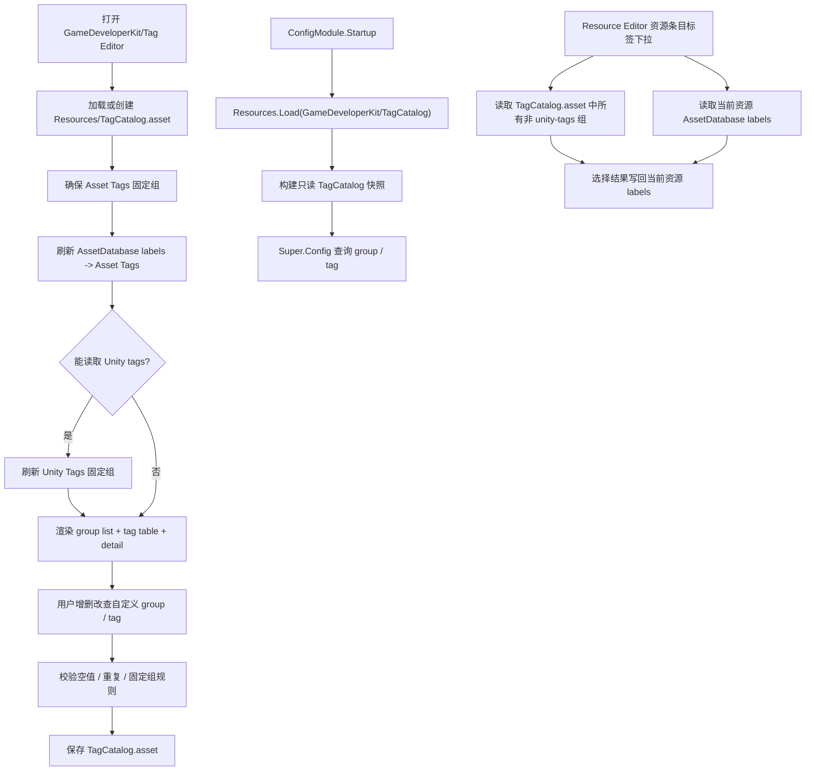

# tag-config-editor design

## 0. 术语约定

| 术语 | 定义 | 防冲突结论 |
|---|---|---|
| 项目标签 / Project Tag | 项目自定义的标签条目，保存进标签目录，运行时可读取 | 不等同于 Unity GameObject Tag，也不等同于 AssetDatabase label |
| 标签组 / Tag Group | 一组标签的命名容器，例如 `Asset Tags`、`Unity Tags` 或业务自定义组 | 组名是显示名；运行时查询使用稳定 group key |
| `Asset Tags` | 固定标签组，承载 Unity 资源标签，也允许保存项目侧自定义资产标签 | 资源标签来源是 `AssetDatabase.GetLabels` / `GetAllLabels`；不改变 `AssetInfo.Labels` 的现有含义 |
| `Unity Tags` | 可选固定标签组，承载 Unity TagManager 里的 GameObject tags | 只在 Editor 能读取 Unity tags 时生成 / 刷新；运行时读取保存后的快照 |
| 标签目录资产 | 放在 `Assets/Resources/GameDeveloperKit/TagCatalog.asset` 的配置资产 | 由编辑器创建和保存，`ConfigModule.Startup()` 用 `Resources.Load` 自动读取 |
| Tag Editor | 新增 Unity Editor 工具窗口，用来增删改查项目标签和刷新 Unity 来源 | 不塞进现有 `ResourceEditorWindow`；Resource Editor 的单资源标签弹窗仍保留原职责 |
| Resource Editor 标签下拉 | Resource Editor 中资源条目右侧的标签选择控件 | 候选标签读取 `TagCatalog.asset` 中所有非 `unity-tags` 组；当前资源已打的标签仍来自 `AssetDatabase.GetLabels` |
| `ConfigModule` 标签读取 | `ConfigModule` 启动时加载标签目录，并暴露只读查询 API | 不恢复旧的 `ConfigSettings` / 多 serializer 模型，不把标签目录当通用配置表 |

防冲突结论：

- 当前 `Assets/GameDeveloperKit/Runtime/Config/` 已收敛到 `IConfig` + `Table<TRow>` + JSON 表加载；本 feature 只给 `ConfigModule` 增加一个固定标签目录读取能力，不恢复 `ConfigSourceDefinition`、XML / CSV / ScriptableObject 表 serializer。
- 当前 `ResourceEditorWindow` 已有单资源标签编辑和 `AssetDatabase.SetLabels` 操作；本 feature 管理全局标签目录，不做批量资源打标。
- Unity Editor API 只能出现在 Editor asmdef；Player 运行时只读 Resources 下已保存的标签目录快照。

## 1. 决策与约束

### 需求摘要

做什么：新增一个 Tag Editor，用来管理当前项目自定义标签；编辑器默认固化 `Asset Tags` 组，并在能读取 Unity tags 时固化 `Unity Tags` 组；标签目录保存到 `Resources` 下。`ConfigModule` 启动时自动加载这份标签目录，并提供按组和标签 key 的只读查询能力。Resource Editor 的资源条目标签下拉读取所有非 `Unity Tags` 组作为可选项，选择结果仍写回该资源的 Unity AssetDatabase labels。

为谁：维护资源标签、工具标签、业务筛选标签的 Unity 开发者，以及运行时需要读取标签列表 / 判断标签是否存在的业务开发者。

成功标准：

- 打开 Tag Editor 时能创建或加载 `Assets/Resources/GameDeveloperKit/TagCatalog.asset`。
- 标签目录始终包含固定 `Asset Tags` 组；能读取 Unity tags 时还包含固定 `Unity Tags` 组。
- 编辑器支持对自定义组和自定义标签增删改查，支持搜索 / 过滤，保存后关闭重开仍保留。
- 刷新 Unity 来源时，`Asset Tags` 会合并 Unity 资源标签，`Unity Tags` 会合并 Unity TagManager tags；刷新不会删除用户自定义标签。
- 固定来源导入的标签保留来源标记，不能被误删成“Unity 已不存在”；用户自定义标签可以删除。
- `ConfigModule.Startup()` 自动通过 `Resources.Load` 读取标签目录；缺失目录不导致模块启动失败。
- 运行时能通过 `Super.Config` 查询标签组、列出组内标签、判断某个标签是否存在。
- `Shutdown()` 清空已加载的标签目录快照。
- Resource Editor 中单个资源条目的标签下拉从 `TagCatalog.asset` 中所有非 `unity-tags` 组提供候选；Tag Editor 新增标签并保存后，Resource Editor 刷新即可看到新候选。
- Resource Editor 仍能显示当前资源已经存在、但不在标签目录中的 legacy labels，并以可识别的方式允许用户移除它们；新增标签必须先进入 Tag Editor。

假设：这里的“管理当前项目中所有自定义标签”指项目级标签目录管理，不包含批量给资源设置 AssetDatabase labels；Resource Editor 只允许对当前资源选择 / 取消已有目录标签，不承担新增目录标签的职责。

### 明确不做

- 不做批量资源打标、不扫描场景对象并批量改 GameObject tag。
- 不直接编辑 Unity TagManager，不手写 `ProjectSettings/TagManager.asset`。
- 不改变 Resource manifest 的 `AssetInfo.Labels` 字段或资源打包 / 加载语义。
- 不恢复 `ConfigSettings`、`ConfigSourceDefinition`、`IConfigSerializer` 或 XML / CSV / SO 配置表 serializer。
- 不做运行时写回标签、不做远端下载 / 热更新 / 版本差量。
- 不把 Tag Editor 合并进现有 Resource Editor 主窗口；两者保持独立窗口，只通过 `TagCatalog.asset` 共享候选标签。
- 不在 Resource Editor 的资源条目下拉里自由输入新标签；新增候选标签必须走 Tag Editor。
- 不让 Resource Editor 的标签下拉继续把 `AssetDatabase.GetAllLabels` 当全量候选来源；它只作为导入 / 刷新 Tag Catalog 的来源。

### 复杂度档位

- `Robustness = L3`：标签名、组名、导入来源和 Resources 资产都是外部 / 用户输入，必须校验空值、重复、非法来源和保存失败。
- `Compatibility = active`：Config 模块 API 仍在迭代，允许新增只读标签 API；但不能反向破坏现有 `Table<TRow>` JSON 表加载。
- `Structure = modules`：新增 Runtime `Config/Tags` 与 Editor `TagEditor` 子目录，避免继续加胖 `ConfigModule.cs` 或 `ResourceEditorWindow.cs`。
- `Concurrency = single-threaded`：Editor 操作和 `ConfigModule` 公开 API 都假定 Unity 主线程调用。
- `Dependency = editor-runtime-boundary`：Unity 标签和 AssetDatabase labels 只在 Editor 收集，运行时只读 Resources 快照。

### 关键决策

1. 标签目录使用固定 Resources ScriptableObject 资产。
   - 采用：`Assets/Resources/GameDeveloperKit/TagCatalog.asset`。
   - 拒绝：把标签目录做成普通 JSON 配置表。
   - 原因：Editor 需要维护分组、来源、只读状态和 UI 选择；ScriptableObject 更适合作为 Unity 项目内可编辑配置，`ConfigModule` 可以用固定 `Resources.Load` 自举，不依赖 ResourceModule。

2. Runtime 暴露只读快照，不暴露可变 Editor 数据。
   - Editor 维护可序列化的目录资产。
   - `ConfigModule.Startup()` 读取资产后构建只读查询视图。
   - 运行时 API 不允许增删改标签，避免 Player 侧状态和项目资产状态分叉。

3. 固定组使用稳定 key。
   - `asset-tags`：显示名 `Asset Tags`，始终存在。
   - `unity-tags`：显示名 `Unity Tags`，在 Editor 能读取 Unity tags 时存在；读取失败时给出非阻塞提示。
   - 自定义组也有稳定 key，重命名只改显示名或通过显式重命名流程更新 key。

4. 标签来源由 group 区分，tag 只保存自身内容。
   - `asset-tags`：资源标签候选组，可由刷新 AssetDatabase labels 补充，也可由用户维护。
   - `unity-tags`：Unity TagManager 快照组，只作为 Unity tags 的独立固定组。
   - 自定义业务组由用户维护，tag 本身只保存 key、display name 和 description。
   - 同一 group 内重复 tag key 按 case-insensitive 规则合并 / 校验。

5. 标签唯一性按组内 case-insensitive key 判断。
   - 默认把输入 trim 后生成 key。
   - 同一组内 `Enemy` 与 `enemy` 视为重复，避免运行时查询出现大小写歧义。
   - 不同组可以有同名标签。

6. Resource Editor 标签候选以所有非 `unity-tags` 组为准。
   - Resource Editor 的资源条目标签下拉读取 `TagCatalog.asset` 中所有非 `unity-tags` 组的标签定义。
   - 当前资源已存在的 AssetDatabase labels 仍显示为已选；若标签不在目录中，显示为 legacy / 未登记标签，只允许取消，不作为新增候选扩散。自定义业务组里的 Custom 标签也会进入候选。
   - Resource Editor 选择 / 取消标签后只调用 `AssetDatabase.SetLabels` 更新当前资源，不写入 `TagCatalog.asset`。
   - 新增候选标签的唯一入口是 Tag Editor；Resource Editor 刷新后重新读取目录快照。

## 2. 名词与编排

### 2.1 名词层

#### 现状

- `Assets/GameDeveloperKit/Runtime/Config/ConfigModule.cs`：当前 `Startup()` 只调用 `Clear()`；模块支持 JSON 配置表加载、cache / pending 和查询，没有标签目录状态。
- `Assets/GameDeveloperKit/Runtime/Config/Table.cs` / `IConfig.cs`：只服务配置行表模型，没有通用标签模型。
- `Assets/GameDeveloperKit/Runtime/Super.cs`：已经有 `Super.Config` 入口，适合作为运行时标签读取入口。
- `Assets/GameDeveloperKit/Editor/ResourceEditor/ResourceEditorWindow.cs`：已有单资源标签下拉、单资源标签编辑小窗，使用 `AssetDatabase.GetLabels`、`AssetDatabase.SetLabels` 和反射 `AssetDatabase.GetAllLabels`。
- `Assets/GameDeveloperKit/Editor/ResourceEditor/DefaultResourceEditorExtensions.cs`：资源预览会把 `AssetDatabase.GetLabels(asset)` 写入 `ResourceGroupPreview.Labels`。
- `Assets/GameDeveloperKit/Runtime/Resource/Manifest/AssetInfo.cs`：已有 `Labels` 字段，资源 manifest 会保存资源标签，但没有项目级标签目录。
- `ProjectSettings/TagManager.asset`：当前项目自定义 `tags: []`，Unity 内置 / 项目 tags 只能在 Editor 读取或从项目设置解析，Runtime 不应直接依赖。
- `Assets/Resources/`：当前只有 `ResourceSettings.asset`，没有 ConfigModule 标签目录资产。

#### 变化

新增 Runtime 标签模型，目标形态：

```csharp
public sealed class TagCatalogAsset : ScriptableObject
{
    public const string ResourcePath = "GameDeveloperKit/TagCatalog";
    public const string AssetPath = "Assets/Resources/GameDeveloperKit/TagCatalog.asset";

    [SerializeField] private List<TagGroupDefinition> m_Groups;
}

[Serializable]
public sealed class TagGroupDefinition
{
    [SerializeField] private string m_Key;
    [SerializeField] private string m_DisplayName;
    [SerializeField] private bool m_Fixed;
    [SerializeField] private List<TagDefinition> m_Tags;
}

[Serializable]
public sealed class TagDefinition
{
    [SerializeField] private string m_Key;
    [SerializeField] private string m_DisplayName;
    [SerializeField] private string m_Description;
}
```

新增运行时查询入口，目标形态：

```csharp
public sealed partial class ConfigModule : GameModuleBase
{
    public TagCatalog Tags { get; }

    public bool TryGetTagGroup(string groupKey, out TagGroup group);
    public IReadOnlyList<TagDefinition> GetTags(string groupKey);
    public bool HasTag(string groupKey, string tagKey);
}
```

接口示例：

```csharp
await Super.Register<ConfigModule>();

if (Super.Config.HasTag("asset-tags", "weapon"))
{
    var tags = Super.Config.GetTags("asset-tags");
}

if (Super.Config.TryGetTagGroup("unity-tags", out var unityTags))
{
    // 使用已保存的 Unity Tags 快照
}
```

新增 Editor-only 名词：

- `TagEditorWindow`：UI Toolkit 工具窗口，承载标签目录 CRUD、搜索、刷新来源、保存。
- `TagCatalogEditorStore`：加载 / 创建 / 保存 `TagCatalog.asset`，确保 Resources 目录存在。
- `TagCatalogImportService`：读取 `AssetDatabase.GetAllLabels` 与 Unity tags，并合并到固定组。
- `TagCatalogValidator`：校验 group key / display name / tag key、重复项、固定组缺失和来源状态。
- `TagEditorSelection`：当前选中的 group 和 tag，用于驱动右侧详情。
- `ResourceEditorTagCatalogProvider`：Editor-only 读取 `TagCatalog.asset` 中所有非 `unity-tags` 组，向 Resource Editor 的单资源标签下拉提供候选和 legacy 标签判定。

### 2.2 编排层



#### 现状

- ConfigModule 启动流程没有读取 Resources 配置，`Startup()` 不依赖 Unity `Resources`。
- 现有标签相关操作散在 Resource Editor 的资源预览和单资源标签编辑里，只能围绕某个资源工作。
- 资源标签能进入 `ResourceGroupPreview` 和 manifest `AssetInfo.Labels`，但没有“所有可用标签”的中心目录。
- Unity tags 当前没有框架侧入口；直接解析 `ProjectSettings/TagManager.asset` 风险高，Editor 下应优先用 Unity 提供的 Editor API。

#### 变化

1. Editor 打开：
   - 通过 `GameDeveloperKit/Tag Editor` 菜单打开窗口。
   - 加载 `Assets/Resources/GameDeveloperKit/TagCatalog.asset`；不存在时创建目录和资产。
   - 调用 `EnsureDefaults()`，确保 `Asset Tags` 固定组存在。
   - 尝试读取 AssetDatabase 全量 labels，合并进 `Asset Tags`。
   - 尝试读取 Unity tags，成功时创建 / 刷新 `Unity Tags`；失败时显示非阻塞提示。

2. CRUD：
   - 自定义组可新增、重命名、删除、搜索。
   - 固定组不可删除，固定组 key 不可改。
   - 标签可新增、重命名、删除、编辑描述；是否来自刷新不再记录到 tag 上。
   - 刷新来源只补充当前 Unity / AssetDatabase 里能读到的标签，不改写标签的来源状态。

3. 保存：
   - 保存前运行 `TagCatalogValidator`。
   - Error 阻止保存；Warning 允许保存但显示在窗口问题区。
   - 保存使用 Unity Editor 资产保存流程，不手写 `.meta`。

4. ConfigModule 启动：
   - `Startup()` 在清理表缓存后尝试 `Resources.Load<TagCatalogAsset>(TagCatalogAsset.ResourcePath)`。
   - 加载成功则构建只读 `TagCatalog` 快照并校验重复 key。
   - 资产缺失时使用空目录快照，模块启动成功。
   - 资产存在但内容非法时抛 `GameException`，错误消息包含 Resources path 和具体 group / tag。

5. Runtime 查询：
   - `TryGetTagGroup(groupKey, out group)`：group 不存在返回 false。
   - `GetTags(groupKey)`：group 不存在抛 `GameException`，避免业务误拼 key 静默失败。
   - `HasTag(groupKey, tagKey)`：参数为空按 `ArgumentNullException` / `ArgumentException`；group 或 tag 不存在返回 false。

6. Resource Editor 联动：
   - Resource Editor 构建资源条目标签下拉时，通过 Editor-only provider 加载或读取 `TagCatalog.asset`。
   - 候选集合来自所有非 `unity-tags` 组，写回使用稳定 `TagDefinition.Key`。
   - 当前资源的 `AssetDatabase.GetLabels(asset)` 作为已选集合；若某个已选 label 不在标签目录中，仍在下拉中展示为 legacy 条目，避免用户看不到已存在状态。
   - 用户勾选 / 取消后，Resource Editor 只对当前资源调用 `AssetDatabase.SetLabels`；不自动把 legacy label 或新输入写进标签目录。
   - Tag Editor 保存目录后，Resource Editor 通过刷新按钮或重新打开窗口读取最新候选；不要求两个窗口实时双向绑定。

#### 流程级约束

- 错误语义：Editor 输入错误在窗口内可见；Runtime 资产内容非法抛 `GameException`；缺失资产不抛。
- 幂等性：重复打开窗口不重复创建资产；重复刷新 Unity 来源不产生重复 tag；重复 `Startup()` 得到同一份快照语义。
- 顺序：Editor 保存前先校验；ConfigModule 查询只能读取 Startup 后的快照。
- 边界：Editor import service 可以引用 `UnityEditor` / `UnityEditorInternal`；Runtime 标签模型和 ConfigModule 不引用 Editor API。
- 扩展点：后续如果需要实时同步，可在 Tag Editor 保存后广播 Editor 事件；首版只要求 Resource Editor 刷新后读取最新 `TagCatalog.asset`。

### 2.3 挂载点清单

1. `GameDeveloperKit/Tag Editor` 菜单项：新增打开标签编辑器的入口；删除后用户无法进入工具。
2. `Assets/Resources/GameDeveloperKit/TagCatalog.asset`：新增标签目录配置资产；删除后运行时无固化标签目录可读。
3. `ConfigModule.Startup()` 标签目录加载：新增 `Resources.Load` 自举挂载点；删除后运行时不会自动加载标签目录。
4. `Super.Config` 标签查询 API：新增按组 / 标签读取的公开入口；删除后业务无法通过 ConfigModule 读取标签配置。
5. 固定 group key `asset-tags` / `unity-tags`：新增跨 Editor 和 Runtime 的稳定协议；删除或改名会破坏保存目录和运行时查询约定。
6. Resource Editor 资源条目标签下拉的候选来源：删除后资源条目仍会退回散落的 Unity AssetDatabase labels，无法复用项目标签目录。

拔除沙盘：移除以上挂载点后，项目标签目录在用户和系统视角应消失；现有 Config JSON 表加载、Resource Editor 单资源标签操作和 Resource manifest labels 仍应保持原样。

### 2.4 推进策略

1. Runtime 名词契约：先定义标签目录资产、group、tag 和只读快照模型。
   - 退出信号：不接 UI 时也能构造一份目录并通过只读 API 查询。
2. ConfigModule 编排骨架：在 Startup / Shutdown 接入标签目录加载和清理，公开查询 API。
   - 退出信号：缺失 Resources 资产时 ConfigModule 启动成功；存在合法资产时查询返回标签。
3. Editor 持久化与导入服务：创建 / 保存 Resources 资产，刷新 Asset Tags 与 Unity Tags。
   - 退出信号：保存后重开 Unity / 重开窗口，固定组和导入标签仍存在。
4. Tag Editor 静态 UI：落 UI Toolkit 窗口骨架，左侧 group、右侧 tag table、详情和问题区。
   - 退出信号：窗口打开后空状态、固定组、搜索框、保存 / 刷新操作可见。
5. CRUD 与校验：接入自定义组 / 标签增删改查、重复校验和固定组保护。
   - 退出信号：用户能完成新增、重命名、删除、搜索、保存、重开核对。
6. Unity 来源刷新收尾：处理 Unity tags 不可用、AssetDatabase labels 为空和重复导入。
   - 退出信号：刷新不会丢自定义标签，也不会制造重复导入标签。
7. Resource Editor 标签下拉联动：把资源条目标签候选改为读取 `TagCatalog.asset` 中所有非 `unity-tags` 组，保留 legacy 已选标签展示和当前资源写回。
   - 退出信号：Tag Editor 新增 / 保存标签后，Resource Editor 刷新即可在资源条目下拉中选择该标签；未登记但已存在的资源 label 可见且可取消。
8. 验证覆盖：补 Runtime 配置加载测试、Tag Editor 手工验证清单和 Resource Editor 联动验证。
   - 退出信号：ConfigModule 运行时测试通过，Editor 打开 / 保存 / 刷新路径和 Resource Editor 标签候选联动有可观察证据。

### 2.5 结构健康度与微重构

##### 评估

- compound convention 检索：`search-yaml.py` 未命中目录组织 / 文件归属 / 命名约定类 decision。
- 文件级 — `Assets/GameDeveloperKit/Runtime/Config/ConfigModule.cs`：约 232 行，承担 JSON 表加载、cache / pending、查询转发；本 feature 只应加入标签目录 Startup hook 和查询转发，标签模型与校验放新文件，避免让模块入口继续膨胀。
- 文件级 — `Assets/GameDeveloperKit/Editor/ResourceEditor/ResourceEditorWindow.cs`：已混合资源预览、资源标签下拉、单资源标签编辑和校验窗口调用；本 feature 只允许在资源标签候选来源上做小挂钩，不把 Tag Editor UI 或目录 CRUD 塞进该文件。
- 目录级 — `Assets/GameDeveloperKit/Runtime/Config/`：当前有效源码约 4 个文件，但工作树里有旧模型删除记录；新增标签模型用 `Config/Tags/` 子目录，避免和表模型文件摊平。
- 目录级 — `Assets/GameDeveloperKit/Editor/`：已有 `ResourceEditor/` 与 `UI/` 两个子目录；新增 `TagEditor/` 作为独立工具目录，符合现有 Editor 工具按主题分组的形态。

##### 结论：不做微重构

本次不做“只搬不改行为”的微重构。原因：可以通过新增 `Runtime/Config/Tags/` 与 `Editor/TagEditor/` 把主体复杂度隔离开；对现有文件的改动应控制为小挂钩。Resource Editor 联动只新增候选读取适配层，不要求先拆 `ResourceEditorWindow.cs`。

##### 超出范围的观察

- `ResourceEditorWindow.cs` 已经偏胖，并且包含单资源标签菜单 / 弹窗等 UI 逻辑。若后续还要做批量打标、实时同步或更复杂的多选面板，建议另走 `cs-refactor` 拆出资源标签 UI / label utility；本 feature 只做候选来源切换，不把大拆作为前置。

## 3. 验收契约

| 编号 | 输入 / 触发 | 期望可观察结果 |
|---|---|---|
| N1 | 首次打开 `GameDeveloperKit/Tag Editor` 且目录资产不存在 | 自动创建 `Assets/Resources/GameDeveloperKit/TagCatalog.asset`，窗口显示 `Asset Tags` 固定组 |
| N2 | 项目中存在 AssetDatabase labels 后点击刷新 | `Asset Tags` 组显示这些标签，保存重开仍存在 |
| N3 | Editor 能读取 Unity tags 后点击刷新 | 出现 `Unity Tags` 固定组，包含读取到的 Unity tags |
| N4 | Unity tags 读取失败或返回空 | 窗口显示非阻塞提示；`Asset Tags` 和自定义标签仍可编辑保存 |
| N5 | 新增自定义组和自定义标签，保存后关闭重开 | 自定义组 / 标签仍存在 |
| N6 | 对固定组执行删除或改 key | 操作被阻止，窗口给出可见提示 |
| N7 | 删除由刷新补充的标签后再次刷新来源 | 当前 Unity / AssetDatabase 中仍存在的标签会重新补回 |
| N8 | 同一组内新增大小写不同但 key 相同的标签 | 保存前报重复错误，阻止保存 |
| N9 | `ConfigModule.Startup()` 且 Resources 标签目录存在 | `Super.Config.GetTags("asset-tags")` 返回保存的标签列表 |
| N10 | `ConfigModule.Startup()` 且 Resources 标签目录缺失 | 模块启动成功，`TryGetTagGroup("asset-tags", out _)` 返回 false，`GetTags("asset-tags")` 抛 `GameException` |
| N11 | 调用 `Super.Config.HasTag("asset-tags", "weapon")` | 标签存在返回 true，不存在返回 false |
| N12 | Tag Editor 在任意非 `Unity Tags` 组新增 `ui` 标签并保存，然后刷新 Resource Editor | 资源条目标签下拉出现 `ui` 候选，选择后当前资源的 `AssetDatabase.GetLabels` 包含 `ui` |
| N13 | 当前资源已有 `legacy` label，但标签目录没有该标签 | Resource Editor 下拉仍显示 `legacy` 为已选 / 未登记标签，取消后当前资源 labels 不再包含 `legacy` |
| B1 | `GetTags("missing-group")` | 抛 `GameException`，消息包含 group key |
| B2 | `HasTag(null, "x")` / `HasTag("asset-tags", " ")` | 分别抛 `ArgumentNullException` / `ArgumentException` |
| B3 | Resources 标签目录资产中存在重复 group key 或 tag key | `ConfigModule.Startup()` 抛 `GameException`，不暴露半成品快照 |
| B4 | `Shutdown()` 后查询标签目录 | 目录快照被清理，`TryGetTagGroup` 返回 false，`GetTags` 抛 `GameException` |

### 明确不做的反向核对项

- Runtime 代码中不应引用 `UnityEditor`、`UnityEditorInternal`、`AssetDatabase` 或直接读取 `ProjectSettings/TagManager.asset`。
- 不应新增 `ConfigSourceDefinition`、`ConfigSettings`、`IConfigSerializer`、`ConfigFormat` 或 XML / CSV / SO 表 serializer。
- 不应修改 `AssetInfo.Labels` schema 或 ResourceModule provider / manifest 加载语义。
- 不应新增批量 `AssetDatabase.SetLabels` 逻辑；单资源标签操作仍属于现有 Resource Editor。
- Resource Editor 不应把 `AssetDatabase.GetAllLabels` 作为资源条目下拉的全量候选来源；候选必须来自 `TagCatalog.asset` 中所有非 `unity-tags` 组。
- Resource Editor 不应提供自由输入新标签并写入目录的入口；新增候选必须走 Tag Editor。
- 不应手写或提交 Unity `.meta` 文件作为本 feature 的实现步骤。

## 4. 与项目级架构文档的关系

验收通过后需要更新 `.codestable/architecture/ARCHITECTURE.md`：

- 在 Config 模块现状中补充：`ConfigModule.Startup()` 会从 `Resources/GameDeveloperKit/TagCatalog` 自动读取标签目录，并通过 `Super.Config` 提供只读标签查询。
- 记录核心模型：标签目录包含 group 和 tag；固定 group key 为 `asset-tags` / `unity-tags`。
- 记录 Editor / Runtime 边界：Tag Editor 使用 AssetDatabase labels 和 Unity tags 生成快照，Runtime 不引用 Editor API。
- 记录约束：缺失标签目录不阻断 ConfigModule 启动；非法标签目录抛 `GameException`；标签目录不改变 Resource manifest labels 语义。
- 记录 Resource Editor 联动：资源条目标签候选来自所有非 `unity-tags` 标签组，选择结果仍写回当前资源 AssetDatabase labels。


