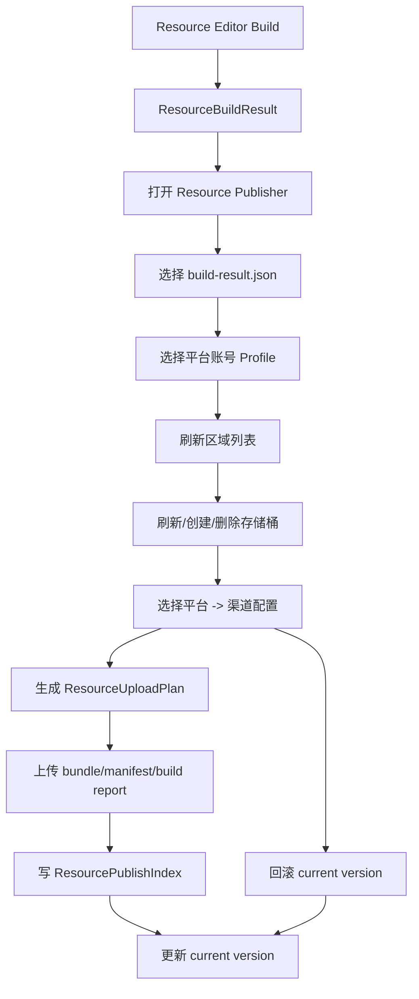

# resource-publisher design

## 0. 术语约定

| 术语 | 当前定义 | 本次约定 |
|---|---|---|
| `Resource Editor` | 当前已有 package/bundle/collector/checker 和资源构建能力 | 维护资源配置、检查资源、执行本地构建并输出 `build-result.json`，不做对象存储发布 |
| `Resource Publisher` | 当前不存在独立工具 | 新增 Editor-only 工具，读取 `build-result.json` 并管理对象存储发布 |
| `Storage Platform` | 当前只有 COS SDK 和示例 | 抽象对象存储平台，首个实现为 COS，后续 OSS/S3 等走同一接口 |
| `Credential Profile` | 当前 COS 凭证由环境变量名隐式读取 | 用户按 COS 示例直接提供 `SecretId` / `SecretKey` |
| `Channel` | 当前没有发布渠道概念 | 一个发布目标配置，绑定目标平台、区域、存储桶、远端前缀和上传后行为 |
| `Build Result` | 当前由资源构建流程生成 | Resource Editor 构建输出的 `ResourceBuildResult`，Publisher 上传计划只从该文件生成 |
| `Resource Version` | manifest/package/bundle 中已有版本字段 | Publisher 记录一次已上传的资源版本，支持更新当前版本和回滚当前版本指针 |
| `Bucket` / `Region` | 当前 COS 上传只手填 region/bucket | Publisher 从平台 provider 列出区域和存储桶，并支持创建/删除存储桶 |

## 1. 决策与约束

### 需求摘要

做什么：把对象存储发布从 Resource Editor 拆出去，新增 Resource Publisher 窗口。用户在 Resource Editor 维护资源配置并执行本地构建，生成 bundle / manifest / `build-result.json`；随后打开 Publisher 选择该 build result、平台账号、目标平台、发布渠道和资源版本，再执行上传、更新当前版本、回滚版本，以及查看/创建/删除对象存储桶。

成功标准：

- Resource Editor 继续显示构建输出、目标平台、构建范围、压缩方式、清单文件和本地构建按钮，但不显示 COS、平台账号、bucket、region、channel、publish、rollback 相关 UI。
- Publisher 能选择 Resource Editor 输出的 `build-result.json`，并由该 `ResourceBuildResult` 生成只包含本次产物的上传计划。
- 用户提供 COS `SecretId` / `SecretKey` 后，Publisher 能通过平台 provider 拉取区域列表、存储桶列表。
- Publisher 支持创建和删除存储桶；删除存储桶需要确认且只在 provider 报告桶为空或平台允许时执行。
- Publisher 支持按 `platform -> channel` 保存配置，例如 Windows/dev、Android/prod、iOS/review 各自绑定不同桶和前缀。
- Publisher 支持上传资源版本、标记当前版本、查看历史版本、回滚当前版本到历史版本。
- 凭证只用于 Editor 发布流程，不写入构建报告、manifest 或运行时资源。
- Runtime 不引用对象存储 SDK，也不知道 Publisher 类型。

假设：

- 首个具体平台 provider 为 COS，因为项目已有 `COSXML.dll` 和 `E:/cos-snippets/dotnet/dist` 示例。
- “不需要你来计算 key”表示工具不推导、不生成、不派生云平台凭证；用户输入什么，provider 就使用什么。
- 区域列表优先由平台 provider 返回静态官方 region 表；如果 SDK 支持在线查询，可在 provider 内补充刷新，但 UI 不依赖公网文档抓取。
- 版本回滚首版不删除对象，只更新 Publisher 维护的“当前版本指针”文件或渠道索引；旧版本对象保留。

### 明确不做

- 不在 Resource Editor 内继续做上传、桶管理、渠道配置或回滚。
- 不在 Publisher 内执行 SBP、collector 或资源构建；Publisher 只消费 `build-result.json`。
- 不实现 CDN 刷新、灰度百分比、差量补丁、增量比较、对象生命周期策略或跨区域复制。
- 不替用户生成、计算或托管 `SecretId` / `SecretKey`。
- 不把 `SecretId` / `SecretKey` 写入 manifest、build result 或日志。
- 不要求 Runtime 直接读取 Publisher 版本索引；Runtime 仍按现有 `ResourceSettings.ServerUrl + BundleInfo.Name` 加载资源。
- 不把 COS 细节写死在 Publisher UI；COS 只是首个 `IObjectStorageProvider`。

### 复杂度档位

- `Robustness = L3`：网络、权限、桶状态和上传都是外部失败源，必须有明确错误和可重试边界。
- `Structure = modules`：Publisher 独立于 ResourceEditor，平台 SDK 适配放 provider 层。
- `Security = validated`：凭证输入、保存和日志输出必须有密钥保护边界。
- `Observability = logged`：上传、桶操作、版本更新和回滚都要产生结果记录。
- `Compatibility = backward-compatible`：不改变运行时 manifest schema，不改变已有资源加载 API。

## 2. 名词与编排

### 2.1 名词层

#### 现状

- Resource Editor 当前已有 `ResourceBuildSettings` 和本地构建能力，构建后能输出 `ResourceBuildResult`。
- `ResourceBuildResult` 能表达本地构建产物，是 Publisher 上传计划的自然输入，由 Resource Editor 构建产生。
- 项目插件里已有 `Assets/GameDeveloperKit/Plugins/net45/COSXML.dll`，COS 示例覆盖 `GetService`、`PutBucket`、`DeleteBucket`、`BucketVersioning`、`ListObjectsVersioning` 和 Transfer 上传。
- 资源运行时只消费 `ManifestInfo` / `PackageInfo` / `BundleInfo` / `AssetInfo`，没有渠道或远端版本索引模型。

#### 变化

新增 Editor-only 名词：

- `ResourcePublisherSettings`：Publisher 项目配置，保存 profile 列表、channel 列表、最近选择的 `build-result.json` 和最近选中的平台/渠道。
- `StoragePlatformId`：平台 id，例如 `cos`、`oss`、`s3`；UI 用 provider 注册表提供显示名和能力。
- `StorageCredentialProfile`：凭证配置，包含 profile id、平台 id、`SecretId`、`SecretKey`。
- `StorageRegionInfo`：区域条目，包含 region id、显示名、是否可创建桶、provider metadata。
- `StorageBucketInfo`：桶条目，包含 bucket name、region、createdAt、versioning status、访问域名和 provider metadata。
- `PublisherChannel`：发布渠道配置，包含 build target、channel name、profile id、region id、bucket name、remote prefix、是否启用桶版本控制、是否上传后设为 current。
- `ResourcePublishVersion`：一次资源版本记录，包含 version、build target、channel、manifest key、artifact keys、hash、size、uploadedAt、operator 和 status。
- `ResourcePublishIndex`：某个 channel 下的版本索引，包含 current version 和 history。
- `ResourceUploadPlan`：由选中的 `ResourceBuildResult + PublisherChannel` 生成，列出本地文件、远端 key、预期 hash/size。
- `ResourcePublishOperationResult`：上传、更新 current、回滚、创建桶、删除桶等操作结果，包含成功/失败、错误和远端返回信息。
- `IObjectStorageProvider`：对象存储平台接口，负责列区域、列桶、创建桶、删除桶、检查对象、上传对象、下载/上传版本索引。
- `ObjectStorageProviderRegistry`：Editor 启动时注册平台 provider，Publisher UI 只依赖 registry。
- `CosObjectStorageProvider`：COS provider，封装 `CosXmlServer`、`GetServiceRequest`、`PutBucketRequest`、`DeleteBucketRequest` 和 Transfer API。

`IObjectStorageProvider` 的能力边界：

- `ListRegions(profile)`：返回平台可选区域；COS 首版可内置 region 表。
- `ListBuckets(profile, region?)`：列当前账号桶；COS 对应 `GetServiceRequest`，指定 region 时使用区域 host。
- `CreateBucket(profile, region, bucketName, options)`：创建桶；COS 直接使用用户填写的完整 bucket name。
- `DeleteBucket(profile, region, bucketName)`：删除桶；失败时保留平台错误。
- `SetBucketVersioning(profile, bucket, enabled)` / `GetBucketVersioning(...)`：首版只暴露给渠道选项，不强制所有 provider 支持。
- `Upload(planItem)`：上传单文件并返回 ETag / version id / provider request id。
- `DownloadText` / `UploadText`：读写 Publisher 的 channel version index。

### 2.2 编排层

#### 平台与存储桶管理流程

1. 用户在 Publisher 新建或选择 `StorageCredentialProfile`。
2. 用户提供 COS `SecretId`、`SecretKey`；工具不生成、不计算这些值。
3. Publisher 调 `IObjectStorageProvider.ListRegions()` 绘制区域列表。
4. 选择区域后调 `ListBuckets()` 绘制桶列表。
5. 创建桶时校验名称、区域和平台特殊规则；COS 需要用户填写控制台显示的完整 bucket name，工具不自动拼接账号后缀。
6. 删除桶时弹确认，显示桶名、区域、渠道引用数；仍被 channel 引用的桶默认禁止删除。
7. provider 返回错误时只显示脱敏错误，不打印 secret。

#### 渠道配置流程

1. 用户按 build target 创建 channel，例如 `StandaloneWindows64/dev`、`Android/prod`。
2. channel 绑定 build target、profile、region、bucket、remote prefix 和上传后行为。
3. channel 配置保存到 Publisher settings；凭证由 profile 统一提供。
4. 切换 channel 时自动刷新对应区域/桶状态，并提示桶不存在或权限不足。

#### 版本上传流程

1. 用户先在 Resource Editor 点击构建，生成 bundle、manifest 和 `build-result.json`。
2. 用户在 Publisher 选择 `build-result.json` 和 channel。
3. Publisher 读取本次构建产物列表，结合 channel 生成 `ResourceUploadPlan`。
4. 上传只遍历 plan 中的文件，不递归扫描输出目录。
5. 上传成功后生成 `ResourcePublishVersion`，写入远端 `ResourcePublishIndex`。
6. 如果 channel 配置为上传后设为 current，则把 index 的 `currentVersion` 更新为新版本。
7. 上传失败时本地构建结果和远端旧 index 不被删除；结果窗口显示失败文件和 provider 错误。

#### 版本更新与回滚流程

1. Publisher 从远端读取 channel 的 `ResourcePublishIndex`。
2. 用户选择历史版本并点击 Rollback。
3. 回滚只更新 `currentVersion` 指针，不删除任何 bundle、manifest 或历史版本记录。
4. 若目标版本的 manifest 或关键 artifact 不存在，回滚停止并显示缺失对象。
5. 重复回滚到同一版本是幂等操作。

#### 流程级约束

- 幂等性：同一 build result + channel + version 生成相同远端 key；重复上传由覆盖策略控制。
- 顺序：Resource Editor 构建成功后进入 Publisher；Publisher 读取 build result 成功后才允许生成上传计划和上传。
- 安全：所有日志和结果窗口都必须对 `SecretId` / `SecretKey` 脱敏。
- 权限：创建/删除桶、开启版本控制、上传对象各自失败，不互相伪装成通用失败。
- 可拔除：删除 Publisher 工具后，本地资源构建仍可用，只失去远端平台/渠道/版本管理。

### 2.3 挂载点清单

1. Resource Publisher 菜单/窗口：删除后用户无法管理发布渠道和上传版本。
2. `ResourcePublisherSettings`：删除后平台 profile、渠道配置、最近 build result 和最近选中项不再持久化。
3. `IObjectStorageProvider` 与 registry：删除后 Publisher 无法支持多对象存储平台。
4. `CosObjectStorageProvider`：删除后 COS 平台不可用，但 Publisher 抽象仍可承接其他 provider。
5. `ResourcePublishIndex` 远端文件：删除后无法查看历史版本或回滚 current 指针。
6. Resource Editor 到 Publisher 的 build-result 输入边界：删除后 Publisher 无法知道本次应上传的文件。

### 2.4 推进策略

1. 职责拆分清理：Resource Editor 保留本地构建输出能力，移除 publish / COS / channel UI 和设置。
   - 退出信号：Resource Editor UI 可配置本地构建输出，但不出现 COS、bucket、region、channel、publish、rollback 字段或按钮。
2. Publisher 设置与窗口骨架：新增独立窗口、settings、profile/channel 列表和 build-result 选择入口。
   - 退出信号：关闭重开 Unity 后 profile 非密钥字段、channel 发布配置和最近 build result 路径仍存在。
3. 对象存储 provider 抽象：实现 registry、通用模型和 provider 能力查询。
   - 退出信号：Publisher UI 通过 provider 接口读取平台显示名和能力，不直接引用 COS 类型。
4. COS provider 首版接入：基于现有 DLL 和示例实现区域列表、桶列表、创建桶、删除桶、对象上传。
   - 退出信号：凭证有效时能列 COS bucket，凭证无效时显示脱敏错误。
5. 上传计划与版本索引：由选中的 `ResourceBuildResult` 生成 upload plan，上传后写 `ResourcePublishIndex`。
   - 退出信号：远端出现 build result 中列出的 bundle/manifest 和 channel index，index 记录当前版本和历史版本。
6. 版本更新与回滚：在 Publisher 展示历史版本，支持切换 current version。
   - 退出信号：上传两个版本后可把 current 回滚到旧版本，旧对象不删除。
7. 结果窗口与验证：覆盖桶操作、上传、失败、脱敏、Runtime 边界和旧 Resource Editor 发布代码清理。
   - 退出信号：Editor 编译通过；Runtime asmdef 不引用对象存储 SDK；grep 不到 ResourceEditorWindow 中的 COS/Publish UI。

### 2.5 结构健康度与微重构

#### 评估

- 现有 `ResourceEditorWindow.cs` 已经偏胖，并且当前实现已把 COS publish 放进同一个窗口，这是本次要纠正的职责混合。
- `Assets/GameDeveloperKit/Editor/ResourceEditor/Publish/` 目录当前承载 COS 上传，但按新边界应移动到独立 Publisher 域。
- 多平台对象存储会引入 provider、profile、channel、bucket、version index 和 UI 状态，继续堆在 ResourceEditor 目录会让“资源配置”和“发布运维”混在一起。

#### 结论：做职责拆分微重构

本 feature 第一阶段必须做只搬不改语义的微重构：把已实现的 publish/COS 模型和 UI 入口从 ResourceEditor 拆出，迁移到独立 `Assets/GameDeveloperKit/Editor/ResourcePublisher/` 命名空间/目录。迁移后再扩展 bucket/channel/version 能力。

建议目录：

- `Assets/GameDeveloperKit/Editor/ResourcePublisher/`：Publisher window、settings、公共模型。
- `Assets/GameDeveloperKit/Editor/ResourcePublisher/Storage/`：对象存储 provider 接口、registry、平台通用模型。
- `Assets/GameDeveloperKit/Editor/ResourcePublisher/Storage/Cos/`：COS provider 和 SDK 适配。
- `Assets/GameDeveloperKit/Editor/ResourcePublisher/UI/`：Publisher 的 UXML/USS。

验证方式：迁移步骤只移动职责和引用边界，先保证 Editor 编译通过，再继续实现新能力。

## 3. 验收契约

| 编号 | 输入 / 触发 | 期望可观察结果 |
|---|---|---|
| N1 | 打开 Resource Editor | 看到资源包配置、检查、构建输出和构建按钮，不出现 COS / bucket / region / channel / publish / rollback |
| N2 | 打开 Resource Publisher | 出现 build-result 选择、平台 profile、channel 发布设置、region、bucket、版本列表和上传入口 |
| N3 | 用户添加 COS profile 并提供 `SecretId` / `SecretKey` | profile 可用于刷新区域和桶列表；日志和结果窗口不显示凭证明文 |
| N4 | 点击刷新区域 | UI 显示该平台 provider 返回的区域列表 |
| N5 | 选择区域并刷新 bucket | UI 显示当前账号在该区域或全局可见的存储桶列表 |
| N6 | 创建 bucket | provider 创建成功后 bucket 出现在列表；失败显示平台错误 |
| N7 | 删除未被 channel 引用的空 bucket | 二次确认后删除成功，bucket 从列表移除 |
| N8 | 删除被 channel 引用的 bucket | 默认禁止并提示引用的 channel |
| N9 | 选择 build-result 和 channel 并生成上传计划 | Publisher 不重新构建，文件数等于 build result 中需要发布的 artifact 数 |
| N10 | 执行上传 | 只上传 upload plan 中的 bundle、manifest 和必要报告，不递归上传输出目录 |
| N11 | 上传成功 | 远端写入 `ResourcePublishIndex`，新增版本记录，并按 channel 配置更新 current |
| N12 | 上传失败 | 结果窗口显示失败文件和脱敏 provider 错误，旧 current 不变 |
| N13 | 上传两个版本后回滚到旧版本 | current version 指针切到旧版本，历史版本记录和对象都保留 |
| N14 | 重复回滚到同一版本 | 操作成功且结果不重复创建版本记录 |
| B1 | profile 缺 `SecretId` / `SecretKey` 或 key 无效 | 刷新 bucket / 上传失败，错误不包含凭证明文 |
| B2 | 远端版本索引不存在 | 首次上传时创建 index；只回滚时提示没有历史版本 |
| B3 | 目标回滚版本关键对象缺失 | 回滚停止并列出缺失 key |
| E1 | Runtime asmdef 引用 COSXML 或 ResourcePublisher 类型 | 判定为失败 |
| E2 | manifest、build result、日志出现 `SecretId` / `SecretKey` 明文 | 判定为失败 |
| E3 | Publisher 调用 SBP 或 collector 重新构建资源 | 判定为失败 |
| E4 | Resource Editor 仍保留 Publish / COS 配置 UI | 判定为失败 |

### 明确不做的反向核对项

- 不做 CDN 刷新、灰度百分比、差量补丁、增量比较或跨区域复制。
- 不生成、计算或托管云平台 `SecretId` / `SecretKey`。
- 不让 Runtime 读取 Publisher 私有配置或直接调用对象存储 SDK。
- 不把 COS SDK 类型暴露到 Publisher UI 层之外。

## 4. 与项目级架构文档的关系

验收通过后需要更新 `.codestable/architecture/ARCHITECTURE.md`：

- Resource 小节拆成 Editor 构建链路与 Publisher 发布链路：Resource Editor config/build -> build result -> Resource Publisher -> storage provider -> channel version index。
- 记录 Resource Editor 管理本地构建输出，但不管理对象存储平台、bucket、channel 或回滚。
- 记录 Resource Publisher 是 Editor-only 工具，负责选择 build result、对象存储 provider、渠道配置、远端版本索引和回滚 current 指针。
- 记录首个 provider 为 COS，后续平台通过 `IObjectStorageProvider` 接入。
