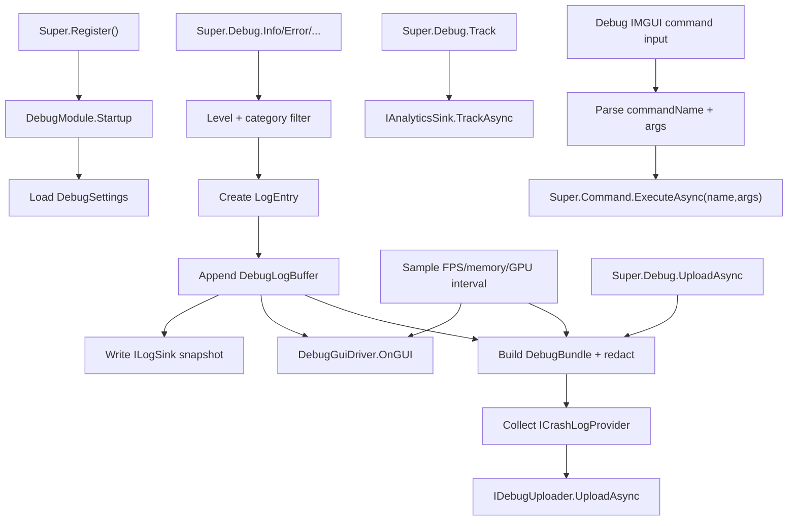

# runtime-diagnostics design

## 0. 术语约定

| 术语 | 当前定义 | 本次约定 |
|---|---|---|
| `LoggerModule` | `Assets/GameDeveloperKit/Runtime/Logger/LoggerModule.cs`，已提供等级、分类、`LogEntry`、`ILogSink` 和 Unity Console sink | 本 feature 的承载点；实现目标是升级/更名为 `DebugModule`，不新增独立 `DiagnosticsModule` |
| `DebugModule` | 代码中暂无 | Logger 能力扩展后的运行时调试模块，通过 `Super.Debug` 访问；日志只是其中一个子能力 |
| Logger / Log | 当前指结构化日志入口与 sink 输出 | 保留为 DebugModule 下的日志子能力：写入、过滤、最近日志缓存、上传包输入 |
| Debug Upload / 日志上传 | 现有 Logger 明确不默认上传远端 | DebugModule 按需生成调试包并交给 `IDebugUploader`；没有默认云平台 |
| Analytics / 埋点 | 代码中暂无统一埋点入口；manifest 中存在 Unity Analytics 模块但未作为框架 API | DebugModule 提供轻量 Track 通道，转发给可替换 sink |
| Crash Log / 崩溃线索 | 代码中暂无崩溃日志收集 | DebugModule 收集上一轮异常退出线索、最近日志和 provider 可读取文件；不承诺 native crash dump |
| Runtime GUI / Overlay | `UIModule` 管理业务 UI；没有调试面板 | DebugModule 自建 IMGUI/`OnGUI` 覆盖层，只用 `UnityEngine.GUI/GUILayout` 绘制，不使用 UGUI、UI Toolkit 或业务 `UIModule` |
| Metrics / Profile | `TimerSettings.FPS` 只配置目标帧率；没有运行时指标采样 | FPS、frame time、托管内存和可用 GPU/渲染指标的 best-effort 快照，不替代 Unity Profiler |
| Command by name | `CommandModule` 当前只执行已构造的 `ICommand`，不解析名字和参数 | CommandModule 增加 command name + args 调用能力；DebugModule 的命令面板只调用 CommandModule，不再做 GM 桥接层 |

防冲突结论：

- 不增加 `DiagnosticsModule`、`Super.Diagnostics` 或 `Runtime/Diagnostics/`。运行时诊断能力集中到现有 Logger 模块族，公共目标名改为 `DebugModule` / `Super.Debug`。
- `DebugModule` 名称可能和 `UnityEngine.Debug` 在 using 语境里接近；模块类型始终写 `DebugModule`，Unity 原生日志调用需要在实现中按需写全 `UnityEngine.Debug`。
- GM 不再是 DebugModule 内部命令系统。`[Command("GM-ADD-ITEM")]` 属于 `GameDeveloperKit.Command`，由 `CommandModule` 负责注册、解析参数、创建/执行 `ICommand`。
- `Profile` 在本 feature 中指运行时调试面板上的指标采样，不接入或复刻 Unity Editor Profiler 窗口。

## 1. 决策与约束

### 需求摘要

做什么：把当前只负责控制台日志的 `LoggerModule` 升级为运行时 `DebugModule`。它继续提供日志入口和 sink 输出，同时增加最近日志缓存、运行时日志上传、埋点事件、崩溃线索收集、IMGUI 调试面板、FPS/内存/GPU 指标展示。命令调试入口不再由 DebugModule 自己注册 GM 命令，而是调用增强后的 `CommandModule.ExecuteAsync(commandName, args)`。

为谁：框架维护者、业务开发者、QA、测试包使用者，以及需要排查线上问题的人。

成功标准：

- 注册升级后的调试模块后可通过 `Super.Debug` 访问；日志 API 能覆盖现有 Logger 行为。
- 当前 `LogEntry` 继续进入 sink，同时写入最近日志 ring buffer，IMGUI 面板可按等级/分类查看。
- 调试面板只使用 Unity IMGUI 绘制，不依赖 UGUI prefab、`UIModule`、UI Toolkit 或业务窗口系统。
- 业务可通过统一 Track API 记录埋点事件，事件进入已注册 analytics sink；sink 失败不影响业务主流程。
- 运行时可生成调试包，包含最近日志、环境摘要、指标快照和可用崩溃线索，并交给 uploader 上传。
- 指标采样能提供 FPS/frame time、托管内存和可用 GPU/渲染指标；不支持的平台返回 unavailable，而不是伪造数值。
- `CommandModule` 支持按 `commandName + args` 调用命令；调试面板输入 `GM-ADD-ITEM sword 3` 后由 CommandModule 完成解析与执行。
- 所有调试能力默认可关闭；关闭后不采样、不上传、不显示面板、不执行命令输入。

### 明确不做

- 不新增独立 `DiagnosticsModule`，不新增 `Super.Diagnostics`。
- 不使用 UGUI、UI Toolkit、业务 `UIModule` 或 prefab 来绘制运行时调试面板。
- 不首版绑定固定远端服务、商业 analytics SDK、崩溃平台 SDK 或账号系统。
- 不承诺读取所有平台的原生 crash dump；首版只做 provider 能力和 best-effort 本地线索。
- 不默认上传隐私字段、账号凭证、支付信息、token、secret 或原始玩家数据。
- 不默认在 Release 包启用命令调试、上传或 overlay；启用条件必须可配置。
- 不在 DebugModule 内部再定义一套 GM command registry、`IDiagnosticCommand` 或 GM 到 CommandModule 的桥接层。
- 不新增第三方依赖。

### 复杂度档位

走对外发布库/运行时基础设施默认档位，偏离点：

- `Robustness = L3`：调试入口会处理外部字符串命令、上传失败、sink 失败、平台指标不可用和敏感信息过滤。
- `Structure = modules`：虽然归属集中到 DebugModule，但日志缓存、上传、埋点、崩溃线索、指标、IMGUI、命令调用应分文件/子目录，不堆进一个类。
- `Performance = budgeted`：指标采样、日志 ring buffer、IMGUI 刷新和上传打包必须有频率/容量上限。
- `Security = validated`：上传和 command name + args 都跨信任边界；命令、参数、上传内容和启用条件必须显式校验。
- `Observability = instrumented`：DebugModule 自身要能报告上传状态、采样状态、命令执行结果和 sink 失败原因。
- `Compatibility = migration`：现有 `LoggerModule` API 需要迁移到 `DebugModule`；实现阶段可保留 `Super.Logger` / `LoggerModule` 过渡 facade，但目标文档和架构使用 `DebugModule`。

### 关键决策

1. 现有 Logger 模块升级为 DebugModule。
   - 日志入口、等级过滤、分类过滤、sink 输出仍是核心子能力。
   - 新增上传、埋点、崩溃线索、指标和 IMGUI 都归 DebugModule 编排。
   - 不建立平行诊断模块，避免 Logger 和 Diagnostics 两套入口长期并存。

2. DebugModule 负责调试面板，但不接业务 UI。
   - 面板由 `DebugGuiDriver` 之类的轻量 MonoBehaviour 在 `OnGUI()` 中绘制。
   - 面板可按 tab 展示 Logs、Metrics、Upload、Analytics、Command。
   - 不生成 UGUI prefab，不注册 `UIModule` 窗口，不依赖 UI 资源加载。

3. CommandModule 拥有 command name + args 能力。
   - `CommandModule` 增加 `CommandAttribute`、命令工厂/绑定器和 `ExecuteAsync(string commandName, params object[] args)`。
   - DebugModule 的命令面板只把输入拆成 name/args 后调用 CommandModule。
   - 这样 GM 命令天然使用 CommandModule 的 `HistoryMode`、执行状态、错误语义和历史栈，不需要“GM 到 CommandModule 桥接”。

4. 日志上传走“调试包 + uploader”。
   - 调试包是本地结构化 bundle，包含 manifest、日志、指标、崩溃线索和环境摘要。
   - `IDebugUploader` 只负责把 bundle 交给外部系统；首版不内置固定服务。
   - 上传前统一走 redaction 规则，敏感 key/value 不进入包或日志正文。

5. 埋点是 DebugModule 下的独立事件通道。
   - `Track(name, properties)` 产生 `AnalyticsEvent`，按 sink 输出。
   - 日志用于排查，埋点用于行为统计；两者不混成同一条日志文本。
   - 未注册 sink 时 `Track` no-op 或进入短队列，不能阻塞业务。

6. 崩溃线索是 provider 化的本地收集。
   - 通用路径：记录上次正常退出标记、捕获 managed exception / unhandled exception 线索、保存最后 N 条日志。
   - 平台路径：通过 `ICrashLogProvider` 补充 Player.log、设备日志或平台可读文件；不可用时明确返回 unavailable。
   - 不在首版承诺 native crash handler、符号化、minidump 上传或崩溃平台接入。

## 2. 名词与编排

### 2.1 名词层

#### 现状

- `Assets/GameDeveloperKit/Runtime/Logger/LoggerModule.cs` 已实现 `Enabled`、`MinimumLevel`、分类过滤、`ILogSink` 管理和同步输出。
- `Assets/GameDeveloperKit/Runtime/Logger/LogEntry.cs` 只包含 timestamp、level、category、message、exception、context；没有最近日志缓存、上传状态或设备上下文。
- `Assets/GameDeveloperKit/Runtime/Command/ICommand.cs` 是可执行/可撤销/可重做命令契约；`CommandModule.ExecuteAsync(ICommand)` 只接收已构造的命令对象。
- `Assets/GameDeveloperKit/Runtime/Timer/TimerModule.cs` 管理 timer 和目标 FPS 设置，没有运行时 FPS/内存/GPU 采样 API。
- `Assets/GameDeveloperKit/Runtime/UI/UIModule.cs` 管业务 UI 窗口和层级；本 feature 不依赖它。
- `.codestable/features/2026-05-28-logger-module/logger-module-design.md` 明确把文件日志、远端日志、Unity log capture、Editor 可视化和崩溃上报列为后续扩展；本 feature 是这些扩展进入同一 DebugModule 的设计。

#### 变化

升级后的调试模块入口：

```csharp
public sealed class DebugModule : GameModuleBase
{
    public bool Enabled { get; set; }
    public LogLevel MinimumLevel { get; set; }
    public DebugLogBuffer Logs { get; }
    public DebugMetricSnapshot Metrics { get; }
    public bool OverlayVisible { get; set; }

    public override UniTask Startup();
    public override UniTask Shutdown();

    public void Log(LogLevel level, string message, string category = null, object context = null);
    public void Track(string name, IReadOnlyDictionary<string, object> properties = null);
    public UniTask<DebugUploadResult> UploadAsync(DebugUploadOptions options = null);
    public UniTask<CommandInvokeResult> ExecuteCommandAsync(string commandLine);
}
```

日志缓存：

```csharp
public sealed class DebugLogBuffer
{
    public int Capacity { get; }
    public IReadOnlyList<LogEntry> Snapshot(DebugLogQuery query = null);
    public void Clear();
}
```

埋点：

```csharp
public readonly struct AnalyticsEvent
{
    public string Name { get; }
    public DateTimeOffset Timestamp { get; }
    public IReadOnlyDictionary<string, object> Properties { get; }
}

public interface IAnalyticsSink
{
    UniTask TrackAsync(AnalyticsEvent analyticsEvent);
}
```

指标采样：

```csharp
public readonly struct DebugMetricSnapshot
{
    public float Fps { get; }
    public float FrameTimeMs { get; }
    public long ManagedMemoryBytes { get; }
    public long? GraphicsMemoryBytes { get; }
    public float? GpuFrameTimeMs { get; }
}
```

上传和崩溃线索：

```csharp
public sealed class DebugBundle
{
    public string Id { get; }
    public DateTimeOffset CreatedAt { get; }
    public IReadOnlyList<LogEntry> Logs { get; }
    public DebugMetricSnapshot Metrics { get; }
    public IReadOnlyList<CrashLogArtifact> CrashLogs { get; }
}

public interface ICrashLogProvider
{
    UniTask<IReadOnlyList<CrashLogArtifact>> CollectAsync();
}

public interface IDebugUploader
{
    UniTask<DebugUploadResult> UploadAsync(DebugBundle bundle);
}
```

CommandModule name + args 调用：

```csharp
[AttributeUsage(AttributeTargets.Class, AllowMultiple = false)]
public sealed class CommandAttribute : Attribute
{
    public CommandAttribute(string name);
    public string Name { get; }
}

public sealed class CommandModule : GameModuleBase
{
    public UniTask ExecuteAsync(ICommand command);
    public UniTask<CommandInvokeResult> ExecuteAsync(string commandName, params object[] args);
    public bool Register(string commandName, Func<IReadOnlyList<object>, ICommand> factory);
}
```

示例：

```csharp
[Command("GM-ADD-ITEM")]
public sealed class GmAddItemCommand : CommandBase
{
    public GmAddItemCommand(string itemId, int count)
    {
        // 参数在构造或绑定阶段进入命令对象。
    }
}

await Super.Command.ExecuteAsync("GM-ADD-ITEM", "sword", 3);
```

设计约束：不强行把现有 `ICommand.ExecuteAsync()` 改成 `ExecuteAsync(args)`。参数属于命令创建/绑定阶段，命令进入历史栈后仍按原有 Execute / Undo / Redo 语义运行。

### 2.2 编排层



#### 现状

- Logger 只同步写 sink；没有内置 ring buffer、上传触发、IMGUI 面板或 crash bundle。
- CommandModule 只接收已构造的 `GameDeveloperKit.Command.ICommand`；没有从字符串命令名和参数创建命令。
- 没有一个现有模块负责日志、埋点、指标、崩溃线索和运行时命令调试的统一生命周期。

#### 变化

1. DebugModule startup：
   - 读取 `DebugSettings`，初始化启用状态、日志容量、采样频率、上传器、analytics sink 和 IMGUI 开关。
   - 初始化原 Logger 行为：默认 Unity Console sink、等级/分类过滤、sink 快照输出。
   - 创建日志 ring buffer，所有通过过滤的 `LogEntry` 同时进入 buffer 和 sink。
   - 创建 `DebugGuiDriver`，需要显示时用 `OnGUI()` 绘制面板。

2. 日志与 IMGUI：
   - 业务调用 `Super.Debug.Info/Error/...`。
   - 过滤通过后创建 `LogEntry`，写入 ring buffer，再同步写 sink。
   - `DebugGuiDriver.OnGUI()` 查询 buffer/metrics 快照并绘制 Logs、Metrics、Upload、Analytics、Command tabs。
   - GUI 上 Clear 只清 `DebugLogBuffer`，不清 sink、不重置等级/分类配置。

3. 埋点：
   - 业务调用 `Super.Debug.Track("stage_start", properties)`。
   - DebugModule 校验事件名、过滤敏感字段、附带时间和上下文。
   - sink 失败被记录到 DebugModule 状态，不向业务抛出，除非调用方使用显式严格模式。

4. 上传：
   - `UploadAsync()` 冻结当前日志、指标、环境摘要和 crash providers 输出。
   - bundle 统一经过 redaction，生成 manifest，交给 `IDebugUploader`。
   - 上传失败返回 `DebugUploadResult`，保留错误原因；不无限重试。

5. 崩溃线索：
   - 正常启动写入 session start 标记，正常关闭写入 clean exit 标记。
   - 下次启动发现上轮未 clean exit 时，把最近日志、异常摘要和 provider 文件标为 crash candidates。
   - 平台文件 provider 返回 unavailable 时，GUI 和上传 manifest 显示“不可用”，而不是隐藏失败。

6. 指标采样：
   - FPS/frame time 由 DebugModule 按帧或固定 interval 计算。
   - 内存/GPU/渲染指标由 sampler best-effort 提供；采不到就置空。
   - 采样频率有上限；IMGUI 显示频率和采样频率分离。

7. 命令面板：
   - IMGUI 输入 `GM-ADD-ITEM sword 3`。
   - DebugModule 只做轻量 command line split：得到 name=`GM-ADD-ITEM`、args=`["sword", "3"]`。
   - 调用 `Super.Command.ExecuteAsync(name, args)`；命令注册、参数绑定、历史模式和执行状态由 CommandModule 负责。
   - 执行结果显示在 Command tab，也可写一条 Debug 日志。

#### 流程级约束

- 错误语义：非法 log level 抛 `ArgumentException`；无效 command name 返回 `CommandInvokeResult` 失败；上传失败返回 result；非法设置抛 `ArgumentException`；模块未启用时上传/命令/overlay 返回 disabled。
- 幂等性：重复显示/隐藏 overlay 幂等；重复注册同名 command 失败并报告冲突；重复 Shutdown 清理 sink、sampler、IMGUI driver、上传队列。
- 顺序：日志先过滤，再创建 entry；entry 同时成为 buffer 和 sink 输出源；上传使用触发时快照，不等待后续日志。
- 并发：公开 API 假定 Unity 主线程调用；上传同一时间只允许一个 active upload，重复触发返回已有任务或明确失败。
- 安全：上传 bundle 和 analytics properties 必须走 redaction；Command tab 必须受启用开关控制，Release 默认拒绝。
- 扩展点：`ILogSink`、`IAnalyticsSink`、`IDebugUploader`、`ICrashLogProvider`、metric sampler、`CommandAttribute`/command factory。

### 2.3 挂载点清单

1. `Super.Debug`：运行时调试入口，删除后日志、面板、上传、埋点和指标能力从框架 API 消失。
2. `DebugModule` / Logger 模块族：当前 `Runtime/Logger/` 升级为 DebugModule 承载目录；删除后本 feature 消失。
3. `DebugSettings`：启用开关、日志容量、采样频率、上传/埋点/命令/overlay 策略；删除后无法按构建和运行环境控制调试能力。
4. `DebugGuiDriver.OnGUI`：IMGUI 覆盖层挂载点；删除后日志和指标仍可采集但无法在运行时 GUI 查看。
5. `CommandModule` command name registry：`[Command("GM-ADD-ITEM")]` / factory 注册点；删除后调试面板无法按 command name + args 执行命令。

拔除沙盘：移除 `Super.Debug`、回退 DebugModule 扩展、删除 DebugSettings、IMGUI driver、upload/analytics/crash/metrics 扩展和 CommandModule name registry 后，本 feature 在用户视角应消失；原始 `CommandModule.ExecuteAsync(ICommand)` 历史能力应保持。

### 2.4 推进策略

1. 模块迁移骨架：把 LoggerModule 目标名升级为 DebugModule，建立 `Super.Debug`、settings 和启用/关闭生命周期，保留现有日志行为。
   - 退出信号：注册后可访问 `Super.Debug`，现有等级/分类/sink 日志测试仍成立。
2. 日志缓存：实现 ring buffer、日志查询和 IMGUI Logs tab 的只读快照。
   - 退出信号：写入 `Super.Debug` 的日志能出现在 buffer，并可按等级/分类查询。
3. IMGUI 与指标：实现 `OnGUI` 驱动、显示开关、FPS/frame time/内存基础采样。
   - 退出信号：运行时 GUI 能显示最近日志、FPS 和内存，关闭后不绘制。
4. 上传与崩溃线索：实现 debug bundle、redaction、crash provider 契约和 uploader 抽象。
   - 退出信号：可生成包含日志、环境、指标和 crash candidates 的 bundle，上传失败有明确 result。
5. 埋点通道：实现 `AnalyticsEvent`、`Track`、sink 注册和失败隔离。
   - 退出信号：业务 Track 调用能进入 sink，sink 失败不影响业务流程。
6. CommandModule name + args：实现 command attribute/factory、参数绑定、`ExecuteAsync(name,args)` 和冲突处理。
   - 退出信号：`Super.Command.ExecuteAsync("GM-ADD-ITEM", "sword", 3)` 能找到命令并按其 `HistoryMode` 执行。
7. Debug 命令面板：IMGUI Command tab 解析一行输入并调用 CommandModule。
   - 退出信号：输入 `GM-ADD-ITEM sword 3` 能显示执行结果；DebugModule 不保存自己的 GM registry。
8. 安全与验证：补齐 redaction、Release 默认禁用、容量/频率上限、敏感字段反向核对和聚焦测试。
   - 退出信号：默认配置不会上传敏感字段，不会在 Release 自动启用命令/overlay/upload，Runtime 快速编译通过。

### 2.5 结构健康度与微重构

##### 评估

- compound convention 检索：未命中 “目录组织 / 命名 / 归属 / logger / debug / command / 日志 / 调试” 相关 convention。
- 文件级 — `Assets/GameDeveloperKit/Runtime/Logger/LoggerModule.cs`：约 184 行，职责集中在日志过滤和 sink 输出；本 feature 会显著扩大模块职责，不能把上传、IMGUI、埋点、指标和崩溃线索都塞进这个文件。
- 文件级 — `Assets/GameDeveloperKit/Runtime/Super.cs`：约 145 行，是模块入口聚合点；本次新增 `Super.Debug` 并可能保留 `Super.Logger` 过渡别名，不需要拆分。
- 文件级 — `Assets/GameDeveloperKit/Runtime/Command/CommandModule.cs`：约 8KB，已有执行/撤销/重做/历史通知；本次新增 name registry 和参数绑定，必须拆到独立文件或 partial，避免主类继续膨胀。
- 目录级 — `Assets/GameDeveloperKit/Runtime/Logger/`：5 个源码文件，当前健康；本次预计新增 10+ 个调试类型，应按 `Logs / Upload / Analytics / Metrics / Gui / Crash` 分组，或在实现阶段统一迁移为 `Runtime/Debug/`。
- 目录级 — `Assets/GameDeveloperKit/Runtime/Command/`：已有公开命令契约和实现文件；name registry 可放在 `Runtime/Command/Registry/` 或同目录少量文件，避免和历史栈逻辑混写。

##### 结论：不做前置微重构，feature 内按职责拆文件

本次不做“只搬不改行为”的前置微重构。原因是 `LoggerModule -> DebugModule` 是能力扩展和公开入口迁移，不是纯搬文件；CommandModule 的 name + args 调用也是新行为。实现阶段应在 feature 步骤内完成必要的拆文件/partial，而不是先做行为不变微重构。

##### 建议沉淀的 convention

- 是否稳定模式：稳定模式。
- 规则一句话：运行时调试能力统一归属 DebugModule；日志只是 DebugModule 的子能力；运行时调试 GUI 统一使用 IMGUI/`OnGUI`，不走 UGUI/业务 `UIModule`。
- 适用范围：GameDeveloperKit Runtime 调试相关能力。
  → 建议 implement 跑通后走 `cs-decide` 归档为 `category: convention`。

##### 超出范围的观察

- 如果后续要把资源、下载、配置、UI 等模块全部接入 Debug 日志或埋点，应另起“模块调试埋点接入”feature，逐模块控制噪声和字段。
- 如果要接入特定崩溃平台、商业 analytics 或远端日志服务，应另起 provider feature，并单独评审凭证、隐私和上传协议。

## 3. 验收契约

| 编号 | 输入 / 触发 | 期望可观察结果 |
|---|---|---|
| N1 | `Super.Register<DebugModule>()` 后访问 `Super.Debug` | 返回已注册调试模块 |
| N2 | 调用 `Super.Debug.Error("boom", "Core")` | Unity Console sink 收到日志，Debug log buffer 也出现一条 Core/Error 日志 |
| N3 | 查询日志时指定等级或分类 | 返回结果只包含匹配日志，内部 ring buffer 不暴露可变列表 |
| N4 | 连续写入超过容量的日志 | buffer 只保留最近容量内的日志，旧日志被淘汰 |
| N5 | overlay visible=true | IMGUI 面板显示最近日志、FPS/frame time、内存和上传/命令状态 |
| N6 | overlay visible=false | `OnGUI` 不绘制调试面板 |
| N7 | 调用 `Track("stage_start", properties)` 且注册 analytics sink | sink 收到结构化 `AnalyticsEvent` |
| N8 | analytics sink 抛异常 | 业务调用不崩溃，DebugModule 状态记录失败原因 |
| N9 | 调用 `UploadAsync()` 且 uploader 成功 | 返回成功 result，bundle manifest 包含日志、指标、环境摘要和 crash candidates |
| N10 | uploader 返回失败或抛异常 | 返回失败 result，错误原因可观察，不无限重试 |
| N11 | 平台 GPU 指标不可用 | metrics 中 GPU 字段为空/unavailable，GUI 不显示假数值 |
| N12 | 上次运行没有 clean exit 标记 | 下次启动收集到 crash candidate，上传 bundle 能包含该线索 |
| N13 | `[Command("GM-ADD-ITEM")]` 命令已注册，调用 `Super.Command.ExecuteAsync("GM-ADD-ITEM", "sword", 3)` | CommandModule 创建并执行对应命令，按该命令 `HistoryMode` 处理历史 |
| N14 | Debug 命令面板输入 `GM-ADD-ITEM sword 3` | 面板调用 CommandModule name + args API 并显示执行结果 |
| B1 | DebugModule `Enabled=false` 后触发上传/命令/overlay | 上传和命令输入返回 disabled，overlay 隐藏，采样停止 |
| B2 | 重复注册同名 command | 注册失败并报告冲突，不随机覆盖已有命令 |
| B3 | command line 为空或参数不足 | 返回命令失败 result，包含可展示错误，不抛未处理异常 |
| E1 | `DebugSettings` 中容量或采样间隔非法 | 启动或设置时抛 `ArgumentException` |
| E2 | 上传 bundle 中出现 secret/token/password/key 等敏感字段原文 | 判定失败；redaction 必须拦截或替换 |
| E3 | Release 默认配置下自动启用命令面板/overlay/upload | 判定失败；必须显式开启 |

### 明确不做的反向核对项

- 代码中不应新增 `DiagnosticsModule`、`Super.Diagnostics` 或 `Runtime/Diagnostics/`。
- Runtime 调试 GUI 不应引用 UGUI、UI Toolkit、`UIModule`、prefab 或 UI 资源加载。
- 不新增固定远端服务 SDK、商业 analytics SDK、崩溃平台 SDK 或第三方依赖。
- DebugModule 不应新增自己的 GM command registry、`IDiagnosticCommand` 或 GM 到 CommandModule 的桥接层。
- 上传包、日志正文和 analytics properties 不应包含 secret/token/password/key 明文。
- 默认 Release 配置不应自动启用命令面板、overlay 或上传。

## 4. 与项目级架构文档的关系

验收通过后需要更新 `.codestable/architecture/ARCHITECTURE.md`：

- 记录 Logger 子系统升级为 Debug 子系统：入口 `DebugModule`，访问方式 `Super.Debug`，日志是 DebugModule 的子能力。
- 记录核心类型：`LogEntry`、`ILogSink`、`DebugLogBuffer`、`DebugBundle`、`IDebugUploader`、`ICrashLogProvider`、`IAnalyticsSink`、`DebugMetricSnapshot`。
- 记录 Runtime GUI 决策：调试面板使用 IMGUI/`OnGUI`，不依赖 UGUI / `UIModule`。
- 记录 CommandModule 新能力：通过 `[Command(name)]` / factory 注册，并支持 `ExecuteAsync(commandName, args)`。
- 记录流程级约束：默认可关闭、Release 默认禁用危险能力、上传必须 redaction、平台指标和 crash log provider best-effort。
