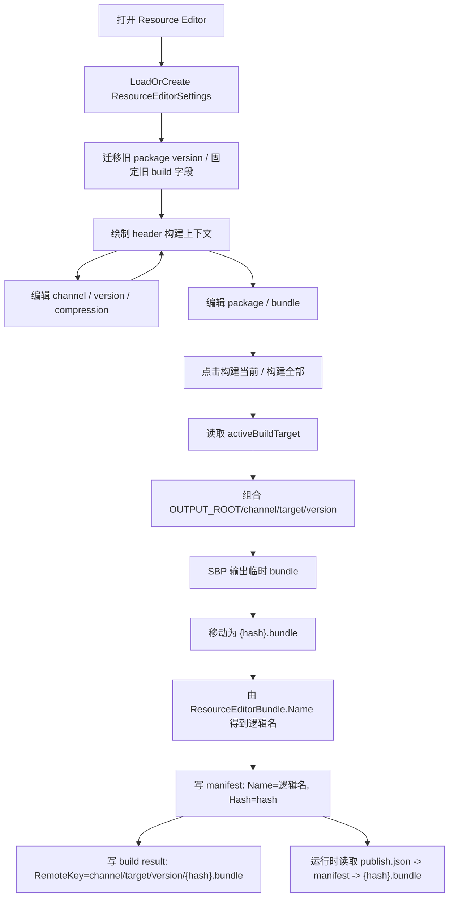

# resource-editor-build-context-manifest design

## 0. 术语约定

| 术语 | 当前定义 | 本次约定 |
|---|---|---|
| Resource Editor | `Assets/GameDeveloperKit/Editor/ResourceEditor/ResourceEditorWindow.cs`，维护 package / bundle / collector / build strategy，并发起本地 SBP 构建 | 继续作为资源配置和本地构建入口；本 feature 不修改另一会话的 `resource-settings-channel-inspector` design |
| Header 构建上下文 | 当前 header 只有标题、设置、构建全部、刷新、保存 | Header 直接承载发布渠道、manifest 版本、压缩方式、当前激活平台和输出目录摘要 |
| 设置页 | 当前 `build-settings-button` 打开 `build-settings-detail`，包含输出目录、发布渠道、目标平台、压缩方式、清单文件、清理输出 | 删除设置页和设置按钮；剩余需要操作的字段进入 header |
| Manifest 版本 | 当前 `ResourceManifestBuildWriter.ResolveVersion(context)` 单 package 使用 `ResourceEditorPackage.Version`，多 package 使用时间戳 | 改为全局构建版本，放在 header；`ManifestInfo.Version` 和版本输出目录都使用它 |
| Package 版本 | 当前 package 内容页显示 `package-version-field`，但源码 `PackageInfo` 没有版本字段 | 旧字段只作为兼容迁移来源；package 页不再展示版本 |
| 发布渠道 | 当前 `ResourceBuildSettings.Channel` 在设置页输入，默认 `dev` | Header 输入；只作为本地输出路径和 build result remote key 的 channel 片段，不管理 bucket / region / 凭证 |
| 清单文件名 | 当前 `ResourceSettings.MANIFEST_NAME` 已存在，但 `ResourceBuildSettings.ManifestFileName` 仍可填；Publisher / manifest fallback 里也还有裸 `"manifest.json"` | 固定使用 `ResourceSettings.MANIFEST_NAME`；Resource Editor 不再提供清单文件名输入，构建 / Publisher / runtime fallback 不再新增裸字符串 |
| 输出根目录 | 当前 `ResourceBuildSettings.OutputRoot` 可编辑，默认 `Build/ResourceBundles`；Publisher 本地版本扫描也读取这个旧字段 | 固定为 Editor-only 常量 `ResourceBuildSettings.OUTPUT_ROOT = "Build/ResourceBundles"`；实际版本目录为 `{channel}/{activeBuildTarget}/{version}`，Publisher 扫描同一根目录 |
| 目标平台 | 当前 `ResourceBuildSettings.Target` 可选，空值才回退 `EditorUserBuildSettings.activeBuildTarget` | 不再可选；构建总是使用当前激活平台，Header 只读显示 |
| SBP 构建名 | 当前 build strategy 的 `ResourceBuildPlanBundle.BundleName` 由 package / bundle / asset payload hash 计算，形如 `{contentHash}.bundle` | 只作为 SBP 内部构建名和 artifact 匹配 key；不再作为 runtime manifest 的逻辑 bundle 名 |
| Bundle 逻辑名 | 当前持久化 manifest 示例仍可能写 `dev/StandaloneWindows64/1.0.0/{hash}.bundle`；当前源码 writer 也会把 `BundleInfo.Name` 写成输出相对物理文件名或 remote key 文件名 | `BundleInfo.Name` 固定表示从 `ResourceEditorBundle.Name` 规范化得到的无后缀逻辑 bundle 名，例如 `bundle1`；运行时按它查 bundle 和依赖 |
| Bundle Hash | 当前源码 `BundleInfo` 仍没有 `Hash` 字段，hash 只在 `ResourceBuildArtifact.Hash` 中存在 | `BundleInfo` 增加 `Hash`；物理 AssetBundle 文件名固定为 `{Hash}.bundle` |
| RemoteKey | 当前 build result artifact 用 `RemoteKey` 表达上传 key | 继续只属于 build result / Publisher；不写入 runtime manifest 的 `BundleInfo.Name` 或 `Dependencies` |
| Publish pointer | 当前 `ResourceSettings.GetPublishAddress()` + `ResourceModule.PublishVersionOperationHandle` 已读取 `publish.json` 的 `version` | 作为已存在的远端 current version 机制保留；本 feature 只修正它和 manifest / bundle 地址组合的输入 |

防冲突结论：当前 `.codestable/architecture/ARCHITECTURE.md` 滞后，仍写着 `PackageInfo.Version/Hash` 与 `BundleInfo.Hash/Version`；源码中 `PackageInfo` 只有 `Name/Bundles`，`BundleInfo` 只有 `Name/Size/Crc/Assets/Dependencies`。本 design 以源码为准，只补 `BundleInfo.Hash`，不落地 `PackageInfo.Version`、`PackageInfo.Hash` 或 `BundleInfo.Version`。

## 1. 决策与约束

### 需求摘要

做什么：基于当前最新资源模块代码，改造 Resource Editor 的构建上下文：移到 header，删除设置页；固定 manifest 文件名、输出根目录、目标平台；修正 manifest 中 bundle 逻辑名、SBP 构建名和物理 hash 文件名混用的问题，并对已落地的 publish pointer / address helper 做边界收敛。

为谁：使用 Resource Editor 配置 package / bundle 并构建热更新资源的 Unity 开发者。

成功标准：

- 新 feature 独立落在 `2026-06-03-resource-editor-build-context-manifest`，不修改另一会话的 design 文件。
- Resource Editor header 可直接编辑发布渠道、manifest 版本、压缩方式，并只读展示 active build target 和版本输出目录。
- Resource Editor 不再显示设置按钮或设置页。
- Package 内容页不再显示版本字段；manifest 版本来自 header。
- 清单文件名固定使用 `ResourceSettings.MANIFEST_NAME`，不再读取旧 `BuildSettings.ManifestFileName` 用户值。
- 输出根目录固定使用 Editor const，Publisher 本地版本扫描也走同一常量；目标平台固定使用 `EditorUserBuildSettings.activeBuildTarget`。
- 新 manifest 中 `BundleInfo.Name = "bundle1"` 这类无后缀逻辑名，`BundleInfo.Hash = "{hash}"`，磁盘文件名为 `{hash}.bundle`。
- `Dependencies` 保存依赖 bundle 的无后缀逻辑名，不保存 remote key、hash 文件名或 `.bundle` 后缀。
- Web / bundle provider 用 `Hash` 生成物理文件名；旧 manifest 没有 `Hash` 时回退 `Name`。

假设：

- `CleanOutput` 不再暴露 UI，沿用内部默认 `true`；后续需要高级构建选项时另起 feature。
- 如果旧 settings 只有 package version，新 header version 可从当前选中 package / 第一个 package 的旧版本初始化一次。
- Bundle 逻辑名从 `ResourceEditorBundle.Name` 规范化并去掉 `.bundle` 后缀得到；`planBundle.BundleName` 继续是 SBP 内部构建名，不能写入 runtime manifest。
- `ResourceSettings` 的远端 ServerUrl / publish pointer 机制保留；本 feature 不重新设计 ResourceSettings Inspector。

### 明确不做

- 不修改 `.codestable/features/2026-06-03-resource-settings-channel-inspector/` 下的文件。
- 不做 ResourceSettings 自定义 Inspector，不管理 Publisher 渠道列表或远端 current version。
- 不在 Resource Editor 中保存 COS region、bucket、SecretId、SecretKey，或执行上传/回滚。
- 不新增 `PackageInfo.Version`、`PackageInfo.Hash`、`BundleInfo.Version`，不新增除 `BundleInfo.Hash` 之外的运行时 manifest 字段。
- 不继续让用户填写 manifest 文件名、输出根目录或目标平台。
- 不把 channel / platform / version / remote key / hash 文件名写入 `BundleInfo.Name` 或 `Dependencies`。
- 不改变 package / bundle / collector / checker 的核心编辑语义。

### 复杂度档位

- `Robustness = L2`：处理旧 settings 残留、空渠道、空版本、旧 target/output/manifest 字段、旧 manifest 无 hash、以及 remote ServerUrl 启动顺序。
- `Structure = functions/modules`：主体落在 ResourceEditor UI / settings / build writer / provider 寻址，不引入新子系统。
- `Compatibility = migration`：旧 ProjectSettings 能打开；旧 manifest 没有 `Hash` 时 provider 有回退路径。
- `Security = unchanged`：不接触对象存储凭证。

### 关键决策

1. 当前会话使用新 feature 文件，不续写旧 design。
   - 原因：旧文件属于另一会话上下文，不能作为当前会话默认修改目标。
   - 变化：本 design 位于 `.codestable/features/2026-06-03-resource-editor-build-context-manifest/resource-editor-build-context-manifest-design.md`。

2. Manifest 版本从 package 页上移到 header。
   - 原因：当前源码 `PackageInfo` 没有版本字段，package 页的“版本”容易让人误解成 package 版本。
   - 变化：`ResourceBuildSettings` 增加全局 `Version` / `ManifestVersion`；`ResourceManifestBuildWriter.ResolveVersion(context)` 只读这个版本。

3. 清单文件名、输出根目录、目标平台变成固定规则。
   - 原因：这些是构建协议和项目约定，不应在设置页里反复填写。
   - 变化：manifest 文件名用现有 `ResourceSettings.MANIFEST_NAME`；输出根目录用 `ResourceBuildSettings.OUTPUT_ROOT`；target 用 `EditorUserBuildSettings.activeBuildTarget`；Publisher 读取本地构建版本时也使用同一输出根常量。

4. `BundleInfo.Name` 和物理文件名分离。
   - 原因：运行时 `ManifestInfo.GetBundle(name)` 和依赖解析都以 `BundleInfo.Name` 作为逻辑 key；写成 remote key、`{hash}.bundle` 或当前 `planBundle.BundleName` 后，业务无法通过 `bundle1` 找到目标 bundle。
   - 变化：`BundleInfo.Name = NormalizeBundleLogicalName(planBundle.Bundle.Name)`，`BundleInfo.Hash = artifact.Hash`，物理文件名为 `{Hash}.bundle`。

5. Remote key 只属于发布域。
   - 原因：Publisher 上传需要 `dev/StandaloneWindows64/1.0.0/{hash}.bundle`，但 runtime manifest 不该把上传 key 当 bundle 身份。
   - 变化：`ResourceBuildArtifact.RemoteKey` 保留；manifest writer 不把它写进 `BundleInfo.Name` 或依赖。

6. Publish pointer 启动顺序要避免无版本 manifest 地址。
   - 原因：当前 `ResourceModule.Startup()` 先读取 `_setting.ManifestLocation`，而 `ManifestLocation => GetManifestAddress(string.Empty)` 在 `ServerUrl` 非空时会触发空 version 校验。
   - 变化：远端模式下先读取 `publish.json` 得到 `_currentVersion`，再调用 `GetManifestAddress(_currentVersion)`；本地模式才使用 `ManifestLocation` / `MANIFEST_NAME`。

## 2. 名词与编排

### 2.1 名词层

#### 现状

`ResourceSettings` 当前已经包含远端发布地址入口：

```csharp
// 来源：Assets/GameDeveloperKit/Runtime/Resource/ResourceSettings.cs
public const string MANIFEST_NAME = "manifest.json";
public string ChannelId;
public string ChannelName;
public string ServerUrl;
public string ManifestName = MANIFEST_NAME;
public string ManifestLocation => GetManifestAddress(string.Empty);
public string GetPublishAddress();
public string GetManifestAddress(string version);
public string GetAssetAddress(string name, string version);
```

当前风险：`ManifestLocation` 在 `ServerUrl` 非空时会用空 version 调 `GetManifestAddress(string.Empty)`；`ResourceModule.Startup()` 又在读取 publish pointer 前先取 `ManifestLocation`，远端配置下可能提前抛出 `Version cannot be empty.`。

`ResourceModule` 当前有 `_currentVersion` 和 `CurrentVersion`，远端模式通过 `PublishVersionOperationHandle` 读取 `publish.json` 中的 `version`，再用 `GetManifestAddress(_currentVersion)` 读取 manifest。`WebAssetProvider` 已经改为通过 `settings.GetAssetAddress(bundleInfo.Name, version)` 拼 URL，但仍把 `bundleInfo.Name` 作为物理文件名输入。

`ResourceBuildSettings` 当前仍包含可编辑的输出根目录、目标平台、渠道、清理输出、压缩方式、manifest 文件名和构建范围：

```csharp
// 来源：Assets/GameDeveloperKit/Editor/ResourceEditor/ResourceEditorSettings.cs
[SerializeField] private string m_OutputRoot = "Build/ResourceBundles";
[SerializeField] private string m_Target;
[SerializeField] private string m_Channel = "dev";
[SerializeField] private bool m_CleanOutput = true;
[SerializeField] private ResourceBuildCompression m_Compression = ResourceBuildCompression.Lz4;
[SerializeField] private string m_ManifestFileName = "manifest.json";
```

`ResourceEditorPackage` 当前包含 `m_Version = "1.0.0"`，并且 UXML 的 package 内容页显示 `package-version-field`。`ResourceManifestBuildWriter.ResolveVersion(context)` 当前单 package 使用 package version，多 package 使用时间戳。

`ResourceEditorWindow.uxml` 当前 header 只有操作按钮；构建设置隐藏在 `build-settings-detail` 里，包含输出目录、发布渠道、目标平台、压缩方式、清单文件和清理输出。

`SingleBundleBuildStrategy.CreateBundleBuildName()` 当前按 package / bundle / resource payload 计算 hash，并把 `ResourceBuildPlanBundle.BundleName` 设为 `{contentHash}.bundle`；这个名字现在同时被 SBP 用作 `assetBundleName`、被 artifact 用作匹配 key、又被 manifest writer 当作 fallback。

`ResourceBuildExecutor.BuildResult()` 已经把物理 bundle 文件移动成 `{hash}.bundle`，并把 remote key 保存在 `ResourceBuildArtifact.RemoteKey`。`ResourceManifestBuildWriter.Build()` 当前通过 `ResolveBundleName()` 把 `BundleInfo.Name` 写成相对输出物理文件名或 remote key 文件名；当前仓库 `Build/ResourceBundles/dev/StandaloneWindows64/1.0.0/manifest.json` 仍可见 `Name = "dev/StandaloneWindows64/1.0.0/{hash}.bundle"` 这类旧输出。依赖也会被转换成物理文件名。

`ResourceUploadPlanBuilder` / `ResourcePublisherWindow` 已经能从版本目录扫描 `manifest.json` 和 `.bundle` 生成上传计划，但当前扫描根目录来自 `ResourceEditorSettings.BuildSettings.OutputRoot`，清单名仍有裸 `"manifest.json"`。

`BundleInfo` 当前源码只有 `Name`、`Size`、`Crc`、`Assets`、`Dependencies`，没有 `Hash`。运行时 `ManifestInfo.GetBundle(bundleName)` 用 `BundleInfo.Name` 查找；`BundleMode` / `WebGLMode` 依赖解析也通过 `manifest.GetBundle(dependencyName)` 找逻辑依赖。

#### 变化

`ResourceBuildSettings` 收敛为少量可变上下文：

- `public const string OUTPUT_ROOT = "Build/ResourceBundles"`：固定输出根目录。
- `Version` / `ManifestVersion`：header 版本，默认 `1.0.0`。
- `Channel`：header 渠道，默认 `dev`。
- `Compression`：header 压缩方式。
- `Scope`：仍由“构建当前 / 构建全部”调用点决定。
- 旧 `OutputRoot`、`Target`、`ManifestFileName` 字段可保留用于反序列化兼容，但新构建不读取其用户值。
- `CleanOutput` 若保留，内部默认 `true`，无 UI。

`ResourceEditorPackage.Version` 降级为旧字段：package 内容页不展示；新构建不读取。旧值只在 header version 为空时作为一次性迁移来源。

`ResourceBuildPlanBundle.BundleName` 继续服务 SBP 和 artifact 匹配，不再进入 runtime manifest。新增或复用一个逻辑名规范化规则，把 `ResourceEditorBundle.Name` 转为无后缀 runtime bundle key：

- 输入 `bundle1` / `bundle1.bundle` → `bundle1`。
- 空名仍由现有 checker 拦截，不在 writer 中静默 fallback 成 hash。
- 该逻辑名用于 `BundleInfo.Name`、`ManifestInfo.GetBundle()`、依赖列表和业务侧加载定位。

`BundleInfo` 增加 hash：

```csharp
// 来源：Assets/GameDeveloperKit/Runtime/Resource/Manifest/BundleInfo.cs
public string Name;
public string Hash;
```

新 manifest 语义：

- `Name`：无后缀逻辑 bundle 名，例如 `bundle1`。
- `Hash`：构建产物 hash，例如 `569d960b6792b206969a19d87b9f2f59`。
- 物理文件名：`{Hash}.bundle`。
- `Dependencies`：依赖 bundle 的逻辑名列表。
- `RemoteKey`：只在 `ResourceBuildArtifact` / Publisher 上传计划中存在。

Provider 寻址统一规则：

- 如果 `BundleInfo.Hash` 非空，加载文件名为 `{Hash}.bundle`。
- 如果 `BundleInfo.Hash` 为空，回退使用 `BundleInfo.Name` 原值，兼容旧 manifest；新 manifest 必须有 `Hash`，因为新 `Name` 不表达物理文件名。
- Web 模式把该文件名传给 `ResourceSettings.GetAssetAddress(fileName, CurrentVersion)`。
- Bundle / local 模式按同一个物理文件名从文件系统读取。

`ResourceSettings` 保持现有 publish pointer 语义：

- `GetPublishAddress()` 返回 `{ServerUrl}/{runtimePlatform}/publish.json`。
- `GetManifestAddress(version)` 返回 `{ServerUrl}/{runtimePlatform}/{version}/{MANIFEST_NAME}`。
- `GetAssetAddress(fileName, version)` 返回 `{ServerUrl}/{runtimePlatform}/{version}/{fileName}`。
- Startup 不能在远端 version 未知时调用 `ManifestLocation`。

Publisher 本地扫描规则：

- 版本根目录从 `ResourceBuildSettings.OUTPUT_ROOT/channel/buildTarget/version` 推导。
- Manifest 文件名使用 `ResourceSettings.MANIFEST_NAME`。
- Publisher channel 的 `BuildTarget` 仍是发布工具选择本地平台目录的输入；Resource Editor 构建本身不再读取旧 `BuildSettings.Target`。

Header UI 新元素：

- `build-channel-field`：发布渠道。
- `build-version-field`：manifest 版本。
- `build-compression-dropdown`：压缩方式。
- `build-target-label`：只读 active build target。
- `build-output-label`：只读版本输出目录，例如 `Build/ResourceBundles/dev/StandaloneWindows64/1.0.0`。
- `build-status-label`：最后一次构建结果。

### 2.2 编排层



#### 现状

- Header 只有“设置 / 构建全部 / 刷新 / 保存”。
- 点击“设置”切换到 `build-settings-detail`。
- Package 页显示 `package-version-field`。
- `CreateBuildSettings(scope)` 复制旧 `OutputRoot`、`Target`、`Channel`、`CleanOutput`、`Compression`、`ManifestFileName`。
- 构建输出路径来自可编辑 output root + 可编辑 target + channel + version。
- Build strategy 当前把 `planBundle.BundleName` 生成为内容 hash `.bundle`；它不是用户配置的 bundle 逻辑名。
- Manifest writer 当前将 `BundleInfo.Name` 写为 remote key 或 `{hash}.bundle` 物理文件名，依赖也写物理文件名。
- Publisher 当前按旧 `BuildSettings.OutputRoot` 扫描本地版本，且仍有裸 `"manifest.json"`。
- Runtime 远端启动已有 publish pointer 流程，但 `ManifestLocation` 的空 version 调用会干扰远端启动顺序。

#### 变化

1. 初始化与迁移：
   - `EnsureDefaults()` 保证 `Channel`、`Version`、`Compression` 有值。
   - Header version 为空时，用旧 package version 填充一次。
   - 旧 `OutputRoot`、`Target`、`ManifestFileName` 重置到固定值或忽略，避免残留影响构建。

2. Header 编排：
   - 删除 UXML 中的设置按钮和 `build-settings-detail`。
   - Header 增加 channel、version、compression、active target、output summary。
   - 修改 header 字段只保存 settings 和刷新摘要，不触发构建。

3. Package 编排：
   - 删除 package version 输入和绑定。
   - Package 设置保留名称、资源类型、打包方式和 bundle 管理。

4. 构建编排：
   - 构建前验证 channel / version 非空。
   - target 固定读取 `EditorUserBuildSettings.activeBuildTarget`。
   - output root 固定为 `ResourceBuildSettings.OUTPUT_ROOT`。
   - manifest 文件固定为 `ResourceSettings.MANIFEST_NAME`。
   - SBP 构建出的文件按 hash 重命名为 `{hash}.bundle`。

5. Manifest 编排：
   - `BundleInfo.Name` 写 `ResourceEditorBundle.Name` 规范化后的无后缀逻辑名。
   - `BundleInfo.Hash` 写 `artifact.Hash`。
   - `Dependencies` 将 SBP / artifact 里的内部构建名翻译为依赖 bundle 的逻辑名。
   - build result / upload plan 的 `RemoteKey` 继续写 `{channel}/{target}/{version}/{hash}.bundle`，供 Publisher 使用。

6. Runtime provider 编排：
   - Provider 从 `BundleInfo.Hash` 推导物理文件名。
   - 旧 manifest 没有 hash 时回退 `BundleInfo.Name`。
   - `ManifestInfo.GetBundle(name)` 和依赖解析继续按逻辑名工作。
   - Web provider 将物理文件名传给 `GetAssetAddress(fileName, CurrentVersion)`。

7. Remote startup 编排：
   - 如果 `ServerUrl` 为空，按本地 `ManifestLocation` / `MANIFEST_NAME` 加载 manifest。
   - 如果 `ServerUrl` 非空，先通过 `GetPublishAddress()` 读取 publish pointer，再用版本调用 `GetManifestAddress(version)`。
   - 不在 version 未知时调用 `GetManifestAddress(string.Empty)`。

8. Publisher 本地扫描编排：
   - 扫描根目录使用 `ResourceBuildSettings.OUTPUT_ROOT`，不再读取旧 `settings.BuildSettings.OutputRoot`。
   - 查找 manifest 使用 `ResourceSettings.MANIFEST_NAME`。
   - 上传远端 key 仍由 Publisher channel + build target + manifest version + 文件名组成。

#### 流程级约束

- 空 channel / 空 version 不能构建，必须返回可见错误。
- 旧 target 即使存在，也不能覆盖 active build target。
- 旧 manifest 文件名即使不是 `manifest.json`，新构建也必须输出 `ResourceSettings.MANIFEST_NAME`。
- 新 manifest 的 `BundleInfo.Name` 不得包含 channel、platform、version、hash 文件路径或 remote key。
- 新 manifest 的 `BundleInfo.Name` 不得包含 `.bundle` 后缀。
- 新 manifest 的 `BundleInfo.Name` 不得等于 `planBundle.BundleName` 这种带后缀 payload hash 构建名。
- `BundleInfo.Hash` 非空时，物理文件名必须是 `{Hash}.bundle`。
- `Dependencies` 不写 remote key、hash 文件名或 `.bundle` 后缀。
- 远端启动必须先得到 publish version，再读取 version manifest。
- Runtime 不引用 ResourceEditor、SBP、Publisher 或对象存储类型。

### 2.3 挂载点清单

1. Header 构建上下文字段：删除后用户无法直观看到或切换 channel / version / compression。
2. 全局 manifest version：删除后构建版本又回到 package version / 时间戳推导。
3. 固定 manifest/output/target 规则：删除后设置页歧义和旧字段残留会回来。
4. `BundleInfo.Hash` + provider hash 文件名规则：删除后无法同时保留逻辑 bundle 名和 `{hash}.bundle` 物理文件。
5. Manifest writer 的逻辑名输出：删除后 `BundleInfo.Name` 会再次承载物理文件名。
6. Publisher 固定根目录 / manifest 常量读取：删除后 Publisher 又会被旧 output root 和裸 manifest 字符串影响。
7. Remote startup 顺序：删除后远端 ServerUrl 可能在 version 未知时生成 manifest 地址。

拔除沙盘：移除本 feature 后，Resource Editor 回到“设置页 + package version + 可填 output/target/manifest”的旧形态；manifest 也回到 `BundleInfo.Name` 写 `{hash}.bundle` 物理文件名的旧行为，远端启动仍可能被空 version 地址干扰。

### 2.4 推进策略

1. 构建模型收敛：新增全局 version、固定 `OUTPUT_ROOT`，改构建链路统一使用现有 `ResourceSettings.MANIFEST_NAME`。
   - 退出信号：settings 默认值齐全；新构建不读取旧 output / target / manifest filename 用户值。
2. Header UI 改造：删除设置页和 package version，header 增加 channel / version / compression / target / output 摘要。
   - 退出信号：打开 Resource Editor 看不到“设置”按钮和 package 版本字段。
3. 构建路径规则改造：构建使用 active target、固定 output root、固定 manifest name、header version。
   - 退出信号：旧 settings 残留不会改变输出路径或 manifest 文件名。
4. Bundle 逻辑名和 hash 分离：`BundleInfo` 增加 `Hash`，manifest writer 从 `ResourceEditorBundle.Name` 输出逻辑 name，并把 artifact/SBP 依赖翻译成逻辑 dependencies。
   - 退出信号：配置 bundle 名为 `bundle1` 或 `bundle1.bundle` 时，manifest 中 `Name = bundle1`、`Hash = 569d...`，依赖列表不含 channel/platform/version/hash 文件名或 `.bundle` 后缀。
5. Runtime provider 寻址：provider 用 hash 生成 `{hash}.bundle`，旧 hash 为空时回退 name。
   - 退出信号：新 manifest 能加载 hash 文件；旧 manifest 仍能按 name 加载。
6. Publisher 常量同步：Publisher 本地版本扫描使用固定 output root 和 `ResourceSettings.MANIFEST_NAME`。
   - 退出信号：旧 output root 用户值不会影响 Publisher 发现 `Build/ResourceBundles/{channel}/{target}/{version}/manifest.json`。
7. Remote startup 收口：调整 `ResourceModule.Startup()` 或 `ManifestLocation` 语义，避免远端 version 未知时调用 `GetManifestAddress("")`。
   - 退出信号：`ServerUrl` 非空时先读取 publish pointer，再读取 version manifest；本地模式仍能读取 `MANIFEST_NAME`。
8. 验证收尾：覆盖 header、旧字段残留、manifest 输出、provider 兼容、Publisher 扫描、publish pointer 和 Runtime 边界。
   - 退出信号：验收契约均有可观察证据。

### 2.5 结构健康度与微重构

##### 评估

- compound convention 检索：未命中“目录组织 / 文件归属 / 命名约定 / ResourceEditor header / manifest hash / publish pointer”相关 convention decision。
- 历史文档冲突：`ARCHITECTURE.md` 和早期 design 写过 `PackageInfo.Version/Hash`、`BundleInfo.Hash/Version`，但源码当前没有；本 feature 以源码为准，只把 `BundleInfo.Hash` 写成显式变化。
- 文件级 — `ResourceEditorWindow.cs`：约 1300 行，偏胖；本次删除设置页状态和 package version 绑定，净复杂度下降。
- 文件级 — `ResourceEditorSettings.cs`：集中编辑器配置模型，本次调整字段默认值和版本来源，职责仍合理。
- 文件级 — `ResourceBuildExecutor.cs` / `ResourceManifestBuildWriter.cs`：已承载构建执行和 manifest 写出，本次只改参数来源和输出语义。
- 文件级 — `DefaultResourceEditorExtensions.cs`：当前 build strategy 用 payload hash 生成 `planBundle.BundleName`；本次只需明确它是 SBP 内部名，不把它写进 runtime manifest。
- 文件级 — `ResourcePublisherWindow.cs` / `ResourceUploadPlanBuilder.cs`：Publisher 已独立存在，本次只同步固定 output root / manifest 常量读取，不改变上传、bucket、凭证或回滚行为。
- 文件级 — `BundleInfo.cs`：约 50 行，新增 `Hash` 字段不造成职责混杂。
- 文件级 — `ResourceSettings.cs` / `ResourceModule.cs`：当前已新增 publish pointer 地址函数和 `_currentVersion` 编排；本次只是修正启动顺序和 bundle 文件名入参，不需要先拆文件。
- 目录级 — `Assets/GameDeveloperKit/Editor/ResourceEditor/Build/` 已经承载 build models / workflow / executor / manifest writer / utilities，目标目录不挤。

##### 结论：不做既有行为微重构

本次不先拆 `ResourceEditorWindow.cs` 或 `ResourceModule.cs`。原因：改动以删除设置页、收敛字段、修正 manifest 语义和启动顺序为主；先拆文件会把结构整理和行为修正混在一起，增加验收成本。

实现阶段应定点修改 UXML/USS、窗口绑定、build settings、build executor、manifest writer、runtime bundle provider、Publisher 本地扫描、`BundleInfo`、以及 `ResourceModule.Startup()` 的 publish pointer 顺序。不新增大块平行系统。

##### 超出范围的观察

`ResourceEditorWindow.cs` 仍混合窗口绑定、bundle 绘制、标签编辑、检查跳转和构建调用。后续若继续增加 Resource Editor 交互，建议单独走 `cs-refactor` 拆视图控制器。

## 3. 验收契约

| 编号 | 输入 / 触发 | 期望可观察结果 |
|---|---|---|
| N1 | 查看 CodeStable feature 目录 | 存在新的 `2026-06-03-resource-editor-build-context-manifest` design，不修改 `resource-settings-channel-inspector` |
| N2 | 打开 Resource Editor | Header 显示 channel、manifest version、compression、active build target、output summary |
| N3 | 打开 Resource Editor | 不存在“设置”按钮和构建设置页 |
| N4 | 选中 package | Package 页不显示版本字段 |
| N5 | header version 为 `1.0.0` 后构建 | 输出目录包含 `/1.0.0/`，manifest `Version` 为 `1.0.0` |
| N6 | 旧 `BuildSettings.Target` 指向非 active target | 新构建使用 `EditorUserBuildSettings.activeBuildTarget` |
| N7 | 旧 `BuildSettings.ManifestFileName = "abc.json"` | 新构建仍输出 `manifest.json` |
| N8 | 旧 `BuildSettings.OutputRoot` 指向自定义目录 | 新构建仍使用固定 `Build/ResourceBundles` 根目录 |
| N9 | 编辑器 bundle 名为 `bundle1` 或 `bundle1.bundle`，构建 hash 为 `569d960b6792b206969a19d87b9f2f59` | manifest 写 `Name = "bundle1"`、`Hash = "569d960b6792b206969a19d87b9f2f59"` |
| N10 | 同一次构建落盘 bundle | 文件名是 `569d960b6792b206969a19d87b9f2f59.bundle` |
| N11 | bundle A 依赖 bundle B | `Dependencies` 保存 B 的无后缀逻辑名，不保存 remote key、hash 文件名或 `.bundle` 后缀 |
| N12 | 查看 build result | artifact `RemoteKey` 仍为 `{channel}/{target}/{version}/{hash}.bundle` |
| N13 | 打开 Publisher 查看本地构建版本 | 从固定 `Build/ResourceBundles/{channel}/{target}` 读取版本，不受旧 `BuildSettings.OutputRoot` 用户值影响 |
| N14 | `ServerUrl` 非空启动资源模块 | 先请求 `{ServerUrl}/{runtimePlatform}/publish.json`，得到 version 后再请求 `{ServerUrl}/{runtimePlatform}/{version}/manifest.json` |
| N15 | Web provider 加载 hash manifest bundle | URL 以 `{version}/{Hash}.bundle` 结尾，而不是 `{version}/{BundleInfo.Name}` |
| B1 | channel 为空白并点击构建 | 构建失败并提示 channel 不能为空，不创建畸形目录 |
| B2 | version 为空白并点击构建 | 构建失败并提示 version 不能为空，不回退时间戳 |
| B3 | 旧 manifest 没有 `BundleInfo.Hash` | Provider 回退按 `BundleInfo.Name` 加载，旧 manifest 不直接失效 |
| B4 | `ServerUrl` 非空但 publish pointer 无 version | 启动失败并提示 publish version 缺失，不尝试空 version manifest 地址 |
| E1 | 新 manifest 的 `BundleInfo.Name` 包含 `dev/StandaloneWindows64/1.0.0`、hash 文件名或 `.bundle` 后缀 | 判定为失败 |
| E2 | 新 manifest 的 `BundleInfo.Name` 等于 `ResourceBuildPlanBundle.BundleName` 这种 payload hash 构建名 | 判定为失败 |
| E3 | 新 manifest 的 `Dependencies` 包含 remote key、payload hash 构建名、hash 文件名或 `.bundle` 后缀 | 判定为失败 |
| E4 | 实现新增 `PackageInfo.Version`、`PackageInfo.Hash` 或 `BundleInfo.Version` | 判定为超范围 |
| E5 | Runtime asmdef 引用 ResourceEditor / SBP / Publisher 类型 | 判定为失败 |
| E6 | Resource Editor 新增 COS 凭证、bucket、region、上传或回滚入口 | 判定为失败 |
| E7 | 代码新增裸字符串 `"manifest.json"` 表达资源清单协议 | 判定为失败，应使用 `ResourceSettings.MANIFEST_NAME` |

### 明确不做的反向核对项

- 不修改另一会话的 `resource-settings-channel-inspector` design。
- 不恢复设置页。
- 不显示 package 版本字段。
- 不暴露 manifest 文件名、输出根目录、目标平台输入。
- 不把 remote key、hash 文件名写入 runtime manifest 的 `Name` 或 `Dependencies`。
- 不让 runtime manifest 的 `Name` 或 `Dependencies` 带 `.bundle` 后缀。
- 不把 payload hash 生成的 `ResourceBuildPlanBundle.BundleName` 写入 runtime manifest 的 `Name` 或 `Dependencies`。
- 不新增 `PackageInfo.Version`、`PackageInfo.Hash`、`BundleInfo.Version` 或除 `BundleInfo.Hash` 之外的 manifest 字段。
- 不新增 Publisher 上传 / 回滚 / 凭证 UI。

## 4. 与项目级架构文档的关系

验收通过后需要更新 `.codestable/architecture/ARCHITECTURE.md`：

- Resource Editor 小节记录：构建上下文在 header 中维护，包含 channel、manifest version、compression、active target 和 output summary。
- Resource build 小节记录：manifest 文件名固定为 `ResourceSettings.MANIFEST_NAME`，输出根目录固定为 Editor const，target 总是 active build target。
- Resource manifest 小节记录：`ManifestInfo.Version` 来自 header 全局版本。
- Resource manifest 小节记录：`BundleInfo.Name` 是从 `ResourceEditorBundle.Name` 规范化来的无后缀逻辑 bundle 名，`BundleInfo.Hash` 是物理文件 hash，AssetBundle 文件名为 `{Hash}.bundle`。
- Resource runtime 小节记录：远端启动先读 publish pointer 再读 version manifest；bundle provider 用 hash 文件名加载，旧 hash 为空回退 name。
- Resource publisher 小节记录：本地版本扫描使用固定输出根目录和 `ResourceSettings.MANIFEST_NAME`；remote key 属于 build result / Publisher 上传计划，不写入 runtime manifest 的 bundle identity。
