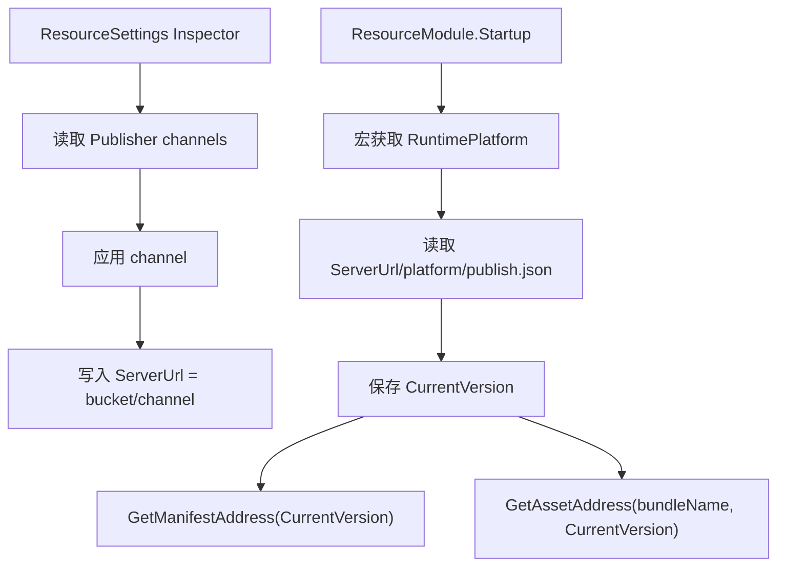

# resource-settings-channel-inspector design

## 0. 术语约定

| 术语 | 当前定义 | 本次约定 |
|---|---|---|
| `ResourceSettings` | Runtime `ScriptableObject`，当前包含 `Mode`、`DefaultPackages`、`ServerUrl`、`ManifestName`、`CachePath`，`ManifestLocation` 被 `ResourceModule` 读取 | 继续是运行时唯一配置入口；Inspector 从 Publisher channel 写入渠道根地址，不再让用户手填 URL |
| `ServerUrl` | 当前唯一的资源服务器地址字段 | 渠道根地址，形如 `https://{bucket}.cos.{region}.myqcloud.com/{channel}`；不直接指向 manifest，不包含 platform / version |
| `RuntimePlatform` | 当前运行时没有资源平台字符串；构建输出目录使用 `BuildTarget.ToString()` | 运行时用 Unity 平台宏推导的构建平台片段，例如 `UNITY_STANDALONE_WIN -> StandaloneWindows64`、`UNITY_ANDROID -> Android` |
| current version | 当前由 Publisher 远端 `{channel}/{platform}/publish.json` 指针表达 | `ResourceModule.Startup()` 远程读取的资源版本，只保存在运行时模块状态中，不序列化到 `ResourceSettings` |
| `GetManifestAddress(version)` | 当前不存在，`ResourceModule` 直接读 `ManifestLocation` | 新运行时地址函数，返回 `{ServerUrl}/{RuntimePlatform}/{version}/{ManifestName}` |
| `GetAssetAddress(name, version)` | 当前不存在，`WebAssetProvider` 直接拼 `ServerUrl + BundleInfo.Name` | 新运行时地址函数，返回 `{ServerUrl}/{RuntimePlatform}/{version}/{name}`，`name` 是版本目录内的 bundle 相对名 |
| `PublisherChannel` | 发布渠道配置，当前保存 `ChannelId`、`ChannelName`、`BuildTarget`、`PlatformId`、`RegionId`、`BucketName` 和凭证 | Inspector 的渠道来源；Runtime 不引用 Publisher 类型或凭证 |

防冲突结论：`Channel` 仍属于 Resource Publisher 的发布目标概念。本 feature 不把 Publisher 带进 Runtime，只让 `ResourceSettings` 保存可运行的 channel 根地址，运行时再按平台和远端 current version 组合资源地址。

## 1. 决策与约束

### 需求摘要

做什么：重写 `ResourceSettings` 的 Unity Inspector，让开发者从 Resource Publisher 的 channel 列表里选择渠道。Inspector 解析 bucket / region / channel 并写入 `ServerUrl = https://{bucket}.cos.{region}.myqcloud.com/{channel}`。运行时 `ResourceModule.Startup()` 先按当前平台读取远端 `publish.json` 得到 current version，再用 `GetManifestAddress(version)` 加载 manifest；bundle 加载用 `GetAssetAddress(name, version)`。

为谁：配置 `Assets/Resources/ResourceSettings.asset`、需要让运行时指向 Publisher 已发布渠道的 Unity 开发者。

成功标准：

- `ResourceSettings` Inspector 显示 Publisher channels，默认不暴露手填 URL。
- 应用 channel 后，`ServerUrl` 只到 channel 层，例如 `https://bucket.cos.ap-shanghai.myqcloud.com/dev`。
- `ResourceSettings` 不保存 platform，也不保存 publish version。
- Runtime platform 由 Unity 宏推导，结果必须匹配 Resource Editor / Publisher 使用的 build target 目录名。
- `ResourceModule.Startup()` 先读取 `{ServerUrl}/{runtimePlatform}/publish.json`，再用返回的 version 读取 manifest。
- `WebAssetProvider` 通过 `GetAssetAddress(bundleName, currentVersion)` 加载 bundle，不手工拼 `ServerUrl + BundleInfo.Name`。
- Runtime 不引用 `ResourcePublisherSettings`、`IObjectStorageProvider`、COS SDK 或任何 Editor-only 类型。

假设：

- 首版 current version 指针沿用 Publisher 当前 `publish.json` 形态，例如 `{ "version": "1.0.0" }`。
- COS 首版地址规则为 `https://{bucket}.cos.{region}.myqcloud.com/{channel}`；后续自定义 CDN 域名可通过 Publisher/provider 地址能力扩展，不在 Runtime 写对象存储细节。
- 当 `ServerUrl` 为空时，资源模块保持本地 manifest 回退行为，不强制远程读取 current version。

### 明确不做

- 不在 `ResourceSettings` 里保存 platform / publish version / SecretId / SecretKey。
- 不让 Runtime 读取 `ProjectSettings/GameDeveloperKitResourcePublisherSettings.asset`。
- 不在 Inspector 里执行上传、回滚、删除 bucket、设置 current version 或重新构建资源。
- 不新增 `ManifestInfo` / `PackageInfo` / `BundleInfo` / `AssetInfo` 字段。
- 不把 channel / platform / version 重复写进 `ServerUrl`、`ManifestName` 和 `BundleInfo.Name` 三个位置。
- 不实现 CDN 刷新、灰度、差量补丁或运行时按用户区服动态切换 channel。

### 复杂度档位

- `Robustness = L3`：Inspector 读取 ProjectSettings、解析 provider 地址、运行时远程读取 current version 都是外部失败源，错误必须明确。
- `Structure = modules`：Inspector 绘制、地址解析、Runtime 地址组合、Startup current version 读取分文件/函数承载。
- `Security = validated`：凭证只留在 Publisher；错误消息和资产文件不出现 SecretId / SecretKey。
- `Compatibility = current-only`：不保留 `Url` / `url` 两个旧字段；`ManifestLocation` 可以保留为本地回退入口。

### 关键决策

1. `ResourceSettings` 只保存 channel 根地址，不保存 platform / publish version。
   - 原因：platform 是运行环境属性，必须由 Player 宏决定；publish version 是远端 current 指针，必须由 `Startup()` 实时读取。
   - 反例：把 `Platform` 或 `PublishVersion` 序列化进 `ResourceSettings.asset` 会导致换平台或远端回滚后 Player 仍读旧配置。

2. Runtime 增加地址函数，version 作为参数传入。
   - `GetManifestAddress(version)`：拼 manifest 地址。
   - `GetAssetAddress(name, version)`：拼 bundle 地址。
   - 原因：version 属于本次运行时启动状态，不属于 settings 静态配置。

3. Runtime platform 用宏映射到构建目录名。
   - 映射必须与 Resource Editor 输出目录 / Publisher upload key 使用的 `BuildTarget.ToString()` 一致。
   - 示例：`UNITY_STANDALONE_WIN -> StandaloneWindows64`，`UNITY_ANDROID -> Android`，`UNITY_IOS -> iOS`，`UNITY_WEBGL -> WebGL`。

4. `BundleInfo.Name` 在运行时寻址中应作为版本目录内相对名传给 `GetAssetAddress(name, version)`。
   - 原因：如果 manifest 中继续保存 `channel/platform/version/*.bundle`，新地址函数会重复拼 channel/platform/version。
   - 实现阶段可兼容旧 full key 并剥离前缀，但新构建 manifest 应输出相对名。

## 2. 名词与编排

### 2.1 名词层

#### 现状

`Assets/GameDeveloperKit/Runtime/Resource/ResourceSettings.cs` 当前提供：

```csharp
public sealed class ResourceSettings : ScriptableObject
{
    public ResourceMode Mode;
    public string[] DefaultPackages;
    public string ServerUrl;
    public string ManifestName = "manifest.json";
    public string CachePath;
    public string ManifestLocation
    {
        get
        {
            var manifestName = string.IsNullOrWhiteSpace(ManifestName) ? "manifest.json" : ManifestName;
            if (string.IsNullOrWhiteSpace(ServerUrl))
            {
                return manifestName;
            }

            return $"{ServerUrl.TrimEnd('/')}/{manifestName.TrimStart('/')}";
        }
    }
}
```

`ResourceModule.Startup()` 通过 `Resources.Load<ResourceSettings>("ResourceSettings")` 加载配置，然后用 `ResourceSettings.ManifestLocation` 读取 manifest。`WebAssetProvider.InitializeBundleOperationHandle` 用 `ResourceSettings.ServerUrl + BundleInfo.Name` 加载远端 bundle。

`ResourceBuildExecutor` 当前远端 key 形态为 `{channel}/{platform}/{version}/{file}`。当前 build manifest 可能把完整 key 写进 `BundleInfo.Name`，例如 `dev/StandaloneWindows64/1.0.0/569d.bundle`。

#### 变化

`ResourceSettings` 保留 / 增加的运行时安全字段：

- `ChannelId`：选中的 Publisher channel 稳定 id，仅用于 Inspector 下次打开时定位渠道。
- `ChannelName`：显示快照，仅用于人工排查。
- `ServerUrl`：保存 channel 根地址，例如 `https://bucket.cos.ap-shanghai.myqcloud.com/dev`。
- `ManifestName`：manifest 文件名，默认 `manifest.json`。

`ResourceSettings` 不增加 `Platform` / `PublishVersion` serialized 字段。

`ResourceSettings` 对外地址接口变化：

```csharp
// 来源：Assets/GameDeveloperKit/Runtime/Resource/ResourceSettings.cs
public string GetManifestAddress(string version)
{
    if (string.IsNullOrWhiteSpace(ServerUrl))
    {
        return ResolveManifestName();
    }

    return CombineAddress(ServerUrl, GetRuntimePlatform(), version, ResolveManifestName());
}

public string GetAssetAddress(string name, string version)
{
    ValidateAssetName(name);
    return CombineAddress(ServerUrl, GetRuntimePlatform(), version, NormalizeBundleName(name, version));
}

public string GetPublishAddress()
{
    return CombineAddress(ServerUrl, GetRuntimePlatform(), "publish.json");
}
```

`GetPublishAddress()` 可是公开或内部 helper；它服务 `ResourceModule.Startup()` 读取 current version。`GetAssetAddress(name, version)` 中的 `name` 约定为版本目录内相对路径，例如 `569d960b.bundle` 或 `Package1/Bundle1.bundle`。兼容期可剥离旧 `{channel}/{platform}/{version}/` 前缀。

新增 / 调整 Runtime 名词：

- `ResourceModule.CurrentVersion`：Startup 从远端 current 指针读取到的版本，只在本次运行时保存。
- `ResourcePublishPointer` 或等价内部 DTO：解析 `publish.json` 的 `version` 字段；不进入 manifest schema。
- `RuntimeResourcePlatform` 或 helper 函数：用 Unity 宏返回平台片段。

新增 Editor-only 名词：

- `ResourceSettingsEditor`：`CustomEditor(typeof(ResourceSettings))`，绘制 mode/default packages/cache path/channel 选择、地址预览和应用按钮。
- `ResourceChannelOption`：Inspector 列表项，包含 channel id、显示名、build target、platform、region、bucket、发布状态。
- `ResourceChannelAddressResolver`：读取 Publisher settings / provider 地址能力，返回 channel 根地址和预览信息。

接口示例：

```csharp
// 输入：COS channel dev / ap-shanghai / bucket-name，运行时 UNITY_STANDALONE_WIN，远端 current version 1.0.0
ServerUrl = "https://bucket-name.cos.ap-shanghai.myqcloud.com/dev";
GetPublishAddress() = "https://bucket-name.cos.ap-shanghai.myqcloud.com/dev/StandaloneWindows64/publish.json";
GetManifestAddress("1.0.0") = "https://bucket-name.cos.ap-shanghai.myqcloud.com/dev/StandaloneWindows64/1.0.0/manifest.json";
GetAssetAddress("x.bundle", "1.0.0") = "https://bucket-name.cos.ap-shanghai.myqcloud.com/dev/StandaloneWindows64/1.0.0/x.bundle";
```

### 2.2 编排层



#### 现状

- `ResourceSettings` 使用 Unity 默认 Inspector，`ServerUrl` 可直接编辑。
- `ResourceModule.Startup()` 当前直接读取 `ManifestLocation`，没有先读取 publish pointer。
- `WebAssetProvider` 当前手工拼 `ServerUrl + BundleInfo.Name`。
- Publisher channel 是 Editor-only 配置，已在 `ProjectSettings/GameDeveloperKitResourcePublisherSettings.asset` 持久化。

#### 变化

1. Inspector 初始化：
   - 绑定 `Mode`、`DefaultPackages`、`ManifestName`、`CachePath`、`ChannelId`、`ChannelName` 和 `ServerUrl` 字段。
   - 加载 `ResourcePublisherSettings.LoadOrCreate()`，把 `Channels` 映射成 `ResourceChannelOption`。
   - 如果 `ChannelId` 能匹配现有 channel，默认选中；匹配不到时显示 missing 状态，不清空已有 `ServerUrl`。

2. Inspector 应用 channel：
   - Resolver 从 provider / channel 得到 channel 根地址：`https://{bucket}.cos.{region}.myqcloud.com/{channel}`。
   - 写入 `ChannelId`、`ChannelName` 和 `ServerUrl`。
   - 不写 platform，不写 publish version，不修改 Publisher current。

3. Runtime Startup：
   - 加载 `ResourceSettings`。
   - 如果 `ServerUrl` 为空，按旧本地 manifest 路径读取 manifest。
   - 如果 `ServerUrl` 非空，先用 `GetPublishAddress()` 下载/读取远端 `publish.json`。
   - 解析 `version`，保存到 `ResourceModule.CurrentVersion`。
   - 用 `GetManifestAddress(CurrentVersion)` 加载 manifest。
   - 初始化默认 package。

4. Bundle 加载：
   - `WebAssetProvider` 从 `Super.Resource.CurrentVersion` 取得 version。
   - 调 `Super.Resource.Settings.GetAssetAddress(bundleInfo.Name, version)` 得到 bundle URL。
   - 下载失败时错误消息包含最终 URL，但不泄露凭证。

#### 流程级约束

- current version 读取失败时，远程资源启动失败，并报告 `publish.json` 地址和错误。
- `publish.json` 缺少 version 或 version 为空时，启动失败，不回退到 serialized version。
- `ServerUrl` 为空时保持本地 manifest 读取语义，不请求远端 current。
- `GetManifestAddress(version)` 对空 version 抛参数异常；本地模式可由 Startup 直接走旧 manifest name。
- `GetAssetAddress(name, version)` 对空 name / 空 version 抛参数异常。
- Runtime 不引用 Publisher / provider / COS 类型。
- Inspector 切换 channel 是显式应用动作，不自动上传、不设置 current。

### 2.3 挂载点清单

1. `ResourceSettings` channel id / channel name / `ServerUrl` 字段：删除后 Inspector 无法把 Publisher channel 固化为运行时地址。
2. `ResourceSettings.GetManifestAddress(version)` / `GetAssetAddress(name, version)`：删除后 manifest 和 bundle 地址又会散落手工拼接。
3. `ResourceModule.CurrentVersion` 与 Startup current version 读取：删除后运行时无法跟随 Publisher current 指针。
4. Runtime platform 宏映射：删除后运行时不知道读取哪个 `{platform}` 目录。
5. `ResourceSettings` CustomEditor：删除后用户又回到手填 URL。
6. Publisher channel 查询边界：删除后 Inspector 没有渠道事实来源。

### 2.4 推进策略

1. ResourceSettings 地址 API：新增 channel 快照字段、`GetPublishAddress()`、`GetManifestAddress(version)`、`GetAssetAddress(name, version)` 和 runtime platform 宏映射。
   - 退出信号：给定 `ServerUrl=.../dev` 和 version `1.0.0`，三个地址函数返回 `{channel}/{platform}/{version}` 规则下的正确 URL。
2. Startup current version 编排：`ResourceModule.Startup()` 在远程模式先读取 `publish.json`，保存 `CurrentVersion`，再加载 manifest。
   - 退出信号：远端 `publish.json` 返回 `1.0.0` 时，manifest 请求地址为 `.../dev/{runtimePlatform}/1.0.0/manifest.json`。
3. Web bundle 地址接入：`WebAssetProvider` 使用 `GetAssetAddress(bundleInfo.Name, CurrentVersion)`。
   - 退出信号：bundle URL 不重复拼接 channel/platform/version，错误信息显示最终 URL。
4. Inspector 静态结构：新增 `ResourceSettings` CustomEditor，显示 channel 下拉、地址预览和应用入口，隐藏默认手填 URL。
   - 退出信号：打开 `ResourceSettings.asset` 能从 Publisher channel 列表选择并应用 channel root。
5. Manifest / bundle name 归一化：新构建 manifest 中 `BundleInfo.Name` 写版本目录内相对名；兼容旧 full key 输入。
   - 退出信号：新 manifest 中 `BundleInfo.Name` 不以 `dev/StandaloneWindows64/1.0.0/` 开头；旧 full key 不会生成重复 URL。
6. 验证覆盖：覆盖本地模式、远程 current 成功、current 缺失、平台宏、bundle name 兼容和 Runtime asmdef 边界。
   - 退出信号：所有验收场景有代码或手动证据。

### 2.5 结构健康度与微重构

##### 评估

- compound convention 检索：未命中“目录组织 / 命名 / 归属 / Inspector / ResourceSettings / Publisher”相关 convention decision。
- 文件级 — `Assets/GameDeveloperKit/Runtime/Resource/ResourceSettings.cs`：约 64 行，职责单一；本次会新增少量字段和地址函数，文件仍健康。
- 文件级 — `Assets/GameDeveloperKit/Runtime/Resource/ResourceModule.cs`：Startup 已承担 settings / manifest / mode 初始化；新增 current version 读取属于启动编排自然扩展。
- 文件级 — `Assets/GameDeveloperKit/Runtime/Resource/Provider/WebAssetProvider.InitializeBundleOperationHandle.cs`：只改 URL 来源，不改变下载职责。
- 文件级 — `Assets/GameDeveloperKit/Editor/ResourcePublisher/ResourcePublisherWindow.cs`：约 1094 行，明显偏胖；本 feature 不继续往窗口类里追加逻辑。
- 目录级 — `Assets/GameDeveloperKit/Editor/Resource/` 当前不存在；新增 `ResourceSettings` Inspector 适合独立小目录。

##### 结论：不做既有行为微重构

本次不拆 `ResourcePublisherWindow.cs` 或 `ResourceModule.cs`。新增逻辑属于小范围地址组合和启动编排；Inspector 与地址解析放 Editor-only 新文件，Runtime 只保留纯字符串地址函数和 current version 状态。

##### 超出范围的观察

- `ResourcePublisherWindow.cs` 仍然偏胖，后续适合单独走 `cs-refactor` 拆视图和服务。
- `PublisherChannel` 当前把凭证直接放在 channel 里，和早期 profile 抽象不完全一致；本 feature 不改凭证模型，只保证不把凭证同步到 Runtime。

## 3. 验收契约

| 编号 | 输入 / 触发 | 期望可观察结果 |
|---|---|---|
| N1 | 打开 `Assets/Resources/ResourceSettings.asset` | Inspector 显示 mode、default packages、cache path、channel 选择和地址预览，不默认暴露 URL 文本框 |
| N2 | Publisher settings 有两个 channel | Inspector channel 下拉出现两个可选项，显示 channel name / build target / platform / bucket 摘要 |
| N3 | 应用 COS channel `dev` | `ServerUrl` 保存为 `https://{bucket}.cos.{region}.myqcloud.com/dev`，没有 platform/version |
| N4 | `UNITY_STANDALONE_WIN` 运行且 `GetManifestAddress("1.0.0")` | 返回 `https://{bucket}.cos.{region}.myqcloud.com/dev/StandaloneWindows64/1.0.0/manifest.json` |
| N5 | `GetAssetAddress("x.bundle", "1.0.0")` | 返回 `https://{bucket}.cos.{region}.myqcloud.com/dev/{runtimePlatform}/1.0.0/x.bundle` |
| N6 | `ResourceModule.Startup()` 远程模式启动 | 先请求 `{ServerUrl}/{runtimePlatform}/publish.json`，再请求 current version 对应 manifest |
| N7 | 远端 `publish.json` 为 `{ "version": "1.0.0" }` | `ResourceModule.CurrentVersion` 为 `1.0.0` |
| N8 | 新构建出的 runtime manifest 写入 `BundleInfo.Name` | `BundleInfo.Name` 是版本目录内相对名，例如 `x.bundle` 或 `Package1/Bundle1.bundle` |
| N9 | 当前 `ResourceSettings.ChannelId` 在 Publisher 中找不到 | Inspector 显示 missing channel，不清空已有可运行地址 |
| B1 | `ServerUrl` 为空且 `ManifestName` 为 `manifest.json` | Startup 保持本地 manifest 读取路径，不请求 `publish.json` |
| B2 | 远端 `publish.json` 不存在或下载失败 | Startup 失败并报告 publish pointer 地址 |
| B3 | 远端 `publish.json` 缺少 version 或 version 空白 | Startup 失败，不使用 serialized fallback version |
| B4 | `GetManifestAddress("")` 或 `GetAssetAddress("x.bundle", "")` | 抛 `ArgumentException`，不返回畸形 URL |
| B5 | `GetAssetAddress(null, "1.0.0")` 或空 name | 抛 `ArgumentNullException` / `ArgumentException` |
| E1 | `ResourceSettings.asset` 中出现 platform 或 publish version serialized 字段 | 判定为失败 |
| E2 | Runtime asmdef 引用 `ResourcePublisherSettings` / `IObjectStorageProvider` / COS 类型 | 判定为失败 |
| E3 | `ResourceSettings.asset` 中出现 SecretId / SecretKey 明文 | 判定为失败 |
| E4 | Inspector 应用 channel 时执行上传、删除远端对象或设置 current | 判定为失败 |
| E5 | `GetAssetAddress(name, version)` 对旧 full key 输入拼出重复 channel/platform/version | 判定为失败 |

### 明确不做的反向核对项

- 不序列化 platform / publish version。
- Runtime 不读取 Publisher settings、COS SDK 或 provider registry。
- Inspector 不提供上传、回滚、删除 bucket、设置 current 或重新构建按钮。
- `ResourceSettings` 不保存 SecretId / SecretKey。
- `ManifestInfo` / `PackageInfo` / `BundleInfo` / `AssetInfo` 不新增字段。
- `ServerUrl` 不直接指向 manifest 或版本目录。

## 4. 与项目级架构文档的关系

验收通过后需要更新 `.codestable/architecture/ARCHITECTURE.md`：

- Resource 小节把 `ResourceSettings` 现状从“直接填写 `ServerUrl`”改成“Inspector 选择 Publisher channel，并保存 channel 根地址”。
- 记录 `ServerUrl` 必须保持到 channel 层，形如 `https://{bucket}.cos.{region}.myqcloud.com/{channel}`。
- 记录 Runtime platform 由 Unity 宏映射到构建目录名，不保存在 settings。
- 记录 `ResourceModule.Startup()` 先读取 `{ServerUrl}/{runtimePlatform}/publish.json` 得到 current version，再加载 manifest。
- 记录 `ResourceSettings.GetManifestAddress(version)` 拼 `{ServerUrl}/{runtimePlatform}/{version}/{ManifestName}`，`GetAssetAddress(name, version)` 拼 `{ServerUrl}/{runtimePlatform}/{version}/{name}`。
- 记录 `BundleInfo.Name` 在运行时寻址中应作为版本目录内相对名，不继续携带 channel/platform/version 前缀。
