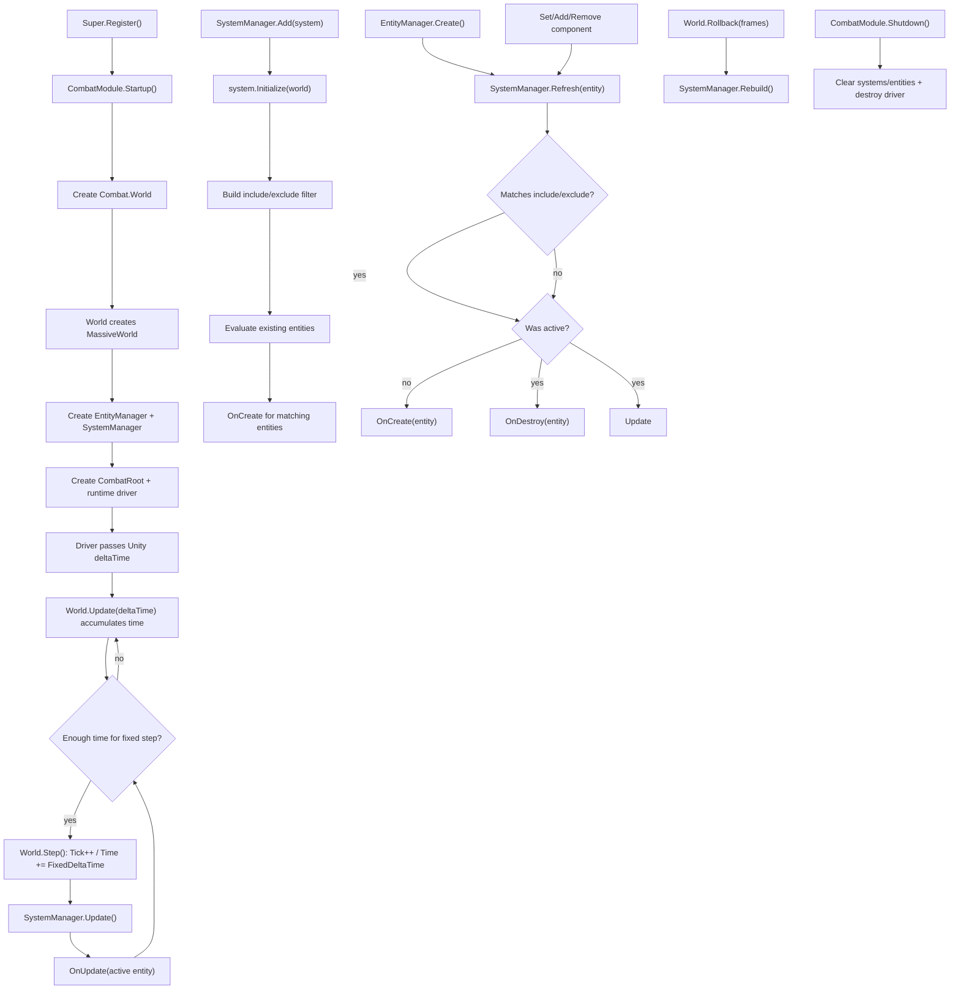

# combat-module design

## 0. 术语约定

| 术语 | 当前定义 | 本次约定 |
|---|---|---|
| massive | 已加入 `Assets/GameDeveloperKit/Plugins/massive/Runtime/`，命名空间为 `Massive` | 底层 ECS 库，负责实体存储、组件数据、查询、`MassiveWorld` 回滚能力 |
| `Massive.World` | massive 的基础世界类型 | combat 层不直接暴露为业务主入口 |
| `Massive.MassiveWorld` | massive 的可保存帧 / 回滚世界类型 | `GameDeveloperKit.Combat.World` 内部持有的底层世界 |
| `GameDeveloperKit.Combat.World` | 当前不存在 | 项目战斗世界门面，持有 `EntityManager`、`SystemManager` 和内部 `MassiveWorld` |
| `Entity` | massive 已有 `Massive.Entity` | combat 层新增 `GameDeveloperKit.Combat.Entity` class，作为项目实体引用句柄，避免业务代码直接依赖 massive 实体类型 |
| `ComponentBase` | 当前不存在 | combat 层新增组件基类；业务组件继承它，再通过 `ComponentType` 声明 include / exclude |
| `ComponentType` | 当前不存在；massive 没有可直接公开的同名类型 | combat 层新增组件类型描述，封装 `System.Type`，用于系统 include / exclude 条件 |
| `SystemBase` | massive 已有 `ISystem` / `Systems` | combat 层新增系统基类，提供 Initialize / OnCreate / OnDestroy / OnUpdate 与 include / exclude 条件 |

防冲突结论：

- 新增类型放在 `GameDeveloperKit.Combat` 命名空间；文档里的 `World` / `Entity` / `SystemBase` 默认指 combat 层类型，不指 massive 原生类型。
- `World` 是二次包装，不继承 `MassiveWorld`；避免把 massive 的全部 API 变成项目公开承诺。
- 假设：用户提到的 `component[] exclude` 是笔误，首版按 `ComponentType[] Include` 和 `ComponentType[] Exclude` 对称设计。
- 本次已按 review 调整：`ComponentBase` 和 `Entity` 都做成 class，不做 struct。
- 业务组件必须继承 `ComponentBase`；空标记组件也用空 class，例如 `Dead : ComponentBase`。

## 1. 决策与约束

### 需求摘要

做什么：新增运行时 `CombatModule`，通过 `Super.Combat` 访问；模块持有一个默认 `GameDeveloperKit.Combat.World`。`World` 内部创建并持有 `Massive.MassiveWorld`，同时持有 `EntityManager` 和 `SystemManager`。业务通过 `EntityManager` 创建 / 销毁实体、添加 / 移除 / 查询组件；通过 `SystemManager` 注册 `SystemBase` 派生系统。系统声明 `ComponentType[] Include` 和 `ComponentType[] Exclude`，默认均为 `Array.Empty<ComponentType>()`；include 表示实体必须包含这些组件，exclude 表示实体不能包含这些组件。实体进入匹配集合时调用 `OnCreate(entity)`，离开匹配集合或销毁时调用 `OnDestroy(entity)`，世界 update 时对仍匹配的实体调用 `OnUpdate(entity)`。

为谁：战斗、技能、单位状态、投射物、Buff、战斗回放 / 回滚等需要 ECS 风格数据组织和条件系统更新的运行时业务。

成功标准：

- 注册 `CombatModule` 后可以通过 `Super.Combat` 获取模块，并访问默认 `World`。
- `World` 内部使用 `MassiveWorld`，并暴露项目自己的 `EntityManager` / `SystemManager` 作为主入口。
- `EntityManager.Create()` 返回 combat `Entity`；`Destroy(entity)` 后实体不再 alive，已匹配系统收到一次 `OnDestroy`。
- 业务可以给实体添加、设置、移除 `ComponentBase` 组件对象，并通过 `Has<T>()` / `Get<T>()` 查询。
- `SystemManager.Add(system)` 调用 system 初始化，并对当前已存在且满足条件的实体触发 `OnCreate`。
- 系统 `Include` / `Exclude` 缺省为空；include 为空代表没有必需组件，exclude 为空代表没有排除组件。
- 组件变化导致实体首次满足系统条件时触发 `OnCreate`；导致实体不再满足条件时触发 `OnDestroy`。
- `World.Update(deltaTime)` 或 CombatModule runtime driver 只在 world 固定步内调用仍满足 include / exclude 条件实体的 `OnUpdate`。
- 每个 `World` 支持自己的固定帧率运行；同一个 Unity frame 内根据累计 deltaTime 跑 0 到 N 个固定步，并维护 `Tick` / `Time`。
- `World.Rollback(frames)` 后系统匹配集合被重建，避免回滚后 active entity 缓存和 massive 世界状态不一致。

### 明确不做

- 不实现具体战斗规则、伤害、技能、Buff、AI、寻路、碰撞、动画、表现同步或网络同步。
- 不直接修改 massive 源码，不把 massive 的 `Systems` 机制改造成 GameDeveloperKit 系统。
- 不让 `SystemBase` 自动扫描程序集；系统实例和注册顺序由调用方显式提供。
- 不提供多 World 的全局调度器；首版 `CombatModule` 持有一个默认 world，业务可按需手动创建额外 `World`。
- 不纳入 `Super.Startup()` 默认模块计划；战斗能力按需 `Super.Register<CombatModule>()`。
- 不承诺线程安全或 Burst / Job System 兼容；首版公开 API 假定 Unity 主线程调用。
- 不让业务绕过 `EntityManager` 直接改 massive world 后仍期望系统匹配自动同步。
- 不承诺 class component 的字段级深拷贝回滚；需要 rollback 精确恢复内部字段的组件，后续实现必须显式接入 massive 的 copyable 机制或整体替换组件实例。
- 不把 combat system update 做成 variable delta update；首版系统运行在 world 固定步里。

### 复杂度档位

走运行时框架模块默认档位，偏离点：

- `Structure = modules`：新增 `Runtime/Combat/` 目录，按公开概念分文件放 `CombatModule`、`World`、`EntityManager`、`SystemManager`、`SystemBase`、`Entity`、`ComponentType`、`ComponentBase`。
- `Robustness = L3`：实体 / 组件变化会影响系统回调，必须明确匹配缓存、组件变更、销毁和 rollback 后的重建语义。
- `Determinism = deterministic`：系统按注册顺序更新；同一系统内实体遍历顺序遵循 `EntityManager` / massive id 顺序，不使用字典枚举顺序定义战斗结果。
- `Concurrency = single-threaded orchestration`：不使用锁或并发集合伪装线程安全。

### 关键决策

1. 新建 CombatModule，不扩展 massive 插件源码。
   - massive 是底层库，应该保留第三方边界。
   - GameDeveloperKit 需要自己的命名、模块生命周期和 `Super.Combat` 入口。

2. `World` 包装而不是继承 `MassiveWorld`。
   - 继承会把 massive 全部公开 API 直接暴露为 combat API，后续很难收口。
   - 包装可以让实体 / 组件 mutation 统一经过 `EntityManager`，保证 `SystemManager` 能感知匹配变化。

3. `EntityManager` 是实体和组件变更的唯一受管入口。
   - Create / Destroy / Set / Add / Remove / Has / Get 都委托到内部 `MassiveWorld`。
   - 每次可能改变匹配结果的操作完成后，通知 `SystemManager.Refresh(entity)`。
   - 直接访问内部 massive world 属于高级逃生口；绕过后需要调用显式 resync，不作为默认业务路径。

4. `SystemManager` 自己管理 combat systems，不复用 massive `Systems`。
   - massive `ISystem` 更偏底层系统方法集合，不包含本需求的 per entity `OnCreate` / `OnDestroy` / `OnUpdate` 条件回调。
   - combat `SystemBase` 以 include / exclude 描述关注实体集合，由 `SystemManager` 维护每个系统的 active entity 集合。

5. `Entity` 和 `ComponentBase` 使用 class。
   - `Entity` 作为受管引用句柄，便于在系统回调、业务缓存和调试面板中保持同一个实体对象引用。
   - `EntityManager` 负责创建 entity 句柄；销毁后句柄仍可存在，但 `IsAlive == false`，后续 mutation 走明确失败语义。
   - `ComponentBase` 是业务组件基类，系统条件和组件 API 都以它的派生类型为约束。
   - massive `DataSet<T>` 可以存引用类型；但默认复制是引用复制，rollback 精确性需要在实现阶段对可回滚组件给出 copyable 策略。

6. include / exclude 使用 `ComponentType`，不是泛型参数列表。
   - 用户需求明确需要 `ComponentType[] Include` / `Exclude` 属性。
   - `ComponentType.Of<T>()` 可以在派生系统中静态声明，便于缓存和 review。
   - 实现时通过 `Massive.Sets.GetReflected(type)` 转为 BitSet，避免依赖 massive 的 internal `SetKind`。

7. `OnDestroy` 表示“离开系统匹配集合”，不只表示实体被销毁。
   - 组件移除、exclude 组件加入、rollback 后不再匹配，都会对曾经 active 的系统触发 `OnDestroy`。
   - 实体销毁时也会先对所有 active 系统触发 `OnDestroy`，再销毁底层 massive entity。

8. CombatModule 有自己的 Update driver，但不进默认启动计划。
   - 战斗 ECS 不是所有场景都需要，默认启动会在非战斗场景产生不必要常驻 world。
   - 注册 CombatModule 后创建 `GameDeveloperKit.CombatRoot`，driver 每帧把 `UnityEngine.Time.deltaTime` 传给默认 world；手动创建的额外 world 由调用方自己 update。

9. 固定帧率属于 World，而不是 CombatModule 全局。
   - 每个 `World` 持有自己的 `FrameRate`、`FixedDeltaTime`、累积器、`Tick` 和 `Time`。
   - 默认帧率沿用项目计时器口径为 50 FPS；构造或属性设置时允许业务覆盖，但必须大于 0。
   - `Update(deltaTime)` 只负责累计真实时间并执行足够数量的固定步；`Step()` 明确执行一个固定步，方便测试和手动模拟。
   - `SystemBase.OnUpdate(Entity)` 不新增 delta 参数；系统需要时间时读取所属 `World.FixedDeltaTime` / `Tick` / `Time`。

## 2. 名词与编排

### 2.1 名词层

#### 现状

- `Assets/GameDeveloperKit/Runtime/Super.cs` 已有 `Super.Event`、`Super.Resource`、`Super.Command`、`Super.UI`、`Super.Procedure`、`Super.Timer` 等入口，没有 `Super.Combat`。
- `Assets/GameDeveloperKit/Runtime/Core/IGameModule.cs` 定义 `IGameModule.Startup()` / `Shutdown()`；模块若需要 Unity Update，当前通常自建 runtime driver。
- `Assets/GameDeveloperKit/Runtime/GameDeveloperKit.Runtime.asmdef` 已引用 `Massive` 和 `Massive.Preserve`，Runtime 代码可以直接使用 massive。
- `Assets/GameDeveloperKit/Plugins/massive/Runtime/World/Massive/MassiveWorld.cs` 提供 `SaveFrame()`、`Rollback(frames)`、`Peekback(frames)` 和 rollback 事件。
- `Assets/GameDeveloperKit/Plugins/massive/Runtime/World/World.cs` 提供 `Entities`、`Components`、`Sets`、`Allocator` 等底层对象。
- `Assets/GameDeveloperKit/Plugins/massive/Runtime/World/Extensions/WorldIdExtensions.cs` 已提供 id 级 Create / Destroy / Set / Add / Remove / Has / Get。
- `Assets/GameDeveloperKit/Plugins/massive/Runtime/Query/Query.cs` 和 `Filter` 支持 include / exclude BitSet 查询，但 include / exclude 动态类型需要通过 `Sets.GetReflected(Type)` 转换。
- `Assets/GameDeveloperKit/Runtime/Combat/` 当前不存在。

#### 变化

新增模块入口：

```csharp
namespace GameDeveloperKit.Combat
{
    public sealed class CombatModule : GameModuleBase
    {
        public World World { get; private set; }

        public override UniTask Startup();
        public override UniTask Shutdown();
    }
}
```

新增 `Super` 入口：

```csharp
public static CombatModule Combat => Get<CombatModule>();
```

新增战斗世界：

```csharp
public sealed class World : IDisposable
{
    public const int DefaultFrameRate = 50;

    public EntityManager EntityManager { get; }
    public SystemManager SystemManager { get; }

    public int FrameRate { get; set; }
    public float FixedDeltaTime { get; }
    public long Tick { get; }
    public float Time { get; }
    public int CanRollbackFrames { get; }

    public World(int frameRate = DefaultFrameRate);
    public void Update(float deltaTime);
    public void Step();
    public void SaveFrame();
    public void Rollback(int frames);
    public void Clear();
    public void Dispose();
}
```

新增实体管理器：

```csharp
public sealed class EntityManager
{
    public Entity Create();
    public bool Destroy(Entity entity);
    public bool IsAlive(Entity entity);

    public void Set<TComponent>(Entity entity, TComponent component) where TComponent : ComponentBase;
    public bool Add<TComponent>(Entity entity) where TComponent : ComponentBase, new();
    public bool Remove<TComponent>(Entity entity) where TComponent : ComponentBase;
    public bool Has<TComponent>(Entity entity) where TComponent : ComponentBase;
    public TComponent Get<TComponent>(Entity entity) where TComponent : ComponentBase;
}
```

新增实体句柄：

```csharp
public sealed class Entity : IEquatable<Entity>
{
    public int Id { get; }
    public uint Version { get; }
    public bool IsAlive { get; }

    public void Set<TComponent>(TComponent component) where TComponent : ComponentBase;
    public bool Add<TComponent>() where TComponent : ComponentBase, new();
    public bool Remove<TComponent>() where TComponent : ComponentBase;
    public bool Has<TComponent>() where TComponent : ComponentBase;
    public TComponent Get<TComponent>() where TComponent : ComponentBase;
}
```

新增组件类型描述：

```csharp
public readonly struct ComponentType : IEquatable<ComponentType>
{
    public Type Type { get; }

    public static ComponentType Of<TComponent>() where TComponent : ComponentBase;
    public static ComponentType From(Type type);
}
```

新增组件基类：

```csharp
public abstract class ComponentBase
{
}
```

新增系统基类：

```csharp
public abstract class SystemBase
{
    public virtual ComponentType[] Include { get; } = Array.Empty<ComponentType>();
    public virtual ComponentType[] Exclude { get; } = Array.Empty<ComponentType>();

    public virtual void Initialize(World world) { }
    protected virtual void OnCreate(Entity entity) { }
    protected virtual void OnDestroy(Entity entity) { }
    protected virtual void OnUpdate(Entity entity) { }
}
```

新增系统管理器：

```csharp
public sealed class SystemManager
{
    public void Add(SystemBase system);
    public TSystem Add<TSystem>() where TSystem : SystemBase, new();
    public bool Remove(SystemBase system);
    public void Update();
    public void Refresh(Entity entity);
    public void Rebuild();
    public void Clear();
}
```

接口示例：

```csharp
public sealed class Health : ComponentBase
{
    public int Value;
}

public sealed class Dead : ComponentBase
{
}

public sealed class HealthSystem : SystemBase
{
    public override ComponentType[] Include { get; } =
    {
        ComponentType.Of<Health>(),
    };

    public override ComponentType[] Exclude { get; } =
    {
        ComponentType.Of<Dead>(),
    };

    protected override void OnUpdate(Entity entity)
    {
        var health = entity.Get<Health>();
        if (health.Value <= 0)
        {
            entity.Add<Dead>();
        }
    }
}
```

```csharp
await Super.Register<CombatModule>();

Super.Combat.World.SystemManager.Add<HealthSystem>();

var entity = Super.Combat.World.EntityManager.Create();
entity.Set(new Health { Value = 100 });
```

### 2.2 编排层



#### 现状

- massive 能创建实体、添加组件、按 filter 查询和回滚 world，但项目没有自己的 combat module、entity manager、system manager 或 per-entity system lifecycle。
- GameDeveloperKit 现有模块通过 `GameModuleBase` 和 `Super` 统一入口组织；combat 还没有同等入口。
- 业务如果现在直接使用 massive，需要自己约定系统注册、组件变更后刷新、Update 驱动和回滚后的匹配集合重建。

#### 变化

1. CombatModule Startup：
   - 创建默认 `World`。
   - 创建 `GameDeveloperKit.CombatRoot`，挂载私有 runtime driver。
   - driver 每帧把 `UnityEngine.Time.deltaTime` 传给默认 `World.Update(deltaTime)`。
   - 不自动注册任何业务系统，不创建初始实体。

2. World 构造：
   - 内部创建 `MassiveWorld`。
   - 创建 `EntityManager` 和 `SystemManager`，两者共享同一个内部 massive world。
   - 初始化固定帧率时钟：`FrameRate` 默认 50，`FixedDeltaTime = 1f / FrameRate`，`Tick = 0`，`Time = 0`，累积器为 0。
   - `World` 是 combat 层唯一拥有者；manager 不独立 new 给外部使用。

3. EntityManager：
   - `Create()` 调用内部 massive world 创建实体，返回 combat `Entity` class 句柄。
   - `EntityManager` 对 alive entity 保持稳定句柄；同一个 alive id/version 返回同一个 `Entity` 对象，销毁后该对象变为 dead 句柄。
   - 创建后调用 `SystemManager.Refresh(entity)`，使 include 为空的系统能收到 `OnCreate`。
   - `Set<T>` 写入调用方传入的组件对象，组件不能为空。
   - `Add<T>` 创建 `new T()` 作为默认组件对象，因此要求组件类型有无参构造。
   - `Set<T>` / `Add<T>` / `Remove<T>` 成功后调用 `SystemManager.Refresh(entity)`。
   - `Destroy(entity)` 先让 `SystemManager` 对所有 active 系统触发 `OnDestroy`，再销毁 massive entity。
   - 空 / dead / 非本 world 的 entity 按明确异常或 false 语义处理，具体函数级细节由实现阶段贴近现有异常风格决定。

4. SystemManager Add：
   - 校验 system 不为 null，不能重复注册同一实例。
   - 调用 `system.Initialize(world)`。
   - 读取并缓存 `Include` / `Exclude`；null 当作空数组，重复 component type 去重，include 与 exclude 冲突时报 `GameException`。
   - 对当前 alive entities 做一次全量匹配；匹配者加入该 system active set 并调用 `OnCreate(entity)`。
   - 系统更新顺序等于注册顺序。

5. 匹配规则：
   - include 为空：没有必需组件，所有 alive entity 都可通过 include 条件。
   - include 非空：entity 必须拥有所有 include component。
   - exclude 为空：没有排除组件。
   - exclude 非空：entity 只要拥有任一 exclude component 就不匹配。
   - `OnCreate` 只在 entity 从“不在 active set”变为“匹配”时调用。
   - `OnDestroy` 只在 entity 从“在 active set”变为“不匹配”或被销毁时调用。
   - `OnUpdate` 只遍历 active set，并在调用前跳过已死亡或已不匹配的 entity。

6. World Update：
   - `World.Update(deltaTime)` 校验 `deltaTime >= 0`，把 deltaTime 加入 world 自己的累积器。
   - 累积器每达到一个 `FixedDeltaTime`，执行一次 `Step()`；不足一个固定步时本帧不调用任何 system。
   - `Step()` 先推进 `Tick++` 和 `Time += FixedDeltaTime`，再委托 `SystemManager.Update()`。
   - `SystemManager.Update()` 按注册顺序运行系统。
   - 系统内部如果修改组件，`Entity` 方法会走回 `EntityManager` 并刷新匹配；实现阶段需要避免 active set 枚举被修改破坏遍历，可用快照或延迟变更。

7. Rollback：
   - `World.SaveFrame()` 委托内部 `MassiveWorld.SaveFrame()`。
   - `World.Rollback(frames)` 委托内部 `MassiveWorld.Rollback(frames)` 后调用 `SystemManager.Rebuild()`。
   - rollback 后 `EntityManager` 重建 alive entity 句柄缓存：消失的句柄标记为 dead，恢复或新增的 id/version 生成当前 world 的 `Entity` class。
   - `Rebuild()` 对比 rollback 前后的 active set：不再匹配者调用 `OnDestroy`，新匹配者调用 `OnCreate`，仍匹配者保持 active。
   - class 组件默认是引用复制；需要回滚内部字段的组件必须采用 copyable 策略或以 `Set` 替换整个组件对象。

8. Shutdown / Dispose：
   - `CombatModule.Shutdown()` 销毁 driver，清理 world。
   - `World.Clear()` 先清系统 active set，再清 massive world entities / components。
   - `World.Dispose()` 幂等；重复 shutdown 不因 world 或 driver 已清理而抛空引用异常。

#### 流程级约束

- 错误语义：null system / null component type 抛 `ArgumentNullException`；include 与 exclude 冲突、重复系统注册、非本 world entity mutation 抛 `GameException`。
- 幂等性：`Remove` 不存在组件按 massive 语义返回 false；销毁 dead entity 返回 false；重复 shutdown / dispose no-op。
- 顺序：系统按注册顺序 update；同一系统内 `OnCreate` 早于该实体第一次 `OnUpdate`；`OnDestroy` 后该实体不再收到该系统 update。
- 组件变更：只有通过 combat `Entity` / `EntityManager` 的变更才自动刷新系统匹配。
- 回滚：rollback 后必须全量重建系统匹配，不能沿用旧 active set。
- 时间：每个 world 独立固定帧率运行；`FrameRate <= 0` 不合法；`Update(deltaTime)` 不做 variable delta system update。
- 可观测点：`Entity.Id` / `Version`、`Entity.IsAlive`、系统回调顺序、`World.CanRollbackFrames` 和异常消息是首版观察入口。
- 线程：公开 API 假定 Unity 主线程调用；不保证和 massive 内部集合并发访问安全。

### 2.3 挂载点清单

1. `Super.Combat`：运行时访问战斗 ECS 模块的框架入口。
2. `Assets/GameDeveloperKit/Runtime/Combat/`：CombatModule、World、EntityManager、SystemManager、SystemBase、Entity、ComponentType、ComponentBase 的集中落点。
3. `CombatModule` 默认 world：战斗场景按需注册后获得可更新的默认 ECS 世界。
4. `EntityManager` / `Entity` 组件 mutation API：实体生命周期和系统匹配刷新的受管入口。
5. `SystemBase` include / exclude + lifecycle：业务战斗系统接入实体进入、离开和更新的公开契约。

拔除沙盘：移除 `Super.Combat`、删除 `Runtime/Combat/`、清理业务系统对 `SystemBase` / `Entity` / `ComponentType` 的引用后，combat ECS 封装能力应消失；massive 插件仍可作为第三方库独立存在，Procedure、Timer、UI、Resource 等模块不应受影响。

### 2.4 推进策略

1. 模块入口与目录骨架：新增 `Runtime/Combat/`、`CombatModule`、`World` 和 `Super.Combat`，但先不实现系统匹配细节。
   - 退出信号：`Super.Register<CombatModule>()` 后可访问 `Super.Combat.World`，Shutdown 可清理默认 world。
2. World 固定帧率时钟与 EntityManager：接入内部 `MassiveWorld`，实现 FrameRate / FixedDeltaTime / Tick / Time / Update(deltaTime) / Step，以及 Entity 句柄、Create / Destroy / Set / Add / Remove / Has / Get。
   - 退出信号：world 能按固定帧率累计 delta 并推进 Tick；combat Entity class 可以创建、持有 ComponentBase 组件对象、读取组件、销毁并反映 alive 状态。
3. ComponentType 与系统基类：实现 `ComponentType`、`ComponentBase`、`SystemBase` 默认 include / exclude 和初始化入口。
   - 退出信号：派生系统可声明 `ComponentType.Of<T>()` 条件，未重写条件时 include / exclude 为空。
4. SystemManager 匹配生命周期：实现 Add / Remove / Refresh / Rebuild、active set 和 OnCreate / OnDestroy 条件触发。
   - 退出信号：组件变化能让实体进入 / 离开系统匹配集合，回调只触发一次。
5. 系统 Update 驱动：CombatModule runtime driver 调用 World.Update，SystemManager 按注册顺序调用 OnUpdate。
   - 退出信号：只有 active entities 收到 OnUpdate，离开或销毁实体不再更新。
6. Rollback 与清理：World 包装 SaveFrame / Rollback，并在 rollback 后重建系统匹配；Shutdown / Dispose 清理系统和实体。
   - 退出信号：rollback 后系统 active set 与 massive world 当前状态一致，重复清理安全。
7. 验证覆盖：覆盖模块注册、实体组件、include/exclude、OnCreate/OnDestroy/OnUpdate、销毁、rollback、范围守护。
   - 退出信号：Runtime 快速编译通过，关键验收契约有测试或可观察证据。

### 2.5 结构健康度与微重构

#### 评估

- compound convention 检索：未命中 “combat / massive / ecs / world / system / entity / component / 目录组织 / 文件归属 / 命名约定” 相关 convention decision。
- 文件级 — `Assets/GameDeveloperKit/Runtime/Super.cs`：是框架入口聚合点；本次只新增 `using GameDeveloperKit.Combat` 和 `Super.Combat`，属于现有职责延伸，不需要先拆。
- 文件级 — `Assets/GameDeveloperKit/Runtime/GameDeveloperKit.Runtime.asmdef`：已引用 `Massive` 和 `Massive.Preserve`，本次不需要改依赖。
- 文件级 — massive 插件文件：本次只读取，不修改第三方库源码。
- 目录级 — `Assets/GameDeveloperKit/Runtime/Combat/` 当前不存在；新增 7-8 个公开类型后目录可读，但类型较多，适合按公开概念分文件。

#### 结论：不做前置微重构

本次没有需要先“只搬不改行为”的既有代码。实现阶段直接新增 `Runtime/Combat/`，按公开类型分文件；`CombatModule` 的 Unity runtime driver 可作为私有嵌套类放在 `CombatModule.cs`，避免新增一个没有公开意义的 driver 文件。

#### 超出范围的观察

- class 组件让业务代码更顺手，但会把 rollback 的字段级复制问题提前暴露出来；实现阶段只能把 shallow copy 作为默认边界，后续如需严格回滚再追加 copyable component 约束。
- 如果未来需要多 world 调度、系统分组、FixedUpdate / LateUpdate、多线程或网络回滚确定性，需要另起设计，不塞进首版 CombatModule。

## 3. 验收契约

| 编号 | 输入 / 触发 | 期望可观察结果 |
|---|---|---|
| N1 | `Super.Register<CombatModule>()` 后访问 `Super.Combat` | 返回已注册 `CombatModule` 实例 |
| N2 | CombatModule Startup 完成 | `World` 不为空，且有 `EntityManager` / `SystemManager` |
| N3 | `World.EntityManager.Create()` | 返回 alive 的 combat `Entity`，带有效 Id / Version |
| N4 | 对 entity `Set(new Health { Value = 100 })` 后 `Has<Health>()` / `Get<Health>()` | `Has<Health>() == true`，`Get<Health>().Value == 100` |
| N5 | `Remove<Health>()` | 返回 true 后 `Has<Health>() == false` |
| N6 | 注册 Include = `[Health]` 的系统后创建带 Health 的 entity | 该系统收到一次 `OnCreate(entity)` |
| N7 | Include = `[Health]` 的系统中移除 entity 的 Health | 该系统收到一次 `OnDestroy(entity)`，后续不再收到 `OnUpdate` |
| N8 | Exclude = `[Dead]` 的系统中给 active entity 添加 Dead | 该系统收到一次 `OnDestroy(entity)` |
| N9 | Include / Exclude 都为空的系统注册后创建 entity | 新 entity 满足条件并触发 `OnCreate` |
| N10 | `World.Update(deltaTime)` 且累计时间不足一个 `FixedDeltaTime` | 不调用任何系统 `OnUpdate`，Tick / Time 不变化 |
| N11 | `World.Update(deltaTime)` 且累计时间达到一个或多个 `FixedDeltaTime` | 按固定步次数推进 Tick / Time，并按系统注册顺序对 active entities 调用 `OnUpdate` |
| N12 | entity 被 Destroy | 所有当前 active 系统先收到 `OnDestroy(entity)`，随后 entity `IsAlive == false` |
| N13 | `World.SaveFrame()` 后通过 Add / Remove / Set 改变组件集合，再 `Rollback(0)` | rollback 后 `SystemManager` 重建匹配集合，active set 与回滚后的组件集合一致 |
| N14 | `CombatModule.Shutdown()` | driver 被销毁，world 被清理，重复 Shutdown 不抛空引用异常 |
| B1 | `SystemManager.Add(null)` | 抛 `ArgumentNullException` |
| B2 | system 的 Include 和 Exclude 同时包含同一 ComponentType | 抛 `GameException`，system 不进入注册表 |
| B3 | `Set<TComponent>(entity, null)` | 抛 `ArgumentNullException`，不改变组件集合 |
| B4 | 对 dead entity 执行 Set / Add / Remove / Get | 按明确异常语义失败，不静默污染 system active set |
| B5 | 用不属于当前 world 的 Entity 调用当前 world 的 EntityManager | 抛 `GameException` 或明确失败，不操作错误 world |
| B6 | 创建或设置 `FrameRate <= 0` 的 world | 抛明确异常，不进入无效固定步状态 |
| E1 | 实现里系统匹配只看 include、不处理 exclude | 判定失败；带任意 exclude component 的实体不得收到 create / update |
| E2 | 绕过 EntityManager 直接修改内部 massive world 后期待自动刷新 | 判定失败；默认业务路径必须走 combat Entity / EntityManager |
| E3 | CombatModule 被加入 `Super.Startup()` 默认模块计划 | 判定失败；首版 combat 按需注册 |

### 明确不做的反向核对项

- 不新增战斗规则、技能、Buff、AI、寻路、碰撞、动画、表现同步或网络同步类型。
- 不修改 `Assets/GameDeveloperKit/Plugins/massive/Runtime/` 下第三方 massive 源码。
- 不新增程序集扫描、attribute 自动发现系统或隐式注册所有 SystemBase。
- 不新增多线程、Job System、Burst 或 lock-based 线程安全承诺。
- 不新增 Unity GameObject / Transform 与 Entity 的自动绑定。
- 不把 `CombatModule` 加入框架默认启动计划。
- 不承诺 class component 默认能深拷贝回滚内部字段。
- 不把 combat system update 做成 variable delta update。

## 4. 与项目级架构文档的关系

验收通过后需要更新 `.codestable/architecture/ARCHITECTURE.md`：

- 新增 Combat 子系统：入口 `CombatModule`，访问方式 `Super.Combat`，首版按需注册，不在默认启动计划。
- 记录核心类型：`World`、`EntityManager`、`SystemManager`、`SystemBase`、`Entity`、`ComponentType`、`ComponentBase`。
- 记录底层依赖：`World` 包装 `Massive.MassiveWorld`，massive 负责存储、查询与 rollback，combat 负责项目级生命周期和系统回调。
- 记录系统匹配语义：include 全包含、exclude 任一排除、空数组为无条件，OnCreate / OnDestroy 表示进入 / 离开匹配集合。
- 记录 world 固定帧率语义：每个 world 独立 `FrameRate` / `FixedDeltaTime` / `Tick` / `Time`，driver 只传入 Unity deltaTime，system update 只在固定步执行。
- 记录边界：CombatModule 不做具体战斗规则、不自动注册系统、不直接同步 GameObject、不承诺多线程安全、不修改 massive 源码。
