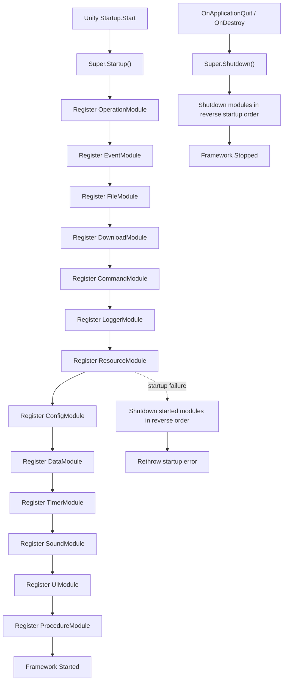

# framework-startup design

## 0. 术语约定

| 术语 | 当前定义 | 本次约定 |
|---|---|---|
| `Startup` 启动脚本 | 代码中暂无；当前只有各模块自己的 `Startup()` 生命周期 | 新增的 Unity `MonoBehaviour` 启动入口，放在场景对象上，由 Unity `Start()` 触发框架启动 |
| 框架 Startup | 当前不存在；`Super.Register<T>()` 注册单个模块时立即调用模块 `Startup()` | `Super.Startup()` 一次性启动框架默认模块计划，不等同于单个模块的 `Startup()` |
| 框架 Shutdown | 当前不存在；`Super.Unregister<T>()` 只关闭单个模块 | `Super.Shutdown()` 按启动反序关闭已注册模块，并把框架状态恢复为可再次启动 |
| 默认模块启动计划 | 当前由调用方手动排列 `Super.Register<T>()` 顺序 | `Super` 内部维护的显式模块列表，按依赖顺序注册，不使用反射扫描 |
| Debug / Logger facade | `LoggerModule : DebugModule`，测试要求注册 `LoggerModule` 后 `Super.Logger` 与 `Super.Debug` 指向同一实例 | 默认计划注册 `LoggerModule`，不同时注册 `DebugModule`，避免创建双份 Debug runtime root |

防冲突结论：

- `Startup` 作为脚本名会和模块 `Startup()` 方法重名；文档里用“启动脚本”指 Unity 组件，用“模块 Startup”指 `IGameModule.Startup()`。
- `TimerModule` 已存在但没有 `Super.Timer` 公开入口。假设：本 feature 把它视为框架模块纳入默认启动计划，并补 `Super.Timer` 入口；如果只想启动现有 `Super.*` 入口，review 时可删掉这一项。
- 历史文档里 Resource 启动顺序曾是风险点；当前源码已通过 `Resources.Load<ResourceSettings>()` 自举设置，并在启动期间使用 `Super.Operation` / `Super.Download` / `Super.File`，所以默认计划必须把这些模块放在 Resource 前面。

## 1. 决策与约束

### 需求摘要

做什么：新增一个 Runtime `Startup` 启动脚本，在 Unity `Start()` 中调用 `Super.Startup()`；在 `OnDestroy()` 或 `OnApplicationQuit()` 路径调用 `Super.Shutdown()`。同时给 `Super` 增加框架级 `Startup()` / `Shutdown()`，由 `Super` 按模块依赖顺序注册默认框架模块。

为谁：接入 GameDeveloperKit 的 Unity 场景、测试场景、示例场景，以及需要稳定启动整套框架的业务开发者。

成功标准：

- 场景中存在 `Startup` 组件时，进入 Play 后能完成默认模块启动，业务可访问 `Super.Operation`、`Super.File`、`Super.Download`、`Super.Resource`、`Super.Config`、`Super.Data`、`Super.Command`、`Super.Debug`、`Super.Logger`、`Super.Sound`、`Super.UI`、`Super.Procedure`，以及本次新增的 `Super.Timer`。
- 默认计划按依赖顺序启动：底层无依赖模块先启动，依赖资源或 operation 的模块后启动。
- 关闭时按启动反序关闭，避免上层模块释放资源时底层模块已经被清掉。
- 重复 `Super.Startup()` / 重复 Unity quit + destroy 不会重复注册或重复关闭同一模块。
- 若中途模块启动失败，已启动模块会被反序清理，错误继续向调用方可见。

### 明确不做

- 不引入反射或 attribute 自动扫描模块，默认启动计划保持显式列表。
- 不把业务自定义模块、第三方插件或场景管理流程纳入默认计划。
- 不改变 `ResourceModule` 自己的 settings / manifest / package 错误语义；资源设置缺失仍由 ResourceModule 报错。
- 不在默认计划里同时注册 `LoggerModule` 和 `DebugModule` 两个实例。
- 不新增 Editor 菜单、安装向导或自动修改场景文件。

### 复杂度档位

走对外发布运行时框架默认档位，偏离点：

- `Compatibility = backward-compatible`：保留现有 `Super.Register<T>()` / `Super.Unregister<T>()` 单模块语义，`Super.Startup()` 是新增聚合入口，不强制用户改掉手动注册测试。
- `Idempotency = idempotent`：框架级 `Startup()` / `Shutdown()` 必须能处理重复调用、重复启动组件和 Unity quit/destroy 双触发。
- `Determinism = deterministic`：默认模块计划必须是固定顺序，不靠字典枚举、反射顺序或程序集加载顺序。

### 关键决策

1. 默认启动计划放在 `Super` 内部，保持显式和可读。
   - `Super` 已是所有框架模块入口聚合点，默认计划放在这里能直接靠 using 和泛型类型看到依赖。
   - 不用反射扫描，避免把尚未准备好、测试专用或业务自定义模块悄悄纳入框架启动。

2. `Register<T>()` / `Unregister<T>()` 继续保留单模块入口。
   - 测试和局部自定义流程仍可手动注册某个模块。
   - 新增的框架启动只是在这个单模块能力上加编排，不替换现有 API。

3. 启动失败要清理已经启动的模块。
   - 例如 Resource 启动失败时，Operation/File/Download 等前置模块不能留在“看似已启动”的半状态。
   - 清理后把原始失败抛出，调用方能看到真正失败的模块。

4. 默认计划注册 `LoggerModule`，不注册独立 `DebugModule`。
   - 当前 `LoggerModule : DebugModule`，测试已经要求 `Super.Logger` 与 `Super.Debug` 可指向同一实例。
   - 如果同时注册两者，会让 Debug GUI、session marker 和日志状态出现两份实例风险。

5. `Startup` 启动脚本负责 Unity 生命周期桥接，不承载模块顺序。
   - 脚本只调用 `Super.Startup()` / `Super.Shutdown()`，模块依赖顺序由 `Super` 统一维护。
   - 脚本需要防止 `OnApplicationQuit()` 和 `OnDestroy()` 重复触发造成双 shutdown。

### 前置依赖

无。

## 2. 名词与编排

### 2.1 名词层

#### 现状

- `Assets/GameDeveloperKit/Runtime/Core/IGameModule.cs` 定义 `IGameModule.Startup()` / `Shutdown()`；`GameModuleBase` 是模块基类。
- `Assets/GameDeveloperKit/Runtime/Super.cs` 维护 `_modules: Dictionary<Type, IGameModule>`，并暴露 `Event`、`Resource`、`File`、`Download`、`Config`、`Data`、`Logger`、`Debug`、`Sound`、`Command`、`UI`、`Operation`。
- `Super.Register<T>()` 当前创建模块、写入字典、立即调用该模块 `Startup()`；`Super.Unregister<T>()` 当前从字典移除并调用模块 `Shutdown()`。
- `Super` 没有框架级启动状态、默认模块计划、注册顺序记录或框架级 shutdown。
- `Assets/GameDeveloperKit/Runtime/Timer/TimerModule.cs` 已实现 `GameModuleBase`，但 `Super.cs` 没有 `Super.Timer` 入口。
- 关键依赖来自源码调用：`ResourceModule.Startup()` 使用 `Super.Operation`，远端 manifest/publish 使用 `Super.Download`，BundleMode 本地 bundle 初始化使用 `Super.File`；`SoundModule` / `UIModule` 运行期加载资源时使用 `Super.Resource`；`DebugModule.ExecuteCommandAsync()` 通过 `TryGetRegistered<CommandModule>()` 调用命令模块。

#### 变化

新增框架级生命周期入口：

```csharp
// 来源：Assets/GameDeveloperKit/Runtime/Super.cs 新增公开 API
public static UniTask Startup();
public static UniTask Shutdown();
public static TimerModule Timer => Get<TimerModule>();
```

新增 Unity 启动脚本：

```csharp
// 来源：Assets/GameDeveloperKit/Runtime/Startup.cs 新增 MonoBehaviour
public sealed class Startup : MonoBehaviour
{
    private void Start();              // 调用 Super.Startup()
    private void OnApplicationQuit();  // 调用 Super.Shutdown()
    private void OnDestroy();          // 调用 Super.Shutdown()
}
```

默认模块启动计划：

```csharp
// 来源：Assets/GameDeveloperKit/Runtime/Super.cs 默认计划概念
OperationModule
EventModule
FileModule
DownloadModule
CommandModule
LoggerModule
ResourceModule
ConfigModule
DataModule
TimerModule
SoundModule
UIModule
ProcedureModule
```

关键契约示例：

```csharp
// 正常：启动一次框架后访问资源模块
await Super.Startup();
var resource = Super.Resource;

// 边界：重复启动不重复创建模块
await Super.Startup();
await Super.Startup();

// 关闭：反序关闭并清空框架状态
await Super.Shutdown();
```

### 2.2 编排层



#### 现状

- 当前主流程是调用方自行线性调用 `Super.Register<T>()`，每次只启动一个模块。
- `_modules` 字典不能表达启动顺序；字典枚举顺序也不应该成为关闭顺序依据。
- 关闭只存在单模块 `Unregister<T>()`，没有“关闭所有已启动模块”的统一入口。
- Unity 场景侧没有统一 MonoBehaviour 把 Play 生命周期转成框架生命周期。

#### 变化

1. `Startup` 启动脚本：
   - 在 `Start()` 调用 `Super.Startup()`。
   - 在 `OnApplicationQuit()` 和 `OnDestroy()` 触发关闭，但脚本内部只发起一次 shutdown。
   - 启动脚本保留首个 owner 实例并 `DontDestroyOnLoad`，重复出现的启动脚本会销毁自身且不触发框架 shutdown。

2. `Super.Startup()`：
   - 以固定列表顺序逐个注册默认模块。
   - 遇到已通过 `Register<T>()` 注册过的模块时不重复创建，但要把它纳入 shutdown 顺序。
   - 启动过程中如果任何模块失败，反序关闭本次已经启动或纳入的模块，再抛出失败。

3. `Super.Shutdown()`：
   - 使用记录下来的启动顺序反向关闭模块。
   - 对未启动状态 no-op。
   - 对重复调用 no-op 或等待正在进行的关闭完成，不再次调用模块 `Shutdown()`。
   - 关闭后清空模块表与顺序记录，让后续 `Super.Startup()` 可以重新启动。

4. `Register<T>()` / `Unregister<T>()`：
   - `Register<T>()` 保持“注册即启动”，但成功后记录模块启动顺序。
   - `Unregister<T>()` 保持单模块关闭，并从顺序记录移除。
   - 仍然对重复注册抛 `GameException`，除非调用方走的是 `Super.Startup()` 默认计划跳过已注册项。

#### 流程级约束

- 错误语义：单模块重复 `Register<T>()` 继续抛 `GameException`；框架启动遇到模块启动失败时，先清理已启动模块，再把原失败抛给调用方。
- 幂等性：`Super.Startup()` started 状态下直接完成；`Super.Shutdown()` stopped 状态下直接完成；Unity quit 和 destroy 双触发只关闭一次。
- 顺序：默认启动计划必须显式固定；关闭必须使用启动记录反序，不能用 `_modules.Values` 枚举。
- 并发：公开 API 继续假定 Unity 主线程调用；重复启动组件导致的同帧重复调用需要被状态机吸收。
- 扩展点：默认模块计划是框架内扩展点；未来新增框架模块时追加到计划并说明依赖，不自动发现。

### 2.3 挂载点清单

1. `Startup` 启动脚本：`Assets/GameDeveloperKit/Runtime/Startup.cs` — 新增 Unity 场景启动组件，删除后场景无法自动启动框架。
2. `Super.Startup()` / `Super.Shutdown()`：`Assets/GameDeveloperKit/Runtime/Super.cs` — 新增框架级生命周期入口，删除后只能手动逐模块注册。
3. `Super` 默认模块启动计划：`Assets/GameDeveloperKit/Runtime/Super.cs` 中的显式模块顺序 — 新增，删除后框架启动无法知道模块依赖顺序。
4. `Super.Timer`：`Assets/GameDeveloperKit/Runtime/Super.cs` — 新增 Timer 模块公开入口，删除后 Timer 即使被默认启动也缺少稳定访问方式。

拔除沙盘：删除 `Startup.cs`、移除 `Super.Startup()` / `Super.Shutdown()` / 默认计划 / `Super.Timer` 后，框架回到只能手动 `Register<T>()` 的状态；现有单模块注册测试和模块 API 应保持。

### 2.4 推进策略

1. 框架生命周期骨架：给 `Super` 增加启动状态、顺序记录和 `Startup()` / `Shutdown()` 空编排。
   - 退出信号：重复调用 `Startup()` / `Shutdown()` 不重复执行模块生命周期。
2. 默认模块计划：按依赖顺序接入 Operation、Event、File、Download、Command、Logger、Resource、Config、Data、Timer、Sound、UI、Procedure。
   - 退出信号：启动后所有默认模块可通过 `Super` 或 `TryGetValue` 访问，Resource 前置依赖已存在。
3. 失败与回滚：补齐启动失败后的反序清理和错误透传。
   - 退出信号：模拟某个中间模块启动失败时，之前启动的模块都执行 shutdown，模块表不残留半状态。
4. Unity 启动脚本：新增 `Startup` MonoBehaviour，把 Unity `Start` / quit / destroy 接到框架生命周期。
   - 退出信号：场景对象挂脚本后进入 Play 能自动启动，退出或销毁对象能触发一次 shutdown。
5. Timer 入口与兼容收口：补 `Super.Timer`，确认默认计划只注册 `LoggerModule` 而不是双注册 Debug/Logger。
   - 退出信号：`Super.Debug` 与 `Super.Logger` 指向同一 LoggerModule 实例，默认计划没有第二个 DebugModule。
6. 验证覆盖：补充框架级启动、关闭顺序、重复调用、手动预注册、失败回滚和启动脚本桥接证据。
   - 退出信号：Runtime 快速编译通过，关键验收场景有测试或 Unity 运行证据。

### 2.5 结构健康度与微重构

##### 评估

- compound convention 检索：未命中 “目录组织 / 命名 / 归属” 相关 convention。
- 文件级 — `Assets/GameDeveloperKit/Runtime/Super.cs`：约 162 行，职责是框架入口和模块注册表；本次新增框架级生命周期和默认计划属于入口聚合点的自然扩展，但会增加状态机和顺序记录，需要保持局部函数清晰。
- 文件级 — `Assets/GameDeveloperKit/Runtime/Logger/DebugModule.cs` / `LoggerModule.cs`：本次只在默认计划选择 `LoggerModule`，不修改 Debug/Logger 实现；无需拆分。
- 文件级 — `Assets/GameDeveloperKit/Runtime/Timer/TimerModule.cs`：本次只新增 `Super.Timer` 入口并默认注册，不修改 TimerModule 内部逻辑。
- 目录级 — `Assets/GameDeveloperKit/Runtime/`：根目录当前只有 `AssemblyInfo.cs` 和 `Super.cs` 两个源码文件；新增 `Startup.cs` 放在根目录与框架入口同级，不造成摊平。

##### 结论：不做前置微重构

本次不做“只搬不改行为”的前置微重构。原因是目标改动集中在框架入口新增生命周期 API 和一个启动脚本，现有文件/目录还没有达到需要先拆的程度。实现阶段应避免把模块计划、状态切换和错误回滚写成一大段不可读代码；如果 `Super.cs` 后续继续增长，再另起 `cs-refactor` 评估 partial 或生命周期 helper。

##### 超出范围的观察

- `Super.TryGetValue<T>()` 当前在未注册时会创建实例但不写回 `_modules`，这个行为和方法名“获取或创建模块”不完全一致；本 feature 不改它，若要收口需另起兼容性评审。
- Resource/Config/Data 等模块未来若支持可选启动或按配置启动，默认计划需要升级为可配置模块列表；本 feature 只做固定默认计划。
- ProcedureModule 默认排在 UIModule 后，保证 shutdown 反序时先让当前 procedure leave，再关闭 UI / Sound / Resource 等被业务流程常用的模块。

## 3. 验收契约

| 编号 | 输入 / 触发 | 期望可观察结果 |
|---|---|---|
| N1 | 场景对象挂 `Startup` 组件并进入 Play | `Start()` 触发 `Super.Startup()`，默认模块按计划启动 |
| N2 | `await Super.Startup()` 成功后访问 `Super.Operation`、`Super.File`、`Super.Download`、`Super.Resource` | 均返回已注册模块，Resource 启动时前置模块已经存在 |
| N3 | `await Super.Startup()` 成功后访问 `Super.Logger` 和 `Super.Debug` | 两者指向同一个 `LoggerModule` 实例，不存在第二个默认 `DebugModule` |
| N4 | `await Super.Startup()` 成功后访问 `Super.Timer` 和 `Super.Procedure` | 返回已注册 `TimerModule` 和 `ProcedureModule` |
| N5 | 连续调用两次 `Super.Startup()` | 第二次不重复创建模块，不抛重复注册异常 |
| N6 | 先手动 `Super.Register<OperationModule>()`，再调用 `Super.Startup()` | 框架启动跳过已注册 OperationModule，并启动剩余默认模块 |
| N7 | 调用 `Super.Shutdown()` | 模块按启动记录反序关闭，关闭后再次访问已清理模块会按现有 `Get<T>()` 语义报未注册 |
| N8 | `OnApplicationQuit()` 和 `OnDestroy()` 都触发 | 只执行一次框架 shutdown，不重复调用模块 `Shutdown()` |
| B1 | 在未启动时调用 `Super.Shutdown()` | no-op，不抛异常 |
| B2 | 启动过程中 ResourceSettings 缺失或某个中间模块启动失败 | `Super.Startup()` 失败，之前已启动模块被反序关闭，模块表不残留半启动状态 |
| B3 | 手动 `Super.Unregister<T>()` 关闭默认计划中的某个模块 | 该模块从注册表和启动顺序记录中移除，后续框架 shutdown 不再次关闭它 |
| E1 | 代码默认计划里同时注册 `LoggerModule` 和 `DebugModule` | 判定失败；默认计划只能注册 `LoggerModule` 来满足两种入口 |
| E2 | 默认计划使用反射扫描或字典枚举顺序决定启动顺序 | 判定失败；顺序必须显式固定 |

明确不做的反向核对项：

- 代码中不应新增模块自动扫描、attribute-based module discovery 或程序集遍历来生成默认计划。
- 代码中不应新增 Editor 菜单、安装向导或自动修改场景资源。
- 代码中不应改变 `ResourceModule` 缺少 `ResourceSettings` 时的失败语义。
- 默认启动计划不应包含业务自定义模块或第三方插件模块。

## 4. 与项目级架构文档的关系

验收通过后需要更新 `.codestable/architecture/ARCHITECTURE.md`：

- 记录 `Super` 作为框架生命周期入口：`Startup()` 按默认计划启动，`Shutdown()` 按反序关闭。
- 记录默认模块依赖顺序，尤其是 `Operation` / `File` / `Download` 必须早于 `Resource`，`Resource` 必须早于运行期依赖资源的 `Sound` / `UI`，`Procedure` 默认在 `UI` 后启动以便 shutdown 时先离开当前 procedure。
- 记录 Unity `Startup` 脚本作为场景挂载入口，只桥接 Unity 生命周期，不维护模块依赖。
- 记录 Debug/Logger 迁移期默认计划注册 `LoggerModule`，通过继承满足 `Super.Debug` facade。
