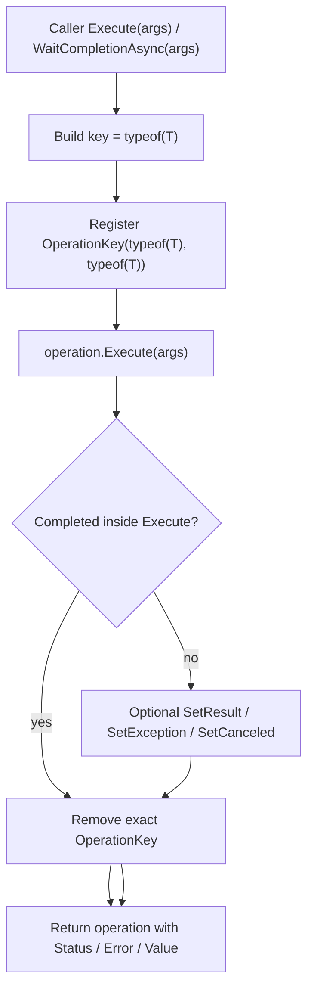

# operationmodule-type-key design

## 0. 术语约定

| 术语 | 当前定义 | 本次约定 |
|---|---|---|
| operation type | 继承 `OperationHandle` 的具体句柄类型，例如 `InitializeOperationHandle` | 继续作为 `OperationModule` 运行中索引的第二段类型维度 |
| operation key | `Execute(key, ...)` / `WaitCompletionAsync(key, ...)` 的业务定位键 | 显式 key 入口继续保留，用于 package、URL、asset、provider 等需要多实例并存的 operation |
| type key | 当前没有独立入口；已有索引可接受任意 object key | 新增便利入口使用 `typeof(T)` 作为业务 key，适合“同一 operation type 同时只跑一个”的场景 |
| keyed operation API | 当前的 `Execute<T>(object key, params object[] args)` / `WaitCompletionAsync<T>(object key, params object[] args)` | 需要与 type-key API 明确分流，避免 C# overload 把第一个 args 误当 key |
| type-key operation API | 当前不存在 | `Execute<T>(args)` / `WaitCompletionAsync<T>(args)` / `SetResult<T>` / `SetException<T>` / `SetCanceled<T>` 以 `typeof(T)` 定位 running operation |

## 1. 决策与约束

### 需求摘要

做什么：调整 `OperationModule` 公开 API，让调用方在不需要业务 key 时可以直接用 operation 类型 `T` 作为 key 执行、等待和回写终态。

为谁：维护 GameDeveloperKit 运行时模块的开发者。资源初始化这类 operation 目前会为了满足 API 形态传入 `this` 或路径等人为 key；当 operation type 本身已经足够表达唯一运行项时，调用方希望省掉这层样板。

成功标准：

- `Execute<T>(args)` 可以创建并执行 `T`，并用 `typeof(T)` 登记 running operation。
- `WaitCompletionAsync<T>(args)` 可以创建、执行并等待 `T`，并用 `typeof(T)` 登记和清理 running operation。
- `SetResult<T>(value)` / `SetResult<T>()` 可以完成以 `typeof(T)` 登记的 running operation。
- `SetException<T>(ex)` 可以失败完成以 `typeof(T)` 登记的 running operation。
- `SetCanceled<T>()` 可以取消完成以 `typeof(T)` 登记的 running operation。
- 显式 key 场景仍可用，且 URL、package、asset 等现有多实例 key 语义不被 type-key 入口吞掉。

明确不做：

- 不把 `OperationModule` 改造成队列、调度器、优先级系统、重试系统或线程安全容器。
- 不改变 `OperationHandle` / `OperationHandle<TValue>` 的状态、等待、结果值和错误语义。
- 不用 type key 替代所有业务 key；下载 URL、资源 package、asset/provider 这类需要并发区分的场景继续显式传 key。
- 不改变 Resource、Download 等业务 operation 的执行逻辑和 owner 文件布局。
- 不新增第三方依赖，不修改 `Packages/manifest.json`。

### 复杂度档位

走运行时框架 API 演进默认档位：L3 健壮性、modules 结构、reasonable 性能、team 可读性、active 可演进性、testable 可测试性；无偏离。并发维度继续是 single-threaded，公开 API 假定 Unity 主线程调用。

### 关键决策

1. `typeof(T)` 是 type-key 入口的业务 key。
   - 内部 running index 仍是 `(operation key, operation type)`。
   - 对 `Execute<MyOperation>()`，复合键等价于 `(typeof(MyOperation), typeof(MyOperation))`。
   - 这样不需要新增公开 key 类型，也不改变当前 `OperationKey` 的比较模型。

2. 显式 key API 必须和 type-key API 分流。
   - C# 不能安全同时保留 `Execute<T>(object key, params object[] args)` 和新增 `Execute<T>(params object[] args)`：调用 `Execute<MyOperation>(arg)` 时，旧签名会把 `arg` 当作 key，而不是新签名的 args。
   - 假设：本仓库当前允许做一次源代码级 API 整理，把显式 key 泛型入口迁移到清晰命名，例如 `ExecuteWithKey<T>(key, args)` / `WaitCompletionWithKeyAsync<T>(key, args)`。
   - 如果外部包已经依赖旧签名且不能破坏兼容，则本 feature 需要改成“新增不同名字的 type-key 入口”，例如 `ExecuteByType<T>(args)`；这会牺牲你想要的 `Execute<T>(args)` 调用形态。

3. type-key 入口只适合单例运行语义。
   - 同一 `T` 通过 type-key 入口同时执行第二次，沿用当前重复 `(key, type)` 的 `GameException` 失败语义。
   - 需要同一 operation type 同时跑多个实例时，调用方必须走显式 key 入口。

4. 泛型 `Set*` 走精确复合键，不走“只按 key 查唯一项”的旧逻辑。
   - `SetResult<T>` / `SetException<T>` / `SetCanceled<T>` 应定位 `(typeof(T), typeof(T))`。
   - 这避免未来某个显式 key 恰好也是 `typeof(T)` 时，只按 key 查找造成歧义。

5. `SetResult<T>()` 与 `SetResult<T>(value)` 都需要存在。
   - 非泛型 operation 成功完成时可以写 `SetResult<MyOperation>()`。
   - 泛型 result operation 写 `SetResult<MyOperation>(value)`。
   - result 类型匹配仍由 `OperationHandle.SetResultObject()` / `OperationHandle<TValue>.SetResultObject()` 决定。

## 2. 名词与编排

### 2.1 名词层

#### 现状

- `OperationModule` 位于 `Assets/GameDeveloperKit/Runtime/Operation/OperationModule.cs`，当前提供 `Execute<T>(object key, params object[] args)`、`Execute(object key, OperationHandle operation)`、`Execute(object key, OperationHandle operation, params object[] args)`、`WaitCompletionAsync<T>(object key, params object[] args)`、`SetResult(object key, object value)`、`SetException(object key, Exception ex)` 和 `SetCanceled(object key)`。
- `OperationModule.OperationKey` 是私有复合键，比较 `Key` 与 `operationType`，当前已允许同一业务 key 下不同 operation type 并存。
- `OperationHandle` / `OperationHandle<TValue>` 位于 `Assets/GameDeveloperKit/Runtime/Operation/OperationHandle.cs`，负责状态、等待、错误和 result value。
- Resource / Download 的大量调用点已经使用显式业务 key，例如 URL、package、asset、provider 实例或路径。

#### 变化

1. 新增 type-key 创建执行契约。
   - `Execute<T>(params object[] args) where T : OperationHandle`
   - `WaitCompletionAsync<T>(params object[] args) where T : OperationHandle`
   - 两者都使用 `typeof(T)` 作为业务 key，再复用现有登记、执行、等待和清理流程。

2. 显式 key 泛型入口改成不会与 type-key 入口冲突的名字。
   - 建议形态：`ExecuteWithKey<T>(object key, params object[] args)`。
   - 建议形态：`WaitCompletionWithKeyAsync<T>(object key, params object[] args)`。
   - 非泛型实例入口 `Execute(object key, OperationHandle operation, params object[] args)` 可以保留，因为它与 `Execute<T>(args)` 不冲突。

3. 新增泛型终态回写入口。
   - `SetResult<T>() where T : OperationHandle`
   - `SetResult<T>(object value) where T : OperationHandle`
   - `SetException<T>(Exception ex) where T : OperationHandle`
   - `SetCanceled<T>() where T : OperationHandle`
   - 这些入口按 `(typeof(T), typeof(T))` 精确查找 running operation。

4. 旧显式 key `Set*` 入口保留。
   - `SetResult(object key, object value)`、`SetException(object key, Exception ex)`、`SetCanceled(object key)` 继续按业务 key 查找唯一 running operation。
   - 这保持外部按业务 key 回写的能力。

#### 接口示例

```csharp
// 来源：Assets/GameDeveloperKit/Runtime/Operation/OperationModule.cs OperationModule
var operation = await Super.Operation.WaitCompletionAsync<InitializeOperationHandle>(_setting);
// running key == typeof(InitializeOperationHandle)
```

```csharp
// 来源：Assets/GameDeveloperKit/Runtime/Operation/OperationModule.cs OperationModule
var operation = Super.Operation.Execute<PendingIntOperation>();
Super.Operation.SetResult<PendingIntOperation>(9);
// operation.Status == OperationStatus.Succeeded
```

```csharp
// 来源：Assets/GameDeveloperKit/Runtime/Operation/OperationModule.cs OperationModule
var operation = await Super.Operation.WaitCompletionWithKeyAsync<LoadingAssetOperationHandle>(assetInfo, assetInfo, bundle);
// running key == assetInfo，允许同一 LoadingAssetOperationHandle 类型按不同 assetInfo 并存
```

### 2.2 编排层



#### 现状

- 所有泛型创建 / 等待入口都要求调用方先提供 `key`，即使 operation type 本身已经能代表唯一运行项。
- 外部终态回写只有 `SetResult(key, value)` / `SetException(key, ex)` / `SetCanceled(key)`，没有与 operation type 绑定的便利入口。
- 现有清理流程已经围绕 `OperationKey(key, operation.GetType())` 工作；本 feature 不需要重做运行中索引。

#### 变化

1. type-key 执行路径成为默认无业务 key 路径。
   - `Execute<T>(args)` 内部创建 `T`，把 `typeof(T)` 传入现有登记流程。
   - `WaitCompletionAsync<T>(args)` 复用 type-key `Execute<T>(args)`，等待并返回 operation。

2. 显式 key 执行路径迁移到清晰命名。
   - 需要业务 key 的调用点改走 `ExecuteWithKey<T>(key, args)` / `WaitCompletionWithKeyAsync<T>(key, args)`。
   - 这一步是 API 编排变化，不改变各 operation 的计算逻辑。

3. type-key 回写路径精确定位。
   - `SetResult<T>` 等泛型入口构造 `OperationKey(typeof(T), typeof(T))`。
   - 找不到时沿用当前 missing operation 的 `GameException` 语义。
   - 找到后写入终态并移除 running index。

4. 旧 key 回写路径保持原样。
   - 只按 key 查唯一 running operation，遇到同 key 多 operation type 继续抛歧义异常。
   - 这让历史外部回写语义不因为 type-key 增强而改变。

#### 流程级约束

- 错误语义：重复 type-key running operation 抛 `GameException`；`WaitCompletionAsync<T>` 仍返回 operation，失败状态从 `Status` / `Error` 观察。
- 幂等性：operation 进入终态后再次 Set* 不改写结果；索引移除后再次泛型 Set* 抛 missing operation。
- 顺序约束：type-key 意味着同一 `T` 同时只能有一个 running operation。
- 并发约束：不新增线程安全承诺，公开 API 继续假定 Unity 主线程调用。
- 扩展点：具体 operation 仍通过继承 `OperationHandle` 扩展；type-key 只是定位方式。
- 可观测点：调用方通过 returned operation 的 `Status`、`Error`、`Value` 观察结果。

### 2.3 挂载点清单

1. `OperationModule` public API：新增 type-key `Execute<T>` / `WaitCompletionAsync<T>` / 泛型 `Set*`，并把显式 key 泛型入口迁移到清晰命名。
2. `Super.Operation`：继续作为唯一全局入口；不新增新的 module facade。

### 2.4 推进策略

1. API 骨架：拆分 type-key 与 explicit-key 公开入口。
   - 退出信号：`Execute<T>(args)` 不再被显式 key overload 截获；显式 key 调用点有清晰替代入口。
2. type-key 执行等待：把 `typeof(T)` 接入现有登记、执行、等待和清理流程。
   - 退出信号：无业务 key 的 operation 可执行、等待、完成并清理索引。
3. type-key 终态回写：实现 `SetResult<T>` / `SetException<T>` / `SetCanceled<T>`。
   - 退出信号：泛型 Set* 能完成对应 type-key running operation，missing / 重复语义明确。
4. 调用点迁移：把仍需要业务 key 的 Runtime / Tests 调用迁移到 explicit-key 入口，把适合 type-key 的调用改成新入口。
   - 退出信号：资源初始化等单例 operation 不再传人为 key，多实例资源/下载调用仍按业务 key 区分。
5. 验证覆盖：补齐 API overload、回写、兼容边界和已有显式 key 场景。
   - 退出信号：Runtime 快速编译通过，OperationModuleTests 覆盖 type-key 与 explicit-key 两条路径。

### 2.5 结构健康度与微重构

##### 评估

- 文件级 — `Assets/GameDeveloperKit/Runtime/Operation/OperationModule.cs`：约 321 行，职责仍集中在 running operation 登记、执行、等待、回写和清理；本次会新增公开 overload 和少量私有精确查找 helper，属于现有职责延伸。
- 文件级 — `Assets/GameDeveloperKit/Runtime/Operation/OperationHandle.cs`：本次不需要修改状态模型或 result 模型；若实现阶段发现需要改此文件，应先回到 design 说明原因。
- 目录级 — `Assets/GameDeveloperKit/Runtime/Operation/`：当前只有 `OperationModule.cs` / `OperationHandle.cs` 两个源码文件，目录不拥挤；本次不需要新增运行时源码文件。
- 测试目录级 — `Assets/GameDeveloperKit/Tests/Runtime/`：已有 `OperationModuleTests.cs`，本次应在现有测试类中补场景，不需要新增测试文件。
- compound convention 检索：`doc_type=decision` + `category=convention` + “目录组织 OR 命名 OR 归属”无命中。

##### 结论：不做微重构

本次不做拆文件或目录重组。改动集中在 `OperationModule` 公开 API 与已有 running operation 索引复用，文件和目录规模都还没有到需要先“只搬不改行为”的程度。

##### 超出范围的观察

- `OperationModule` 作为公开 API 正在增长；如果后续继续增加 cancellation token、progress 聚合、operation 查询等能力，应另起 `cs-refactor` 评估是否拆出 running registry 或 public facade。

## 3. 验收契约

| 编号 | 输入 / 触发 | 期望可观察结果 |
|---|---|---|
| N1 | `Execute<PendingIntOperation>()` 后 `SetResult<PendingIntOperation>(9)` | 返回 operation 进入 `Succeeded`，`Value == 9`，再次 `SetCanceled<PendingIntOperation>()` 抛 missing operation |
| N2 | `WaitCompletionAsync<PendingIntOperation>()` 后外部 `SetResult<PendingIntOperation>(9)` | await 返回同一个 operation，状态为 `Succeeded` |
| N3 | `Execute<ImmediateResultOperation>(42)`，operation 在 `Execute(args)` 内同步成功 | 返回 operation 进入 `Succeeded`，`Value == 42`，索引已清理 |
| N4 | `SetException<PendingIntOperation>(ex)` | operation 进入 `Failed`，`Error` 为同一异常对象 |
| N5 | `SetCanceled<PendingIntOperation>()` | operation 进入 `Cancelled` |
| N6 | `WaitCompletionWithKeyAsync<PendingIntOperation>("a")` 与 `"b"` 同时运行 | 两个同类型 operation 可以按不同显式 key 并存 |
| B1 | 同一 `T` 已通过 type-key 运行中，再次 `Execute<T>()` | 抛 `GameException`，不覆盖原 operation |
| B2 | `SetResult<T>` 找不到 type-key running operation | 抛 `GameException`，不静默吞掉 |
| B3 | `SetResult<T>("text")` 回写到 `OperationHandle<int>` | 抛 `GameException`，operation 保持 running，可随后取消 |
| B4 | 显式 key 回写遇到同 key 不同 operation type | 继续抛歧义 `GameException` |
| E1 | `Execute<T>(arg)` 调用 overload | `arg` 作为 args 传入 operation，不被当作业务 key |
| E2 | 显式 key 资源/下载调用迁移后运行 | URL、package、asset 等业务 key 仍参与 running operation 区分 |

### 明确不做的反向核对项

- Runtime Operation 代码不应出现 queue、priority、retry、scheduler 或 thread 调度语义。
- `OperationHandle` 的 `Status` / `Error` / `Value` / `WaitCompletionAsync()` 公开契约不应改变。
- Resource / Download 的业务 operation owner 文件布局不应因本 feature 改变。
- 需要多实例并存的资源/下载调用不应改成 type-key 入口。
- `Packages/manifest.json` 不应新增依赖。

## 4. 与项目级架构文档的关系

验收阶段需要更新 `.codestable/architecture/ARCHITECTURE.md` 的 OperationModule 描述：

- 补充 `OperationModule` 支持 type-key convenience API：无业务 key 时以 `typeof(T)` 作为 running operation key。
- 保留显式 key 约束：同一 key + operation type 不允许同时运行，同一 key 不同 operation type 可以并存；只按 key 的外部 `Set*` 遇到歧义继续失败。
- 补充使用边界：type-key 只适合同一 operation type 同时最多一个 running operation 的场景，多实例业务必须显式传 key。
