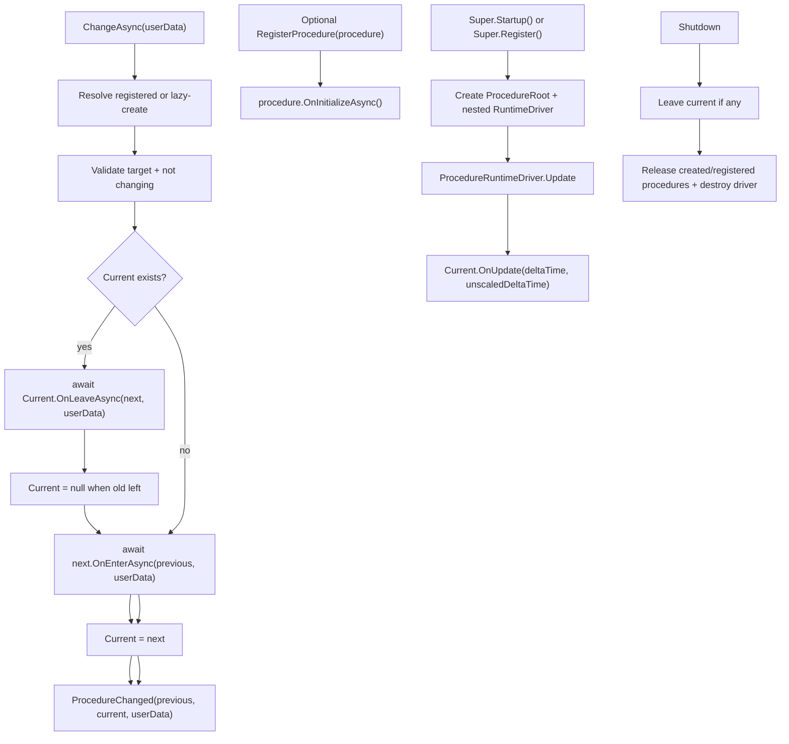

# procedure-module design

## 0. 术语约定

| 术语 | 当前定义 | 本次约定 |
|---|---|---|
| ProduceModule | 当前不存在；英文 produce 更像“生产 / 生成”能力 | 不采用该命名，避免和资源构建、生产者等概念混淆 |
| `ProcedureModule` | 当前不存在 | GameDeveloperKit 运行时全局顶层流程状态机入口，通过 `Super.Procedure` 访问 |
| procedure | 当前不存在统一模型 | 一个互斥的游戏 / 应用顶层阶段，例如 Splash、CheckVersion、Login、MainMenu、Battle |
| current procedure | 当前不存在 | 模块当前持有并驱动 update 的唯一活动 procedure |
| procedure transition | 当前不存在 | 从上一个 procedure 串行离开，再进入下一个 procedure 的切换过程 |
| userData | 当前不存在 | 调用方传入当前切换的一次性上下文，例如登录结果、战斗关卡 id |

防冲突结论：

- 本 feature 使用 `Procedure`，不使用用户口语里的 `Produce` 作为类型名。
- `ProcedureModule` 是顶层流程状态机，不是通用可嵌套 FSM 库。
- `ProcedureModule` 不替代 `OperationModule`、`CommandModule`、`UIModule`、`EventModule` 或 Resource 的 `ModeBase`。
- 假设：用户说的“类似一个全局状态机”指游戏主流程 / 应用阶段，而不是任意对象的小型 AI 状态机。

## 1. 决策与约束

### 需求摘要

做什么：新增运行时 `ProcedureModule`，让业务通过 `Super.Procedure.ChangeAsync<TProcedure>(userData)` 切换全局当前流程；目标 procedure 未提前注册但可无参创建时，模块在首次切换时自动创建并初始化。需要传入依赖或复用已有实例时，业务也可以先显式 `RegisterProcedure(instance)`。模块保证一次只存在一个当前 procedure，切换时按 `OnLeaveAsync` -> `OnEnterAsync` 顺序串行执行，并在 Unity Update 中驱动当前 procedure 的 `OnUpdate`。

为谁：游戏启动链路、版本检查、登录、主菜单、战斗、大厅、结算等需要全局互斥流程的业务和框架开发者。

成功标准：

- `Super.Startup()` 默认注册 `ProcedureModule`，也可以手动注册；启动后可以通过 `Super.Procedure` 获取模块实例。
- 第一次 `ChangeAsync<TProcedure>()` 可以从空 current 进入目标 procedure；若目标未注册且可无参创建，则自动创建、初始化并纳入模块管理。
- 业务可以显式注册 `ProcedureBase` 实例，并按类型查询是否已注册，用于需要依赖注入或复用已有实例的流程。
- 非首次切换时，旧 procedure 的 leave 成功后才进入新 procedure。
- 切换成功后 `Current` / `CurrentType` 指向新 procedure，并触发状态变化通知。
- 切换失败时异常向调用方抛出，模块不进入半切换的未知状态。
- 切换进行中再次调用 `ChangeAsync` 抛明确 `GameException`。
- 每帧只驱动当前 procedure 的 `OnUpdate`，旧 procedure 离开后不再收到 update。
- `Shutdown()` 离开当前 procedure、释放所有已创建 / 已注册 procedure，并销毁运行时 driver。

明确不做：

- 不做任意对象的通用 FSM、AI 状态机、动画状态机、行为树或可视化流程图编辑器。
- 不做并行状态、嵌套子状态机、push / pop 状态栈、历史回退栈或多当前状态。
- 不替代 `OperationModule` 的异步 operation 执行、等待、key 终态回写或关闭清理。
- 不替代 `CommandModule` 的 undo / redo 历史。
- 不替代 `UIModule` 的窗口栈、层级、安全区和资源生命周期。
- 不替代 `EventModule` 的事件订阅 / 派发；首版状态变化通知使用本地 C# 事件。
- 不负责加载 Unity Scene、AssetBundle、UI prefab 或配置表；procedure 内部按需调用已有模块。
- 不提供跨线程并发安全承诺；公开 API 假定 Unity 主线程调用。

### 复杂度档位

走框架运行时模块默认档位，偏离点：

- `Robustness = L3`：全局流程切换是高影响编排，必须明确注册校验、重入、失败、shutdown 和 update 驱动语义。
- `Structure = modules`：新增 `Runtime/Procedure/` 目录，`ProcedureModule`、procedure 基类、状态快照 / 事件参数分文件；Update 桥接 driver 作为 `ProcedureModule` 的私有嵌套类。
- `Concurrency = single-threaded orchestration`：同一时间只允许一个切换流程；不使用锁或并发集合伪装线程安全。
- `Determinism = deterministic`：同一切换序列下 enter / leave / update 顺序固定，不保留分支历史。

### 关键决策

1. 新建 `ProcedureModule`，不扩展其他模块。
   - `OperationModule` 管一次异步操作的运行中登记、等待和终态，不知道“当前游戏处于哪个顶层流程”。
   - `CommandModule` 管可撤销业务操作历史，不应被拿来表示 Login / Battle 这类互斥阶段。
   - `UIModule` 管窗口打开、关闭、返回栈和安全区；Procedure 可以打开 UI，但 UI 当前窗口不是游戏全局流程。
   - Resource 的 `ModeBase` 是资源加载策略，不是应用流程状态。

2. `ProcedureModule` 只做一个全局当前 procedure。
   - 首版不做 pushdown state stack；回到上一个流程由业务显式 `ChangeAsync<PreviousProcedure>()`。
   - 首版不做嵌套子状态机；如果 Battle 内部需要 AI / 回合 / 技能状态机，应由业务另建局部机制。

3. procedure 支持懒创建，显式注册是可选能力。
   - `ChangeAsync<TProcedure>()` 是最短路径：目标未注册时，模块尝试通过无参构造创建、调用 `OnInitializeAsync()`，然后进入该 procedure。
   - `RegisterProcedure(ProcedureBase procedure)` 用于需要依赖注入、复用已有实例或提前初始化的流程。
   - 抽象类型、非 `ProcedureBase` 类型、无法无参创建的目标，切换时抛 `GameException`，提示调用方显式注册实例。
   - 不做程序集扫描或自动发现，避免把未被业务引用的类型意外纳入流程集合。

4. 切换是串行异步流程。
   - `ChangeAsync<TProcedure>(object userData = null)` 先调用旧 procedure 的 `OnLeaveAsync(next, userData)`。
   - 旧 procedure leave 成功后，调用新 procedure 的 `OnEnterAsync(previous, userData)`。
   - enter 成功后才更新 current 并通知状态变化。
   - 切换期间 `IsChanging == true`，再次切换抛 `GameException`。

5. 每帧更新由 ProcedureModule 自己的 RuntimeDriver 驱动。
   - 不依赖 `TimerModule`，避免“要用流程模块必须先注册计时器模块”的隐式顺序。
   - 参考 `UIModule` 的本地 driver 模式，在 Startup 创建 `GameDeveloperKit.ProcedureRoot` 并 `DontDestroyOnLoad`。
   - `ProcedureRuntimeDriver` 作为 `ProcedureModule` 内部 `private sealed class` 嵌套在 `ProcedureModule.cs`，只负责把 Unity `Update()` 转发给模块，不作为独立公开类型或单独源码文件。
   - 纳入 `Super.Startup()` 默认模块启动计划，顺序放在 `UIModule` 后；这样 `Super.Shutdown()` 反序关闭时，当前 procedure 会先 leave，再关闭 UI / Sound / Resource 等模块。

6. 状态变化通知是本地事件。
   - `event Action<ProcedureChangedEventArgs> ProcedureChanged` 足够给调试 UI 或业务刷新当前流程。
   - 不强制注册 EventModule；如果业务想转发到 EventModule，可以在订阅里自行 `Super.Event.Fire(...)`。

7. 失败后保持可解释状态。
   - leave 失败：保持旧 current，异常抛出，新 procedure 不进入。
   - enter 失败：旧 procedure 已经 leave，模块把 current 置空并抛异常；调用方可以选择重试或切到错误流程。
   - 这样不会出现“旧流程已离开但 Current 仍指向旧流程”的假状态。

## 2. 名词与编排

### 2.1 名词层

#### 现状

- `Assets/GameDeveloperKit/Runtime/Super.cs` 当前已有 `Super.Event`、`Super.Resource`、`Super.Command`、`Super.UI`、`Super.Operation` 等入口，没有 `Super.Procedure`，默认模块启动计划也没有 `ProcedureModule`。
- `Assets/GameDeveloperKit/Runtime/Core/IGameModule.cs` 只定义模块 `Startup()` / `Shutdown()` 生命周期，没有模块级 Update 生命周期。
- `Assets/GameDeveloperKit/Runtime/Operation/OperationModule.cs` 已承担 operation 执行、等待、终态回写和 shutdown 取消；它不持有当前应用流程。
- `Assets/GameDeveloperKit/Runtime/Command/CommandModule.cs` 已承担 undo / redo 历史，不表达互斥全局阶段。
- `Assets/GameDeveloperKit/Runtime/UI/UIModule.cs` 持有窗口记录、窗口栈和本地 runtime driver；它管理 UI 层级，不管理游戏全局流程。
- `Assets/GameDeveloperKit/Runtime/Resource/ModeBase.cs` 表示资源加载模式，和游戏主流程状态机不是同一抽象。
- `Assets/GameDeveloperKit/Runtime/Procedure/` 当前不存在。

#### 变化

新增模块入口：

```csharp
public sealed class ProcedureModule : GameModuleBase
{
    public event Action<ProcedureChangedEventArgs> ProcedureChanged;

    public ProcedureBase Current { get; }
    public Type CurrentType { get; }
    public bool IsChanging { get; }

    public override UniTask Startup();
    public override UniTask Shutdown();

    public void RegisterProcedure(ProcedureBase procedure);
    public bool HasProcedure<TProcedure>() where TProcedure : ProcedureBase;
    public bool TryGetProcedure<TProcedure>(out TProcedure procedure) where TProcedure : ProcedureBase;

    public UniTask ChangeAsync<TProcedure>(object userData = null) where TProcedure : ProcedureBase;
    public UniTask ChangeAsync(Type procedureType, object userData = null);
}
```

新增 procedure 基类：

```csharp
public abstract class ProcedureBase : IReference
{
    public virtual UniTask OnInitializeAsync();
    public virtual UniTask OnEnterAsync(ProcedureBase previous, object userData);
    public virtual UniTask OnLeaveAsync(ProcedureBase next, object userData);
    public virtual void OnUpdate(float deltaTime, float unscaledDeltaTime);
    public virtual void Release();
}
```

新增状态变化参数：

```csharp
public readonly struct ProcedureChangedEventArgs
{
    public ProcedureBase Previous { get; }
    public ProcedureBase Current { get; }
    public object UserData { get; }
}
```

接口示例：

```csharp
await Super.Startup();

await Super.Procedure.ChangeAsync<SplashProcedure>();
```

需要传依赖时使用显式注册：

```csharp
await Super.Startup();

Super.Procedure.RegisterProcedure(new LoginProcedure(accountService));
await Super.Procedure.ChangeAsync<LoginProcedure>();
```

```csharp
public sealed class LoginProcedure : ProcedureBase
{
    public override async UniTask OnEnterAsync(ProcedureBase previous, object userData)
    {
        await Super.UI.OpenAsync<LoginWindow>();
    }

    public override async UniTask OnLeaveAsync(ProcedureBase next, object userData)
    {
        Super.UI.Close<LoginWindow>();
        await UniTask.CompletedTask;
    }
}
```

### 2.2 编排层



#### 现状

- 没有统一 Startup 后常驻的流程 driver。
- 没有 procedure 注册表，也没有 current procedure。
- 业务若要表达游戏主流程，只能在场景脚本、UI、资源回调或自建状态变量中维护。

#### 变化

1. Startup：
   - 由 `Super.Startup()` 默认计划注册，或由调用方手动 `Super.Register<ProcedureModule>()` 注册。
   - 创建 `GameDeveloperKit.ProcedureRoot`，挂载 `ProcedureModule` 私有嵌套类 `ProcedureRuntimeDriver`，并 `DontDestroyOnLoad`。
   - 初始化 procedure 注册表、current、changing 状态。
   - 不扫描程序集、不自动发现业务 procedure、不自动进入初始流程。

2. RegisterProcedure：
   - 校验 procedure 不为 null。
   - 用 concrete type 作为唯一 key；重复注册同类型抛 `GameException`。
   - 调用 `procedure.OnInitializeAsync()` 完成一次性初始化。
   - 已初始化的 procedure 由模块持有到 Shutdown；调用方不应提前 `Release()`。

3. ChangeAsync：
   - 校验目标类型非 null、继承 `ProcedureBase` 且不是抽象类型。
   - 如果目标已注册，直接使用已注册实例。
   - 如果目标未注册，尝试用无参构造创建实例，调用 `OnInitializeAsync()`，并加入注册表。
   - 如果目标无法创建，抛 `GameException`，提示调用方先 `RegisterProcedure(instance)`。
   - 如果 `IsChanging == true`，抛 `GameException`。
   - 如果目标 procedure 就是当前 procedure，默认 no-op 返回；不重复 enter。
   - 设置 `IsChanging = true`。
   - 有旧 current 时，先 `await current.OnLeaveAsync(next, userData)`。
   - leave 成功后把 `Current` 置空，再 `await next.OnEnterAsync(previous, userData)`。
   - enter 成功后把 `Current` 指向 next，触发 `ProcedureChanged`。
   - finally 恢复 `IsChanging = false`。

4. Update：
   - `ProcedureRuntimeDriver.Update()` 每帧读取 `Time.deltaTime` / `Time.unscaledDeltaTime`。
   - 如果 `Current != null` 且 `IsChanging == false`，调用 `Current.OnUpdate(deltaTime, unscaledDeltaTime)`。
   - `OnUpdate` 抛异常时不吞掉；实现阶段需按 Unity 回调可观测方式输出或抛出，不能静默失效。

5. Shutdown：
   - 如果当前 procedure 存在，先调用 `OnLeaveAsync(null, null)`，并把 current 置空。
   - 释放全部已创建 / 已注册 procedure，清空事件订阅和注册表。
   - 销毁 `ProcedureRoot`。
   - Shutdown 可重复调用时应保持幂等，不因 driver 已销毁而抛空引用异常。

#### 流程级约束

- 错误语义：空 procedure / type 抛 `ArgumentNullException`；非 `ProcedureBase` 类型、抽象目标、无法无参创建且未显式注册、重复注册、切换重入抛 `GameException`。
- 幂等性：切到当前 procedure 是 no-op；Shutdown 后 current 为空，重复 Shutdown 不应重复 release 已清理 procedure。
- 顺序：一个切换中最多执行一次旧 leave 和一次新 enter；enter 成功后才通知变化。
- 失败：leave 失败保留旧 current；enter 失败时 current 为空，异常向调用方抛出。
- 并发：公开 API 假定 Unity 主线程；不支持并发 `ChangeAsync`。
- 更新：切换中不调用任何 procedure 的 `OnUpdate`；旧 procedure leave 成功后不再收到 update。
- 资源：ProcedureModule 不持有 UI / Resource / Operation 句柄，procedure 自己负责在 leave / release 中清理自己的资源。
- 可观测点：`Current`、`CurrentType`、`IsChanging`、`ProcedureChanged` 和异常消息是首版观察入口。

### 2.3 挂载点清单

1. `Super.Procedure`：运行时访问全局流程状态机的框架入口。
2. `Super.Startup()` 默认模块启动计划：注册 `ProcedureModule`，顺序在 `UIModule` 后。
3. `Assets/GameDeveloperKit/Runtime/Procedure/`：ProcedureModule、ProcedureBase 和事件参数的集中落点；runtime driver 嵌套在 ProcedureModule 内。
4. `ProcedureBase` 生命周期：业务接入顶层流程 enter / leave / update 的公开契约。
5. `ProcedureModule.RegisterProcedure` / `ChangeAsync`：注册和切换 procedure 的主入口。
6. `ProcedureChanged` 本地事件：调试 UI 或业务观察当前流程变化的入口。

拔除沙盘：移除 `Super.Procedure`、删除 `Runtime/Procedure/`、清理业务侧 `ProcedureBase` 派生类和 `ChangeAsync` 调用，并回滚架构记录后，全局流程状态机能力应消失；Operation、Command、UI、Event、Resource 等模块不应受影响。

### 2.4 推进策略

1. 模块入口和目录骨架：新增 `Runtime/Procedure/`、`ProcedureModule`、`ProcedureBase`、`ProcedureChangedEventArgs` 和 `Super.Procedure`；将 `ProcedureModule` 接入 `StartupInternal` 默认计划且顺序在 `UIModule` 后；`ProcedureRuntimeDriver` 嵌套在 `ProcedureModule` 内。
   - 退出信号：`Super.Startup()` 或手动注册 ProcedureModule 后可访问 `Super.Procedure`，Current 为空且 IsChanging 为 false。
2. 注册表、懒创建与初始化：实现 `RegisterProcedure`、`HasProcedure`、`TryGetProcedure`、未注册目标的首次创建、重复注册校验和 `OnInitializeAsync`。
   - 退出信号：`ChangeAsync<T>()` 可自动创建无参 procedure；显式注册实例可按类型查询；重复注册同类型抛明确异常。
3. 切换主流程：实现 `ChangeAsync` 的校验、leave / enter 串行编排、current 更新、no-op 和 ProcedureChanged。
   - 退出信号：从 A 切到 B 的回调顺序为 A leave -> B enter -> changed，Current 指向 B。
4. 嵌套 RuntimeDriver 更新：Startup 创建 driver，Update 驱动当前 procedure，切换中跳过 update。
   - 退出信号：当前 procedure 每帧收到 deltaTime；离开的 procedure 不再收到 update。
5. 错误与失败语义：补齐目标无法创建、重入、leave 失败、enter 失败、update 异常和 shutdown 异常路径。
   - 退出信号：失败场景都有确定 current 结果和可观察异常。
6. Shutdown 清理：离开当前 procedure、释放全部注册项、清空事件、销毁 driver，并保证重复 shutdown 安全。
   - 退出信号：Shutdown 后 current 为空、注册表为空、driver GameObject 被销毁。
7. 验证覆盖：覆盖正常切换、no-op、重入、失败、update、shutdown 和范围守护。
   - 退出信号：`dotnet build GameDeveloperKit.Runtime.csproj --no-restore` 通过，关键验收契约有可观察证据。

### 2.5 结构健康度与微重构

#### 评估

- compound convention 检索：未命中“状态机 / procedure / produce / 目录组织 / 文件归属 / 命名约定”相关 convention decision。
- 文件级 — `Assets/GameDeveloperKit/Runtime/Super.cs`：约 162 行，是模块入口聚合点；本次只新增 `using GameDeveloperKit.Procedure` 和 `Super.Procedure`，不需要拆分。
- 文件级 — `Assets/GameDeveloperKit/Runtime/Core/IGameModule.cs`：只定义模块生命周期；本次不改模块接口，不把 Update 强加给所有模块。
- 文件级 — `OperationModule.cs` / `CommandModule.cs` / `UIModule.cs`：职责已清晰；ProcedureModule 只调用公开入口，不需要先改它们。
- 目录级 — `Assets/GameDeveloperKit/Runtime/Procedure/` 当前不存在；新增 `ProcedureModule.cs`、`ProcedureBase.cs`、`ProcedureChangedEventArgs.cs` 后目录不拥挤。driver 不单独成文件。

#### 结论：不做微重构

本次没有需要先“只搬不改行为”的既有代码。实现阶段直接新增 `Runtime/Procedure/` 并按公开类型分文件；`ProcedureRuntimeDriver` 放在 `ProcedureModule.cs` 内部作为私有嵌套类，`Super.cs` 作为模块入口聚合点保留现状。

#### 超出范围的观察

- `IGameModule` 当前没有统一 Update 生命周期。ProcedureModule 首版可以用本地 driver 解决；如果未来多个模块都需要 Update / LateUpdate / FixedUpdate，再单独走 `cs-refactor` 或 feature 设计统一模块驱动器。
- `TimerModule` 当前也有自己的 driver，且计时器公开 API 仍是空实现。不要为了 ProcedureModule 顺手整理 TimerModule。

## 3. 验收契约

| 编号 | 输入 / 触发 | 期望可观察结果 |
|---|---|---|
| N1 | `Super.Startup()` 后访问 `Super.Procedure`，或手动 `Super.Register<ProcedureModule>()` 后访问 `Super.Procedure` | 返回已注册的 `ProcedureModule` 实例 |
| N2 | ProcedureModule Startup 完成 | `Current == null`，`CurrentType == null`，`IsChanging == false` |
| N3 | `RegisterProcedure(new AProcedure())` | `HasProcedure<AProcedure>() == true`，`TryGetProcedure` 返回同一实例 |
| N4 | 第一次 `ChangeAsync<AProcedure>()`，且 A 未提前注册但有无参构造 | 模块自动创建并初始化 A，调用 A 的 `OnEnterAsync(null, userData)`，Current 指向 A |
| N5 | Current 为 A 时 `ChangeAsync<BProcedure>()` | 调用顺序为 A `OnLeaveAsync(B, userData)` -> B `OnEnterAsync(A, userData)`；成功后 Current 指向 B |
| N6 | 订阅 `ProcedureChanged` 后从 A 切到 B | 收到 Previous 为 A、Current 为 B、UserData 为本次入参的事件参数 |
| N7 | Current 为 A 时再次 `ChangeAsync<AProcedure>()` | no-op，不重复调用 A 的 enter / leave |
| N8 | `ProcedureRuntimeDriver.Update()` 且 Current 为 A | A 的 `OnUpdate(deltaTime, unscaledDeltaTime)` 被调用 |
| N9 | A 已离开并切到 B | 后续 Update 只调用 B，不再调用 A |
| N10 | `Shutdown()` 且 Current 为 A | A 收到 `OnLeaveAsync(null, null)`，所有已创建 / 已注册 procedure 被 `Release()`，Current 为空 |
| B1 | `RegisterProcedure(null)` | 抛 `ArgumentNullException` |
| B2 | 重复注册同一 concrete procedure 类型 | 抛 `GameException`，原注册实例不被替换 |
| B3 | `ChangeAsync` 到未注册且无法无参创建的 procedure 类型 | 抛 `GameException`，Current 不变，并提示显式注册实例 |
| B4 | `ChangeAsync(null)` | 抛 `ArgumentNullException` |
| B5 | Shutdown 后再次 Shutdown | 不因 current、driver 或注册表已清理而抛空引用异常 |
| E1 | A `OnLeaveAsync` 抛异常 | 异常向调用方抛出，Current 仍为 A，B 不进入 |
| E2 | B `OnEnterAsync` 抛异常 | 异常向调用方抛出，Current 为空，A 不再收到 update |
| E3 | `ChangeAsync` 正在运行时再次 `ChangeAsync` | 抛 `GameException`，不启动第二个切换 |
| E4 | 切换过程中 `ProcedureRuntimeDriver.Update()` | 不调用旧 procedure 或新 procedure 的 `OnUpdate` |
| E5 | `OnUpdate` 抛异常 | 不被静默吞掉；错误可在 Unity 日志 / 调用栈中观察 |

### 明确不做的反向核对项

- 不新增通用 FSM DSL、状态图编辑器、行为树、AI 状态机或动画状态机类型。
- 不新增 push / pop 状态栈、并行状态、嵌套子状态机或历史回退 API。
- ProcedureModule 不新增 operation 队列、key 终态回写、重试、下载或资源加载逻辑。
- ProcedureModule 不新增 undo / redo 历史。
- ProcedureModule 不新增 UI 窗口栈、层级、安全区或 prefab 加载逻辑。
- ProcedureModule 不强依赖 EventModule；首版状态变化通知为本地事件。
- 不新增 SceneManager.LoadScene / UnloadScene 作为 ProcedureModule 的职责。
- 不新增跨线程 lock / concurrent collection 作为线程安全承诺。

## 4. 与项目级架构文档的关系

验收通过后需要更新 `.codestable/architecture/ARCHITECTURE.md`：

- 新增 Procedure 子系统：入口 `ProcedureModule`，访问方式 `Super.Procedure`，并纳入 `Super.Startup()` 默认模块启动计划。
- 记录核心类型：`ProcedureBase`、`ProcedureChangedEventArgs` 和 `ProcedureModule` 内部嵌套的 runtime driver。
- 记录生命周期：注册时 initialize，切换时旧 leave 后新 enter，Update 只驱动 current，Shutdown 离开 current 并释放注册项。
- 记录失败语义：leave 失败保留旧 current；enter 失败 current 为空；切换重入抛 `GameException`。
- 记录边界：ProcedureModule 不替代 Operation、Command、UI、Event、Resource、Timer，不做通用 FSM、状态栈、场景加载或跨线程安全。
- 本 feature 非 roadmap 起头，design frontmatter 不写 `roadmap` / `roadmap_item`。
