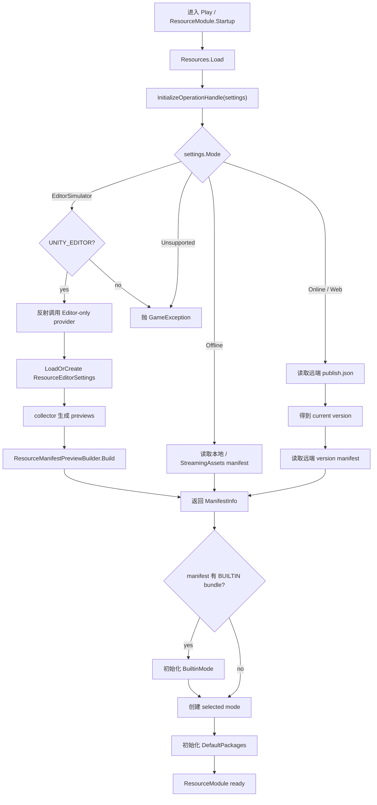

# resource-mode-initialize design

## 0. 术语约定

| 术语 | 当前定义 | 本次约定 |
|---|---|---|
| `ResourceSettings.Mode` | `EditorSimulator` / `Offline` / `Online` / `Web` 四种资源模式 | 启动清单来源和主 play mode 的唯一分支入口 |
| 启动清单 | `InitializeOperationHandle` 返回给 `ResourceModule.Startup()` 的 `ManifestInfo` | 不同 mode 有不同来源：EditorSimulator / Offline 读本地 manifest，Online / Web 先读 publish pointer 再读远端 manifest |
| EditorSimulator manifest | 当前 `InitializeOperationHandle` 写死到 `Assets/GameDeveloperKit/Runtime/Resource/{ManifestName}`，随后又被 publish pointer 流程覆盖 | 只在进入 Play 且 `Mode = EditorSimulator` 时，由 Runtime 在 `#if UNITY_EDITOR` 下反射调用 Editor-only provider 即时生成 `ManifestInfo`，不保存文件 |
| EditorSimulator 反射桥 | 当前没有稳定入口让 Runtime 从 Resource Editor 配置得到 manifest | Editor asmdef 暴露稳定的静态 provider；Runtime 不编译期引用 Editor asmdef，只通过类型名 / 方法名反射调用并把返回值 cast 为 `ManifestInfo` |
| Publish pointer | `PublishVersionOperationHandle` 读取 `publish.json` 的 `version` | 只属于 Online / Web 远端启动；本地和 EditorSimulator 不读取 publish pointer |
| 主 play mode | `ResourceModule` 根据 `ResourceSettings.Mode` 创建的 `ModeBase` | `EditorSimulator -> EditorSimulatorMode`，`Offline -> StreamingAssetMode`，`Online -> BundleMode`，`Web -> WebGLMode` |
| Builtin mode | `BuiltinMode` 使用 `BUILTIN` bundle/provider 加载 Unity 内置资源 | 作为可选补充 mode；只有 manifest 中存在 `BUILTIN` bundle 时初始化，不再无条件失败 |

防冲突结论：当前资源模块已使用 `ManifestInfo / PackageInfo / BundleInfo / AssetInfo` 和 `ModeBase / ProviderBase`，本 feature 不引入旧名 `ResourceManifest` 或新的 play mode 抽象。`ResourceEditorSettings` 位于 Editor asmdef，Runtime 不直接引用它；仅允许 Unity Editor 下的反射桥。

## 1. 决策与约束

### 需求摘要

做什么：补齐 ResourceModule 启动初始化：按 `ResourceSettings.Mode` 选择清单来源、创建可用 mode、初始化 built-in 与默认 package；其中 EditorSimulator 在进入 Play 后通过反射即时从 Resource Editor 保存配置生成内存 manifest。

为谁：使用 Resource Editor 配置 package / bundle，并希望在 EditorSimulator、Offline、Online、Web 四种模式下有一致启动语义的 Unity 开发者。

成功标准：

- `EditorSimulator` 不再走 publish pointer，也不读取写死的 Runtime Resource 目录 manifest。
- 只有进入 Play 且 `ResourceSettings.Mode = EditorSimulator` 时才生成 EditorSimulator manifest；保存 Resource Editor 配置不生成或保存 manifest 文件。
- `EditorSimulator` 能通过反射获取 Resource Editor 配置派生出的内存 `ManifestInfo`，`AssetInfo.Location` 仍是 `AssetDatabase.LoadAssetAtPath` 可用的 `Assets/...` 路径。
- `Offline` 直接读取本地 / StreamingAssets manifest，不走 publish pointer。
- `Online` / `Web` 在 `ServerUrl` 非空时先读取 `publish.json`，拿到 version 后再读取 version manifest，不调用 `GetManifestAddress(string.Empty)`。
- `ResourceModule.Startup()` 不向 `modes` 添加 null，也不重复添加同一种 selected mode。
- `BUILTIN` 只在 manifest 中存在对应 bundle 时初始化；manifest 没有 built-in 内容时不阻断默认 package 初始化。
- 默认 package 通过当前 selected mode 初始化，缺失 package 时抛明确错误。
- Runtime asmdef 不引用 `ResourceEditor`、SBP 或未受保护的 `UnityEditor` API；反射代码必须由 `#if UNITY_EDITOR` 包裹。

假设：

- 用户已拍板：EditorSimulator 不保存 manifest 文件；Runtime 侧可以在 Unity Editor 下通过反射获取内存 manifest。
- 如果用户手动修改 `ResourceSettings.ManifestName` 为完整路径，该设置只影响 Offline / Online / Web 的文件或远端 manifest 路径，不作为 EditorSimulator 的启动来源。
- 本 feature 只让启动编排和 EditorSimulator manifest 来源闭环，不把 AssetBundle 构建、下载缓存、远端发布回滚纳入范围。

### 明确不做

- 不让 Runtime 直接引用 `GameDeveloperKit.ResourceEditor`、SBP 或 `UnityEditor` 类型。
- 不在保存 Resource Editor 配置时写出 EditorSimulator manifest 文件。
- 不改 `ManifestInfo` / `PackageInfo` / `BundleInfo` / `AssetInfo` 字段结构。
- 不重新设计 Resource Editor 的 package / bundle / collector / checker UI。
- 不实现 AssetBundle 下载缓存、差量更新、断点续传或校验导入策略。
- 不改变 provider 的资源查询主键：仍通过 `AssetInfo.Location`、`TypeName`、`Labels` 查询。
- 不把 publish pointer 用于 EditorSimulator 或 Offline。
- 不新增 Addressables 或第三方资源系统依赖。

### 复杂度档位

- `Robustness = L2`：需要处理四种 mode、空 ServerUrl、缺失 manifest、缺失 publish version、缺失 default package、没有 BUILTIN bundle 等启动边界。
- `Compatibility = backward-compatible`：运行时 manifest JSON schema 不变；已有 provider 与 `ManifestOperationHandle` 继续工作。
- `Structure = modules/functions`：变化落在 Resource runtime 启动编排和 Resource Editor manifest provider，不新增独立子系统。
- `Runtime boundary = strict`：Runtime 不反向依赖 Editor asmdef；Editor 侧暴露静态 provider，Runtime 侧只在 Unity Editor 下通过反射调用。

### 关键决策

1. 启动清单来源按 mode 分支，不再统一经过 publish pointer。
   - 原因：EditorSimulator / Offline 是本地清单，读取 `publish.json` 会把本地模式错误地推入远端发布协议。
   - 变化：`InitializeOperationHandle` 先判断 mode，只有 Online / Web 调 `PublishVersionOperationHandle`。

2. EditorSimulator 的 manifest 由 Runtime 在 Play 中反射获取，不落盘。
   - 原因：`ResourceEditorSettings` 在 Editor asmdef，Runtime 不能引用 Editor asmdef，否则会形成错误依赖。
   - 变化：Editor asmdef 提供稳定静态 provider；`InitializeOperationHandle` 在 EditorSimulator 分支中用反射调用 provider 并获得 `ManifestInfo`，非 Editor 环境明确失败。

3. 主 mode 列表只包含 Builtin 补充 mode 和 selected mode。
   - 原因：当前启动同时添加 `StreamingAssetMode`、`BuiltinMode` 和 selected mode，Offline 会重复，其他模式会带入无关 mode。
   - 变化：先创建 `BuiltinMode`，再按 `ResourceSettings.Mode` 创建 selected mode；selected mode 为空直接失败，不添加 null。

4. Builtin 初始化从“无条件必须成功”改为“manifest 声明才初始化”。
   - 原因：不是所有项目都有 `BUILTIN` bundle，无条件初始化会让普通 manifest 启动失败。
   - 变化：manifest 中存在 `BUILTIN` bundle 才初始化 `BuiltinMode`；否则保留 mode 但不加载 provider。

## 2. 名词与编排

### 2.1 名词层

#### 现状

`ResourceSettings` 已提供 mode、默认 package、服务器 URL、manifest 名称和地址 helper：

```csharp
// 来源：Assets/GameDeveloperKit/Runtime/Resource/ResourceSettings.cs
public ResourceMode Mode;
public string[] DefaultPackages;
public string ServerUrl;
public string ManifestName = MANIFEST_NAME;
public string GetPublishAddress();
public string GetManifestAddress(string version);
```

`GetManifestAddress(version)` 在 `ServerUrl` 非空时要求 version 非空；但 `InitializeOperationHandle` 当前在 Online / Web 分支中调用 `GetManifestAddress(string.Empty)`，然后又无论 mode 都读取 publish pointer。

`ResourceModule.Startup()` 当前读取 `_setting` 后执行：

```csharp
// 来源：Assets/GameDeveloperKit/Runtime/Resource/ResourceModule.cs
var operation = await Super.Operation.WaitCompletionAsync<InitializeOperationHandle>(_setting);
_manifest = operation.Value;
modes.Clear();
modes.Add(new StreamingAssetMode(_manifest));
modes.Add(builtinMode = new BuiltinMode(_manifest));
modes.Add(CreateModeByType(_setting.Mode));
await builtinMode.InitializePackageAsync(BuiltinMode.BUILTIN_PACKAGE_NAME);
```

风险：`modes` 可能加入 null，Offline 可能重复加入 `StreamingAssetMode`，`BUILTIN` 缺失会阻断启动。

`ResourceEditorSettings` 当前位于 Editor asmdef，保存 `Packages`、`ManifestOutputPath` 和 `BuildSettings`；`EnsureDefaults()` 默认 `ManifestOutputPath = Assets/StreamingAssets/manifest.json`，但这只是现有配置字段。`ResourceManifestPreviewBuilder.Build(settings, previews)` 已能从 editor package / bundle / preview 生成 `ManifestInfo`，其中 asset location 来自 editor preview。`ResourceEditorWindow.RefreshPreviewAndIssues()` 当前已经有 collector preview 与 checker 的编排，但逻辑是窗口私有流程。

#### 变化

启动清单来源成为一个显式契约：

| Mode | Manifest source | Publish pointer | 失败语义 |
|---|---|---|---|
| `EditorSimulator` | Unity Editor 下反射调用 Editor-only provider 返回的内存 `ManifestInfo` | 不读 | 反射入口缺失、provider 失败、返回空 manifest 或 Player 使用该模式时抛明确错误 |
| `Offline` | 本地 / StreamingAssets manifest JSON | 不读 | 本地 manifest 缺失或反序列化失败 |
| `Online` | `{ServerUrl}/{platform}/{version}/{ManifestName}` | 先读 `{ServerUrl}/{platform}/publish.json` | ServerUrl 为空、version 为空或 manifest 下载失败 |
| `Web` | 同 Online | 同 Online | 同 Online |

Editor-only 反射 provider 契约：

- 输入：无 Runtime 编译期参数；provider 自行 `LoadOrCreate()` 当前 `ResourceEditorSettings`，刷新 `ResourceEditorRegistryCache`，按 package / bundle 调 collector 得到 previews。
- 输出：直接返回 `ManifestInfo` 对象，不写 JSON，不使用 `ResourceEditorSettings.ManifestOutputPath`。
- 正常：Runtime 反射调用返回值可 cast 为 `ManifestInfo`。
- 错误：registry error、collector 缺失、checker error、settings 为空或返回空 manifest 时，provider 抛异常；Runtime 包装为 EditorSimulator 启动失败。

接口示例：

```csharp
// 来源：Editor-only ResourceEditor provider，供 Runtime 反射调用
public static ManifestInfo BuildEditorSimulatorManifest();
```

Runtime 不新增对 Editor 类型的公共 API。`InitializeOperationHandle` 只接受 `ResourceSettings`，并基于 mode 选择反射获取、读本地文件或读远端 manifest。

### 2.2 编排层



#### 现状

- `InitializeOperationHandle` 先按 mode 算 `manifestLocation`，但随后无条件读取 `_setting.GetPublishAddress()` 并覆盖 `manifestLocation`。
- EditorSimulator 写死 `Assets/GameDeveloperKit/Runtime/Resource/{ManifestName}`，既不是 Resource Editor 配置派生的 manifest，也不是内存 manifest。
- Offline 理论上指向 `Application.streamingAssetsPath/{ManifestName}`，实际也会被 publish pointer 覆盖。
- Online / Web 在 version 未知时调用 `GetManifestAddress(string.Empty)`，存在空 version 异常。
- `ResourceModule.Startup()` 未校验 `InitializeOperationHandle` 失败状态，只 `Assert` succeeded。
- `BuiltinMode.InitializePackageAsync("BUILTIN")` 无条件执行，manifest 无 `BUILTIN` bundle 时启动失败。
- 默认 package 通过 `InitializePackageAsync` 再查当前 `_setting.Mode` 的 mode；但 `modes` 已包含无关或重复 mode。

#### 变化

1. Editor-only 反射 provider：
   - Editor asmdef 暴露一个稳定静态入口，例如 `BuildEditorSimulatorManifest()`。
   - provider 内部加载 `ResourceEditorSettings`，读取 `ResourceEditorRegistryCache.Current` 或执行 refresh。
   - provider 按 package / bundle 执行 collector，生成和 Resource Editor 窗口一致的 previews。
   - provider 执行必要 checker；存在 error 时抛异常，不返回半可信 manifest。
   - provider 使用已有 `ResourceManifestPreviewBuilder.Build(settings, previews)` 得到 `ManifestInfo` 并直接返回。
   - provider 不写 JSON、不创建目录、不刷新 AssetDatabase。

2. Runtime 清单读取：
   - `EditorSimulator` 在 `#if UNITY_EDITOR` 下通过反射调用 Editor-only provider，得到内存 `ManifestInfo`。
   - `EditorSimulator` 在非 Editor 环境直接抛出不支持错误。
   - `Offline` 解析本地 / StreamingAssets manifest location，调用 `ManifestOperationHandle`。
   - `Online` / `Web` 校验 `ServerUrl`，调用 `PublishVersionOperationHandle(GetPublishAddress())`，再调用 `ManifestOperationHandle(GetManifestAddress(version))`。
   - 任一 operation 未成功时，把实际 location 和原始 error 包进 `GameException`。

3. Mode 列表初始化：
   - `_manifest` 成功后才清空并重建 `modes`。
   - 创建 `BuiltinMode` 并添加到 `modes`。
   - 创建 selected mode；为空或 unsupported 时抛错；非 null 时添加。
   - 如果 selected mode 类型和已有 mode 相同，不重复添加。

4. Package 初始化：
   - 如果 manifest 中存在 `BUILTIN` bundle，初始化 `BuiltinMode`；失败则抛 `BUILTIN initialize failed`。
   - 如果不存在 `BUILTIN`，跳过 built-in provider 初始化。
   - `DefaultPackages` 为空时启动完成。
   - 每个 default package 都通过 selected mode 初始化；找不到 package 或初始化失败时抛带 package 名的错误。

#### 流程级约束

- 错误语义：启动阶段失败统一表现为 `GameException`，消息包含 mode、location 或 package 名。
- 顺序：必须先获得 manifest，再创建 mode；必须先创建 selected mode，再初始化 default packages。
- Runtime 边界：Runtime 不直接访问 `ResourceEditorSettings`、collector、checker、SBP 或 AssetDatabase 导出流程；只允许 `#if UNITY_EDITOR` 反射调用稳定 provider。
- Editor 边界：EditorSimulator manifest 生成是 Play 启动路径的一部分；保存配置不触发 manifest 文件输出。Player 中选择 `EditorSimulator` 必须明确失败或在配置阶段被阻止。
- 幂等性：重复进入 Play 会重新生成内存 manifest，不依赖上一次文件输出，也不会在项目目录留下 manifest 副产物。
- 可观测点：启动日志至少能看到 settings mode、manifest location 或 publish location、最终 manifest version。

### 2.3 挂载点清单

1. Editor-only manifest provider：稳定 provider 类型 / 方法名 — 新增 Runtime 反射可调用的内存 manifest 生成入口。
2. Runtime 启动清单 source router：`ResourceSettings.Mode` — 修改 mode 到 manifest source 的分支契约。
3. Runtime selected mode router：`ResourceSettings.Mode` — 修改 mode 到 `ModeBase` 实例的创建和注册规则。
4. Builtin optional bootstrap：`BUILTIN` bundle 名称 — 修改内置 provider 是否初始化的条件。

拔除沙盘：移除本 feature 后，EditorSimulator 回到写死路径 / publish pointer 混用状态；Offline 仍会尝试读取 publish pointer；Online / Web 仍可能空 version 生成 manifest 地址；Startup 仍会添加重复 / null mode 并无条件初始化 `BUILTIN`。

### 2.4 推进策略

1. 编排骨架：把启动清单读取拆成按 mode 分支的 source router。
   - 退出信号：四种 mode 都能得到确定的 manifest location / publish location，且本地模式不进入 publish pointer。
2. Editor 反射节点：接通 Resource Editor 配置到内存 `ManifestInfo` provider。
   - 退出信号：进入 Play 且 Mode 为 EditorSimulator 时，Runtime 反射得到非空 `ManifestInfo`，项目目录不新增 manifest 文件。
3. Runtime mode 注册：重建 `modes` 初始化规则，只注册 Builtin 补充 mode 和 selected mode。
   - 退出信号：`modes` 不包含 null，不重复添加 Offline selected mode。
4. Builtin 与默认 package 初始化：让 `BUILTIN` 按 manifest 声明可选初始化，默认 package 走 selected mode。
   - 退出信号：无 `BUILTIN` bundle 的 manifest 不阻断默认 package；缺失 default package 有明确错误。
5. 错误与日志收口：补齐 mode / location / package 名相关错误语义和启动日志。
   - 退出信号：关键失败路径能从异常消息定位是清单、publish pointer、mode 还是 package。
6. 验证覆盖：按四种 mode、Editor 反射 provider、缺失文件、缺失 publish version、缺失 package 做可观察验证。
   - 退出信号：第 3 节验收契约均有证据。

### 2.5 结构健康度与微重构

##### 评估

- compound convention 检索：未命中“目录组织 / 命名 / 归属”相关 convention decision。
- 文件级 — `ResourceModule.InitializeOperationHandle.cs`：约 67 行，职责就是启动清单读取；本次改变是该职责的自然修正，不需要拆文件。
- 文件级 — `ResourceModule.cs`：约 393 行，承担资源门面、启动和 mode router；本次会改启动编排和 mode 注册，仍在模块门面职责内。
- 文件级 — `ResourceEditorWindow.cs`：约 1221 行，偏胖；如果直接在窗口里追加反射 provider 或 manifest 生成逻辑会继续加重职责。
- 文件级 — `ResourceManifestPreviewBuilder.cs`：已承载从 editor settings / previews 派生 `ManifestInfo`；复用它比在窗口或 Runtime 里重建清单更合理。
- 目录级 — `Assets/GameDeveloperKit/Editor/ResourceEditor/`：约 19 个同层文件，已有 `Build/` 子目录；本次若新增 Editor-only manifest provider，应放在 ResourceEditor 根或已有 Build 目录中，不新增平行工具目录。
- 目录级 — `Assets/GameDeveloperKit/Runtime/Resource/`：约 22 个同层文件，但 runtime 改动主要在已有 partial 文件内，不需要新增多份同层文件。

##### 结论：不做既有行为微重构

本次不要求先拆 `ResourceModule.cs` 或 `ResourceEditorWindow.cs`。原因：核心问题是启动编排错误和 Editor/Runtime 边界缺口，先大规模拆文件会把结构整理和行为修正混在一起，影响验收。

实现阶段应避免把 manifest 生成计算直接塞进 `ResourceEditorWindow.cs`；如需新增 provider，优先落在 Editor-only ResourceEditor 归属下，复用 `ResourceManifestPreviewBuilder`，Runtime 只反射调用稳定入口。

##### 超出范围的观察

- `ResourceEditorWindow.cs` 仍混合 UI 绑定、preview 刷新、checker、构建调用和保存逻辑。后续继续加 Resource Editor 交互时建议单独走 `cs-refactor` 拆窗口控制器，本 feature 不阻塞。

## 3. 验收契约

| 编号 | 输入 / 触发 | 期望可观察结果 |
|---|---|---|
| N1 | Resource Editor 保存配置但不进入 Play | 不生成、不保存 EditorSimulator manifest 文件 |
| N2 | 进入 Play 且 `ResourceSettings.Mode = EditorSimulator` | Runtime 在 `#if UNITY_EDITOR` 下通过反射调用 Editor-only provider，得到非空 `ManifestInfo` |
| N3 | EditorSimulator 内存 manifest 中有 asset `Location = "Assets/..."` | `EditorAssetProvider` 可通过 `AssetDatabase.LoadAssetAtPath` 加载该资源 |
| N4 | `ResourceSettings.Mode = EditorSimulator` 启动 | 不请求 `publish.json`，不读取 `ManifestOutputPath` JSON |
| N5 | `ResourceSettings.Mode = Offline` 启动 | 不调用 Editor-only provider，不请求 `publish.json`，读取本地 / StreamingAssets manifest |
| N6 | `ResourceSettings.Mode = Online` 且 `ServerUrl` 非空启动 | 先读取 `{ServerUrl}/{platform}/publish.json`，再读取 `{ServerUrl}/{platform}/{version}/{ManifestName}` |
| N7 | `ResourceSettings.Mode = Web` 且 `ServerUrl` 非空启动 | 与 Online 相同的 publish pointer -> version manifest 顺序 |
| N8 | Online / Web 的 publish pointer 返回 `version = "1.0.0"` | 没有任何路径调用 `GetManifestAddress(string.Empty)` |
| N9 | 启动成功后检查 mode 列表行为 | 不存在 null mode；Offline 不重复注册两个 `StreamingAssetMode` |
| N10 | manifest 包含 `BUILTIN` bundle | `BuiltinMode` 初始化成功后 built-in 资源可查询 |
| N11 | manifest 不包含 `BUILTIN` bundle | 启动不因 `BUILTIN not found` 失败，继续初始化默认 package |
| N12 | `DefaultPackages = ["Main"]` 且 selected mode manifest 有 `Main` package | `Main` package 通过 selected mode 初始化 |
| B1 | EditorSimulator 反射 provider 类型或方法不存在 | 启动失败并提示 EditorSimulator manifest provider 缺失 |
| B2 | EditorSimulator provider 返回 null、collector 缺失或 checker 有 error | 启动失败并提示 manifest 生成失败，不回退读取旧文件 |
| B3 | Player 中选择 EditorSimulator | 启动失败并提示 EditorSimulator 仅支持 Unity Editor，或在配置阶段被阻止 |
| B4 | Online / Web 的 `ServerUrl` 为空 | 启动失败并提示 online/web resource mode 需要 ServerUrl |
| B5 | publish pointer 文件缺失、为空或没有 version | 启动失败并提示 publish version 缺失，不继续请求 version manifest |
| B6 | default package 在 manifest 中不存在 | 启动失败并提示具体 package 名 |
| E1 | Runtime asmdef 出现对 `GameDeveloperKit.ResourceEditor`、SBP 或 Editor-only provider 类型的编译期引用 | 判定为失败 |
| E2 | EditorSimulator 路径写入 `ManifestOutputPath`、`Assets/StreamingAssets/manifest.json` 或其他 manifest 文件 | 判定为失败 |
| E3 | EditorSimulator / Offline 触发 `PublishVersionOperationHandle` | 判定为失败 |
| E4 | 实现新增或修改 runtime manifest schema 字段 | 判定为超范围 |

### 明确不做的反向核对项

- Runtime 不应引用 Resource Editor、SBP、Publisher 或未受保护的 UnityEditor API。
- EditorSimulator 不应保存 manifest 文件。
- EditorSimulator / Offline 不应读取 `publish.json`。
- 本 feature 不应新增 Addressables 或第三方资源系统依赖。
- 本 feature 不应改变 `ManifestInfo` / `PackageInfo` / `BundleInfo` / `AssetInfo` 字段。
- 本 feature 不应实现下载缓存、差量更新、上传、回滚或 CDN 刷新。

## 4. 与项目级架构文档的关系

验收通过后需要更新 `.codestable/architecture/ARCHITECTURE.md` 的 Resource 小节：

- 记录 ResourceModule 启动清单来源按 `ResourceSettings.Mode` 分支。
- 记录 EditorSimulator manifest 只在 Unity Editor Play 启动中由 Runtime 反射调用 Editor-only provider 即时生成内存 `ManifestInfo`，不保存 JSON。
- 记录 Online / Web 启动顺序为 publish pointer -> version manifest。
- 记录 Startup 只注册 Builtin 补充 mode 和 selected mode，不添加 null / 重复 mode。
- 记录 `BUILTIN` package 是可选 bootstrap，只有 manifest 声明时初始化。
