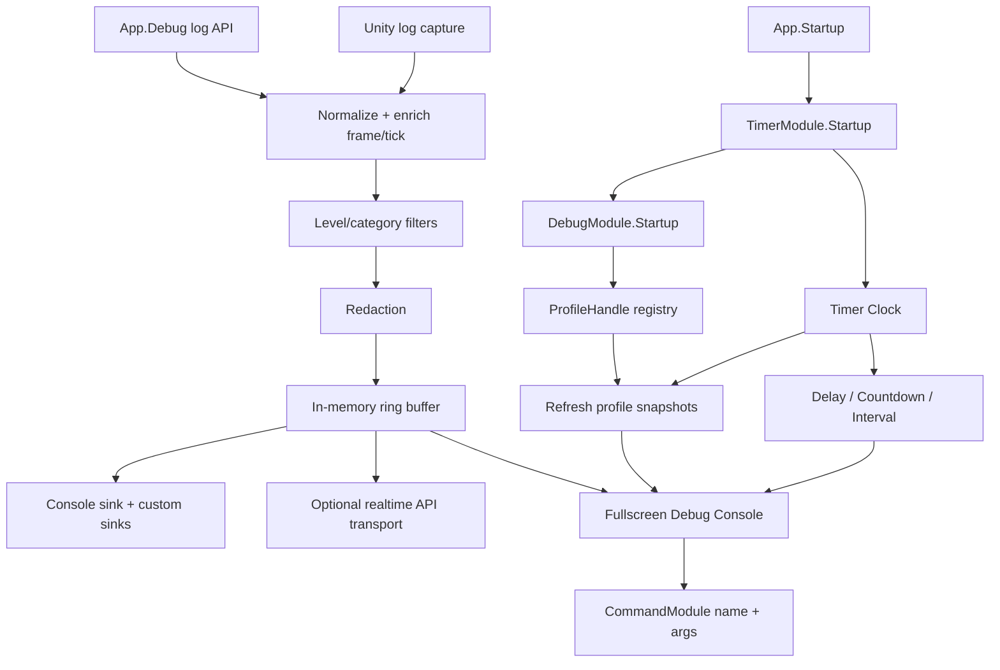

# runtime-debug-timer-redesign design

## 0. 术语约定

| 术语 | 当前定义 | 本次约定 |
|---|---|---|
| `DebugModule` | `Assets/GameDeveloperKit/Runtime/Logger/DebugModule.cs`，一个类里混合日志、sink、上传、埋点、崩溃线索、指标、IMGUI 和命令输入 | 唯一运行时调试中枢；负责日志视图、ProfileHandle 分析表、全屏 Console、工具入口和安全开关 |
| `LoggerModule` / Logger | 当前存在 `LoggerModule : DebugModule`、`App.Logger` 和 `Runtime/Logger/` 目录 | 已废弃概念；删除 `LoggerModule` / `App.Logger`，日志能力归入 Debug 子系统 |
| Log Pipeline | 当前 `DebugModule.Log()` 直接过滤、创建 `LogEntry`、写 buffer 和 sink | 日志采集、结构化、过滤、redaction、内存缓存和实时输出的主流程 |
| ProfileHandle | 当前没有 | 一个可注册到 Debug 的分析表抽象；每个 handle 产出一个 table，其他模块继承它暴露自身运行状态 |
| Debug Console | 当前是固定小窗口 IMGUI tabs，没有关闭按钮 | 全屏运行时调试 Console，带明确关闭按钮，展示 Logs、Profiles、Timers、Tools、Settings |
| Timer Delay | 当前 `SetTimer/ClearTimer` 是空实现 | 延时执行一次 callback，可取消、可按 owner/tag 清理 |
| Timer Countdown | 当前没有 | 倒计时句柄，暴露剩余时间、进度、暂停/恢复、取消和完成回调 |
| Timer Interval | 当前没有 | 按间隔循环执行 callback，可取消、可暂停、可快照 |

防冲突结论：

- `runtime-diagnostics` 旧方案已经 approved 且已有实现痕迹，本 feature 是在它之后按新口径重做 Debug/Timer 设计。
- 不新增 `DiagnosticsModule` 或 `App.Diagnostics`。项目长期入口只有 `App.Debug`。
- 不保留 Logger 独立入口；`Runtime/Logger/` 迁移为 `Runtime/Debug/`。
- 不做本地日志持久化、不做 DebugBundle、不做上传包。未来接服务器时通过实时 API transport 发送日志，不靠本地文件回传。

## 1. 决策与约束

### 需求摘要

做什么：把现有 Debug 实现升级成商业游戏运行时调试中枢。日志函数和日志收集主路径保留并整理，但日志只进入内存 ring buffer、Console 和可选实时 transport；Debug 提供 `ProfileHandle` 表格抽象，让 Resource、Timer、Operation、Combat 等模块通过继承 handle 注册自己的分析表。Console 改为全屏并提供关闭按钮。Timer 补齐延时执行、倒计时、循环调度、取消、暂停/恢复和快照。

为谁：GameDeveloperKit 框架维护者、业务开发者、QA、测试包使用者，以及需要在运行中分析问题的人。

成功标准：

- `App.Debug` 是唯一运行时调试入口；代码中不再保留 `App.Logger` 或 `LoggerModule` 公开入口。
- 日志 API 覆盖现有 `Trace / Debug / Info / Warning / Error / Fatal` 用法，日志记录进入内存 buffer 和 Console。
- 日志不写本地文件、不构建上传包；未来服务器接入点是实时 API transport。
- 其他模块可以继承 `ProfileHandle` 并注册到 Debug；Console 能把每个 handle 展示为独立 table。
- Runtime Debug Console 全屏展示，包含明确关闭按钮，关闭后不再绘制 GUI。
- Timer 提供延时执行、倒计时和循环间隔 API，返回可取消/暂停/恢复的句柄。

### 明确不做

- 不接入固定云平台、商业 analytics SDK、崩溃 SDK、账号系统或 GM 后台服务。
- 不做日志本地持久化、rolling file、DebugBundle、手动上传包或离线回传。
- 不在本 feature 中实现服务器日志 API；只预留实时 transport 扩展点。
- 不替代 Unity Profiler、Memory Profiler、native crash dump、符号化或平台日志全量采集。
- 不在本 feature 中要求 Resource/Download/UI/Combat 等所有模块批量迁移日志调用；只建立 ProfileHandle 接入契约。
- Runtime Debug Console 不做成正式玩家 UI，不走业务 UI 资源加载。
- 不保留 `LoggerModule` / `App.Logger` 兼容 facade。
- Timer 不提供线程调度、任务队列、优先级、重试、job system、网络回滚确定性或服务器时间。
- 不新增第三方依赖。

### 复杂度档位

走对外发布运行时基础设施档位，偏离点：

- `Robustness = L3`：调试入口处理外部命令字符串、Unity 原生日志、profile provider 失败、sink 失败、非法 timer 参数和敏感字段。
- `Structure = modules/layers`：Debug 按 Logs、Profiles、Console、Metrics、Tools、Transports 拆子域；Timer 按 Clock、Delay、Countdown、Interval、Driver 拆职责。
- `Performance = budgeted`：日志 ring buffer 容量、ProfileHandle 刷新频率、Console 绘制和 Timer 扫描都必须有上限。
- `Observability = instrumented`：Debug 自身要暴露 sink 错误、profile 刷新状态、redaction 命中、Timer 活跃任务和 transport 状态。
- `Security = validated`：日志正文、profile 字段和命令输入必须经过校验或 redaction；Release 默认关闭 Console、command 和 Unity log capture。
- `Compatibility = breaking migration`：删除 `LoggerModule` / `App.Logger` 旧入口，调用方统一迁移到 `DebugModule` / `App.Debug`。
- `Concurrency = Unity main thread`：公开 API 假定主线程调用，不做跨线程安全承诺。

### 项目基线

- Unity 2022.3.62f2，URP 14.0.12，UniTask 2.5.10，Runtime asmdef 为 `GameDeveloperKit.Runtime`。
- Runtime 代码使用 `GameModuleBase` + `App.Register<T>()` / `App.Startup()` 模块模式。
- 默认启动计划当前注册 `LoggerModule`，由于继承关系满足 `App.Debug`；目标状态改为直接注册 `DebugModule`，并删除 `LoggerModule`。
- OperationModule、CommandModule、EventModule 已明确不承担通用调度语义；Timer 是时间调度归属点。

### 关键决策

1. Debug 是唯一调试模块，Logger 不保留。
   - 新能力围绕 `DebugModule` 组织。
   - 删除 `LoggerModule`、`App.Logger` 和 Logger 命名目录。
   - 旧调用点迁移到 `App.Debug`，避免框架里同时存在两套叫法。

2. 日志只做内存视图和实时输出，不做本地存储。
   - pipeline 顺序：采集源 -> 归一化 -> 过滤 -> enrich -> redaction -> ring buffer -> sinks/transports。
   - ring buffer 是 Console 查询和临时分析来源，有容量上限。
   - 本 feature 不写文件；WebGL 等平台不会出现本地日志文件分支。
   - 未来服务器接入通过 `IDebugLogTransport` 按条或批量实时发送，不引入上传包。

3. ProfileHandle 是模块分析扩展点。
   - 每个 `ProfileHandle` 对应 Console 中一张 table。
   - 其他模块通过继承 `ProfileHandle` 暴露状态，例如 `TimerProfileHandle`、`ResourceProfileHandle`、`OperationProfileHandle`。
   - Debug 只负责注册、刷新、查询、展示和异常隔离，不理解各模块内部计算。

4. Runtime Debug Console 是全屏工具壳。
   - Console 全屏绘制，顶部固定 toolbar，包含 Close 按钮和 tabs。
   - Tabs 首版为 Logs、Profiles、Timers、Tools、Settings。
   - Console 使用 IMGUI/`OnGUI`，不依赖 UGUI、UI Toolkit、业务 `UIModule` 或 prefab。

5. Timer 分成 Clock、Delay、Countdown、Interval。
   - Clock 负责当前时间、delta、fixed tick、scaled/unscaled 语义。
   - Delay 负责延时执行一次。
   - Countdown 负责倒计时状态和完成回调。
   - Interval 负责循环调度。
   - Debug 的 profile 刷新和面板刷新使用 Timer 口径；没有 Timer 时只允许最小 GUI fallback。

6. 默认启动顺序需要让 Timer 早于 Debug。
   - 目标顺序：Command 之后启动 Timer，再启动 DebugModule。
   - 这样 Debug 的 ProfileHandle 刷新、指标采样、Console 刷新和 Timer tab 能从启动时接入同一时钟。

## 2. 名词与编排

### 2.1 名词层

#### 现状

- `Assets/GameDeveloperKit/Runtime/Logger/DebugModule.cs` 约 739 行，一个类直接持有 categories、sinks、analytics sinks、crash providers、session marker、uploader、metrics elapsed、IMGUI tab、command line 和所有绘制逻辑。
- `Assets/GameDeveloperKit/Runtime/Logger/DebugGuiDriver.cs` 用 `Update()` 调 `DebugModule.UpdateMetrics(Time.unscaledDeltaTime)`，指标采样绕开 TimerModule。
- `Assets/GameDeveloperKit/Runtime/Logger/LoggerModule.cs` 只有 `LoggerModule : DebugModule`，默认启动计划注册 LoggerModule 来兼容 `App.Logger` / `App.Debug`；本 feature 目标是删除它。
- `DebugLogBuffer` 是 List backed ring buffer，超容量时 `RemoveAt(0)`；可用但在高频日志下不是预算化结构。
- `DebugBundle` / uploader 当前存在，但本 feature 不继续这条线。
- 没有 `ProfileHandle`，模块无法把自己的运行状态注册为 Debug 可分析 table。
- `DebugModule.DrawGui()` 当前是固定小区域，没有关闭按钮，也不是全屏 Console。
- `Assets/GameDeveloperKit/Runtime/Timer/TimerModule.cs` 创建名为 `"Timer"` 的持久 GameObject，通过 FixedUpdate 增加 Tick 和 Time；`SetTimer/ClearTimer` 为空实现。
- `TimerModule.Time` 当前用 `1000f / FPS` 累加，属性名像 seconds，实际像 milliseconds，语义不可靠。
- `TimerHandle.Release()` 为空，Timer 没有 delay/countdown/interval 句柄，也没有 owner/tag/cancel token 或快照。

#### 变化

Debug 主入口目标：

```csharp
public class DebugModule : GameModuleBase
{
    public DebugSettings Settings { get; }
    public DebugLogBuffer Logs { get; }
    public DebugProfileRegistry Profiles { get; }
    public DebugConsole Console { get; }

    public bool Enabled { get; set; }
    public bool ConsoleVisible { get; set; }

    public override UniTask Startup();
    public override UniTask Shutdown();

    public void Trace(string message, string category = null, object context = null);
    public void Debug(string message, string category = null, object context = null);
    public void Info(string message, string category = null, object context = null);
    public void Warning(string message, string category = null, object context = null);
    public void Error(string message, string category = null, object context = null);
    public void Error(Exception exception, string message = null, string category = null, object context = null);
    public void Fatal(string message, string category = null, object context = null);

    public void RegisterProfile(ProfileHandle handle);
    public bool UnregisterProfile(ProfileHandle handle);
}
```

日志记录示例：

```csharp
public readonly struct DebugLogRecord
{
    public DateTimeOffset Timestamp { get; }
    public long Sequence { get; }
    public int FrameCount { get; }
    public long TimerTick { get; }
    public LogLevel Level { get; }
    public string Category { get; }
    public string Message { get; }
    public Exception Exception { get; }
    public object Context { get; }
    public IReadOnlyList<string> Tags { get; }
}
```

实时日志扩展点：

```csharp
public interface IDebugLogTransport
{
    UniTask SendAsync(DebugLogRecord record);
}
```

`IDebugLogTransport` 是后续服务器 API 接入点。本 feature 只定义 Debug 侧发送位置和失败隔离，不内置服务器实现。

ProfileHandle：

```csharp
public abstract class ProfileHandle
{
    public abstract string Name { get; }
    public virtual string Category => "Runtime";
    public virtual float RefreshInterval => 0.5f;
    public virtual bool Enabled { get; set; } = true;

    public abstract IReadOnlyList<ProfileColumn> Columns { get; }
    public abstract IReadOnlyList<ProfileRow> Snapshot();
}
```

示例：

```csharp
public sealed class TimerProfileHandle : ProfileHandle
{
    public override string Name => "Timer";
    public override IReadOnlyList<ProfileColumn> Columns { get; }
    public override IReadOnlyList<ProfileRow> Snapshot();
}
```

Timer 目标：

```csharp
public sealed partial class TimerModule : GameModuleBase
{
    public long Tick { get; }
    public double Time { get; }
    public float DeltaTime { get; }
    public float UnscaledDeltaTime { get; }
    public TimerSnapshot Snapshot();

    public TimerDelayHandle Delay(float delay, Action callback, bool useUnscaledTime = false, object owner = null, string tag = null);
    public TimerCountdownHandle Countdown(float duration, Action<float> onTick = null, Action onComplete = null, bool useUnscaledTime = false, object owner = null, string tag = null);
    public TimerIntervalHandle Interval(float interval, Action<float> callback, bool useUnscaledTime = false, object owner = null, string tag = null);

    public bool Cancel(TimerHandle handle);
    public int CancelOwner(object owner);

    public void SetTimer(TimerHandle handle, float delay, bool repeat = false);
    public void ClearTimer(TimerHandle handle);
    public void SetTimer(Action<float> callback, float delay, bool repeat = false);
    public void ClearTimer(Action<float> callback);
}
```

兼容语义：

- `SetTimer(handle, delay, repeat=false)` 映射到 `Delay()`。
- `SetTimer(handle, delay, repeat=true)` 映射到 `Interval()`。
- `SetTimer(callback, delay, repeat)` 同理映射到 delay/interval。
- `ClearTimer(handle/callback)` 取消对应调度；未登记时 no-op。
- `TimerHandle.Execute(float deltaTime)` 的 `deltaTime` 使用 seconds。

### 2.2 编排层



#### 现状

- DebugModule startup 自己创建 GUI root、session marker、默认 sink 和日志 buffer；指标采样由 DebugGuiDriver.Update 直接推进。
- Unity 原生日志没有接入；通过 `UnityConsoleLogSink` 写 Unity Console 的日志也没有防捕获递归问题。
- 当前存在 upload/bundle/uploader 代码，但这不是目标方向。
- Timer startup 只创建 FixedUpdate driver，不执行任何公开 timer callback。
- Timer shutdown 直接 DestroyImmediate `_timer.gameObject`，没有空值保护、重复 shutdown 语义或调度清理。

#### 变化

1. 启动顺序：
   - `App.Startup()` 先注册 Timer，再注册 DebugModule。
   - Timer 创建 runtime driver，开始维护 Clock、Delay、Countdown、Interval。
   - Debug startup 初始化日志 pipeline、ProfileHandle registry、全屏 Console，并向 Timer 注册 profile/console 刷新节奏。

2. 日志采集：
   - 框架日志 API 和 Unity log capture 都进入同一 pipeline。
   - pipeline 在记录中补 sequence、frame count、timer tick、category 和 tags。
   - Unity capture 需要 origin guard，避免 `UnityConsoleLogSink` 输出后再次捕获成重复记录。

3. 日志缓存和输出：
   - 通过过滤和 redaction 的记录进入内存 ring buffer。
   - 不写本地文件，不区分 WebGL/移动端/PC 的本地落盘策略。
   - sink 按快照顺序同步写；单 sink 抛异常时记录到 Debug 状态，不递归写同一条错误。
   - 注册了 `IDebugLogTransport` 时，日志实时送出；transport 失败只更新 Debug 状态，不阻断业务。

4. ProfileHandle：
   - 模块创建自己的 `ProfileHandle` 并调用 `App.Debug.RegisterProfile(handle)`。
   - Debug 按 handle 的刷新间隔抓取 `Snapshot()`。
   - 某个 handle 抛异常时，该 table 显示错误状态，不影响其他 handle。
   - Console Profiles tab 按 handle 显示 table；Timer tab 可由内置 `TimerProfileHandle` 提供。

5. Debug Console：
   - Driver 只负责 Unity 生命周期桥接和 OnGUI 绘制调度，不保存业务状态。
   - Console 全屏绘制，顶部 toolbar 包含 Close 按钮；点击后 `ConsoleVisible=false`。
   - Tabs 从 Debug services 读取快照，不直接遍历内部 List。
   - Logs tab 展示日志 buffer；Profiles tab 展示所有 ProfileHandle table；Timers tab 展示 delay/countdown/interval 活跃项。
   - Tools tab 调用 CommandModule 或 registered debug tool，显示 result，不在 Debug 内部新建 GM registry。

6. Timer Clock / Delay / Countdown / Interval：
   - `Time` 使用 seconds，`Tick` 使用 fixed tick，`DeltaTime` / `UnscaledDeltaTime` 保留最近驱动帧。
   - `Delay()` 到点执行一次并自动完成。
   - `Countdown()` 每次刷新给出 remaining/progress，到 0 触发 complete。
   - `Interval()` 按 interval 重复执行，直到取消。
   - callback 执行时允许取消自己或其他 timer；遍历使用快照或 pending mutation 队列。
   - shutdown 取消所有 timer 并销毁 driver；重复 shutdown 不抛空引用。

#### 流程级约束

- 错误语义：空 timer callback 抛 `ArgumentNullException`；负 delay/duration/interval 抛 `ArgumentException`；非法 log level 抛 `ArgumentException`；sink/profile/transport 失败不打断业务调用。
- 幂等性：重复隐藏 Console、重复取消 timer、重复移除 sink/profile、重复 shutdown 都有稳定结果。
- 顺序：Timer clock 先推进，再执行到期 timer；Debug profile 和 Console refresh 作为 timer 消费者；日志进入内存 buffer 早于 sink/transport 输出。
- 性能：ring buffer 追加 O(1)；ProfileHandle 有刷新间隔；Timer tick 不分配 per-frame 临时集合；Console 只在可见时绘制。
- 安全：Release 默认关闭 Console、command 和 Unity log capture；日志、profile 字段和 realtime transport 必须 redaction。
- 扩展点：log source、sink、realtime transport、ProfileHandle、debug tool、timer owner/tag snapshot。

### 2.3 挂载点清单

1. `App.Debug`：运行时调试唯一入口；删除后用户无法通过框架访问调试中枢。
2. Debug 子系统目录：Logs、Profiles、Console、Metrics、Tools、Transports 等子域承载本 feature；删除后商业调试能力消失。
3. `ProfileHandle` registry：模块分析表挂载点；删除后其他模块无法把自己的状态注册到 Debug。
4. `DebugSettings`：控制日志容量、Unity capture、Console、command、redaction、profile refresh 和 Release 默认策略；删除后无法按构建环境收口风险。
5. `TimerModule` Clock/Delay/Countdown/Interval：统一时间和计时任务归属点；删除后 Debug 刷新、Timer tab 和业务延迟/倒计时/循环调度失去共同口径。
6. CommandModule name + args 能力：Debug Tools tab 的命令执行挂载点；删除后 Debug 只能展示工具，不能执行框架命令。

拔除沙盘：移除 Debug 子系统目录、`App.Debug`、ProfileHandle registry、DebugSettings、Debug Console、Timer Clock/Delay/Countdown/Interval 和默认启动顺序调整后，本 feature 在用户视角应消失；CommandModule 原有 `ExecuteAsync(ICommand)`、OperationModule 和业务 UI 不应受影响。

### 2.4 推进策略

1. 行为不变的目录重组：把现有 Debug 相关文件从 `Runtime/Logger/` 移入 `Runtime/Debug/`，并按 Logs/Console/Metrics/Tools/Transports 分组。
   - 退出信号：不改公开行为，Runtime 快速编译和现有调试聚焦测试仍能通过。
2. Debug 唯一入口与非目标能力收口：删除 `LoggerModule`、`App.Logger` 和 Logger 命名测试/文档引用，默认启动计划直接注册 `DebugModule`；删除或隔离 upload/bundle/uploader 公开面，不新增 rolling file 或本地日志存储。
   - 退出信号：代码中不再有 `LoggerModule` 或 `App.Logger` 公开入口，`App.Debug` 返回已注册 `DebugModule`；Debug 公开 API 不包含上传包，日志不会写入本地文件。
3. Timer Clock 骨架：修正 Time/delta/tick 语义，补 shutdown 幂等和 driver 空值保护。
   - 退出信号：Timer startup 后 tick/time 单位可观察，重复 shutdown 不抛异常。
4. Timer Delay/Countdown/Interval：实现延时执行、倒计时、循环间隔、取消、暂停/恢复、owner/tag 和快照。
   - 退出信号：Delay 到点执行一次，Countdown 暴露剩余时间和完成状态，Interval 可循环并可取消。
5. ProfileHandle 框架：实现 profile registry、列/行模型、刷新间隔、错误隔离和注册/移除 API。
   - 退出信号：自定义 ProfileHandle 注册后能在 Debug 中查询到一张 table。
6. 日志 pipeline 收口：保留现有日志函数，接入 Unity log capture、frame/tick enrich、redaction、O(1) ring buffer 和可选 realtime transport。
   - 退出信号：框架日志和 Unity 日志进入同一内存查询视图，且不会递归重复；未配置 transport 时 no-op。
7. 全屏 Console：实现全屏 IMGUI Console、Close 按钮、Logs/Profiles/Timers/Tools/Settings tabs。
   - 退出信号：Console 可全屏打开和关闭，关闭后不绘制；Profiles tab 能展示注册表格。
8. 启动与安全收口：调整默认启动顺序，补 Release 默认关闭和敏感字段反向核对。
   - 退出信号：`App.Startup()` 后 Timer 早于 Debug，Release 默认不启用危险能力。

### 2.5 结构健康度与微重构

#### 评估

- compound convention 检索：未命中 “debug / logger / timer / diagnostics / directory / naming convention” 相关长期约定。
- 文件级：`DebugModule.cs` 约 739 行，已经混合日志 pipeline、GUI 绘制、上传、analytics、crash、metrics、命令解析、session marker 和 Unity 对象生命周期；继续追加 ProfileHandle 和全屏 Console 会变成 god class。
- 文件级：`DebugGuiDriver.cs` 很小，但现在承担 Update 采样入口，导致 Debug 绕开 Timer。
- 文件级：`TimerModule.cs` 约 99 行，文件不胖，但公开 timer API 为空实现，Clock/Delay/Countdown/Interval/Driver 职责会在实现后迅速混杂。
- 目录级：`Runtime/Logger/` 当前已有 20 个 `.cs` 文件，目录名只表达旧日志概念，却已经放了 Debug 上传、GUI、analytics、crash、metrics；这是稳定命名偏差，不是一次性拥挤。
- 目录级：`Runtime/Timer/` 当前 4 个 `.cs` 文件，尚未拥挤；实现 Delay/Countdown/Interval 后需要明确文件拆分，但不需要先搬目录。

#### 结论：先做目录级微重构，再做功能改造

本次需要第 1 步先做“只搬不改行为”的目录重组：

- 搬什么：现有 `Runtime/Logger/` 下除 `LoggerModule` facade 外的 Debug 相关源码。
- 搬到哪：`Runtime/Debug/`，下设 Logs、Profiles、Console、Metrics、Tools、Transports 等职责目录。
- 怎么验证行为不变：不改公开 API 和 namespace，不改逻辑；移动后跑 Runtime 快速编译和现有调试聚焦测试。`LoggerModule` / `App.Logger` 删除不放在这一步，避免把行为变更混进纯搬迁。

Timer 不做前置搬迁。实现阶段新增 Clock/Delay/Countdown/Interval/Driver 类型时按职责拆文件，避免把新行为继续塞进 `TimerModule.cs`。

#### 建议沉淀的 convention

- 是否稳定模式：稳定模式。
- 规则一句话：运行时调试能力统一归属 Debug 子系统；Logger 概念废弃且不作为 facade 保留；模块分析能力通过 ProfileHandle table 接入；Timer 统一承载运行时时钟与简单时间调度。
- 适用范围：GameDeveloperKit Runtime 调试、日志、分析表、计时、运行时工具。
  实现跑通后建议走 `cs-decide` 归档。

#### 超出范围的观察

- 全框架模块逐步接入 Debug 日志分类、scope 和 ProfileHandle，应另起“模块调试分析接入”feature，逐模块控制字段和噪声。
- 服务器实时日志 API、鉴权、批量发送、断线缓存和限流策略，应另起 provider/transport feature；本 feature 只保留 `IDebugLogTransport` 扩展点。
- 如果未来 Timer 要支持网络锁步、回滚、战斗确定性或高精度 fixed simulation，应另起专门 Timer/Simulation 设计，不塞进本次商业调试改造。

## 3. 验收契约

| 编号 | 输入 / 触发 | 期望可观察结果 |
|---|---|---|
| N1 | `await App.Startup()` | 默认计划中 Timer 早于 Debug 启动，`App.Debug` 返回已注册 `DebugModule`，代码中不再存在 `App.Logger` / `LoggerModule` 公开入口 |
| N2 | 调用 `App.Debug.Error("boom", "Core")` | 产生一条结构化日志，包含 sequence、frame、timer tick、level、category、message，并进入内存 buffer 和 console sink |
| N3 | 开启 Unity log capture 后调用 `UnityEngine.Debug.Log("raw")` | Debug log query 能看到来自 Unity 的日志，且同一条 DebugModule console sink 输出不会递归重复 |
| N4 | 连续写入超过日志容量 | ring buffer 保留最近容量内记录，追加过程不因 `RemoveAt(0)` 形成明显 per-log 移动成本 |
| N5 | 检查 Debug 公开 API 和运行结果 | 不存在本地日志文件、rolling file、DebugBundle、UploadAsync 或 uploader 入口 |
| N6 | 注册自定义 `ProfileHandle` | Profiles tab 出现一张对应 table，列和行来自该 handle 的 snapshot |
| N7 | 某个 `ProfileHandle.Snapshot()` 抛异常 | 该 table 显示错误状态，其他 profile 和日志视图仍正常 |
| N8 | Runtime Debug Console visible=true | 全屏 Console 显示 Logs、Profiles、Timers、Tools、Settings tabs，顶部有 Close 按钮 |
| N9 | 点击 Console Close 按钮 | `ConsoleVisible=false`，后续 `OnGUI` 不绘制 Console |
| N10 | 注册 `IDebugLogTransport` 后写日志 | transport 收到实时日志记录；transport 抛异常时业务调用不崩溃 |
| N11 | `TimerModule.Delay(0.1f, callback)` 后推进时间 | callback 在达到 delay 后执行一次并移除 |
| N12 | `TimerModule.Countdown(1f, onTick, onComplete)` 后推进时间 | handle 暴露剩余时间/进度，到 0 触发 complete |
| N13 | `TimerModule.Interval(0.1f, callback)` 后推进多次 | callback 按 interval 重复执行，Cancel 后不再执行 |
| N14 | 调用 `CancelOwner(owner)` | owner 对应 timer 被取消，其他 owner 的 timer 不受影响 |
| N15 | 查询 Timer snapshot | 能看到 tick、time、delta、active delay/countdown/interval、owner/tag、next fire time |
| B1 | delay 为 0 | timer 在下一次驱动 tick 执行，不在登记瞬间递归执行 |
| B2 | callback 执行中取消自己或取消其他 timer | 本轮遍历稳定，不抛集合修改异常，后续触发符合取消结果 |
| B3 | DebugModule `Enabled=false` | log capture、command、console、profile refresh 和 realtime transport 按设置关闭或返回 disabled |
| E1 | 传入 null timer callback / null TimerHandle / null ProfileHandle | 抛 `ArgumentNullException` |
| E2 | 传入负 delay、duration 或 interval | 抛 `ArgumentException` |
| E3 | Release 默认配置下自动启用 console/command/Unity log capture | 判定失败；必须显式开启 |

### 明确不做的反向核对项

- 不新增 `DiagnosticsModule`、`App.Diagnostics`、远程 GM 后台、固定云平台 SDK 或第三方依赖。
- 不新增本地日志文件、rolling file、DebugBundle、UploadAsync、uploader 或离线上传包。
- Runtime Debug Console 不引用 UGUI、UI Toolkit、业务 `UIModule`、prefab 或资源加载。
- Timer 代码不出现线程调度、任务队列、优先级、重试、job system 或网络回滚确定性承诺。
- DebugModule 不新增自己的 GM command registry；命令执行仍走 CommandModule 或显式 debug tool registry。
- 代码中不保留 `LoggerModule`、`App.Logger` 或 `Runtime/Logger/` 作为长期入口/目录。
- 不批量迁移所有框架模块日志调用或强制每个模块立刻提供 ProfileHandle。

## 4. 与项目级架构文档的关系

验收通过后需要更新 `.codestable/architecture/ARCHITECTURE.md`：

- 记录 Debug 子系统：入口 `DebugModule` / `App.Debug`，日志只是 Debug 子能力；`LoggerModule` / `App.Logger` 已移除。
- 记录 Debug 子域：log pipeline、in-memory log buffer、ProfileHandle registry、fullscreen console、metrics、tools、realtime transports、settings。
- 记录不做：本地日志持久化、DebugBundle、上传包、固定服务器 API 实现。
- 记录 Timer 子系统：入口 `TimerModule` / `App.Timer`，Clock、Delay、Countdown、Interval 分责，seconds/tick/delta 语义，owner/tag/cancel 语义。
- 记录默认启动顺序：Timer 早于 Debug，且默认计划只注册 DebugModule。
- 记录安全边界：Release 默认关闭 console、command、Unity log capture；日志、profile 和 realtime transport 必须 redaction；无固定第三方平台绑定。
