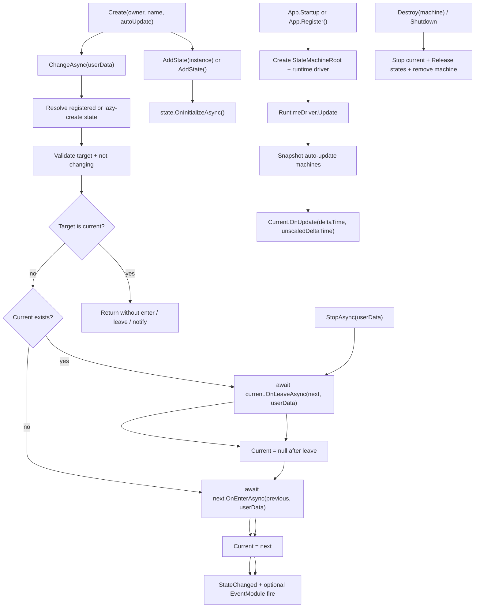

# state-machine-module design

## 0. 术语约定

| 术语 | 当前定义 | 本次约定 |
|---|---|---|
| 无级状态机 / flat state machine | 当前没有统一模块；只有 `ProcedureModule` 管全局顶层流程 | 状态集合是平铺的，同一台机器同一时间只有一个 current state；没有父子层级、并行区域、状态栈或历史状态 |
| `ProcedureModule` | `Assets/GameDeveloperKit/Runtime/Procedure/` 已存在，入口为 `App.Procedure`，用于游戏顶层流程 | 继续只管 Splash、Login、MainMenu、Battle 这类全局互斥阶段；不承载对象级 AI / 技能 / UI 局部状态 |
| `StateMachineModule` | 当前不存在 | 新增运行时模块入口，通过 `App.StateMachine` 创建、登记、更新和销毁对象级状态机 |
| `StateMachine<TOwner>` | 当前不存在 | 绑定一个业务 owner 的状态机实例，按 state concrete type 管理状态并维护唯一 current |
| `StateBase<TOwner>` | 当前不存在 | 业务状态基类，承载 initialize / enter / leave / update / release 生命周期 |
| owner | 当前没有统一叫法 | 状态机绑定的业务对象，例如敌人控制器、技能实例、交互物或 UI 控制器 |
| auto update | 当前没有统一叫法 | 由 `StateMachineModule` runtime driver 每帧驱动当前状态；关闭后由调用方手动 `Update` |

防冲突结论：

- 本 feature 使用 `StateMachine` 命名，不使用 `Fsm` 作为公开主入口，避免缩写降低可读性。
- “无级”按“平铺单当前状态”处理；不等同于 Procedure，也不扩展 Procedure 的职责。
- 当前源码入口是 `App`，历史文档里的 `Super` 不作为本 design 的命名依据。
- 假设：用户要的是可复用于 AI、技能、交互、UI 局部模式的对象级状态机，而不是全局流程、行为树或动画控制器。

## 1. 决策与约束

### 需求摘要

做什么：新增运行时 `StateMachineModule`。业务通过 `App.StateMachine.Create(owner, name)` 创建一台绑定 owner 的状态机；状态机可显式注册 `StateBase<TOwner>` 实例，也可在切换时懒创建带无参构造的状态。`ChangeAsync<TState>(userData)` 负责从当前状态串行离开并进入目标状态；`Update(deltaTime, unscaledDeltaTime)` 只驱动当前状态；`StopAsync()` 离开当前状态并让机器回到空 current。模块默认可接入 `App.Startup()`，并用本地 runtime driver 驱动 `AutoUpdate == true` 的机器。

为谁：战斗单位 AI、技能阶段、Buff 生命周期、交互物状态、局部 UI 模式、工具运行态等需要“一个对象同一时间只处于一个状态”的业务和框架开发者。

成功标准：

- `App.Startup()` 后可以通过 `App.StateMachine` 获取状态机模块；也可以手动 `App.Register<StateMachineModule>()`。
- 调用方可以为任意非空 owner 创建状态机，并通过唯一 name 查询或销毁。
- 每台状态机只维护一个 current state；从空 current 首次 `ChangeAsync<TState>()` 会进入目标状态。
- 显式 `AddState(instance)` 能接入需要依赖注入的状态；未注册但可无参创建的状态可以懒创建并初始化。
- 切换顺序固定为旧状态 `OnLeaveAsync(next, userData)` -> 新状态 `OnEnterAsync(previous, userData)` -> current 指向新状态 -> 发出状态变化通知。
- 切到当前状态是 no-op，不重复 enter / leave。
- `AutoUpdate == true` 时，模块 driver 每帧只驱动 current state；切换中不驱动 update。
- `StopAsync()` 离开 current 后 current 为空；`Destroy(machine)` 和 `Shutdown()` 会停止并释放机器。
- 状态变化能通过机器本地事件观察；若 `EventModule` 已注册，也可以同步派发框架事件。

### 明确不做

- 不替代 `ProcedureModule` 的全局顶层流程。
- 不做行为树、GOAP、动画状态机、技能图编辑器、可视化 FSM 图或状态 DSL。
- 不做层级状态、并行状态、pushdown 状态栈、历史回退、状态快照持久化或自动恢复。
- 不做程序集扫描、attribute 自动发现状态或自动注册所有状态类型。
- 不替代 `TimerModule` 的延迟 / 倒计时 / 循环调度，不替代 `CommandModule` 的 undo / redo。
- 不直接加载资源、打开 UI、执行命令、切场景或管理 GameObject 生命周期。
- 不承诺多线程安全、Job System / Burst 兼容、网络锁步或回滚确定性。

### 复杂度档位

走运行时框架模块默认档位，偏离点：

- `Structure = modules`：新增 `Runtime/StateMachine/` 目录，按公开概念分文件放模块、状态机、状态基类和事件参数。
- `Robustness = L3`：状态切换会调用业务回调，必须明确注册校验、重入、失败、停止、销毁和 shutdown 语义。
- `Determinism = deterministic per machine`：同一机器的 enter / leave / update 顺序固定；不定义多台机器之间的业务优先级，只按登记顺序驱动。
- `Concurrency = Unity main thread`：公开 API 假定主线程调用，不使用 lock 或 concurrent collection 伪装线程安全。

### 关键决策

1. 新建 StateMachineModule，不改 ProcedureModule。
   - Procedure 是全局顶层流程，当前已经明确不做通用 FSM、嵌套状态机或状态栈。
   - 对象级状态机需要多实例、绑定 owner、可手动/自动更新，和全局 Procedure 的“唯一当前流程”不是同一抽象。

2. 默认接入 `App.Startup()`，顺序建议放在 `UIModule` 后、`ProcedureModule` 前。
   - StateMachineModule 本身很轻，只持有 registry 和 driver。
   - 放在 UI / Sound / Resource 之后，shutdown 反序时状态机会先停止，状态 leave 仍可调用这些模块清理资源。
   - 放在 Procedure 之前，shutdown 时 Procedure 先 leave，仍能在自己的 leave 中停止或销毁局部状态机。
   - 如果 review 后希望更保守，可以改成按需手动注册；其余设计不受影响。

3. 一台状态机绑定一个 owner，并只允许一个 current state。
   - owner 不能为空，模块不接管 owner 生命周期。
   - state concrete type 是同一台机器内的唯一 key；同类型重复注册抛明确异常。
   - 不配置 transition graph；默认允许从任意状态切到任意已注册 / 可创建状态，业务限制由 state 自身决定。

4. 支持显式注册和懒创建。
   - `AddState(instance)` 用于需要构造参数、服务依赖或预配置字段的状态。
   - `ChangeAsync<TState>()` 遇到未注册状态时，尝试通过无参构造创建、绑定 machine/owner、执行 `OnInitializeAsync()`。
   - 无法创建的状态抛 `GameException`，提示调用方显式 `AddState(instance)`。
   - 不做程序集扫描，避免把未被业务引用的类型意外纳入状态机。

5. 切换是串行异步流程。
   - `IsChanging == true` 时再次切换抛 `GameException`。
   - leave 失败：保持旧 current，目标状态不进入，异常向调用方抛出。
   - enter 失败：旧状态已经离开，current 为空，异常向调用方抛出。
   - `StopAsync()` 等价于从 current leave 到 null，不触发新状态 enter。

6. 更新既支持自动，也支持手动。
   - `AutoUpdate == true` 的机器由模块 driver 每帧调用 `Update(Time.deltaTime, Time.unscaledDeltaTime)`。
   - `AutoUpdate == false` 的机器只由调用方手动更新，便于 Combat 固定步或测试控制。
   - 模块更新多台机器时使用快照或 pending mutation 策略，允许 update 中销毁机器或发起异步切换而不破坏枚举。

7. 状态变化观察以本地事件为主，EventModule 为可选桥。
   - 每台机器提供 `StateChanged` 本地事件，便于不依赖 EventModule 的业务直接订阅。
   - 如果 `EventModule` 已注册，模块同步派发 `StateMachineChangedEventArgs`，让 Debug 或工具层统一观察。
   - 手动只注册 StateMachineModule 而未注册 EventModule 时，状态切换不因事件模块缺失而失败。

## 2. 名词与编排

### 2.1 名词层

#### 现状

- `Assets/GameDeveloperKit/Runtime/App.cs` 约 395 行，已有 `App.Event`、`App.Timer`、`App.UI`、`App.Procedure`、`App.Combat` 等入口，没有 `App.StateMachine`。
- `Assets/GameDeveloperKit/Runtime/Procedure/ProcedureModule.cs` 约 312 行，维护一个全局 current procedure，通过 `ChangeAsync` 串行切换顶层流程。
- `Assets/GameDeveloperKit/Runtime/Combat/` 已有 ECS World / Entity / System 封装，但 combat system 负责实体集合更新，不提供对象级 FSM 生命周期。
- `Assets/GameDeveloperKit/Runtime/Core/IGameModule.cs` 只定义 `Startup()` / `Shutdown()`，需要 Unity Update 的模块通常自建 runtime driver。
- `Assets/GameDeveloperKit/Runtime/Event/EventModule.cs` 已提供同步事件派发，事件数据继承 `ArgsBase`。
- `Assets/GameDeveloperKit/Runtime/StateMachine/` 当前不存在。

#### 变化

新增模块入口：

```csharp
namespace GameDeveloperKit.StateMachine
{
    public sealed class StateMachineModule : GameModuleBase
    {
        public IReadOnlyList<StateMachineBase> Machines { get; }

        public override UniTask Startup();
        public override UniTask Shutdown();

        public StateMachine<TOwner> Create<TOwner>(TOwner owner, string name = null, bool autoUpdate = true)
            where TOwner : class;

        public bool TryGet(string name, out StateMachineBase machine);
        public bool Destroy(StateMachineBase machine);
        public int DestroyOwner(object owner);
    }
}
```

新增 `App` 入口：

```csharp
public static StateMachineModule StateMachine => Get<StateMachineModule>();
```

新增状态机基类和泛型状态机：

```csharp
public abstract class StateMachineBase : IReference
{
    public string Name { get; }
    public object Owner { get; }
    public Type OwnerType { get; }
    public StateBase Current { get; }
    public Type CurrentType { get; }
    public bool IsChanging { get; }
    public bool AutoUpdate { get; set; }

    public abstract UniTask StopAsync(object userData = null);
    public abstract void Update(float deltaTime, float unscaledDeltaTime);
}
```

```csharp
public sealed class StateMachine<TOwner> : StateMachineBase where TOwner : class
{
    public new TOwner Owner { get; }
    public new StateBase<TOwner> Current { get; }

    public event Action<StateMachineChangedEventArgs> StateChanged;

    public void AddState(StateBase<TOwner> state);
    public TState AddState<TState>() where TState : StateBase<TOwner>, new();
    public bool HasState<TState>() where TState : StateBase<TOwner>;
    public bool TryGetState<TState>(out TState state) where TState : StateBase<TOwner>;

    public UniTask ChangeAsync<TState>(object userData = null) where TState : StateBase<TOwner>, new();
    public UniTask ChangeAsync(Type stateType, object userData = null);
}
```

新增状态基类：

```csharp
public abstract class StateBase : IReference
{
    public StateMachineBase Machine { get; }
    public object Owner { get; }

    public virtual UniTask OnInitializeAsync();
    public virtual UniTask OnEnterAsync(StateBase previous, object userData);
    public virtual UniTask OnLeaveAsync(StateBase next, object userData);
    public virtual void OnUpdate(float deltaTime, float unscaledDeltaTime);
    public virtual void Release();
}
```

```csharp
public abstract class StateBase<TOwner> : StateBase where TOwner : class
{
    public new StateMachine<TOwner> Machine { get; }
    public new TOwner Owner { get; }
}
```

新增状态变化事件参数：

```csharp
public sealed class StateMachineChangedEventArgs : ArgsBase
{
    public StateMachineBase Machine { get; }
    public StateBase Previous { get; }
    public StateBase Current { get; }
    public object UserData { get; }
}
```

接口示例：

```csharp
var machine = App.StateMachine.Create(enemy, "EnemyAI");
machine.AddState(new IdleState());
machine.AddState(new AttackState(skillService));

await machine.ChangeAsync<IdleState>();
```

```csharp
public sealed class IdleState : StateBase<EnemyController>
{
    public override void OnUpdate(float deltaTime, float unscaledDeltaTime)
    {
        if (Owner.HasTarget)
        {
            Machine.ChangeAsync<AttackState>().Forget();
        }
    }
}
```

固定步或测试场景：

```csharp
var machine = App.StateMachine.Create(skill, "SkillPhase", autoUpdate: false);
await machine.ChangeAsync<CastingState>();

machine.Update(world.FixedDeltaTime, world.FixedDeltaTime);
```

### 2.2 编排层



#### 现状

- 没有状态机 registry、状态基类或状态变化事件。
- 业务如果要做对象级状态，只能自建 enum / class / MonoBehaviour 字段和切换逻辑。
- ProcedureModule 虽然有 enter / leave / update 结构，但它是单例全局流程，不适合给每个对象创建一台局部状态机。

#### 变化

1. StateMachineModule Startup：
   - 创建 `GameDeveloperKit.StateMachineRoot`，挂载私有 runtime driver，并 `DontDestroyOnLoad`。
   - 初始化机器 registry、name 索引和 update 快照缓存。
   - 不创建默认机器，不扫描状态类型，不自动进入初始状态。

2. Create / Destroy：
   - `Create(owner, name, autoUpdate)` 校验 owner 非空。
   - name 为空时生成稳定可读的默认名；显式 name 重复时抛 `GameException`。
   - 创建 `StateMachine<TOwner>` 并加入 registry。
   - `Destroy(machine)` 对当前状态执行 stop，释放已注册状态，从 registry 移除机器。
   - `DestroyOwner(owner)` 销毁同一 owner 绑定的全部机器，用于业务对象释放时批量清理。

3. AddState / lazy create：
   - `AddState(instance)` 校验 state 非空、类型兼容当前 owner、同 concrete type 未注册。
   - 绑定 machine / owner 后调用 `OnInitializeAsync()`。
   - `ChangeAsync(Type)` 如果目标未注册，尝试无参创建并初始化；失败时抛 `GameException`。
   - 同一台机器内一个 state concrete type 只存在一个实例；不同机器可以注册同类型 state。

4. ChangeAsync：
   - 校验目标类型继承 `StateBase<TOwner>`，不是抽象类型且不含开放泛型参数。
   - `IsChanging == true` 时抛 `GameException`。
   - 切到当前状态时 no-op 返回，不重复 enter / leave，也不触发状态变化事件。
   - 设置 `IsChanging = true`。
   - 有旧 current 时，先 `await current.OnLeaveAsync(next, userData)`。
   - leave 成功后把 current 置空，再 `await next.OnEnterAsync(previous, userData)`。
   - enter 成功后把 current 指向 next，触发 `StateChanged` 和可选 EventModule 事件。
   - finally 恢复 `IsChanging = false`。

5. Update：
   - runtime driver 每帧读取 `Time.deltaTime` / `Time.unscaledDeltaTime`。
   - 对 registry 做快照，只更新 `AutoUpdate == true`、`Current != null`、`IsChanging == false` 的机器。
   - 每台机器只调用 current state 的 `OnUpdate(deltaTime, unscaledDeltaTime)`。
   - `AutoUpdate == false` 的机器由调用方手动 `Update`；手动 update 使用同样的 current / changing 校验。
   - `OnUpdate` 抛异常不静默吞掉，应能在 Unity 日志 / 调用栈中观察。

6. Stop / Shutdown：
   - `StopAsync(userData)` 当前状态存在时调用 `OnLeaveAsync(null, userData)`，成功后 current 为空并发出状态变化通知。
   - `Shutdown()` 逐台 stop 并 release；某台机器清理失败时记录首个异常，继续清理剩余机器，最后抛出首个异常。
   - 重复 shutdown / destroy 已销毁机器不应产生空引用异常。

#### 流程级约束

- 错误语义：空 owner / state / machine 抛 `ArgumentNullException`；重复 name、重复 state type、state 类型不兼容、无法创建目标状态、切换重入抛 `GameException`。
- 幂等性：切到当前状态 no-op；销毁不存在机器返回 false；重复 stop 在 current 为空时 no-op。
- 顺序：同一台机器一次切换最多执行一次旧 leave 和一次新 enter；enter 成功后才更新 current 和通知。
- 失败：leave 失败保留旧 current；enter 失败 current 为空；Destroy / Shutdown 尽量释放剩余状态并保留首个异常。
- 更新：切换中不调用 current update；旧状态 leave 成功后不再收到 update。
- 并发：公开 API 假定 Unity 主线程；不支持并发 ChangeAsync / Destroy。
- 可观测点：machine name、owner、Current、CurrentType、IsChanging、AutoUpdate、StateChanged 和 `StateMachineChangedEventArgs`。

### 2.3 挂载点清单

1. `App.StateMachine` 和默认启动计划：运行时访问对象级状态机能力的框架入口。
2. `Assets/GameDeveloperKit/Runtime/StateMachine/`：StateMachineModule、StateMachine、StateBase 和事件参数的集中落点。
3. `StateMachineModule` registry / factory / runtime driver：创建、查询、自动更新和销毁多台状态机的主挂载点。
4. `StateMachine<TOwner>` / `StateBase<TOwner>` 生命周期：业务状态进入、离开、更新和释放的公开契约。
5. `StateChanged` / `StateMachineChangedEventArgs`：调试工具或业务观察局部状态变化的入口。

拔除沙盘：移除 `App.StateMachine`、删除 `Runtime/StateMachine/`、清理业务对 `StateMachine<TOwner>` / `StateBase<TOwner>` 的引用并回滚默认启动计划后，对象级无级状态机能力应消失；Procedure、Combat、Timer、UI、Event 等模块不应受影响。

### 2.4 推进策略

1. 模块入口和目录骨架：新增 `Runtime/StateMachine/`、`StateMachineModule`、`StateMachineBase`、`StateMachine<T>`、`StateBase`、`StateBase<T>`、事件参数和 `App.StateMachine`；默认启动计划插入到 UIModule 后、ProcedureModule 前。
   - 退出信号：`App.Startup()` 或手动注册 StateMachineModule 后可访问 `App.StateMachine`，Machines 为空且 driver 可清理。
2. 机器 registry 与生命周期：实现 `Create`、name 唯一性、`TryGet`、`Destroy`、`DestroyOwner` 和 shutdown 清理。
   - 退出信号：能创建多台绑定不同 owner 的机器，按 name 查询，销毁后不再被自动更新。
3. 状态注册与懒创建：实现 `AddState(instance)`、`AddState<T>()`、`HasState`、`TryGetState`、machine / owner 绑定、初始化和重复校验。
   - 退出信号：显式状态和无参状态都能进入注册表，重复 type 或不兼容 state 抛明确异常。
4. 切换与停止编排：实现 `ChangeAsync`、no-op、leave / enter 顺序、失败语义、`StopAsync` 和 IsChanging。
   - 退出信号：A 切到 B 的顺序为 A leave -> B enter -> current=B；stop 后 current 为空。
5. 自动 / 手动 Update：接入 runtime driver、AutoUpdate、手动 update 和 update 快照遍历。
   - 退出信号：AutoUpdate 机器每帧只更新 current；AutoUpdate=false 机器只有手动 Update 时更新。
6. 状态变化观察与错误收口：实现本地 `StateChanged`、可选 EventModule 派发、Destroy / Shutdown 首异常保留和异常消息。
   - 退出信号：状态变化可被本地订阅和框架事件观察；清理失败不阻止剩余机器释放。
7. 验证覆盖：覆盖模块注册、创建 / 销毁、状态注册、切换、失败、update、stop、shutdown 和范围守护。
   - 退出信号：`dotnet build GameDeveloperKit.Runtime.csproj --no-restore` 通过，关键验收契约有测试或可观察证据。

### 2.5 结构健康度与微重构

#### 评估

- compound convention 检索：未命中“状态机 / state machine / FSM / procedure / 目录组织 / 文件归属 / 命名约定”相关长期约定。
- 文件级 — `Assets/GameDeveloperKit/Runtime/App.cs`：约 395 行，是模块入口和默认启动计划聚合点；本次只新增 using、`App.StateMachine` 和一条默认注册，属于现有职责延伸，不需要先拆。
- 文件级 — `Assets/GameDeveloperKit/Runtime/Procedure/ProcedureModule.cs`：约 312 行，职责是全局 Procedure；本次不改它，避免把对象级状态机塞进全局流程模块。
- 文件级 — `Assets/GameDeveloperKit/Runtime/Combat/CombatModule.cs` / `SystemManager.cs`：Combat 已有自己的 ECS 更新和系统匹配；本次不改 combat，业务后续可自行用 StateMachineModule 组合 combat 对象。
- 目录级 — `Assets/GameDeveloperKit/Runtime/StateMachine/` 当前不存在；新增 5-7 个公开类型后目录可读，按公开概念分文件即可。

#### 结论：不做前置微重构

本次没有需要先“只搬不改行为”的既有代码。实现阶段直接新增 `Runtime/StateMachine/` 并按公开类型分文件；`StateMachineRuntimeDriver` 放在 `StateMachineModule.cs` 内部作为私有嵌套类，`App.cs` 继续作为模块入口聚合点保留现状。

#### 超出范围的观察

- 如果未来 Procedure 希望复用 StateMachineModule 内核，需要另起重构设计；本 feature 不回改 Procedure 语义。
- 如果 Combat 后续需要固定步确定性状态机，可让业务创建 `AutoUpdate=false` 的 machine 并由 combat world 手动驱动；不要在本 feature 里承诺网络回滚或深拷贝。
- 如果需要可视化状态图、transition guard DSL 或调试面板，应另起 Editor / Debug feature，不塞进首版 runtime module。

## 3. 验收契约

| 编号 | 输入 / 触发 | 期望可观察结果 |
|---|---|---|
| N1 | `await App.Startup()` 后访问 `App.StateMachine` | 返回已注册的 `StateMachineModule` 实例 |
| N2 | `App.StateMachine.Create(enemy, "EnemyAI")` | 返回绑定 enemy 的 `StateMachine<Enemy>`，Machines 包含该机器，`Current == null` |
| N3 | 再次用同名 `"EnemyAI"` 创建机器 | 抛 `GameException`，原机器不被替换 |
| N4 | `machine.AddState(new IdleState())` | `HasState<IdleState>() == true`，`TryGetState` 返回同一实例 |
| N5 | 第一次 `ChangeAsync<IdleState>()` 且 Idle 未提前注册但有无参构造 | 模块自动创建并初始化 Idle，调用 `OnEnterAsync(null, userData)`，Current 指向 Idle |
| N6 | Current 为 Idle 时 `ChangeAsync<AttackState>()` | 调用顺序为 Idle leave -> Attack enter；成功后 Current 指向 Attack |
| N7 | Current 为 Idle 时再次 `ChangeAsync<IdleState>()` | no-op，不重复调用 enter / leave，不触发状态变化事件 |
| N8 | `AutoUpdate == true` 且 runtime driver Update | 当前状态收到 `OnUpdate(deltaTime, unscaledDeltaTime)` |
| N9 | `AutoUpdate == false` 且 runtime driver Update | 当前状态不被自动更新；调用 `machine.Update(...)` 后才收到 update |
| N10 | `StopAsync()` 且 Current 为 Idle | Idle 收到 `OnLeaveAsync(null, userData)`，Current 变为空，并触发状态变化通知 |
| N11 | 订阅 `StateChanged` 后从 Idle 切到 Attack | 收到 Machine、Previous=Idle、Current=Attack、UserData 为本次入参的事件参数 |
| N12 | EventModule 已注册并订阅 `StateMachineChangedEventArgs` | 状态切换后能通过 EventModule 观察到同一变化 |
| N13 | `Destroy(machine)` | 当前状态被 stop，已注册状态被 Release，机器从 Machines 移除 |
| N14 | `Shutdown()` 时存在多台机器 | 模块逐台 stop / release / clear，driver GameObject 被销毁 |
| B1 | `Create(null, "x")` | 抛 `ArgumentNullException` |
| B2 | `AddState(null)` | 抛 `ArgumentNullException` |
| B3 | 重复注册同一 concrete state type | 抛 `GameException`，原状态实例不被替换 |
| B4 | `ChangeAsync` 到非 `StateBase<TOwner>`、抽象状态或无法创建的状态 | 抛 `GameException`，Current 按失败语义保持或清空 |
| B5 | Destroy 不存在或已销毁的 machine | 返回 false 或 no-op，不抛空引用异常 |
| E1 | 当前 state 的 `OnLeaveAsync` 抛异常 | 异常向调用方抛出，Current 仍为旧状态，新状态不进入 |
| E2 | 新 state 的 `OnEnterAsync` 抛异常 | 异常向调用方抛出，Current 为空，旧状态不再 update |
| E3 | `ChangeAsync` 正在运行时再次 `ChangeAsync` | 抛 `GameException`，不启动第二个切换 |
| E4 | 切换过程中 runtime driver Update | 不调用旧状态或新状态的 `OnUpdate` |
| E5 | 手动只注册 StateMachineModule，未注册 EventModule | 状态切换仍成功，本地 `StateChanged` 可观察，不因 EventModule 缺失抛错 |

### 明确不做的反向核对项

- 不改 `ProcedureModule` 为 StateMachineModule 的包装，也不把对象级状态塞进 Procedure。
- 不新增层级状态、并行状态、push / pop 状态栈、历史回退或状态快照持久化。
- 不新增行为树、GOAP、动画状态机、技能图编辑器、可视化 FSM 图或 transition DSL。
- 不新增程序集扫描、attribute 自动发现状态或隐式注册所有 StateBase。
- 不替代 Timer、Command、Event、UI、Resource、Combat 的已有职责。
- 不新增多线程、Job System、Burst、网络锁步或回滚确定性承诺。
- 不直接管理 owner 的生命周期；owner 释放时由调用方 Destroy machine 或 DestroyOwner。

## 4. 与项目级架构文档的关系

验收通过后需要更新 `.codestable/architecture/ARCHITECTURE.md`：

- 新增 StateMachine 子系统：入口 `StateMachineModule` / `App.StateMachine`，默认启动顺序在 UIModule 后、ProcedureModule 前。
- 记录核心类型：`StateMachineModule`、`StateMachineBase`、`StateMachine<TOwner>`、`StateBase`、`StateBase<TOwner>`、`StateMachineChangedEventArgs`。
- 记录生命周期：机器 create / destroy，状态 initialize / enter / leave / update / release，stop 后 current 为空。
- 记录切换失败语义：leave 失败保留旧 current；enter 失败 current 为空；切换重入抛 `GameException`。
- 记录更新语义：AutoUpdate 由模块 driver 每帧推进；AutoUpdate=false 由调用方手动 update。
- 记录边界：StateMachineModule 不替代 Procedure、Timer、Command、UI、Resource、Combat，不做层级 / 并行 / 状态栈 / 可视化编辑器 / 多线程安全。
