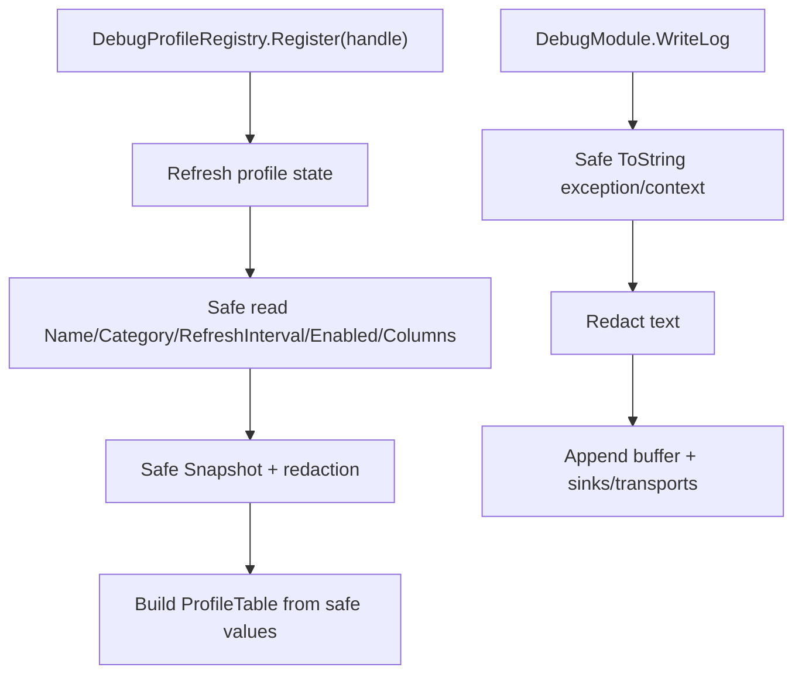

# debug-profilehandle-hardening design

## 0. 术语约定

| 术语 | 定义 | 防冲突结论 |
|---|---|---|
| `ProfileHandle` | Debug profile table 的现有扩展点，外部模块继承后提供 Name/Category/RefreshInterval/Enabled/Columns/Snapshot | 继续沿用，不新增第二套 profile 接口 |
| `ProfileTable` | Debug profile registry 的只读快照 table | 改为保存已安全读取的 name/category，不在构造时再调用不可信 getter |
| `DebugStatusProfileHandle` | Debug 内建 profile，用 ProfileHandle 形式暴露日志、sink、transport、analytics、metrics、console 等状态 | 只暴露 Debug 自身状态，不替代后续 transport dispatcher |
| safe stringify | 对 exception/context 执行 ToString 时捕获异常并返回 fallback 文本 | 用于 redaction 前字符串化，避免日志 API 反向抛异常 |

## 1. 决策与约束

### 需求摘要

本 feature 推进 roadmap 第二条：修正 Debug profile 和 redaction 两个扩展点的异常击穿问题，并把 Debug 自身的关键内部状态注册成 `ProfileHandle`。Debug 仍保持现有 `App.Debug` 公开 API，后续 transport dispatcher、Timer refresh 和模块 profile 批量接入不在本次完成。

成功标准：

- `ProfileHandle.Name`、`Category`、`RefreshInterval`、`Enabled`、`Columns`、`Snapshot()` 任意 getter 抛异常时，只影响对应 table，不影响注册/刷新/其他 profile。
- redaction 开启时，exception/context 的 `ToString()` 抛异常不会让 `App.Debug.Error/Info` 抛出。
- Debug startup 自动注册内建 profile，能在 `Profiles.Snapshot()` 中看到 Debug 自身状态。
- 现有日志、sink、analytics、transport、profile 注册 API 保持兼容。

### 明确不做

- 不实现完整 transport dispatcher pending/cancel/shutdown 收束；这是 `debug-transport-dispatcher`。
- 不把 Debug metrics/profile refresh 接入 Timer；这是 `debug-timer-refresh`。
- 不迁移 Procedure/Combat driver。
- 不新增 NetworkModule、网络发送实现、鉴权、重试或批量上传。
- 不重命名 `GameDeveloperKit.Logger` namespace。
- 不拆 DebugModule 的公开 API 或改 Console UI 结构。

### 复杂度档位

走 Runtime 诊断基础设施默认档位，偏离点：

- `Robustness = L3`：profile handle 和 log context 都是外部扩展点，必须异常隔离。
- `Security = validated`：redaction 仍必须发生在 buffer/sink/transport 之前。
- `Observability = instrumented`：Debug 自身状态以 profile table 形式暴露。

### 关键决策

1. registry 层安全读取 profile 元数据。
   - `ProfileTable` 不再从 handle getter 读取 name/category。
   - registry 捕获 getter 异常后生成 fallback name/category，并把异常写入 table。

2. redaction 前先 safe stringify。
   - exception/context 只有在 redaction 开启时才字符串化。
   - `ToString()` 抛异常时写 fallback 文本，并继续创建日志记录。

3. Debug 内建状态 profile 复用 `ProfileHandle`。
   - startup 注册 `DebugStatusProfileHandle`。
   - shutdown / Clear profiles 时清理；手动 `Profiles.Clear()` 后不自动补回，除非 DebugModule 重新 startup。

## 2. 名词与编排

### 2.1 名词层

#### 现状

- `DebugProfileRegistry.Refresh()` try/catch 包住 table 构造和 snapshot，但 `ProfileTable` 构造会读取 `handle.Name` / `handle.Category`，catch 分支仍可能再次抛。
- redaction helper 直接调用 `exception.ToString()` 和 `context.ToString()`。
- DebugModule 当前只在 Settings tab 显示内部状态，没有把自身状态作为 profile table 注册。

#### 变化

`ProfileTable` 构造改为接受安全值：

```csharp
public ProfileTable(
    ProfileHandle handle,
    string name,
    string category,
    IReadOnlyList<ProfileColumn> columns,
    IReadOnlyList<ProfileRow> rows,
    Exception exception = null);
```

新增 Debug 内建 profile：

```csharp
internal sealed class DebugStatusProfileHandle : ProfileHandle
{
    public override string Name => "Debug";
    public override string Category => "Runtime";
    public override IReadOnlyList<ProfileColumn> Columns { get; }
    public override IReadOnlyList<ProfileRow> Snapshot();
}
```

### 2.2 编排层



#### 流程级约束

- `Register(null)` / `Unregister(null)` 仍抛 `ArgumentNullException`。
- 注册时 profile metadata 抛异常也应注册成功，并生成 error table。
- refresh 时单个 profile 失败不影响其他 profile。
- `ProfileTable.Name` fallback 不为空；Category fallback 为 `Runtime`。
- redaction 失败或 `ToString()` 失败不能阻断日志写入。
- Debug 内建 profile 不应被重复注册。

### 2.3 挂载点清单

- `DebugProfileRegistry.Refresh(ProfileState)`：profile 异常隔离挂载点。
- `ProfileTable` constructor：从不可信 getter 读取改为使用安全元数据。
- `DebugModule.RedactException/RedactContext`：safe stringify 挂载点。
- `DebugModule.Startup()`：内建 Debug 状态 profile 注册挂载点。

### 2.4 推进策略

1. ProfileTable/registry 硬化：安全读取 metadata、columns、snapshot，并生成 error table。
   - 退出信号：Name/Category/RefreshInterval/Enabled/Columns/Snapshot 抛异常都不会击穿 registry。
2. redaction safe stringify：为 exception/context ToString 加兜底。
   - 退出信号：日志 API 在 throwing ToString 对象下不抛异常，仍写入 redacted/fallback 记录。
3. Debug 内建状态 profile：用 `ProfileHandle` 暴露 Debug 自身状态。
   - 退出信号：Debug startup 后 `Profiles.Snapshot()` 包含 Runtime/Debug table。
4. 测试与 roadmap 回写。
   - 退出信号：Debug 聚焦测试和 Runtime 快速编译通过。

### 2.5 结构健康度与微重构

#### 评估

- `DebugModule.cs` 仍偏胖，但本次只新增一个内建 profile 注册点和一个内部 profile 类型；不做完整 service 拆分。
- `DebugProfileRegistry.cs` 是 profile 异常隔离的自然归属点，修改集中。
- redaction helper 仍在 `DebugModule.cs`，因为后续 `debug-transport-dispatcher` / service 拆分前先不抽独立 policy。

#### 结论：不做前置微重构

理由：本 feature 是 P1 行为硬化 + 小范围可观测补强。完整拆分 log pipeline / transport dispatcher / redaction policy 会扩大到后续 roadmap item，本次先保证扩展点不反向击穿业务。

#### 超出范围的观察

- `DebugModule.cs` 仍是 god class 风险；后续 `debug-transport-dispatcher` 和 `debug-timer-refresh` 推进时应逐步拆 internal 协作者。

## 3. 验收契约

### 关键场景清单

- N1：注册正常 `ProfileHandle` → table name/category/columns/rows 正常。
- N2：`ProfileHandle.Snapshot()` 抛异常 → 该 table `HasError=true`，其他 profile 正常。
- N3：`ProfileHandle.Name` 抛异常 → register/refresh 不抛，table 使用 fallback name 并记录异常。
- N4：`ProfileHandle.Category` 抛异常 → register/refresh 不抛，table 使用 fallback category 并记录异常。
- N5：`ProfileHandle.RefreshInterval` 或 `Columns` 抛异常 → register/refresh 不抛，table columns 为空或保留上次安全值，并记录异常。
- N6：redaction 开启且 exception `ToString()` 抛异常 → `App.Debug.Error(exception, ...)` 不抛，日志仍进入 buffer。
- N7：redaction 开启且 context `ToString()` 抛异常 → `App.Debug.Info(..., context)` 不抛，日志仍进入 buffer。
- N8：Debug startup 后 → `Profiles.Snapshot()` 包含内建 `Runtime/Debug` table。
- B1：redaction 关闭时 → exception/context 保持原对象，不强制 safe stringify。
- E1：`RegisterProfile(null)` / `UnregisterProfile(null)` 仍抛 `ArgumentNullException`。

### 明确不做的反向核对项

- 不新增第二套 profile 接口。
- 不实现 transport pending/cancel/shutdown dispatcher。
- 不把 Debug refresh 接入 Timer。
- 不新增 Network 模块或网络发送实现。
- 不重命名 Debug namespace。

## 4. 与项目级架构文档的关系

本 feature 完成后，acceptance 阶段需要更新 `.codestable/architecture/ARCHITECTURE.md` 的 Debug 小节：Profile registry 安全读取 metadata/columns/snapshot；redaction 对 exception/context `ToString()` 有兜底；Debug startup 注册内建状态 profile。transport dispatcher 和 Timer refresh 仍保持后续 item。
