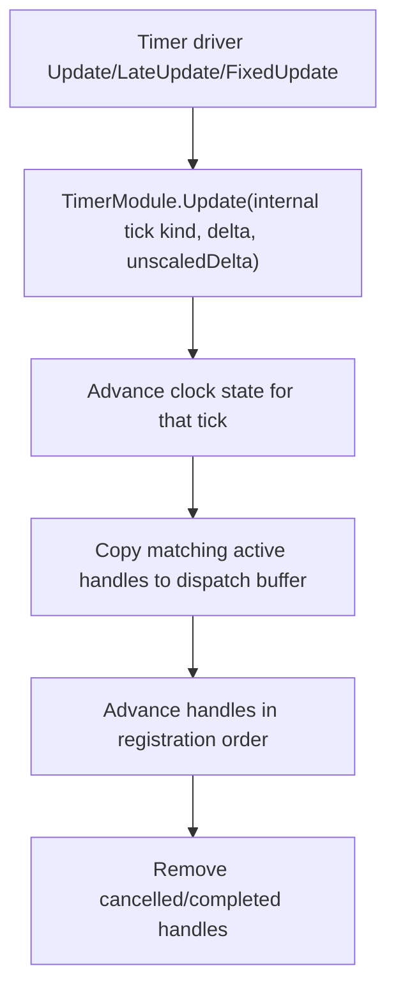

# timer-update-consumer-contract design

## 0. 术语约定

| 术语 | 定义 | 防冲突结论 |
|---|---|---|
| `TimerUpdateHandle` | update 型 timer handle 基类，负责每 tick 回调、启停、LastTick 和 LastException | 不是独立 consumer 接口，仍属于 `TimerHandle` 体系 |
| `UpdateTimerHandle` | 每个 Unity `Update` tick 推进的显式 handle | 对外注册方式为 `timer.Register(new UpdateTimerHandle(...))` 或 `timer.OnUpdate(...)` |
| `LateUpdateTimerHandle` | 每个 Unity `LateUpdate` tick 推进的显式 handle | 对外注册方式为 `timer.Register(new LateUpdateTimerHandle(...))` 或 `timer.OnLateUpdate(...)` |
| `FixedUpdateTimerHandle` | 每个 Unity `FixedUpdate` tick 推进的显式 handle | 对外注册方式为 `timer.Register(new FixedUpdateTimerHandle(...))` 或 `timer.OnFixedUpdate(...)` |
| `TimerUpdateContext` | Timer 调用 update handle 时传入的只读上下文，包含 tick、time、delta 等时钟数据 | `TickKind` 是内部调度口径，不作为公开选择 API |

## 1. 决策与约束

### 需求摘要

本 feature 实现 roadmap 的最小闭环：TimerModule 提供 `Update`、`LateUpdate`、`FixedUpdate` 三类运行时 tick，并让业务或其他模块通过显式 handle 选择需要的 tick。Timer 继续统一管理 delay/countdown/interval/update handles，update handle 抛异常时记录到自身状态，不阻断后续 handle。

成功标准：

- `UpdateTimerHandle`、`LateUpdateTimerHandle`、`FixedUpdateTimerHandle` 可分别注册，并且只在匹配 Unity tick 被推进。
- `timer.Register(new LateUpdateTimerHandle(action))` 这种显式注册路径可用，同时保留 `OnUpdate` / `OnLateUpdate` / `OnFixedUpdate` 便捷 API。
- `TimerHandle` 基类保持瘦身，不承载 delay/interval/countdown 的业务字段；业务状态留在对应派生类。
- `Delay` / `Countdown` / `Interval` 保持旧调用兼容，默认走 Update tick。
- 单个 update handle 抛异常时不打断后续 handle，异常写入 handle snapshot。

### 明确不做

- 不保留 `ITimerUpdateConsumer`、`TimerUpdatePhase`、`TimerUpdateSubscription` 或 consumer snapshot 这套公开模型。
- 不迁移 Debug/Procedure/Combat 到 Timer；这些是后续 roadmap item。
- 不实现 Network transport、Debug profile handle 或 DebugModule 拆分。
- 不替代 Unity coroutine、UniTask 或 OperationModule。
- 不提供线程安全、优先级队列、后台线程、job system 或网络锁步确定性。
- 不改 Unity 全局 `Time.fixedDeltaTime`。

### 复杂度档位

走 Runtime 基础设施默认档位，偏离点：

- `Robustness = L3`：update handle 是外部扩展点，必须隔离单个 handle 异常。
- `Compatibility = additive`：旧 `Delay` / `Countdown` / `Interval` 调用保持默认 Update 行为。
- `Observability = instrumented`：`TimerSnapshot.Updates` 暴露 active update handles 的 tick、enabled、last tick、last exception。

### 关键决策

1. 使用显式 handle 取代 consumer/phase 模型。
   - 注册 `new UpdateTimerHandle(action)` 表示走 Update。
   - 注册 `new LateUpdateTimerHandle(action)` 表示走 LateUpdate。
   - 注册 `new FixedUpdateTimerHandle(action)` 表示走 FixedUpdate。

2. `TimerTickKind` 只保留为内部调度实现细节。
   - 业务通过 handle 类型选择 tick。
   - `TimerUpdateContext.TickKind` 和 `TimerHandle.TickKind` 只在程序集内部用于测试、Debug tab 和调度分流。

3. `TimerHandle` 基类只管生命周期。
   - 基类保存 module、owner、tag、cancel/complete/pause 状态和 `Advance()` 模板。
   - `Delay`、`Interval`、`Duration`、`Elapsed`、`Remaining`、`Progress`、`NextFireTime` 留在对应派生类。

## 2. 名词与编排

### 2.1 名词层

#### 现状

- Timer 旧实现只有单一 `Update(float deltaTime, float unscaledDeltaTime)` 推进口径。
- 旧 `TimerHandle` 试图承载 delay/interval/countdown 共享字段，基类偏胖。
- Debug/Procedure/Combat 后续都需要选择不同 Unity tick，但不需要一套额外 consumer 接口。

#### 变化

TimerModule 新增 API：

```csharp
public TimerHandle Register(TimerHandle handle, object owner = null, string tag = null);
public T Register<T>(T handle, object owner = null, string tag = null) where T : TimerHandle;
public bool Unregister(TimerHandle handle);

public UpdateTimerHandle OnUpdate(Action callback, object owner = null, string tag = null);
public UpdateTimerHandle OnUpdate(Action<TimerUpdateContext> callback, object owner = null, string tag = null);
public LateUpdateTimerHandle OnLateUpdate(Action callback, object owner = null, string tag = null);
public LateUpdateTimerHandle OnLateUpdate(Action<TimerUpdateContext> callback, object owner = null, string tag = null);
public FixedUpdateTimerHandle OnFixedUpdate(Action callback, object owner = null, string tag = null);
public FixedUpdateTimerHandle OnFixedUpdate(Action<TimerUpdateContext> callback, object owner = null, string tag = null);
```

Update handle：

```csharp
public abstract class TimerUpdateHandle : TimerHandle
{
    public bool Enabled { get; set; }
    public long LastTick { get; }
    public Exception LastException { get; }
    public bool HasError { get; }
}
```

TimerSnapshot：

```csharp
public readonly struct TimerSnapshot
{
    public IReadOnlyList<TimerDelayHandle> Delays { get; }
    public IReadOnlyList<TimerCountdownHandle> Countdowns { get; }
    public IReadOnlyList<TimerIntervalHandle> Intervals { get; }
    public IReadOnlyList<TimerUpdateHandle> Updates { get; }
}
```

### 2.2 编排层



#### 变化

- `TimerModule.Timer` 增加 Unity `Update()`、`LateUpdate()`、`FixedUpdate()` 三个入口。
- TimerModule 为三类 tick 维护各自 tick/time/delta；公开 `Tick` / `Time` / `DeltaTime` / `UnscaledDeltaTime` 保持 Update tick 兼容口径。
- `_handles` 统一保存 delay/countdown/interval/update handles；每轮 tick 只推进内部 tick kind 匹配的 handle。
- 遍历前复制到 `_dispatchBuffer`，回调中注册/移除其他 handle 不破坏当前 tick。
- Update handles 按注册顺序调用，不再提供 phase 排序轴；需要顺序时由注册顺序表达。

#### 流程级约束

- `Register(null)` 抛 `ArgumentNullException`。
- 同一个 active handle 重复注册不重复调用，返回原 handle。
- 单个 update handle 抛异常时写入 `LastException`，继续调用后续 handle。
- `Unregister()` 会 detach handle；`Cancel()` 只标记取消，清理在推进后统一发生。
- `Shutdown()` 取消全部 handles，并销毁 Timer driver。

### 2.3 挂载点清单

- `TimerModule.Register(TimerHandle)`：显式 handle 注册挂载点。
- `TimerModule.OnUpdate/OnLateUpdate/OnFixedUpdate`：业务便捷挂载点。
- `TimerSnapshot.Updates`：Debug Timer tab 和后续 profile 读取 update handle 状态的观测挂载点。
- `TimerModule.Timer.Update/LateUpdate/FixedUpdate`：Unity 生命周期桥接挂载点。

### 2.4 推进策略

1. 瘦身 `TimerHandle` 并把 delay/countdown/interval 状态下沉到派生类。
   - 退出信号：旧 delay/countdown/interval 测试通过。
2. 新增显式 update handle 类型和 `TimerUpdateContext`。
   - 退出信号：Runtime 编译能识别 `UpdateTimerHandle` / `LateUpdateTimerHandle` / `FixedUpdateTimerHandle`。
3. Timer driver 接入三类 Unity tick。
   - 退出信号：测试可手动推进三类 tick。
4. TimerModule 统一注册、分流、异常隔离和 snapshot。
   - 退出信号：异常 update handle 不阻断后续 handle。
5. 测试覆盖与 roadmap 回写。
   - 退出信号：Runtime 快速编译和 Timer 测试通过，items.yaml 标记 done。

### 2.5 结构健康度与微重构

#### 评估

- `TimerModule.cs` 继续承担统一调度门面，但 update handle 注册逻辑已和普通 timer handles 合并，没有额外 consumer registry 文件。
- `TimerHandle.cs` 已瘦身，基类不再保存 delay/interval/countdown 业务字段。
- Timer handle 类型进入 `Assets/GameDeveloperKit/Runtime/Timer/Handle/`，目录归属清晰。

#### 结论：做目录重组和基类瘦身

- 搬什么：`TimerHandle`、`TimerDelayHandle`、`TimerCountdownHandle`、`TimerIntervalHandle` 以及新增 update handles。
- 搬到哪：`Assets/GameDeveloperKit/Runtime/Timer/Handle/`。
- 行为不变怎么验证：旧 Timer 测试和新增 update handle 测试一起跑；Runtime 快速编译绿灯。

## 3. 验收契约

### 关键场景清单

- N1：注册 `UpdateTimerHandle`，触发 Update tick → callback 被调用，context 使用 Update tick 口径。
- N2：注册 `LateUpdateTimerHandle`，触发 Update tick → 不调用；触发 LateUpdate tick → 调用。
- N3：注册 `FixedUpdateTimerHandle`，触发 Update/LateUpdate tick → 不调用；触发 FixedUpdate tick → 调用。
- N4：同 tick 注册多个 update handles，触发该 tick → 按注册顺序调用。
- N5：第一个 update handle 抛异常，第二个正常 → 第二个仍被调用，第一个记录 `LastException`。
- N6：重复注册同一个 update handle → 单次 tick 只调用一次。
- N7：`Unregister(handle)` 后触发 tick → handle 不再被调用。
- B1：旧 `Delay` / `Countdown` / `Interval` 不改调用方式 → 默认仍走 Update，旧行为不变。
- B2：回调中 cancel 自己或其他 timer → 当前 tick 使用 buffer 稳定推进，不抛集合修改异常。
- E1：`Register(null)` → 抛 `ArgumentNullException`。
- E2：Shutdown 后 snapshot 为空，旧 handle 处于 cancelled 或 detached 状态。

### 明确不做的反向核对项

- 代码中不应存在 `ITimerUpdateConsumer`、`TimerUpdatePhase`、`TimerUpdateSubscription`。
- 代码中不应迁移 Debug/Procedure/Combat 到 Timer。
- 代码中不应新增 Network、Debug transport 或 Debug profile 相关实现。
- Timer 不应改写 `UnityEngine.Time.fixedDeltaTime`。
- Timer 不应出现线程、job system、优先级队列或网络锁步相关类型。

## 4. 与项目级架构文档的关系

本 feature 完成后，acceptance 阶段需要把 Timer 现状回写到 `.codestable/architecture/ARCHITECTURE.md`：TimerModule 已统一承载 `Update`、`LateUpdate`、`FixedUpdate` 三类 tick；业务通过显式 update handle 选择 tick；`Delay`、`Countdown`、`Interval` 默认仍走 Update；Debug/Procedure/Combat 迁移仍属后续 roadmap item，不能提前写成已落地。
