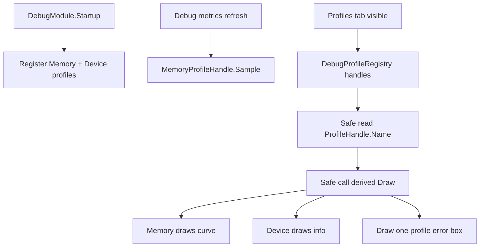

# debug-profile-table-redesign design

## 0. 术语约定

| 术语 | 定义 | 防冲突结论 |
|---|---|---|
| `ProfileHandle` | Debug Profiles tab 的唯一扩展点 | 公开契约只保留 `Name`；不提供 column、row、table helper 或 metadata |
| profile draw | 派生类在 IMGUI 中自行绘制自己的 profile 内容 | 旧 `Columns` / `Rows` / `Snapshot()` / `AddRow` / `SetColumn` 都不再存在 |
| profile table | 某个 profile 在界面上绘制出的完整区域 | 只是视觉结果，不由公共 DTO 或基类 helper 表达 |
| memory curve | Memory profile 自己绘制的采样曲线 | 首版以托管内存/可用 Unity memory 指标为主，不复刻 Unity Profiler |
| device info profile | 内建设备信息 profile | 只显示运行环境和硬件概况，不读取 device unique id、账号、支付或业务隐私字段 |

## 1. 决策与约束

### 需求摘要

当前 Debug profile 设计把 profile 拆成 `ProfileColumn`、`ProfileRow`、`ProfileTable` 和 `Snapshot()`，并在上一版 draft 里又错误引入了 `AddRow` / `SetColumn` helper。新的目标更收敛：`ProfileHandle` 只需要提供 `Name`；每个派生类完全负责自己的绘制，Memory profile 自己绘制曲线，Device Info profile 自己绘制设备信息，其他默认 profile 可以不要。

成功标准：

- `ProfileHandle` 公开契约只保留 `Name`。
- 不再提供 `Columns` / `Rows` / `Snapshot()` / `ProfileColumn` / `ProfileRow` / `ProfileTable`。
- 不再提供 `SetColumn` / `AddRow` 或任何基类表格 helper。
- Profiles tab 默认展示 Memory 曲线 profile 和 Device Info profile；旧 Debug 状态 profile 不默认展示。
- 单个 profile 的 `Name` 或绘制过程抛异常时，只影响该 profile，不击穿整个 Debug Console。

### 明确不做

- 不保留旧 column/row/table 数据模型作为 profile API。
- 不提供任何“统一表格布局”基类能力；对齐、换行、曲线、颜色、单位等都由派生类自己决定。
- 不实现完整 Unity Profiler 替代品，不做深度 allocation callstack、CPU timeline、GPU timeline。
- 不采集或显示设备唯一标识、账号、支付、定位、通讯录等敏感信息。
- 不把 Network log transport、本地 rolling file、离线上传包放回 DebugModule。
- 不批量为 Timer、Procedure、Combat 等模块补 profile；其他模块 profile 接入后续另起 feature。
- 不重命名 `GameDeveloperKit.Logger` namespace。

### 复杂度档位

走 Runtime 诊断基础设施默认档位，偏离点：

- `API Compatibility = breaking`：旧 profile 数据模型被用户明确否定，本次允许破坏旧 `ProfileHandle` 子类实现。
- `Robustness = L3`：profile draw 是外部扩展点，必须 per-profile 异常隔离。
- `Privacy = validated`：设备信息 profile 只能展示非敏感运行环境字段。
- `Performance = bounded`：Memory 曲线使用固定容量 ring buffer，不允许无限增长。

### 关键决策

1. `ProfileHandle` 只表达名字和绘制钩子。
   - 公开表面只保留 `Name`。
   - 绘制由派生类 override 内部/受保护绘制钩子完成。
   - 基类不保存 rows、columns、headers、cell，也不负责布局。

2. registry 不再生产 table 快照。
   - registry 只维护 handle 注册顺序。
   - GUI 绘制 Profiles tab 时安全读取 `Name`，再安全调用该 profile 的 draw hook。
   - registry 不再尝试统一 redaction 任意绘制内容；内建 profile 自己保证不显示敏感字段。

3. 内建 profile 收敛为 Memory + Device Info。
   - `MemoryProfileHandle` 负责采样并绘制曲线，可自行绘制 FPS、frame time、managed memory 等摘要。
   - `DeviceInfoProfileHandle` 负责绘制设备/平台/图形能力信息。
   - 现有 `DebugProfileHandle` 继续承载日志入口和 `DebugLogBuffer`，但不再作为 Profiles tab 的默认内建 profile 注册。

## 2. 名词与编排

### 2.1 名词层

#### 现状

- `Assets/GameDeveloperKit/Runtime/Debug/Profiles/ProfileHandle.cs` 里 `ProfileHandle` 要求子类实现 `IReadOnlyList<ProfileColumn> Columns` 和 `IReadOnlyList<ProfileRow> Snapshot()`。
- `DebugProfileHandle` 和 `MemoryProfileHandle` 暂放在同一个 `ProfileHandle.cs` 文件里，前者暴露 Debug 状态行，后者只把 metrics 作为普通两列表格展示。
- `DebugProfileRegistry` 刷新 `Snapshot()` 并保存 `ProfileTable`；`DebugGuiDriver.DrawProfilesTab()` 再读取 `ProfileTable.Columns/Rows` 绘制。
- `.codestable/architecture/ARCHITECTURE.md` 和 runtime-scheduling-diagnostics roadmap 仍记录旧 `Columns` / `Snapshot()` 契约。

#### 变化

`ProfileHandle` 契约改成 draw-first：

```csharp
public abstract class ProfileHandle
{
    public abstract string Name { get; }

    protected internal abstract void Draw();
}
```

说明：

- `Name` 是唯一公开 profile 信息。
- `Draw()` 是 Debug Profiles tab 调用的绘制钩子；它不作为普通数据 API 给外部查询。
- 派生类想画表格就自己 `GUILayout.BeginHorizontal()` / `GUILayout.Label()`；想画曲线就自己申请 rect 并绘制曲线。
- `ProfileHandle` 基类不提供 `SetColumn`、`AddRow`、默认 table draw 或统一对齐逻辑。

内建 profile：

```csharp
public sealed class MemoryProfileHandle : ProfileHandle
{
    public DebugMetricSnapshot Metrics { get; }
    public void Sample(float deltaTime);
    protected internal override void Draw();
}

public sealed class DeviceInfoProfileHandle : ProfileHandle
{
    public void Refresh();
    protected internal override void Draw();
}
```

### 2.2 编排层



#### 流程级约束

- `RegisterProfile(null)` / `UnregisterProfile(null)` 仍抛 `ArgumentNullException`。
- registry 对 `Name` 和 `Draw()` 做 per-profile 异常隔离。
- `Name` 为空、空白或抛异常时，Profiles tab 使用 handle 类型名作为 fallback。
- profile draw 只在 Console 可见且 Profiles tab 被绘制时执行；采样可以继续走现有 metrics refresh。
- Memory 曲线 sample buffer 固定容量，不能随运行时长增长。
- Device Info profile 的字段应可在 runtime 读取，缺失项显示 `unavailable`，不抛异常。
- 因为绘制完全由派生类负责，外部 profile 的敏感信息处理也由该 profile 自己负责；Debug 只保证内建 profile 不绘制敏感字段。

### 2.3 挂载点清单

- `DebugModule.RegisterBuiltInProfiles()`：删除旧 Debug 状态 profile 默认注册，注册 Memory 与 Device Info。
- `DebugProfileRegistry`：从 snapshot producer 改为 profile handle lifecycle/draw safety 门面。
- `ProfileHandle`：唯一公开 profile 扩展点，公开契约只保留 `Name`。
- `DebugGuiDriver.DrawProfilesTab()`：从绘制 `ProfileTable` 改为安全调用每个派生 profile 的绘制钩子。
- `MemoryProfileHandle` / `DeviceInfoProfileHandle`：两个默认可见 profile，删除它们后本 feature 在用户视角基本消失。

### 2.4 推进策略

1. Profile 契约收敛：把 `ProfileHandle` 改为 Name-only 公开契约和派生类自绘模型。
   - 退出信号：自定义 profile 只实现 `Name` 和绘制钩子，不需要任何 column/row/table helper 就能显示。
2. Registry 与 Profiles tab 改线：registry 不再生成 `ProfileTable`，GUI 安全调用每个 handle 的绘制钩子。
   - 退出信号：一个 draw 抛异常的 profile 不影响其他 profile 和 Logs tab。
3. Memory 曲线 profile：固定容量采样并自行绘制曲线和摘要数据。
   - 退出信号：运行一段时间后 Profiles tab 能看到连续 memory 曲线，buffer 容量不增长。
4. Device Info profile：注册并自行绘制非敏感设备/平台信息。
   - 退出信号：Profiles tab 能看到 Device Info profile，敏感 ID 不出现。
5. 移除旧模型与文档同步：清理旧 column/row/table 类型使用点，并更新架构/roadmap 里的旧契约描述。
   - 退出信号：Runtime 快速编译通过，文档不再声明 `Columns` / `Snapshot()` / `SetColumn` / `AddRow` 是当前契约。

### 2.5 结构健康度与微重构

#### 评估

- compound convention 搜索未命中 Debug/Profile 目录组织或命名约定，按当前目录职责判断。
- `ProfileHandle.cs` 约 373 行，已经同时放了基类、Debug log profile、Memory profile 和 redaction exception 类型；本 feature 还要加 Device profile 和 Memory 曲线，继续塞同文件会加重职责混杂。
- `DebugProfileRegistry.cs` 约 259 行，当前职责集中在 profile lifecycle 和 snapshot 安全读取；改为 draw safety 后仍是自然归属点。
- `DebugGuiDriver.cs` 约 283 行，已承担 Logs/Profiles/Timers/Tools/Settings 的 IMGUI 编排；Profiles tab 改线属于现有职责延伸，但曲线绘制细节不应全部堆在 driver 内。
- `Runtime/Debug/Profiles/` 目录当前已有 `ProfileColumn.cs`、`ProfileRow.cs`、`ProfileTable.cs` 等旧模型文件，删除旧模型后目录不拥挤。

#### 结论：做微重构（拆文件）

先做只搬不改行为的文件拆分，再做契约变更：

- 搬什么：从 `ProfileHandle.cs` 拆出 `DebugProfileHandle` 和 `MemoryProfileHandle` 到同名文件；新增 `DeviceInfoProfileHandle.cs`。
- 搬到哪：仍在 `Assets/GameDeveloperKit/Runtime/Debug/Profiles/`，不新建目录。
- 怎么验证行为不变：拆文件后先运行 Runtime 快速编译，再开始 profile 契约改动。

这一步是实现前置，因为 Memory 曲线和 Device Info 都会扩大 profile 文件体积；先拆开能让后续改动落在自然归属文件。

#### 超出范围的观察

- `DebugGuiDriver` 未来可能需要按 tab 拆分协作者，但本次只改 Profiles tab 的绘制路径，不把整个 Console GUI 重构成多文件架构。
- `DebugProfileHandle` 名称继续带 Profile，但实际主要承载日志入口；若要改名为 `DebugLogHandle`，建议后续走 `cs-refactor`，避免和本次契约破坏叠加。

## 3. 验收契约

### 关键场景清单

- N1：注册一个只提供 `Name` 并在绘制钩子里自行调用 IMGUI 的自定义 profile → Profiles tab 出现该 profile 内容。
- N2：自定义 profile 自己绘制多列文本 → Debug 不插手对齐，视觉结果完全由该 profile 控制。
- N3：自定义 profile 自己绘制曲线或其他非表格内容 → Profiles tab 正常承载，不要求转换成 row/column。
- N4：某个 profile 的 `Draw()` 抛异常 → 该 profile 显示错误状态，其他 profile、Logs tab 和 Console 仍可绘制。
- N5：某个 profile 的 `Name` 抛异常或返回空白 → Profiles tab 使用类型名 fallback，并继续尝试绘制或显示错误。
- N6：Debug startup 后 → Profiles tab 默认显示 Memory 曲线 profile 和 Device Info profile。
- N7：运行多个 sample interval 后 → Memory profile 曲线出现连续点，采样 buffer 不超过固定容量。
- N8：Device Info profile 绘制 → 包含平台、Unity 版本、设备型号/类型、CPU、系统内存、显卡名称/显存/图形 API 等非敏感字段。
- E1：`RegisterProfile(null)` / `UnregisterProfile(null)` 仍抛 `ArgumentNullException`。

### 明确不做的反向核对项

- 不留下需要外部实现的 `Columns` / `Rows` / `Snapshot()` profile API。
- 不提供 `SetColumn` / `AddRow` 或默认 table helper。
- 不新增除 Memory 和 Device Info 之外的默认 Profiles tab profile。
- 不展示 device unique id 或业务敏感信息。
- 不实现 Unity Profiler 级别的 CPU/GPU timeline。
- 不把 Timer/Procedure/Combat profile 接入塞进本 feature。

## 4. 与项目级架构文档的关系

本 design 取代 `.codestable/features/2026-06-08-debug-profilehandle-hardening/debug-profilehandle-hardening-design.md` 中关于 `Columns` / `Snapshot()` 的 profile 契约部分，也取代本 draft 上一版中 `AddRow` / `SetColumn` 的错误假设，但保留“单个 profile 异常不影响其他 profile”的鲁棒性目标。

实现验收后需要同步：

- `.codestable/architecture/ARCHITECTURE.md` Debug 小节：`ProfileHandle` 当前只公开 `Name`，绘制由派生类完成，默认内建 profile 为 Memory 曲线与 Device Info。
- `.codestable/roadmap/runtime-scheduling-diagnostics/runtime-scheduling-diagnostics-roadmap.md` 第 4.3 节：删除旧 `Columns` / `Snapshot()` 作为未来约束的描述，改为 Name-only + derived draw。
- 如旧 `runtime-module-profile-handles` roadmap item 仍保留，应说明后续模块 profile 必须接新自绘契约。
