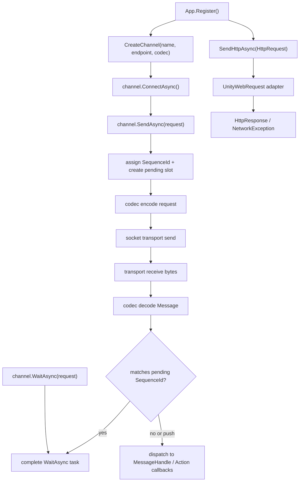

# network-module design

## 0. 术语约定

| 术语 | 当前定义 | 本次约定 |
|---|---|---|
| `NetworkModule` | 当前仓库没有运行时网络模块 | GameDeveloperKit 运行时网络入口，通过 `App.Network` 访问，管理 socket channel、HTTP 请求和消息分发 |
| `IChannel` | 资源发布文档里有 `Channel` 表示发布渠道，Runtime `ResourceSettings.ChannelId/ChannelName` 也表示资源渠道 | 网络连接契约，特指一条可连接、可关闭、可发送/接收 `Message` 的 socket 连接；文档中写 `IChannel` 避免和资源渠道混淆 |
| `Message` | 当前仓库没有网络消息基类；Event 模块使用 `ArgsBase` 表示本地事件参数 | 网络协议消息基类，携带消息类型、请求序号和 payload 相关元数据；不是 EventModule 的事件参数 |
| `MessageHandle` | 当前仓库没有网络消息处理器；EventModule 已有 `EventHandleBase` 和 `Action<TEvent>` 订阅形态 | 网络消息对象处理器基类/接口，用于按消息类型处理服务端推送或响应分发 |
| `HTTP` | DownloadModule 和 WebAssetProvider 内部直接使用 `UnityWebRequest` | NetworkModule 的短请求封装，只负责 API 请求/响应，不负责文件下载和 AssetBundle 加载 |
| `Socket` | 当前仓库没有 socket 运行时代码 | 首版长连接抽象；具体底层可由 TCP/WebSocket 适配器实现，设计层只固定 `IChannel` 契约和消息编排 |

防冲突结论：

- Network 的 `IChannel` 不复用 Resource Publisher 的 `Channel` 术语；资源渠道仍归 Resource/Publisher。
- Network 不接管 DownloadModule；大文件下载、暂停、恢复、分片和临时文件仍走 `App.Download`。
- Network 的消息分发借鉴 EventModule 的对象 handle + `Action<T>` 注册手感，但语义是“网络收包”，不是本地事件总线。

## 1. 决策与约束

### 需求摘要

做什么：新增框架级 `NetworkModule`，支持创建和管理 socket 连接 `IChannel`，通过 `SendAsync(request)` 发送消息，通过 `WaitAsync<TResponse>(request)` 等待与该 request 关联的响应，支持 `MessageHandle` 对象注册和 `Action<Message>` / `Action<TMessage>` 回调式注册，并提供普通 HTTP API 请求封装。

为谁：登录、大厅、活动、实时玩法、调试桥接和其他需要网络请求/长连接的业务模块。

成功标准：

- 注册 `NetworkModule` 后可通过 `App.Network` 获取模块实例。
- 调用方能创建命名 channel，连接、关闭、查询状态，并通过 `IChannel.SendAsync(request)` 发送，通过 `IChannel.WaitAsync<TResponse>(request)` 等待响应。
- 服务端主动推送或收到响应时，能按消息类型触发 `MessageHandle<TMessage>` 和 `Action<TMessage>`，也能触发兜底 `Action<Message>`。
- HTTP 请求能用统一 request/response 对象发起，成功返回响应，失败给出明确错误分类。
- `Shutdown()` 会关闭所有 channel、取消 pending wait 和清空消息注册。

明确不做：

- 不做文件下载、断点续传、大文件分片、AssetBundle 下载或资源缓存。
- 不实现具体业务协议、登录流程、鉴权刷新、服务器列表、网关选择或加密握手。
- 不做战斗帧同步、状态同步、rollback netcode、RPC 框架或对象复制。
- 不做可靠 UDP、P2P、NAT 穿透、多线程收包或后台线程安全承诺。
- 不把 EventModule 改造成网络事件，也不让 DebugModule 重新持有 transport。
- 不在首版内实现 Debug 日志自动上报；只保证未来可由 Network 读取已脱敏 `DebugLogRecord` 后自行发送。

### 复杂度档位

走“对外发布的库/服务”默认档位，偏离点：

- `Performance = reasonable`：首版先保证连接/请求语义正确，不设 QPS、延迟或吞吐预算；避免明显重复分配即可。
- `Observability = logged`：记录连接、关闭、发送失败、超时和消息 handler 异常；不做分布式 tracing 或 metrics 告警。
- `Concurrency = single-threaded orchestration`：公开 API 假定 Unity 主线程编排；底层适配器如需后台收包，必须把分发收束回 channel 编排队列。
- `Compatibility = active`：首版 API 允许随项目协议演进调整，不承诺外部包级稳定 ABI。

### 关键决策

1. NetworkModule 是独立运行时模块，不扩展 DownloadModule。
   - DownloadModule 已承担下载 temp 文件、暂停、恢复、取消和分块下载。
   - NetworkModule 只处理 API 请求、socket message 和消息分发。

2. `IChannel` 是长连接主抽象。
   - `IChannel` 持有连接状态、endpoint、pending request、消息分发注册和关闭生命周期。
   - `NetworkModule` 管理 channel 命名、创建、获取和全局关闭。

3. `Message` 作为网络消息统一基类。
   - 每个业务消息继承 `Message`，至少具备 `MessageId` 或 `MessageType`、`SequenceId` 和 `IsResponse` 这类协议路由信息。
   - 具体序列化格式不在首版强绑定；通过 codec/adapter 接口隔离 JSON、二进制或 protobuf。

4. 发送和等待响应拆成两个显式步骤。
   - `SendAsync(request)` 只表示“把 request 发出并登记响应等待槽”，成功返回不代表服务端已响应。
   - `WaitAsync<TResponse>(request)` 表示“等待与 request 同一 `SequenceId` 关联的响应，并按 `TResponse` 返回”。
   - `SendAsync` 必须在发送前为 request 分配 `SequenceId` 并创建 pending slot；即使响应先于调用方执行 `WaitAsync` 到达，也能完成同一个 pending slot，不丢响应。
   - 不提供 `SendAsync<TRequest, TResponse>` 作为首版主路径；需要 request/response 类型不同时，调用方使用 `SendAsync(request)` + `WaitAsync<TResponse>(request)`。

5. 消息注册分对象处理器和回调两类。
   - `Register<TMessage>(MessageHandle<TMessage> handle)` 适合可复用对象处理器。
   - `Subscribe<TMessage>(Action<TMessage> callback)` 适合局部回调。
   - `Subscribe(Action<Message> callback)` 接收所有未被类型特化过滤的消息，用于日志、调试或兜底分发。
   - 注册返回可取消句柄，沿用 EventModule 的 `Subscription` 手感但使用 Network 自己的订阅类型，避免跨模块生命周期耦合。

6. HTTP 使用统一短请求对象，不暴露裸 `UnityWebRequest` 作为业务主 API。
   - `HttpRequest` 描述 method、url、headers、body、timeout。
   - `HttpResponse` 描述 status code、headers、body text/bytes 和错误分类。
   - 具体实现可用 `UnityWebRequest`，但业务不直接依赖它。

7. Debug 实时日志桥接由 Network 未来 feature 承担。
   - Debug 侧只保留已脱敏 `DebugLogRecord`。
   - Network 首版不自动读取 Debug；只让架构上存在“Network 可注册自己的发送消息/HTTP API 并读取 Debug 已脱敏记录”的方向。

## 2. 名词与编排

### 2.1 名词层

#### 现状

- `Assets/GameDeveloperKit/Runtime/App.cs` 已有模块注册表、默认启动顺序和 `App.Download` / `App.Debug` 等访问入口，但没有 `App.Network`。
- `Assets/GameDeveloperKit/Runtime/Download/DownloadModule.cs` 通过 `UnityWebRequest` 做文件下载，并维护 `DownloadHandler`；它不提供通用 HTTP API 或 socket channel。
- `Assets/GameDeveloperKit/Runtime/Event/EventModule.cs` 已提供对象 handle、`Action<T>` 订阅、取消句柄和同步派发快照，可作为 Network 消息注册手感参考。
- `.codestable/architecture/ARCHITECTURE.md` 记录 Debug 不再持有 transport，未来实时日志由 Network 模块读取已脱敏 `DebugLogRecord` 后自行桥接。

#### 变化

新增 `GameDeveloperKit.Network` 命名空间和运行时模块：

```csharp
public sealed class NetworkModule : GameModuleBase
{
    public override UniTask Startup();
    public override UniTask Shutdown();

    public IChannel CreateChannel(string name, NetworkEndpoint endpoint, INetworkCodec codec = null);
    public bool TryGetChannel(string name, out IChannel channel);
    public IChannel GetChannel(string name);
    public UniTask CloseChannelAsync(string name);
    public UniTask<HttpResponse> SendHttpAsync(HttpRequest request);
}
```

新增 channel 契约：

```csharp
public interface IChannel : IReference
{
    string Name { get; }
    NetworkEndpoint Endpoint { get; }
    NetworkChannelStatus Status { get; }

    UniTask ConnectAsync();
    UniTask CloseAsync();
    UniTask SendAsync(Message request);
    UniTask<TResponse> WaitAsync<TResponse>(Message request) where TResponse : Message;

    MessageSubscription Register<TMessage>(MessageHandle<TMessage> handle) where TMessage : Message;
    MessageSubscription Subscribe<TMessage>(Action<TMessage> callback) where TMessage : Message;
    MessageSubscription Subscribe(Action<Message> callback);
}
```

新增消息契约：

```csharp
public abstract class Message
{
    public int MessageId { get; set; }
    public long SequenceId { get; set; }
    public virtual bool IsResponse => SequenceId > 0;
}
```

新增处理器和订阅：

```csharp
public abstract class MessageHandle<TMessage> : IReference where TMessage : Message
{
    public abstract void Handle(IChannel channel, TMessage message);
    public virtual void Release();
}

public sealed class MessageSubscription : IReference
{
    public bool IsActive { get; }
    public void Cancel();
    public void Release();
}
```

新增 HTTP 值对象：

```csharp
public readonly struct HttpRequest
{
    public string Url { get; }
    public NetworkHttpMethod Method { get; }
    public IReadOnlyDictionary<string, string> Headers { get; }
    public byte[] Body { get; }
    public TimeSpan Timeout { get; }
}

public readonly struct HttpResponse
{
    public long StatusCode { get; }
    public IReadOnlyDictionary<string, string> Headers { get; }
    public byte[] Body { get; }
    public string Text { get; }
}
```

接口示例：

```csharp
// 来源：Assets/GameDeveloperKit/Runtime/Network/IChannel.cs IChannel
var channel = App.Network.CreateChannel("game", new NetworkEndpoint("wss://example.com/game"));
await channel.ConnectAsync();

var request = new LoginRequest("token");
await channel.SendAsync(request);
var response = await channel.WaitAsync<LoginResponse>(request);
```

```csharp
// 来源：Assets/GameDeveloperKit/Runtime/Network/IChannel.cs IChannel
var subscription = channel.Subscribe<ChatMessage>(message =>
{
    UnityEngine.Debug.Log(message.Text);
});

subscription.Cancel();
```

```csharp
// 来源：Assets/GameDeveloperKit/Runtime/Network/NetworkModule.cs NetworkModule
var response = await App.Network.SendHttpAsync(HttpRequest.PostJson("https://example.com/login", payload));
```

### 2.2 编排层



#### 现状

- 框架默认启动顺序已有 Operation、Event、File、Download、Command、Timer、Debug、Resource 等模块，Network 尚不存在。
- socket 连接、请求序号、收包循环、消息分发和 HTTP API 封装没有统一入口。
- DownloadModule 的 `UnityWebRequest` 使用集中在文件下载流程，不适合承载登录/API/短请求语义。

#### 变化

1. Startup / Shutdown：
   - `NetworkModule.Startup()` 初始化 channel registry、HTTP adapter 和默认 codec 配置。
   - `Shutdown()` 依次关闭所有 channel，取消 pending wait，清空 channel registry 和 HTTP 状态。

2. Channel lifecycle：
   - `CreateChannel(name, endpoint, codec)` 校验 name/endpoint，重复 name 抛 `GameException`。
   - `ConnectAsync()` 打开底层 socket transport，状态从 `Closed` → `Connecting` → `Connected`。
   - `CloseAsync()` 主动关闭 transport，取消 pending response，并把状态置为 `Closed`；重复关闭为 no-op。

3. Send / wait response：
   - `SendAsync(request)` 校验 channel 已连接、request 不为 null。
   - channel 为 request 分配 `SequenceId`，登记 pending slot，并通过 codec 编码后交给 transport。
   - `SendAsync` 在底层发送完成后返回；它不等待业务响应。
   - `WaitAsync<TResponse>(request)` 校验 request 已经拥有 `SequenceId`，找到对应 pending slot，并等待其完成。
   - 收包时 decode 为 `Message`；如果 `SequenceId` 命中 pending，则完成对应 pending slot；已在等待的 `WaitAsync` 立即返回，稍后才调用的 `WaitAsync` 也能读取已完成结果。
   - 如果没有命中 pending，按消息实际类型分发给 `MessageHandle<T>`、`Action<T>` 和 `Action<Message>`。
   - 超时或关闭时 pending wait 完成异常，调用方可观察失败。

4. Message registration：
   - `Register<TMessage>(MessageHandle<TMessage>)` 和 `Subscribe<TMessage>(Action<TMessage>)` 以消息类型为 key 存入 listener 表。
   - `Subscribe(Action<Message>)` 存入全局 listener 表。
   - 分发时使用快照，handler 内取消订阅不破坏当前分发。
   - 单个 handler 抛异常时记录到 channel 的最后错误并继续分发其他 handler；基础设施不让一个业务 callback 断开收包循环。

5. HTTP：
   - `SendHttpAsync(HttpRequest)` 校验 URL、method 和 timeout。
   - 使用适配器创建请求并等待完成。
   - 2xx 返回 `HttpResponse`；网络错误、超时、非 2xx、数据处理错误转为 `NetworkException` 或带失败分类的 response 语义。
   - HTTP 不写 temp 文件，不参与 DownloadModule 的 handler registry。

#### 流程级约束

- 错误语义：公开输入 null 抛 `ArgumentNullException`；空 name/url 抛 `ArgumentException`；重复 channel、未连接发送、codec 缺失等框架状态错误抛 `GameException`；网络失败使用 `NetworkException` 携带 `NetworkFailureKind`。
- 幂等性：`CloseAsync()` 和 `Shutdown()` 可重复调用；取消订阅可重复调用；关闭时 pending wait 统一失败。
- 并发/顺序：同一 channel 内 `SequenceId` 单调递增；pending response 通过 `SequenceId` 匹配；同一消息类型 listener 按注册顺序分发。
- 扩展点：transport、codec、HTTP adapter 是实现扩展点；业务 handler 不直接接触底层 socket。
- 可观测点：channel status、last error、连接/关闭/发送失败日志、HTTP status/failure kind、pending count 可作为 Debug profile 后续读取对象。

### 2.3 挂载点清单

1. `App.Network`：新增框架网络模块访问入口。
2. 默认启动计划：在 `App.StartupInternal()` 中登记 `NetworkModule`，建议位于 Download 之后、Debug 之前或 Command 之后，确保 Debug 未来可读到 Network 状态但不依赖其 transport。
3. `Assets/GameDeveloperKit/Runtime/Network/`：新增 Network runtime 类型集合，包括 `NetworkModule`、`IChannel`、`Message`、handler/订阅、HTTP 值对象和 transport/codec 抽象。
4. `GameDeveloperKit.Runtime.asmdef`：如实现需要额外 precompiled reference 或平台 define，必须在 Runtime asmdef 中显式登记；首版优先不新增第三方依赖。

拔除沙盘：删除 `Runtime/Network/`、移除 `App.Network` 和默认启动登记、移除未来 Debug bridge 对 Network 的引用后，网络能力应从框架视角消失；Download、Event、Debug 本体不应因此失效。

### 2.4 推进策略

1. 名词骨架：建立 `NetworkModule`、`IChannel`、`Message`、`MessageHandle<T>`、`MessageSubscription`、HTTP request/response 和错误分类。
   - 退出信号：模块可注册，公开类型可编译，空 registry 状态可查询。
2. Channel 编排骨架：实现 channel registry、生命周期状态、connect/close 的可替换 transport 空壳。
   - 退出信号：可创建命名 channel，重复 name 失败，关闭和 shutdown 清理 registry。
3. 消息发送与响应等待：实现 `SendAsync(request)` 的 sequence/pending slot 登记、`WaitAsync<TResponse>(request)` 的响应等待、超时/关闭失败和响应匹配。
   - 退出信号：模拟 transport 回包可完成对应 wait，未连接发送、未发送等待和超时路径可观察。
4. 消息分发注册：实现 `MessageHandle<T>`、`Action<T>`、`Action<Message>` 注册、取消、快照分发和 handler 异常隔离。
   - 退出信号：主动推送消息按注册顺序触发，取消后不触发，单个 handler 异常不阻断其他 handler。
5. HTTP 封装：接入 UnityWebRequest adapter，完成 request/response、timeout、headers/body 和错误分类。
   - 退出信号：普通 GET/POST 可返回响应，HTTP 错误和网络错误被分类。
6. 生命周期与验证：补齐 shutdown pending wait 清理、日志/状态快照和关键验收场景。
   - 退出信号：编译通过，正常/边界/错误路径都有可观察证据。

### 2.5 结构健康度与微重构

##### 评估

- compound convention 检索：未命中“目录组织 / 命名 / 归属”相关 convention。
- 文件级 — `Assets/GameDeveloperKit/Runtime/App.cs`：当前约 395 行，是模块入口和启动顺序聚合点；本次预计新增 `using GameDeveloperKit.Network`、`App.Network` 和默认注册一处，属于既有职责延伸，不需要拆分。
- 文件级 — `Assets/GameDeveloperKit/Runtime/Download/DownloadModule.cs`：本次不改 DownloadModule；只在 design 边界中明确不接管文件下载。
- 文件级 — `Assets/GameDeveloperKit/Runtime/Event/EventModule.cs`：本次不改 EventModule；只复用注册/订阅手感。
- 目录级 — `Assets/GameDeveloperKit/Runtime/`：当前 16 个一级模块目录，新增 `Network/` 与 Command/Event/Timer/Download 同级，符合现有模块布局。
- 目录级 — `Assets/GameDeveloperKit/Runtime/Network/`：新目录，预计新增多个小文件承载公开契约和内部适配，不存在摊平旧债。

##### 结论：不做微重构

本次不做“只搬不改行为”的前置微重构。原因是 Network 是全新模块，主要落入新 `Runtime/Network/` 目录；既有文件只需要模块入口挂载，Download/Event/Debug 不需要被搬迁或拆分。

##### 超出范围的观察

- `App.cs` 已接近 400 行且继续聚合默认启动顺序、访问入口和生命周期状态；如果后续模块继续增加，可另起 `cs-refactor` 讨论模块 registry/启动计划拆分，本 feature 不阻塞。
- Network 如果后续加入多协议 adapter、Debug profile、指标和日志桥接，`Runtime/Network/` 可能需要按 `Channel/Http/Message/Internal` 分组；首版先按小文件扁平落地，acceptance 后再看是否需要沉淀目录 convention。

## 3. 验收契约

| 编号 | 输入 / 触发 | 期望可观察结果 |
|---|---|---|
| N1 | 注册 `NetworkModule` 后访问 `App.Network` | 返回已注册 `NetworkModule` 实例 |
| N2 | `CreateChannel("game", endpoint)` | 返回 name 为 `game` 的 `IChannel`，`TryGetChannel("game")` 可取回同一实例 |
| N3 | 重复创建同名 channel | 抛 `GameException`，原 channel 不被替换 |
| N4 | `channel.ConnectAsync()` 成功 | `Status == Connected` |
| N5 | 已连接 channel 调用 `SendAsync(pingRequest)` 后再调用 `WaitAsync<PingResponse>(pingRequest)`，模拟收到相同 `SequenceId` 响应 | 返回对应 `PingResponse`，pending 项被移除 |
| N5a | 响应在调用 `WaitAsync<PingResponse>(pingRequest)` 前已经到达 | `WaitAsync` 仍返回已完成响应，不丢包 |
| N6 | 收到没有命中 pending 的 `ChatMessage` | 已注册 `MessageHandle<ChatMessage>` 和 `Action<ChatMessage>` 被调用 |
| N7 | 收到任意 message | 已注册 `Action<Message>` 兜底回调被调用 |
| N8 | 订阅返回的 `MessageSubscription.Cancel()` 后再次收包 | 对应 handler/callback 不再触发 |
| N9 | 某个消息 handler 抛异常 | 该异常被记录，其他 handler 继续收到同一消息，channel 不因 callback 异常关闭 |
| N10 | `CloseAsync()` 时存在 pending wait | pending wait 以关闭/取消类错误完成，channel 状态变为 `Closed` |
| N11 | `Shutdown()` | 所有 channel 关闭，registry 清空，订阅和 pending wait 清理 |
| N12 | `SendHttpAsync(GET request)` 成功返回 2xx | 返回 `HttpResponse`，包含 status、headers 和 body |
| N13 | `SendHttpAsync(POST json request)` | 请求携带 body 和 content-type，成功时返回响应 body |
| B1 | `CreateChannel(null/空白, endpoint)` | 抛 `ArgumentNullException` 或 `ArgumentException` |
| B2 | `CreateChannel(name, null endpoint)` | 抛 `ArgumentNullException` |
| B3 | 未连接 channel 调用 `SendAsync(request)` | 抛 `GameException` 或返回未连接失败，不登记 pending |
| B3a | request 未经过 `SendAsync` 就调用 `WaitAsync<TResponse>(request)` | 抛 `GameException`，提示 request 没有可等待的 pending slot |
| B4 | `Subscribe<TMessage>(null)` / `Register<TMessage>(null)` | 抛 `ArgumentNullException` |
| B5 | 重复调用 `CloseAsync()` 或 `Shutdown()` | no-op，不抛异常 |
| E1 | socket transport 连接失败 | `ConnectAsync()` 失败，`Status == Failed` 或回到 `Closed`，错误可观察 |
| E2 | `WaitAsync<TResponse>(request)` 超时 | 返回超时失败，pending 项被移除 |
| E3 | codec 解码失败 | 记录解码失败，不调用业务 handler，不破坏后续收包 |
| E4 | HTTP URL 非 HTTP/HTTPS 或为空 | 抛 `ArgumentException` |
| E5 | HTTP 网络错误、超时、非 2xx 或数据处理错误 | 返回明确 `NetworkFailureKind` 或抛携带分类的 `NetworkException` |

### 明确不做的反向核对项

- Network 代码不应写入 `Application.temporaryCachePath + "/downloads"`，不应创建 `.download` 或 `.part` 文件。
- Network 不应修改 `DownloadModule` 的暂停、恢复、取消、分块下载语义。
- Network 不应引用战斗同步、rollback、frame sync、RPC proxy 或对象复制相关类型。
- DebugModule 不应重新新增 sink/transport/analytics 列表；Debug 日志外发不在本 feature 自动接线。
- 不新增第三方网络库依赖；如实现阶段确需 WebSocket/TCP 包，必须先回到 design 更新决策。
- 不新增跨线程安全承诺相关 lock/concurrent collection 作为公开保证。

## 4. 与项目级架构文档的关系

验收通过后需要更新 `.codestable/architecture/ARCHITECTURE.md`：

- 新增 Network 子系统：入口 `NetworkModule`、访问方式 `App.Network`、核心类型 `IChannel` / `Message` / `MessageHandle<T>` / `MessageSubscription` / `HttpRequest` / `HttpResponse`。
- 记录模块边界：Network 管 socket、HTTP API 和消息分发；Download 管文件下载；Event 管本地事件；Debug 不持有 transport。
- 记录主流程：channel 创建连接、`SendAsync(request)` 分配 sequence 并登记 pending slot、`WaitAsync<TResponse>(request)` 等待 pending response、主动消息按类型分发、HTTP 统一封装。
- 记录流程级约束：公开 API 主线程编排、关闭清理 pending、handler 异常隔离、codec/transport/HTTP adapter 作为扩展点、不新增第三方依赖。
- requirement `network-module` 在 acceptance 后可从 draft 升级为 current，并把 `implemented_by` 指向未来 Network 架构条目。
