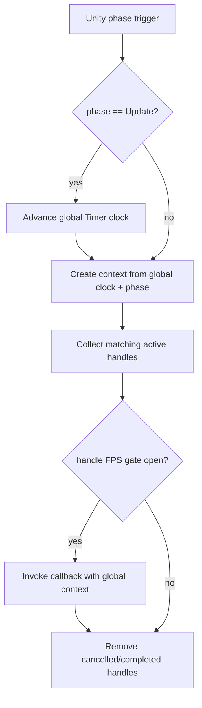

# timer-global-clock-phase-gating design

## 0. 术语约定

| 术语 | 定义 | 防冲突结论 |
|---|---|---|
| 全局 Timer clock | `TimerModule` 唯一维护的 `Tick` / `Time` / `UnscaledTime` / `DeltaTime` / `UnscaledDeltaTime` | 不再按 `Update` / `LateUpdate` / `FixedUpdate` 分数组保存 |
| Phase trigger | Unity `Update` / `LateUpdate` / `FixedUpdate` 生命周期入口 | 只用于选择哪些 update handle 有资格被检查 |
| FPS gate | update handle 自己的可选频率门控 | 不生成模块级独立 tick/time；只决定本次 phase trigger 是否真正调用 callback |
| `TimerTickKind` | internal phase 分流标记 | 不再表示 clock kind；不作为公开业务 API |

## 1. 决策与约束

### 需求摘要

Timer 现在把 `Update` / `LateUpdate` / `FixedUpdate` 当成三套内部 clock，导致 `_ticks`、`_times`、`_deltaTimes` 等字段都变成数组。用户确认希望 Timer 只有统一的模块级 clock；`OnUpdate`、`OnLateUpdate`、`OnFixedUpdate` 仍保留 phase 选择能力，但 Late/Fixed 不再维护自己的 tick/time。Late/Fixed 如果需要按指定帧率轮询，在注册时传入 `fps` 做 handle 级门控；不传则沿用模块全局 clock 直接回调。

成功标准：

- `TimerModule` 只维护一份全局 `Tick` / `Time` / `UnscaledTime` / `DeltaTime` / `UnscaledDeltaTime`。
- Unity `Update` 推进全局 clock；`LateUpdate` / `FixedUpdate` 不推进全局 clock。
- `OnUpdate` / `OnLateUpdate` / `OnFixedUpdate` 仍只在匹配 phase 被检查。
- Late/Fixed 注册 API 支持可选 `fps`；未传 `fps` 时每次匹配 phase 都调用，context 使用当前全局 clock。
- 已完成的 `timer-update-consumer-contract` 文档作为历史记录保留；本 feature 明确修正其中“三类 tick 各自维护 clock”的语义。

### 明确不做

- 不迁移 Debug/Procedure/Combat 到 Timer；这些仍属于 runtime-scheduling-diagnostics 后续条目。
- 不让 `Delay` / `Countdown` / `Interval` 选择 LateUpdate 或 FixedUpdate；它们继续默认走全局 Update clock。
- 不改 Unity 全局 `Time.fixedDeltaTime`。
- 不公开 `TimerTickKind` 或新增公开 phase enum。
- 不引入线程、job system、优先级队列、网络锁步或回滚确定性。

### 复杂度档位

走 Runtime 基础设施默认档位，偏离点：

- `Compatibility = additive + semantic correction`：保留现有无 `fps` API；新增 `fps` 重载，同时修正 context clock 语义。
- `Robustness = L3`：update handle 异常隔离仍保持，FPS gate 不能破坏现有 dispatch buffer 稳定性。
- `Observability = instrumented`：snapshot 应暴露全局 `UnscaledTime`，并继续包含 active update handles。

### 关键决策

1. TimerModule 只有一份全局 clock。
   - `Update` phase 到来时，使用 Unity `Time.deltaTime` / `Time.unscaledDeltaTime` 推进 `Tick`、`Time`、`UnscaledTime`、`DeltaTime`、`UnscaledDeltaTime`。
   - `LateUpdate` / `FixedUpdate` phase 到来时，不修改这些全局字段。

2. Phase 与 clock 分离。
   - `UpdateTimerHandle`、`LateUpdateTimerHandle`、`FixedUpdateTimerHandle` 仍表达 callback 所属 phase。
   - `TimerUpdateContext.Tick` / `Time` / `UnscaledTime` 来自全局 clock。
   - `TimerUpdateContext.TickKind` 保持 internal，只说明本次由哪个 phase 触发。

3. `fps` 是 handle 级门控。
   - `fps` 门控使用 phase trigger 传入的 unscaled delta 累积真实经过时间；达到 `1 / fps` 时才调用 callback。
   - 门控打开时传给 callback 的 context 仍是全局 clock 快照，不创建 per-phase 或 per-fps clock。
   - `fps <= 0` 抛 `ArgumentException`。

## 2. 名词与编排

### 2.1 名词层

#### 现状

- `TimerModule` 通过 `TickKindCount = 3` 和 `_ticks` / `_times` / `_unscaledTimes` / `_deltaTimes` / `_unscaledDeltaTimes` 五组数组分别保存三类 tick 状态。
- `ApplyUpdateState()` 只把 Update 下标同步到公开 `Tick` / `Time` / `DeltaTime` / `UnscaledDeltaTime`。
- `TimerUpdateContext` 已有 `UnscaledTime`，但 `TimerModule` 和 `TimerSnapshot` 没有公开 `UnscaledTime`。
- `LateUpdateTimerHandle` / `FixedUpdateTimerHandle` 只有无频率门控构造函数。

#### 变化

TimerModule 全局 clock：

```csharp
public long Tick { get; }
public double Time { get; }
public double UnscaledTime { get; }
public float DeltaTime { get; }
public float UnscaledDeltaTime { get; }
```

Late/Fixed 便捷 API 增加 `fps` 重载，原重载保留：

```csharp
public LateUpdateTimerHandle OnLateUpdate(Action callback, float fps, object owner = null, string tag = null);
public LateUpdateTimerHandle OnLateUpdate(Action<TimerUpdateContext> callback, float fps, object owner = null, string tag = null);
public FixedUpdateTimerHandle OnFixedUpdate(Action callback, float fps, object owner = null, string tag = null);
public FixedUpdateTimerHandle OnFixedUpdate(Action<TimerUpdateContext> callback, float fps, object owner = null, string tag = null);
```

Handle 构造也支持同样语义：

```csharp
public LateUpdateTimerHandle(Action callback, float fps);
public LateUpdateTimerHandle(Action<TimerUpdateContext> callback, float fps);
public FixedUpdateTimerHandle(Action callback, float fps);
public FixedUpdateTimerHandle(Action<TimerUpdateContext> callback, float fps);
```

### 2.2 编排层



#### 现状

- 每个 phase 调用 `TimerModule.Update(tickKind, delta, unscaledDelta)` 时都会推进对应数组下标。
- `LateUpdate` context 的 `Tick` 是 LateUpdate 自己的 tick，`FixedUpdate` context 的 `Tick` 是 FixedUpdate 自己的 tick。
- 测试已锁住旧语义：LateUpdate 推进后 `lateContext.Tick == 1` 且 `module.Tick == 0`。

#### 变化

- `TimerModule.Update(TimerTickKind.Update, ...)` 推进全局 clock，并用全局 clock context 分发 Update handles、Delay、Countdown、Interval。
- `TimerModule.Update(TimerTickKind.LateUpdate, ...)` / `FixedUpdate` 只创建当前全局 clock context，然后检查匹配 phase 的 update handles。
- 未配置 `fps` 的 handle 在每次匹配 phase 被调用。
- 配置 `fps` 的 handle 在匹配 phase 中先做自身门控；门控未打开则不调用，不更新 `LastTick`。
- 单个 handle 抛异常仍记录到该 handle，不阻断后续 handle。

#### 流程级约束

- `Register(null)` 抛 `ArgumentNullException`。
- `fps <= 0` 抛 `ArgumentException`。
- 同一个 active handle 重复注册不重复调用。
- 回调中取消自己或其他 timer 不破坏当前 dispatch buffer。
- `GetClockTime(useUnscaledTime)` 返回全局 `Time` 或 `UnscaledTime`；不再按 tick kind 选择 clock。

### 2.3 挂载点清单

- `TimerModule.Update(TimerTickKind, delta, unscaledDelta)`：Unity phase 到 Timer 调度的内部入口。
- `TimerModule.OnLateUpdate(..., fps)` / `OnFixedUpdate(..., fps)`：业务按 phase + 频率注册轮询的便捷入口。
- `LateUpdateTimerHandle` / `FixedUpdateTimerHandle` 构造函数：显式 handle 注册路径的频率入口。
- `TimerSnapshot`：Debug Timer tab 和诊断读取全局 clock 的观测入口。

### 2.4 推进策略

1. 契约对齐：把 Timer clock 从 per-phase 数组收敛为单一全局状态。
   - 退出信号：Late/Fixed phase 不再改变 `TimerModule.Tick` / `Time` / `UnscaledTime`。
2. Context 对齐：所有 update handle context 使用全局 clock，同时保留 internal phase 标记。
   - 退出信号：Late/Fixed callback 收到的 `context.Tick` 等于当前 `module.Tick`。
3. FPS gate：为 Late/Fixed handle 增加可选 `fps` 门控。
   - 退出信号：未传 `fps` 时每个匹配 phase 都调用；传 `fps` 时未达到间隔不调用，到达间隔调用。
4. Snapshot 与测试契约：补 `UnscaledTime` 观测，并替换旧 per-phase clock 测试。
   - 退出信号：Timer Runtime 测试覆盖全局 clock、phase 分流、fps 非法值、异常隔离和 snapshot。
5. 文档回写：同步 architecture 和 runtime-scheduling-diagnostics roadmap 中 Timer clock 语义。
   - 退出信号：文档不再声称 Timer 维护三类内部 clock。

### 2.5 结构健康度与微重构

#### 评估

- 文件级：`TimerModule.cs` 已承担 clock、注册、dispatch、legacy SetTimer/ClearTimer 和 snapshot，文件偏胖；但本次改的是 clock/dispatch 语义，拆文件会和行为变更交织，不属于“只搬不改行为”的安全微重构。
- 目录级：`Assets/GameDeveloperKit/Runtime/Timer/Handle/` 已承载 timer handle 类型，Late/Fixed 的 FPS gate 属于 update handle 自身职责，不需要新目录。
- compound convention：当前 `.codestable/compound/` 没有 Timer 目录组织或命名约定沉淀。

#### 结论：不做微重构

本次不做前置微重构，原因是 clock 语义修正本身就是行为改动，先把契约收稳更重要。实现阶段可以在现有 `TimerUpdateHandle` / Late/Fixed handle 文件内加入小型门控状态；如果后续还要拆 `TimerModule` 的 clock/dispatch/legacy API，应另起 `cs-refactor`，不要和这次语义修正混在一起。

## 3. 验收契约

### 关键场景清单

- N1：触发一次 Update，delta=0.03/unscaled=0.04 → `module.Tick == 1`，`Time == 0.03`，`UnscaledTime == 0.04`，context 使用相同全局值。
- N2：先不触发 Update，直接触发 LateUpdate → Late handle 可被调用，但 `module.Tick` 仍为 0，context tick 也为 0。
- N3：先触发一次 Update，再触发 FixedUpdate → Fixed handle 可被调用，context tick 等于当前 `module.Tick`，FixedUpdate 不额外增加 tick。
- N4：Late/Fixed 未传 `fps` → 每个匹配 phase trigger 都调用一次。
- N5：Late/Fixed 传 `fps=30` → phase trigger 累积不足 `1/30` 秒不调用，达到或超过后调用。
- N6：`fps <= 0` → 抛 `ArgumentException`。
- N7：update handle 抛异常 → 后续 handle 继续调用，异常仍写入 `LastException`。
- B1：`Delay` / `Countdown` / `Interval` 旧调用不变 → 继续只随 Update 全局 clock 推进。
- B2：`Snapshot()` → 返回全局 `Tick` / `Time` / `UnscaledTime` / `DeltaTime` / `UnscaledDeltaTime` 和 active handles。

### 明确不做的反向核对项

- 代码中不应再有 `_ticks` / `_times` / `_unscaledTimes` / `_deltaTimes` / `_unscaledDeltaTimes` 这类 per-phase clock 数组。
- Late/Fixed phase 不应修改模块全局 clock。
- 不应新增公开 `TimerTickKind` 或 phase enum。
- 不应迁移 Debug/Procedure/Combat。
- 不应改写 `UnityEngine.Time.fixedDeltaTime`。

## 4. 与项目级架构文档的关系

本 feature 完成后，acceptance 阶段需要回写 `.codestable/architecture/ARCHITECTURE.md` 的 Timer 段和 `.codestable/roadmap/runtime-scheduling-diagnostics/runtime-scheduling-diagnostics-roadmap.md` 的 Timer Scheduler 描述：TimerModule 不再维护三类内部 clock；Update 维护唯一全局 clock；Late/Fixed 只作为 phase trigger，并可通过 handle 级 `fps` 做频率门控。历史 feature `2026-06-08-timer-update-consumer-contract` 保留为已完成记录，不回写为当前真相。
