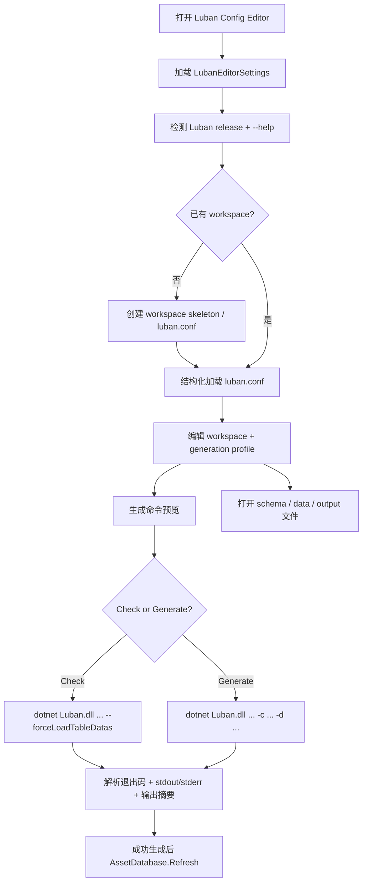

# luban-config-editor design

## 0. 术语约定

| 术语 | 定义 | 防冲突结论 |
|---|---|---|
| Luban release | 用户放在项目根目录 `Luban/` 的 Luban 工具发行包，与 `Assets/` 平级 | 当前本地 `Luban.deps.json` 显示 `Luban/4.9.0`，工具按本地 release 为准 |
| Luban CLI | 通过 `dotnet Luban.dll ...` 执行的命令行入口 | 不把 Luban DLL 当 Unity runtime/library 直接引用 |
| Luban workspace | 包含 `luban.conf`、schema、数据源和生成输出配置的工程目录 | 当前项目还没有 workspace，工具需要支持创建或选择 |
| `luban.conf` | Luban 工程配置文件 | 工具编辑它的结构化字段，并尽量保留未知字段 |
| generation profile | Unity 侧保存的一组生成参数：conf、target、code target、data target、xargs、输出目录等 | 用于重复执行检查 / 生成，不替代 `luban.conf` |
| code target / data target | Luban 生成代码和数据的目标名 | 本地 help 中对应 `-c, --codeTarget` 与 `-d, --dataTarget` |
| `cs-editor-json` | Luban 模板目录中的编辑器 JSON C# 目标 | 作为后续行级配置编辑扩展点，首版不强行做完整表格 UI |

防冲突结论：

- 上一版 MiniExcel 导入方案废弃；本 feature 不自研 Excel 读取和 row type 生成链路。
- `ConfigModule` 仍是当前运行时配置入口；Luban 工具先解决编辑器侧配置流水线，不在本 feature 中替换运行时加载 API。
- `Luban/` 是与 `Assets/` 平级的第三方 release 目录；新增工具代码留在 `Assets/GameDeveloperKit/Editor/` 下，不能把 Luban 工具 DLL 放进 Unity 资产编译范围。

## 1. 决策与约束

### 需求摘要

做什么：新增一个 Unity Editor 工具，用来管理 Luban 配置工程和生成流程。用户可以在窗口中选择本地 Luban release、创建或选择 Luban workspace、编辑 `luban.conf` 的关键字段、维护多个 generation profile、运行检查 / 生成，并在窗口里查看命令、退出码、日志、错误和输出摘要。

为谁：维护 Luban 配置工程的框架开发者、配置维护者，以及需要稳定生成配置代码 / 数据的玩法开发者。

成功标准：

- 菜单可打开 `Luban Config Editor`，窗口只在 Editor asmdef 中编译。
- 工具能检测本地 Luban release，显示 `Luban 4.9.0+...` 版本或明确的缺失错误。
- 没有 workspace 时，可以按项目默认位置创建基础 `luban.conf` 和目录骨架。
- 已有 workspace 时，可以加载 `luban.conf`，显示并编辑 target / schema 文件 / 数据目录 / 输出参数等常用字段。
- 可以维护多个 generation profile，每个 profile 记录 `--conf`、`--target`、`--codeTarget`、`--dataTarget`、`--includeTag`、`--excludeTag`、`--variant`、`--xargs`、输出目录和是否校验失败视为错误。
- 可以一键执行 check：调用本地 Luban CLI 加载配置和数据，显示日志，失败时不写生成输出。
- 可以一键执行 generate：调用本地 Luban CLI 生成代码和数据，成功后刷新 AssetDatabase。
- 命令执行报告包含完整命令、工作目录、退出码、耗时、stdout/stderr、输出路径和错误摘要。
- 本 feature 不再出现 MiniExcel 自研导入流程。

### 明确不做

- 不实现 Luban schema 语言、数据加载器、验证器、代码生成器或模板引擎。
- 不在 Runtime asmdef 或 Player 构建中引用 Luban DLL。
- 不直接解析 Excel / CSV / JSON 数据文件；表格读取交给 Luban。
- 不做完整的任意表格单元格编辑器；首版只管理 Luban 工程配置、生成 profile、文件定位和命令执行。
- 不修改 `ConfigModule`、`Table<TRow>`、`IConfig` 或现有运行时配置查询 API。
- 不负责 AssetBundle 构建、资源上传、热更新发布、下载缓存或远端配置同步。
- 不自动删除或重排用户自定义的 `luban.conf` 字段。

### 复杂度档位

- `Robustness = L3`：工具会执行外部进程并读写配置文件，必须对路径、退出码、日志、写入失败和未知字段保留给出明确语义。
- `Compatibility = additive-editor-tool`：新增 Unity Editor 工具，不改变 runtime 模块和已存在的 Luban release 文件。
- `Dependency = external-cli`：通过 `dotnet Luban/Luban.dll` 调用 Luban 4.9.0；不把 Luban assemblies 放入 `Assets/` 或作为项目代码引用。
- `UX = production editor tool`：需要 profile 列表、路径选择、命令预览、执行状态、日志和错误面板。
- `Concurrency = single-runner`：同一时间只允许一个 Luban run，避免多个生成同时写同一输出目录。

### 关键决策

1. 调用 Luban CLI，而不是直接引用 Luban DLL API。
   - 采用：`dotnet Luban.dll --conf ... -t ... -c ... -d ...` 外部进程。
   - 拒绝：Editor asmdef 直接引用 `Luban.Core.dll` 等程序集。
   - 原因：本地 release 是 .NET 8 CLI 工具，依赖多且目标不是 Unity runtime；进程边界更稳，Player 也不会被污染。

2. Unity 侧保存 generation profile，Luban 侧仍以 `luban.conf` 为权威。
   - `luban.conf` 记录 Luban 工程本身。
   - profile 记录“在这个 Unity 项目里怎么调用它”：目标、输出目录、标签、variant、xargs 和常用开关。
   - 这样同一个 workspace 可以有 client / server / editor 等多套生成入口。

3. 首版“配置编辑”聚焦工程配置和生成流程。
   - 可编辑 workspace/profile、定位并打开 schema / 数据源文件、运行 check / generate。
   - 不在首版生成任意表格单元格 UI。
   - 行级编辑后续可借 Luban `cs-editor-json` 目标生成 editor data model 后另起 feature。

4. `luban.conf` 结构化读写要保留未知字段。
   - 工具只暴露常用字段；不认识的字段不能被保存时丢掉。
   - 保存前给出 diff / dirty 状态，避免误覆盖手写配置。

5. 输出目录默认对齐 Unity 项目。
   - 代码输出默认建议落到 `Assets/GameDeveloperKit/Generated/Luban/Code` 或用户指定目录。
   - 数据输出默认建议落到 `Assets/GameDeveloperKit/Generated/Luban/Data` 或后续资源流程指定目录。
   - 最终是否进入 Resource/StreamingAssets 不在本 feature 拍板。

## 2. 名词与编排

### 2.1 名词层

#### 现状

- 项目根目录 `Luban/` 已包含 Luban release：`Luban.dll`、`Luban.exe`、`Luban.runtimeconfig.json`、大量 `Luban.*.dll`、依赖 DLL 和 `Templates/`，与 `Assets/` 平级。
- 本地执行 `dotnet Luban/Luban.dll --help` 输出版本 `Luban 4.9.0+1c058cf7cc31026e0d70cf7f7bc312c6597fec55`，并列出 `--conf`、`--target`、`--codeTarget`、`--dataTarget`、`--pipeline`、`--includeTag`、`--excludeTag`、`--variant`、`--xargs`、`--watchDir` 等参数。
- `Luban/Templates/` 已包含 `cs-simple-json`、`cs-bin`、`cs-newtonsoft-json`、`cs-editor-json` 等模板目录。
- 当前项目未发现 `luban.conf`、`__tables__`、`__beans__`、`__enums__` 或 `DataTables` workspace。
- `Assets/GameDeveloperKit/Runtime/Config/` 仍是现有运行时配置模块，读取 JSON 到 `Table<TRow>`，不认识 Luban workspace。
- `Assets/GameDeveloperKit/Editor/` 已有 ResourceEditor、ResourcePublisher、TagEditor、UI 等工具目录；Luban release 不在 `Assets/` 内，Editor 代码只保存 release path 并通过外部进程调用。

#### 变化

新增 Editor-only 名词：

- `LubanConfigEditorWindow`：窗口入口，展示 workspace、profile、command preview、run report 和日志。
- `LubanEditorSettings`：Unity 侧项目设置，保存 Luban release path、最近 workspace、profile 列表和 UI 选择状态。
- `LubanWorkspaceProfile`：描述一个 Luban workspace，包括 workspace root、`luban.conf` path、schema/data 目录和默认 target。
- `LubanGenerationProfile`：描述一次生成入口，包括 target、code target、data target、tags、variant、xargs、输出目录和开关。
- `LubanConfModel`：结构化读取 `luban.conf` 的模型，只编辑工具认识的字段，同时保留未知 JSON/YAML 节点。
- `LubanCommandPreview`：把 profile 展开成实际命令，供用户在运行前检查。
- `LubanCommandRunner`：外部进程执行器，负责 `dotnet` 路径、工作目录、stdout/stderr、取消和单 runner 锁。
- `LubanRunReport`：一次 check/generate 的结果，记录命令、退出码、耗时、日志、错误摘要和输出路径。
- `LubanFileLocator`：定位并打开 `luban.conf`、schema 文件、数据文件和输出目录。

命令示例：

```powershell
dotnet Luban/Luban.dll `
  --conf DataTables/luban.conf `
  --target client `
  --codeTarget cs-simple-json `
  --dataTarget json `
  --validationFailAsError `
  -x outputCodeDir=Assets/GameDeveloperKit/Generated/Luban/Code `
  -x outputDataDir=Assets/GameDeveloperKit/Generated/Luban/Data
```

检查示例：

```powershell
dotnet Luban/Luban.dll `
  --conf DataTables/luban.conf `
  --target client `
  --forceLoadTableDatas `
  --validationFailAsError
```

### 2.2 编排层



#### 现状

- 没有 Unity 内的 Luban workspace 设置、profile、运行按钮或 report。
- Luban release 已经存在，但还没有项目侧 wrapper；用户需要自己拼命令。
- 若直接把 Luban DLL 当插件引用，Unity 侧是否正确处理 .NET 8 工具依赖不可控。

#### 变化

1. 窗口启动：
   - 菜单打开 `Luban Config Editor`。
   - 读取 `LubanEditorSettings`；缺失时创建默认设置。
   - 检测 release path，优先指向项目根 `Luban/Luban.dll`。
   - 执行 `--help` 或 `--version` 获取版本；失败时窗口显示修复入口，不继续运行生成。

2. workspace 管理：
   - 用户可选择已有 `luban.conf` 或创建默认 workspace。
   - 默认 workspace 建议在项目根 `DataTables/`，避免混进 `Runtime/Config` 或 Luban release 目录。
   - `LubanConfModel` 读取并显示常用配置项；未知字段保留。
   - 保存前显示 dirty 状态；保存失败在窗口中显示，不覆盖原文件。

3. profile 编辑：
   - 一个 workspace 可有多个 generation profile。
   - profile 字段映射到 CLI：target、code target、data target、include/exclude tag、variant、pipeline、xargs、输出路径、validationFailAsError。
   - 命令预览总是展示真实参数，避免“按钮背后发生什么”不透明。

4. Check：
   - check 使用同一个 `luban.conf` 和 target 加载 schema/data。
   - 开启 `--validationFailAsError` 时 validation failure 作为失败报告。
   - check 不传 code/data target，不刷新输出目录；项目若已有专用 dry-run xarg，再由 profile 显式配置。

5. Generate：
   - generate 调用 profile 中的 code/data target。
   - 成功后刷新 AssetDatabase。
   - 失败时不清理已有输出，但 report 明确本次失败，避免误以为生成结果已更新。

#### 流程级约束

- 错误语义：release 缺失、dotnet 不可用、`luban.conf` 缺失、命令非零退出、保存失败都显示为 error report；不吞 stdout/stderr。
- 幂等性：未修改 profile / workspace 时重复打开不写文件；相同 profile 重复运行只由 Luban 输出决定，工具不额外改写配置。
- 顺序：必须检测 release 成功后才允许 check/generate；generate 成功后才刷新 AssetDatabase。
- 并发：同一窗口同一时间只允许一个 Luban command；运行中禁用第二个 run，允许取消当前进程。
- 可观测点：每次运行都记录完整命令、工作目录、耗时、退出码和日志；复制命令可在终端复现。
- 扩展点：后续行级配置编辑挂在 `cs-editor-json` profile 和生成后的 editor model，不塞进本次 profile 管理主流程。

### 2.3 挂载点清单

1. `GameDeveloperKit/Luban Config Editor` 菜单项：删除后用户无法打开工具。
2. `LubanEditorSettings` 项目设置：删除后 release path、workspace、profiles 和最近选择丢失。
3. Luban release path 设置：删除后工具不知道调用哪个 `Luban.dll`。
4. Workspace / `luban.conf` 入口：删除后工具没有可编辑的 Luban 工程。
5. Generation profile 列表：删除后只能手动拼命令，无法稳定重复 check/generate。
6. Command runner / report 面板：删除后工具只能编辑配置，不能执行和观察 Luban 结果。

拔除沙盘：移除菜单、settings、release path、workspace 入口、profile 和 runner/report 后，Unity 内 Luban 配置编辑能力应完整消失；本地 Luban release 文件仍可由用户在命令行手动调用。

### 2.4 推进策略

1. 工具骨架与 release 检测：窗口、settings、release path、version/help 检测和错误态。
   - 退出信号：窗口能显示本地 Luban 4.9.0 版本；路径错误时显示明确修复信息。
2. workspace 载入 / 创建：选择 `luban.conf`、创建默认目录骨架、结构化读取并保留未知字段。
   - 退出信号：没有 workspace 时能创建基础工程；已有 `luban.conf` 能读出常用字段并保存不丢未知字段。
3. generation profile 编辑：支持 target、code/data target、tags、variant、xargs、输出目录和命令预览。
   - 退出信号：修改 profile 后命令预览同步变化，并能持久化。
4. Luban check runner：执行 check 命令，捕获 stdout/stderr、退出码、耗时和错误摘要。
   - 退出信号：配置错误或数据错误能在窗口中显示，并可复制完整命令复现。
5. Luban generate runner：执行 generate 命令，成功后刷新 AssetDatabase，失败时保留旧输出并显示失败。
   - 退出信号：一个最小 workspace 能生成代码/数据到 profile 指定目录。
6. 文件定位与编辑辅助：从窗口打开 `luban.conf`、schema/data 目录、输出目录。
   - 退出信号：用户能从 report 或 profile 一键定位相关文件。
7. UI 和报告收尾：补齐 profile 列表、dirty 提示、取消运行、日志过滤、copy command 和空状态。
   - 退出信号：正常、缺 release、缺 workspace、运行失败、运行成功五种状态都可见。
8. 验证覆盖：Editor 编译 / EditMode tests 覆盖命令构造、settings 持久化、conf 保留未知字段和 runner 错误处理。
   - 退出信号：Editor 编译通过，关键验收场景有测试或可观察证据。

### 2.5 结构健康度与微重构

#### 评估

- compound convention 检索：`search-yaml.py` 与 `rg` 在当前环境对 compound 检索超时，改用 `Select-String` 兜底；未命中 Luban / 配置编辑 / 目录组织相关 convention。
- 文件级 — `Luban/`：这是与 `Assets/` 平级的第三方 release 目录，包含 CLI、依赖和模板；新增工具代码不应放入该目录，避免 vendor 文件和项目 wrapper 混杂。
- 文件级 — `Assets/GameDeveloperKit/Runtime/Config/ConfigModule.cs`：运行时 JSON 配置加载职责独立，本 feature 不修改。
- 文件级 — `Assets/GameDeveloperKit/Editor/GameDeveloperKit.Editor.asmdef`：本 feature 可以使用 Unity Editor API 和现有 runtime 引用；不应通过 asmdef 直接引用项目根 `Luban/` 下的 .NET 8 工具 DLL。
- 目录级 — `Assets/GameDeveloperKit/Editor/`：已有多个工具目录，再把 Luban editor 代码平铺到根目录会继续拥挤；应新建独立 `LubanConfigEditor` 或 `LubanEditor` 目录，UI 资产放 `UI/`。

#### 结论：不做行为微重构，新增工具与 Assets 外的 release 分离

本次不搬迁 Luban release、不修改 Runtime Config、不整理 Editor 根目录。实现阶段新增工具代码落到 `Assets/GameDeveloperKit/Editor/LubanConfigEditor/`，Luban release 保持在项目根 `Luban/`。这个组织是新增文件归属，不是“只搬不改行为”的前置微重构，checklist 不需要把微重构列为第 1 步。

#### 建议沉淀的 convention

如果实现跑通，建议后续用 `cs-decide` 记录：第三方 CLI release 放在与 `Assets/` 平级的项目工具目录（如 `Luban/`），项目侧 Unity wrapper 放 `Assets/GameDeveloperKit/Editor/{VendorTool}Editor/`，两者不混放。

#### 超出范围的观察

- Luban release 当前已移到 `Assets/` 平级目录，避免 Unity 把工具 DLL 当插件导入；实现阶段应继续把 release path 当外部工具路径处理，不把 DLL 复制回 `Assets/`。
- `ConfigModule` 与 Luban 生成数据如何统一运行时加载，需要另起 feature 设计；本 feature 只做编辑器侧配置流水线。

## 3. 验收契约

| 编号 | 输入 / 触发 | 期望可观察结果 |
|---|---|---|
| N1 | 打开 `GameDeveloperKit/Luban Config Editor` | 窗口出现，显示 release 检测区域 |
| N2 | release path 指向本地 `Luban.dll` | 显示 Luban 版本 `4.9.0` 或完整版本字符串 |
| N3 | release path 无效 | 显示 error，check/generate 按钮不可用 |
| N4 | 项目没有 workspace，点击创建默认 workspace | 创建 `luban.conf` 和基础目录骨架，profile 指向该 workspace |
| N5 | 选择已有 `luban.conf` | 窗口显示 workspace root、target、schema/data 相关字段 |
| N6 | 编辑 generation profile 的 target / codeTarget / dataTarget / xargs | 命令预览实时更新并可保存 |
| N7 | 点击 Check 且 Luban 返回 0 | report 显示 success、耗时、完整命令和日志 |
| N8 | 点击 Check 且 Luban 返回非 0 | report 显示 failed，包含 stdout/stderr，不刷新输出目录 |
| N9 | 点击 Generate 且 Luban 返回 0 | 代码/数据输出到 profile 指定目录，AssetDatabase 刷新 |
| N10 | Generate 运行中再次点击 Generate | 第二次运行被禁用或提示已有任务在执行 |
| N11 | 运行中点击 Cancel | 进程被取消，report 标记 canceled |
| N12 | 点击 Copy Command | 得到可在终端复现的完整 `dotnet Luban.dll ...` 命令 |
| B1 | 保存 `luban.conf` 时文件只读或无权限 | 显示保存失败，不覆盖原文件 |
| B2 | `luban.conf` 有工具不认识的字段 | 保存已知字段后未知字段仍保留 |
| B3 | dotnet 不可用 | 显示环境错误，不执行 Luban |
| E1 | Runtime asmdef、Editor asmdef 或 Player 构建直接引用 / 复制 `Luban/` 下的 DLL | 判定为错误；Luban CLI 只能作为 Assets 外部工具被 Editor 调用 |
| E2 | 实现中出现自研 Excel / CSV 解析器替代 Luban | 判定为超范围 |
| E3 | 实现修改 `ConfigModule` 以适配 Luban 输出 | 判定为超范围 |

### 明确不做的反向核对项

- 不新增 MiniExcel 导入器或手写 Excel 解析流程。
- 不直接引用或复制 `Luban.Core.dll` / `Luban.dll` 到 `Assets/`、Runtime 或 Player。
- 不修改现有 `ConfigModule` / `Table<TRow>` / `IConfig` API。
- 不生成完整单元格编辑器 UI。
- 不把项目 wrapper 代码写进项目根 `Luban/` release 目录。
- 不执行资源打包、上传、下载或热更新发布逻辑。

## 4. 与项目级架构文档的关系

验收通过后需要更新 `.codestable/architecture/ARCHITECTURE.md`：

- 在 Config 或 Editor tooling 相关小节记录 Luban Config Editor 的现状。
- 记录 Luban release 位于 `Assets/` 平级 `Luban/` 目录，项目 wrapper 通过外部进程调用。
- 记录工具管理 workspace / `luban.conf` / generation profile / check-generate report，不替代 Luban schema 和数据处理。
- 记录 Runtime Config 与 Luban 输出的集成仍是后续 feature。
