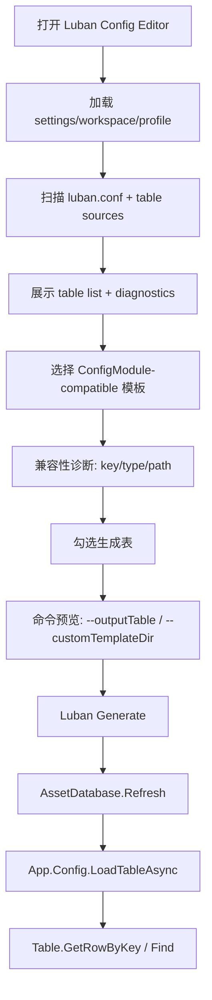

# luban-configmodule-codegen design

## 0. 术语约定

| 术语 | 定义 | 防冲突结论 |
|---|---|---|
| Luban 表名 / table name | Luban schema 中的表类型名，例如当前本地 `--outputTable Tbtest` 能命中 | 用于 UI 勾选和 CLI `-o/--outputTable`，不能和数据文件名混用 |
| data key | Luban 生成的 data 文件 key，例如当前 `tbtest.json` / `loader("tbtest")` | 用于定位 JSON 文件，不作为 `--outputTable` 名称 |
| config row type | 当前 ConfigModule 的泛型行类型，例如目标中的 `cfg.test : IConfig` | 运行时唯一入口是 `LoadTableAsync<cfg.test>()` 或 `LoadTableAsync<cfg.test>(path)` |
| ConfigModule-compatible codegen | 自定义模板生成 `IConfig.key`、Newtonsoft 反序列化构造和可选 `[TableOption]` | 这是 Luban 与运行时 ConfigModule 的结合点 |
| table wrapper | Luban 默认生成的 `cfg.Tbtest` 表类，包含 `DataMap/DataList/Get` | 可保留给 Luban 生成链路和调试，但 GameDeveloperKit 运行时不新增一套 wrapper API |
| custom template dir | Luban CLI 的 `--customTemplateDir` 指向的项目自定义模板目录 | 不改 `Luban/Templates` release 原文件；项目模板放 workspace 或项目工具目录 |
| table declaration | Luban 识别的一张表定义，可能来自 XML/JSON 声明，也可能来自 `#*.xlsx` 内嵌表头 | 编辑器展示和配置它，但保存策略按 source kind 分级 |
| table source | 存放 table declaration 和数据的源文件，例如 `DataTables/Datas/#test.xlsx` | 当前项目没有独立 `Defines/` 文件，不能假定所有表都在 XML |

当前本地证据：

- `dotnet Luban/Luban.dll --help` 支持 `-o, --outputTable` 和 `--customTemplateDir`。
- 当前 workspace 生成了 `cfg.Tables`、`cfg.Tbtest`、`cfg.test` 和 `tbtest.json`。
- 本地实测 `-o Tbtest` 成功；`-o tbtest`、`-o test`、`-o cfg.Tbtest` 失败。
- 当前 `ConfigModule` 只有一套运行时表入口：`LoadTableAsync<TRow>() where TRow : IConfig`、`GetTable<TRow>`、`Find/Where/FirstOrDefault`。
- 当前 `Table<TRow>` 要求 `TRow : IConfig`，构造函数接收 `List<TRow>`，通过 `row.key` 校验重复主键。
- Luban 官方自定义模板使用 Scriban，并支持 `--customTemplateDir` 作为优先模板搜索路径；本地 `Luban/Templates/cs-simple-json/table.sbn` 能看到 `__table`、`__key_type`、`__value_type`、`DataList` 等生成上下文。

## 1. 决策与约束

### 需求摘要

做什么：在一期 Luban Config Editor 基础上补齐表级能力，并让 Luban 生成代码直接适配当前 `ConfigModule`。窗口能发现表清单、选择要生成的表、展示/配置 table declaration；生成 profile 能启用项目自定义模板；模板为满足条件的 Luban row type 生成 `IConfig`、Newtonsoft 兼容构造和可选 `[TableOption]`，使业务继续只用 `App.Config.LoadTableAsync<TRow>` 这一套 API。

为谁：维护 Luban 配置的框架开发者、配置维护者，以及希望配置运行时入口保持简单统一的玩法开发者。

成功标准：

- 表列表能看到当前 `Tbtest`，并区分 `tableName=Tbtest` 与 `dataKey=tbtest`。
- profile 可切换全部生成 / 选中表生成；选中 `Tbtest` 时命令预览包含 `-o Tbtest`。
- profile 可启用项目 custom template dir；命令预览包含 `--customTemplateDir {projectTemplateDir}`。
- 生成出的 `cfg.test` 满足当前 ConfigModule：实现 `IConfig.key`，可被 Newtonsoft 从 `tbtest.json` 反序列化。
- 对 row type 与表一一对应的表，可生成 `[TableOption(".../tbtest.json")]`；否则调用方通过显式 path 加载。
- 业务通过 `await App.Config.LoadTableAsync<cfg.test>(path)` 加载 Luban JSON，并通过 `GetRowByKey(1)` / `Find<cfg.test>` 查询。
- `ConfigModule` 不新增 `LoadLubanTablesAsync`、aggregate cache、catalog loader 等第二套运行时 API。
- 现有非 Luban `IConfig` 表继续按原方式工作。

### 明确不做

- 不重写 Luban schema、校验器、代码生成器或数据导出器。
- 不把项目根 `Luban/` release DLL 复制进 `Assets/`，也不在 Player 中引用 CLI 工具 DLL。
- 不直接修改 release 自带 `Luban/Templates`；自定义模板必须放在项目自有目录，并通过 `--customTemplateDir` 接入。
- 不手改 `Assets/GameDeveloperKit/Generated/Luban/Code/*.cs`；生成代码只能由 Luban 或项目模板再生成。
- 不给 `ConfigModule` 增加第二套 Luban aggregate API。
- 不让 GameDeveloperKit.Runtime 直接依赖项目生成的 `cfg.Tables` / `cfg.Tbtest` 类型。
- 不让 Luban 表类继承旧 `Table<TRow>`；旧 `Table<TRow>` 仍由 `ConfigModule` 包装 `List<TRow>` 创建。
- 不承诺所有 Luban 类型都能进入当前 `ConfigModule` 模型；复杂 ref、多索引、one/list 特殊模式若不能安全映射，编辑器必须给出诊断。
- 不做完整 spreadsheet 单元格数据编辑器；本 feature 只编辑 table declaration / 字段元数据，不编辑业务数据行。
- 不负责资源打包、上传、热更新发布或下载缓存。

### 复杂度档位

- `Robustness = L3`：生成代码是运行时入口，必须对表名、主键、Newtonsoft 兼容性、路径和模板版本给出清晰诊断。
- `Compatibility = current-api-first`：以当前 `ConfigModule` 公开 API 为硬边界，不新增并行 runtime API。
- `Dependency = split-luban`：Editor 调用项目根 `Luban/Luban.dll`；Runtime 可依赖现有 Newtonsoft 和 `Luban.Runtime`，但不依赖 CLI release。
- `UX = production editor tool`：表列表、选择生成、模板开关、命令预览、错误定位要连起来。
- `Data safety = conservative writeback`：表定义源不确定能安全保存时降级只读 + 打开源文件。

### 关键决策

1. 运行时唯一入口是当前 ConfigModule。
   - 采用：`App.Config.LoadTableAsync<cfg.test>(path)` / `App.Config.LoadTableAsync<cfg.test>()`。
   - 拒绝：`LoadLubanTablesAsync`、`GetLubanTables`、runtime catalog loader、aggregate cache。
   - 原因：用户明确不希望 ConfigModule 中存在两套 API；统一成 row table 模型更符合当前模块。

2. 自定义模板生成 row adapter，而不是修改 ConfigModule。
   - `table.sbn` 知道 `__table`、`__key_type`、`__value_type`，适合生成一个 `partial class cfg.test : IConfig` 片段。
   - adapter 可包含 `IConfig.key`、`[JsonConstructor]` 构造、可选 `[TableOption]`。
   - 原始 `bean.sbn` 的 JSONNode 构造仍保留，Luban 默认 `Tbtest/Tables` 也可继续生成。

3. `[TableOption]` 只在路径明确且 row type 不冲突时生成。
   - 当前 `LoadTableAsync<TRow>()` 依赖 row type 上的 `[TableOption]`。
   - 如果同一 row type 被多张表使用，或运行时资源 location 不等于编辑期输出路径，则不生成 attribute，要求业务使用显式 path。
   - 这样不需要为了路径问题改 ConfigModule API。

4. 生成前做 ConfigModule 兼容性诊断。
   - 必须识别主键字段：map table 的 `index_field` 映射到 `IConfig.key`。
   - 必须确认 row 字段能由 Newtonsoft 从导出的 JSON 映射。
   - 不支持的类型 / 表模式给 warning 或 error，不能悄悄生成半可用代码。

5. 选择生成使用 Luban 的 `--outputTable`。
   - UI 存储 Luban 表名，例如 `Tbtest`。
   - 命令预览按选中项追加 `-o Tbtest`。
   - data key `tbtest` 只用于推导 data 文件和默认 path，不用于 `--outputTable`。

## 2. 名词与编排

### 2.1 名词层

#### 现状

- `Assets/GameDeveloperKit/Runtime/Config/ConfigModule.cs` 当前只支持 `LoadTableAsync<TRow>() where TRow : IConfig` 和显式 path overload。
- `Assets/GameDeveloperKit/Runtime/Config/Table.cs` 当前只接受 `List<TRow>`，并通过 `row.key` 做重复 key 校验。
- `Assets/GameDeveloperKit/Generated/Luban/Code/test.cs` 当前 `cfg.test` 只继承 `Luban.BeanBase`，只有 `JSONNode` 构造，不实现 `IConfig`，也没有 Newtonsoft 专用构造。
- `Assets/GameDeveloperKit/Generated/Luban/Code/Tbtest.cs` 当前有 `DataMap/DataList/Get`，但这些不是 `ConfigModule` 的运行时入口。
- `DataTables/luban.conf` 只声明 groups、schemaFiles、dataDir、targets；当前实际表来自 `DataTables/Datas/#test.xlsx`。
- `LubanCommandPreview` 当前不支持 `--outputTable` 和 `--customTemplateDir`。

#### 变化

新增或扩展的 Editor 名词：

- `LubanTableIndex`：扫描 `luban.conf`、table source 和生成输出得到的表清单。
- `LubanTableDefinition`：表定义视图模型，包含 `TableName`、`DataKey`、`RowTypeName`、`SourcePath`、`SourceKind`、`InputName`、`Groups`、`KeyOrIndex`、`Fields`、`ConfigPathCandidate`。
- `LubanFieldDefinition`：字段定义视图模型，包含 variable name、type、group、comment、是否 key 参与者。
- `LubanTableSelection`：profile 下的选择状态，包含 `AllTables` 或 `SelectedTableNames`。
- `LubanTemplateProfile`：profile 下的模板设置，包含 custom template dir、是否启用 ConfigModule-compatible codegen、模板版本。
- `LubanConfigModuleCompatibilityReport`：生成前诊断结果，记录每张表是否能生成 `IConfig` adapter、不能生成的原因。
- `LubanTableDeclarationSource`：表定义源抽象，负责 load、validate、save；实现可分 Text / ExcelInline / ReadOnly。

生成代码目标示例：

```csharp
[TableOption("Assets/GameDeveloperKit/Generated/Luban/Data/tbtest.json")]
public sealed partial class test : IConfig
{
    [JsonConstructor]
    public test(int id, string name, string desc)
    {
        Id = id;
        Name = name;
        Desc = desc;
    }

    public Key key => new Key(nameof(Id), Id);
}
```

运行时目标示例：

```csharp
var table = await App.Config.LoadTableAsync<cfg.test>(
    "Assets/GameDeveloperKit/Generated/Luban/Data/tbtest.json");

var row = table.GetRowByKey(1);
```

默认路径明确时：

```csharp
var table = await App.Config.LoadTableAsync<cfg.test>();
```

### 2.2 编排层



#### 现状

- 表清单只能从生成输出间接看，没有 Editor 可视化入口。
- 生成按钮没有表范围参数，所有表按 profile 生成。
- 生成出的 `cfg.test` 不能进入 `ConfigModule.LoadTableAsync<TRow>`。
- 如果直接新增 Luban aggregate API，会让 `ConfigModule` 出现两套配置读取方式。

#### 变化

1. 表发现：
   - 加载 workspace 后读取 `luban.conf` 的 `schemaFiles`、`dataDir`、target/topModule/manager。
   - 扫描 schemaFiles 和 dataDir 下的 table source。
   - 对 XML/JSON 声明读取 table attributes。
   - 对 `#*.xlsx` 内嵌定义读取 workbook sheets 和 Luban header 行，构建只含元数据的 table index。
   - 若已有 generated code/data，做 reconcile：补齐 data key、row type、data file 状态。

2. 表详情与定义配置：
   - 表列表显示 table name、source、groups、data key、row type、兼容性状态。
   - 详情显示 fields、key/index、source path、data path candidate、diagnostics。
   - 能安全写回的 source 允许修改已知元数据；复杂 Excel 降级只读 + Open Source。

3. ConfigModule-compatible 模板：
   - profile 启用后，命令预览追加 `--customTemplateDir {projectTemplateDir}`。
   - 项目模板覆写 `cs-simple-json/table.sbn` 或增加等价 adapter 输出，使 row type 获得 `IConfig` / Newtonsoft / 可选 `[TableOption]`。
   - 模板不改变 release 自带 `Luban/Templates`。
   - 生成后仍保留 Luban 默认 table wrapper，但 GameDeveloperKit runtime 不暴露 wrapper 专用 API。

4. 选择生成：
   - profile 默认 `AllTables`，保持一期行为。
   - 切到 `SelectedTables` 后，用户勾选 table name。
   - 命令预览按选择追加 `-o {TableName}`，例如 `-o Tbtest`。
   - 选择不存在或当前 target 不可见的表，Generate 禁用并显示诊断。

5. 运行时加载：
   - 业务继续调用 `App.Config.LoadTableAsync<TRow>()` 或 `LoadTableAsync<TRow>(path)`。
   - `ConfigModule` 继续按现有流程加载 JSON 文本、Newtonsoft 反序列化、创建 `Table<TRow>`、缓存和查询。
   - 对不满足兼容性的 Luban 表，不提供第二套 `ConfigModule` API；用户需要调整表定义/模板，或明确另起设计改变 ConfigModule 模型。

#### 流程级约束

- 错误语义：表名无效、source 解析失败、保存失败、`--outputTable` 未命中、兼容性诊断失败、JSON 反序列化失败都必须包含 table name / row type / data key / source path。
- 幂等性：未修改表定义时重复扫描不写文件；重复生成只由 Luban 输出决定。
- 顺序：scan table index 早于兼容性诊断；诊断通过后才允许生成 ConfigModule-compatible code。
- 并发：沿用一期单 runner；运行中禁用扫描写回、表选择保存和二次 generate。
- 可观测点：每次 generate report 显示 table scope、实际 `-o` 参数、custom template dir、哪些表生成了 ConfigModule adapter。

### 2.3 挂载点清单

1. Table list/detail UI：删除后用户无法在 Editor 中看到或配置 Luban 表。
2. `LubanTableIndex` 扫描服务：删除后无法从 `luban.conf` / source / generated output 建立表清单。
3. `LubanTableSelection` profile 字段：删除后生成范围回到全部表，不能指定生成哪些表。
4. `--outputTable` command preview/runner 参数：删除后 UI 勾选不会影响实际 Luban 生成。
5. `--customTemplateDir` profile/runner 参数：删除后无法生成 ConfigModule-compatible Luban row 代码。
6. ConfigModule-compatible adapter 模板：删除后 Luban row type 不能进入当前 `LoadTableAsync<TRow>`。
7. `LubanTableDeclarationSource` 保存边界：删除后表定义只能外部手改，窗口无法配置表。

拔除沙盘：移除这些挂载点后，一期 Luban Config Editor 仍能做 workspace/profile/check/generate，旧 `ConfigModule` 仍能加载非 Luban `IConfig` 表，但“表级选择生成、表定义配置、Luban row 进入当前 ConfigModule”应完整消失。

### 2.4 推进策略

1. Editor 结构微重构：把当前窗口拆成 window shell、profile panel、workspace panel、status panel，把 settings/model/runner 与 UI 分开。
   - 退出信号：行为保持一期一致，窗口仍能 check/generate，编译通过。
2. 表发现和 table index：接入 `luban.conf`、Excel inline header、generated output reconcile，建立 `LubanTableDefinition`。
   - 退出信号：当前 `#test.xlsx` 能扫描出 `Tbtest`，并显示 `dataKey=tbtest`、row type `cfg.test`。
3. 表列表与详情 UI：展示 table list、fields、source、diagnostics 和文件打开操作。
   - 退出信号：用户能从窗口定位 `#test.xlsx`、`test.cs`、`tbtest.json`。
4. 选择生成：扩展 profile 的 scope/selected tables，命令预览和 runner 追加 `--outputTable`。
   - 退出信号：勾选 `Tbtest` 后预览含 `-o Tbtest`，生成成功；错误表名会显示 Luban 错误。
5. ConfigModule-compatible 模板：建立项目 custom template dir，生成 `IConfig` / Newtonsoft / 可选 `[TableOption]` adapter。
   - 退出信号：生成出的 `cfg.test` 能通过 `App.Config.LoadTableAsync<cfg.test>(path)` 加载 `tbtest.json`。
6. 表定义配置：实现安全的 source writer，新建表骨架和已知元数据保存，复杂 source 降级只读。
   - 退出信号：新建/修改后 Luban check 可观察通过或显示明确 source 错误。
7. 验证覆盖：覆盖命令构造、table name/data key 映射、custom template dir、ConfigModule 加载 Luban JSON、旧非 Luban 表不回归。
   - 退出信号：Editor/Runtime 编译通过，关键场景有测试或手动证据。

### 2.5 结构健康度与微重构

#### 评估

- compound convention 检索：未命中 Luban / Config editor 目录组织类长期 decision；一期 design 只建议 release 与 wrapper 分离。
- 文件级 — `LubanConfigEditorWindow.cs`：当前同时承担布局、release 检测、workspace、profile、命令预览、run report、初始化逻辑。继续加入 table list/detail/editor 会把它推成混合 god window。
- 文件级 — `LubanEditorSettings.cs`：当前混放 settings、workspace profile、generation profile、conf model；二期还要加 table selection 和模板配置，继续堆会让序列化模型难维护。
- 文件级 — `LubanCommandRunner.cs`：当前 command runner、preview、report 在同一文件；加入 outputTable/customTemplateDir 后仍可短期承载，但后续若加 watch/customTemplate 应拆。
- Runtime 目录级 — `Assets/GameDeveloperKit/Runtime/Config/`：不新增 Luban 专用 API；只可能新增少量通用 adapter 支持类型。如果模板直接生成 `IConfig`，Runtime 目录可不增加新文件。

#### 结论：做 Editor 文件级微重构，不做 Runtime API 微重构

实现阶段第一步做只搬不改行为的 Editor 文件级微重构：

- `LubanConfigEditorWindow.cs` 保留窗口入口和顶层装配。
- Release/workspace/profile/status/table panels 拆到独立 UI 文件。
- `LubanEditorSettings`、workspace/profile/conf/table selection/template models 拆到独立 model 文件。
- `LubanCommandPreview` / `LubanRunReport` 可先从 runner 文件拆出，便于扩展 `--outputTable` 和 `--customTemplateDir`。
- 项目 custom templates 落到 `DataTables/Templates/` 或 `.codestable` 之外的项目工具目录，不进入项目根 `Luban/` release。

Runtime 不做 API 微重构；`ConfigModule.cs` 仍保持单一 `LoadTableAsync<TRow>` 模型。若实现中发现当前 `ConfigModule` 必须新增辅助方法才能承载 Luban，应停下来重新 review，而不是偷偷加第二套 API。

#### 建议沉淀的 convention

如果实现跑通，建议后续用 `cs-decide` 记录：复杂 EditorWindow 只保留入口和布局装配；第三方 CLI release 不改原模板，项目自定义模板通过 `--customTemplateDir` 接入；运行时模块坚持单一公开入口。

#### 超出范围的观察

- 如果后续要完整支持 Luban 的 ref、多索引、one/list/table wrapper 语义，而当前 `Table<TRow>` 无法表达，应另起 `ConfigModule` 模型升级设计。
- 如果后续要做完整 Excel 单元格编辑器或策划表格 UI，应另起 feature，不塞进本次表定义配置。

## 3. 验收契约

| 编号 | 输入 / 触发 | 期望可观察结果 |
|---|---|---|
| N1 | 打开 Luban Config Editor 并选择当前 `DataTables/luban.conf` | 表列表显示 `Tbtest`，详情显示 source 是 `#test.xlsx` |
| N2 | 查看 `Tbtest` 详情 | 能看到 `tableName=Tbtest`、`dataKey=tbtest`、row type `cfg.test` |
| N3 | profile 选择 `SelectedTables` 并勾选 `Tbtest` | command preview 包含 `-o Tbtest` |
| N4 | profile 启用 ConfigModule-compatible 模板 | command preview 包含 `--customTemplateDir {projectTemplateDir}` |
| N5 | 勾选 `Tbtest` 后 Generate | Luban 生成成功，输出代码和 `tbtest.json` |
| N6 | Generate 后查看 `cfg.test` | `cfg.test` 实现 `IConfig`，包含 `key => new Key(nameof(Id), Id)` 或等价实现 |
| N7 | Generate 后查看 `cfg.test` | 存在 Newtonsoft 可用的构造/属性映射，能反序列化当前 `tbtest.json` |
| N8 | row type 与表一一对应且 path 明确 | 生成 `[TableOption(...tbtest.json)]`，`LoadTableAsync<cfg.test>()` 可用 |
| N9 | path 不明确或 row type 被多表复用 | 不生成 `[TableOption]`，UI 提示需用显式 path |
| N10 | Runtime 调用 `App.Config.LoadTableAsync<cfg.test>(path)` | 返回 `Table<cfg.test>`，`GetRowByKey(1)` 返回当前 JSON 行 |
| N11 | 表已加载后调用 `App.Config.Find<cfg.test>(x => x.Id == 1)` | 返回匹配的 `cfg.test` |
| N12 | 未启用 ConfigModule-compatible 模板后 Generate | 不要求 `cfg.test : IConfig`，UI 明确该输出不能直接走当前 ConfigModule |
| N13 | 表定义 source 可安全写回，修改字段 group 后保存 | source 被更新，未知字段/未触碰区域保留，重新扫描显示新 group |
| N14 | source 是复杂或无法识别 Excel | 详情只读，提供 Open Source，不直接写回 |
| B1 | profile 中保存了不存在的表名 | Generate 禁用或运行失败 report 明确 `outputTable:{name} not found` |
| B2 | 表没有明确单主键 | 兼容性诊断失败，不生成 `IConfig` adapter |
| B3 | 字段类型无法由 Newtonsoft 从导出 JSON 安全反序列化 | 兼容性诊断失败，错误包含 row type 和字段名 |
| B4 | 保存 table source 失败 | 显示保存失败，不覆盖原文件 |
| E1 | 实现中新增 `LoadLubanTablesAsync` / `GetLubanTables` 等第二套 ConfigModule API | 判定为错误 |
| E2 | 实现中把项目根 `Luban/Luban.dll` 或 CLI 依赖复制进 `Assets` | 判定为错误 |
| E3 | 实现中直接手改 generated `cfg.*` 文件 | 判定为错误 |
| E4 | 实现中直接修改 `Luban/Templates` release 原文件 | 判定为错误 |
| E5 | 实现中破坏现有非 Luban `LoadTableAsync<TRow>() where TRow : IConfig` | 判定为错误 |

### 明确不做的反向核对项

- 不新增 MiniExcel 导入器替代 Luban。
- 不做完整业务数据行编辑器。
- 不把 `tbtest` 当成 `--outputTable` 名称。
- 不直接修改 release 自带 `Luban/Templates`。
- 不新增 `LoadLubanTablesAsync`、runtime catalog loader 或 aggregate cache。
- 不让 Runtime 解析 `luban.conf` 或 Excel source。
- 不让 GameDeveloperKit.Runtime 直接依赖项目生成的 `cfg.Tables` / `cfg.Tbtest`。
- 不让 Luban table wrapper 继承旧 `Table<TRow>`。

## 4. 与项目级架构文档的关系

验收通过后需要更新：

- `.codestable/requirements/luban-config-editor.md`：补充二期能力已经从“workspace/profile/生成”扩展到表清单、选择生成、表定义配置和自定义模板。
- `.codestable/requirements/config-module.md`：补充 Luban 通过生成 `IConfig` row type 接入当前 ConfigModule，不新增第二套运行时 API。
- `.codestable/architecture/ARCHITECTURE.md` 的 Config 小节：记录 `ConfigModule` 仍只有 `LoadTableAsync<TRow>` 模型，Luban 表通过模板生成兼容 row type。
- `.codestable/architecture/ARCHITECTURE.md` 的 Editor tooling 小节：记录 `Luban/` CLI release 与项目 custom template dir 的边界。
