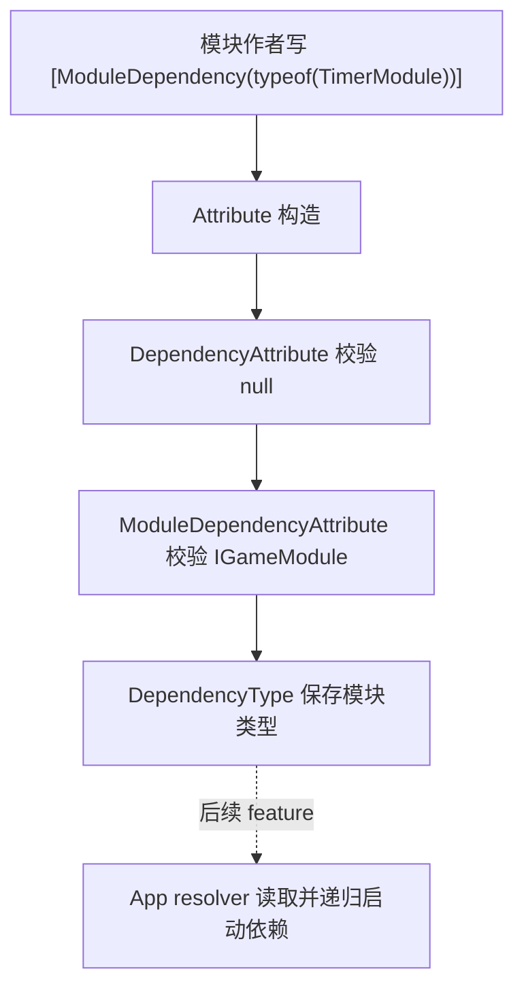

# core-dependency-attributes design

## 0. 术语约定

| 术语 | 当前定义 | 本次约定 |
|---|---|---|
| DependencyAttribute | 当前不存在统一依赖元数据基类 | 放在 Core 下的抽象 attribute，保存一个 `DependencyType` |
| ModuleDependencyAttribute | 当前模块依赖只存在于 App 默认注册顺序和模块内部取用逻辑里 | `DependencyAttribute` 的模块依赖派生类，用 `[ModuleDependency(typeof(TimerModule))]` 声明同步启动前置模块 |
| resolver | 当前 App 没有读取依赖 attribute 的 resolver | 后续 `app-sync-module-resolver` 消费本 feature 产出的元数据；本 feature 不实现读取和启动 |

防冲突结论：

- 本 feature 不实现 `App.GetModule<T>()`、不读取 attribute、不做循环检测、失败回滚或反序 shutdown。
- 本 feature 会给 Event、Download、Resource、Config、Sound、UI 添加首批静态 `[ModuleDependency]` 标注；它们在 resolver 落地前不改变运行时行为。
- 本 feature 不引入 optional dependency，也不做程序集扫描或自动发现全部模块。

## 1. 决策与约束

### 需求摘要

做什么：在 Runtime Core 下新增 `DependencyAttribute` 和 `ModuleDependencyAttribute`，固定模块依赖声明的基础元数据契约，并给首批运行时模块补上静态依赖标注。

为谁：后续 App 同步按需模块 resolver、模块作者，以及维护模块依赖关系的框架开发者。

成功标准：

- `DependencyAttribute` 暴露只读 `DependencyType`，构造时 `dependencyType == null` 抛 `ArgumentNullException`。
- `ModuleDependencyAttribute` 继承 `DependencyAttribute`，允许在 class 上多次标记，且不继承到子类。
- `ModuleDependencyAttribute` 构造参数必须是实现 `IGameModule` 的类型；非模块类型抛 `GameException`。
- Event、Download、Resource、Config、Sound、UI 这些已知强依赖模块带有 roadmap 第 4.6 节约定的 `[ModuleDependency]`。
- Runtime 与 Runtime.Tests 快速编译通过。

### 明确不做

- 不实现 App resolver，不新增 `App.GetModule<T>()`。
- 不在 App 或模块启动流程中读取 `[ModuleDependency]`。
- 不表达 optional dependency、异步 ready 依赖、依赖顺序权重或模块扫描语义。
- 不给 Debug、Data、Combat 等当前被 roadmap 认定为可选或后续待定的模块添加依赖标记。

### 复杂度档位

走运行时框架内部元数据默认档位，无偏离。新增 API 是小而稳定的 Core 契约，验收以构造参数校验、AttributeUsage 和编译通过为准。

### 关键决策

1. 依赖元数据放在 `GameDeveloperKit` 根命名空间。
   - roadmap 第 4.2 节契约要求 `namespace GameDeveloperKit`。
   - 后续各模块目录可直接使用 `[ModuleDependency]`，不需要引入额外子命名空间。

2. 文件落在 `Assets/GameDeveloperKit/Runtime/Core/Dependency/`。
   - roadmap 的 Core Dependency Metadata 已把该目录列为触碰点。
   - 当前 Core 根目录很薄，本次只新增依赖契约子目录，不重排既有 Core 文件。

3. `ModuleDependencyAttribute` 在构造时拒绝非 `IGameModule` 类型。
   - 这让元数据对象自身保持有效，后续 resolver 读取到 attribute 后可专注递归解析。
   - 后续 resolver 仍应把读取到的非法或不可构造模块类型视为 `GameException`，但本 feature 不定义构造可用性。

4. 首批依赖标注提前并入本 feature。
   - `app-sync-module-resolver` 的最小闭环需要 `EventModule -> TimerModule` 这条真实元数据。
   - 这些标注是被动元数据；在 resolver 落地前不会启动依赖或改变模块行为。
   - 后续 `module-dependency-annotations` 可缩小为 resolver 落地后的依赖审计和补漏。

### 前置依赖

来自 roadmap 的前置依赖为空。必须遵守 `module-dependency-loading` 第 4.2 节依赖 Attribute 契约。

## 2. 名词与编排

### 2.1 名词层

#### 现状

- `Assets/GameDeveloperKit/Runtime/Core/IGameModule.cs` 已提供同步模块生命周期契约。
- `Assets/GameDeveloperKit/Runtime/Core/GameException.cs` 提供框架异常类型。
- Runtime 已有若干业务 attribute，例如 `CommandAttribute`、`BindingAttribute`、`ConfigKeyAttribute`，但没有统一依赖元数据基类。
- App 目前仍通过默认预加载顺序表达隐式依赖，模块类型自身没有依赖声明入口。
- `EventModule` 的队列派发依赖 `TimerModule`，`DownloadModule` 执行下载依赖 `OperationModule`，`ResourceModule` 依赖 Operation / Download / File，`ConfigModule` 资源或远端配置读取依赖 Resource / Download，Sound 和 UI 的资源加载依赖 Resource。

#### 变化

新增依赖基类：

```csharp
namespace GameDeveloperKit
{
    [AttributeUsage(AttributeTargets.Class, AllowMultiple = true, Inherited = false)]
    public abstract class DependencyAttribute : Attribute
    {
        public Type DependencyType { get; }

        protected DependencyAttribute(Type dependencyType);
    }
}
```

新增模块依赖派生类：

```csharp
namespace GameDeveloperKit
{
    [AttributeUsage(AttributeTargets.Class, AllowMultiple = true, Inherited = false)]
    public sealed class ModuleDependencyAttribute : DependencyAttribute
    {
        public ModuleDependencyAttribute(Type moduleType);
    }
}
```

使用示例：

```csharp
[ModuleDependency(typeof(TimerModule))]
public sealed class EventModule : GameModuleBase
{
}
```

首批静态标注：

```csharp
[ModuleDependency(typeof(TimerModule))]
public class EventModule : GameModuleBase { }

[ModuleDependency(typeof(OperationModule))]
public class DownloadModule : GameModuleBase { }

[ModuleDependency(typeof(OperationModule))]
[ModuleDependency(typeof(DownloadModule))]
[ModuleDependency(typeof(FileModule))]
public sealed partial class ResourceModule : GameModuleBase { }

[ModuleDependency(typeof(ResourceModule))]
[ModuleDependency(typeof(DownloadModule))]
public sealed partial class ConfigModule : GameModuleBase { }

[ModuleDependency(typeof(ResourceModule))]
public sealed class SoundModule : GameModuleBase { }

[ModuleDependency(typeof(ResourceModule))]
public sealed class UIModule : GameModuleBase { }
```

### 2.2 编排层



#### 现状

- 依赖关系不在模块类型上声明，后续 resolver 没有稳定元数据入口。
- 如果直接在 resolver 内约定裸 `Type` 列表，模块作者无法用常见 C# attribute 语法表达依赖。

#### 变化

1. Core 新增两个 attribute 类型，作为模块依赖声明的唯一公开元数据入口。
2. 构造阶段只做局部契约校验：
   - `dependencyType == null`：`ArgumentNullException`。
   - `moduleType` 未实现 `IGameModule`：`GameException`。
3. 对首批强依赖模块添加静态 attribute，供后续 resolver 读取。
4. 不做任何运行时注册、启动或反射扫描；attribute 是被动元数据。

#### 流程级约束

- 错误语义：参数为空用 `ArgumentNullException`；类型语义错误用 `GameException`。
- 顺序语义：多个 `ModuleDependencyAttribute` 的声明顺序不作为本 feature 的稳定契约；后续 resolver 负责去重和解析顺序。
- 依赖语义：只表达“启动目标模块前必须先启动的同步模块外壳”，不表达异步 ready。
- 可观测点：通过单元测试验证构造、属性值、非法类型、`AttributeUsage` 和首批模块标注。

### 2.3 挂载点清单

1. `DependencyAttribute` 类型 — 删除后后续依赖元数据失去统一基类。
2. `ModuleDependencyAttribute` 类型 — 删除后模块无法用 `[ModuleDependency(...)]` 声明启动依赖。
3. Event / Download / Resource / Config / Sound / UI 的首批 `[ModuleDependency]` 标注 — 删除后后续 resolver 没有真实模块元数据可读。
4. Attribute 契约测试 — 删除后构造校验、usage 约束和首批标注缺少可回归证据。

本 feature 不引入新 App 入口、不修改模块注册流程、不改变现有模块启动行为；拔除上述四项后，本 feature 在系统视角即消失。

### 2.4 推进策略

1. Core 元数据骨架：新增依赖 attribute 类型和构造参数校验。
   - 退出信号：`DependencyType` 契约和两个 `AttributeUsage` 可编译。
2. 模块类型校验：让 `ModuleDependencyAttribute` 拒绝非 `IGameModule` 类型。
   - 退出信号：非法类型抛 `GameException`，合法模块类型保存到 `DependencyType`。
3. 契约测试：覆盖 null、合法模块、非法类型、AttributeUsage。
   - 退出信号：Runtime.Tests 中新增测试能验证本 feature 的公开契约。
4. 首批标注：给 Event、Download、Resource、Config、Sound、UI 添加静态模块依赖标记。
   - 退出信号：Runtime.Tests 能反射读到 roadmap 第 4.6 节约定的依赖类型集合。
5. 编译验证：运行 Runtime 与 Runtime.Tests 快速编译。
   - 退出信号：两条 `dotnet build` 命令通过，或记录不可运行原因。

### 2.5 结构健康度与微重构

##### 评估

- compound convention 检索：未命中“目录组织 / 命名 / 归属”相关长期约定。
- 文件级 — `Assets/GameDeveloperKit/Runtime/Core/IGameModule.cs`：本 feature 不修改该文件。
- 文件级 — `Assets/GameDeveloperKit/Runtime/Core/GameException.cs`：本 feature 只引用异常类型，不修改该文件。
- 文件级 — Event、Download、Resource、Config、Sound、UI 模块文件：本 feature 只在类声明上方添加 attribute 和必要 using，不修改生命周期或业务逻辑。
- 目录级 — `Assets/GameDeveloperKit/Runtime/Core/`：当前只有基础接口、异常和引用池文件；roadmap 指定新增 `Core/Dependency/`，不会让 Core 根目录继续摊平。
- 目录级 — `Assets/GameDeveloperKit/Tests/Runtime/`：已有各模块 runtime 测试平铺；本次新增一个小型契约测试文件，未达到需要重组测试目录的收益点。

##### 结论：不做前置微重构

本次是新增 Core 元数据类型、首批静态标注和对应测试。模块文件只做类级 attribute 标记，不改函数体；没有必要做前置拆文件或目录重组。

## 3. 验收契约

| 编号 | 输入 / 触发 | 期望可观察结果 |
|---|---|---|
| N1 | 构造 `DependencyAttribute` 的测试派生类并传入模块类型 | `DependencyType` 返回传入类型 |
| N2 | 构造 `DependencyAttribute` 的测试派生类并传入 null | 抛 `ArgumentNullException` |
| N3 | 构造 `ModuleDependencyAttribute(typeof(TestModule))`，其中 `TestModule : GameModuleBase` | `DependencyType` 返回 `typeof(TestModule)` |
| N4 | 构造 `ModuleDependencyAttribute(typeof(string))` | 抛 `GameException` |
| N5 | 反射读取 `DependencyAttribute` 与 `ModuleDependencyAttribute` 的 `AttributeUsageAttribute` | `ValidOn = Class`，`AllowMultiple = true`，`Inherited = false` |
| N6 | 反射读取 Event、Download、Resource、Config、Sound、UI 的 `ModuleDependencyAttribute` | 依赖集合分别为 Timer；Operation；Operation/Download/File；Resource/Download；Resource；Resource |
| B1 | grep 本 feature 改动 | 不应出现 `GetModule<T>()` resolver、App 依赖解析或自动扫描 |
| B2 | Runtime 编译 | `dotnet build GameDeveloperKit.Runtime.csproj --no-restore` 通过 |
| B3 | Runtime.Tests 编译 | `dotnet build GameDeveloperKit.Runtime.Tests.csproj --no-restore` 通过 |

明确不做的反向核对项：

- `App.cs` 不应新增读取 `[ModuleDependency]` 的逻辑。
- 代码中不应新增 optional dependency、程序集扫描或自动启动全部模块的实现。
- Debug、Data、Combat 不应在本 feature 中新增 `[ModuleDependency]`。

## 4. 与项目级架构文档的关系

验收通过后需要更新 `.codestable/architecture/ARCHITECTURE.md`：

- 在 Module Lifecycle / App 入口相关段落补充 `DependencyAttribute` / `ModuleDependencyAttribute` 已成为模块启动依赖的元数据契约。
- 记录首批静态模块标注已落地，但 App resolver 和默认预加载移除仍由后续 roadmap feature 承接。
