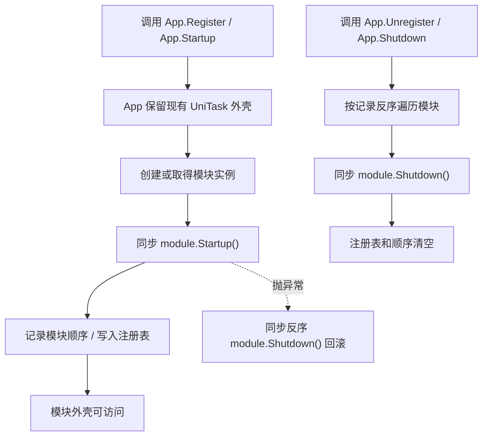

# sync-module-lifecycle-contract design

## 0. 术语约定

| 术语 | 当前定义 | 本次约定 |
|---|---|---|
| 模块生命周期 | `IGameModule.Startup()` / `Shutdown()` 返回 `UniTask`，`App.Register<T>()` / `App.Shutdown()` 通过 `await` 编排 | `IGameModule.Startup()` / `Shutdown()` 改为同步 `void`，只负责同步轻量外壳 |
| 同步外壳 | 当前不是独立概念，部分模块在 `Startup()` 中完成资源、文件、配置等 async ready | 模块可被同步创建和访问的最小状态：字典、队列、driver、默认对象、同步 callback |
| 异步 ready | 当前经常混在模块 `Startup()` / `Shutdown()` 里 | 需要文件、网络、资源、procedure enter/leave、package 初始化等 await 的准备或释放流程，必须迁到显式 async API 或后续 bootstrap |
| 框架级启动 | `App.Startup()` 预加载默认模块并 await 每个模块启动 | 本 feature 只让它调用同步模块生命周期；默认预加载是否保留由后续 `remove-default-preload-startup` 处理 |

防冲突结论：

- 本 feature 不新增 `ModuleDependencyAttribute`，也不实现 `App.GetModule<T>()` 按需依赖解析；它们分别属于后续 `core-dependency-attributes` 和 `app-sync-module-resolver`。
- 本 feature 不把 `ResourceModule.Startup()` 的 manifest/package 初始化完整迁到 `InitializeAsync()`；它只建立同步生命周期边界，显式资源初始化由 `resource-explicit-initialize` 细化。
- 本 feature 不删除 Runtime `Startup.cs`，不删除 App 默认预加载列表，不修复 `TryGetValue<T>()` 裸创建行为；这些是后续切换点。

## 1. 决策与约束

### 需求摘要

做什么：把 Core 中 `IGameModule` / `GameModuleBase` 生命周期契约从 `UniTask Startup()` / `UniTask Shutdown()` 改为 `void Startup()` / `void Shutdown()`，并把现有 Runtime 模块和测试调用迁移到可编译状态。

为谁：后续模块依赖 resolver、`App.Event` 同步访问器、Procedure bootstrap，以及维护 Runtime 模块生命周期的框架开发者。

成功标准：

- `IGameModule` 与 `GameModuleBase` 公开契约为同步 `void Startup()` / `void Shutdown()`。
- 所有实现 `GameModuleBase` 的模块都使用同步生命周期签名。
- `App.Register<T>()`、`App.Unregister<T>()`、`App.Startup()`、`App.Shutdown()` 能调用同步模块生命周期并保持现有框架级 API 兼容。
- 模块 `Startup()` 不再 `await` 文件、网络、资源 manifest/package、procedure enter/leave 等流程。
- 命令行 Runtime 快速编译能通过，现有测试里直接调用模块生命周期的代码不再以 `await module.Startup()` / `.GetAwaiter()` 调用。

### 明确不做

- 不新增依赖 attribute、不读取 attribute、不做依赖递归加载。
- 不改变 `App.Event` / `App.Resource` 等属性的“未注册时报错”语义。
- 不移除 App 默认模块预加载列表和 Runtime `Startup.cs`。
- 不在同步 `Startup()` 或 `Shutdown()` 里用 `.GetAwaiter().GetResult()`、`.Wait()` 或 `UniTask.ToCoroutine()` 阻塞异步任务。
- 不在本 feature 内保证 `ResourceModule`、`FileModule`、`ProcedureModule` 的全部异步准备/关闭语义已经完成最终形态；只保留同步生命周期可编译与明确过渡边界。

### 复杂度档位

走对外发布运行时框架默认档位，偏离点：

- `Compatibility = transitional`：模块生命周期接口是破坏性签名变更，但 `App.Startup()` / `App.Register<T>()` 可暂时保留 `UniTask` 返回值，以减少首步调用侧冲击。
- `Idempotency = idempotent`：模块重复 `Startup()` / `Shutdown()` 的既有 no-op 或清理语义不能因为签名同步化倒退。
- `Determinism = deterministic`：同步生命周期不能隐式 fire-and-forget 影响启动完成判定；需要异步的 ready 必须由显式 API 表达。

### 关键决策

1. Core 生命周期契约一次性改为同步。
   - 这是后续同步属性按需加载的硬前置。
   - `IReference.Release()` 改为直接调用同步 `Shutdown()`，不再 fire-and-forget。

2. `App` 聚合生命周期可以在本 feature 保留 `UniTask` 外壳。
   - 调用方大量 `await App.Register<T>()` / `await App.Shutdown()`；第一步没有必要同时打断所有框架级调用。
   - 内部不再 await 模块生命周期，只在现有并发状态机和失败回滚位置调用同步 `Startup()` / `Shutdown()`。

3. 模块 `Startup()` 只允许同步轻量外壳。
   - 可做：清空/创建字典队列、设置路径字段、创建 Unity driver/root、注册同步 callback、加载 Unity `Resources.Load` 这类同步本地对象。
   - 不可做：await 下载、文件清单读取、资源 manifest 初始化、默认 package 初始化、procedure enter/leave。

4. 被同步契约挤出的 async 工作只做最小过渡，不提前完整设计。
   - `ResourceModule` 的最终 `InitializeAsync()` 属于后续 feature；本 feature 只让 `Startup()` 不再 await。
   - `FileModule` 的 manifest 读取若无法同步表达，应以显式 async 准备或懒加载守卫作为实现阶段选择，但不能在同步生命周期里阻塞。
   - UI/Sound/Network/Procedure 的完整 async teardown 若仍需要等待业务资源释放，应通过已有公开 async API 或后续专门清理流程表达，`Shutdown()` 只做同步取消、清表、断引用和销毁 driver。

### 前置依赖

来自 roadmap 的前置依赖为空。必须遵守 `module-dependency-loading` 第 4.1 节同步模块生命周期契约。

## 2. 名词与编排

### 2.1 名词层

#### 现状

- `Assets/GameDeveloperKit/Runtime/Core/IGameModule.cs` 定义 `UniTask Startup()` / `UniTask Shutdown()`；`IReference.Release()` 默认 `Shutdown().Forget()`。
- `Assets/GameDeveloperKit/Runtime/App.cs` 的框架级 `Startup()`、`Shutdown()`、`Register<T>()`、`Unregister<T>()` 都 `await module.Startup()` / `await module.Shutdown()`。
- 轻量模块如 Timer、Event、Operation、Command、Data、Debug、Combat 的生命周期主体已是同步逻辑，只是返回 `UniTask.CompletedTask`。
- Resource、File、Download、Procedure、UI、Sound、Network 的生命周期含 await：
  - `ResourceModule.Startup()` await manifest 初始化、Builtin/default package 初始化。
  - `FileModule.Startup()` / `Shutdown()` await `VfsManifest.LoadAsync()` / `SaveAsync()`。
  - `DownloadModule.Shutdown()` await `CancelAll()`。
  - `ProcedureModule.Shutdown()` await 当前 procedure `OnLeaveAsync()`。
  - `UIModule.Shutdown()` await pending open、window close 和资源卸载。
  - `SoundModule.Shutdown()` await active source 完成和资源卸载。
  - `NetworkModule.Shutdown()` await channel close。
- 测试代码中存在大量 `await module.Startup()`、`module.Startup().GetAwaiter().GetResult()`、`await module.Shutdown()` 调用。

#### 变化

同步模块契约：

```csharp
namespace GameDeveloperKit
{
    public interface IGameModule : IReference
    {
        void Startup();
        void Shutdown();
    }

    public abstract class GameModuleBase : IGameModule
    {
        public abstract void Startup();
        public abstract void Shutdown();

        void IReference.Release()
        {
            Shutdown();
        }
    }
}
```

模块生命周期示例：

```csharp
public sealed class EventModule : GameModuleBase
{
    public override void Startup()
    {
        BindingGenerated.RegisterAll(this);
        EnsureTimerUpdate();
    }

    public override void Shutdown()
    {
        m_DispatchHandle?.Cancel();
        m_DispatchHandle = null;
        Clear();
    }
}
```

框架级 App 过渡示例：

```csharp
public static UniTask Register<T>() where T : IGameModule, new()
{
    var module = new T();
    module.Startup();
    return UniTask.CompletedTask;
}
```

### 2.2 编排层



#### 现状

- 模块级生命周期和业务异步 ready 混在同一个 `UniTask Startup()` 里，导致 App 属性未来若想同步懒加载模块，会遇到不能 await 的矛盾。
- `IReference.Release()` fire-and-forget 调用 `Shutdown()`，释放方无法知道异步清理是否完成。
- App 默认预加载的存在掩盖了模块间依赖，但第一项不处理依赖声明和 resolver。

#### 变化

1. Core 契约同步化：
   - 所有模块 `Startup()` / `Shutdown()` 签名改为 `void`。
   - `IReference.Release()` 同步调用 `Shutdown()`。

2. App 过渡编排：
   - `Register<T>()` 仍创建模块、加入 `_modules`、调用 `module.Startup()`、记录启动顺序。
   - `Unregister<T>()` 仍移除模块、移除顺序、调用 `module.Shutdown()`。
   - `StartupInternal()` 默认列表暂时保留，只是每个模块注册不再等待模块生命周期。
   - `ShutdownRegisteredModules()` 仍按 `_moduleOrder` 反序关闭，并捕获首个同步异常。

3. 模块实现迁移：
   - 已是同步逻辑的模块直接移除 `UniTask.CompletedTask`。
   - 含 await 的模块需要拆掉生命周期内的 await，改为同步取消/清理/状态复位，或把异步部分留给已有公开 async API / 后续 feature。
   - 对无法在同步 `Startup()` 后立即完成 ready 的模块，公开业务 API 需要保留现有明确错误，或在实现阶段补“未初始化” guard，避免静默空状态。

#### 流程级约束

- 错误语义：同步 `Startup()` 抛异常时，App 仍清理本次已注册模块并透传原异常；同步 `Shutdown()` 抛异常时，App 继续关闭剩余模块并最终抛首个异常。
- 幂等性：已有重复 startup/shutdown no-op 行为要保留；无法保留时要有明确异常而不是半状态。
- 顺序：本 feature 不改变默认模块列表和反序 shutdown 策略。
- 异步边界：同步生命周期禁止阻塞等待 async；所有被迁出的 async ready 必须通过显式 API、现有业务 API 或后续 roadmap 条目承接。
- 可观测点：实现阶段需要能 grep 到模块生命周期签名已无 `UniTask Startup` / `UniTask Shutdown`。

### 2.3 挂载点清单

1. `IGameModule` / `GameModuleBase` 生命周期契约 — 删除或回退后，后续同步 resolver 无法成立。
2. 各 Runtime 模块的 `override void Startup()` / `override void Shutdown()` — 删除或回退后，模块无法实现新的 Core 契约。
3. `App.Register<T>()` / `Unregister<T>()` / 默认启动关闭编排中的同步生命周期调用 — 删除或回退后，框架入口无法驱动同步模块外壳。
4. 生命周期测试调用更新 — 删除或回退后，测试仍按旧 `UniTask` 生命周期编写，无法证明调用侧迁移完成。

拔除沙盘：把 Core 契约和模块签名回退为 `UniTask`，再把 App 内部调用恢复 `await module.Startup()` / `await module.Shutdown()`，本 feature 在系统视角即消失；后续 dependency attribute、resolver 和 startup removal 不属于本 feature，不能作为拔除项。

### 2.4 推进策略

1. Core 契约骨架：先改 `IGameModule` / `GameModuleBase` 为同步签名和同步 `Release()`。
   - 退出信号：Core 中不再引用 `Cysharp.Threading.Tasks` 仅服务模块生命周期。
2. App 过渡接线：让现有 App 注册、默认启动、关闭、回滚调用同步模块生命周期，并保留框架级 `UniTask` 外壳。
   - 退出信号：App 内不再 `await module.Startup()` / `await module.Shutdown()`，但 `await App.Startup()` 仍可编译。
3. 轻量模块签名迁移：迁移 Timer、Event、Operation、Command、Data、Debug、Combat 等同步逻辑模块。
   - 退出信号：这些模块生命周期不再返回 `UniTask.CompletedTask`，重复 startup/shutdown 行为保持。
4. 含 await 模块过渡迁移：处理 Resource、File、Download、Procedure、UI、Sound、Network 的生命周期异步边界。
   - 退出信号：模块生命周期内无 `await`，且不会同步阻塞 async；被迁出的 ready/cleanup 在验收契约里有明确边界说明。
5. 测试调用迁移：把直接模块生命周期调用从 await/getawaiter 改为同步调用，保留 App 级 await 调用的兼容测试。
   - 退出信号：测试源码不再对 `module.Startup()` / `module.Shutdown()` 调用 `await` 或 `.GetAwaiter()`。
6. 编译验证：运行 Runtime 快速编译并修正签名连锁错误。
   - 退出信号：`dotnet build GameDeveloperKit.Runtime.csproj --no-restore` 通过，或记录不可运行原因。

### 2.5 结构健康度与微重构

##### 评估

- compound convention 检索：未命中“目录组织 / 文件归属 / 命名约定 / module lifecycle”相关长期约定。
- 文件级 — `Assets/GameDeveloperKit/Runtime/Core/IGameModule.cs`：文件很小，职责单一，适合直接改契约。
- 文件级 — `Assets/GameDeveloperKit/Runtime/App.cs`：已经聚合注册表、默认启动、状态机、回滚和模块属性，职责偏重；但本 feature 只改生命周期调用方式，不新增 resolver 或 dependency 解析，先不拆。
- 文件级 — `ResourceModule.cs`、`FileModule.cs`、`UIModule.cs`、`SoundModule.cs`、`ProcedureModule.cs`：文件里存在生命周期与业务 async API 混合现象，但本 feature 的目标是签名迁移和边界收口；完整拆分会进入后续 roadmap feature 或单独 refactor。
- 目录级 — `Assets/GameDeveloperKit/Runtime/Core/`：当前 Core 放通用接口和基础类型；本 feature 不新增文件。
- 目录级 — 各模块目录：本 feature 不新增稳定子目录；没有目录重组需求。

##### 结论：不做前置微重构

本次不做“只搬不改行为”的前置微重构。原因是第一项的变更面横跨所有模块，但核心操作是生命周期签名和同步调用迁移；如果同时拆 App 或 Resource/UI/Sound 文件，会把后续 resolver、Resource Initialize、Procedure bootstrap 的边界提前混进来。

##### 超出范围的观察

- `App.cs` 后续实现同步依赖 resolver 时会继续变重，`app-sync-module-resolver` 设计阶段应重新评估是否拆出 resolver helper。
- `ResourceModule` 的启动职责明显偏重，后续 `resource-explicit-initialize` 应专门设计 `InitializeAsync()` 状态机、重复调用和未初始化错误。
- `ProcedureModule.RegisterProcedure()` 当前同步等待 `OnInitializeAsync().GetAwaiter().GetResult()`，这不是本 feature 引入的问题，但与“同步生命周期不阻塞 async”的方向一致，后续 Procedure bootstrap 或单独 issue 应处理。

## 3. 验收契约

| 编号 | 输入 / 触发 | 期望可观察结果 |
|---|---|---|
| N1 | grep `IGameModule` 契约 | `Startup()` / `Shutdown()` 均为 `void`，`Release()` 同步调用 `Shutdown()` |
| N2 | grep Runtime 模块实现 | 不存在 `override UniTask Startup`、`override async UniTask Startup`、`override UniTask Shutdown`、`override async UniTask Shutdown` |
| N3 | 调用 `await App.Register<TimerModule>()` | App 级 API 仍可 await；内部同步启动 TimerModule，`App.Timer` 可访问 |
| N4 | 直接创建 `TimerModule` 并调用 `module.Startup(); module.Shutdown();` | 编译通过，重复启动/关闭仍不抛异常 |
| N5 | `EventModule.Startup()` 在 Timer 已注册时触发 | 仍能注册 Timer update 派发 handle；不需要 await |
| N6 | `ResourceModule.Startup()` 被调用 | 不在生命周期内 await manifest/default package 初始化；若资源未 ready，资源加载 API 应有明确错误而不是静默成功 |
| N7 | `FileModule.Startup()` 被调用 | 不阻塞等待 `VfsManifest.LoadAsync()`；文件公开 API 不应在 manifest 未 ready 时空引用崩溃 |
| N8 | `ProcedureModule.Shutdown()` 被调用且当前流程存在 | 同步 shutdown 不阻塞等待 `OnLeaveAsync()`；若完整离开需要 async，应由显式流程承担 |
| N9 | `App.Shutdown()` 关闭多个模块且其中一个同步 `Shutdown()` 抛异常 | App 继续关闭剩余模块，清空注册表，最终抛出首个异常 |
| B1 | 测试源码中直接调用模块生命周期 | 不再出现 `await module.Startup()`、`module.Startup().GetAwaiter()`、`await module.Shutdown()`、`module.Shutdown().GetAwaiter()` |
| B2 | grep App 内部模块生命周期调用 | 不存在 `await module.Startup()` / `await module.Shutdown()` |
| E1 | 实现中出现 `.GetAwaiter().GetResult()` 或 `.Wait()` 用来适配同步生命周期 | 判定失败；同步生命周期不能阻塞 async |
| E2 | 本 feature 新增 `[ModuleDependency]` 或 `App.GetModule<T>()` resolver | 判定失败；依赖 resolver 属于后续 roadmap 条目 |

明确不做的反向核对项：

- 代码中不应删除 Runtime `Startup.cs`。
- 代码中不应删除 App 默认预加载列表。
- 代码中不应改变 `App.Event` 未注册时报错为按需创建。
- 代码中不应新增 Resource `InitializeAsync()` 的完整状态机作为本 feature 的主要产物。

## 4. 与项目级架构文档的关系

验收通过后需要更新 `.codestable/architecture/ARCHITECTURE.md`：

- 记录 `IGameModule` / `GameModuleBase` 生命周期已改为同步 `void Startup()` / `void Shutdown()`。
- 记录模块 `Startup()` 只负责同步轻量外壳，异步 ready 由显式 API 或 Procedure/bootstrap 编排。
- 暂时保留 App 默认预加载、Runtime `Startup.cs`、Resource 初始化现状的过渡说明，等后续 roadmap 条目落地后再更新为最终架构。
