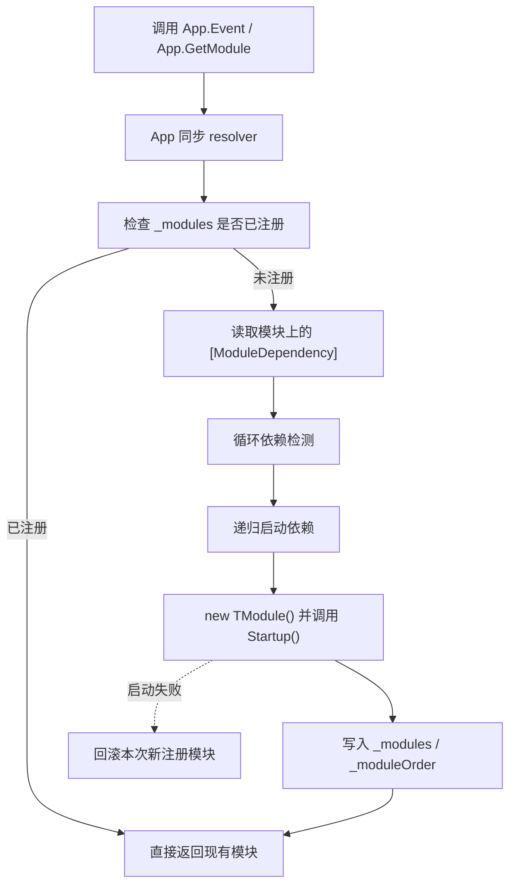

# app-sync-module-resolver design

## 0. 术语约定

| 术语 | 当前定义 | 本次约定 |
|---|---|---|
| resolver | 当前 App 没有统一模块依赖解析器 | App 内部同步模块解析逻辑，负责读取 `[ModuleDependency]`、递归创建依赖和记录启动顺序 |
| 按需获取 | 当前 `App.Event` / `App.Resource` 只是取已注册模块 | `App.GetModule<TModule>()` / 同步属性在模块未注册时会创建并启动模块外壳 |
| 启动顺序 | 当前由固定默认预加载列表维护 | 由 resolver 每次按依赖递归启动并写入 `_moduleOrder`，用于反序关闭 |

防冲突结论：

- 本 feature 不改模块生命周期签名，依赖 `sync-module-lifecycle-contract`。
- 本 feature 不新增或修改 `[ModuleDependency]` 标注，依赖 `core-dependency-attributes`。
- 本 feature 不做 Resource 显式初始化迁移，不做 Procedure bootstrap，不删除 `Startup.cs`。

## 1. 决策与约束

### 需求摘要

做什么：把 App 从固定默认预加载改成同步按需模块 resolver。`App.Event` / `App.Resource` / `App.Timer` 等属性第一次访问时，根据模块类型上的 `[ModuleDependency]` 递归同步创建依赖并返回可用模块；`App.Startup()` 不再塞默认模块列表，`App.TryGetValue<T>()` 不再创建裸模块。

为谁：依赖 App 同步访问语义的运行时调用侧、模块作者、以及后续 `module-dependency-annotations` / `resource-explicit-initialize` / `remove-default-preload-startup`。

成功标准：

- `App.GetModule<TModule>()` 读取 `[ModuleDependency]`，先启动依赖，再启动目标模块。
- `App.Event` / `App.Resource` / `App.Timer` 等同步属性可在未预加载时直接访问到模块。
- `App.Startup()` 不再注册固定默认模块列表。
- `App.TryGetValue<T>()` 不再创建未启动裸模块。
- 循环依赖、缺失依赖和启动失败都有明确 `GameException`。
- Runtime 与 Runtime.Tests 编译通过，并能通过新增测试验证 resolver 最小闭环。

### 明确不做

- 不做 async 版 `GetModuleAsync<T>()`。
- 不做程序集扫描或自动发现所有模块。
- 不做 optional dependency、依赖优先级、模块分组或延迟 ready 语义。
- 不删除 `Startup.cs`，只让其不再承担默认模块预加载。
- 不改 ResourceModule 的完整异步初始化职责。

### 复杂度档位

走运行时框架入口默认档位，无偏离。主要变化是入口语义重排，不新增外部协议。

### 关键决策

1. resolver 放在 `App` 内部。
   - 当前模块入口和模块注册表都在 App，resolver 直接复用 `_modules` / `_moduleOrder` / 生命周期状态机。
   - 不引入额外 façade，避免 `App.Event`、`App.Resource`、`App.Timer` 分流到多处入口。

2. `GetModule<TModule>()` 作为唯一同步按需入口。
   - 同步属性只是 `GetModule<TModule>()` 的强类型别名。
   - 统一入口可减少重复的依赖解析逻辑。

3. 默认预加载移除，但 App 启动状态机保留。
   - `App.Startup()` 仍负责生命周期状态的切换与并发守卫。
   - 只删除固定模块列表，不删除框架启动/关闭的协调壳。

4. `TryGetValue<T>()` 收口为“已注册才返回”。
   - 裸 new 行为会让属性访问与手动获取出现两套语义。
   - resolver 存在后，未注册模块应由 `GetModule<T>()` 统一负责创建。

### 前置依赖

- `sync-module-lifecycle-contract`
- `core-dependency-attributes`

## 2. 名词与编排

### 2.1 名词层

#### 现状

- `Assets/GameDeveloperKit/Runtime/App.cs` 维护 `_modules`、`_moduleOrder`、`StartupInternal()` 固定默认模块列表、`TryGetValue<T>()` 裸创建和 `RegisterDefault<T>()`。
- `App.Event`、`App.Resource`、`App.Timer` 等属性只取已注册模块。
- `Runtime.Tests` 中大量测试直接调用 `App.Register<T>()` 再访问 `App.X`。

#### 变化

App 同步 resolver 入口：

```csharp
public static class App
{
    public static EventModule Event => GetModule<EventModule>();
    public static ResourceModule Resource => GetModule<ResourceModule>();
    public static TimerModule Timer => GetModule<TimerModule>();

    public static TModule GetModule<TModule>()
        where TModule : class, IGameModule, new();

    public static bool TryGetRegistered<TModule>(out TModule module)
        where TModule : class, IGameModule;

    public static bool TryGetValue<TModule>(out TModule module)
        where TModule : class, IGameModule, new();
}
```

模块依赖解析示例：

```csharp
var eventModule = App.GetModule<EventModule>();
var timerModule = App.GetModule<TimerModule>();
```

### 2.2 编排层



#### 现状

- App 通过固定顺序预加载默认模块。
- 依赖关系来自 App 的硬编码顺序，而不是模块自身声明。
- `TryGetValue<T>()` 会在模块未注册时直接 `new T()`，造成裸模块与注册模块并存的语义偏差。

#### 变化

1. `GetModule<TModule>()` 成为唯一同步按需入口。
2. `App.Event` / `App.Resource` 等属性改为调用 `GetModule<TModule>()`。
3. `StartupInternal()` 不再注册固定默认模块列表，只负责框架状态转换。
4. `TryGetValue<T>()` 只返回已注册模块，不再创建未启动实例。
5. resolver 读取 `[ModuleDependency]`，递归启动依赖并记录启动顺序。

#### 流程级约束

- 错误语义：缺失依赖、循环依赖、非法模块类型或启动失败均抛 `GameException`。
- 幂等性：已注册模块重复获取必须返回同一实例；重复 `Register<T>()` 仍应保留“已注册”异常。
- 顺序：依赖模块必须先于目标模块启动，关闭时按 `_moduleOrder` 反序。
- 回滚：本次请求中新创建但目标启动失败的模块需要回滚；请求前已存在模块不能被误关。
- 可观测点：可 grep 到 `App.Event => GetModule<EventModule>()`，以及 `StartupInternal()` 不再包含默认模块列表。

### 2.3 挂载点清单

1. `App.cs` 中的同步属性访问器 — 删除后无法通过 `App.X` 按需取模块。
2. `App.cs` 中的 `GetModule<TModule>()` / resolver 逻辑 — 删除后无法递归启动依赖。
3. `StartupInternal()` 的固定默认模块注册列表 — 删除后默认预加载模型消失。
4. `TryGetValue<T>()` 的裸创建行为 — 删除后不会再产生未启动模块。
5. `Runtime.Tests` 中依赖 App 预加载的测试更新 — 删除后无法验证新 resolver 语义。

### 2.4 推进策略

1. App 同步 resolver 骨架：先把 `GetModule<T>()`、属性别名和注册表查找接好。
   - 退出信号：`App.Event` / `App.Timer` 可在未预加载时解析到模块外壳。
2. 依赖递归：读取 `[ModuleDependency]`，递归启动依赖并写入顺序。
   - 退出信号：`App.Event` 自动带起 `TimerModule`，`App.Resource` 可带起其直接依赖。
3. 循环与失败处理：补循环依赖检测、失败回滚和重复获取幂等。
   - 退出信号：循环依赖抛 `GameException`，启动失败不留下半注册模块。
4. 启动入口清理：移除固定默认模块预加载，收口 `TryGetValue<T>()`。
   - 退出信号：`StartupInternal()` 不再包含 `RegisterDefault<...>()` 列表。
5. 测试迁移与补齐：把依赖于默认预加载的测试改到显式 `GetModule<T>()` 或新的属性访问。
   - 退出信号：Runtime.Tests 覆盖最小闭环和反序关闭。

### 2.5 结构健康度与微重构

##### 评估

- compound convention 检索：未命中“App resolver / 模块依赖 / 目录归属”相关 convention。
- 文件级 — `Assets/GameDeveloperKit/Runtime/App.cs`：同时承担注册表、生命周期状态机、默认预加载、属性入口和测试兼容行为，职责偏重。
- 文件级 — `Assets/GameDeveloperKit/Tests/Runtime/*.cs`：多处测试直接依赖默认预加载，预计需要局部改写，但不需要先拆测试目录。
- 目录级 — `Assets/GameDeveloperKit/Runtime/`：本 feature 不新增新子目录，只重排 App 内部职责。

##### 结论：不做前置微重构

`App.cs` 虽然偏重，但这次的结构变化就是要把默认预加载收回到 resolver，拆文件反而会把行为和结构变化一起放大，不利于回滚。先在一个文件内完成语义迁移。

## 3. 验收契约

| 编号 | 输入 / 触发 | 期望可观察结果 |
|---|---|---|
| N1 | 调用 `App.GetModule<EventModule>()`，且 `EventModule` 带 `ModuleDependency(typeof(TimerModule))` | 自动先启动 `TimerModule` 再启动 `EventModule`，返回可用 EventModule |
| N2 | 访问 `App.Event`、`App.Resource`、`App.Timer` | 返回对应已创建模块实例，不依赖固定预加载列表 |
| N3 | `App.TryGetValue<T>()` 在模块未注册时调用 | 不再创建裸模块，只返回已注册实例语义 |
| N4 | `App.Startup()` 执行后未显式访问任何模块 | `_modules` 不包含固定默认预加载模块 |
| N5 | 存在循环依赖 attribute | 抛 `GameException`，错误信息包含依赖链 |
| N6 | 依赖模块启动失败 | 本次新建模块回滚，注册表不留下半注册状态 |
| B1 | grep `StartupInternal()` | 不再存在固定默认模块注册列表 |
| B2 | grep `App.Event` / `App.Resource` / `App.Timer` | 属性改为 resolver 入口而非已注册取值 |
| B3 | Runtime / Runtime.Tests 编译 | `dotnet build` 通过 |

明确不做的反向核对项：

- 代码中不应保留固定默认模块列表。
- 代码中不应出现 `TryGetValue<T>()` 的裸 new 行为。
- 代码中不应出现 attribute 自动扫描。

## 4. 与项目级架构文档的关系

验收通过后需要更新 `.codestable/architecture/ARCHITECTURE.md`：

- 把 `App` 的入口语义更新为“同步按需 resolver + 已注册访问 + 默认预加载移除”。
- 记录 `ModuleDependencyAttribute` 已成为 App 按需启动的实际消费契约。
- 记录 `Startup.cs` 仍存在但不再承担默认模块预加载。
