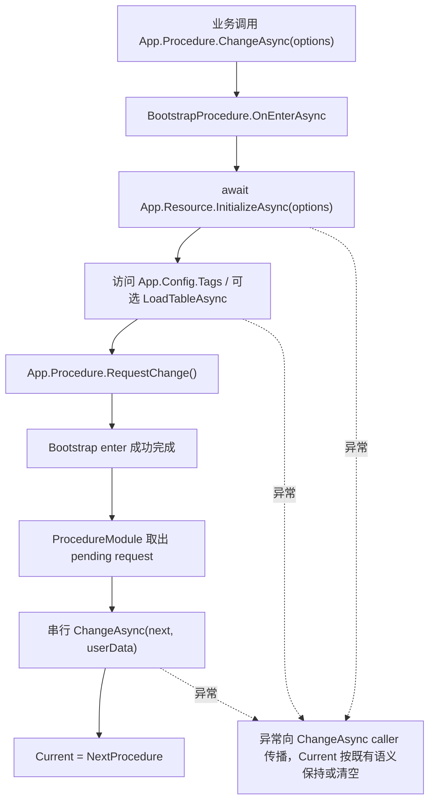

# procedure-bootstrap-flow design

## 0. 术语约定

| 术语 | 当前定义 | 本次约定 |
|---|---|---|
| 启动 Procedure | 当前没有内建 `BootstrapProcedure` 类型；业务可以自定义 `ProcedureBase` 并在 `OnEnterAsync` 内执行异步准备 | 启动 Procedure 是业务自定义流程，不由框架固定内建；框架提供可安全从当前流程请求下一个流程的机制 |
| 后续流程请求 | 当前 `OnEnterAsync` 内直接调用 `ChangeAsync<T>()` 会命中 `IsChanging` 并抛错 | 新增 `RequestChange<TProcedure>(userData)`，允许当前流程在 enter / leave 切换期间请求后续切换，由 `ProcedureModule` 在当前切换结束后串行执行 |
| Resource ready | `App.Resource` 只创建同步外壳，`InitializeAsync(options)` 才完成 manifest / mode / package ready | 启动 Procedure 中显式 `await App.Resource.InitializeAsync(options)` 后，才进入依赖资源的业务 Procedure |
| Config / Tag 准备 | `ConfigModule.Startup()` 同步 `Resources.Load<TagCatalogAsset>`，没有 `LoadTagCatalogAsync()` | 启动 Procedure 可访问 `App.Config.Tags` / `HasTag` 验证同步外壳；异步配置表由业务显式 `LoadTableAsync<TRow>()` |

防冲突结论：

- 本 feature 不新增内建固定 `BootstrapProcedure` 类型，不替业务决定 Login / MainMenu / UpdateCheck 的流程名。
- 本 feature 不删除 `Startup.cs`。
- 本 feature 不新增 `ConfigModule.LoadTagCatalogAsync()`；roadmap 示例已改为当前 `ConfigModule.Startup()` 语义。
- 本 feature 不放宽 `ChangeAsync()` 的重入保护；重入直接切换继续抛错，安全路径是 `RequestChange()`。

## 1. 决策与约束

### 需求摘要

做什么：给 `ProcedureModule` 增加“请求后续流程”的同步 API，让启动 Procedure 可以在 `OnEnterAsync` 中完成 `await App.Resource.InitializeAsync()`，然后请求进入业务 Procedure；补一组测试示例证明 Resource ready、Config/Tag 同步访问和后续流程切换的编排方式。

为谁：后续删除 `Startup.cs` / 默认预加载前，需要一个明确承载异步 ready 的运行时流程约定，让业务知道“模块外壳由 App 同步按需创建，资源等 ready 由启动 Procedure 显式 await”。

成功标准：

- `BootstrapProcedure.OnEnterAsync` 中 `await App.Resource.InitializeAsync(options)` 可完成资源 ready。
- `OnEnterAsync` 中调用 `App.Procedure.RequestChange<NextProcedure>()` 不触发 `ChangeAsync` 重入异常。
- 当前 bootstrap enter 完成后，`ProcedureModule` 串行进入请求的 next procedure。
- next procedure 进入时 `App.Resource.IsInitialized == true`，并可访问 `App.Config.Tags`。
- 直接在 `OnEnterAsync` 中调用 `ChangeAsync<T>()` 仍抛 `GameException`，保护现有重入语义。
- `RequestChange()` 在非切换期间调用会抛明确 `GameException`，避免留下无人消费的 pending request。

### 明确不做

- 不提供框架内建固定 `BootstrapProcedure`、`LoginProcedure` 或场景模板。
- 不删除 `Startup.cs`，也不修改 Unity scene bootstrap 行为。
- 不让 `App.Startup()` 自动进入任何 Procedure。
- 不新增 `GetModuleAsync<T>()` 或在 `App.X` 属性中隐式等待 async ready。
- 不新增 `ConfigModule.LoadTagCatalogAsync()`；TagCatalog 仍由 ConfigModule 同步 Startup 读取。
- 不做 Procedure Timer driver 收敛；那属于 `runtime-scheduling-diagnostics` roadmap。

### 复杂度档位

走运行时模块默认档位，偏 `Robustness = L2`：需要覆盖请求切换的顺序、重入保护、重复请求边界和 bootstrap 失败不吞异常。

### 关键决策

1. 新增 `RequestChange<TProcedure>()` 而不是放宽 `ChangeAsync()` 重入。
   - `ChangeAsync()` 当前用 `IsChanging` 防止 enter / leave 中嵌套切换破坏状态。
   - 启动 Procedure 的需求是“当前 enter 成功后再切到下一个流程”，属于排队请求，不是立即重入。

2. 请求只保留最后一次。
   - 一个 Procedure 同一轮 enter / leave 多次请求后续流程时，最后一次代表最终意图。
   - 首版不做队列，避免出现一个流程连续跳多个中间态。

3. Bootstrap 示例落在测试里，不新增业务示例目录。
   - 框架不替业务定义 Login/MainMenu。
   - 测试能给后续实现提供可编译契约，也不引入 Unity 资产或场景文件。

4. Config / Tag 当前只验证同步可访问。
   - `ConfigModule.Startup()` 已加载 TagCatalog 快照，缺失资产时为空目录。
   - 异步配置表加载仍由业务选择具体 `IConfig` row 后调用 `LoadTableAsync<TRow>()`，本 feature 不新增聚合加载 API。

## 2. 名词与编排

### 2.1 名词层

#### 现状

- `ProcedureModule.ChangeAsync(Type, object)` 在 `IsChanging == true` 时抛 `GameException("ProcedureModule is already changing procedure.")`。
- `ProcedureBase.OnEnterAsync(previous, userData)` 是启动 Procedure 承载异步 ready 的自然位置，但在这里直接 `await App.Procedure.ChangeAsync<Next>()` 会重入失败。
- `ResourceModule.InitializeAsync(options)` 已是显式 Resource ready 入口。
- `ConfigModule.Tags` / `HasTag` 已由同步 `Startup()` 准备，没有异步 tag catalog API。

#### 变化

新增后续流程请求值：

```csharp
internal readonly struct ProcedureChangeRequest
{
    public Type ProcedureType { get; }
    public object UserData { get; }
}
```

`ProcedureModule` 对外新增契约：

```csharp
public sealed class ProcedureModule : GameModuleBase
{
    public bool HasPendingChange { get; }
    public Type PendingChangeType { get; }

    public void RequestChange<TProcedure>(object userData = null)
        where TProcedure : ProcedureBase;

    public void RequestChange(Type procedureType, object userData = null);

    public void ClearPendingChange();
}
```

接口示例：

```csharp
public sealed class BootstrapProcedure : ProcedureBase
{
    public override async UniTask OnEnterAsync(ProcedureBase previous, object userData)
    {
        await App.Resource.InitializeAsync((ResourceInitializeOptions)userData);
        _ = App.Config.Tags;

        App.Procedure.RequestChange<LoginProcedure>();
    }
}
```

### 2.2 编排层



#### 现状

- `ChangeAsync()` 是单次切换状态机：校验 type → `IsChanging = true` → 创建/初始化 next → leave previous → enter next → `Current = next` → `IsChanging = false`。
- `OnEnterAsync` 内直接调用 `ChangeAsync()` 被 `IsChanging` 拦截，测试 `ChangeAsync_WhenProcedureReenters_ThrowsAndDoesNotStartSecondChange` 已覆盖。
- 业务可以在外部顺序 `await ChangeAsync<Bootstrap>(); await ChangeAsync<Login>();`，但 bootstrap 自己无法表达“我准备完后进入 Login”。

#### 变化

1. `RequestChange(type, userData)`：
   - 校验 `procedureType` 必须继承 `ProcedureBase` 且非抽象 / 泛型。
   - 只能在 `IsChanging == true` 时调用；否则抛 `GameException`。
   - 写入单个 pending request。
   - 不立即启动切换，不 await，不修改 `Current`。

2. `ChangeAsync(type, userData)` 成功 enter 当前 next 后：
   - 设置 `Current = next`。
   - 退出当前 `IsChanging` 区段。
   - 如果存在 pending request，清空 pending 并串行调用 `ChangeAsync(pending.Type, pending.UserData)`。
   - 若 pending 目标就是当前流程，沿用现有 no-op 行为。

3. 失败处理：
   - `OnEnterAsync` 失败时 pending request 清空，不进入后续流程。
   - 后续流程 enter 失败时异常向最初 `ChangeAsync<Bootstrap>()` 调用方传播；`Current` 按现有 enter 失败语义清空。
   - 直接重入 `ChangeAsync()` 仍抛错。

#### 流程级约束

- 顺序：bootstrap enter 完成后才能处理 pending request，避免当前流程半 ready 时切走。
- 幂等：pending request 只保留最后一次；`ClearPendingChange()` 可显式取消。
- 错误语义：request 本身只做类型校验；真正切换失败由后续 `ChangeAsync()` 抛出。
- 调用边界：非切换期间调用 `RequestChange()` 抛错，业务在外部要立即切换时仍应 `await ChangeAsync<T>()`。
- 边界：`RequestChange()` 只处理 Procedure 切换，不负责 Resource / Config 的 ready 判断。
- 可观测点：`HasPendingChange` / `PendingChangeType` 供测试和诊断读取。

### 2.3 挂载点清单

1. `ProcedureModule.RequestChange<TProcedure>()` / `RequestChange(Type, object)`：删除后 bootstrap 无法在 enter 内安全声明后续流程。
2. `ProcedureModule` pending change 状态：删除后无法串行排空后续切换，也无法测试观察。
3. `ProcedureModule.ChangeAsync()` drain pending request：删除后请求不会生效。
4. `ProcedureModuleTests` bootstrap 场景：删除后 roadmap 示例缺少可编译证据。

### 2.4 推进策略

1. Pending request 契约骨架：新增 `RequestChange` / `ClearPendingChange` / 状态属性。
   - 退出信号：切换期间请求后 `HasPendingChange == true` 且 `PendingChangeType` 正确。
2. ChangeAsync drain 编排：在切换成功后串行消费 pending request。
   - 退出信号：BootstrapProcedure 请求 Next 后，最终 Current 为 Next。
3. Bootstrap resource/config 场景：用测试 procedure 显式初始化 Resource 并访问 Config Tags。
   - 退出信号：NextProcedure 进入时 Resource 已 initialized，Config.Tags 可访问。
4. 错误与边界收口：覆盖直接重入仍抛、enter 失败不进入 pending、重复 request last-wins。
   - 退出信号：关键错误场景有测试证据。
5. 编译验证：运行 Runtime 与 Runtime.Tests 快速编译。
   - 退出信号：两个 dotnet build 均通过，或记录不可运行原因。

### 2.5 结构健康度与微重构

##### 评估

- compound convention 检索：未命中 Procedure bootstrap / 目录组织相关 convention。
- 文件级 — `Assets/GameDeveloperKit/Runtime/Procedure/ProcedureModule.cs`：约 354 行，当前集中承担 procedure registry、change 状态机和 runtime driver；本 feature 改的是 change 状态机自然扩展，不引入第二职责。
- 文件级 — `Assets/GameDeveloperKit/Tests/Runtime/ProcedureModuleTests.cs`：已有 Procedure 行为测试，新增 bootstrap 场景属于同一测试主题。
- 目录级 — `Assets/GameDeveloperKit/Runtime/Procedure/`：当前 3 个 C# 文件，本次不需要新增 runtime 文件。

##### 结论：不做前置微重构

本 feature 不拆 `ProcedureModule.cs`。原因是 pending request 与 `ChangeAsync()` 状态机强相关，拆文件会增加 partial 分散度但不能降低本次风险。若后续 Procedure Timer consumer 继续改 driver / diagnostics，再单独评估拆分 runtime driver 或 diagnostics 文件。

## 3. 验收契约

| 编号 | 输入 / 触发 | 期望可观察结果 |
|---|---|---|
| N1 | BootstrapProcedure 的 `OnEnterAsync` 中调用 `RequestChange<NextProcedure>("next")` | enter 期间 `HasPendingChange == true`，`PendingChangeType == typeof(NextProcedure)` |
| N2 | BootstrapProcedure 的 `OnEnterAsync` 中请求 NextProcedure | `await ChangeAsync<BootstrapProcedure>()` 返回后 `Current` 为 NextProcedure |
| N3 | BootstrapProcedure 先 `await App.Resource.InitializeAsync(options)` 再请求 NextProcedure | NextProcedure 进入时 `App.Resource.IsInitialized == true` |
| N4 | BootstrapProcedure 访问 `App.Config.Tags` | 不需要 `LoadTagCatalogAsync()`，Config 同步外壳可访问 |
| N5 | 同一轮多次 `RequestChange()` | 最后一次请求生效 |
| N6 | `OnEnterAsync` 中直接调用 `ChangeAsync<NextProcedure>()` | 仍抛 `GameException`，不启动第二次切换 |
| N7 | BootstrapProcedure enter 在 Resource 初始化阶段失败 | pending request 被清空，不进入 NextProcedure，异常向调用方传播 |
| N8 | 非切换期间调用 `RequestChange<NextProcedure>()` | 抛 `GameException`，pending request 保持为空 |
| B1 | grep `LoadTagCatalogAsync` | runtime 不新增该 API |
| B2 | grep `Startup.cs` 删除 / 修改 | 本 feature 不删除或改 Startup 脚本 |
| B3 | Runtime / Runtime.Tests 编译 | `dotnet build` 通过 |

反向核对项：

- 不新增内建固定 `BootstrapProcedure` / `LoginProcedure` runtime 类型。
- 不让 `App.Startup()` 自动切换 Procedure。
- 不在 `App.X` 属性里隐式等待 Resource 初始化。
- 不放宽 `ChangeAsync()` 的重入保护。

## 4. 与项目级架构文档的关系

验收通过后需要更新 `.codestable/architecture/ARCHITECTURE.md`：

- Procedure 小节记录 `RequestChange<TProcedure>()` 是 enter / leave 切换期间请求后续切换的安全入口。
- 已知约束记录启动 Procedure 应显式 await Resource ready，再请求进入业务 Procedure；直接重入 `ChangeAsync()` 仍禁止。
- Resource / App 模块语义无需新增，沿用上一条 feature 的显式 ready 和同步外壳记录。
