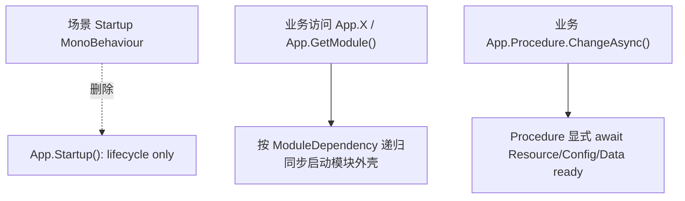

# remove-default-preload-startup design

## 0. 术语约定

| 术语 | 当前定义 | 本次约定 |
|---|---|---|
| Runtime Startup 脚本 | `Assets/GameDeveloperKit/Runtime/Startup.cs` 中的 `Startup : MonoBehaviour`，Awake 持久化、Start 调 `App.Startup()`、Destroy/Quit 调 `App.Shutdown()` | 本次删除该脚本；框架不再提供场景 MonoBehaviour 默认入口 |
| App.Startup | `App.Startup()` 当前只切换 App lifecycle，不预加载默认模块 | 保留该 API 兼容测试和手动生命周期控制，但它不再有 Runtime `Startup` 场景脚本调用 |
| 默认预加载 | 历史 `StartupInternal()` 固定注册默认模块 | 已在 `app-sync-module-resolver` 中删除；本次只反向核对无回归 |
| TryGetValue 裸创建 | 历史 `TryGetValue<T>()` 未注册时创建模块 | 已收口为 `TryGetRegistered`；本次只反向核对无回归 |

防冲突结论：

- 本 feature 删除 `Startup.cs`，但不删除 `App.Startup()` / `App.Shutdown()`。
- 本 feature 不新增新的 Unity bootstrap MonoBehaviour 替代品。
- 本 feature 不让 `App.Startup()` 自动进入 Procedure；业务需要自行 `App.Procedure.ChangeAsync<BootstrapProcedure>()`。
- 本 feature 不手写 `.meta`，但删除已有 `Startup.cs.meta` 以避免孤儿资产。

## 1. 决策与约束

### 需求摘要

做什么：删除 Runtime `Startup.cs` MonoBehaviour、移除 `GameDeveloperKit.Runtime.csproj` 对该脚本的编译引用，并更新架构/roadmap 状态；同时核对 App 默认预加载列表与 `TryGetValue<T>()` 裸创建行为没有回归。

为谁：框架维护者和业务接入者。新的启动模型是 `App.GetModule<T>()` / `App.X` 同步按需创建模块外壳，异步 ready 由业务 Procedure/bootstrap 显式编排，不再靠场景脚本统一拉起默认模块。

成功标准：

- `Assets/GameDeveloperKit/Runtime/Startup.cs` 和对应 `.meta` 删除。
- `GameDeveloperKit.Runtime.csproj` 不再引用 `Startup.cs`。
- `App.Startup()` 保留且不注册默认模块。
- `TryGetValue<T>()` 未注册时不创建模块。
- 架构文档不再描述 Runtime `Startup.cs` 仍存在。
- Runtime 与 Runtime.Tests 编译通过。

### 明确不做

- 不删除或改名 `App.Startup()` / `App.Shutdown()`。
- 不新增 `BootstrapBehaviour`、`StartupProcedureRunner` 或其他场景组件替代品。
- 不修改 Unity scene / prefab / ProjectSettings。
- 不把业务 BootstrapProcedure 固化到框架。
- 不清理历史 feature / audit 文档中关于旧 Startup 的原始记录。

### 复杂度档位

走运行时模块默认档位，偏 `Change = L1`：主要是删除旧入口与文档回写，风险在编译引用和现状文档描述不一致。

### 关键决策

1. 删除 Runtime MonoBehaviour，不替换。
   - roadmap 已用 Procedure bootstrap 承接异步启动链路。
   - 新增替代组件会让新旧启动模型继续并存。

2. 保留 `App.Startup()`。
   - 现有测试和外部调用仍可能用它切换 App lifecycle。
   - 它不再预加载模块，保留不会破坏按需 resolver 模型。

3. 不改 Unity serialized 场景。
   - 仓库当前没有明确目标场景引用需要迁移。
   - 修改 scene/prefab 风险高，且 roadmap 目标是移除框架默认脚本，不是自动编辑业务场景。

## 2. 名词与编排

### 2.1 名词层

#### 现状

- `Assets/GameDeveloperKit/Runtime/Startup.cs` 定义 `public sealed class Startup : MonoBehaviour`。
- `GameDeveloperKit.Runtime.csproj` 包含 `<Compile Include="Assets\GameDeveloperKit\Runtime\Startup.cs" />`。
- `App.Startup()` 当前没有默认模块列表，`StartupInternal()` 只切换 lifecycle 状态。
- `App.TryGetValue<T>()` 当前直接 `return TryGetRegistered(out module);`。

#### 变化

删除 Runtime Startup 脚本：

```text
Assets/GameDeveloperKit/Runtime/Startup.cs
Assets/GameDeveloperKit/Runtime/Startup.cs.meta
```

移除工程引用：

```xml
<!-- GameDeveloperKit.Runtime.csproj -->
<Compile Include="Assets\GameDeveloperKit\Runtime\Startup.cs" />
```

保留的 App 契约：

```csharp
public static UniTask Startup();
public static UniTask Shutdown();
public static bool TryGetValue<T>(out T module) where T : class, IGameModule, new();
```

### 2.2 编排层



#### 现状

- Runtime `Startup` 脚本还存在，会在 Unity `Start()` 中调用 `App.Startup().Forget()`。
- 由于 `App.Startup()` 已不预加载默认模块，这个脚本不再提供实际模块 ready，只剩生命周期状态切换和 shutdown 桥接。
- 真实模块可用性已经由 `App.GetModule<T>()` 同步按需 resolver 与 Procedure bootstrap 承接。

#### 变化

1. 删除 `Startup.cs` / `.meta`。
2. 移除 csproj 编译引用。
3. 保持 `App.Startup()` 不预加载默认模块。
4. 保持 `TryGetValue<T>()` 已注册查询语义。
5. 架构文档改为“Runtime `Startup.cs` 已删除；业务自行调用 App lifecycle / Procedure bootstrap”。

#### 流程级约束

- 错误语义：场景里若仍挂着旧脚本 GUID，Unity 会显示 missing script；本 feature 不自动改 serialized 场景。
- 边界：删除 Runtime `Startup.cs` 不等于删除 App lifecycle API。
- 顺序：业务应先根据自身入口调用 `App.Procedure.ChangeAsync<BootstrapProcedure>()` 或直接访问所需 `App.X`，不依赖框架自动启动。
- 可观测点：grep `Startup.cs` 编译引用无命中；`AppModuleResolverTests` 继续证明 `App.Startup()` 不预加载、`TryGetValue` 不创建。

### 2.3 挂载点清单

1. `Assets/GameDeveloperKit/Runtime/Startup.cs`：删除后场景 MonoBehaviour 默认入口消失。
2. `Assets/GameDeveloperKit/Runtime/Startup.cs.meta`：删除后 Unity 资产引用不再保留孤儿 meta。
3. `GameDeveloperKit.Runtime.csproj` 编译项：删除后 IDE / dotnet build 不再引用缺失脚本。
4. `.codestable/architecture/ARCHITECTURE.md`：更新系统现状，删除“Startup.cs 仍存在”的描述。

### 2.4 推进策略

1. 删除 Runtime Startup 资产：移除 `Startup.cs` 与 `.meta`。
   - 退出信号：`Test-Path Assets/GameDeveloperKit/Runtime/Startup.cs` 为 false。
2. 工程引用收口：移除 csproj 中 `Startup.cs` 编译项。
   - 退出信号：grep `Startup.cs` 在 Runtime csproj 无命中。
3. 行为回归核对：确认 `App.Startup()` 不预加载、`TryGetValue` 不创建。
   - 退出信号：现有 `AppModuleResolverTests` 仍能编译覆盖。
4. 文档回写：更新 architecture 和 roadmap。
   - 退出信号：architecture 不再描述 Runtime `Startup.cs` 仍存在，roadmap 条目可验收。
5. 编译验证：运行 Runtime 与 Runtime.Tests 快速编译。
   - 退出信号：两个 dotnet build 均通过，或记录不可运行原因。

### 2.5 结构健康度与微重构

##### 评估

- compound convention 检索：未命中 Startup 删除 / 目录组织相关 convention。
- 文件级 — `Assets/GameDeveloperKit/Runtime/App.cs`：本 feature 只核对既有 resolver 行为，不需要修改 App 状态机。
- 文件级 — `GameDeveloperKit.Runtime.csproj`：工程引用是生成 IDE 文件，但当前 dotnet build 依赖它；删除源码后必须同步删除缺失 compile include。
- 目录级 — `Assets/GameDeveloperKit/Runtime/`：本次删除文件，不新增 runtime 文件。

##### 结论：不做前置微重构

本 feature 不重构 App lifecycle 或 Runtime 目录。默认预加载和 `TryGetValue` 裸创建已经在前置 feature 收口；本次只做旧 Unity 入口删除和文档/工程引用收尾。

## 3. 验收契约

| 编号 | 输入 / 触发 | 期望可观察结果 |
|---|---|---|
| N1 | 检查 `Assets/GameDeveloperKit/Runtime/Startup.cs` | 文件不存在 |
| N2 | 检查 `Assets/GameDeveloperKit/Runtime/Startup.cs.meta` | 文件不存在 |
| N3 | grep `GameDeveloperKit.Runtime.csproj` | 不再引用 `Startup.cs` |
| N4 | 调用 `App.Startup()` 后未访问模块 | 不注册 Event / Timer 等默认模块 |
| N5 | 调用 `App.TryGetValue<TimerModule>(out module)` 且未注册 | 返回 false，module 为 null，不创建模块 |
| B1 | grep `RegisterDefault` / 默认预加载列表 | runtime 无命中 |
| B2 | grep `class Startup : MonoBehaviour` | runtime 无命中 |
| B3 | Runtime / Runtime.Tests 编译 | `dotnet build` 通过 |

反向核对项：

- 不删除 `App.Startup()` / `App.Shutdown()`。
- 不新增替代 MonoBehaviour bootstrap。
- 不修改 scene / prefab / ProjectSettings。
- 不把业务 BootstrapProcedure 固化到框架。

## 4. 与项目级架构文档的关系

验收通过后需要更新 `.codestable/architecture/ARCHITECTURE.md`：

- Module Lifecycle / App Module Resolver 现状改为 Runtime `Startup.cs` 已删除。
- 已知约束记录框架不再提供场景 MonoBehaviour 默认入口；业务入口需自行调用 App lifecycle / Procedure bootstrap。
- 变更日志追加 Startup Removal 记录。
